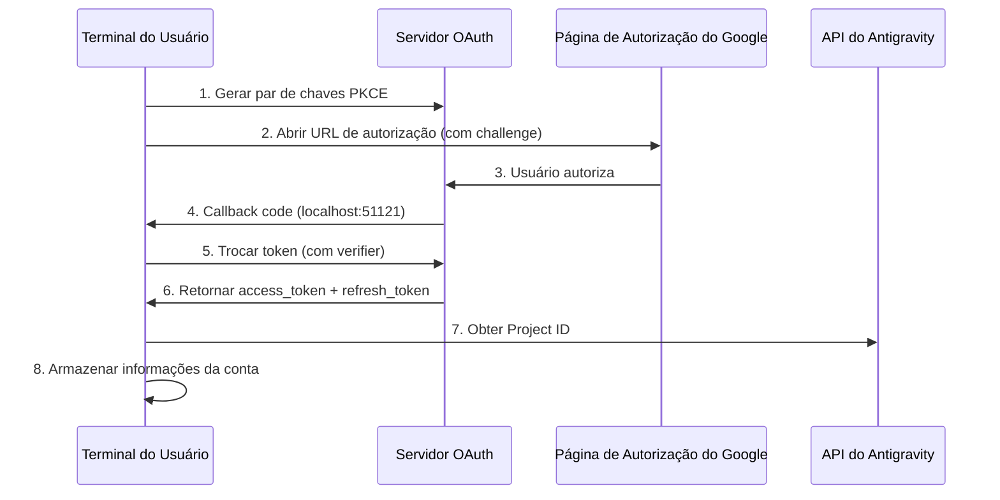

# Autenticação OAuth 2.0 PKCE: Concluir o Primeiro Login

## O Que Você Vai Aprender

- Compreender o mecanismo de segurança do fluxo de autenticação OAuth 2.0 PKCE
- Concluir o primeiro login do plugin e obter acesso à API do Antigravity
- Entender o mecanismo automático de obtenção e armazenamento do Project ID
- Entender o processamento automático de atualização de tokens

## Seu Dilema Atual

Você já instalou o plugin e configurou as definições de modelo, mas ainda não o utilizou de verdade. Sempre que executa `opencode run`, recebe a mensagem "autenticação necessária", mas você não sabe:

- O que é OAuth? Por que usar um método de autenticação tão complexo?
- O que acontece durante o processo de autenticação? É seguro?
- O que preparar para o primeiro login? Quais opções estarão disponíveis?
- O que fazer quando o token expirar? Preciso fazer login novamente?

## Quando Usar Este Método

- **Após a primeira instalação do plugin**: É necessário concluir a autenticação antes do primeiro uso
- **Ao adicionar uma nova conta**: Ao configurar rotação de múltiplas contas, é necessário autenticar cada uma
- **Após a invalidação do token**: Se a conta for revogada ou a senha alterada, é necessário autenticar novamente
- **Ao mudar para um novo dispositivo**: Ao migrar a conta, é necessário fazer login novamente no novo dispositivo

## 🎒 Preparação Antes de Começar

::: warning Verificação de Pré-requisitos

Confirme se você completou as seguintes etapas:

1. **Plugin instalado**: Consulte [Instalação Rápida](/pt/NoeFabris/opencode-antigravity-auth/start/quick-install/)
2. **Modelo configurado**: As definições do modelo foram adicionadas ao `~/.config/opencode/opencode.json`
3. **Conta Google disponível**: Recomenda-se usar uma conta já estabelecida e confiável, evitando contas recém-criadas

:::

## Ideia Central

### O Que É OAuth 2.0 PKCE?

**OAuth 2.0** (Open Authorization 2.0) é um protocolo de autorização que permite que aplicativos de terceiros (este plugin) obtenham acesso à API do Google sem obter diretamente a senha do usuário.

**PKCE** (Proof Key for Code Exchange) é uma extensão de segurança do OAuth 2.0, projetada especificamente para clientes públicos (como ferramentas CLI). Ele impede ataques de interceptação de código de autorização através dos seguintes mecanismos:

```
┌─────────────────────────────────────────────────────────────────┐
│  Mecanismo de Proteção PKCE                                    │
├─────────────────────────────────────────────────────────────────┤
│  1. O cliente gera um par de chaves:                           │
│     - code_verifier (string aleatória, confidencial)            │
│     - code_challenge (hash do verifier, público)                │
│  2. A URL de autorização contém code_challenge                  │
│  3. O servidor de callback recebe o code e verifica com verifier │
│  4. Mesmo que o atacante intercepte o code, sem o verifier      │
│     não consegue trocar pelo token                               │
└─────────────────────────────────────────────────────────────────┘
```

::: info

**PKCE vs OAuth Tradicional**

O OAuth tradicional usa `client_secret` para verificar a identidade, mas isso exige que o cliente possa armazenar a chave com segurança. Ferramentas CLI não conseguem fazer isso, então o PKCE usa um `verifier` gerado dinamicamente em vez de uma chave estática, igualmente seguro sem depender de segredos pré-armazenados.

:::

### Visão Geral do Fluxo de Autenticação



## Siga Meus Passos

### Passo 1: Iniciar o Login OAuth

**Por que**

O comando `opencode auth login` inicia um servidor OAuth local, gera a URL de autorização e aguarda o callback do Google.

**Executar comando**:

```bash
opencode auth login
```

**O que você deve ver**:

```
🔑 Initializing Antigravity OAuth...
📋 Starting local OAuth server on http://127.0.0.1:51121
🌐 Opening browser for authorization...

If the browser doesn't open, visit this URL manually:
https://accounts.google.com/o/oauth2/v2/auth?client_id=...&code_challenge=...
```

::: tip

**Detecção de Ambiente**

O plugin detecta automaticamente o ambiente de execução:

| Ambiente | Endereço de Bind | Motivo |
|--- | --- | ---|
| macOS/Linux/Windows local | `127.0.0.1` | Mais seguro, aceita apenas conexões locais |
| WSL / Docker / SSH remoto | `0.0.0.0` | Permite que o navegador acesse a partir do host |

Você pode substituir a configuração padrão através da variável de ambiente `OPENCODE_ANTIGRAVITY_OAUTH_BIND`.

:::

### Passo 2: Autorizar no Navegador

**Por que**

A página de autorização do Google exibirá as permissões (Scope) solicitadas pelo plugin, exigindo sua aprovação explícita.

**O que você verá**:

Página de autorização OAuth do Google, exibindo:
- Solicitante: Plugin Antigravity Auth
- Permissões solicitadas:
  - Ver seu endereço de e-mail
  - Ver suas informações de perfil
  - Acessar seus projetos do Cloud Platform
  - Acessar logs e configurações de experimentos do Google Cloud

**Ação**:

1. Confirme se as permissões solicitadas correspondem às expectativas (sem permissões sensíveis fora do escopo)
2. Clique no botão "Permitir" ou "Autorizar"
3. Aguarde a página redirecionar para `http://localhost:51121/oauth-callback`

**O que você deve ver**:

```html
<!DOCTYPE html>
<html>
  <!-- ... -->
  <h1>All set!</h1>
  <p>You've successfully authenticated with Antigravity.</p>
  <!-- ... -->
</html>
```

::: warning

**Problema de Fechamento da Página de Autorização**

Se o navegador não fechar automaticamente após a autorização bem-sucedida, basta fechar manualmente a aba. Esta é uma restrição de segurança do navegador e não afeta o resultado da autenticação.

:::

### Passo 3: Troca Automática de Token e Obtenção do Project ID

**Por que**

O código de autorização é apenas uma credencial temporária que precisa ser trocada por um `refresh_token` de longo prazo, ao mesmo tempo em que obtém o `Project ID` necessário para o projeto Antigravity.

**Ocorre automaticamente em segundo plano**:

O plugin executará automaticamente as seguintes operações (sem sua intervenção):

1. **Verificar PKCE**: Usar `code_verifier` para verificar a validade do código de autorização
2. **Trocar token**: Enviar requisição POST para `oauth2.googleapis.com/token`

   ```typescript
   // Fonte: src/antigravity/oauth.ts:209
   POST https://oauth2.googleapis.com/token
   Content-Type: application/x-www-form-urlencoded

   {
     client_id: "...",
     client_secret: "...",
     code: "código de autorização",
     grant_type: "authorization_code",
     redirect_uri: "http://localhost:51121/oauth-callback",
     code_verifier: "PKCE verifier"
   }
   ```

3. **Obter informações do usuário**: Verificar o endereço de e-mail

   ```typescript
   // Fonte: src/antigravity/oauth.ts:231
   GET https://www.googleapis.com/oauth2/v1/userinfo?alt=json
   Authorization: Bearer {access_token}
   ```

4. **Obter automaticamente o Project ID**: Tentar obter seu ID de projeto a partir da API do Antigravity

   ```typescript
   // Fonte: src/antigravity/oauth.ts:131
   // Tentar múltiplos endpoints por prioridade
   - https://cloudcode-pa.googleapis.com/v1internal:loadCodeAssist (prod)
   - https://daily-cloudcode-pa.sandbox.googleapis.com/v1internal:loadCodeAssist (daily)
   - https://autopush-cloudcode-pa.sandbox.googleapis.com/v1internal:loadCodeAssist (autopush)
   ```

5. **Armazenar informações da conta**: Salvar em `~/.config/opencode/antigravity-accounts.json`

   ```json
   {
     "version": 3,
     "accounts": [
       {
         "email": "your.email@gmail.com",
         "refreshToken": "1//0g...|rising-fact-p41fc",
         "projectId": "rising-fact-p41fc",
         "addedAt": 1737609600000,
         "lastUsed": 1737609600000
       }
     ]
   }
   ```

::: details

**Função do Project ID**

O Project ID é o identificador exclusivo de um projeto do Google Cloud, usado para determinar a qual projeto as chamadas de API pertencem. O Antigravity rastreará o uso de cota com base no Project ID.

- **Sucesso na obtenção automática**: Usar seu Project ID real (recomendado)
- **Falha na obtenção automática**: Usar o Project ID padrão (`rising-fact-p41fc`)

:::

**O que você deve ver**:

```
✅ Authentication successful
📧 Account: your.email@gmail.com
🆔 Project ID: rising-fact-p41fc
💾 Saved to: ~/.config/opencode/antigravity-accounts.json
```

### Ponto de Verificação ✅

**Verificar se a conta foi armazenada corretamente**:

```bash
cat ~/.config/opencode/antigravity-accounts.json
```

**Saída esperada**:

```json
{
  "version": 3,
  "accounts": [
    {
      "email": "your.email@gmail.com",
      "refreshToken": "1//0g...|rising-fact-p41fc",
      "projectId": "rising-fact-p41fc",
      "addedAt": 1737609600000,
      "lastUsed": 1737609600000
    }
  ]
}
```

::: tip

**Formato de Armazenamento da Conta**

O campo `refreshToken` tem o formato: `{refresh_token}|{project_id}`, este design permite armazenar o token e o ID do projeto em um único campo, simplificando a lógica de armazenamento.

:::

## Armadilhas Comuns

### Armadilha 1: Porta Ocupada

**Mensagem de erro**:

```
❌ Port 51121 is already in use.
Another process is occupying this port.
```

**Causa**: Outro processo do OpenCode está em execução, ou outro programa está usando a porta.

**Solução**:

1. Verificar e encerrar o processo que está ocupando a porta:

   ```bash
   # macOS/Linux
   lsof -ti:51121 | xargs kill -9

   # Windows
   netstat -ano | findstr :51121
   taskkill /PID <PID> /F
   ```

2. Executar novamente `opencode auth login`

### Armadilha 2: Navegador Não Abre Automaticamente

**Causa**: Em ambientes WSL, Docker ou remotos, `localhost` não é igual ao endereço do host.

**Solução**:

O plugin detectará automaticamente o ambiente e exibirá a URL para acesso manual:

```
🌐 Opening browser for authorization...

If the browser doesn't open, visit this URL manually:
https://accounts.google.com/o/oauth2/v2/auth?...
```

Basta copiar a URL e acessá-la no navegador do host.

### Armadilha 3: Falha na Obtenção do Project ID

**Aviso**:

```
⚠️ Failed to resolve Antigravity project via loadCodeAssist
Using default project ID: rising-fact-p41fc
```

**Causa**: Em algumas contas corporativas ou configurações de permissões especiais, a API `loadCodeAssist` não pode ser acessada.

**Solução**:

1. Se usar apenas modelos Antigravity (com sufixo `:antigravity`), pode usar o Project ID padrão
2. Se precisar usar modelos CLI do Gemini (como `gemini-2.5-pro`), configure o Project ID manualmente:

   ```json
   // Edit ~/.config/opencode/antigravity-accounts.json
   {
     "accounts": [
       {
         "email": "your.email@gmail.com",
         "refreshToken": "1//0g...|your-custom-project-id",
         "projectId": "your-custom-project-id"
       }
     ]
   }
   ```

   Passos para obter o Project ID:
   - Acesse [Google Cloud Console](https://console.cloud.google.com/)
   - Crie ou selecione um projeto
   - Habilite **Gemini for Google Cloud API**
   - Copie o ID do projeto (formato: `rising-fact-p41fc`)

### Armadilha 4: Erro invalid_grant

**Mensagem de erro**:

```
❌ Token exchange failed: invalid_grant
```

**Causa**:
- O código de autorização expirou (validade geralmente 10 minutos)
- O usuário revogou o acesso do aplicativo após a autorização
- A senha da conta foi alterada ou ocorreu um evento de segurança

**Solução**: Execute novamente `opencode auth login`

## Mecanismo de Atualização de Token

**Atualização automática**: Você não precisa se preocupar com a expiração do token.

O plugin atualizará automaticamente nas seguintes situações:

| Condição de Gatilho | Comportamento | Localização do Código |
|--- | --- | ---|
| 60 segundos antes da expiração do token | Atualização automática | `src/plugin/auth.ts:33` |
| Ao receber 401 Unauthorized | Tentar atualizar | `src/plugin/auth.ts:33` |
| Falha na atualização | Solicitar que o usuário faça login novamente | `src/plugin.ts:995` |

**Lógica de atualização**:

```typescript
// Fonte: src/plugin/auth.ts:33
export function accessTokenExpired(auth: OAuthAuthDetails): boolean {
  // Atualizar 60 segundos antes (reservar desvio de relógio)
  return auth.expires <= Date.now() + 60 * 1000;
}
```

## Resumo da Lição

Os pontos principais do fluxo de autenticação OAuth 2.0 PKCE:

1. **Mecanismo de segurança PKCE**: Usar `verifier` dinâmico em vez de chave estática, impedindo interceptação de código de autorização
2. **Servidor de callback local**: Monitorar `localhost:51121`, receber callback de autorização do Google
3. **Troca de token**: Trocar código de autorização por `access_token` e `refresh_token`
4. **Project ID automático**: Tentar obter da API do Antigravity, usar valor padrão em caso de falha
5. **Atualização automática**: Atualizar automaticamente 60 segundos antes da expiração do token, sem intervenção manual
6. **Armazenamento da conta**: Todas as informações são salvas em `~/.config/opencode/antigravity-accounts.json`

Agora você pode fazer sua primeira solicitação de modelo!

## Próxima Lição

> Na próxima lição, aprenderemos **[Fazer a Primeira Solicitação de Modelo](/pt/NoeFabris/opencode-antigravity-auth/start/first-request/)**.
>
> Você aprenderá:
> - Como usar `opencode run` para fazer solicitações
> - Verificar se a autenticação foi bem-sucedida
> - Entender a configuração de variantes do modelo

---

## Apêndice: Referência do Código-fonte

<details>
<summary><strong>Clique para expandir e ver os locais do código-fonte</strong></summary>

> Última atualização: 2026-01-23

| Função | Caminho do Arquivo | Linha |
|--- | --- | ---|
| Geração de chaves PKCE | [`src/antigravity/oauth.ts`](https://github.com/NoeFabris/opencode-antigravity-auth/blob/main/src/antigravity/oauth.ts#L91-L113) | 91-113 |
| Construção da URL de autorização | [`src/antigravity/oauth.ts`](https://github.com/NoeFabris/opencode-antigravity-auth/blob/main/src/antigravity/oauth.ts#L91-L113) | 91-113 |
| Troca de token | [`src/antigravity/oauth.ts`](https://github.com/NoeFabris/opencode-antigravity-auth/blob/main/src/antigravity/oauth.ts#L201-L270) | 201-270 |
| Obter informações do usuário | [`src/antigravity/oauth.ts`](https://github.com/NoeFabris/opencode-antigravity-auth/blob/main/src/antigravity/oauth.ts#L231-L242) | 231-242 |
| Obter Project ID automaticamente | [`src/antigravity/oauth.ts`](https://github.com/NoeFabris/opencode-antigravity-auth/blob/main/src/antigravity/oauth.ts#L131-L196) | 131-196 |
| Detecção de ambiente | [`src/plugin/server.ts`](https://github.com/NoeFabris/opencode-antigravity-auth/blob/main/src/plugin/server.ts#L31-L134) | 31-134 |
| Servidor de callback OAuth | [`src/plugin/server.ts`](https://github.com/NoeFabris/opencode-antigravity-auth/blob/main/src/plugin/server.ts#L140-L366) | 140-366 |
| Verificação de expiração do token | [`src/plugin/auth.ts`](https://github.com/NoeFabris/opencode-antigravity-auth/blob/main/src/plugin/auth.ts#L33-L38) | 33-38 |
| Calcular tempo de expiração do token | [`src/plugin/auth.ts`](https://github.com/NoeFabris/opencode-antigravity-auth/blob/main/src/plugin/auth.ts#L45-L52) | 45-52 |

**Constantes principais**:
- `ANTIGRAVITY_CLIENT_ID`: ID do cliente OAuth (`constants.ts:4`)
- `ANTIGRAVITY_CLIENT_SECRET`: Segredo do cliente OAuth (`constants.ts:9`)
- `ANTIGRAVITY_REDIRECT_URI`: Endereço de callback OAuth `http://localhost:51121/oauth-callback` (`constants.ts:25`)
- `ANTIGRAVITY_SCOPES`: Lista de permissões solicitadas (`constants.ts:14-20`)
- `ANTIGRAVITY_DEFAULT_PROJECT_ID`: ID do projeto padrão `rising-fact-p41fc` (`constants.ts:71`)

**Funções principais**:
- `authorizeAntigravity()`: Gerar par de chaves PKCE e URL de autorização (`oauth.ts:91`)
- `exchangeAntigravity()`: Trocar código de autorização por token de acesso (`oauth.ts:201`)
- `fetchProjectID()`: Obter ID do projeto a partir da API do Antigravity (`oauth.ts:131`)
- `startOAuthListener()`: Iniciar servidor OAuth local (`server.ts:140`)
- `accessTokenExpired()`: Verificar se o token expirou (`auth.ts:33`)

**Regras de negócio importantes**:
- PKCE usa o algoritmo de hash S256 (`oauth.ts:100`)
- Atualização automática 60 segundos antes da expiração do token (`auth.ts:3`)
- Suporta acesso offline (`access_type=offline`) (`oauth.ts:105`)
- Ordem de fallback dos endpoints de Project ID: prod → daily → autopush (`oauth.ts:141-143`)

</details>
