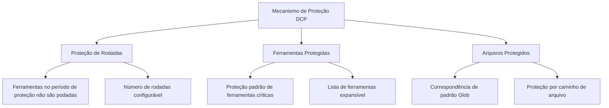

# Mecanismo de Proteção: Evitar Poda Incorreta de Conteúdo Crítico

## O Que Você Vai Aprender

- Configurar proteção de rodadas, permitindo que a IA tenha tempo para referenciar saídas de ferramentas recentes
- Expandir a lista de ferramentas protegidas, prevenindo que operações críticas sejam podadas
- Configurar padrões de arquivos protegidos, protegendo arquivos específicos de poda incorreta
- Entender o mecanismo de proteção de sub-agentes, evitando impacto no comportamento de resumo

## Seus Desafios Atuais

O DCP poda automaticamente chamadas de ferramentas redundantes no histórico de conversas, economizando tokens, mas às vezes surgem problemas:

- A IA acabou de ler um arquivo e quer fazer análise baseada no conteúdo, mas foi podado pelo DCP
- Você usou a ferramenta `write` para escrever um arquivo de configuração e precisa lê-lo depois, mas após a poda não consegue encontrar o caminho do arquivo
- A IA diz "de acordo com o código acima", mas o código já não está mais no contexto

Essas situações indicam: **alguns conteúdos devem ser protegidos e não podem ser podados**.

## Quando Usar Esta Estratégia

- Quando a IA precisa referenciar conteúdo de arquivos lidos anteriormente
- Quando é necessário proteger operações críticas (como escrever configurações, planejamento de tarefas)
- Quando certos caminhos de arquivos (como secrets, chaves) precisam de proteção especial
- Ao desenvolver funcionalidades de sub-agentes (o DCP pula automaticamente)

## Conceito Principal

O DCP fornece **três camadas de mecanismo de proteção**, prevenindo que conteúdo crítico seja podado incorretamente de diferentes dimensões:



**Níveis de Proteção**:
1. **Proteção de Rodadas** (dimensão temporal): Ferramentas das últimas N rodadas são automaticamente protegidas
2. **Proteção de Ferramentas** (dimensão de ferramenta): Ferramentas específicas nunca serão podadas
3. **Proteção de Arquivos** (dimensão de caminho): Ferramentas que operam arquivos específicos não serão podadas

Os três podem ser usados em combinação, formando uma rede de proteção em múltiplas camadas.

---

## Proteção de Rodadas

### O Que É Proteção de Rodadas

Proteção de Rodadas (Turn Protection) é o **mecanismo de proteção de janela temporal** fornecido pelo DCP. Quando habilitada, chamadas de ferramentas dentro do período de proteção não serão adicionadas ao cache de poda e, portanto, não serão podadas por nenhuma estratégia.

**Função**: Dar tempo à IA para referenciar saídas de ferramentas recentes, evitando o constrangimento de "acabou de falar e já foi deletado".

### Configurar Proteção de Rodadas

Adicione no arquivo de configuração:

```jsonc
{
  "turnProtection": {
    "enabled": true,
    "turns": 4
  }
}
```

**Descrição dos Parâmetros**:
- `enabled`: Se a proteção de rodadas está habilitada (padrão `false`)
- `turns`: Número de rodadas protegidas (padrão `4`), indica que ferramentas das últimas 4 rodadas não serão podadas

### Como Funciona a Proteção de Rodadas

O DCP, ao sincronizar o cache de ferramentas (antes de cada mensagem enviada pela IA), calcula o número de rodadas de cada ferramenta:

```typescript
// Se rodada atual - rodada de criação da ferramenta < número de rodadas protegidas
// então a ferramenta não será podada
state.currentTurn - turnCounter < turnProtectionTurns
```

**Exemplo**:
- Rodada atual: 10
- Rodada de criação da ferramenta: 8
- Número de rodadas protegidas: 4
- Resultado: 10 - 8 = 2 < 4 → **Protegida, não poda**

**Efeito**:
- Durante o período de proteção, a ferramenta não aparecerá na lista `<prunable-tools>`
- Não será afetada por estratégias automáticas (desduplicação, sobrescrita, limpeza de erros)
- A IA não pode podar através das ferramentas `discard`/`extract`

### Configuração Recomendada

| Cenário | Rodadas Recomendadas | Explicação |
| --- | --- | --- |
| Conversas longas (10+ rodadas) | 4-6 | Dar tempo suficiente à IA para referenciar conteúdo histórico |
| Conversas curtas (< 5 rodadas) | 2-3 | Não precisa de período de proteção muito longo |
| Tarefas altamente dependentes de contexto | 6-8 | Como refatoração de código, análise de documentos longos |
| Padrão (não depende de contexto) | 0-2 | Não habilitar ou usar valor mínimo |

::: tip Atenção
A proteção de rodadas aumentará o tamanho do contexto, pois mais saídas de ferramentas serão mantidas. Se notar aumento significativo no consumo de tokens, pode reduzir adequadamente o número de rodadas protegidas.
:::

---

## Ferramentas Protegidas

### Ferramentas Protegidas por Padrão

O DCP protege por padrão as seguintes ferramentas, que **nunca** serão podadas:

| Nome da Ferramenta | Explicação |
| --- | --- |
| `task` | Ferramenta de gerenciamento de tarefas |
| `todowrite` | Escrever itens de tarefas |
| `todoread` | Ler itens de tarefas |
| `discard` | Ferramenta de descarte do DCP (operação de poda em si) |
| `extract` | Ferramenta de extração do DCP (operação de poda em si) |
| `batch` | Ferramenta de operação em lote |
| `write` | Ferramenta de escrita de arquivo |
| `edit` | Ferramenta de edição de arquivo |
| `plan_enter` | Marcador de entrada de planejamento |
| `plan_exit` | Marcador de saída de planejamento |

**Por Que Essas Ferramentas São Protegidas**:
- `task`, `todowrite`, `todoread`: Gerenciamento de tarefas é o núcleo do estado da sessão, deletar causaria perda de contexto
- `discard`, `extract`: São as próprias ferramentas de poda do DCP, não podem podar a si mesmas
- `batch`, `write`, `edit`: Operações de arquivo são o núcleo da interação da IA com o código do usuário
- `plan_enter`, `plan_exit`: Marcadores de planejamento ajudam a entender a estrutura da sessão

### Expandir Lista de Ferramentas Protegidas

Se você precisa proteger mais ferramentas, pode expandir na configuração:

```jsonc
{
  "tools": {
    "settings": {
      "protectedTools": [
        "task",
        "todowrite",
        "todoread",
        "discard",
        "extract",
        "batch",
        "write",
        "edit",
        "plan_enter",
        "plan_exit",
        // Adicione as ferramentas que você precisa proteger
        "read",
        "filesearch"
      ]
    }
  }
}
```

**Proteção Global de Ferramentas**:
- Ferramentas em `tools.settings.protectedTools` serão protegidas em todas as estratégias
- Adequado para ferramentas que você não quer que nenhuma estratégia pode

### Proteção de Ferramentas em Nível de Estratégia

Você também pode configurar ferramentas protegidas para estratégias específicas:

```jsonc
{
  "strategies": {
    "deduplication": {
      "enabled": true,
      "protectedTools": [
        "read",  // Proteger ferramenta read durante desduplicação
        "filesearch"
      ]
    },
    "purgeErrors": {
      "enabled": true,
      "turns": 4,
      "protectedTools": [
        "write"  // Proteger ferramenta write durante limpeza de erros
      ]
    }
  }
}
```

**Cenários de Uso**:
- Proteger ferramenta apenas em uma estratégia, outras estratégias podem podar
- Exemplo: Permitir que desduplicação pode `read`, mas estratégia de limpeza de erros não pode podar `write`

::: info Diferença entre Proteção de Ferramentas e Proteção de Rodadas
- **Proteção de Ferramentas**: Independentemente de qual rodada a ferramenta foi criada, se estiver na lista de proteção, nunca será podada
- **Proteção de Rodadas**: Todas as ferramentas (exceto ferramentas protegidas) não são podadas durante o período de proteção, mas podem ser podadas após o período
:::

---

## Padrões de Arquivos Protegidos

### O Que São Padrões de Arquivos Protegidos

Padrões de arquivos protegidos permitem que você, através de padrões Glob, **proteja operações em caminhos de arquivos específicos de serem podadas**.

**Cenários Aplicáveis**:
- Proteger arquivos de chaves (`.env`, `secrets.json`)
- Proteger arquivos de configuração (configurações importantes não podem ser perdidas)
- Proteger arquivos principais do projeto (arquivos de entrada, bibliotecas principais)
- Proteger diretórios sensíveis (como `src/api/`, `tests/fixtures/`)

### Configurar Padrões de Arquivos Protegidos

Adicione no arquivo de configuração:

```jsonc
{
  "protectedFilePatterns": [
    "**/.env*",
    "**/secrets.json",
    "**/config/*.json",
    "src/core/**/*.ts",
    "tests/fixtures/**/*"
  ]
}
```

### Explicação de Padrões Glob

O DCP suporta padrões Glob padrão:

| Padrão | Explicação | Exemplo de Caminho Correspondente |
| --- | --- | --- |
| `**` | Corresponde a qualquer nível de diretório | `src/`, `src/components/`, `a/b/c/` |
| `*` | Corresponde a qualquer arquivo em um único nível de diretório | `src/*.ts` corresponde a `src/index.ts` |
| `?` | Corresponde a um único caractere | `file?.txt` corresponde a `file1.txt`, `file2.txt` |
| `*.json` | Corresponde a extensão específica | `config.json`, `data.json` |
| `**/*.json` | Corresponde a arquivos JSON em qualquer nível | `a/b/c.json`, `d.json` |

**Observações**:
- `*` e `?` não correspondem a `/` (separador de diretório)
- A correspondência é feita no caminho completo do arquivo
- O separador de caminho é unificado como `/` (mesmo no Windows)

### Casos Práticos

#### Caso 1: Proteger Arquivos de Variáveis de Ambiente

```jsonc
{
  "protectedFilePatterns": [
    "**/.env",
    "**/.env.local",
    "**/.env.production"
  ]
}
```

**Efeito**: Qualquer ferramenta que opere arquivos `.env` não será podada.

#### Caso 2: Proteger Arquivos Principais do Projeto

```jsonc
{
  "protectedFilePatterns": [
    "src/index.ts",
    "src/core/**/*.ts",
    "src/api/**/*.ts"
  ]
}
```

**Efeito**: Saídas de ferramentas que operam módulos principais e API serão mantidas, garantindo que a IA sempre veja a estrutura do projeto.

#### Caso 3: Proteger Dados Fixos de Teste

```jsonc
{
  "protectedFilePatterns": [
    "tests/fixtures/**/*",
    "tests/mocks/**/*.json"
  ]
}
```

**Efeito**: Dados simulados e entradas fixas usadas em testes não serão podados, evitando inconsistência nos resultados de teste.

---

## Proteção de Sub-agentes

### O Que São Sub-agentes

Sub-agentes (Subagent) são um mecanismo do OpenCode onde o agente principal pode derivar sub-agentes para lidar com tarefas específicas (como busca de arquivos, análise de código). Os sub-agentes resumem os resultados e os retornam ao agente principal.

### Proteção de Sub-agentes do DCP

O DCP detecta automaticamente sessões de sub-agentes e **pula todas as operações de poda**.

**Princípio de Implementação**:
```typescript
// lib/state/utils.ts
export async function isSubAgentSession(client: any, sessionID: string): Promise<boolean> {
    const result = await client.session.get({ path: { id: sessionID } })
    return !!result.data?.parentID  // Se tiver parentID, é sub-agente
}
```

**Por Que É Necessário Proteger**:
- A saída do sub-agente é um resumo para o agente principal ver
- Se podar a saída de ferramentas do sub-agente, o agente principal pode não conseguir entender o contexto
- A tarefa do sub-agente é "executar eficientemente", não "economizar tokens"

::: info Percepção do Usuário
A proteção de sub-agentes é automática, você não precisa configurar nada. O DCP registrará sessões de sub-agentes detectadas nos logs.
:::

---

## Siga os Passos: Configurar Mecanismo de Proteção

### Passo 1: Editar Arquivo de Configuração

Abra o arquivo de configuração global (ou arquivo de configuração do projeto):

```bash
# macOS/Linux
code ~/.config/opencode/dcp.jsonc

# Windows
code $env:APPDATA\opencode\dcp.jsonc
```

### Passo 2: Adicionar Configuração de Proteção

```jsonc
{
  "$schema": "https://raw.githubusercontent.com/Opencode-DCP/opencode-dynamic-context-pruning/main/dcp.schema.json",
  "enabled": true,
  "debug": false,

  // Proteção de rodadas
  "turnProtection": {
    "enabled": true,
    "turns": 4
  },

  // Padrões de arquivos protegidos
  "protectedFilePatterns": [
    "**/.env*",
    "**/secrets.json"
  ],

  // Expandir ferramentas protegidas
  "tools": {
    "settings": {
      "nudgeEnabled": true,
      "nudgeFrequency": 10,
      "protectedTools": [
        "task",
        "todowrite",
        "todoread",
        "discard",
        "extract",
        "batch",
        "write",
        "edit",
        "plan_enter",
        "plan_exit",
        "read"
      ]
    },
    "discard": {
      "enabled": true
    },
    "extract": {
      "enabled": true,
      "showDistillation": false
    }
  },

  // Proteção em nível de estratégia
  "strategies": {
    "deduplication": {
      "enabled": true,
      "protectedTools": ["filesearch"]
    },
    "supersedeWrites": {
      "enabled": false
    },
    "purgeErrors": {
      "enabled": true,
      "turns": 4,
      "protectedTools": ["write"]
    }
  }
}
```

### Passo 3: Reiniciar OpenCode

Após modificar a configuração, reinicie o OpenCode para que as alterações entrem em vigor:

- macOS/Linux: Clique com o botão direito no ícone do OpenCode no Dock → Sair → Reabrir
- Windows: Clique com o botão direito no OpenCode na barra de tarefas → Fechar janela → Reabrir

### Passo 4: Verificar Mecanismo de Proteção

Na conversa do OpenCode, digite `/dcp context` para ver a análise do contexto atual:

```
Session Context Breakdown:
──────────────────────────────────────────────────────────

System         15.2% │████████████████▒▒▒▒▒▒▒▒▒▒▒▒▒▒▒▒▒▒▒▒▒▒▒│  25.1K tokens
User            5.1% │████▒▒▒▒▒▒▒▒▒▒▒▒▒▒▒▒▒▒▒▒▒▒▒▒▒▒▒▒▒▒▒▒▒▒▒▒▒▒│   8.4K tokens
Assistant       35.8% │██████████████████████████████████████▒▒▒▒▒▒▒│  59.2K tokens
Tools (45)      43.9% │████████████████████████████████████████████████│  72.6K tokens

──────────────────────────────────────────────────────────

Summary:
  Pruned:          12 tools (~15.2K tokens)
  Current context: ~165.3K tokens
  Without DCP:     ~180.5K tokens
```

**Você Deve Ver**:
- O número de `Pruned` pode diminuir (porque ferramentas protegidas não serão podadas)
- `Current context` pode aumentar (porque a proteção de rodadas mantém mais conteúdo)

---

## Avisos sobre Problemas Comuns

### ❌ Erro 1: Proteção Excessiva Causa Desperdício de Tokens

**Problema**: Configurar número de rodadas de proteção muito longo ou adicionar muitas ferramentas protegidas, fazendo com que o contexto permaneça sempre grande.

**Solução**:
- Proteção de rodadas geralmente configurada em 2-4 rodadas é suficiente
- Proteger apenas ferramentas realmente críticas (como `task`, `write`)
- Verificar periodicamente `/dcp context`, monitorar tamanho do contexto

### ❌ Erro 2: Falha na Correspondência de Padrão Glob

**Problema**: Configurou `*.json`, mas alguns arquivos JSON ainda são podados.

**Causa**: `*` não corresponde a `/`, então `a/b/c.json` não será correspondido.

**Solução**: Use `**/*.json` para corresponder arquivos JSON em qualquer nível.

### ❌ Erro 3: Esquecer de Reiniciar OpenCode

**Problema**: Após modificar a configuração, o mecanismo de proteção não entrou em vigor.

**Causa**: O DCP carrega o arquivo de configuração apenas na inicialização.

**Solução**: Após modificar a configuração, deve reiniciar o OpenCode.

### ❌ Erro 4: Ferramenta Protegida Aparece na Lista de Poda

**Problema**: Configurou ferramenta protegida, mas ela ainda aparece na lista `<prunable-tools>`.

**Causa**: Ferramentas protegidas não serão podadas, mas se estiverem fora do período de proteção, ainda aparecerão na lista `<prunable-tools>` (para a IA ver), apenas quando a IA tentar podar falhará.

**Solução**: Este é o comportamento normal. Quando a IA tenta podar ferramenta protegida, o DCP recusará a operação e retornará erro.

---

## Resumo da Lição

O mecanismo de proteção do DCP contém três camadas:

1. **Proteção de Rodadas**: Ferramentas dentro do período de proteção não serão podadas, dando tempo à IA para referenciar conteúdo histórico
2. **Ferramentas Protegidas**: Ferramentas específicas (como `task`, `write`) nunca serão podadas, pode expandir lista personalizada
3. **Padrões de Arquivos Protegidos**: Proteger operações em caminhos de arquivos específicos através de padrões Glob
4. **Proteção de Sub-agentes**: O DCP detecta automaticamente e pula operações de poda em sessões de sub-agentes

**Estratégia de Configuração Recomendada**:
- Fase de desenvolvimento: Habilitar proteção de rodadas (2-4 rodadas), proteger arquivos de configuração e módulos principais
- Fase de produção: Ajustar de acordo com necessidades reais, equilibrar economia de tokens e integridade do contexto
- Tarefas críticas: Habilitar todos os mecanismos de proteção, garantir que conteúdo crítico não seja perdido

---

## Prévia da Próxima Lição

> Na próxima lição aprenderemos sobre **[Persistência de Estado](../state-persistence/)**.
>
> Você aprenderá:
> - Como o DCP mantém estado de poda e dados estatísticos entre sessões
> - Localização e formato de arquivos de persistência
> - Como visualizar efeito acumulado de economia de tokens
> - Métodos para limpar dados de persistência

---

## Apêndice: Referência de Código Fonte

<details>
<summary><strong>Clique para expandir e ver a localização do código fonte</strong></summary>

> Última atualização: 2026-01-23

| Funcionalidade | Caminho do Arquivo | Linha |
| --- | --- | --- |
| Lógica de proteção de rodadas | [`lib/state/tool-cache.ts`](https://github.com/Opencode-DCP/opencode-dynamic-context-pruning/blob/main/lib/state/tool-cache.ts#L39-L44) | 39-44 |
| Ferramentas protegidas por padrão | [`lib/config.ts`](https://github.com/Opencode-DCP/opencode-dynamic-context-pruning/blob/main/lib/config.ts#L68-L79) | 68-79 |
| Correspondência de arquivo protegido | [`lib/protected-file-patterns.ts`](https://github.com/Opencode-DCP/opencode-dynamic-context-pruning/blob/main/lib/protected-file-patterns.ts#L77-L82) | 77-82 |
| Detecção de sub-agente | [`lib/state/utils.ts`](https://github.com/Opencode-DCP/opencode-dynamic-context-pruning/blob/main/lib/state/utils.ts#L1-L8) | 1-8 |
| Verificação de proteção de estratégia de desduplicação | [`lib/strategies/deduplication.ts`](https://github.com/Opencode-DCP/opencode-dynamic-context-pruning/blob/main/lib/strategies/deduplication.ts#L49-L57) | 49-57 |
| Verificação de proteção de ferramenta Discard | [`lib/strategies/tools.ts`](https://github.com/Opencode-DCP/opencode-dynamic-context-pruning/blob/main/lib/strategies/tools.ts#L89-L112) | 89-112 |

**Constantes-chave**:
- `DEFAULT_PROTECTED_TOOLS = ["task", "todowrite", "todoread", "discard", "extract", "batch", "write", "edit", "plan_enter", "plan_exit"]`: Lista de ferramentas protegidas por padrão

**Funções-chave**:
- `isProtectedFilePath(filePath, patterns)`: Verifica se o caminho do arquivo corresponde ao padrão de proteção
- `isSubAgentSession(client, sessionID)`: Detecta se a sessão é um sub-agente

</details>
