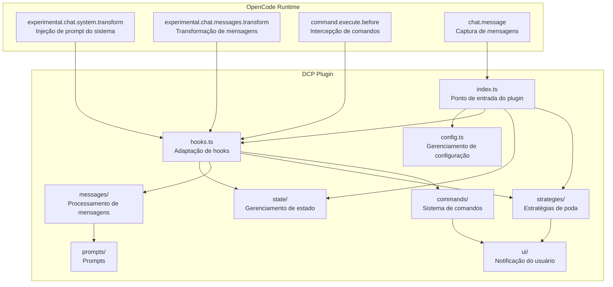
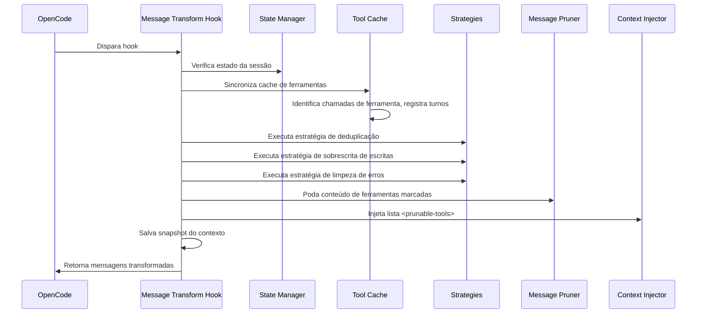
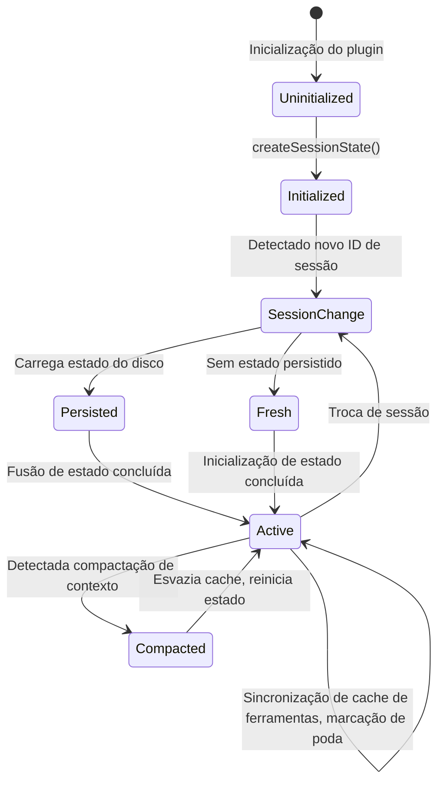
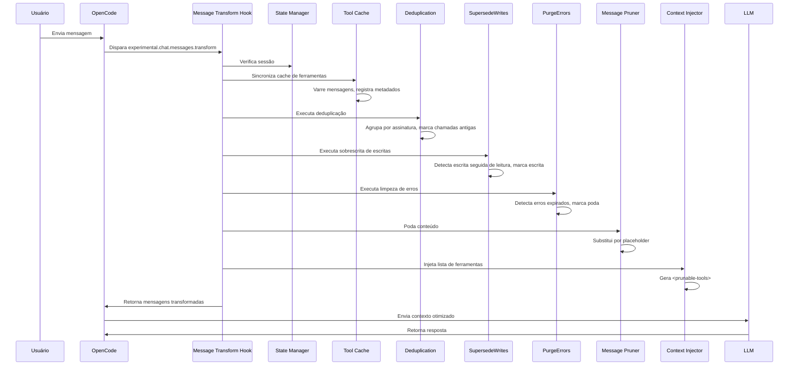
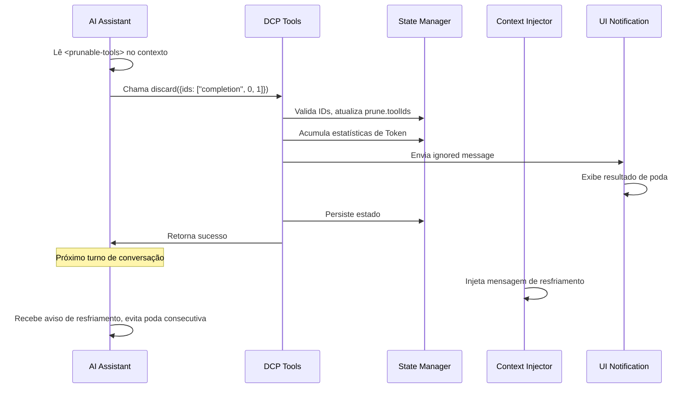

# Visão Geral da Arquitetura: Funcionamento Interno do DCP

## O Que Você Será Capaz de Fazer

Esta seção não envolve operações práticas, mas ajuda você a entender profundamente o design interno do DCP. Após completá-la, você será capaz de:
- Entender como o DCP se integra ao fluxo de conversação através do sistema de hooks do OpenCode
- Dominar as responsabilidades de cada módulo e como eles interagem
- Entender a cadeia de chamadas completa, desde o recebimento de mensagens até a conclusão da poda
- Compreender as ideias de design do gerenciamento de estado, processamento de mensagens e estratégias de poda

## Ideia Central

O DCP é um plugin baseado no OpenCode Plugin SDK que estende as capacidades de conversação do OpenCode através do registro de hooks e ferramentas. Todo o sistema gira em torno do conceito central de "transformação de mensagens" (message transform)—antes que o IA se prepare para responder ao usuário, o DCP varre, analisa e poda o histórico de conversas, e então envia o contexto otimizado para o LLM.

::: info Por que "transformação de mensagens"?

O OpenCode fornece o hook `experimental.chat.messages.transform`, que permite que plugins modifiquem as mensagens antes de enviá-las ao LLM. Isso é exatamente a capacidade que o DCP precisa—remover chamadas de ferramentas redundantes antes que o LLM veja o contexto.

:::

O sistema adota um design modular com responsabilidades claras para cada módulo:
- **config**: Gerenciamento de configuração, suporta sobrescrita em múltiplos níveis
- **state**: Gerenciamento de estado, mantém o estado de tempo de execução em nível de sessão
- **messages**: Processamento de mensagens, executa as operações reais de poda e injeção
- **strategies**: Estratégias de poda, define regras de limpeza automática
- **commands**: Sistema de comandos, fornece controle manual e consultas de estatísticas
- **hooks**: Adaptação de hooks, conecta OpenCode e módulos do DCP
- **ui**: Notificação do usuário, exibe resultados de poda e informações estatísticas

## Diagrama de Arquitetura de Módulos



## Ponto de Entrada do Plugin e Inicialização

O ponto de entrada do plugin é definido em `index.ts`, sendo o único ponto de conexão entre o DCP e a API do Plugin OpenCode.

### Fluxo de Registro do Plugin

```typescript
const plugin: Plugin = (async (ctx) => {
    const config = getConfig(ctx)
    if (!config.enabled) {
        return {}
    }

    const logger = new Logger(config.debug)
    const state = createSessionState()

    return {
        "experimental.chat.system.transform": createSystemPromptHandler(...),
        "experimental.chat.messages.transform": createChatMessageTransformHandler(...),
        "chat.message": async (input, _output) => { /* cache variant */ },
        "command.execute.before": createCommandExecuteHandler(...),
        tool: {
            discard: createDiscardTool(...),
            extract: createExtractTool(...),
        },
        config: async (opencodeConfig) => { /* modificar configuração do OpenCode */ },
    }
}) satisfies Plugin
```

**Fase de inicialização**:
1. Carrega configuração (suporta fusão em múltiplos níveis: padrão → global → variável de ambiente → projeto)
2. Se o plugin estiver desabilitado, retorna objeto vazio imediatamente
3. Cria sistema de log e objeto de estado de sessão
4. Registra quatro hooks e duas ferramentas

**Fase de modificação de configuração**:
- Através do hook `config`, adiciona as ferramentas `discard` e `extract` ao `experimental.primary_tools`
- Registra o comando `/dcp`

## Sistema de Hooks e Transformação de Mensagens

`hooks.ts` é responsável por converter eventos de hooks do OpenCode em chamadas de módulos internos do DCP. Esta é a camada de despacho central do DCP.

### Hook de Injeção de Prompt do Sistema

```typescript
createSystemPromptHandler(state, logger, config)
```

**Momento de chamada**: Toda vez que o prompt do sistema é construído

**Principais responsabilidades**:
1. Detecta sessões de subagentes (se for subagente, pula a injeção)
2. Detecta agentes internos (como gerador de resumo de conversação, pula a injeção)
3. Seleciona o modelo de prompt apropriado conforme a configuração:
   - Ambos discard e extract habilitados: `system/system-prompt-both`
   - Apenas discard habilitado: `system/system-prompt-discard`
   - Apenas extract habilitado: `system/system-prompt-extract`
4. Injeta a descrição das ferramentas no prompt do sistema

**Por que é necessária a injeção de prompt do sistema?**

A IA precisa saber que pode usar as ferramentas `discard` e `extract` para otimizar o contexto. Através da descrição do propósito dessas ferramentas no prompt do sistema, a IA pode tomar decisões autônomas sobre quando chamá-las.

### Hook de Transformação de Mensagens

```typescript
createChatMessageTransformHandler(ctx.client, state, logger, config)
```

**Momento de chamada**: Toda vez que o IA se prepara para responder a uma mensagem (antes de enviar ao LLM)

**Fluxo de processamento**:



**Etapas principais**:

1. **Verificação de sessão** (`checkSession`)
   - Detecta se o ID da sessão mudou
   - Se for uma nova sessão, carrega o estado persistido do disco
   - Detecta compressão de contexto (mecanismo de summary do OpenCode), se detectado, esvazia o cache de ferramentas

2. **Sincronização de cache de ferramentas** (`syncToolCache`)
   - Varre todas as chamadas de ferramentas nas mensagens
   - Registra `callID`, nome da ferramenta, parâmetros, estado e turno de cada ferramenta
   - Pula ferramentas protegidas e ferramentas dentro do período de proteção de turno
   - Mantém `nudgeCounter` (contador de ferramentas não podadas)

3. **Execução de estratégias automáticas**
   - `deduplicate`: Deduplicação, mantém a chamada mais recente
   - `supersedeWrites`: Limpa operações de escrita que foram sobrescritas por leituras
   - `purgeErrors`: Limpa entradas de ferramentas de erro expiradas

4. **Poda de conteúdo** (`prune`)
   - Substitui `output` de ferramentas marcadas por placeholder
   - Substitui `input` de ferramentas com erro por placeholder

5. **Injeção de lista de ferramentas** (`insertPruneToolContext`)
   - Gera lista `<prunable-tools>` (contendo ID numérico, nome da ferramenta, resumo de parâmetros)
   - Injeta mensagem de lembrete se necessário (nudge)
   - Se a última operação foi poda, injeta mensagem de resfriamento

6. **Salvar snapshot do contexto**
   - Salva as mensagens transformadas no diretório de log para facilitar depuração

### Hook de Intercepção de Comandos

```typescript
createCommandExecuteHandler(ctx.client, state, logger, config, ctx.directory)
```

**Momento de chamada**: Quando o usuário executa comandos

**Principais responsabilidades**:
- Intercepta comandos começando com `/dcp`
- Distribui para o manipulador de comando correspondente:
  - `/dcp` → Exibe ajuda
  - `/dcp context` → Exibe análise de uso de Token
  - `/dcp stats` → Exibe estatísticas acumuladas de poda
  - `/dcp sweep [n]` → Poda ferramentas manualmente
- Impede que o OpenCode execute o processamento padrão de comandos através do lançamento de erro especial (`__DCP_*_HANDLED__`)

## Gerenciamento de Estado

O módulo `state/` é responsável por manter o estado de tempo de execução em nível de sessão e a persistência.

### Estruturas de Dados Principais

**SessionState** (estado em memória):
```typescript
{
    sessionId: string | null,           // ID da sessão atual
    isSubAgent: boolean,               // Se é uma sessão de subagente
    prune: { toolIds: string[] },       // Lista de IDs de ferramentas marcadas para poda
    stats: {
        pruneTokenCounter: number,      // Contador de Tokens podados na sessão atual
        totalPruneTokens: number,       // Total acumulado de Tokens podados no histórico
    },
    toolParameters: Map<string, ToolParameterEntry>,  // Cache de chamadas de ferramentas
    nudgeCounter: number,               // Contador de ferramentas não podadas (para acionar lembretes)
    lastToolPrune: boolean,             // Se a última operação foi poda de ferramenta
    lastCompaction: number,             // Timestamp da última compactação de contexto
    currentTurn: number,                // Número do turno atual
    variant: string | undefined,       // Variante do modelo (ex: claude-3.5-sonnet)
}
```

**ToolParameterEntry** (metadados de ferramenta):
```typescript
{
    tool: string,                       // Nome da ferramenta
    parameters: any,                    // Parâmetros da ferramenta
    status: ToolStatus | undefined,     // Estado de execução
    error: string | undefined,          // Mensagem de erro
    turn: number,                       // Número do turno em que a chamada foi criada
}
```

### Ciclo de Vida do Estado



**Transições de estado principais**:

1. **Inicialização de sessão** (`ensureSessionInitialized`)
   - Detecta mudança de `sessionID`
   - Detecta se é subagente (através de `session.parentID`)
   - Carrega `PersistedSessionState` do disco
   - Inicializa contador de turnos e timestamp de compactação

2. **Processamento de compactação de contexto**
   - Detecta mensagem `summary` do OpenCode (`msg.info.summary === true`)
   - Esvazia cache de ferramentas e lista de poda
   - Registra timestamp de compactação para evitar limpeza duplicada

3. **Persistência**
   - Após a conclusão da operação de poda, salva assincronamente em `~/.local/share/opencode/storage/plugin/dcp/{sessionId}.json`
   - Contém nome da sessão, lista de poda, estatísticas, última atualização

## Módulo de Processamento de Mensagens

O módulo `messages/` é responsável pelas operações reais de poda e injeção.

### Operação de Poda (prune.ts)

**Função principal**: `prune(state, logger, config, messages)`

**Três subfunções**:

1. **`pruneToolOutputs`**
   - Substitui `output` de ferramentas marcadas por placeholder
   - Processa apenas ferramentas com estado `completed`
   - Pula ferramentas `question` (tratamento especial para ferramentas de pergunta)

2. **`pruneToolInputs`**
   - Processa apenas ferramentas `question`
   - Substitui campo `questions` por placeholder (mantém respostas do usuário)

3. **`pruneToolErrors`**
   - Limpa parâmetros de entrada de ferramentas com erro
   - Mantém mensagem de erro, remove apenas entradas de string (parâmetros que podem ser muito grandes)

**Design de placeholders**:
```
[Output removed to save context - information superseded or no longer needed]
[input removed due to failed tool call]
[questions removed - see output for user's answers]
```

### Injeção de Contexto (inject.ts)

**Função principal**: `insertPruneToolContext(state, config, logger, messages)`

**Fluxo**:

1. **Gerar lista de ferramentas** (`buildPrunableToolsList`)
   - Percorre cache de ferramentas, excluindo:
     - Ferramentas já podadas
     - Ferramentas protegidas (`task`, `write`, `edit`, etc.)
     - Caminhos de arquivos protegidos (que correspondam a `protectedFilePatterns`)
   - Gera descrição para cada ferramenta: `{numericId}: {toolName}, {paramKey}`
   - Exemplo: `3: read, src/config.ts`

2. **Empacotar como tag `<prunable-tools>`**
   ```html
   <prunable-tools>
   The following tools have been invoked and are available for pruning. This list does not mandate immediate action. Consider your current goals and resources you need before discarding valuable tool inputs or outputs. Consolidate your prunes for efficiency; it is rarely worth pruning a single tiny tool output. Keep your context free of noise.
   0: read, src/config.ts
   1: read, src/config.ts
   2: read, src/utils.ts
   </prunable-tools>
   ```

3. **Processar estado de resfriamento**
   - Se a última operação foi `discard` ou `extract`, injeta mensagem de resfriamento:
   ```html
   <prunable-tools>
   Context management was just performed. Do not use discard or extract tools again. A fresh list will be available after your next tool use.
   </prunable-tools>
   ```

4. **Injetar mensagem de lembrete**
   - Se `nudgeCounter >= nudgeFrequency`, adiciona texto de lembrete
   - Formato do lembrete: `"You have not used context pruning in a while. Consider using discard/extract tools to reduce token usage."`

5. **Escolher posição de inserção da mensagem**
   - Se a última mensagem for do usuário, insere mensagem de usuário sintética
   - Caso contrário, insere mensagem de assistente sintética
   - Usa `variant` para garantir compatibilidade de formato de mensagem com diferentes modelos

## Módulo de Estratégias de Poda

O módulo `strategies/` define regras de limpeza automática.

### Estratégia de Deduplicação (deduplication.ts)

**Função principal**: `deduplicate(state, logger, config, messages)`

**Algoritmo**:
1. Constrói lista cronológica de todos os IDs de ferramentas
2. Calcula "assinatura" para cada ferramenta: `tool::normalizedParameters`
   - Parâmetros normalizados: remove `null`/`undefined`
   - Ordena chaves: garante que `{"b":1,"a":2}` e `{"a":2,"b":1}` gerem a mesma assinatura
3. Agrupa por assinatura
4. Em cada grupo, mantém o último (mais recente), marca outros para poda

**Exemplo**:
```typescript
// Chamadas de ferramenta originais
Tool Call 1: read({filePath: "src/config.ts"})
Tool Call 2: read({filePath: "src/config.ts"})
Tool Call 3: read({filePath: "src/utils.ts"})

// Agrupamento por assinatura
Signature 1: "read::{\"filePath\":\"src/config.ts\"}" → [Tool Call 1, Tool Call 2]
Signature 2: "read::{\"filePath\":\"src/utils.ts\"}" → [Tool Call 3]

// Resultado da poda
Marcado para poda: [Tool Call 1]  // Mantém Tool Call 2 (mais recente)
Mantido: [Tool Call 2, Tool Call 3]
```

### Estratégia de Sobrescrita de Escritas (supersede-writes.ts)

**Função principal**: `supersedeWrites(state, logger, config, messages)`

**Algoritmo**:
1. Varre todas as chamadas de ferramentas em ordem cronológica
2. Mantém tabela de rastreamento de arquivos:
   ```typescript
   {
       "src/config.ts": {
           lastWrite: callId,
           lastWriteTime: timestamp,
           lastRead: callId,
           lastReadTime: timestamp,
       }
   }
   ```
3. Detecta padrões:
   - Se `lastWriteTime < lastReadTime` do arquivo, indica que a operação de escrita foi sobrescrita por leitura
   - Marca `input` dessa operação de escrita para poda

**Cenário**:
```typescript
// Linha do tempo
Turn 1: write({filePath: "src/config.ts", content: "..."})  // lastWrite = call1
Turn 2: read({filePath: "src/config.ts"})                 // lastRead = call2 (sobrescreveu a escrita)
Turn 3: read({filePath: "src/config.ts"})                 // Mantém a leitura mais recente

// Resultado da poda
Marcado para poda: [chamada write do Turn 1]
```

### Estratégia de Limpeza de Erros (purge-errors.ts)

**Função principal**: `purgeErrors(state, logger, config, messages)`

**Algoritmo**:
1. Varre todas as ferramentas com estado `error`
2. Verifica a diferença entre o número do turno atual e o turno em que a ferramenta foi criada
3. Se a diferença > `strategies.purgeErrors.turns` (padrão 4), marca para poda

**Mecanismo de proteção**:
- Mensagem de erro mantida (`part.state.error`)
- Remove apenas parâmetros de entrada (`part.state.input`), pois entradas de erro podem ser muito grandes

**Cenário**:
```typescript
Turn 1: read({filePath: "nonexistent.txt"}) → error
Turn 2-5: Outras operações
Turn 6: Usuário continua a conversa

// Se purgeErrors.turns = 4
// Turn 6 - Turn 1 = 5 > 4
// Marca entrada de erro do Turn 1 para poda
```

### Ferramentas Dirigidas por LLM (tools.ts)

**Ferramenta Discard**:
```typescript
{
    name: "discard",
    description: "Remove completed task or noise tool outputs",
    parameters: {
        ids: ["completion", 0, 1, 2]  // Primeiro elemento é motivo: 'completion' ou 'noise'
    }
}
```

**Ferramenta Extract**:
```typescript
{
    name: "extract",
    description: "Extract key findings then remove original tool outputs",
    parameters: {
        ids: [0, 1, 2],
        distillation: ["key finding 1", "key finding 2", "key finding 3"]
    }
}
```

**Fluxo de processamento**:
1. IA chama a ferramenta, fornecendo lista de IDs numéricos
2. Mapeia IDs numéricos de volta para `callID` real
3. Verifica se a ferramenta não está na lista de proteção
4. Atualiza `prune.toolIds`
5. Exibe resultado da poda através de `ignored message`
6. Persiste estado

## Sistema de Comandos

O módulo `commands/` fornece controle manual e consultas de estatísticas.

### Comando Context

```bash
/dcp context
```

**Saída**: Análise de uso de Token (com gráfico de barras)
```
╭───────────────────────────────────────────────────────────╮
│                  DCP Context Analysis                     │
╰───────────────────────────────────────────────────────────╯

Session Context Breakdown:
───────────────────────────────────────────────────────────

System         15.2% │████████████████▒▒▒▒▒▒▒▒▒▒▒▒▒▒▒▒▒▒▒▒▒▒▒│  25.1K tokens
User            5.1% │████▒▒▒▒▒▒▒▒▒▒▒▒▒▒▒▒▒▒▒▒▒▒▒▒▒▒▒▒▒▒▒▒▒▒▒▒▒▒│   8.4K tokens
Assistant       35.8% │██████████████████████████████████████▒▒▒▒▒▒▒│  59.2K tokens
Tools (45)      43.9% │████████████████████████████████████████████████│  72.6K tokens

───────────────────────────────────────────────────────────

Summary:
  Pruned:          12 tools (~15.2K tokens)
  Current context: ~165.3K tokens
  Without DCP:     ~180.5K tokens
```

**Lógica de cálculo**:
- System: `firstAssistant.input + cache.read - tokenizer(firstUserMessage)`
- User: `tokenizer(all user messages)`
- Tools: `tokenizer(toolInputs + toolOutputs) - prunedTokens`
- Assistant: Cálculo residual

### Comando Stats

```bash
/dcp stats
```

**Saída**: Estatísticas acumuladas de poda
```
╭───────────────────────────────────────────────────────────╮
│                      DCP Statistics                      │
╰───────────────────────────────────────────────────────────╯

Session Pruning:
  Tools pruned: 12
  Tokens saved: ~15.2K
  Last prune:   discard (2 turns ago)

Lifetime Statistics:
  Total tokens saved: ~145.8K
```

### Comando Sweep

```bash
/dcp sweep [n]
```

**Dois modos**:
1. Padrão: Poda todas as ferramentas após a última mensagem do usuário
2. Especificado: `/dcp sweep 5`, poda as últimas 5 ferramentas

**Fluxo de processamento**:
1. Encontra a posição da última mensagem do usuário
2. Extrai chamadas de ferramentas subsequentes
3. Filtra ferramentas protegidas e arquivos protegidos
4. Marca para poda
5. Exibe resultado e economia de Token

## Sistema de Configuração

`config.ts` é responsável pelo carregamento e validação de configuração.

### Prioridade de Configuração

```
Padrão (1) < Global (2) < Variável de ambiente (3) < Projeto (4)
```

**Caminhos de configuração**:
- Global: `~/.config/opencode/dcp.jsonc`
- Variável de ambiente: `$OPENCODE_CONFIG_DIR/dcp.jsonc`
- Projeto: `<project>/.opencode/dcp.jsonc`

### Fluxo de Fusão de Configuração

```typescript
const defaultConfig = { /* valores padrão codificados */ }
const globalConfig = loadConfig(globalPath) || {}
const envConfig = loadConfig(envPath) || {}
const projectConfig = loadConfig(projectPath) || {}

const finalConfig = {
    ...defaultConfig,
    ...globalConfig,
    ...envConfig,
    ...projectConfig,
}
```

### Mecanismo de Validação

- Usa Zod Schema para definir estrutura de configuração
- Se a configuração for inválida, usa Toast para avisar e degrada para valores padrão
- Cria automaticamente configuração padrão quando o arquivo não existe

## Dependências de Módulos

| Módulo       | Responsabilidades          | Módulos dependentes                              | Módulos que dependem           |
|--------------|----------------------------|---------------------------------------------------|--------------------------------|
| config       | Gerenciamento de configuração | -                                                 | index, hooks, strategies, commands |
| hooks        | Adaptação de hooks         | config, state, logger, messages, strategies, commands | index                          |
| state        | Gerenciamento de estado    | logger                                            | index, hooks, strategies       |
| messages     | Processamento de mensagens | state, logger, prompts, ui, protected-file-patterns | hooks                          |
| strategies   | Estratégias de poda        | state, logger, messages, ui, protected-file-patterns | hooks                          |
| commands     | Processamento de comandos  | state, logger, messages, ui, strategies          | hooks                          |
| ui           | Notificação do usuário     | state, logger, prompts                            | strategies, commands           |
| prompts      | Gerenciamento de prompts   | -                                                 | hooks, messages, strategies    |
| logger       | Sistema de log             | -                                                 | index, config, hooks, strategies, state, ui, commands |

## Cadeia de Chamadas Completa

### Fluxo de Poda Automática



### Fluxo de Poda Dirigida por LLM



## Considerações de Performance

### Limite de Cache de Ferramentas

- Capacidade máxima: 1000 entradas (`MAX_TOOL_CACHE_SIZE`)
- Estratégia de limpeza: FIFO (First In First Out)
- Condição de disparo: Verifica tamanho após cada sincronização

### Sistema de Log

- Log de depuração: `~/.config/opencode/logs/dcp/daily/YYYY-MM-DD.log`
- Snapshots de contexto: `~/.config/opencode/logs/dcp/context/{sessionId}/`
- Nível de log: Configurável (`config.debug`)

### Detecção de Subagentes

- Método de detecção: Se `session.parentID` existe
- Estratégia de processamento: Pula todas as operações de poda (evita poda duplicada)

## Resumo da Lição

O design da arquitetura do DCP gira em torno do conceito central de "transformação de mensagens", integrando-se perfeitamente ao fluxo de conversação através do sistema de hooks do OpenCode. O sistema adota um design modular com responsabilidades claras para cada módulo:

- **Ponto de entrada do plugin** (`index.ts`) é responsável por registrar hooks e ferramentas
- **Sistema de hooks** (`hooks.ts`) é responsável pelo despacho de eventos e agendamento
- **Gerenciamento de estado** (`state/`) é responsável pelo estado em nível de sessão e persistência
- **Processamento de mensagens** (`messages/`) é responsável pela poda e injeção reais
- **Estratégias de poda** (`strategies/`) define regras de limpeza automática
- **Sistema de comandos** (`commands/`) fornece controle manual
- **Sistema de configuração** (`config.ts`) suporta configuração multinível

Todo o fluxo é concluído no hook `experimental.chat.messages.transform`: sincronização de cache de ferramentas → execução de estratégias automáticas → poda de conteúdo → injeção de lista de ferramentas. Este design garante que o DCP complete a otimização antes que o LLM veja o contexto, mantendo a manutenibilidade e extensibilidade do plugin.

---

## Apêndice: Referência do Código Fonte

<details>
<summary><strong>Clique para expandir e ver localizações do código fonte</strong></summary>

> Última atualização: 2026-01-23

| Funcionalidade | Caminho do arquivo                                                                                    | Linha    |
|----------------|--------------------------------------------------------------------------------------------------------|----------|
| Ponto de entrada do plugin e registro de hooks | [`index.ts`](https://github.com/Opencode-DCP/opencode-dynamic-context-pruning/blob/main/index.ts) | 12-102 |
| Hook de injeção de prompt do sistema | [`lib/hooks.ts`](https://github.com/Opencode-DCP/opencode-dynamic-context-pruning/blob/main/lib/hooks.ts) | 20-53 |
| Hook de transformação de mensagens | [`lib/hooks.ts`](https://github.com/Opencode-DCP/opencode-dynamic-context-pruning/blob/main/lib/hooks.ts) | 55-82 |
| Hook de intercepção de comandos | [`lib/hooks.ts`](https://github.com/Opencode-DCP/opencode-dynamic-context-pruning/blob/main/lib/hooks.ts) | 84-156 |
| Gerenciamento de estado de sessão | [`lib/state/state.ts`](https://github.com/Opencode-DCP/opencode-dynamic-context-pruning/blob/main/lib/state/state.ts) | 7-143 |
| Sincronização de cache de ferramentas | [`lib/state/tool-cache.ts`](https://github.com/Opencode-DCP/opencode-dynamic-context-pruning/blob/main/lib/state/tool-cache.ts) | 11-86 |
| Persistência de estado | [`lib/state/persistence.ts`](https://github.com/Opencode-DCP/opencode-dynamic-context-pruning/blob/main/lib/state/persistence.ts) | - |
| Poda de mensagens | [`lib/messages/prune.ts`](https://github.com/Opencode-DCP/opencode-dynamic-context-pruning/blob/main/lib/messages/prune.ts) | 11-106 |
| Injeção de contexto | [`lib/messages/inject.ts`](https://github.com/Opencode-DCP/opencode-dynamic-context-pruning/blob/main/lib/messages/inject.ts) | 102-157 |
| Estratégia de deduplicação | [`lib/strategies/deduplication.ts`](https://github.com/Opencode-DCP/opencode-dynamic-context-pruning/blob/main/lib/strategies/deduplication.ts) | 13-83 |
| Estratégia de sobrescrita de escritas | [`lib/strategies/supersede-writes.ts`](https://github.com/Opencode-DCP/opencode-dynamic-context-pruning/blob/main/lib/strategies/supersede-writes.ts) | - |
| Estratégia de limpeza de erros | [`lib/strategies/purge-errors.ts`](https://github.com/Opencode-DCP/opencode-dynamic-context-pruning/blob/main/lib/strategies/purge-errors.ts) | - |
| Ferramentas dirigidas por LLM | [`lib/strategies/tools.ts`](https://github.com/Opencode-DCP/opencode-dynamic-context-pruning/blob/main/lib/strategies/tools.ts) | - |
| Comando Context | [`lib/commands/context.ts`](https://github.com/Opencode-DCP/opencode-dynamic-context-pruning/blob/main/lib/commands/context.ts) | - |
| Comando Stats | [`lib/commands/stats.ts`](https://github.com/Opencode-DCP/opencode-dynamic-context-pruning/blob/main/lib/commands/stats.ts) | - |
| Comando Sweep | [`lib/commands/sweep.ts`](https://github.com/Opencode-DCP/opencode-dynamic-context-pruning/blob/main/lib/commands/sweep.ts) | - |
| Gerenciamento de configuração | [`lib/config.ts`](https://github.com/Opencode-DCP/opencode-dynamic-context-pruning/blob/main/lib/config.ts) | - |
| Sistema de log | [`lib/logger.ts`](https://github.com/Opencode-DCP/opencode-dynamic-context-pruning/blob/main/lib/logger.ts) | - |

**Constantes principais**:
- `MAX_TOOL_CACHE_SIZE = 1000`: Capacidade máxima do cache de ferramentas, evita crescimento infinito de memória (`lib/state/tool-cache.ts:6`)

**Funções principais**:
- `createSystemPromptHandler()`: Cria hook de injeção de prompt do sistema, responsável por informar à IA sobre as ferramentas de poda disponíveis (`lib/hooks.ts:20-53`)
- `createChatMessageTransformHandler()`: Cria hook de transformação de mensagens, é o despachador central do DCP, coordenando gerenciamento de estado, execução de estratégias, poda de mensagens e injeção de contexto (`lib/hooks.ts:55-82`)
- `syncToolCache()`: Sincroniza cache de parâmetros de ferramentas, registra metadados de cada chamada de ferramenta (callID, parâmetros, estado, turno), usado para estratégias de poda subsequentes (`lib/state/tool-cache.ts:11-86`)
- `deduplicate()`: Estratégia de deduplicação, identifica chamadas de ferramentas duplicadas através de correspondência de assinatura, mantém a mais recente (`lib/strategies/deduplication.ts:13-83`)
- `supersedeWrites()`: Estratégia de sobrescrita de escritas, limpa entradas de operações de escrita que foram sobrescritas por leituras subsequentes (`lib/strategies/supersede-writes.ts`)
- `purgeErrors()`: Estratégia de limpeza de erros, limpa parâmetros de entrada de ferramentas de erro expiradas (`lib/strategies/purge-errors.ts`)
- `prune()`: Função principal de poda de mensagens, chama três subfunções para podar saídas de ferramentas, entradas de ferramentas e entradas de erro respectivamente (`lib/messages/prune.ts:11-20`)
- `insertPruneToolContext()`: Injeta lista `<prunable-tools>` no contexto, fornecendo à IA identificação de ferramentas que podem ser podadas (`lib/messages/inject.ts:102-157`)
- `createDiscardTool()`: Cria especificação da ferramenta discard, permite que a IA remova saídas de ferramentas de tarefas concluídas ou de ruído (`lib/strategies/tools.ts`)
- `createExtractTool()`: Cria especificação da ferramenta extract, permite que a IA extraia descobertas chave e depois remova as saídas originais das ferramentas (`lib/strategies/tools.ts`)
- `createSessionState()`: Cria novo objeto de estado de sessão, inicializa todos os campos de estado (`lib/state/state.ts:42-60`)
- `ensureSessionInitialized()`: Garante inicialização de sessão, processa troca de sessão, detecção de subagente, carregamento de estado (`lib/state/state.ts:80-116`)

**Estruturas de dados principais**:
- `SessionState`: Estado de tempo de execução em nível de sessão, contém sessionId, lista de poda, estatísticas, cache de ferramentas, contador de turnos, etc. (`lib/state/types.ts:27-38`)
- `ToolParameterEntry`: Cache de metadados de uma única chamada de ferramenta, contém nome da ferramenta, parâmetros, estado, mensagem de erro, número do turno (`lib/state/types.ts:10-16`)
- `Prune`: Estado de poda, registra lista de IDs de chamadas de ferramentas marcadas para poda (`lib/state/types.ts:23-25`)
- `SessionStats`: Estatísticas de sessão, contém número de Tokens podados na sessão atual e número acumulado de Tokens podados no histórico (`lib/state/types.ts:18-21`)

**Definições de tipos principais**:
- `ToolStatus`: Enumeração de estado de execução da ferramenta, incluindo pending (aguardando execução), running (em execução), completed (concluída), error (falhou) (`lib/state/types.ts:8`)

</details>

---

## Próxima Lição

> Na próxima lição, vamos aprender **[Cálculo de Tokens](../token-calculation/)**.
>
> Você aprenderá:
> - Como o DCP calcula com precisão o uso de Token
> - Métodos de cálculo para diferentes tipos de mensagens (System, User, Assistant, Tools)
> - Mecanismo de acúmulo de estatísticas de economia de Token
> - Como depurar problemas de cálculo de Token

