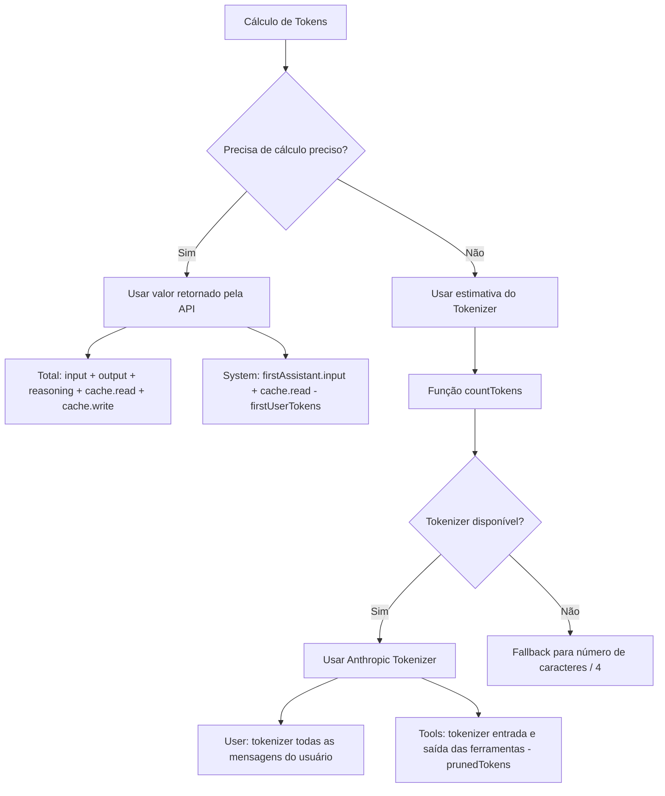

# Princípios de Cálculo de Tokens

## O que você poderá fazer após concluir

- Entender a estratégia de cálculo de tokens do DCP (valores da API vs. valores estimados)
- Ler a distribuição de tokens na saída do `/dcp context`
- Conhecer a margem de erro da estimativa de tokens e métodos de otimização
- Avaliar com precisão o efeito de economia do DCP

## Seu dilema atual

Você olha para a saída do `/dcp context`, cheia de números e porcentagens, mas não sabe como eles foram calculados:

```
Session Context Breakdown:
─────────────────────────────────────────────────────────

System         15.2% │████████████████▒▒▒▒▒▒▒▒▒▒▒▒▒▒▒▒▒▒▒▒▒│  25.1K tokens
User            5.1% │████▒▒▒▒▒▒▒▒▒▒▒▒▒▒▒▒▒▒▒▒▒▒▒▒▒▒▒▒▒▒▒▒▒▒▒▒▒▒▒▒▒│   8.4K tokens
Assistant       35.8% │██████████████████████████████████████▒▒▒▒▒▒│  59.2K tokens
Tools (45)      43.9% │████████████████████████████████████████████████│  72.6K tokens
─────────────────────────────────────────────────────────

Summary:
  Pruned:          12 tools (~15.2K tokens)
  Current context: ~165.3K tokens
  Without DCP:     ~180.5K tokens
```

De onde vêm esses números? Por que o Assistant é "cálculo residual"? Como o prunedTokens é calculado?

## Quando usar esta técnica

- Quando quiser avaliar com precisão o efeito de economia do DCP
- Quando precisar analisar a estrutura de consumo de tokens (qual parte ocupa mais)
- Quando suspeitar de erros no cálculo de tokens e quiser verificar a precisão
- Quando precisar reportar os resultados da otimização do DCP à equipe

## Ideia central

O cálculo de tokens do DCP adota uma **estratégia híbrida**: **prioriza o uso de valores precisos retornados pela API, usando valores estimados quando necessário**.



**Princípios-chave**:
1. **Prioridade para valores da API**: Total e System usam valores precisos retornados pela API
2. **Valores estimados para complementar**: User e Tools usam estimativa do tokenizer (pois a API não fornece esses valores)
3. **Cálculo residual**: Assistant é calculado através de Total - System - User - Tools

---

## Estratégia de Cálculo de Tokens

### Valores precisos retornados pela API

A API do OpenCode retorna estatísticas precisas de tokens para cada resposta da IA:

| Campo | Descrição | Origem |
| --- | --- | --- |
| `tokens.input` | Número de tokens de entrada da requisição atual | Valor preciso da API |
| `tokens.output` | Número de tokens de saída gerados na requisição atual | Valor preciso da API |
| `tokens.reasoning` | Número de tokens de raciocínio (ex: cadeia de pensamento do Claude 3.5) | Valor preciso da API (quando aplicável) |
| `tokens.cache.read` | Número de tokens lidos do cache | Valor preciso da API |
| `tokens.cache.write` | Número de tokens escritos no cache | Valor preciso da API |

**Esses valores são precisos**, pois vêm diretamente do sistema de cobrança do provedor LLM.

### Método de cálculo de valores estimados

Para valores que a API não fornece (ex: mensagens do usuário, chamadas de ferramentas), o DCP usa o **Anthropic Tokenizer** para estimação.

**Código de implementação** (`lib/strategies/utils.ts:36-43`):

```typescript
export function countTokens(text: string): number {
    if (!text) return 0
    try {
        // Prioriza o uso do Anthropic Tokenizer
        return anthropicCountTokens(text)
    } catch {
        // Em caso de falha, faz fallback para número de caracteres / 4
        return Math.round(text.length / 4)
    }
}
```

**Por que usar número de caracteres/4 como backup**:
- Para texto em inglês, a proporção média de tokens é de aproximadamente 4 caracteres = 1 token
- Isso é apenas uma estimativa grosseira e pode ter erros
- Só é usado quando o Tokenizer não está disponível (ex: problemas de rede, falha no carregamento da biblioteca)

---

## Lógica de Cálculo de Tokens por Categoria

### Total (número total de tokens)

**Fórmula de cálculo**:

```typescript
total = input + output + reasoning + cache.read + cache.write
```

**Código de implementação** (`lib/commands/context.ts:103-108`):

```typescript
const apiInput = lastAssistant?.tokens?.input || 0
const apiOutput = lastAssistant?.tokens?.output || 0
const apiReasoning = lastAssistant?.tokens?.reasoning || 0
const apiCacheRead = lastAssistant?.tokens?.cache?.read || 0
const apiCacheWrite = lastAssistant?.tokens?.cache?.write || 0
breakdown.total = apiInput + apiOutput + apiReasoning + apiCacheRead + apiCacheWrite
```

**Explicação**:
- Usa as estatísticas de tokens da última resposta do Assistant
- Inclui todos os valores retornados pela API
- Consistente com o número total de tokens exibido na UI do OpenCode

### System (tokens do prompt do sistema)

**Fórmula de cálculo**:

```typescript
system = firstAssistant.input + firstAssistant.cache.read - firstUserTokens
```

**Código de implementação** (`lib/commands/context.ts:161-165`):

```typescript
if (firstAssistant) {
    const firstInput =
        (firstAssistant.tokens?.input || 0) + (firstAssistant.tokens?.cache?.read || 0)
    breakdown.system = Math.max(0, firstInput - firstUserTokens)
}
```

**Princípio**:
1. **O input da primeira resposta do Assistant** contém: prompt do sistema + primeira mensagem do usuário
2. **Subtrai o número de tokens da primeira mensagem do usuário** (estimado usando tokenizer) para obter o número de tokens puro do prompt do sistema
3. **Adiciona cache.read** (leitura do cache também conta como token do sistema)

::: info Por que é cálculo residual?
A API não fornece diretamente o número de tokens do "prompt do sistema", só pode ser calculado através de "input da primeira resposta - primeira mensagem do usuário". Este é um método de estimação padrão.
:::

### User (tokens de mensagens do usuário)

**Fórmula de cálculo**:

```typescript
user = tokenizer(all user messages)
```

**Código de implementação** (`lib/commands/context.ts:110-157`):

```typescript
const userTextParts: string[] = []

for (const msg of messages) {
    if (isMessageCompacted(state, msg)) continue
    if (msg.info.role === "user" && isIgnoredUserMessage(msg)) continue

    const parts = Array.isArray(msg.parts) ? msg.parts : []
    for (const part of parts) {
        if (part.type === "text" && msg.info.role === "user") {
            const textPart = part as TextPart
            const text = textPart.text || ""
            userTextParts.push(text)
        }
    }
}

breakdown.user = countTokens(userTextParts.join("\n"))
```

**Explicação**:
- Usa tokenizer para calcular o número de tokens de todas as mensagens do usuário
- Pula mensagens que já foram compactadas (`isMessageCompacted`)
- Pula mensagens ignoradas (mensagens internas do sistema)

### Tools (tokens de chamada de ferramentas)

**Fórmula de cálculo**:

```typescript
tools = tokenizer(toolInputs + toolOutputs) - prunedTokens
```

**Código de implementação** (`lib/commands/context.ts:110-167`):

```typescript
const toolInputParts: string[] = []
const toolOutputParts: string[] = []

for (const msg of messages) {
    if (isMessageCompacted(state, msg)) continue

    const parts = Array.isArray(msg.parts) ? msg.parts : []
    for (const part of parts) {
        if (part.type === "tool") {
            const toolPart = part as ToolPart
            breakdown.toolCount++

            // Extrair entrada da ferramenta
            if (toolPart.state?.input) {
                const inputStr =
                    typeof toolPart.state.input === "string"
                        ? toolPart.state.input
                        : JSON.stringify(toolPart.state.input)
                toolInputParts.push(inputStr)
            }

            // Extrair saída da ferramenta (apenas para status concluído)
            if (toolPart.state?.status === "completed" && toolPart.state?.output) {
                const outputStr =
                    typeof toolPart.state.output === "string"
                        ? toolPart.state.output
                        : JSON.stringify(toolPart.state.output)
                toolOutputParts.push(outputStr)
            }
        }
    }
}

const toolInputTokens = countTokens(toolInputParts.join("\n"))
const toolOutputTokens = countTokens(toolOutputParts.join("\n"))
breakdown.tools = Math.max(0, toolInputTokens + toolOutputTokens - breakdown.prunedTokens)
```

**Explicação**:
- Calcula os tokens de entrada e saída de todas as ferramentas
- Subtrai os tokens das ferramentas já podadas (`prunedTokens`)
- Só conta saídas de ferramentas com `status === "completed"`

### Assistant (tokens de mensagens do assistente)

**Fórmula de cálculo**:

```typescript
assistant = total - system - user - tools
```

**Código de implementação** (`lib/commands/context.ts:168-171`):

```typescript
breakdown.assistant = Math.max(
    0,
    breakdown.total - breakdown.system - breakdown.user - breakdown.tools,
)
```

**Princípio**:
- Assistant é **cálculo residual** (Residual Calculation)
- Do Total, subtrai System, User e Tools, o restante é o Assistant

::: info Por que Assistant inclui tokens de raciocínio?
Se o modelo persistir tokens de raciocínio (reasoning) no contexto, eles pertencem ao "conteúdo gerado pelo Assistant", portanto serão classificados na categoria Assistant. Isso é razoável, pois o raciocínio é o assistente "pensando".
:::

---

## Cálculo de Economia de Tokens

### Cálculo de prunedTokens

**Assinatura da função** (`lib/strategies/utils.ts:49-94`):

```typescript
export const calculateTokensSaved = (
    state: SessionState,
    messages: WithParts[],
    pruneToolIds: string[],
): number
```

**Lógica de cálculo**:

1. Percorre todas as mensagens
2. Encontra as ferramentas podadas (correspondendo `part.callID` com `pruneToolIds`)
3. Extrai o conteúdo de entrada e saída das ferramentas
4. Usa `countTokens` para calcular o número de tokens
5. Soma os tokens de todas as ferramentas podadas

**Código de implementação**:

```typescript
export const calculateTokensSaved = (
    state: SessionState,
    messages: WithParts[],
    pruneToolIds: string[],
): number => {
    try {
        const contents: string[] = []
        for (const msg of messages) {
            if (isMessageCompacted(state, msg)) {
                continue
            }
            const parts = Array.isArray(msg.parts) ? msg.parts : []
            for (const part of parts) {
                if (part.type !== "tool" || !pruneToolIds.includes(part.callID)) {
                    continue
                }
                // Trata caso especial da ferramenta question
                if (part.tool === "question") {
                    const questions = part.state.input?.questions
                    if (questions !== undefined) {
                        const content =
                            typeof questions === "string" ? questions : JSON.stringify(questions)
                        contents.push(content)
                    }
                    continue
                }
                // Extrair saída de ferramentas concluídas
                if (part.state.status === "completed") {
                    const content =
                        typeof part.state.output === "string"
                            ? part.state.output
                            : JSON.stringify(part.state.output)
                    contents.push(content)
                } else if (part.state.status === "error") {
                    // Extrair mensagem de erro de ferramentas com erro
                    const content =
                        typeof part.state.error === "string"
                            ? part.state.error
                            : JSON.stringify(part.state.error)
                    contents.push(content)
                }
            }
        }
        const tokenCounts: number[] = estimateTokensBatch(contents)
        return tokenCounts.reduce((sum, count) => sum + count, 0)
    } catch (error: any) {
        return 0
    }
}
```

**Explicação**:
- Só calcula os tokens das ferramentas podadas
- Para ferramentas concluídas, calcula sua saída
- Para ferramentas com erro, calcula sua mensagem de erro
- Se o cálculo falhar (exceção), retorna 0

---

## Margem de Erro no Cálculo de Tokens

### Fontes de erro de estimação

| Categoria | Precisão | Fonte de erro | Impacto |
| --- | --- | --- | --- |
| Total | 100% | Valor preciso da API, sem erro | Nenhum |
| System | 95-98% | Estimativa de tokens da primeira mensagem do usuário tem erro leve | Muito pequeno |
| User | 90-95% | Tokenizer pode ter diferença na tokenização vs. modelo real | Médio |
| Tools | 90-95% | Tokenizer + impacto do formato de serialização de parâmetros da ferramenta | Médio |
| Assistant | 90-95% | Erro propagado de User e Tools | Médio |

### Controle de erro

**O DCP adota vários métodos para controlar o erro**:

1. **Usar Anthropic Tokenizer**:
   - Mais próximo da lógica de tokenização real do Claude
   - Para OpenAI, Gemini, pode haver diferença leve

2. **Pular mensagens internas do sistema**:
   - `isIgnoredUserMessage` filtra mensagens internas do OpenCode
   - Evita calcular tokens não relevantes

3. **Math.max(0, ...)**:
   - Garante que o resultado não seja negativo
   - Previne situações anômalas

::: tip Observação de erro real
Em testes, a diferença entre a estimativa de tokens do DCP e a exibida na UI do OpenCode geralmente está dentro de ±5%. Para estimar o efeito de economia de tokens, essa precisão é suficiente.
:::

---

## Interpretação da saída do /dcp context

### Mapa de distribuição de tokens

```
System         15.2% │████████████████▒▒▒▒▒▒▒▒▒▒▒▒▒▒▒▒▒▒▒▒▒│  25.1K tokens
User            5.1% │████▒▒▒▒▒▒▒▒▒▒▒▒▒▒▒▒▒▒▒▒▒▒▒▒▒▒▒▒▒▒▒▒▒▒▒▒▒▒▒▒▒│   8.4K tokens
Assistant       35.8% │██████████████████████████████████████▒▒▒▒▒▒│  59.2K tokens
Tools (45)      43.9% │████████████████████████████████████████████████│  72.6K tokens
```

**Significado de cada item**:

| Item | Descrição | Faixa normal de proporção |
| --- | --- | --- |
| System | Tokens do prompt do sistema | 10-20% |
| User | Tokens de todas as mensagens do usuário | 3-8% |
| Assistant | Saída de texto do assistente + tokens de raciocínio | 30-40% |
| Tools (n) | Tokens de chamada de ferramentas (n = número de ferramentas no contexto) | 40-50% |

### Interpretação do Summary

```
Summary:
  Pruned:          12 tools (~15.2K tokens)
  Current context: ~165.3K tokens
  Without DCP:     ~180.5K tokens
```

**Significado de cada item**:

| Item | Método de cálculo | Descrição |
| --- | --- | --- |
| Pruned | `state.prune.toolIds.length` número de ferramentas + `prunedTokens` | Número de ferramentas podadas e tokens economizados |
| Current context | `breakdown.total` (valor preciso da API) | Número real de tokens no contexto atual |
| Without DCP | `total + prunedTokens` | Número teórico de tokens se não houvesse DCP |

**Cálculo da taxa de economia**:

```
Taxa de economia = prunedTokens / Without DCP
                 = 15.2K / 180.5K
                 ≈ 8.4%
```

::: tip Referência de taxa de economia
- Uso leve: 5-10% (leitura ocasional de arquivos repetidos)
- Uso moderado: 10-20% (deduplicação frequente, poda de sobrescrição)
- Uso intenso: 20-30% (muitas chamadas de ferramentas, poda ativa pela IA)
:::

---

## Prática: Analisando a distribuição de tokens

### Cenário 1: Excesso de chamadas de ferramentas

**Problema**: `Tools` representa mais de 60%, contexto muito grande.

```
Tools (120)     65.2% │████████████████████████████████████████████████│  120.5K tokens
```

**Possíveis causas**:
- Muitas ferramentas foram chamadas na conversa (ex: leitura de arquivos múltiplas vezes, busca)
- Saída das ferramentas é muito grande (ex: leitura de arquivos longos)

**Sugestões de otimização**:
- Ativar **estratégia de deduplicação** (`strategies.deduplication.enabled: true`)
- Ativar **estratégia de sobrescrição** (`strategies.supersedeWrites.enabled: true`)
- Usar `/dcp sweep` para limpar ferramentas antigas manualmente

### Cenário 2: Proporção excessiva do Assistant

**Problema**: `Assistant` representa mais de 50%, possivelmente tokens de raciocínio.

```
Assistant       52.3% │██████████████████████████████████████████████▒▒▒▒▒▒│  95.2K tokens
```

**Possíveis causas**:
- Usou modelo com raciocínio (ex: Claude 3.5)
- Assistente gerou muito texto

**Sugestões de otimização**:
- Tokens de raciocínio não podem ser podados (pertencem ao conteúdo gerado pelo Assistant)
- Pode reduzir encurtando a saída do assistente (pedindo para a IA ser mais concisa)
- Verificar se há chamadas de ferramentas redundantes (podando através de deduplicação)

### Cenário 3: Taxa de economia baixa

**Problema**: `Pruned` é muito pequeno, taxa de economia < 5%.

```
Summary:
  Pruned:          2 tools (~1.2K tokens)
  Current context: ~165.3K tokens
  Without DCP:     ~166.5K tokens
```

**Possíveis causas**:
- Poucas chamadas de ferramentas repetidas na conversa
- Não ativou estratégias automáticas (deduplicação, sobrescrição, limpeza de erros)
- IA não chamou ativamente ferramentas `discard`/`extract`

**Sugestões de otimização**:
- Ativar todas as estratégias automáticas:
  ```jsonc
  {
    "strategies": {
      "deduplication": { "enabled": true },
      "supersedeWrites": { "enabled": true },
      "purgeErrors": { "enabled": true }
    }
  }
  ```
- Ativar **função de lembrete** (`tools.settings.nudgeEnabled: true`), para que a IA poda ativamente

---

## Alertas de armadilhas

### ❌ Erro comum 1: Esperar 100% de precisão

**Problema**: Esperar que o cálculo de tokens corresponda exatamente à fatura da API.

**Realidade**: O cálculo do DCP é um **valor estimado**, com erro de ±5%.

**Solução**:
- Usar as estatísticas do DCP como **referência relativa** (ex: taxa de economia)
- Não usar para auditoria de cobrança precisa
- A fatura da API é o único registro de consumo preciso

### ❌ Erro comum 2: Ignorar tokens de raciocínio

**Problema**: Tokens de raciocínio são classificados em Assistant, mas o usuário acha que foram ignorados.

**Realidade**: Tokens de raciocínio fazem parte do conteúdo gerado pelo Assistant, a classificação é razoável.

**Solução**:
- Tokens de raciocínio não podem ser podados (não pertencem a nenhuma ferramenta)
- Se a proporção de tokens de raciocínio for muito alta (> 30%), pode tentar:
  - Usar modelo sem raciocínio
  - Simplificar tarefas, reduzindo a necessidade de raciocínio

### ❌ Erro comum 3: Pensar que tokens de cache não contam para Total

**Problema**: Achar que `cache.read` não conta para `Total`, causando mal-entendido.

**Realidade**: `cache.read` conta para `Total`, mas não gera custo real (pois já está em cache).

**Solução**:
- `Total` é o **tamanho do contexto**, não o **custo real**
- Tokens com cache hit ainda ocupam espaço no contexto
- Se precisar otimizar custos, pode verificar a economia acumulada em `/dcp stats`

### ❌ Erro comum 4: Entrada de ferramenta podada não reduz tokens

**Problema**: DCP podou a entrada da ferramenta, mas `Current context` do `/dcp context` não mudou.

**Realidade**: `Current context` mostra os **tokens enviados para o LLM**, conteúdo podado não está incluído.

**Solução**:
- `Current context` = `Without DCP` - `prunedTokens`
- Se `prunedTokens` aumentou, significa que a poda está funcionando
- Se `Current context` não diminuiu, pode ser porque `prunedTokens` é muito pequeno, ou há novas mensagens aumentando os tokens

---

## Resumo desta aula

O cálculo de tokens do DCP adota uma estratégia híbrida:

1. **Valores precisos da API**: Total, System usam valores precisos retornados pela API
2. **Estimativa do Tokenizer**: User, Tools usam estimativa do Anthropic Tokenizer
3. **Cálculo residual**: Assistant é calculado através de Total - System - User - Tools

**Funções principais**:
- `countTokens()`: Calcula o número de tokens do texto (prioriza o uso do Anthropic Tokenizer)
- `calculateTokensSaved()`: Calcula o número de tokens economizados de ferramentas podadas
- `analyzeTokens()`: Analisa a distribuição de tokens do contexto

**Margem de erro**:
- Total: 100% preciso (valor da API)
- Outras categorias: 90-98% (valores estimados)
- Erro geral: ±5%

**Cenários de uso**:
- Usar `/dcp context` para ver a distribuição de tokens
- Otimizar a configuração de estratégias de acordo com a distribuição
- Usar `/dcp stats` para ver o efeito de economia acumulado

---

## Próxima aula

> Na próxima aula aprenderemos sobre **[Referência da API](../api-reference/)**.
>
> Você aprenderá:
> - Documentação da interface API do plugin DCP
> - Explicação completa dos itens de configuração
> - Interface de gerenciamento de estado
> - Pontos de extensão para desenvolvedores de plugins

---

## Apêndice: Referência do código-fonte

<details>
<summary><strong>Clique para expandir e ver a localização do código-fonte</strong></summary>

> Última atualização: 2026-01-23

| Função | Caminho do arquivo | Linhas |
| --- | --- | --- |
| Função countTokens | [`lib/strategies/utils.ts`](https://github.com/Opencode-DCP/opencode-dynamic-context-pruning/blob/main/lib/strategies/utils.ts#L36-L43) | 36-43 |
| calculateTokensSaved | [`lib/strategies/utils.ts`](https://github.com/Opencode-DCP/opencode-dynamic-context-pruning/blob/main/lib/strategies/utils.ts#L49-L94) | 49-94 |
| Função analyzeTokens | [`lib/commands/context.ts`](https://github.com/Opencode-DCP/opencode-dynamic-context-pruning/blob/main/lib/commands/context.ts#L68-L174) | 68-174 |
| Comentários da estratégia de cálculo de tokens | [`lib/commands/context.ts`](https://github.com/Opencode-DCP/opencode-dynamic-context-pruning/blob/main/lib/commands/context.ts#L5-L38) | 5-38 |
| handleContextCommand | [`lib/commands/context.ts`](https://github.com/Opencode-DCP/opencode-dynamic-context-pruning/blob/main/lib/commands/context.ts#L238-L247) | 238-247 |

**Funções principais**:
- `countTokens(text: string): number`: Calcula o número de tokens do texto, usa Anthropic Tokenizer ou faz fallback para número de caracteres/4
- `calculateTokensSaved(state, messages, pruneToolIds): number`: Calcula o número de tokens economizados de ferramentas podadas
- `analyzeTokens(state, messages): TokenBreakdown`: Analisa a distribuição de tokens do contexto

**Interfaces principais**:
- `TokenBreakdown`: Resultado da análise de distribuição de tokens
  ```typescript
  interface TokenBreakdown {
      system: number
      user: number
      assistant: number
      tools: number
      toolCount: number
      prunedTokens: number
      prunedCount: number
      total: number
  }
  ```

</details>
