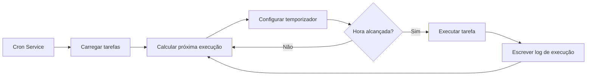

# Tarefas Agendadas Cron e Webhooks

## O que você poderá fazer após esta lição

Ao concluir esta lição, você será capaz de:

- Criar tarefas agendadas Cron que executam tarefas de IA automaticamente em um horário ou periodicidade específica
- Compreender os cenários de uso dos três métodos de agendamento (at, every, cron)
- Configurar Webhooks para receber acionamentos de eventos externos
- Configurar a integração com Gmail Pub/Sub para implementar respostas de IA acionadas por e-mail
- Gerenciar histórico e logs de execução de tarefas

## Seu problema atual

Você pode estar enfrentando estas situações:

- Precisa se lembrar de fazer algo em um horário fixo
- Quer resumir periodicamente o progresso do trabalho ou gerar relatórios
- Precisa acionar automaticamente a análise de IA ao receber certos e-mails
- Não quer enviar mensagens manualmente à IA toda vez

## Quando usar esta técnica

**Tarefas Agendadas Cron** são adequadas para estes cenários:

| Cenário | Exemplo | Método de agendamento |
|---------|---------|----------------------|
| Lembrete único | "Lembre-me da reunião amanhã às 9 da manhã" | at |
| Verificação periódica | "Verificar o status do sistema a cada 30 minutos" | every |
| Execução agendada | "Gerar relatório diário todas as tardes às 17h" | cron |
| Ciclo complexo | "Segunda a sexta às 9 da manhã" | cron |

**Webhooks** são adequados para estes cenários:

- Receber notificações push do GitHub, GitLab
- Receber notificações de pagamento bem-sucedido do Stripe
- Receber notificações de chamada recebida do Twilio
- Qualquer serviço que possa enviar HTTP POST

**Gmail Pub/Sub** é adequado para estes cenários:

- Analisar automaticamente ao receber e-mails importantes
- Classificação e resposta automática de e-mails
- Extração e arquivamento de conteúdo de e-mails

---

## Conceitos chave

### Fluxo de trabalho das tarefas Cron



### Comparação dos três métodos de agendamento

| Método | Cenário de uso | Exemplo | Precisão |
|--------|---------------|---------|-----------|
| `at` | Tarefa única | 2026-01-27 09:00:00 | Nível de milissegundos |
| `every` | Intervalo fixo | A cada 30 minutos | Nível de milissegundos |
| `cron` | Ciclo complexo | Todas as manhãs às 9h | Nível de minutos |

### Dois objetivos de sessão

| Objetivo de sessão | Tipo de Payload | Descrição |
|---------------------|----------------|------------|
| `main` | `systemEvent` | Injetar eventos do sistema na sessão principal |
| `isolated` | `agentTurn` | Executar Agent em sessão isolada |

**Restrição chave**:
- `sessionTarget="main"` deve usar `payload.kind="systemEvent"`
- `sessionTarget="isolated"` deve usar `payload.kind="agentTurn"`

---

## 🎒 Preparativos antes de começar

Antes de começar, certifique-se de:

::: warning Verificação prévia
- [ ] Gateway está rodando（[Iniciar Gateway](../../start/gateway-startup/)）
- [ ] Modelo de IA está configurado（[Configuração do modelo IA](../models-auth/)）
- [ ] Entender a sintaxe básica de expressões Cron（se usar agendamento cron）
:::

---

## Siga comigo

### Passo 1: Verificar o status do serviço Cron

**Por que**: Confirmar que o serviço Cron está ativado e rodando

```bash
## Verificar o status do Cron usando CLI
clawdbot cron status
```

**Você deveria ver**:

```
✓ Cron enabled
  Store: ~/.clawdbot/cron.json
  Jobs: 0
  Next wake: null
```

Se mostrar `disabled`, você precisa ativá-lo no arquivo de configuração:

```json
{
  "cron": {
    "enabled": true,
    "store": "~/.clawdbot/cron.json",
    "maxConcurrentRuns": 5
  }
}
```

---

### Passo 2: Criar tarefa agendada única

**Por que**: Aprender o método de agendamento `at` mais básico

Use a ferramenta cron para adicionar uma tarefa que será executada em 1 minuto:

```json
{
  "action": "add",
  "job": {
    "name": "Lembrete de teste",
    "enabled": true,
    "schedule": {
      "kind": "at",
      "atMs": 1738000000000
    },
    "sessionTarget": "main",
    "wakeMode": "next-heartbeat",
    "payload": {
      "kind": "systemEvent",
      "text": "Este é um lembrete de teste: verificar o progresso do trabalho"
    }
  }
}
```

**Você deveria ver**:

```
✓ Job added: job_xxx
  Name: Lembrete de teste
  Next run: 2026-01-27 10:00:00
```

**Dica**: `atMs` é o timestamp Unix (em milissegundos). Você pode calculá-lo usando JavaScript:

```javascript
Date.now() + 60 * 1000  // 1 minuto depois
```

---

### Passo 3: Criar tarefa de intervalo repetido

**Por que**: Aprender o método de agendamento `every`, adequado para verificações periódicas

Criar uma tarefa que será executada a cada 30 minutos:

```json
{
  "action": "add",
  "job": {
    "name": "Verificar sistema a cada 30 minutos",
    "enabled": true,
    "schedule": {
      "kind": "every",
      "everyMs": 1800000
    },
    "sessionTarget": "main",
    "wakeMode": "next-heartbeat",
    "payload": {
      "kind": "systemEvent",
      "text": "Verificar status do sistema: CPU, memória, disco"
    }
  }
}
```

**Você deveria ver**:

```
✓ Job added: job_xxx
  Name: Verificar sistema a cada 30 minutos
  Interval: 30 minutes
  Next run: 2026-01-27 10:00:00
```

**Descrição dos parâmetros**:
- `everyMs`: Tempo de intervalo (em milissegundos)
  - 1 minuto = 60.000 ms
  - 5 minutos = 300.000 ms
  - 30 minutos = 1.800.000 ms
  - 1 hora = 3.600.000 ms
- `anchorMs` (opcional): Hora de início para a primeira execução

---

### Passo 4: Criar tarefa com expressão Cron

**Por que**: Aprender o método de agendamento `cron`, adequado para ciclos complexos

Criar uma tarefa que será executada todos os dias às 9 da manhã:

```json
{
  "action": "add",
  "job": {
    "name": "Relatório diário toda manhã às 9h",
    "enabled": true,
    "schedule": {
      "kind": "cron",
      "expr": "0 9 * * *",
      "tz": "Asia/Shanghai"
    },
    "sessionTarget": "main",
    "wakeMode": "next-heartbeat",
    "payload": {
      "kind": "systemEvent",
      "text": "Gerar relatório diário de trabalho de hoje"
    }
  }
}
```

**Você deveria ver**:

```
✓ Job added: job_xxx
  Name: Relatório diário toda manhã às 9h
  Schedule: 0 9 * * * (Asia/Shanghai)
  Next run: 2026-01-27 09:00:00
```

**Formato da expressão Cron**:

```
┌───────────── Minuto (0 - 59)
│ ┌─────────── Hora (0 - 23)
│ │ ┌───────── Dia (1 - 31)
│ │ │ ┌─────── Mês (1 - 12)
│ │ │ │ ┌───── Dia da semana (0 - 7, 0 e 7 representam domingo)
│ │ │ │ │
* * * * *
```

**Expressões comuns**:

| Expressão | Descrição |
|-----------|-----------|
| `0 9 * * *` | Todos os dias às 9 da manhã |
| `0 9 * * 1-5` | Segunda a sexta às 9 da manhã |
| `0 */6 * * *` | A cada 6 horas |
| `0 0 * * 0` | Todos os domingos à meia-noite |
| `0 9,17 * * *` | Todos os dias às 9h e 17h |

::: info Configuração de fuso horário
As expressões Cron usam por padrão o fuso horário UTC. Use o campo `tz` para especificar o fuso horário (ex. `"Asia/Shanghai"`), garantindo que as tarefas sejam executadas no horário esperado.
:::

---

### Passo 5: Executar tarefa em sessão isolada

**Por que**: Executar tarefas de IA em um ambiente isolado para evitar interferir com a sessão principal

Criar uma tarefa que será executada em uma sessão isolada:

```json
{
  "action": "add",
  "job": {
    "name": "Resumo diário",
    "enabled": true,
    "schedule": {
      "kind": "cron",
      "expr": "0 18 * * *",
      "tz": "Asia/Shanghai"
    },
    "sessionTarget": "isolated",
    "wakeMode": "next-heartbeat",
    "payload": {
      "kind": "agentTurn",
      "message": "Resumir o trabalho de hoje: 1. Tarefas concluídas 2. Problemas encontrados 3. Plano de amanhã",
      "model": "anthropic/claude-sonnet-4-20250514",
      "thinking": "low"
    }
  }
}
```

**Você deveria ver**:

```
✓ Job added: job_xxx
  Name: Resumo diário
  Session: isolated
  Next run: 2026-01-27 18:00:00
```

**Parâmetros do Payload `agentTurn`**:

| Parâmetro | Tipo | Descrição |
|-----------|------|------------|
| `message` | string | Prompt enviado ao Agent |
| `model` | string | Sobrescrever o modelo a usar (opcional) |
| `thinking` | string | Nível de pensamento: "off" \| "minimal" \| "low" \| "medium" \| "high" |
| `timeoutSeconds` | number | Tempo de espera (segundos) |
| `deliver` | boolean | Se enviar o resultado ao canal |
| `channel` | string | Canal de destino (ex. `"whatsapp"`, `"telegram"`) |
| `to` | string | Identificador do destinatário |
| `bestEffortDeliver` | boolean | Se tentar outros canais quando impossível enviar ao canal especificado |

**Configuração de sessão isolada** (opcional):

```json
{
  "isolation": {
    "postToMainPrefix": "📊 Resumo diário:",
    "postToMainMode": "summary",
    "postToMainMaxChars": 8000
  }
}
```

| Parâmetro | Descrição |
|-----------|------------|
| `postToMainPrefix` | Prefixo ao reenviar resultados à sessão principal |
| `postToMainMode` | "summary" (resumo) ou "full" (texto completo) |
| `postToMainMaxChars` | Máximo de caracteres quando `postToMainMode="full"` |

---

### Passo 6: Listar e gerenciar tarefas

**Por que**: Ver todas as tarefas e gerenciar seu status

**Listar todas as tarefas**:

```bash
clawdbot cron list
```

**Você deveria ver**:

```
Jobs: 3
  ✓ job_xxx: Lembrete de teste (enabled, next: 2026-01-27 10:00:00)
  ✓ job_yyy: Verificar sistema a cada 30 minutos (enabled, next: 2026-01-27 10:00:00)
  ✓ job_zzz: Relatório diário toda manhã às 9h (enabled, next: 2026-01-27 09:00:00)
```

**Incluir tarefas desabilitadas**:

```bash
clawdbot cron list --include-disabled
```

**Desabilitar tarefa**:

```json
{
  "action": "update",
  "jobId": "job_xxx",
  "patch": {
    "enabled": false
  }
}
```

**Habilitar tarefa**:

```json
{
  "action": "update",
  "jobId": "job_xxx",
  "patch": {
    "enabled": true
  }
}
```

**Remover tarefa**:

```json
{
  "action": "remove",
  "jobId": "job_xxx"
}
```

---

### Passo 7: Executar tarefa imediatamente

**Por que**: Testar se a tarefa funciona normalmente sem esperar o agendamento

```json
{
  "action": "run",
  "jobId": "job_xxx"
}
```

**Você deveria ver**:

```
✓ Job ran: job_xxx
  Status: ok
  Duration: 1234ms
```

**Ver histórico de execução**:

```json
{
  "action": "runs",
  "jobId": "job_xxx",
  "limit": 10
}
```

**Você deveria ver**:

```
Runs for job_xxx (10 most recent):
  2026-01-27 10:00:00 - ok - 1234ms
  2026-01-26 10:00:00 - ok - 1189ms
  2026-01-25 10:00:00 - ok - 1245ms
```

---

### Passo 8: Adicionar contexto à tarefa de lembrete

**Por que**: Permitir que a IA entenda o contexto recente da conversa e fornecer lembretes mais relevantes

Usar o parâmetro `contextMessages` para adicionar o histórico de mensagens recentes:

```json
{
  "action": "add",
  "job": {
    "name": "Lembrete de acompanhamento de tarefas",
    "enabled": true,
    "schedule": {
      "kind": "cron",
      "expr": "0 10,16 * * *",
      "tz": "Asia/Shanghai"
    },
    "sessionTarget": "main",
    "wakeMode": "next-heartbeat",
    "payload": {
      "kind": "systemEvent",
      "text": "Acompanhar o progresso das suas tarefas: 1. Verificar pendências 2. Atualizar status do projeto"
    },
    "contextMessages": 5
  }
}
```

**Limites de mensagens de contexto**:
- Máximo de mensagens: 10
- Máximo de caracteres por mensagem: 220
- Limite total de caracteres: 700
- Formato: `- User: ...\n- Assistant: ...`

**Contexto adicionado automaticamente**:

```
Acompanhar o progresso das suas tarefas: 1. Verificar pendências 2. Atualizar status do projeto

Recent context:
- User: Preciso terminar o relatório hoje
- Assistant: Entendido, que tipo de relatório você precisa?
- User: É um relatório semanal, inclui o resumo do trabalho desta semana
```

---

## Configuração de Webhook

### Visão geral de Webhook

Webhooks permitem que serviços externos acionem eventos internos do Clawdbot através de requisições HTTP POST. Usos comuns:

- **GitHub/GitLab**: Notificações push acionam processos CI/CD
- **Stripe**: Notificações de pagamento bem-sucedido acionam processamento de pedidos
- **Twilio**: Notificações de chamada recebida acionam respostas de voz de IA
- **Jira**: Notificações de criação de ticket acionam respostas automáticas

### Configurar Webhook

**Habilitar sistema de Hooks**:

```json
{
  "hooks": {
    "enabled": true,
    "path": "/hooks",
    "token": "your-secret-token-here"
  }
}
```

**Configurar regras de mapeamento**:

```json
{
  "hooks": {
    "enabled": true,
    "token": "your-secret-token-here",
    "mappings": [
      {
        "id": "github-push",
        "match": {
          "path": "/hooks/github"
        },
        "action": "wake",
        "wakeMode": "now",
        "sessionKey": "main",
        "messageTemplate": "Notificação push GitHub: {{ repository }} - {{ ref }}"
      }
    ]
  }
}
```

**Parâmetros de configuração de mapeamento**:

| Parâmetro | Descrição |
|-----------|------------|
| `match.path` | Caminho URL para corresponder |
| `match.source` | Cabeçalho de origem da requisição para corresponder |
| `action` | `"wake"` ou `"agent"` |
| `wakeMode` | `"now"` ou `"next-heartbeat"` |
| `sessionKey` | Chave de sessão de destino (ex. `"main"`) |
| `messageTemplate` | Modelo de mensagem usando sintaxe Mustache |
| `deliver` | Se enviar ao canal |
| `channel` | Canal de destino (ex. `"whatsapp"`) |
| `to` | Identificador do destinatário |
| `transform` | Módulo de transformação (processa corpo da requisição) |

---

## Integração com Gmail Pub/Sub

### Visão geral de Gmail Pub/Sub

Gmail Pub/Sub permite que você acione o Clawdbot em tempo real ao receber novos e-mails, implementando respostas de IA acionadas por e-mail.

### Configurar Gmail Pub/Sub

**Configuração básica**:

```json
{
  "hooks": {
    "enabled": true,
    "token": "your-hook-token",
    "gmail": {
      "account": "your-email@gmail.com",
      "label": "INBOX",
      "topic": "projects/your-project-id/topics/gmail-topic",
      "subscription": "gmail-subscription",
      "pushToken": "your-push-token",
      "hookUrl": "http://127.0.0.1:18789/hooks/gmail",
      "includeBody": true,
      "maxBytes": 20000,
      "renewEveryMinutes": 720
    }
  }
}
```

**Descrição dos parâmetros de configuração**:

| Parâmetro | Descrição | Valor padrão |
|-----------|------------|--------------|
| `account` | Endereço da conta Gmail | - |
| `label` | Etiqueta Gmail para monitorar | `INBOX` |
| `topic` | Caminho do tópico Pub/Sub do Google Cloud | - |
| `subscription` | Nome da assinatura Pub/Sub | `gmail-subscription` |
| `pushToken` | Token push Gmail | - |
| `hookUrl` | URL de recebimento do Webhook | Gerado automaticamente |
| `includeBody` | Se incluir corpo do e-mail | `true` |
| `maxBytes` | Máximo de bytes do e-mail | `20000` |
| `renewEveryMinutes` | Intervalo de renovação da assinatura (minutos) | `720` (12 horas) |

### Integração Tailscale (opcional)

**Expor Webhook usando Tailscale Serve**:

```json
{
  "hooks": {
    "gmail": {
      "tailscale": {
        "mode": "serve",
        "path": "/gmail-pubsub",
        "target": "10000"
      }
    }
  }
}
```

**Usar Tailscale Funnel**:

```json
{
  "hooks": {
    "gmail": {
      "tailscale": {
        "mode": "funnel",
        "path": "/gmail-pubsub"
      }
    }
  }
}
```

| Modo | Descrição |
|------|------------|
| `off` | Não usar Tailscale |
| `serve` | Expor serviço local através de Tailscale Serve |
| `funnel` | Acesso da internet através de Tailscale Funnel |

### Iniciar Gmail Watcher

**Iniciar serviço Gmail Watcher**:

```bash
clawdbot hooks gmail-watch
```

**Você deveria ver**:

```
✓ Gmail watcher started
  Account: your-email@gmail.com
  Label: INBOX
  Watching...
```

**Gmail Watcher irá**:
1. Assinar mudanças de etiqueta do Gmail
2. Receber novos pushes de e-mail
3. Enviar informações do e-mail ao Webhook
4. Acionar eventos internos do Clawdbot

---

## Ponto de controle ✅

**Confirme que você dominou**:

- [ ] Pode criar três tipos de tarefas Cron (at, every, cron)
- [ ] Entende a diferença entre objetivos de sessão `main` e `isolated`
- [ ] Pode listar, habilitar, desabilitar e remover tarefas
- [ ] Pode ver o histórico de execução de tarefas
- [ ] Entende a configuração e o princípio de funcionamento do Webhook
- [ ] Pode configurar a integração com Gmail Pub/Sub

---

## Solução de problemas

### Tarefa não é executada

**Problema**: Tarefa foi adicionada mas nunca é executada

**Possíveis causas**:

| Causa | Solução |
|-------|---------|
| Serviço Cron não habilitado | Verificar configuração `cron.enabled` |
| Hora não alcançada | Verificar próxima execução com `clawdbot cron list` |
| Fuso horário incorreto | Verificar se campo `tz` está correto |
| Tarefa desabilitada | Verificar status da tarefa com `--include-disabled` |

### Erro na expressão Cron

**Problema**: Tarefa é executada no momento errado

**Erros comuns**:

| Erro | Correto | Descrição |
|------|---------|-----------|
| `9 * * *` | `0 9 * * *` | Campo minuto faltando |
| `0 9 * * * *` | `0 9 * * *` | Um campo extra |
| `0 9 1-5 * *` | `0 9 * * 1-5` | Posição do campo dia da semana incorreta |

**Ferramenta de validação**: Use [crontab.guru](https://crontab.guru/) para validar expressões Cron.

### Gmail Pub/Sub não funciona

**Problema**: E-mail recebido mas não acionado

**Lista de verificação**:

- [ ] O serviço Gmail Watcher está rodando?
- [ ] A `hookUrl` é acessível? (testar com curl)
- [ ] O `token` está configurado corretamente?
- [ ] O tópico e assinatura Pub/Sub estão criados corretamente?
- [ ] A conexão de rede está normal? (quando usando Tailscale)

### Sessão isolada sem resposta

**Problema**: Tarefas com `sessionTarget="isolated"` não têm saída

**Possíveis causas**:

- Campo `model` faltando, usando modelo padrão mas não configurado
- O prompt `message` não é claro o suficiente
- `timeoutSeconds` muito curto, tarefa expira
- `deliver=false` mas `postToMainMode` não configurado

**Solução**:

1. Aumentar nível de detalhe de log
2. Verificar logs do Gateway
3. Usar `bestEffortDeliver=true` para garantir que resultado seja pelo menos reenviado à sessão principal

---

## Resumo da lição

Cron e Webhooks são ferramentas de automação poderosas do Clawdbot:

**Sistema Cron**:
- Três métodos de agendamento: `at` (único), `every` (intervalo), `cron` (ciclo complexo)
- Dois objetivos de sessão: `main` (injetar evento do sistema), `isolated` (executar Agent)
- Suporta histórico de tarefas e logs de execução
- Pode adicionar mensagens de contexto para fornecer lembretes mais relevantes

**Sistema Webhook**:
- Receber requisições HTTP POST externas
- Suporta regras de mapeamento e modelos de mensagem
- Pode configurar Tailscale para exposição pública na internet

**Gmail Pub/Sub**:
- Monitorar novos e-mails em tempo real
- Suporta filtragem por etiqueta
- Integração com Tailscale Serve/Funnel

Ao configurar adequadamente essas funcionalidades, você pode construir um assistente de IA totalmente automatizado que responde no momento certo.

---

## Prévia da próxima lição

> Na próxima lição, aprenderemos **[Sistema de memória e busca vetorial](../memory-system/)**.
>
> Você será capaz de:
> - Estrutura de arquivos e mecanismo de indexação do sistema de memória
> - Configurar provedores de busca vetorial (OpenAI, Gemini, local)
> - Usar busca híbrida (BM25 + vetorial) para melhorar precisão de recuperação
> - Gerenciar índices de memória e busca através de CLI

---

## Apêndice: Referência de código fonte

<details>
<summary><strong>Clique para ver localizações do código fonte</strong></summary>

> Data de atualização: 2026-01-27

| Funcionalidade | Caminho do arquivo | Números de linha |
|---------------|-------------------|-------------------|
| Definição de tipos de configuração Cron | [`src/config/types.cron.ts`](https://github.com/clawdbot/clawdbot/blob/main/src/config/types.cron.ts#L1-L6) | 1-6 |
| Definição de tipos centrais Cron | [`src/cron/types.ts`](https://github.com/clawdbot/clawdbot/blob/main/src/cron/types.ts#L1-L95) | 1-95 |
| Cron Service | [`src/cron/service.ts`](https://github.com/clawdbot/clawdbot/blob/main/src/cron/service.ts#L1-L49) | 1-49 |
| Implementação de operações Cron | [`src/cron/service/ops.ts`](https://github.com/clawdbot/clawdbot/blob/main/src/cron/service/ops.ts#L1-L141) | 1-141 |
| Implementação de ferramenta Cron | [`src/agents/tools/cron-tool.ts`](https://github.com/clawdbot/clawdbot/blob/main/src/agents/tools/cron-tool.ts#L1-L291) | 1-291 |
| Métodos Cron de Gateway | [`src/gateway/server-methods/cron.ts`](https://github.com/clawdbot/clawdbot/blob/main/src/gateway/server-methods/cron.ts#L1-L205) | 1-205 |
| Definição de tipos de configuração Hooks | [`src/config/types.hooks.ts`](https://github.com/clawdbot/clawdbot/blob/main/src/config/types.hooks.ts#L1-L125) | 1-125 |
| Ferramenta Gmail de Hooks | [`src/hooks/gmail.ts`](https://github.com/clawdbot/clawdbot/blob/main/src/hooks/gmail.ts#L1-L267) | 1-267 |
| Eventos internos de Hooks | [`src/hooks/hooks.ts`](https://github.com/clawdbot/clawdbot/blob/main/src/hooks/hooks.ts#L1-L15) | 1-15 |
| Comandos CLI de Hooks | [`src/cli/hooks-cli.ts`](https://github.com/clawdbot/clawdbot/blob/main/src/cli/hooks-cli.ts#L1-L839) | 1-839 |

**Constantes chave**:
- `DEFAULT_GMAIL_LABEL = "INBOX"`: Etiqueta padrão do Gmail
- `DEFAULT_GMAIL_TOPIC = "gog-gmail-watch"`: Nome padrão do tópico do Gmail
- `DEFAULT_GMAIL_SUBSCRIPTION = "gog-gmail-watch-push"`: Nome padrão da assinatura do Gmail
- `DEFAULT_GMAIL_MAX_BYTES = 20000`: Máximo padrão de bytes do e-mail
- `DEFAULT_GMAIL_RENEW_MINUTES = 720`: Intervalo padrão de renovação (12 horas)

**Funções chave**:
- `CronService.start()`: Iniciar serviço Cron
- `CronService.add()`: Adicionar tarefa agendada
- `CronService.update()`: Atualizar tarefa
- `CronService.remove()`: Remover tarefa
- `CronService.run()`: Executar tarefa imediatamente
- `createCronTool()`: Criar ferramenta Cron
- `resolveGmailHookRuntimeConfig()`: Resolver configuração de Gmail Hook
- `buildGogWatchStartArgs()`: Construir argumentos de início do Gmail Watch
- `buildGogWatchServeArgs()`: Construir argumentos de serviço do Gmail Watch

</details>
