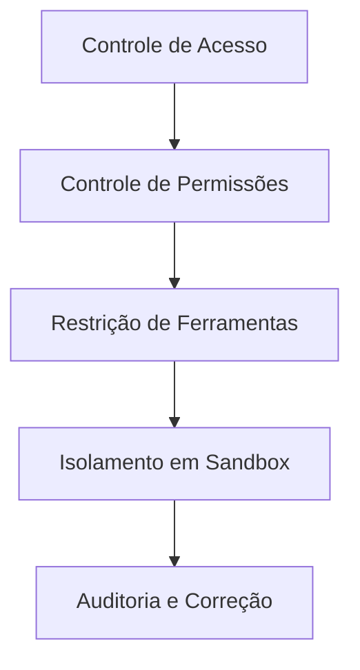

# Segurança e Isolamento em Sandbox: Protegendo seu Assistente de IA

## O que Você Poderá Fazer Após Este Módulo

- Configurar múltiplas camadas de políticas de segurança, desde controle de acesso até permissões de ferramentas
- Usar isolamento em sandbox para limitar o acesso ao sistema de arquivos e rede do assistente de IA
- Executar auditorias de segurança para identificar e corrigir vulnerabilidades comuns
- Ajustar o nível de segurança de acordo com diferentes cenários (pessoal/familiar/público)

## Seu Desafio Atual

O Clawdbot torna seu assistente de IA poderoso, mas também introduz novos desafios de segurança:

- **Acesso Shell**: A IA pode executar comandos arbitrários, ler e escrever arquivos
- **Acesso à Rede**: A IA pode acessar qualquer URL e serviço
- **Envio de Mensagens**: A IA pode enviar mensagens para qualquer pessoa (se configurado com WhatsApp)
- **Controle Remoto**: Controlar o navegador local através de ferramentas de navegador
- **Exposição de Dados**: Todo o histórico de conversas é armazenado no disco

Sem proteções adequadas, um modelo de IA manipulado pode ter consequências catastróficas.

## Quando Usar Esta Solução

- ✅ Você precisa executar o assistente de IA em seu próprio dispositivo e está preocupado com riscos de segurança
- ✅ Você deseja expor o assistente de IA para uso por múltiplas pessoas (membros da família, equipe)
- ✅ Você precisa limitar o acesso da IA a arquivos ou diretórios específicos
- ✅ Você deseja isolar o escopo de acesso de diferentes usuários/sessões
- ✅ Você precisa executar o assistente de IA em um ambiente restrito (sandbox)

::: info
**Conceito Importante**: A segurança é em camadas, de "quem pode acessar" para "o que pode fazer", e finalmente "segurança do modelo".
:::

## 🎒 Preparativos Antes de Começar

### Verificações Prévias

- [x] Completou [Início Rápido](../../start/getting-started/), entenda como iniciar o Gateway
- [ ] Configurou pelo menos um modelo de IA (Anthropic, OpenAI ou Ollama)
- [ ] Entende seu cenário de uso (uso pessoal, compartilhamento familiar, serviço público)
- [ ] Entende conceitos de permissões de arquivos Linux (chmod)

### Ferramentas Recomendadas

- Ferramenta de linha de comando: Terminal ou SSH
- Editor: Seu editor de código preferido
- Docker: Para executar contêineres de sandbox (opcional)

---

## Ideia Central

O modelo de segurança do Clawdbot é baseado em uma filosofia central: **controle de acesso primeiro, segurança defensiva depois**.

### Camadas de Segurança



1. **Controle de Acesso**: Decide quem pode conversar com seu assistente de IA
2. **Controle de Permissões**: Decide quais ferramentas o assistente de IA pode chamar
3. **Isolamento em Sandbox**: Decide em que ambiente as ferramentas são executadas (host ou contêiner)
4. **Auditoria e Correção**: Verifica e corrige continuamente a configuração de segurança

Este design em camadas garante que, mesmo se o modelo for manipulado, o escopo do ataque seja limitado aos limites definidos.

### Três Camadas de Proteção de Controle de Acesso

O Clawdbot oferece três camadas de controle de acesso:

| Camada | Conteúdo de Proteção | Local de Configuração |
|--- | --- | ---|
| **Autenticação do Gateway** | Conexões WebSocket | `gateway.auth` |
| **Política de DM** | Mensagens de chat privado | `channels.*.dmPolicy` |
| **Política de Grupo** | Mensagens de grupo | `channels.*.groupPolicy` / `channels.*.groups` |

Cada camada pode ser configurada independentemente, formando defesa em profundidade.

---

## Auditoria de Segurança: Identificando Riscos

O Clawdbot fornece ferramentas integradas de auditoria de segurança que podem identificar rapidamente vulnerabilidades comuns.

### Executando Auditoria

```bash
# Auditoria básica
clawdbot security audit

# Auditoria profunda (inclui detecção do Gateway)
clawdbot security audit --deep

# Correção automática de recomendações de segurança
clawdbot security audit --fix
```

### Conteúdo da Auditoria

A ferramenta de auditoria verificará os seguintes aspectos:

| Categoria | Itens Específicos | Nível de Risco |
|--- | --- | ---|
| **Acesso de Entrada** | Autenticação do Gateway, política de DM, política de Grupo | Crítico / Aviso |
| **Acesso a Ferramentas** | Lista de permissão de execução elevada, allow/deny de ferramentas | Crítico / Aviso |
| **Exposição de Rede** | Modo de bind do Gateway, Tailscale Serve/Funnel | Crítico / Info |
| **Controle do Navegador** | Autenticação de controle remoto do navegador, protocolo de URL | Crítico / Aviso |
| **Permissões de Arquivos** | Permissões de arquivos de configuração, diretório de estado | Crítico / Aviso |
| **Confiança de Plugins** | Plugins não explicitamente permitidos | Aviso |

### Entendendo a Saída da Auditoria

O relatório de auditoria é classificado por nível de severidade:

- **Crítico (vermelho)**: Correção imediata necessária, pode levar à execução remota de código ou vazamento de dados
- **Aviso (amarelo)**: Correção recomendada, reduz os limites de segurança
- **Info (azul)**: Informação informativa, não é um problema de segurança

### Correção Automática

Ao usar a flag `--fix`, a ferramenta de auditoria aplicará as seguintes correções com segurança:

- Alterar `groupPolicy="open"` para `allowlist`
- Alterar `logging.redactSensitive="off"` para `"tools"`
- Corrigir permissões de arquivos (arquivos de configuração 600, diretórios 700)

::: tip
**Melhor Prática**: Execute auditorias regularmente, especialmente após alterar configurações ou atualizar o Gateway.
:::

---

## Controle de Acesso: Quem Pode Acessar seu Assistente de IA

O controle de acesso é a primeira linha de defesa, decidindo quem pode interagir com seu assistente de IA.

### Autenticação do Gateway

Por padrão, o Gateway requer autenticação para aceitar conexões WebSocket.

#### Configurando o Modo de Autenticação

```json5
{
  "gateway": {
    "auth": {
      "mode": "token",  // ou "password"
      "token": "your-long-random-token-please-change-me"
    }
  }
}
```

**Modos de Autenticação**:

| Modo | Uso | Cenário Recomendado |
|--- | --- | ---|
| `token` | Token bearer compartilhado | Maioria dos casos, recomendado |
| `password` | Autenticação por senha | Desenvolvimento local, conveniente para testes rápidos |
| Tailscale Identity | Tailscale Serve | Acesso remoto via Tailscale |

::: warning
**Importante**: Se `gateway.bind` estiver configurado para não-loopback (como `lan`, `tailnet`), você deve configurar autenticação, caso contrário as conexões serão recusadas.
:::

### Política de DM: Proteção de Chat Privado

A política de DM controla se usuários desconhecidos podem conversar diretamente com seu assistente de IA.

| Política | Comportamento | Cenário Recomendado |
|--- | --- | ---|
| `pairing` (padrão) | Remetentes desconhecidos recebem código de emparelhamento, não processa antes do emparelhamento | Uso pessoal, recomendado |
| `allowlist` | Remetentes desconhecidos são rejeitados | Ambiente confiável com múltiplas pessoas |
| `open` | Permite qualquer pessoa | Serviço público (requer `allowFrom` contendo `"*"`) |
| `disabled` | Ignora todos os chats privados | Usa apenas funcionalidades de grupo |

#### Exemplo de Configuração

```json5
{
  "channels": {
    "whatsapp": {
      "dmPolicy": "pairing"
    },
    "telegram": {
      "dmPolicy": "allowlist",
      "allowFrom": ["user123", "user456"]
    }
  }
}
```

#### Gerenciando Emparelhamento

```bash
# Listar solicitações de emparelhamento pendentes
clawdbot pairing list whatsapp

# Aprovar emparelhamento
clawdbot pairing approve whatsapp <código-de-emparelhamento>
```

::: tip
**Melhor Prática**: O modo `pairing` padrão fornece um bom equilíbrio entre experiência do usuário e segurança. Use `allowlist` ou `open` apenas quando você confia explicitamente em todos os usuários.
:::

### Política de Grupo: Controle de Mensagens de Grupo

A política de Grupo determina como o assistente de IA responde a mensagens em grupos.

| Política | Comportamento | Local de Configuração |
|--- | --- | ---|
| `allowlist` | Apenas aceita grupos na lista de permissão | `channels.whatsapp.groups` |
| `disabled` | Ignora todas as mensagens de grupo | `channels.telegram.groups` |
| `requireMention` | Apenas responde quando mencionado com @ ou comando acionado | `channels.*.groups.*` |

#### Exemplo de Configuração

```json5
{
  "channels": {
    "whatsapp": {
      "groups": {
        "*": {
          "requireMention": true
        }
      }
    },
    "discord": {
      "guilds": {
        "your-guild-id": {
          "users": ["user1", "user2"]
        }
      }
    }
  }
}
```

::: tip
**Melhor Prática**: Ative `requireMention` em grupos públicos para evitar que o assistente de IA seja manipulado por usuários maliciosos.
:::

### Isolamento de Sessão: Prevenindo Vazamento de Contexto

Por padrão, todas as mensagens de chat privado são roteadas para a mesma sessão principal. Quando múltiplos usuários podem acessar o assistente de IA, isso pode levar a vazamento de contexto.

```json5
{
  "session": {
    "dmScope": "per-channel-peer"  // Cria sessões independentes para cada canal-remetente
  }
}
```

---

## Controle de Permissões de Ferramentas: Limitando o que a IA Pode Fazer

O controle de permissões de ferramentas é a segunda linha de defesa, decidindo quais ferramentas o assistente de IA pode chamar.

### Listas de Permissão/Denegação de Ferramentas

Você pode configurar listas de permissão (allow) e denegação (deny) de ferramentas globalmente ou para cada Agente.

```json5
{
  "agents": {
    "defaults": {
      "tools": {
        "allow": ["read", "write", "web_search"],
        "deny": ["exec", "browser", "web_fetch"]
      }
    },
    "list": [
      {
        "id": "read-only",
        "tools": {
          "allow": ["read"],
          "deny": ["write", "edit", "apply_patch", "exec", "browser"]
        }
      }
    ]
  }
}
```

### Categorias Comuns de Ferramentas

| Categoria de Ferramenta | Ferramentas Específicas | Nível de Risco |
|--- | --- | ---|
| **Operações de Arquivo** | `read`, `write`, `edit`, `apply_patch` | Médio |
| **Execução de Shell** | `exec`, `process` | Alto |
| **Controle de Navegador** | `browser` | Alto |
| **Acesso à Rede** | `web_search`, `web_fetch` | Médio |
| **Visualização Canvas** | `canvas` | Médio |
| **Operações de Nós** | `nodes_invoke` | Alto |
| **Tarefas Cron** | `cron` | Médio |
| **Envio de Mensagens** | `message`, `sessions_*` | Baixo |

### Modo Elevated: Saída de Emergência para Execução no Host

Exec elevado é uma saída de emergência especial que permite que ferramentas sejam executadas no host, contornando o sandbox.

```json5
{
  "tools": {
    "elevated": {
      "enabled": true,
      "allowFrom": {
        "whatsapp": ["your-trusted-user-id"]
      },
      "security": "allowlist",
      "ask": "on"  // Pede confirmação antes de cada execução
    }
  }
}
```

::: danger
**Aviso Importante**: Exec elevado contorna as restrições do sandbox. Ative apenas quando você confia completamente nos usuários permitidos e nos cenários.
:::

::: tip
**Melhor Prática**: Para a maioria dos cenários, desative exec elevado e dependa do isolamento em sandbox e listas estritas de permissão de ferramentas.
:::

---

## Isolamento em Sandbox: Executando em Ambiente Restrito

O isolamento em sandbox faz com que as ferramentas sejam executadas em contêineres Docker, limitando o acesso ao sistema de arquivos e rede.

### Modos de Sandbox

| Modo | Comportamento | Cenário Recomendado |
|--- | --- | ---|
| `off` | Todas as ferramentas executam no host | Ambiente confiável pessoal |
| `non-main` (recomendado) | Sessão principal no host, outras sessões no sandbox | Equilíbrio entre performance e segurança |
| `all` | Todas as sessões no sandbox | Ambiente com múltiplas pessoas, serviço público |

```json5
{
  "agents": {
    "defaults": {
      "sandbox": {
        "mode": "non-main"
      }
    }
  }
}
```

### Acesso ao Workspace

O acesso ao workspace determina quais diretórios do host os contêineres de sandbox podem ver.

| Nível de Acesso | Comportamento | Cenário Recomendado |
|--- | --- | ---|
| `none` (padrão) | Workspace do sandbox `~/.clawdbot/sandboxes` | Isolamento máximo |
| `ro` | Workspace do agente montado como somente leitura em `/agent` | Lê mas não escreve arquivos |
| `rw` | Workspace do agente montado como leitura/escrita em `/workspace` | Agentes que precisam escrever arquivos |

```json5
{
  "agents": {
    "defaults": {
      "sandbox": {
        "workspaceAccess": "none"
      }
    }
  }
}
```

### Escopo do Sandbox

O escopo do sandbox determina a granularidade de isolamento do contêiner.

| Escopo | Comportamento | Número de Contêineres |
|--- | --- | ---|
| `session` (padrão) | Um contêiner por sessão | Mais contêineres, melhor isolamento |
| `agent` | Um contêiner por Agente | Equilíbrio entre isolamento e recursos |
| `shared` | Todas as sessões compartilham um contêiner | Economiza recursos, menor isolamento |

### Configuração Docker

```json5
{
  "agents": {
    "defaults": {
      "sandbox": {
        "docker": {
          "image": "clawdbot-sandbox:bookworm-slim",
          "containerPrefix": "clawdbot-sbx-"
        }
      }
    }
  }
}
```

### Montagens Personalizadas

Você pode montar diretórios adicionais do host no contêiner de sandbox.

```json5
{
  "agents": {
    "defaults": {
      "sandbox": {
        "docker": {
          "binds": [
            "/home/user/source:/source:ro",
            "/var/run/docker.sock:/var/run/docker.sock"
          ]
        }
      }
    }
  }
}
```

::: warning
**Dica de Segurança**: Montagens contornam o isolamento do sistema de arquivos do sandbox. Montagens sensíveis (como docker.sock) devem usar o modo `:ro` (somente leitura).
:::

### Navegador em Sandbox

O navegador em sandbox executa instâncias do Chrome em contêineres, isolando as operações do navegador.

```json5
{
  "agents": {
    "defaults": {
      "sandbox": {
        "browser": {
          "enabled": true,
          "autoStart": true,
          "autoStartTimeoutMs": 10000
        }
      }
    }
  }
}
```

::: tip
**Melhor Prática**: O navegador em sandbox pode impedir que o assistente de IA acesse suas sessões de login e dados sensíveis do navegador diário.
:::

---

## Configuração de Segurança de Múltiplos Agentes

Diferentes Agentes podem ter configurações de segurança diferentes.

### Exemplos de Cenários

#### Cenário 1: Agente Pessoal (confiança total)

```json5
{
  "agents": {
    "list": [
      {
        "id": "personal",
        "sandbox": { "mode": "off" },
        "tools": {
          "allow": ["*"],
          "deny": []
        }
      }
    ]
  }
}
```

#### Cenário 2: Agente Familiar (somente leitura)

```json5
{
  "agents": {
    "list": [
      {
        "id": "family",
        "workspace": "~/clawd-family",
        "sandbox": {
          "mode": "all",
          "scope": "agent",
          "workspaceAccess": "ro"
        },
        "tools": {
          "allow": ["read"],
          "deny": ["write", "edit", "apply_patch", "exec", "browser"]
        }
      }
    ]
  }
}
```

#### Cenário 3: Agente Público (sandbox + restrições estritas)

```json5
{
  "agents": {
    "list": [
      {
        "id": "public",
        "workspace": "~/clawd-public",
        "sandbox": {
          "mode": "all",
          "scope": "agent",
          "workspaceAccess": "none"
        },
        "tools": {
          "allow": ["web_search", "sessions_list"],
          "deny": ["read", "write", "edit", "apply_patch", "exec", "browser", "web_fetch", "canvas", "nodes", "cron", "gateway", "image"]
        }
      }
    ]
  }
}
```

---

## Dockerização: Isolamento Completo do Gateway

Além do sandbox em nível de ferramenta, você também pode executar todo o Gateway em um contêiner Docker.

### Vantagens da Dockerização Completa

- Isolamento completo do processo do Gateway
- Evita instalar dependências no host
- Facilita implantação e gerenciamento
- Fornece camada adicional de segurança

::: tip
Quando usar Dockerização vs Sandbox de Ferramentas:
- **Sandbox de Ferramentas**: Para a maioria dos cenários, equilíbrio entre performance e segurança
- **Dockerização**: Ambiente de produção, implantação multi-tenant, necessita isolamento completo
:::

### Referência de Instalação Docker

Para instruções detalhadas de instalação do Docker, consulte: [Opções de Implantação](../../appendix/deployment/).

---

## Cuidados e Armadilhas

### Erros Comuns

#### ❌ Esquecer de configurar autenticação do Gateway

**Configuração Incorreta**:
```json5
{
  "gateway": {
    "bind": "lan"  // Perigoso!
    "auth": {}
  }
}
```

**Consequência**: Qualquer pessoa que puder se conectar à sua rede local pode controlar seu assistente de IA.

**Configuração Correta**:
```json5
{
  "gateway": {
    "bind": "loopback",  // ou configure autenticação forte
    "auth": {
      "mode": "token",
      "token": "your-secure-token"
    }
  }
}
```

#### ❌ Usar `dmPolicy: "open"` mas esquecer `allowFrom`

**Configuração Incorreta**:
```json5
{
  "channels": {
    "whatsapp": {
      "dmPolicy": "open"  // Perigoso!
    }
  }
}
```

**Consequência**: Qualquer pessoa pode enviar mensagens para seu assistente de IA.

**Configuração Correta**:
```json5
{
  "channels": {
    "whatsapp": {
      "dmPolicy": "open",
      "allowFrom": ["*"]  // Deve permitir explicitamente
    }
  }
}
```

#### ❌ Habilitar Exec elevado mas não configurar allowFrom

**Configuração Incorreta**:
```json5
{
  "tools": {
    "elevated": {
      "enabled": true  // Perigoso!
    }
  }
}
```

**Consequência**: Qualquer usuário pode executar comandos no host.

**Configuração Correta**:
```json5
{
  "tools": {
    "elevated": {
      "enabled": true,
      "allowFrom": {
        "discord": ["your-user-id"]  // Limita usuários permitidos
      },
      "security": "allowlist",
      "ask": "on"  // Exige confirmação
    }
  }
}
```

#### ❌ Montagem sensível usando modo de leitura/escrita

**Configuração Incorreta**:
```json5
{
  "agents": {
    "defaults": {
      "sandbox": {
        "docker": {
          "binds": [
            "/var/run/docker.sock:/var/run/docker.sock"  // Perigoso!
          ]
        }
      }
    }
  }
}
```

**Consequência**: O sandbox pode controlar o daemon Docker.

**Configuração Correta**:
```json5
{
  "agents": {
    "defaults": {
      "sandbox": {
        "docker": {
          "binds": [
            "/var/run/docker.sock:/var/run/docker.sock:ro"  // Somente leitura
          ]
        }
      }
    }
  }
}
```

### Resumo de Melhores Práticas

| Prática | Motivo |
|--- | ---|
| Use o modo `pairing` por padrão | Equilíbrio entre experiência do usuário e segurança |
| Use `requireMention` para mensagens de grupo | Evita manipulação |
| Use lista de permissão de ferramentas em vez de lista de denegação | Princípio de menor privilégio |
| Ative sandbox mas defina `workspaceAccess: "none"` | Isola acesso ao workspace |
| Execute auditorias de segurança regularmente | Monitoramento contínuo de segurança |
| Armazene chaves sensíveis em variáveis de ambiente ou arquivos de configuração | Evita vazamento de código |

---

## Resumo do Módulo

Este módulo apresentou o modelo de segurança e funcionalidade de isolamento em sandbox do Clawdbot:

**Pontos Chave**:

1. **Camadas de Segurança**: Controle de Acesso → Controle de Permissões → Isolamento em Sandbox → Auditoria e Correção
2. **Controle de Acesso**: Autenticação do Gateway, Política de DM, Política de Grupo
3. **Permissões de Ferramentas**: Listas allow/deny, Modo Elevated
4. **Isolamento em Sandbox**: Modos, escopo, acesso ao workspace, configuração Docker
5. **Auditoria de Segurança**: `clawdbot security audit` para identificar e corrigir problemas

**Princípio de Segurança em Primeiro Lugar**:
- Comece com os menores privilégios, relaxe apenas quando necessário
- Use isolamento em sandbox para limitar o escopo de ataque
- Execute auditorias regularmente e atualize configurações
- Mantenha cautela com funcionalidades sensíveis (como Exec elevado)

---

## Próximo Módulo

> No próximo módulo, aprenderemos **[Gateway Remoto e Tailscale](../remote-gateway/)**.
>
> Você aprenderá:
> - Expor o Gateway para sua Tailnet via Tailscale Serve
> - Acesso público via Tailscale Funnel (com cautela)
> - Configuração de túnel SSH e proxy reverso
> - Melhores práticas de segurança para acesso remoto

---

## Apêndice: Referência de Código Fonte

<details>
<summary><strong>Clique para expandir e ver localização do código fonte</strong></summary>

> Data de atualização: 2026-01-27

| Funcionalidade | Caminho do Arquivo | Linha |
|--- | --- | ---|
| Auditoria de Segurança | [`src/security/audit.ts`](https://github.com/clawdbot/clawdbot/blob/main/src/security/audit.ts#L1-L910) | 1-910 |
| Correção de Segurança | [`src/security/fix.ts`](https://github.com/clawdbot/clawdbot/blob/main/src/security/fix.ts#L1-L385) | 1-385 |
| Verificação de Permissões de Arquivos | [`src/security/audit-fs.ts`](https://github.com/clawdbot/clawdbot/blob/main/src/security/audit-fs.ts) | Arquivo inteiro |
| Schema de Configuração do Gateway | [`src/config/zod-schema.core.ts`](https://github.com/clawdbot/clawdbot/blob/main/src/config/zod-schema.core.ts) | Arquivo inteiro |
| Schema de Defaults de Agente | [`src/config/zod-schema.agent-defaults.ts`](https://github.com/clawdbot/clawdbot/blob/main/src/config/zod-schema.agent-defaults.ts) | 1-172 |
| Schema de Sandbox | [`src/config/zod-schema.agent-runtime.ts`](https://github.com/clawdbot/clawdbot/blob/main/src/config/zod-schema.agent-runtime.ts) | 82-511 |
| Gerenciamento de Sandbox | [`src/agents/sandbox.ts`](https://github.com/clawdbot/clawdbot/blob/main/src/agents/sandbox.ts) | Arquivo inteiro |
| Resolução de Configuração de Sandbox | [`src/agents/sandbox/config.js`](https://github.com/clawdbot/clawdbot/blob/main/src/agents/sandbox/config.js) | Arquivo inteiro |
| Configuração Docker | [`src/agents/sandbox/docker.js`](https://github.com/clawdbot/clawdbot/blob/main/src/agents/sandbox/docker.js) | Arquivo inteiro |
| Documentação de Segurança | [`docs/gateway/security.md`](https://github.com/clawdbot/clawdbot/blob/main/docs/gateway/security.md) | Arquivo inteiro |
| Documentação de Sandbox | [`docs/gateway/sandboxing.md`](https://github.com/clawdbot/clawdbot/blob/main/docs/gateway/sandboxing.md) | Arquivo inteiro |
| CLI de Sandbox | [`docs/cli/sandbox.md`](https://github.com/clawdbot/clawdbot/blob/main/docs/cli/sandbox.md) | Arquivo inteiro |

**Campos de Configuração Chave**:

```typescript
// Configuração de Sandbox
sandbox: {
  mode: "off" | "non-main" | "all",  // Modo de sandbox
  workspaceAccess: "none" | "ro" | "rw",  // Acesso ao workspace
  scope: "session" | "agent" | "shared",  // Escopo do sandbox
  docker: {
    image: string,  // Imagem Docker
    binds: string[],  // Montagens do host
    network: "bridge" | "none" | "custom"  // Modo de rede
  },
  browser: {
    enabled: boolean,  // Se o navegador é sandboxizado
    autoStart: boolean,  // Início automático
  },
  prune: {
    idleHours: number,  // Remover automaticamente após inatividade
    maxAgeDays: number,  // Dias máximos de retenção
  }
}

// Permissões de Ferramentas
tools: {
  allow: string[],  // Ferramentas permitidas
  deny: string[],  // Ferramentas negadas
  elevated: {
    enabled: boolean,  // Se a execução no host está habilitada
    allowFrom: {  // Lista de permissão por canal
      [provider: string]: string[] | number[]
    },
    security: "deny" | "allowlist" | "full",  // Política de segurança
    ask: "off" | "on-miss" | "always",  // Política de confirmação
  }
}

// Política de DM
dmPolicy: "pairing" | "allowlist" | "open" | "disabled"

// Política de Grupo
groupPolicy: "allowlist" | "open" | "disabled"
```

**Constantes Chave**:

- `DEFAULT_SANDBOX_IMAGE`: `"clawdbot-sandbox:bookworm-slim"` - Imagem padrão do sandbox
- `DEFAULT_SANDBOX_COMMON_IMAGE`: Imagem padrão do sandbox comum

**Funções Chave**:

- `runSecurityAudit()`: Executa auditoria de segurança
- `fixSecurityFootguns()`: Aplica correções de segurança
- `resolveSandboxConfigForAgent()`: Resolve configuração de sandbox para Agente
- `buildSandboxCreateArgs()`: Constrói argumentos de criação do contêiner de sandbox

</details>
