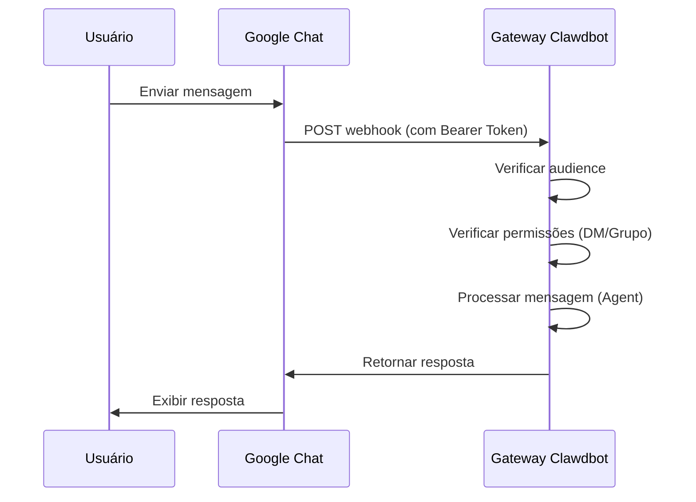

# Configuração do Canal Google Chat

## O Que Você Poderá Fazer Depois de Terminar

- Conversar 1:1 com seu assistente de IA no Google Chat
- Usar @menção para acionar o assistente de IA em espaços do Google Chat
- Dominar os métodos de autenticação Service Account e configuração de Webhook
- Aprender a usar Tailscale Funnel para expor URLs públicas com segurança

## Seu Dilema Atual

Você deseja usar um assistente de IA através do Google Chat em sua empresa ou equipe, mas não sabe como:

- Criar e configurar um projeto Google Cloud
- Configurar autenticação Service Account
- Configurar Webhook para que o Google Chat possa conectar ao seu Gateway
- Expor o Gateway publicamente na internet com segurança

## Quando Usar Esta Abordagem

**Cenários adequados para o canal Google Chat**:

- Sua equipe usa principalmente o Google Chat para comunicação
- Precisa usar assistente de IA em ambiente Google Workspace
- Deseja colaborar através do Google Chat Spaces
- Precisa receber mensagens do Google Chat via Webhook público

**Cenários inadequados**:

- Uso pessoal (recomenda-se WebChat, Telegram, WhatsApp)
- Precisa de autorização de usuário OAuth (Google Chat suporta apenas Service Account)

## Ideia Central

Fluxo de trabalho do canal Google Chat:



**Conceitos-chave**:

| Conceito | Descrição |
| -------- | --------- |
| **Service Account** | Método de autenticação Google Cloud, usado para verificação de identidade do bot |
| **Webhook** | Endpoint HTTP onde o Google Chat POST mensagens para o Gateway |
| **Audience** | Alvo para verificar requisições webhook (app-url ou project-number) |
| **Emparelhamento DM** | Mecanismo de segurança padrão, remetentes desconhecidos precisam de aprovação |

::: tip
O canal Google Chat suporta apenas autenticação Service Account, não autorização de usuário OAuth. Se precisar de permissões em nível de usuário, considere usar outros canais.
:::

## 🎒 Preparativos

Certifique-se de que você:

- ✅ Completou o [Início Rápido](../../start/getting-started/) e instalou o Clawdbot
- ✅ O Gateway está em execução (`clawdbot gateway --port 18789`)
- ✅ Tem acesso à conta Google Cloud
- ✅ Entende o uso básico de comandos de terminal

::: warning
O Webhook do Google Chat precisa de um endpoint HTTPS público. Este tutorial abordará como usar Tailscale Funnel ou proxy reverso para expor o serviço com segurança.
:::

## Siga Meu Exemplo

### Passo 1: Criar Projeto Google Cloud e Habilitar Chat API

**Por quê**
Primeiro você precisa de um projeto Google Cloud para hospedar o aplicativo Chat e Service Account.

1. Acesse [Google Chat API Credentials](https://console.cloud.google.com/apis/api/chat.googleapis.com/credentials)
2. Se a API não estiver habilitada, clique em **Enable API**

**O que você deve ver**:
- Chat API habilitada e exibida como "API enabled"
- Página de gerenciamento de Credentials

### Passo 2: Criar Service Account

**Por quê**
Service Account é a identidade do bot, usada para autenticar requisições webhook.

1. Na página Credentials, clique em **Create Credentials** > **Service Account**
2. Digite um nome (por exemplo `clawdbot-chat`)
3. Clique em **Continue** (pule a configuração de permissões)
4. Mantenha o controle de acesso vazio, clique em **Done**

**O que você deve ver**:
- Service Account recém-criado aparece na lista

### Passo 3: Criar e Baixar JSON Key

**Por quê**
JSON Key contém credenciais de autenticação, Clawdbot precisa dele para verificar requisições do Google Chat.

1. Clique no Service Account recém-criado
2. Vá para a aba **Keys**
3. Clique em **Add Key** > **Create new key**
4. Selecione o formato **JSON**, clique em **Create**
5. O arquivo JSON baixado será salvo automaticamente

**O que você deve ver**:
- O navegador baixa um arquivo `.json`

::: warning
⚠️ Importante: Este JSON Key só pode ser baixado uma vez, guarde-o com cuidado! Se perdido, deve ser recriado.
:::

### Passo 4: Armazenar Arquivo Service Account

**Por quê**
Clawdbot precisa ler o arquivo Key para verificar requisições do Google Chat.

1. Mova o arquivo JSON baixado para um local seguro:
   ```bash
   mv ~/Downloads/*.json ~/.clawdbot/googlechat-service-account.json
   ```
2. Configure as permissões do arquivo (opcional, mas recomendado):
   ```bash
   chmod 600 ~/.clawdbot/googlechat-service-account.json
   ```

**O que você deve ver**:
- Arquivo armazenado no diretório `~/.clawdbot/`
- Permissões configuradas para leitura/gravação apenas pelo proprietário

### Passo 5: Criar Aplicativo Google Chat

**Por quê**
Chat App define a aparência, comportamento e URL do webhook do bot.

1. Acesse [Google Cloud Console Chat Configuration](https://console.cloud.google.com/apis/api/chat.googleapis.com/hangouts-chat)
2. Preencha **Application info**:
   - **App name**: `Clawdbot` (ou outro nome)
   - **Avatar URL**: `https://clawd.bot/logo.png` (opcional)
   - **Description**: `Personal AI Assistant` (opcional)
3. Habilite **Interactive features**
4. Em **Functionality**, marque **Join spaces and group conversations**
5. Em **Connection settings**, selecione **HTTP endpoint URL**
6. Em **Visibility**, selecione **Make this Chat app available to specific people and groups in &lt;Your Domain&gt;**
7. Digite seu e-mail do Google Workspace (por exemplo `user@example.com`)
8. Clique em **Save** na parte inferior da página

**O que você deve ver**:
- Configuração do aplicativo salva
- Página exibe a seção "App status"

### Passo 6: Configurar Webhook Triggers

**Por quê**
Triggers definem quando o Google Chat envia mensagens para o Gateway.

1. Atualize a página após salvar
2. Encontre a seção **App status** (geralmente no topo ou rodapé)
3. Alterne o status para **Live - available to users**
4. Clique em **Save** novamente

**O que você deve ver**:
- App status exibe "Live - available to users"

::: info
💡 Dica: A URL do Webhook será configurada no Passo 7. Se não tiver certeza, pode usar um placeholder `https://example.com/googlechat` e atualizar depois.
:::

### Passo 7: Obter URL Pública do Gateway

**Por quê**
Google Chat precisa de uma URL HTTPS pública para enviar requisições webhook.

Execute o seguinte comando para ver a URL pública do Gateway:

```bash
clawdbot status
```

**O que você deve ver**:
- A saída contém a URL pública (por exemplo `https://your-node.tailnet.ts.net`)

::: warning
Se o Gateway não estiver configurado com Tailscale ou proxy reverso, você precisa configurar o acesso público primeiro (veja o próximo passo).
:::

### Passo 8: Expor Endpoint Webhook (Escolha Uma Opção)

::: tip
Recomenda-se usar Tailscale Funnel, pois expõe apenas o caminho `/googlechat`, mantendo outros endpoints privados.
:::

#### Opção A: Tailscale Funnel (Recomendado)

**Por que Tailscale Funnel**
- Expõe apenas caminhos específicos, melhorando a segurança
- Gateway interno permanece privado, apenas Webhook acessível
- Sem necessidade de comprar domínio e configurar SSL

1. **Verificar Endereço de Ligação do Gateway**:
   ```bash
   ss -tlnp | grep 18789
   ```
   Anote o endereço IP (por exemplo `127.0.0.1`, `0.0.0.0` ou IP do Tailscale como `100.x.x.x`)

2. **Expor Painel de Controle Apenas para tailnet** (porta 8443):
   ```bash
   # Se vinculado a localhost (127.0.0.1 ou 0.0.0.0):
   tailscale serve --bg --https 8443 http://127.0.0.1:18789
   
   # Se vinculado a IP do Tailscale (por exemplo 100.106.161.80):
   tailscale serve --bg --https 8443 http://100.106.161.80:18789
   ```

3. **Expor Caminho Webhook Publicamente**:
   ```bash
   # Se vinculado a localhost (127.0.0.1 ou 0.0.0.0):
   tailscale funnel --bg --set-path /googlechat http://127.0.0.1:18789/googlechat
   
   # Se vinculado a IP do Tailscale (por exemplo 100.106.161.80):
   tailscale funnel --bg --set-path /googlechat http://100.106.161.80:18789/googlechat
   ```

4. **Autorizar Nó Acesso ao Funnel** (se solicitado):
   - Acesse a URL de autorização exibida na saída
   - Habilite Funnel para este nó no painel de administração do Tailscale

5. **Verificar Configuração**:
   ```bash
   tailscale serve status
   tailscale funnel status
   ```

**O que você deve ver**:
- Serve e Funnel em execução
- URL Webhook pública: `https://<node-name>.<tailnet>.ts.net/googlechat`
- Painel de controle privado: `https://<node-name>.<tailnet>.ts.net:8443/`

#### Opção B: Caddy Proxy Reverso

**Por que Caddy**
- Suporta HTTPS automático
- Configuração flexível de roteamento de caminhos

1. Criar Caddyfile:
   ```txt
   your-domain.com {
       reverse_proxy /googlechat* localhost:18789
   }
   ```

2. Iniciar Caddy:
   ```bash
   caddy run --config Caddyfile
   ```

**O que você deve ver**:
- Caddy iniciado e ouvindo na porta 443
- Apenas o caminho `your-domain.com/googlechat` roteia para o Gateway

#### Opção C: Cloudflare Tunnel

**Por que Cloudflare Tunnel**
- CDN global gratuito
- Configuração simples de regras de caminho

1. Configurar regras de entrada de túnel:
   - **Path**: `/googlechat` -> `http://localhost:18789/googlechat`
   - **Default Rule**: HTTP 404 (Not Found)

### Passo 9: Atualizar URL do Webhook Google Chat

**Por quê**
Agora que você tem uma URL pública, atualize a configuração do Chat App para apontar para o endpoint correto.

1. Volte para a página Google Cloud Console Chat Configuration
2. Na seção **Triggers**:
   - Selecione **Use a common HTTP endpoint URL for all triggers**
   - Configure para: `<sua URL pública>/googlechat`
   - Por exemplo: `https://your-node.tailnet.ts.net/googlechat`
3. Clique em **Save**

**O que você deve ver**:
- Triggers atualizados e salvos

### Passo 10: Configurar Clawdbot

**Por quê**
Diga ao Clawdbot qual Service Account e caminho webhook usar.

**Método A: Variáveis de Ambiente**

```bash
export GOOGLE_CHAT_SERVICE_ACCOUNT_FILE="/path/to/service-account.json"
clawdbot gateway restart
```

**Método B: Arquivo de Configuração**

Edite `~/.clawdbot/clawdbot.json`:

```json5
{
  channels: {
    googlechat: {
      enabled: true,
      serviceAccountFile: "/Users/yourname/.clawdbot/googlechat-service-account.json",
      audienceType: "app-url",
      audience: "https://your-node.tailnet.ts.net/googlechat",
      webhookPath: "/googlechat",
      dm: {
        policy: "pairing",
        allowFrom: ["users/1234567890", "your-email@example.com"]
      },
      groupPolicy: "allowlist",
      groups: {
        "spaces/AAAA": {
          allow: true,
          requireMention: true,
          users: ["users/1234567890"],
          systemPrompt: "Short answers only."
        }
      }
    }
  }
}
```

**Reiniciar Gateway**:

```bash
clawdbot gateway restart
```

**O que você deve ver**:
- Gateway inicia e exibe "Google Chat default: enabled, configured, ..."
- Sem logs de erro

### Passo 11: Adicionar Bot ao Google Chat

**Por quê**
Último passo, encontre e adicione o bot no Google Chat.

1. Acesse [Google Chat](https://chat.google.com/)
2. Clique no ícone **+** (mais), ao lado de **Direct Messages**
3. Digite o **App name** (nome configurado no Passo 5) na caixa de busca (geralmente onde adiciona contatos)
   - **Nota**: O bot não aparecerá na lista de navegação "Marketplace" porque é um aplicativo privado. Você deve pesquisar por nome.
4. Selecione seu bot nos resultados
5. Clique em **Add** ou **Chat** para iniciar conversa 1:1

**O que você deve ver**:
- Bot aparece na lista de contatos
- Janela de chat aberta

### Passo 12: Enviar Mensagem de Teste

**Por quê**
Verifique se a configuração está correta e se as mensagens são transmitidas normalmente.

Digite na janela de chat:

```
Hello
```

**O que você deve ver**:
- Bot responde com saudação ou mensagem de confirmação
- Logs do Gateway mostram mensagens recebidas e processadas

## Ponto de Verificação ✅

Verifique se a configuração foi bem-sucedida:

```bash
# Verificar status do canal
clawdbot channels status

# Deve exibir:
# Google Chat default: enabled, configured, webhook listening
```

::: info
Se houver erro, execute `clawdbot channels status --probe` para ver informações detalhadas de diagnóstico.
:::

## Detalhes da Configuração

### Autenticação Service Account

| Configuração | Tipo | Padrão | Descrição |
| ------------ | ---- | ------ | --------- |
| `serviceAccountFile` | string | - | Caminho do arquivo JSON do Service Account |
| `serviceAccount` | string\|object | - | Credenciais JSON em linha (alternativa ao caminho do arquivo) |
| `audienceType` | "app-url"\|"project-number" | "app-url" | Tipo de verificação: URL ou número do projeto |
| `audience` | string | - | Valor de Audience (URL ou número do projeto) |

### Política DM

Por padrão, remetentes desconhecidos precisam de emparelhamento:

| Configuração | Tipo | Padrão | Descrição |
| ------------ | ---- | ------ | --------- |
| `dm.enabled` | boolean | não definido | Se deve habilitar recebimento de DM |
| `dm.policy` | "pairing"|"open" | "pairing" | Política de acesso: emparelhamento ou aberto |
| `dm.allowFrom` | array | [] | Lista de remetentes permitidos (user IDs ou emails) |

**Emparelhar Novo Remetente**:

```bash
clawdbot pairing approve googlechat <código-de-emparelhamento>
```

### Política de Grupo

| Configuração | Tipo | Padrão | Descrição |
| ------------ | ---- | ------ | --------- |
| `groupPolicy` | "allowlist"|"disabled" | "allowlist" | Política de grupo: allowlist ou desabilitado |
| `requireMention` | boolean | true | Se requer @menção para acionar |
| `groups` | object | {} | Configuração por ID de espaço |

**Permitir Grupos Específicos**:

```json5
{
  channels: {
    googlechat: {
      groups: {
        "spaces/AAAA": {
          allow: true,
          requireMention: true,
          users: ["users/1234567890"],
          systemPrompt: "Short answers only."
        }
      }
    }
  }
}
```

### Outras Configurações

| Configuração | Tipo | Padrão | Descrição |
| ------------ | ---- | ------ | --------- |
| `webhookPath` | string | "/googlechat" | Caminho do Webhook |
| `botUser` | string | - | Nome de recurso do usuário do bot (para detecção de menção) |
| `typingIndicator` | "none"|"message"|"reaction" | "message" | Modo do indicador de digitação |
| `actions.reactions` | boolean | false | Se suporta reações de emoji |
| `mediaMaxMb` | number | não definido | Tamanho máximo do arquivo de mídia (MB) |

## Armadilhas Comuns

### 405 Method Not Allowed

**Sintoma**: Google Cloud Logs Explorer exibe `405 Method Not Allowed`

**Causa**: Handler de Webhook não registrado

**Solução**:

1. Confirme se a seção `channels.googlechat` existe na configuração:
   ```bash
   clawdbot config get channels.googlechat
   ```

2. Verifique status do plugin:
   ```bash
   clawdbot plugins list | grep googlechat
   ```

3. Se exibir "disabled", adicione configuração:
   ```json5
   {
     plugins: {
       entries: {
         googlechat: {
           enabled: true
         }
       }
     }
   }
   ```

4. Reinicie o Gateway:
   ```bash
   clawdbot gateway restart
   ```

### Mensagens Não Recebidas

**Sintoma**: Sem resposta após enviar mensagem

**Etapas de Verificação**:

1. Execute `clawdbot logs --follow` e envie mensagem de teste
2. Confirme a URL do Webhook e assinatura de eventos do Chat App
3. Verifique se a configuração `audience` está correta
4. Se gating de menção bloquear a resposta, configure `botUser` e verifique `requireMention`

### Tailscale Funnel Falha ao Iniciar

**Sintoma**: `tailscale funnel` relata erro

**Causa**: Autenticação de senha não configurada

**Solução**:

Adicione em `~/.clawdbot/clawdbot.json`:

```json5
{
  gateway: {
    auth: {
      mode: "password"
    }
  }
}
```

## Resumo da Lição

- Criou projeto Google Cloud e Service Account
- Configurou Google Chat App e Webhook
- Expos endpoint com Tailscale Funnel ou proxy reverso
- Configurou Clawdbot para usar autenticação Service Account
- Aprendeu mecanismos de emparelhamento DM e @menção de grupo
- Testou mensagens 1:1 e de grupo

## Próxima Lição

> Na próxima lição, aprenderemos sobre o **[Canal Signal](../signal/)**.
>
> Você aprenderá:
> - Como instalar e configurar o signal-cli
> - Permissões e controle de acesso do canal Signal
> - Diferenças de configuração com o Google Chat

---

## Apêndice: Referência do Código Fonte

<details>
<summary><strong>Clique para expandir e ver localização do código fonte</strong></summary>

> Data de atualização: 2026-01-27

| Funcionalidade | Caminho do Arquivo | Linhas |
| -------------- | ------------------ | ------ |
| Definição de Tipo Google Chat Config | [`src/config/types.googlechat.ts`](https://github.com/clawdbot/clawdbot/blob/main/src/config/types.googlechat.ts) | 1-109 |
| Schema Zod Google Chat | [`src/config/zod-schema.providers-core.ts`](https://github.com/clawdbot/clawdbot/blob/main/src/config/zod-schema.providers-core.ts) | 273-341 |
| Registro de Canais | [`src/channels/registry.ts`](https://github.com/clawdbot/clawdbot/blob/main/src/channels/registry.ts) | 61-67 |
| Análise de Menção de Grupo | [`src/channels/plugins/group-mentions.ts`](https://github.com/clawdbot/clawdbot/blob/main/src/channels/plugins/group-mentions.ts) | 158-175 |
| Documentação Google Chat | [`docs/channels/googlechat.md`](https://github.com/clawdbot/clawdbot/blob/main/docs/channels/googlechat.md) | 1-221 |

**Tipos-chave**:
- `GoogleChatConfig`: Interface completa de configuração Google Chat
- `GoogleChatDmConfig`: Configuração de política de acesso DM
- `GoogleChatGroupConfig`: Configuração de espaço de grupo
- `GoogleChatActionConfig`: Configuração de ações (como reações de emoji)

**Campos de Configuração-chave**:
- `audienceType`: "app-url" ou "project-number", usado para verificar requisições webhook
- `audience`: URL do Webhook ou número do projeto, emparelhado com `audienceType`
- `dm.policy`: Padrão "pairing", controla acesso DM de estranhos
- `groupPolicy`: Política de acesso de grupo, "allowlist" ou "disabled"

**Mecanismo de Autenticação**:
- Usa credenciais JSON Google Service Account
- Requisições webhook verificadas através do header `Authorization: Bearer <token>`
- Token comparado com configuração `audience` para garantir que a requisição venha de origem legítima

</details>
