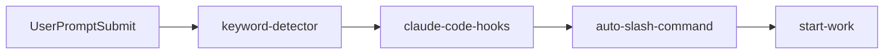
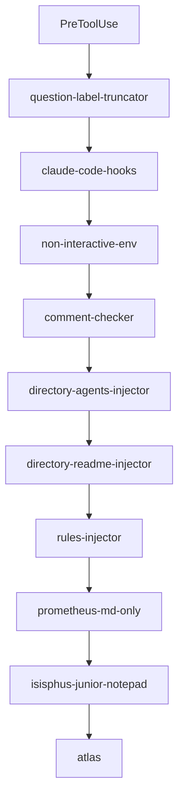
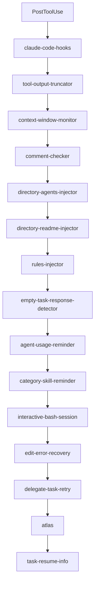
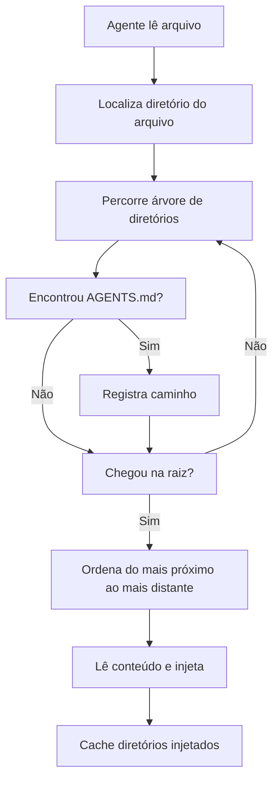
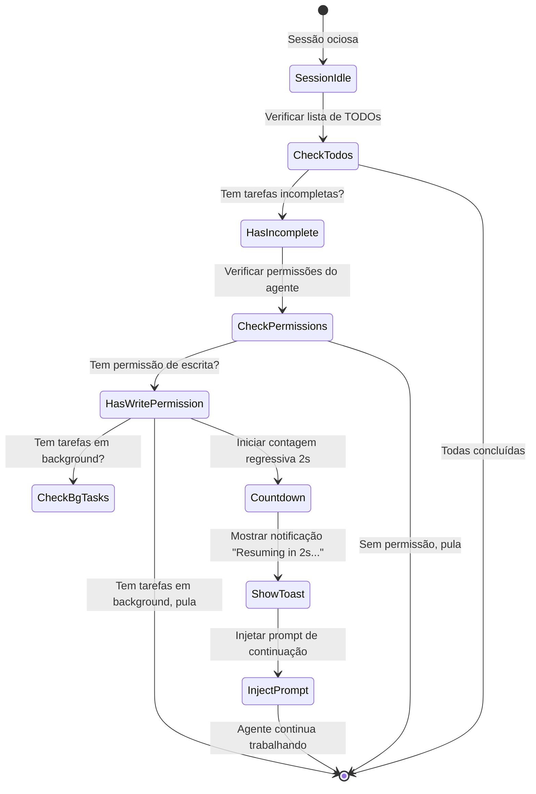
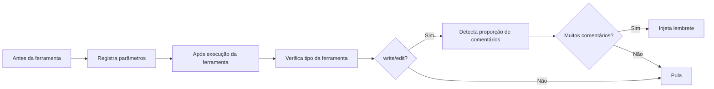

# Hooks de Ciclo de Vida: Contexto Automatizado e Controle de Qualidade

## O Que Você Vai Aprender

- Injetar automaticamente contexto de projeto em agentes de IA (AGENTS.md, README.md)
- Impedir que agentes desistam a meio caminho e force a conclusão de listas TODO
- Truncar automaticamente saídas excessivas para evitar estouro da janela de contexto
- Ativar o modo Ultrawork com um clique para ativar todos os agentes especializados
- Personalizar configurações de hooks e desativar funcionalidades desnecessárias

## Seu Dilema Atual

Você já encontrou estes problemas?

- Agentes de IA esquecendo constantemente as convenções do projeto e repetindo erros?
- Agentes parando a meio caminho sem concluir a lista TODO?
- Saídas de busca de código muito grandes, estourando a janela de contexto?
- Tendo que informar manualmente o agente sobre qual modo usar a cada vez?

## Quando Usar Esta Abordagem

Hooks de ciclo de vida são adequados para os seguintes cenários:

::: tip Cenários Típicos
- **Gestão de Contexto de Projeto**: Injeção automática de AGENTS.md e README.md
- **Controle de Qualidade**: Verificação de comentários de código, validação de blocos de pensamento
- **Continuidade de Tarefas**: Forçar agente a completar todas as tarefas TODO
- **Otimização de Performance**: Truncamento dinâmico, gestão de janela de contexto
- **Automação de Fluxo de Trabalho**: Gatilho de modo por palavras-chave, execução automática de comandos
:::

## Ideia Central

### O Que São Hooks de Ciclo de Vida?

**Hooks de ciclo de vida** são um mecanismo orientado a eventos que permite inserir lógica personalizada em pontos-chave do trabalho de um agente. Por exemplo: injetar automaticamente documentos de projeto, forçar conclusão de tarefas TODO, truncar saídas excessivas, etc. Estes hooks escutam 4 tipos de eventos: antes da execução de ferramenta, após execução de ferramenta, quando usuário submete prompt, e quando sessão fica ociosa. Através da configuração apropriada de hooks, você pode tornar seus agentes de IA mais inteligentes e mais adequados aos seus hábitos de trabalho.

::: info Hooks vs Middleware
Hooks são muito parecidos com middleware em frameworks web — ambos são mecanismos de "fazer algo específico em momentos específicos". As diferenças são:
- **Middleware**: Execução linear, pode interromper requisições
- **Hooks**: Orientado a eventos, não pode interromper, só pode modificar dados
:::

### 32 Hooks, 7 Categorias

oh-my-opencode fornece 32 hooks embutidos, divididos em 7 categorias:

| Categoria | Número de Hooks | Principal Função |
| --- | --- | ---|
| **Injeção de Contexto** | 4 | Injetar documentos de projeto e regras automaticamente |
| **Produtividade e Controle** | 6 | Detecção de palavras-chave, mudança de modo, gestão de loops |
| **Qualidade e Segurança** | 4 | Verificação de comentários de código, validação de blocos de pensamento |
| **Recuperação e Estabilidade** | 3 | Recuperação de sessão, tratamento de erros |
| **Truncamento e Gestão de Contexto** | 2 | Truncamento de saída, monitoramento de janela |
| **Notificações e UX** | 3 | Atualizações de versão, notificações de tarefas em background, lembretes de ociosidade |
| **Gestão de Tarefas** | 2 | Resumo de tarefas, retry de delegação |

## Tipos de Eventos de Hooks

Hooks escutam os seguintes 4 tipos de eventos:

### 1. PreToolUse (Antes da Execução de Ferramenta)

**Momento de Gatilho**: Antes do agente chamar uma ferramenta

**O Que Pode Fazer**:
- Impedir execução de ferramenta
- Modificar parâmetros da ferramenta
- Injetar contexto

**Exemplos de Hooks**: `comment-checker`, `directory-agents-injector`

### 2. PostToolUse (Após Execução de Ferramenta)

**Momento de Gatilho**: Após a conclusão da execução da ferramenta

**O Que Pode Fazer**:
- Modificar saída da ferramenta
- Adicionar mensagens de aviso
- Injetar instruções subsequentes

**Exemplos de Hooks**: `tool-output-truncator`, `directory-readme-injector`

### 3. UserPromptSubmit (Quando Usuário Submete Prompt)

**Momento de Gatilho**: Quando usuário envia mensagem para a sessão

**O Que Pode Fazer**:
- Impedir submissão (raro)
- Modificar conteúdo do prompt
- Injetar mensagem de sistema
- Ativar modo de trabalho

**Exemplos de Hooks**: `keyword-detector`, `auto-slash-command`

### 4. Stop (Quando Sessão Está Ociosa)

**Momento de Gatilho**: Quando agente para de trabalhar e sessão entra em estado ocioso

**O Que Pode Fazer**:
- Injetar prompts subsequentes
- Enviar notificações
- Verificar estado de tarefas

**Exemplos de Hooks**: `todo-continuation-enforcer`, `session-notification`

## Ordem de Execução de Hooks

Hooks são executados em ordem fixa para garantir correção lógica:

### Evento UserPromptSubmit



**Explicação da Ordem**:
1. `keyword-detector`: Detecta palavras-chave (ultrawork, search, analyze)
2. `claude-code-hooks`: Executa hooks da camada de compatibilidade Claude Code
3. `auto-slash-command`: Executa automaticamente comandos de barra
4. `start-work`: Processa comando `/start-work`

### Evento PreToolUse



**Explicação da Ordem**:
1. `question-label-truncator`: Trunca rótulos de ferramentas
2. `claude-code-hooks`: Camada de compatibilidade Claude Code
3. `non-interactive-env`: Processa ambiente não-interativo
4. `comment-checker`: Verifica comentários de código
5. `directory-agents-injector`: Injeta AGENTS.md
6. `directory-readme-injector`: Injeta README.md
7. `rules-injector`: Injeta regras de projeto
8. `prometheus-md-only`: Força Prometheus a só saída Markdown
9. `sisyphus-junior-notepad`: Injeta prompts para Sisyphus Junior
10. `atlas`: Lógica de orquestração principal Atlas

### Evento PostToolUse



**Explicação da Ordem**:
1. `claude-code-hooks`: Camada de compatibilidade Claude Code
2. `tool-output-truncator`: Trunca saída de ferramenta
3. `context-window-monitor`: Monitora janela de contexto
4. `comment-checker`: Verifica comentários de código
5. `directory-agents-injector`: Injeta AGENTS.md
6. `directory-readme-injector`: Injeta README.md
7. `rules-injector`: Injeta regras de projeto
8. `empty-task-response-detector`: Detecta respostas vazias
9. `agent-usage-reminder`: Lembra de usar agentes especializados
10. `category-skill-reminder`: Lembra de usar Category/Skill
11. `interactive-bash-session`: Gerencia sessões Bash interativas
12. `edit-error-recovery`: Recupera erros de edição
13. `delegate-task-retry`: Tenta novamente tarefas delegadas falhas
14. `atlas`: Lógica de orquestração principal Atlas
15. `task-resume-info`: Fornece informação para resumo de tarefas

## Hooks Principais em Detalhe

### 1. directory-agents-injector (Injeção de AGENTS.md)

**Evento de Gatilho**: PostToolUse

**Funcionalidade**: Quando um agente lê um arquivo, automaticamente percorre do diretório do arquivo até a raiz do projeto, coletando todos os arquivos `AGENTS.md` no caminho e injetando-os no contexto do agente.

**Fluxo de Trabalho**:



**Exemplo**:

Estrutura de projeto:
```
project/
├── AGENTS.md              # Contexto nível projeto
├── src/
│   ├── AGENTS.md          # Contexto nível src
│   └── components/
│       ├── AGENTS.md      # Contexto nível components
│       └── Button.tsx
```

Quando o agente lê `Button.tsx`, automaticamente injeta:
1. `components/AGENTS.md` (injetado primeiro)
2. `src/AGENTS.md`
3. `AGENTS.md` (raiz do projeto)

::: tip Melhores Práticas
- Crie `AGENTS.md` em cada diretório principal, descrevendo responsabilidades e convenções do diretório
- AGENTS.md segue o princípio "do mais próximo ao mais distante", o mais próximo tem prioridade
- Diretórios já injetados são cacheados para evitar injeção repetida
:::

**Localização do Código**: `src/hooks/directory-agents-injector/index.ts` (183 linhas)

### 2. todo-continuation-enforcer (Continuação Forçada de TODO)

**Evento de Gatilho**: Stop

**Funcionalidade**: Detecta a lista de TODOs do agente e, se houver TODOs não concluídos, força o agente a continuar trabalhando, evitando que pare a meio caminho.

**Fluxo de Trabalho**:



**Mecanismo de Contagem Regressiva**:
- Contagem regressiva padrão de 2 segundos
- Mostra notificação Toast: "Resuming in 2s... (X tasks remaining)"
- Usuário pode cancelar manualmente durante a contagem regressiva

**Condições de Pular**:
1. Agente sem permissão de escrita (agente read-only)
2. Agente está na lista de pulo (prometheus, compaction)
3. Há tarefas em background em execução
4. Sessão está em processo de recuperação

**Localização do Código**: `src/hooks/todo-continuation-enforcer.ts` (490 linhas)

### 3. keyword-detector (Detector de Palavras-chave)

**Evento de Gatilho**: UserPromptSubmit

**Funcionalidade**: Detecta palavras-chave nos prompts do usuário e ativa automaticamente o modo correspondente:

| Palavra-chave | Modo Ativado | Descrição |
| --- | --- | ---|
| `ultrawork` / `ulw` | **Modo Máxima Performance** | Ativa todos os agentes especializados e tarefas paralelas |
| `search` / `find` | **Modo Exploração Paralela** | Inicia explore/librarian em paralelo |
| `analyze` / `investigate` | **Modo Análise Profunda** | Ativa exploração profunda e análise |

**Exemplo de Uso**:

```
Entrada do usuário:
ultrawork desenvolva uma API REST com autenticação e autorização

Resposta do sistema:
[✅ Modo Ultrawork Ativado]
Precisão máxima engajada. Todos os agentes à sua disposição.
```

**Detalhes de Implementação**:
- Detecção de palavras-chave suporta variantes (ultrawork = ulw)
- Tratamento diferente para sessão principal e não-principal
- Configuração de modo passada via `message.variant` para o agente
- Detecção de palavras-chave não é feita em sessões de tarefas em background

**Localização do Código**: `src/hooks/keyword-detector/index.ts` (101 linhas)

### 4. tool-output-truncator (Truncador de Saída de Ferramenta)

**Evento de Gatilho**: PostToolUse

**Funcionalidade**: Trunca dinamicamente saídas de ferramenta excessivas, mantendo 50% de espaço de headroom na janela de contexto, truncando no máximo para 50k tokens.

**Ferramentas Suportadas**:

```typescript
const TRUNCATABLE_TOOLS = [
  "grep", "Grep", "safe_grep",
  "glob", "Glob", "safe_glob",
  "lsp_diagnostics",
  "ast_grep_search",
  "interactive_bash", "Interactive_bash",
  "skill_mcp",
  "webfetch", "WebFetch",
]
```

**Restrições Especiais**:
- `webfetch` máximo 10k tokens (conteúdo web precisa de truncamento mais agressivo)
- Outras ferramentas máximo 50k tokens

**Estratégia de Truncamento**:
1. Calcula dinamicamente ponto de truncamento baseado na janela de contexto restante
2. Preserva início e fim da saída, meio substituído por reticências
3. Adiciona aviso de truncamento: `[Note: Content was truncated to save context window space. For full context, please read file directly: {path}]`

::: warning Habilitar Truncamento Mais Agressivo
No `oh-my-opencode.json` configure:
```json
{
  "experimental": {
    "truncate_all_tool_outputs": true
  }
}
```
Isso truncará todas as saídas de ferramenta, não apenas as da lista TRUNCATABLE_TOOLS.
:::

**Localização do Código**: `src/hooks/tool-output-truncator.ts` (62 linhas)

### 5. comment-checker (Verificador de Comentários de Código)

**Evento de Gatilho**: PreToolUse / PostToolUse

**Funcionalidade**: Verifica se o agente está escrevendo comentários em excesso, ignorando inteligentemente BDD, instruções e docstrings.

**Fluxo de Trabalho**:



**Regras de Ignorar Inteligente**:
- Comentários BDD (Behavior-Driven Development)
- Comentários instrucionais (como `// TODO`, `// FIXME`)
- Docstrings

**Método de Configuração**:

```json
{
  "comment_checker": {
    "custom_prompt": "seu prompt personalizado"
  }
}
```

**Localização do Código**: `src/hooks/comment-checker/index.ts` (172 linhas)

## Configuração de Hooks

### Habilitar/Desabilitar Hooks

No `oh-my-opencode.json` configure:

```json
{
  "disabled_hooks": [
    "comment-checker",
    "auto-update-checker",
    "keyword-detector"
  ]
}
```

### Cenários de Configuração Comuns

#### Cenário 1: Desabilitar Verificação de Comentários

```json
{
  "disabled_hooks": ["comment-checker"]
}
```

#### Cenário 2: Desabilitar Detecção de Palavras-chave

```json
{
  "disabled_hooks": ["keyword-detector"]
}
```

#### Cenário 3: Desabilitar Continuação Forçada de TODO

```json
{
  "disabled_hooks": ["todo-continuation-enforcer"]
}
```

#### Cenário 4: Habilitar Truncamento Agressivo de Saída

```json
{
  "experimental": {
    "truncate_all_tool_outputs": true
  }
}
```

## Resumo da Aula

Esta aula apresentou os 32 hooks de ciclo de vida do oh-my-opencode:

**Conceitos Fundamentais**:
- Hooks são mecanismos de interceptação orientados a eventos
- 4 tipos de eventos: PreToolUse, PostToolUse, UserPromptSubmit, Stop
- Executam em ordem fixa para garantir correção lógica

**Hooks Comuns**:
- `directory-agents-injector`: Injeta AGENTS.md automaticamente
- `todo-continuation-enforcer`: Força conclusão da lista TODO
- `keyword-detector`: Detecta palavras-chave e ativa modos
- `tool-output-truncator`: Trunca saídas dinamicamente
- `comment-checker`: Verifica comentários de código

**Métodos de Configuração**:
- Desabilitar hooks desnecessários através do array `disabled_hooks`
- Habilitar funcionalidades experimentais através de `experimental`

## Próxima Aula

> Na próxima aula aprenderemos **[Comandos de Barra: Fluxos de Trabalho Pré-configurados](../slash-commands/)**.
>
> Você aprenderá:
> - Como usar os 6 comandos de barra embutidos
> - `/ralph-loop` para completar trabalho automaticamente
> - `/refactor` para refatoração inteligente
> - `/start-work` para executar plano Prometheus
> - Como criar comandos de barra personalizados

---

## Apêndice: Referência de Código Fonte

<details>
<summary><strong>Clique para expandir e ver localização do código fonte</strong></summary>

> Última atualização: 2026-01-26

| Funcionalidade | Caminho do Arquivo | Linhas |
| --- | --- | ---|
| --- | --- | ---|
| --- | --- | ---|
| --- | --- | ---|
| --- | --- | ---|
| --- | --- | ---|
| --- | --- | ---|
| --- | --- | ---|
| --- | --- | ---|
| --- | --- | ---|

**Constantes Principais**:
- `AGENTS_FILENAME = "AGENTS.md"`: Nome do arquivo de contexto do agente (`src/hooks/directory-agents-injector/constants.ts`)
- `DEFAULT_MAX_TOKENS = 50_000`: Tokens máximos padrão para truncamento (`src/hooks/tool-output-truncator.ts`)
- `WEBFETCH_MAX_TOKENS = 10_000`: Tokens máximos para webfetch (`src/hooks/tool-output-truncator.ts`)
- `COUNTDOWN_SECONDS = 2`: Segundos de contagem regressiva para continuação de TODO (`src/hooks/todo-continuation-enforcer.ts`)

**Funções Principais**:
- `createDirectoryAgentsInjectorHook(ctx)`: Cria hook de injeção de AGENTS.md
- `createTodoContinuationEnforcer(ctx, options)`: Cria hook de continuação forçada de TODO
- `createKeywordDetectorHook(ctx, collector)`: Cria hook de detecção de palavras-chave
- `createToolOutputTruncatorHook(ctx, options)`: Cria hook de truncamento de saída de ferramenta
- `createCommentCheckerHooks(config)`: Cria hooks de verificação de comentários de código

</details>
