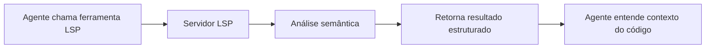
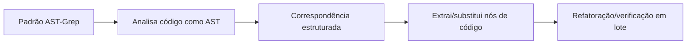

# LSP e AST-Grep: Capacidades de Análise e Manipulação de Código no Nível de IDE

## O Que Você Vai Aprender

- Usar ferramentas LSP para navegar no código, encontrar símbolos e obter diagnósticos
- Usar AST-Grep para busca e substituição precisa de padrões de código
- Entender as diferenças entre LSP e AST-Grep e seus casos de uso
- Capacitar agentes com compreensão e manipulação de código no nível de IDE

## O Problema Atual

As ferramentas tradicionais de busca e refatoração de código têm limitações claras:

| Problema | Abordagem Tradicional | Necessidade Real |
| --- | --- | --- |
| **Navegação imprecisa de símbolos** | Correspondência simples de strings | Compreensão semântica do código, navegação para definições reais |
| **Referências incompletas** | Busca com expressões regulares | Rastreamento preciso de referências entre arquivos e escopos |
| **Refatoração insegura** | Substituição manual + grep | Compreensão da estrutura do código, evitando modificações destrutivas |
| **Correspondência de padrões limitada** | Expressões regulares | Correspondência estruturada baseada em AST |

::: info Conceitos-Chave
**LSP (Language Server Protocol)** é um protocolo padrão entre IDEs e servidores de linguagem que fornece funcionalidades como autocompletar, ir para definição, encontrar referências, renomear símbolos, obter diagnósticos e outline de símbolos através de uma interface unificada, dando aos editores poderosas capacidades de compreensão de código, além de suportar recursos avançados como informações de tipo e relações de herança. **AST-Grep** é uma ferramenta de correspondência de padrões de código baseada em Árvore de Sintaxe Abstrata que entende a estrutura do código em vez de apenas texto, suportando correspondência flexível de padrões e refatoração em lote usando metavariáveis (como `$VAR` para corresponder a um único nó, `$$$` para múltiplos nós), cobrindo 25 linguagens de programação (incluindo TypeScript, Python, Go, Rust, etc.), sendo uma ferramenta poderosa para refatoração de código, verificação de padrões e busca estruturada.
:::

## Quando Usar Esta Técnica

| Ferramenta | Caso de Uso | Exemplo |
| --- | --- | --- |
| **Ferramentas LSP** | Quando precisa de funcionalidades de IDE | Ir para definição, encontrar todas as referências, obter lista de erros, renomear símbolos |
| **AST-Grep** | Quando precisa de correspondência de padrões de código | Buscar estruturas específicas de código, refatoração em lote, verificar padrões de código |
| **Grep/Glob** | Busca simples de texto | Encontrar nomes de funções, correspondência de nomes de arquivos |

## 🎒 Preparação

Antes de usar as ferramentas LSP e AST-Grep, certifique-se de:

1. **Ter instalado o Language Server**
   - TypeScript/JavaScript: `npm install -g typescript-language-server`
   - Python: `pip install basedpyright` ou `pip install ruff`
   - Go: `go install golang.org/x/tools/gopls@latest`
   - Rust: `rustup component add rust-analyzer`

2. **Ter instalado o AST-Grep CLI**
   ```bash
   bun add -D @ast-grep/cli
   ```

3. **Ter configurado o servidor LSP**
   - A configuração do servidor LSP está no `opencode.json` do OpenCode
   - oh-my-opencode lê e usa automaticamente essas configurações

::: tip Verificar Ambiente
Use os seguintes comandos para verificar o ambiente:
```bash
# Verificar servidor LSP
oh-my-opencode doctor

# Verificar AST-Grep
which sg
```
:::

## Conceito Central

### Ferramentas LSP: Compreensão de Código no Nível de IDE

As ferramentas LSP dão aos agentes de IA as mesmas capacidades de compreensão de código que uma IDE:



**Vantagens principais**:
- ✅ Compreensão semântica, não apenas correspondência de strings
- ✅ Rastreamento preciso entre arquivos e escopos
- ✅ Suporte a informações de tipo, relações de herança e outros recursos avançados
- ✅ Totalmente consistente com a configuração do projeto (usa o mesmo servidor LSP)

### AST-Grep: Correspondência Estruturada de Padrões de Código

AST-Grep permite que agentes de IA realizem correspondência precisa de estruturas de código:



**Vantagens principais**:
- ✅ Baseado na estrutura do código, não em texto
- ✅ Suporte a metavariáveis (`$VAR`, `$$$`) para correspondência de padrões
- ✅ Suporte a múltiplas linguagens (25)
- ✅ Pode ser usado para refatoração, verificação e validação de padrões de código

## Passo a Passo

### Passo 1: Usar LSP para Ir à Definição

**Por quê**
Quando você precisa ver onde um símbolo está definido, a ferramenta `goto_definition` do LSP fornece navegação precisa, mais confiável que busca de strings.

No OpenCode, o agente pode chamar automaticamente:

```typescript
// O agente chama automaticamente
lsp_goto_definition({
  filePath: "src/utils.ts",
  line: 15,
  character: 10
})
```

**Você deve ver**:
```
→ Definition found:
  File: src/types.ts
  Line: 45
  Text: export interface UserConfig {
```

::: tip Uso Prático
Você não precisa chamar essas ferramentas manualmente, o agente de IA as usa automaticamente para entender o código. Você pode simplesmente perguntar: "Vá para a definição desta função" ou "Onde esta variável está definida?"
:::

### Passo 2: Encontrar Todas as Referências

**Por quê**
Quando você precisa modificar um símbolo, encontrar todas as referências primeiro garante que a modificação não quebre outros usos.

O agente pode chamar:

```typescript
lsp_find_references({
  filePath: "src/api.ts",
  line: 10,
  character: 5,
  includeDeclaration: true  // Se inclui a própria definição
})
```

**Você deve ver**:
```
Found 15 references (showing first 200):
  src/api.ts:10:5  - [definition] fetchData
  src/components/List.tsx:23:12 - [usage] fetchData()
  src/pages/Home.tsx:45:8 - [usage] fetchData()
  ...
```

### Passo 3: Obter Símbolos do Arquivo e do Workspace

**Por quê**
Ao entender a estrutura de um arquivo ou buscar tipos específicos de símbolos em todo o projeto, a ferramenta `lsp_symbols` é muito útil.

**Outline do arquivo** (scope="document"):

```typescript
lsp_symbols({
  filePath: "src/app.tsx",
  scope: "document"
})
```

**Você deve ver**:
```
Found 12 symbols:
  [Component] App (line: 10-150)
    [Function] useEffect (line: 25-35)
    [Function] handleClick (line: 40-55)
    [Variable] count (line: 15)
  ...
```

**Busca no workspace** (scope="workspace"):

```typescript
lsp_symbols({
  filePath: "src/app.tsx",
  scope: "workspace",
  query: "fetchData"
})
```

### Passo 4: Obter Diagnósticos

**Por quê**
Antes de executar o código, a ferramenta de diagnóstico do LSP pode detectar erros, avisos e dicas antecipadamente.

```typescript
lsp_diagnostics({
  filePath: "src/utils.ts",
  severity: "error"  // Opcional: "error", "warning", "information", "hint", "all"
})
```

**Você deve ver**:
```
Found 3 diagnostics:
  [Error] src/utils.ts:23:5 - 'result' is used before being assigned
  [Warning] src/utils.ts:45:12 - Unused variable 'temp'
  [Hint] src/utils.ts:67:8 - This can be simplified to const x = value
```

::: tip Pré-verificação
Fazer o agente de IA usar `lsp_diagnostics` para verificar problemas potenciais antes de escrever código pode evitar modificações repetidas.
:::

### Passo 5: Renomear Símbolos com Segurança

**Por quê**
Renomear símbolos é uma operação comum de refatoração, mas substituição manual é propensa a erros. A ferramenta `lsp_rename` do LSP pode renomear símbolos com segurança em todo o workspace.

**Etapa 1: Validar renomeação**

```typescript
lsp_prepare_rename({
  filePath: "src/api.ts",
  line: 10,
  character: 5
})
```

**Você deve ver**:
```
Rename validation:
  Current name: fetchData
  Placeholder range: line 10, column 5-14
  Status: ✅ Valid
```

**Etapa 2: Executar renomeação**

```typescript
lsp_rename({
  filePath: "src/api.ts",
  line: 10,
  character: 5,
  newName: "fetchUserData"
})
```

**Você deve ver**:
```
Applied rename to 15 files:
  src/api.ts:10:5 - fetchData → fetchUserData
  src/components/List.tsx:23:12 - fetchData() → fetchUserData()
  src/pages/Home.tsx:45:8 - fetchData → fetchUserData()
  ...
```

### Passo 6: Usar AST-Grep para Buscar Padrões de Código

**Por quê**
Quando você precisa encontrar estruturas específicas de código (como todos os lugares que usam `console.log`), AST-Grep é mais preciso que grep.

**Busca básica de padrões**:

```typescript
ast_grep_search({
  pattern: "console.log($MSG)",
  lang: "typescript",
  paths: ["src"],
  context: 2  // Número de linhas de contexto antes e depois da correspondência
})
```

**Você deve ver**:
```
src/utils.ts:15:
  13 | function debug(message) {
  14 |   console.log(message)
  15 |   console.log("Debug mode")
  16 | }
  17 | }

src/components/App.tsx:23:
  21 | useEffect(() => {
  22 |   console.log("Component mounted")
  23 | }, [])
```

**Usando metavariáveis**:

```typescript
// Corresponder todas as chamadas de função
ast_grep_search({
  pattern: "$FUNC($$$)",
  lang: "typescript",
  paths: ["src"]
})
```

```typescript
// Corresponder todas as funções assíncronas
ast_grep_search({
  pattern: "async function $NAME($$$) { $$$ }",
  lang: "typescript",
  paths: ["src"]
})
```

::: warning Importante: O padrão deve ser um nó AST completo
❌ Errado: `export async function $NAME`
✅ Correto: `export async function $NAME($$$) { $$$ }`

O padrão deve ser um trecho de código válido, incluindo a assinatura completa da função e o corpo.
:::

### Passo 7: Usar AST-Grep para Substituição em Lote

**Por quê**
Quando você precisa refatorar código em lote (como substituir todos os `console.log` por `logger.info`), a funcionalidade de substituição do AST-Grep é muito poderosa.

**Pré-visualizar substituição** (dry-run):

```typescript
ast_grep_replace({
  pattern: "console.log($MSG)",
  rewrite: "logger.info($MSG)",
  lang: "typescript",
  paths: ["src"],
  dryRun: true  // Padrão é true, apenas pré-visualiza sem modificar
})
```

**Você deve ver**:
```
Preview changes (dry-run):
  src/utils.ts:15:2 - console.log("Debug mode")
                 → logger.info("Debug mode")
  src/components/App.tsx:23:4 - console.log("Component mounted")
                              → logger.info("Component mounted")

Total: 2 changes
```

**Aplicar substituição**:

```typescript
ast_grep_replace({
  pattern: "console.log($MSG)",
  rewrite: "logger.info($MSG)",
  lang: "typescript",
  paths: ["src"],
  dryRun: false  // Defina como false para aplicar as alterações
})
```

**Você deve ver**:
```
Applied 2 changes:
  src/utils.ts:15:2 - console.log("Debug mode")
                 → logger.info("Debug mode")
  src/components/App.tsx:23:4 - console.log("Component mounted")
                              → logger.info("Component mounted")
```

::: danger Operação Destrutiva
`ast_grep_replace` com `dryRun: false` modifica arquivos diretamente. Recomendações:
1. Primeiro pré-visualize com `dryRun: true`
2. Confirme que está correto antes de aplicar
3. Se o projeto usa Git, faça commit do estado atual primeiro
:::

## Checkpoint ✅

**Verificar ferramentas LSP**:
- [ ] Consegue ir para a definição de símbolos?
- [ ] Consegue encontrar todas as referências?
- [ ] Consegue obter diagnósticos?
- [ ] Consegue renomear símbolos com segurança?

**Verificar ferramentas AST-Grep**:
- [ ] Consegue buscar padrões de código?
- [ ] Consegue usar correspondência com metavariáveis?
- [ ] Consegue pré-visualizar e executar substituições?

## Armadilhas Comuns

### Problemas Comuns com Ferramentas LSP

| Problema | Causa | Solução |
| --- | --- | --- |
| **Definição não encontrada** | Servidor LSP não iniciado ou configuração incorreta | Verifique a configuração LSP em `opencode.json` |
| **Lista de referências incompleta** | Erros no código, servidor LSP não analisou completamente | Corrija os erros no código primeiro |
| **Falha na renomeação** | Novo nome conflita com símbolo existente | Use um nome mais específico |

### Problemas Comuns com AST-Grep

| Problema | Causa | Solução |
| --- | --- | --- |
| **Padrão não corresponde** | Padrão incompleto ou erro de sintaxe | Certifique-se de que o padrão é um nó AST completo |
| **Dois-pontos no final de padrões Python** | `def` e `class` em Python não precisam de dois-pontos | ❌ `def func():` → ✅ `def func($$$):` |
| **Muitas correspondências** | Padrão muito amplo | Use contexto mais específico ou limite os caminhos |

### Dicas de Otimização de Performance

```typescript
// ✅ Bom: Limitar escopo de busca
ast_grep_search({
  pattern: "$FUNC($$$)",
  lang: "typescript",
  paths: ["src/api"],  // Buscar apenas em diretório específico
  globs: ["*.ts"]      // Corresponder apenas arquivos específicos
})

// ❌ Ruim: Buscar em todo o projeto
ast_grep_search({
  pattern: "$FUNC($$$)",
  lang: "typescript",
  paths: ["./"]  // Buscar em todos os arquivos
})
```

## Lista Completa de Ferramentas LSP

| Ferramenta | Função | Parâmetros |
| --- | --- | --- |
| `lsp_goto_definition` | Ir para definição do símbolo | `filePath`, `line`, `character` |
| `lsp_find_references` | Encontrar todas as referências | `filePath`, `line`, `character`, `includeDeclaration?` |
| `lsp_symbols` | Obter outline do arquivo ou símbolos do workspace | `filePath`, `scope`, `query?`, `limit?` |
| `lsp_diagnostics` | Obter erros e avisos | `filePath`, `severity?` |
| `lsp_prepare_rename` | Validar operação de renomeação | `filePath`, `line`, `character` |
| `lsp_rename` | Executar operação de renomeação | `filePath`, `line`, `character`, `newName` |

**Limitações**:
- Retorna no máximo 200 símbolos, referências ou diagnósticos (configurável)
- O servidor LSP deve estar configurado e em execução

## Lista Completa de Ferramentas AST-Grep

| Ferramenta | Função | Parâmetros |
| --- | --- | --- |
| `ast_grep_search` | Busca de padrões AST | `pattern`, `lang`, `paths?`, `globs?`, `context?` |
| `ast_grep_replace` | Substituição de padrões AST | `pattern`, `rewrite`, `lang`, `paths?`, `globs?`, `dryRun?` |

**Linguagens suportadas** (25):
`bash`, `c`, `cpp`, `csharp`, `css`, `elixir`, `go`, `haskell`, `html`, `java`, `javascript`, `json`, `kotlin`, `lua`, `nix`, `php`, `python`, `ruby`, `rust`, `scala`, `solidity`, `swift`, `typescript`, `tsx`, `yaml`

**Metavariáveis**:
- `$VAR` - Corresponde a um único nó
- `$$$` - Corresponde a múltiplos nós

## Casos Práticos

### Caso 1: Refatorar Chamadas de API

**Cenário**: Adicionar tratamento de erros a todas as chamadas `fetch`

**Usar AST-Grep para encontrar o padrão**:

```typescript
ast_grep_search({
  pattern: "fetch($URL).then($RES => $BODY)",
  lang: "typescript",
  paths: ["src/api"]
})
```

**Usar AST-Grep para substituir**:

```typescript
ast_grep_replace({
  pattern: "fetch($URL).then($RES => $BODY)",
  rewrite: "fetch($URL).then($RES => $BODY).catch(err => handleError(err))",
  lang: "typescript",
  paths: ["src/api"],
  dryRun: true  // Pré-visualizar primeiro
})
```

### Caso 2: Encontrar Imports Não Utilizados

**Usar LSP para encontrar referências**:

```typescript
// Para cada import
lsp_find_references({
  filePath: "src/utils.ts",
  line: 1,  // Linha onde está o import
  character: 10
})

// Se retornar apenas 1 referência (o próprio import), não está sendo usado
```

### Caso 3: Renomear Variável de Configuração

**Etapa 1: Validar renomeação**

```typescript
lsp_prepare_rename({
  filePath: "src/config.ts",
  line: 10,
  character: 4
})
```

**Etapa 2: Executar renomeação**

```typescript
lsp_rename({
  filePath: "src/config.ts",
  line: 10,
  character: 4,
  newName: "API_BASE_URL"
})
```

## Resumo da Lição

Esta lição apresentou as ferramentas LSP e AST-Grep do oh-my-opencode:

**Ferramentas LSP**:
- Fornecem capacidades de compreensão e manipulação de código no nível de IDE
- Suportam ir para definição, encontrar referências, obter diagnósticos, renomear símbolos
- Usam o servidor LSP configurado no projeto, comportamento consistente com a IDE

**Ferramentas AST-Grep**:
- Correspondência estruturada de padrões de código baseada em AST
- Suporte a metavariáveis para correspondência flexível
- Suporte a substituição e refatoração em lote

**Melhores práticas**:
- Use LSP para cenários que requerem compreensão semântica
- Use AST-Grep para refatoração estruturada de código
- Sempre pré-visualize com dryRun antes de substituir

## Prévia da Próxima Lição

> Na próxima lição, aprenderemos sobre **[Categories e Skills: Composição Dinâmica de Agentes](../categories-skills/)**.
>
> Você aprenderá:
> - Como usar Categories para selecionar automaticamente o modelo ideal
> - Como combinar diferentes Skills para criar agentes especializados
> - Cenários práticos de aplicação dos novos recursos da v3.0

---

## Apêndice: Referência do Código-Fonte

<details>
<summary><strong>Clique para expandir e ver a localização do código-fonte</strong></summary>

> Atualizado em: 2026-01-26

### Ferramentas LSP

| Função | Caminho do Arquivo | Linhas |
| --- | --- | --- |
| Definição das ferramentas LSP | [`src/tools/lsp/tools.ts`](https://github.com/code-yeongyu/oh-my-opencode/blob/main/src/tools/lsp/tools.ts) | 29-261 |
| Implementação do cliente LSP | [`src/tools/lsp/client.ts`](https://github.com/code-yeongyu/oh-my-opencode/blob/main/src/tools/lsp/client.ts) | 1-596 |
| Definição de constantes LSP | [`src/tools/lsp/constants.ts`](https://github.com/code-yeongyu/oh-my-opencode/blob/main/src/tools/lsp/constants.ts) | 1-391 |
| Definição de tipos LSP | [`src/tools/lsp/types.ts`](https://github.com/code-yeongyu/oh-my-opencode/blob/main/src/tools/lsp/types.ts) | 1-246 |

### Ferramentas AST-Grep

| Função | Caminho do Arquivo | Linhas |
| --- | --- | --- |
| --- | --- | --- |
| --- | --- | --- |
| --- | --- | --- |
| --- | --- | --- |

**Constantes principais**:
- `DEFAULT_MAX_REFERENCES = 200` - Número máximo de referências retornadas
- `DEFAULT_MAX_SYMBOLS = 200` - Número máximo de símbolos retornados
- `DEFAULT_MAX_DIAGNOSTICS = 200` - Número máximo de diagnósticos retornados
- `CLI_LANGUAGES` - Lista de 25 linguagens suportadas
- `DEFAULT_MAX_MATCHES = 500` - Número máximo de correspondências do AST-Grep

**Funções principais**:
- `withLspClient()` - Obtém cliente LSP e executa operações
- `runSg()` - Executa comandos CLI do AST-Grep
- `formatLocation()` - Formata informações de localização
- `formatDiagnostic()` - Formata informações de diagnóstico

**Servidores LSP suportados** (parcial):
- TypeScript: `typescript-language-server`
- Python: `basedpyright`, `pyright`, `ty`, `ruff`
- Go: `gopls`
- Rust: `rust-analyzer`
- C/C++: `clangd`

</details>
