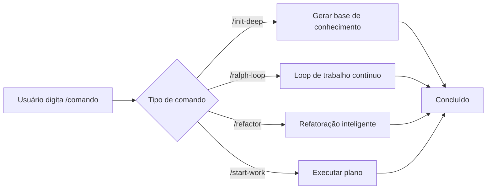

# Comandos de Barra: Fluxos de Trabalho Predefinidos para Execução com Um Clique

## O Que Você Vai Aprender

- Usar `/init-deep` para gerar a base de conhecimento do projeto com um clique
- Usar `/ralph-loop` para fazer os agentes trabalharem continuamente até completar as tarefas
- Executar refatoração inteligente com `/refactor`, validando automaticamente cada etapa
- Usar `/start-work` para iniciar desenvolvimento sistemático a partir de planos do Prometheus

## Seu Desafio Atual

Ao executar repetidamente as mesmas tarefas complexas, você precisa digitar instruções longas toda vez:

```
"Por favor, ajude-me a analisar a estrutura deste projeto, encontrar todos os módulos principais, gerar AGENTS.md para cada diretório, depois explorar em paralelo os padrões do código..."
```

Essas instruções longas desperdiçam tempo e são propensas a etapas perdidas.

## Quando Usar Esta Abordagem

**Comandos de barra** são modelos de fluxo de trabalho predefinidos que acionam tarefas complexas com um clique. Esses comandos cobrem cenários comuns de desenvolvimento:

| Cenário | Comando para Usar |
|--- | ---|
| Inicializar base de conhecimento do projeto | `/init-deep` |
| Fazer a IA trabalhar continuamente | `/ralph-loop` |
| Refatorar código inteligentemente | `/refactor` |
| Começar a trabalhar a partir de um plano | `/start-work` |

## Conceitos Principais

**Comandos de barra** são modelos de fluxo de trabalho predefinidos que executam tarefas complexas rapidamente através de palavras de gatilho começando com `/`.

**Como funciona**:



oh-my-opencode inclui 6 comandos de barra integrados:

| Comando | Função | Complexidade |
|--- | --- | ---|
| `/init-deep` | Gerar arquivos AGENTS.md hierárquicos | Média |
| `/ralph-loop` | Loop de desenvolvimento auto-referencial | Alta |
| `/ulw-loop` | Versão Ultrawork do ralph-loop | Alta |
| `/cancel-ralph` | Cancelar Ralph Loop ativo | Baixa |
| `/refactor` | Refatoração inteligente com toolchain completo | Alta |
| `/start-work` | Começar a trabalhar a partir de plano Prometheus | Média |

::: info Comandos Personalizados
Além dos comandos integrados, você pode criar comandos personalizados (arquivos Markdown) nos diretórios `.opencode/command/` ou `.claude/commands/`.
:::

## 🎒 Pré-requisitos

- ✅ oh-my-opencode instalado
- ✅ Pelo menos um AI Provider configurado
- ✅ Compreensão básica do uso de agentes (recomendado aprender [Introdução ao Sisyphus: O Orquestrador Principal](../sisyphus-orchestrator/) primeiro)

## Siga Junto

### Etapa 1: Gerar Base de Conhecimento do Projeto

**Por que**
Os agentes de IA precisam entender a estrutura e convenções do projeto para trabalhar eficientemente. O comando `/init-deep` analisa automaticamente o projeto e gera arquivos AGENTS.md hierárquicos.

**Digite no OpenCode**:

```
/init-deep
```

**Você Deve Ver**: O agente inicia análise paralela da estrutura do projeto, explora padrões de código e gera arquivos AGENTS.md.

**Uso Avançado**:

```bash
# Regenerar todos os arquivos (excluir existentes)
/init-deep --create-new

# Limitar profundidade de geração
/init-deep --max-depth=2
```

**Exemplo de Saída**:

```
=== init-deep Completo ===

Modo: atualizar

Arquivos:
  [OK] ./AGENTS.md (raiz, 120 linhas)
  [OK] ./src/hooks/AGENTS.md (45 linhas)
  [OK] ./src/agents/AGENTS.md (38 linhas)

Dirs Analisados: 12
AGENTS.md Criados: 3
```

### Etapa 2: Fazer a IA Trabalhar Continuamente

**Por que**
Algumas tarefas requerem múltiplas iterações para completar (como corrigir bugs complexos). O comando `/ralph-loop` faz o agente trabalhar continuamente até que a tarefa seja concluída, em vez de parar no meio.

**Digite no OpenCode**:

```
/ralph-loop "Corrija o problema de autenticação na página de login, garanta que todos os casos de erro sejam tratados"
```

**Você Deve Ver**: O agente começa a trabalhar e continua automaticamente após a conclusão até que o marcador de conclusão seja emitido.

**Uso Avançado**:

```bash
# Marcador de conclusão personalizado
/ralph-loop "Escrever testes unitários" --completion-promise="TESTS_DONE"

# Limitar iterações máximas
/ralph-loop "Otimizar desempenho" --max-iterations=50
```

**Versão Ultrawork** (ativa todos os agentes profissionais):

```bash
/ulw-loop "Desenvolver API REST com autenticação, autorização e limitação de taxa"
```

**Ponto de Verificação** ✅

- O agente continua automaticamente após cada iteração?
- Você vê o prompt "Ralph Loop Completo!" quando termina?

### Etapa 3: Cancelar Loop

**Por que**
Se a direção da tarefa estiver errada ou você quiser intervenção manual, precisa cancelar o loop.

**Digite no OpenCode**:

```
/cancel-ralph
```

**Você Deve Ver**: O loop para e os arquivos de estado são limpos.

### Etapa 4: Refatoração Inteligente

**Por que**
Ao refatorar código, modificações cegas podem introduzir bugs. O comando `/refactor` usa um toolchain completo (LSP, AST-Grep, validação de testes) para garantir refatoração segura.

**Digite no OpenCode**:

```bash
# Renomear símbolo
/refactor "Refatorar classe AuthService para UserService"

# Refatorar módulo
/refactor src/auth --scope=module --strategy=safe

# Refatoração por correspondência de padrões
/refactor "Migrar todos os lugares que usam API descontinuada para nova API"
```

**Você Deve Ver**: O agente executa um processo de refatoração de 6 fases:

1. **Gateway de Intenção** - Confirmar objetivos de refatoração
2. **Análise do Código** - Exploração paralela de dependências
3. **Construção de Mapa de Código** - Mapear escopo de impacto
4. **Avaliação de Testes** - Verificar cobertura de testes
5. **Geração de Plano** - Criar plano de refatoração detalhado
6. **Executar Refatoração** - Execução passo a passo com validação

**Uso Avançado**:

```bash
# Estratégia agressiva (permite mudanças maiores)
/refactor "Refatoração de arquitetura" --strategy=aggressive

# Escopo de arquivo
/refactor "Otimizar funções em utils.ts" --scope=file
```

::: warning Requisito de Cobertura de Testes
Se a cobertura de testes do código alvo estiver abaixo de 50%, `/refactor` recusará executar a estratégia agressiva. Recomenda-se adicionar testes primeiro.
:::

### Etapa 5: Começar a Trabalhar a Partir de um Plano

**Por que**
Após planejar com Prometheus, você precisa executar tarefas sistematicamente a partir do plano. O comando `/start-work` carrega automaticamente o plano e usa o agente Atlas para executá-lo.

**Digite no OpenCode**:

```bash
# Selecionar automaticamente plano único
/start-work

# Selecionar plano específico
/start-work "auth-api-plan"
```

**Você Deve Ver**:

- Se houver apenas um plano: Selecionar automaticamente e iniciar execução
- Se houver múltiplos planos: Listar todos os planos para seleção

**Exemplo de Saída**:

```
Planos de Trabalho Disponíveis

Hora Atual: 2026-01-26T10:30:00Z
ID da Sessão: abc123

1. [auth-api-plan.md] - Modificado: 2026-01-25 - Progresso: 3/10 tarefas
2. [migration-plan.md] - Modificado: 2026-01-26 - Progresso: 0/5 tarefas

Qual plano você gostaria de trabalhar? (Digite número ou nome do plano)
```

**Ponto de Verificação** ✅

- O plano foi carregado corretamente?
- As tarefas são executadas em ordem?
- As tarefas concluídas são marcadas?

## Armadilhas Comuns

### Armadilha 1: `/init-deep` Ignora Arquivos Existentes

**Problema**: No modo padrão, `/init-deep` preserva arquivos AGENTS.md existentes, atualizando ou criando apenas partes ausentes.

**Solução**: Use o parâmetro `--create-new` para regenerar todos os arquivos.

### Armadilha 2: `/ralph-loop` Loop Infinito

**Problema**: Se o agente não conseguir completar a tarefa, o loop continua até a contagem máxima de iterações (padrão 100).

**Solução**:
- Defina um `--max-iterations` razoável (por exemplo, 20-30)
- Use `/cancel-ralph` para cancelar manualmente
- Forneça descrição de tarefa mais clara

### Armadilha 3: `/refactor` Baixa Cobertura de Testes

**Problema**: O código alvo não tem testes, a refatoração falhará.

**Solução**:
```bash
# Deixe o agente adicionar testes primeiro
"Por favor, adicione testes unitários abrangentes para AuthService, cobrindo todos os casos extremos"

# Depois refatore
/refactor "Refatorar classe AuthService"
```

### Armadilha 4: `/start-work` Não Encontra Plano

**Problema**: Planos gerados pelo Prometheus não são salvos no diretório `.sisyphus/plans/`.

**Solução**:
- Verifique se a saída do Prometheus inclui o caminho do arquivo do plano
- Confirme que a extensão do arquivo do plano é `.md`

### Armadilha 5: Formato Incorreto de Parâmetro de Comando

**Problema**: Posição ou formato do parâmetro está incorreto.

**Solução**:
```bash
# ✅ Correto
/ralph-loop "Descrição da tarefa" --completion-promise=DONE

# ❌ Errado
/ralph-loop --completion-promise=DONE "Descrição da tarefa"
```

## Resumo

| Comando | Função Principal | Frequência de Uso |
|--- | --- | ---|
| `/init-deep` | Gerar automaticamente base de conhecimento do projeto | Configuração inicial |
| `/ralph-loop` | Loop de trabalho contínuo | Alta |
| `/ulw-loop` | Versão Ultrawork do loop | Média |
| `/cancel-ralph` | Cancelar loop | Baixa |
| `/refactor` | Refatoração inteligente segura | Alta |
| `/start-work` | Executar planos Prometheus | Média |

**Melhores Práticas**:
- Use `/init-deep` em novos projetos para estabelecer base de conhecimento
- Use `/ralph-loop` para tarefas complexas para deixar a IA trabalhar continuamente
- Prefira `/refactor` ao refatorar código para garantir segurança
- Use `/start-work` com Prometheus para desenvolvimento sistemático

## Próximo Passo

> Na próxima lição, aprenderemos **[Configuração Avançada](../advanced-configuration/)**.
>
> Você aprenderá:
> - Como substituir modelos e prompts padrão de agentes
> - Como configurar permissões e restrições de segurança
> - Como personalizar Categorias e Skills
> - Como ajustar controle de concorrência de tarefas em segundo plano

---

## Apêndice: Referência de Código Fonte

<details>
<summary><strong>Clique para expandir locais de código fonte</strong></summary>

> Atualizado: 2026-01-26

| Funcionalidade | Caminho do Arquivo | Números de Linha |
|--- | --- | ---|
| Definições de comandos | [`src/features/builtin-commands/commands.ts`](https://github.com/code-yeongyu/oh-my-opencode/blob/main/src/features/builtin-commands/commands.ts) | 8-73 |
| Carregador de comandos | [`src/features/builtin-commands/index.ts`](https://github.com/code-yeongyu/oh-my-opencode/blob/main/src/features/builtin-commands/index.ts) | 75-89 |
| Modelo init-deep | [`src/features/builtin-commands/templates/init-deep.ts`](https://github.com/code-yeongyu/oh-my-opencode/blob/main/src/features/builtin-commands/templates/init-deep.ts) | Texto completo |
| Modelo ralph-loop | [`src/features/builtin-commands/templates/ralph-loop.ts`](https://github.com/code-yeongyu/oh-my-opencode/blob/main/src/features/builtin-commands/templates/ralph-loop.ts) | Texto completo |
| Modelo refactor | [`src/features/builtin-commands/templates/refactor.ts`](https://github.com/code-yeongyu/oh-my-opencode/blob/main/src/features/builtin-commands/templates/refactor.ts) | Texto completo |
| Modelo start-work | [`src/features/builtin-commands/templates/start-work.ts`](https://github.com/code-yeongyu/oh-my-opencode/blob/main/src/features/builtin-commands/templates/start-work.ts) | Texto completo |
| Implementação do Hook Ralph Loop | [`src/hooks/ralph-loop/index.ts`](https://github.com/code-yeongyu/oh-my-opencode/blob/main/src/hooks/ralph-loop/index.ts) | Texto completo |
| Definições de tipos de comandos | [`src/features/builtin-commands/types.ts`](https://github.com/code-yeongyu/oh-my-opencode/blob/main/src/features/builtin-commands/types.ts) | Texto completo |

**Funções Principais**:
- `loadBuiltinCommands()`: Carregar definições de comandos integrados, suporta desabilitar comandos específicos
- `createRalphLoopHook()`: Criar hooks de ciclo de vida do Ralph Loop
- `startLoop()`: Iniciar loop, definir estado e parâmetros
- `cancelLoop()`: Cancelar loop ativo, limpar arquivos de estado

**Constantes Principais**:
- `DEFAULT_MAX_ITERATIONS = 100`: Contagem máxima de iterações padrão
- `DEFAULT_COMPLETION_PROMISE = "DONE"`: Marcador de conclusão padrão

**Localização de Configuração**:
- Desabilitar comandos: campo `disabled_commands` em `oh-my-opencode.json`
- Configuração de loop: objeto `ralph_loop` em `oh-my-opencode.json`

</details>
