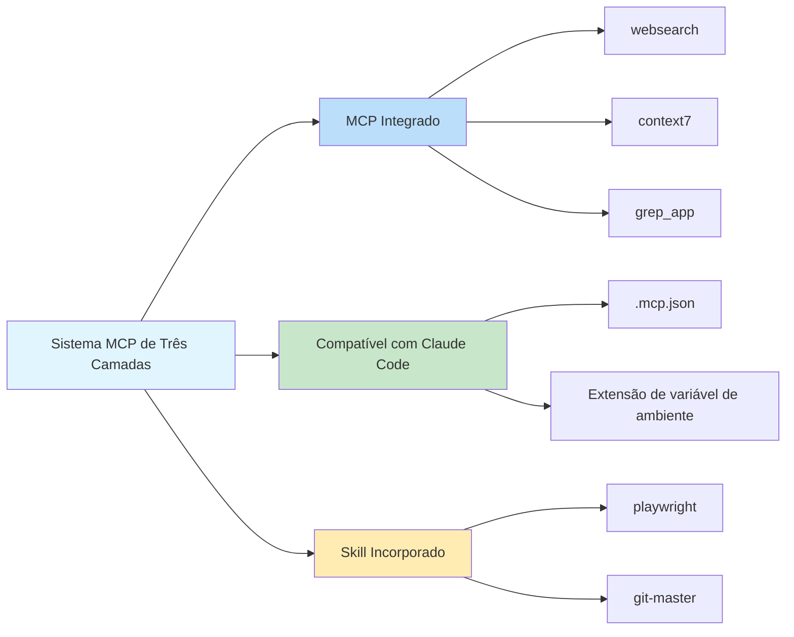

# Servidores MCP Integrados: Pesquisa Web, Consulta de Documentação e Pesquisa de Código

## O Que Você Vai Aprender

- ✅ Entender os 3 servidores MCP integrados e seus casos de uso
- ✅ Saber como configurar a Chave de API do Exa Websearch
- ✅ Aprender a desabilitar serviços MCP desnecessários
- ✅ Entender a arquitetura e os princípios de funcionamento do sistema MCP de três camadas

## Seu Desafio Atual

Agentes de IA só podem acessar arquivos locais e fazer requisições de rede, mas eles carecem de capacidades profissionais de pesquisa e consulta de documentação. Você quer que os agentes sejam capazes de:
- Pesquisar na web em tempo real pelas informações mais recentes
- Consultar documentação oficial para descrições precisas de APIs
- Pesquisar repositórios GitHub por exemplos de implementação

Mas implementar esses recursos manualmente adiciona complexidade ao desenvolvimento.

## Quando Usar Esta Abordagem

Quando você precisa estender as capacidades de agentes de IA:

| Cenário | MCP Recomendado |
|--- | ---|
| Precisa obter informações técnicas recentes, notícias ou tendências do setor | **websearch** (Exa) |
| Consultar documentação oficial de APIs para bibliotecas ou frameworks | **context7** |
| Encontrar exemplos de implementação em repositórios GitHub | **grep_app** (Grep.app) |

## Conceitos Fundamentais: O que é MCP?

**MCP (Model Context Protocol)** é um protocolo padrão que permite que agentes de IA acessem ferramentas externas e fontes de dados. Simplificando:

::: info O que é MCP?
MCP é como equipar um agente de IA com uma "caixa de ferramentas" contendo várias ferramentas profissionais (pesquisa, bancos de dados, APIs, etc.). Os agentes podem chamar essas ferramentas sob demanda para acessar capacidades não disponíveis localmente.
:::

Oh-My-OpenCode fornece um **sistema MCP de três camadas**:



**Esta lição foca na primeira camada: servidores MCP integrados.**

---

## Três Servidores MCP Integrados

Oh-My-OpenCode inclui 3 servidores MCP remotos que funcionam imediatamente (alguns requerem configuração de Chave de API).

### 1. websearch (Exa AI)

**Função**: Pesquisa web em tempo real alimentada por [Exa AI](https://exa.ai).

**Casos de Uso**:
- Pesquisar artigos técnicos recentes e notícias
- Encontrar soluções para problemas específicos
- Obter tendências do setor e melhores práticas

**Requisitos de Configuração**:

Você precisa definir a variável de ambiente `EXA_API_KEY`:

::: code-group

```bash [macOS/Linux]
export EXA_API_KEY="your-api-key-here"
```

```powershell [Windows]
setx EXA_API_KEY "your-api-key-here"
```

:::

::: tip Obtendo a Chave de API do Exa
1. Visite [Exa AI](https://exa.ai)
2. Cadastre-se para uma conta
3. Crie uma Chave de API no Dashboard
4. Adicione a Chave às variáveis de ambiente
:::

**Localização da Fonte**: `src/mcp/websearch.ts` (linhas 1-11)

---

### 2. context7

**Função**: Consulta de documentação oficial, suportando qualquer biblioteca ou framework de programação.

**Casos de Uso**:
- Consultar documentação de API para React, Vue, Next.js, etc.
- Obter documentação oficial para runtimes como Node.js, Python
- Consultar guias de uso para projetos open source

**Requisitos de Configuração**: Não requer configuração, funciona imediatamente.

**Localização da Fonte**: `src/mcp/context7.ts` (linhas 1-7)

---

### 3. grep_app (Grep.app)

**Função**: Pesquisa de código GitHub ultra-rápida para encontrar exemplos de implementação.

**Casos de Uso**:
- Encontrar implementações de padrões específicos em projetos open source
- Aprender como outros escrevem código
- Encontrar trechos de código para resolver problemas específicos

**Requisitos de Configuração**: Não requer configuração, funciona imediatamente.

**Localização da Fonte**: `src/mcp/grep-app.ts` (linhas 1-7)

---

## Configurando e Desabilitando MCPs

### Comportamento Padrão

Todos os servidores MCP integrados são **habilitados por padrão**. Oh-My-OpenCode registra automaticamente esses serviços na inicialização.

### Desabilitando MCPs Desnecessários

Se certos serviços MCP não são necessários, você pode desabilitá-los no arquivo de configuração:

```jsonc
// ~/.config/opencode/oh-my-opencodcode.json ou .opencode/oh-my-opencode.json
{
  "$schema": "./assets/oh-my-opencode.schema.json",

  // Desabilitar servidores MCP desnecessários
  "disabled_mcps": [
    "websearch",    // Desabilitar pesquisa web (se você não tem Chave de API do Exa)
    "grep_app"      // Desabilitar pesquisa de código GitHub
  ]
}
```

::: warning Por que Desabilitar MCPs?
Desabilitar MCPs desnecessários pode:
1. **Economizar recursos**: Reduzir conexões e requisições desnecessárias
2. **Simplificar configuração**: Evitar prompts para Chaves de API não definidas
3. **Melhorar estabilidade**: Reduzir possíveis pontos de falha de rede
:::

### Prioridade de Configuração

A prioridade de configuração de desabilitação para MCPs integrados:

| Localização da Configuração | Prioridade |
|--- | ---|
| Config do usuário `~/.config/opencode/oh-my-opencode.json` | Alta (sobrepõe config do projeto) |
| Config do projeto `.opencode/oh-my-opencode.json` | Média |
| Padrão do código | Baixa (todos habilitados) |

---

## Como Funciona: Configuração de MCP Remoto

Todos os servidores MCP integrados usam o modo **remoto (remote)**, conectando-se a serviços externos via protocolo HTTP/SSE.

**Modo de Configuração** (definição no código fonte):

```typescript
// src/mcp/websearch.ts
export const websearch = {
  type: "remote" as const,        // Fixado como "remote"
  url: "https://mcp.exa.ai/mcp?tools=web_search_exa",  // Endereço do servidor MCP
  enabled: true,                   // Status habilitado (sobrescrito por disabled_mcps)
  headers: process.env.EXA_API_KEY  // Headers de requisição opcionais (Chave de API)
    ? { "x-api-key": process.env.EXA_API_KEY }
    : undefined,
  oauth: false as const,            // Desabilitar detecção automática de OAuth
}
```

**Descrições dos Campos de Configuração**:

| Campo | Tipo | Descrição |
|--- | --- | ---|
| `type` | `"remote"` | Valor fixo, indicando MCP remoto |
| `url` | `string` | Endereço HTTP do servidor MCP |
| `enabled` | `boolean` | Se está habilitado (fixado como `true` no código, controlado por `disabled_mcps`) |
| `headers` | `object` | Headers de requisição HTTP opcionais (para autenticação) |
| `oauth` | `false` | Desabilitar detecção automática de OAuth (Exa usa Chave de API) |

---

## Armadilhas Comuns

### Armadilha 1: websearch Requer Chave de API

**Sintoma**: Agente falha ao tentar usar websearch, solicitando Chave de API ausente.

**Solução**:

```bash
# Verificar se a variável de ambiente está definida
echo $EXA_API_KEY

# Se vazia, definir Chave de API
export EXA_API_KEY="your-actual-api-key"

# Ou adicionar permanentemente ao config do shell (~/.bashrc, ~/.zshrc, etc.)
echo 'export EXA_API_KEY="your-actual-api-key"' >> ~/.zshrc
```

::: tip Verificar Chave de API
Após definir, você pode reiniciar o OpenCode ou executar o comando de diagnóstico para verificar:
```bash
oh-my-opencode doctor --verbose
```
:::

### Armadilha 2: MCP Ainda Solicitado Após Desabilitar

**Sintoma**: Mesmo após desabilitar um MCP, o agente ainda tenta usá-lo.

**Solução**:

1. Verificar se o caminho do arquivo de configuração está correto:
   - Config do usuário: `~/.config/opencode/oh-my-opencode.json`
   - Config do projeto: `.opencode/oh-my-opencode.json`

2. Confirmar que o formato JSON está correto (note vírgulas e aspas):

```jsonc
{
  "disabled_mcps": ["websearch"]  // ✅ Correto
  // "disabled_mcps": ["websearch"],  // ❌ Erro: vírgula final não permitida
}
```

3. Reiniciar o OpenCode para que a configuração entre em vigor.

### Armadilha 3: Resultados do Grep.app Inaccurados

**Sintoma**: grep_app retorna resultados que não correspondem às expectativas.

**Causas Possíveis**:
- Palavras-chave de pesquisa muito genéricas
- Repositório alvo inativo ou excluído
- Sintaxe de pesquisa incorreta

**Solução**:
- Usar termos de pesquisa mais específicos
- Especificar tipo de arquivo ou linguagem ao pesquisar
- Visitar [Grep.app](https://grep.app) diretamente para verificar manualmente

---

## Resumo

Esta lição apresentou os 3 servidores MCP integrados do Oh-My-OpenCode:

| MCP | Função | Requisitos de Configuração | Uso Principal |
|--- | --- | --- | ---|
| **websearch** | Pesquisa web em tempo real | EXA_API_KEY | Obter informações recentes |
| **context7** | Consulta de documentação oficial | Nenhum | Consultar documentação de API |
| **grep_app** | Pesquisa de código GitHub | Nenhum | Encontrar exemplos de implementação |

**Pontos Chave**:

1. **Sistema MCP de Três Camadas**: Integrado → Compatível com Claude Code → Skill Incorporado
2. **Habilitado por Padrão**: Todos os MCPs integrados são habilitados por padrão e podem ser desabilitados via `disabled_mcps`
3. **Modo Remoto**: Todos os MCPs integrados usam protocolo HTTP/SSE para conectar a serviços externos
4. **Exa Requer Chave**: websearch requer a variável de ambiente `EXA_API_KEY`

Esses servidores MCP expandem significativamente as capacidades dos agentes de IA, permitindo que eles acessem informações em tempo real e bases de conhecimento profissionais.

---

## Apêndice: Referência do Código Fonte

<details>
<summary><strong>Clique para expandir localizações do código fonte</strong></summary>

> Atualizado: 2026-01-26

| Função | Caminho do Arquivo | Números de Linha |
|--- | --- | ---|
| Função de fábrica MCP | [`src/mcp/index.ts`](https://github.com/code-yeongyu/oh-my-opencode/blob/main/src/mcp/index.ts) | 22-32 |
| Configuração websearch | [`src/mcp/websearch.ts`](https://github.com/code-yeongyu/oh-my-opencode/blob/main/src/mcp/websearch.ts) | 1-11 |
| Configuração context7 | [`src/mcp/context7.ts`](https://github.com/code-yeongyu/oh-my-opencode/blob/main/src/mcp/context7.ts) | 1-7 |
| Configuração grep_app | [`src/mcp/grep-app.ts`](https://github.com/code-yeongyu/oh-my-opencode/blob/main/src/mcp/grep-app.ts) | 1-7 |
| McpNameSchema | [`src/mcp/types.ts`](https://github.com/code-yeongyu/oh-my-opencode/blob/main/src/mcp/types.ts) | 1-10 |
| Campo disabled_mcps | [`src/config/schema.ts`](https://github.com/code-yeongyu/oh-my-opencode/blob/main/src/config/schema.ts) | 331 |

**Constantes Chave**:
- `allBuiltinMcps`: Objeto de configuração MCP integrado, incluindo websearch, context7, grep_app (`src/mcp/index.ts:16-20`)

**Funções Chave**:
- `createBuiltinMcps(disabledMcps)`: Criar lista de MCPs habilitados, filtrando MCPs desabilitados (`src/mcp/index.ts:22-32`)

</details>
