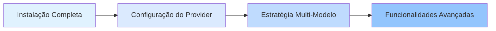

# Plataformas e Integrações

Este capítulo apresenta como configurar e gerenciar múltiplos AI Providers (Anthropic, OpenAI, Google, GitHub Copilot, etc.), bem como o mecanismo de fallback automático multi-modelo do oh-my-opencode.

Ao concluir este capítulo, você dominará como fazer com que o sistema selecione inteligentemente o modelo de IA mais adequado com base no tipo de tarefa e nos modelos disponíveis, construindo fluxos de trabalho de orquestração multi-modelo eficientes e confiáveis.

## O Que Este Capítulo Abrange

Este capítulo é dividido em duas partes:

### 1. [Configuração do Provider](provider-setup/)

Aprenda a configurar vários AI Providers, incluindo:
- Anthropic Claude (primeira escolha do orquestrador principal)
- OpenAI ChatGPT (especializado em revisão de arquitetura)
- Google Gemini (análise de frontend e mídia)
- GitHub Copilot (Provider de backup)
- Z.ai Coding Plan e OpenCode Zen (serviços opcionais)

**O Que Você Vai Aprender**:
- ✅ Configurar 6 AI Providers principais
- ✅ Usar o instalador interativo para configuração rápida
- ✅ Especificar os modelos mais adequados para diferentes agentes
- ✅ Usar o comando `doctor` para diagnosticar problemas de configuração

**Tempo Estimado**: 25-30 minutos

### 2. [Estratégia Multi-Modelo](model-resolution/)

Aprofunde-se no mecanismo de prioridade em três etapas do sistema de resolução de modelos:
- Override do usuário (controle preciso)
- Fallback do Provider (tolerância a falhas automática)
- Padrão do sistema (solução de fallback)

**O Que Você Vai Aprender**:
- ✅ Entender o fluxo de trabalho completo de resolução de modelos
- ✅ Especificar manualmente modelos com base nos requisitos da tarefa
- ✅ Aproveitar o fallback do Provider para melhorar a robustez do sistema
- ✅ Diagnosticar e resolver problemas de resolução de modelos

**Tempo Estimado**: 30-35 minutos

## Caminho de Aprendizado Recomendado

Recomendamos seguir esta ordem ao estudar este capítulo:

**Por que esta ordem?**

1. **Configure primeiro, entenda depois**: Aprenda primeiro como configurar cada Provider, depois entenda o mecanismo de resolução subjacente
2. **Do simples ao complexo**: A configuração do Provider é operação básica, a estratégia multi-modelo é um conceito avançado
3. **A prática valida a teoria**: Após configurar os Providers, você pode usar o comando `doctor` para verificar a eficácia da estratégia multi-modelo

::: tip Caminho de Início Rápido
Se você apenas deseja começar rapidamente, pode completar as etapas 1-4 de [Configuração do Provider](provider-setup/) (configurar Providers básicos) e aprender o restante conforme necessário posteriormente.
:::

## Pré-requisitos

Antes de estudar este capítulo, certifique-se de que:

- ✅ Completou [Instalação e Configuração Inicial](../installation/)
- ✅ Instalou o OpenCode (versão >= 1.0.150)
- ✅ Entende formatos básicos de arquivos de configuração JSON/JSONC
- ✅ Possui pelo menos uma assinatura de conta de AI Provider (Anthropic Claude recomendado)

::: warning E se eu não tiver uma conta de Provider?
Você pode aprender as etapas de configuração primeiro sem conectar-se a um Provider. O sistema usará o modelo padrão do OpenCode como fallback.
:::

## Perguntas Frequentes

<strong>Preciso configurar todos os Providers?</strong>

Não. Você pode configurar apenas os Providers que mais usa (por exemplo, apenas Anthropic Claude). O mecanismo de fallback do Provider do oh-my-opencode usará automaticamente os Providers disponíveis.

No entanto, se você deseja aproveitar totalmente as vantagens da orquestração multi-modelo, recomendamos configurar pelo menos 2-3 Providers, para que o sistema possa selecionar automaticamente o modelo mais adequado com base no tipo de tarefa.

<strong>Qual é a diferença entre configuração do Provider e resolução de modelos?</strong>

- **Configuração do Provider**: É a "etapa de instalação", informando ao sistema quais serviços de IA você tem disponíveis
- **Resolução de Modelos**: É a "lógica de decisão", como o sistema seleciona qual Provider usar para cada agente

Analogia: Configuração do Provider é "contratar membros da equipe", resolução de modelos é "atribuir tarefas".

<strong>Posso modificar a configuração a qualquer momento?</strong>

Você pode modificar o arquivo de configuração a qualquer momento:
- Configuração do usuário: `~/.config/opencode/oh-my-opencode.json`
- Configuração do projeto: `.opencode/oh-my-opencode.json`

As alterações entram em vigor automaticamente na próxima vez que você usar um agente. Se você modificou a autenticação do Provider, precisa executar `opencode auth login` para autenticar novamente.

## Próximos Passos

Após concluir este capítulo, você pode:

### Caminho Recomendado: Aprender a Equipe de Agentes de IA

Continue aprendendo [Equipe de Agentes de IA: Visão Geral de 10 Especialistas](../../advanced/ai-agents-overview/) para entender como usar diferentes agentes para tarefas especializadas.

### Caminho Avançado: Personalização Profunda

Se você já está familiarizado com a configuração básica, pode pular para [Configuração Profunda: Gerenciamento de Agentes e Permissões](../../advanced/advanced-configuration/) para aprender:
- Como personalizar prompts de agentes
- Como definir permissões e escopos de acesso de agentes
- Como criar agentes e Categorias personalizados

### Caminho Prático: Usar o Planejamento Prometheus

Comece a usar [Planejamento Prometheus: Coleta de Requisitos no Estilo de Entrevista](../../advanced/prometheus-planning/) para experimentar o poder da orquestração multi-modelo através da colaboração real de agentes.

---

**Começar**: Comece sua jornada de orquestração multi-modelo com [Configuração do Provider](provider-setup/)!
