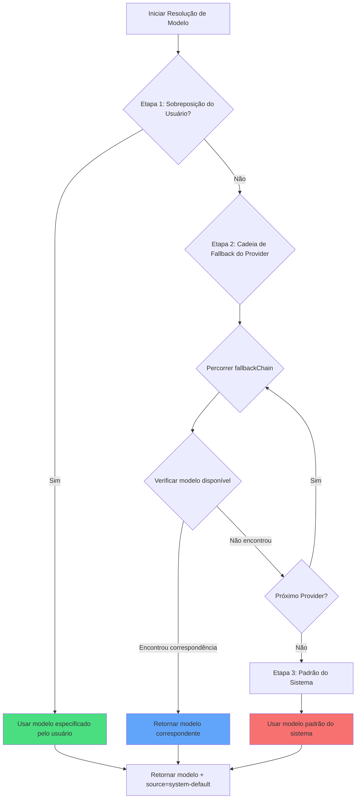

# Estratégia Multi-Modelo: Fallback Automático e Prioridade

## O Que Você Vai Aprender

- Entender como o oh-my-opencode seleciona automaticamente o modelo de IA mais apropriado para cada agente
- Dominar o mecanismo de resolução de modelo em três etapas (sobreposição do usuário → fallback do Provider → padrão do sistema)
- Aprender a configurar a sobreposição de modelo para agentes e Categories
- Usar o comando `doctor` para validar resultados de resolução de modelo
- Especificar manualmente modelos com base nas necessidades da tarefa, otimizando custo e desempenho

## Seu Dilema Atual

Depois de configurar múltiplos Providers de IA (Anthropic, OpenAI, Google, etc.), você pode encontrar estas dúvidas:

- **Seleção de modelo não clara**: Qual modelo os agentes Sisyphus, Oracle, Librarian, etc., realmente usam?
- **Configuração manual tediosa**: Cada agente precisa ter um modelo especificado individualmente; quando o Provider muda, tudo precisa ser ajustado
- **Custo incontrolável**: Não sabe quais tarefas usam modelos caros (como Claude Opus)
- **Falha do Provider afeta a experiência**: Se a API de um Provider cair, todo o sistema para de funcionar
- **Colaboração multi-modelo não transparente**: Em tarefas paralelas, não fica claro qual modelo cada agente usa

Tudo isso está impedindo você de liberar o verdadeiro poder da orquestração multi-modelo.

## Ideia Central

O **sistema de resolução de modelo** é o "seletor inteligente de modelos" do oh-my-opencode. Com base na sua configuração e nos modelos disponíveis, ele decide dinamicamente qual modelo cada agente e Category usará.

::: info O Que é Resolução de Modelo?
Resolução de modelo (Model Resolution) é o processo de selecionar um modelo de IA específico para cada agente ou Category em tempo de execução. Não é codificado de forma rígida, mas sim um resultado de cálculo dinâmico baseado na sua configuração, Providers disponíveis, nomes de modelos, etc.
:::

### Fluxo de Resolução em Três Etapas

A resolução de modelo é realizada através de três etapas de prioridade:



**Etapa 1: Sobreposição do Usuário (User Override)**
- Se você especificou explicitamente um `model` para um agente ou Category em `oh-my-opencode.json`, o sistema usará diretamente esse modelo
- Pula a cadeia de fallback do Provider
- Esta é a prioridade mais alta

**Etapa 2: Fallback do Provider (Provider Fallback)**
- Se não houver sobreposição do usuário, o sistema tentará na cadeia de prioridade de Providers predefinida
- Para cada agente ou Category, existe um `fallbackChain` que define a ordem de preferência de Providers
- O sistema tenta cada Provider em sequência até encontrar um modelo disponível

**Etapa 3: Padrão do Sistema (System Default)**
- Se nenhum Provider tiver um modelo disponível, usa o modelo padrão do OpenCode
- Esta é a solução de segurança final

### Cadeia de Prioridade de Providers por Agente

Cada agente tem sua própria ordem de preferência de Provider, dependendo do tipo de tarefa e capacidades necessárias:

| Agente | Modelo Recomendado (sem prefixo) | Cadeia de Prioridade de Providers | Variante |
|--- | --- | --- | ---|
| **Sisyphus** | `claude-opus-4-5` | anthropic → github-copilot → opencode → zai-coding-plan | max |
| **Oracle** | `gpt-5.2` | openai → anthropic → google | high |
| **Librarian** | `big-pickle` | zai-coding-plan → opencode → anthropic | - |
| **Explore** | `claude-haiku-4-5` | anthropic → opencode → github-copilot | - |
| **Multimodal Looker** | `gemini-3-flash` | google → openai → zai-coding-plan → anthropic → opencode | - |
| **Prometheus** | `claude-opus-4-5` | anthropic → github-copilot → opencode → google | max |
| **Metis** | `claude-opus-4-5` | anthropic → github-copilot → opencode → google | max |
| **Momus** | `gpt-5.2` | openai → anthropic → google | medium |
| **Atlas** | `claude-sonnet-4-5` | anthropic → github-copilot → opencode → google | - |

::: tip Por que o Sisyphus Prefere Anthropic?
O Sisyphus é o principal orquestrador e precisa de forte capacidade de raciocínio. O Claude Opus é o modelo mais adequado para tarefas complexas de orquestração, então Anthropic está em primeiro lugar em sua cadeia de prioridade. Se sua cota Anthropic for insuficiente, o sistema fará downgrade automaticamente para outros Providers.
:::

### Cadeia de Prioridade de Providers por Category

As Categories também seguem a mesma lógica de resolução:

| Category | Modelo Recomendado (sem prefixo) | Cadeia de Prioridade de Providers | Variante |
|--- | --- | --- | ---|
| **visual-engineering** | `gemini-3-pro` | google → anthropic → openai | - |
| **ultrabrain** | `gpt-5.2-codex` | openai → anthropic → google | xhigh |
| **artistry** | `gemini-3-pro` | google → anthropic → openai | max |
| **quick** | `claude-haiku-4-5` | anthropic → google → opencode | - |
| **unspecified-low** | `claude-sonnet-4-5` | anthropic → openai → google | - |
| **unspecified-high** | `claude-opus-4-5` | anthropic → openai → google | max |
| **writing** | `gemini-3-flash` | google → anthropic → zai-coding-plan → openai | - |

::: tip Vantagens das Categories
Ao delegar tarefas usando `delegate_task(category="quick", ...)`, o sistema usa automaticamente a cadeia de prioridade de Providers da Category quick. Isso significa que você não precisa memorizar a configuração de cada agente, apenas escolher a Category apropriada com base no tipo de tarefa.
:::

## Siga Comigo

### Passo 1: Verificar o Estado Atual da Resolução de Modelo

Use o comando `doctor` para ver os resultados de resolução de modelo de cada agente e Category:

```bash
bunx oh-my-opencode doctor --verbose
```

**Você deve ver** uma saída semelhante a esta:

```
✅ Model Resolution Check
━━━━━━━━━━━━━━━━━━━━━━━━━━━━━━━━━━━━━━━━━━━━━━━━━━━

Agent: sisyphus
  Requirement: claude-opus-4-5 (variant: max)
  Fallback Chain: anthropic → github-copilot → opencode → zai-coding-plan → openai → google
  User Override: (none)
  Resolved Model: anthropic/claude-opus-4-5
  Source: provider-fallback
  Variant: max

Agent: oracle
  Requirement: gpt-5.2 (variant: high)
  Fallback Chain: openai → anthropic → google
  User Override: (none)
  Resolved Model: openai/gpt-5.2
  Source: provider-fallback
  Variant: high

Category: quick
  Requirement: claude-haiku-4-5
  Fallback Chain: anthropic → google → opencode
  User Override: (none)
  Resolved Model: anthropic/claude-haiku-4-5
  Source: provider-fallback
```

Esta saída mostra:
- O requisito de modelo de cada agente/Category
- A ordem da cadeia de prioridade de Providers
- Se há configuração de sobreposição do usuário
- O modelo finalmente resolvido e sua fonte (override/provider-fallback/system-default)

### Passo 2: Sobrescrever Manualmente o Modelo de um Agente

Suponha que você queira que o Oracle use o modelo mais recente da OpenAI em vez do GPT-5.2 padrão:

Edite `~/.config/opencode/oh-my-opencode.json` ou `.opencode/oh-my-opencode.json`:

```jsonc
{
  "$schema": "https://raw.githubusercontent.com/code-yeongyu/oh-my-opencode/master/assets/oh-my-opencode.schema.json",

  "agents": {
    "oracle": {
      "model": "openai/o3"  // Sobrescreve para o modelo o3
    },
    "explore": {
      "model": "opencode/gpt-5-nano"  // Usa modelo gratuito
    }
  }
}
```

::: info Prioridade do Passo 1
Quando você define `agents.oracle.model`, o sistema usará diretamente este modelo no Passo 1, pulando a cadeia de fallback do Provider. Mesmo que o Claude Opus da Anthropic esteja disponível, o Oracle usará o OpenAI o3 que você especificou.
:::

**Você deve ver**: Ao executar o comando `doctor` novamente, o resultado de resolução do Oracle mudará para:

```
Agent: oracle
  Requirement: gpt-5.2 (variant: high)
  Fallback Chain: openai → anthropic → google
  User Override: openai/o3  // ← Sobreposição do usuário ativa
  Resolved Model: openai/o3
  Source: override  // ← Fonte muda para override
  Variant: high
```

### Passo 3: Sobrescrever Manualmente o Modelo de uma Category

Suponha que você queira que a Category `quick` use o GPT-5 Nano gratuito:

```jsonc
{
  "$schema": "https://raw.githubusercontent.com/code-yeongyu/oh-my-opencode/master/assets/oh-my-opencode.schema.json",

  "categories": {
    "quick": {
      "model": "opencode/gpt-5-nano"  // Sobrescreve para modelo gratuito
    },
    "visual-engineering": {
      "model": "anthropic/claude-opus-4-5"  // Força uso do Opus
    }
  }
}
```

**Você deve ver**: Quando você usa `delegate_task(category="quick", ...)`, o sistema usará `opencode/gpt-5-nano`, mesmo que o Haiku da Anthropic esteja disponível.

### Passo 4: Simular Falha de Provider

A melhor maneira de entender o mecanismo de fallback do Provider é simular cenários de falha.

Suponha que você configurou apenas a OpenAI, mas quer ver qual modelo o Sisyphus (que prefere Anthropic) usará:

**Configuração atual**:
```jsonc
{
  // oh-my-opencode.json
  // Apenas provider openai configurado
}
```

**Execute doctor**:

```
Agent: sisyphus
  Requirement: claude-opus-4-5 (variant: max)
  Fallback Chain: anthropic → github-copilot → opencode → zai-coding-plan → openai → google
  User Override: (none)
  
  // Tentativa 1: anthropic/claude-opus-4-5
  // Resultado: não disponível (não configurado)
  
  // Tentativa 2: github-copilot/claude-opus-4-5
  // Resultado: não disponível (não configurado)
  
  // Tentativa 3: opencode/claude-opus-4-5
  // Resultado: não disponível (não configurado)
  
  // Tentativa 4: zai-coding-plan/glm-4.7
  // Resultado: não disponível (não configurado)
  
  // Tentativa 5: openai/gpt-5.2-codex (5ª entrada da fallbackChain)
  // Resultado: encontrado!
  
  Resolved Model: openai/gpt-5.2-codex
  Source: provider-fallback
  Variant: medium
```

**Você deve ver**: Embora o Sisyphus prefira Claude Opus, como Anthropic não está disponível, o sistema fez downgrade para o GPT-5.2 Codex da OpenAI.

::: tip Vantagens do Downgrade Automático
O mecanismo de fallback do Provider garante a robustez do sistema. Mesmo que um Provider falhe ou esgote a quota, o sistema pode alternar automaticamente para um Provider de backup, sem intervenção manual.
:::

### Passo 5: Validar Fallback Padrão do Sistema

Suponha que você não configurou nenhum Provider, ou todos os Providers falharam:

**Execute doctor**:

```
Agent: sisyphus
  Requirement: claude-opus-4-5
  Fallback Chain: anthropic → github-copilot → ...
  
  // Todas as tentativas de Provider falharam
  
  Resolved Model: anthropic/claude-opus-4-5  // Usa padrão do sistema
  Source: system-default  // ← Fonte é system-default
  Variant: max
```

**Você deve ver**: O sistema usa o modelo padrão configurado no OpenCode. Esta é a rede de segurança final.

## Checkpoint ✅

Depois de completar os passos acima, confirme:

- [ ] Executar `doctor --verbose` mostra os resultados de resolução de modelo de todos os agentes e Categories
- [ ] Após sobrescrever manualmente o modelo de um agente, o `Source` muda para `override`
- [ ] Após sobrescrever manualmente o modelo de uma Category, o `delegate_task` usa o modelo especificado
- [ ] Ao simular falha de Provider, o sistema faz downgrade corretamente para o próximo Provider disponível
- [ ] Quando todos os Providers estão indisponíveis, o sistema usa `system-default`

Se algum item não passar, verifique:
- Se o caminho do arquivo de configuração está correto (`~/.config/opencode/oh-my-opencode.json` ou `.opencode/oh-my-opencode.json`)
- Se o Provider está configurado corretamente (API Key, variáveis de ambiente, etc.)
- Se o nome do modelo está correto (incluindo o prefixo do Provider, como `anthropic/claude-opus-4-5`)

## Quando Usar Esta Técnica

| Cenário | Sobreposição Manual de Modelo | Usar Fallback do Provider |
|--- | --- | ---|
| **Tarefas sensíveis a custo** | ✅ Especificar modelo barato | ❌ Pode escolher modelo caro |
| **Tarefas sensíveis a desempenho** | ✅ Especificar modelo mais forte | ❌ Pode fazer downgrade para modelo fraco |
| **Testar novos modelos** | ✅ Especificar modelo experimental | ❌ Não seleciona automaticamente |
| **Desenvolvimento diário** | ❌ Configuração excessiva | ✅ Seleção automática do ótimo |
| **Falha de Provider** | ❌ Requer modificação manual | ✅ Downgrade automático |
| **Ambiente multi-Provider** | ❌ Configuração excessiva | ✅ Balanceamento de carga automático |

**Regra de Ouro**:
- Use sobreposição manual apenas quando precisar de controle preciso do modelo
- Nos outros casos, deixe o sistema selecionar automaticamente e aproveite a robustez do fallback do Provider
- Para tarefas sensíveis a custo, você pode fazer override para a Category `quick` ou especificar um modelo barato
- Para tarefas que exigem o máximo de desempenho, você pode fazer override para `claude-opus-4-5` ou `gpt-5.2`

## Alertas de Armadilhas

::: warning Erros Comuns

**1. Nome do modelo sem prefixo do Provider**

```jsonc
// ❌ Erro: Falta o prefixo do Provider
{
  "agents": {
    "oracle": {
      "model": "gpt-5.2"  // Falta o prefixo openai/
    }
  }
}

// ✅ Correto: Caminho completo incluído
{
  "agents": {
    "oracle": {
      "model": "openai/gpt-5.2"  // Caminho completo do modelo
    }
  }
}
```

**2. Sobrescrever com modelo inexistente**

```jsonc
// ❌ Erro: Nome do modelo digitado incorretamente
{
  "agents": {
    "oracle": {
      "model": "openai/gpt-6"  // GPT-6 não existe
    }
  }
}

// ✅ Correto: Usar modelo real
{
  "agents": {
    "oracle": {
      "model": "openai/gpt-5.2"  // Modelo real
    }
  }
}
```

**3. Ignorar configuração de Variant**

Alguns agentes e Categories têm Variants recomendadas (como `max`, `high`, `medium`), que afetam a capacidade de raciocínio do modelo. Ao fazer override manual, note:

```jsonc
// ✅ Recomendado: Manter a Variant padrão
{
  "agents": {
    "oracle": {
      "model": "openai/gpt-5.2"
      // A Variant será herdada do fallbackChain: high
    }
  }
}

// ✅ Opcional: Especificar Variant manualmente
{
  "agents": {
    "oracle": {
      "model": "openai/gpt-5.2",
      "variant": "max"  // Sobrescreve o valor padrão
    }
  }
}
```

**4. Depender do padrão do sistema sem configurar Provider**

O modelo padrão do sistema vem da configuração do OpenCode. Se você não configurou nenhum Provider, o OpenCode também pode usar um modelo padrão, mas esse modelo pode não ser o que você deseja.

**Recomendação**:
- Configure pelo menos um Provider (Anthropic, OpenAI, Google, etc.)
- Use o comando `doctor` para verificar regularmente os resultados de resolução de modelo
:::

## Resumo da Aula

O sistema de resolução de modelo implementa seleção inteligente de modelo através de um mecanismo de prioridade em três etapas:

- **Etapa 1: User Override**: O modelo que você especifica tem a mais alta prioridade, totalmente controlável
- **Etapa 2: Provider Fallback**: Degradação automática de acordo com a cadeia de prioridade predefinida, garantindo robustez
- **Etapa 3: System Default**: A solução de segurança final, garantindo que o sistema sempre tenha um modelo disponível

Cada agente e Category tem sua própria cadeia de prioridade de Providers, projetada com base no tipo de tarefa do agente e capacidades necessárias. O Sisyphus prefere Anthropic (raciocínio complexo), o Oracle prefere OpenAI (consultoria estratégica), o Librarian prefere zai-coding-plan (pesquisa multi-repositório).

Lembre-se:
- **Desenvolvimento diário**: Deixe o sistema selecionar automaticamente e aproveite o fallback do Provider
- **Controle preciso**: Sobrescreva manualmente o modelo para otimizar custo e desempenho
- **Recuperação de falhas**: O fallback do Provider lida automaticamente com falhas, sem intervenção manual
- **Ferramenta de validação**: Use o comando `doctor` para verificar resultados de resolução de modelo

## Prévia da Próxima Aula

> Na próxima aula, aprenderemos sobre **[Equipe de Agentes de IA: Visão Geral de 10 Especialistas](../../advanced/ai-agents-overview/)**.
>
> Você vai aprender:
> - Funções, casos de uso e configurações de permissão dos 10 agentes integrados
> - Como escolher o agente apropriado com base no tipo de tarefa
> - Padrões de colaboração entre agentes e melhores práticas

---

## Apêndice: Referência de Código Fonte

<details>
<summary><strong>Clique para expandir e ver a localização do código fonte</strong></summary>

> Última atualização: 2026-01-26

| Função | Caminho do Arquivo | Número da Linha |
|--- | --- | ---|
| Função principal de resolução de modelo | [`src/shared/model-resolver.ts`](https://github.com/code-yeongyu/oh-my-opencode/blob/main/src/shared/model-resolver.ts) | 43-98 |
| Definição de requisitos de modelo de agente | [`src/shared/model-requirements.ts`](https://github.com/code-yeongyu/oh-my-opencode/blob/main/src/shared/model-requirements.ts) | 12-79 |
| Definição de requisitos de modelo de Category | [`src/shared/model-requirements.ts`](https://github.com/code-yeongyu/oh-my-opencode/blob/main/src/shared/model-requirements.ts) | 81-133 |
| Resolução de modelo na criação de agente | [`src/agents/utils.ts`](https://github.com/code-yeongyu/oh-my-opencode/blob/main/src/agents/utils.ts) | 203-208, 245-250, 284-289 |
| Resolução de modelo na delegação de Category | [`src/tools/delegate-task/tools.ts`](https://github.com/code-yeongyu/oh-my-opencode/blob/main/src/tools/delegate-task/tools.ts) | 532-540 |
| Verificação de resolução de modelo no comando doctor | [`src/cli/doctor/checks/model-resolution.ts`](https://github.com/code-yeongyu/oh-my-opencode/blob/main/src/cli/doctor/checks/model-resolution.ts) | 130-160 |

**Definições de tipos principais**:
- `ModelResolutionInput`: Parâmetros de entrada para resolução de modelo (`src/shared/model-resolver.ts:6-10`)
- `ExtendedModelResolutionInput`: Entrada estendida para resolução de modelo, incluindo fallbackChain e availableModels (`src/shared/model-resolver.ts:23-28`)
- `ModelResolutionResult`: Resultado da resolução de modelo, contendo model, source, variant (`src/shared/model-resolver.ts:17-21`)
- `ModelSource`: Enumeração de fontes de modelo (`override`/`provider-fallback`/`system-default`) (`src/shared/model-resolver.ts:12-16`)
- `FallbackEntry`: Entrada na cadeia de fallback do Provider, contendo providers, model, variant (`src/shared/model-requirements.ts:1-5`)
- `ModelRequirement`: Definição de requisito de modelo, contendo fallbackChain e variant padrão (`src/shared/model-requirements.ts:7-10`)

**Constantes principais**:
- `AGENT_MODEL_REQUIREMENTS`: Definições de requisitos de modelo de todos os agentes, incluindo fallbackChain (`src/shared/model-requirements.ts:12-79`)
- `CATEGORY_MODEL_REQUIREMENTS`: Definições de requisitos de modelo de todas as Categories (`src/shared/model-requirements.ts:81-133`)

**Funções principais**:
- `resolveModelWithFallback()`: Função principal de resolução de modelo, implementando mecanismo de prioridade em três etapas (`src/shared/model-resolver.ts:43-98`)
- `resolveModel()`: Resolução de modelo simples, usada quando não há fallbackChain (`src/shared/model-resolver.ts:35-41`)
- `normalizeModel()`: Normaliza nome de modelo, remove espaços em branco (`src/shared/model-resolver.ts:30-33`)
- `createBuiltinAgents()`: Ao criar todos os agentes integrados, chama o resolvedor de modelo para determinar o modelo (`src/agents/utils.ts:143-313`)

**Regras de negócio**:
| ID da Regra | Descrição da Regra | Marcação |
|--- | --- | ---|
| BR-4.1-7 | Prioridade de resolução de modelo: sobreposição do usuário > fallback do Provider > padrão do sistema | 【Fato】 |
| BR-4.1-7-1 | Quando há sobreposição do usuário, retorna diretamente, pulando a cadeia de fallback do Provider | 【Fato】 |
| BR-4.1-7-2 | Ao fazer fallback do Provider, tenta cada Provider em ordem da fallbackChain | 【Fato】 |
| BR-4.1-7-3 | Ao fazer fallback do Provider, verifica o cache availableModels, se vazio verifica connectedProviders | 【Fato】 |
| BR-4.1-7-4 | Quando todos os Providers estão indisponíveis, usa systemDefaultModel | 【Fato】 |
| BR-4.1-7-5 | FallbackChain do Sisyphus: anthropic → github-copilot → opencode → zai-coding-plan → openai → google | 【Fato】 |
| BR-4.1-7-6 | FallbackChain do Oracle: openai → anthropic → google | 【Fato】 |
| BR-4.1-7-7 | FallbackChain do Librarian: zai-coding-plan → opencode → anthropic | 【Fato】 |
| BR-4.1-7-8 | FallbackChain do Explore: anthropic → opencode → github-copilot | 【Fato】 |
| BR-4.1-7-9 | FallbackChain do Multimodal Looker: google → openai → zai-coding-plan → anthropic → opencode | 【Fato】 |

</details>
