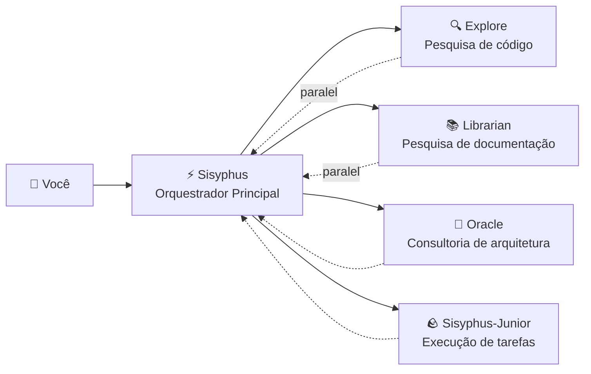

# Orquestrador Principal: Pensar e Executar como um Engenheiro Sênior

## O Que Você Aprenderá

- Entenda como o Sisyphus coordena o trabalho como uma equipe de desenvolvimento real
- Domine as melhores práticas de delegação de tarefas, permitindo que diferentes agentes especialistas colaborem em tarefas complexas
- Aprenda a aumentar drasticamente a eficiência de desenvolvimento através de tarefas em paralelo em segundo plano
- Saiba quando deixar o agente trabalhar sozinho e quando delegar para especialistas

## Seu Problema Atual

Você pode ter encontrado esses problemas:

- Agentes IA "desistem no meio do caminho", esquecendo o objetivo enquanto escrevem
- O mesmo arquivo é modificado repetidamente, precisando ser relido a cada vez
- Você quer que a IA faça muitas coisas, mas só pode esperar uma por uma na fila
- O agente escreve código, mas você ainda precisa verificar se está correto e se não quebrou outras funcionalidades

**Causa raiz**: Você está pedindo a um "assistente universal" para fazer todo o trabalho, mas especialistas entendem de tarefas especializadas.

## Quando Usar Esta Abordagem

O Sisyphus é seu orquestrador principal, adequado para estes cenários:

| Cenário | Adequado | Alternativa |
|---------|----------|--------------|
| Desenvolvimento de funcionalidades complexas (3+ etapas) | ✅ Altamente recomendado | Prometheus + Atlas (requer planejamento detalhado) |
| Correção rápida de bugs conhecidos | ✅ Adequado | Deixe o Sisyphus fazer diretamente |
| Precisa pesquisar múltiplos repositórios/documentos | ✅ Altamente recomendado | Use delegação paralela do Sisyphus |
| Modificação simples de arquivo único | ✅ Pode | Edição direta (mais simples) |
| Precisa de planejamento detalhado do projeto | ⚠️ Não recomendado | Use Prometheus primeiro para gerar o plano |

## Ideia Central

O **Sisyphus** é o agente orquestrador principal, coordenando múltiplos especialistas IA como uma equipe de desenvolvimento real. Através de mecanismos de separação de responsabilidades e delegação paralela, ele permite que sub-agentes especialistas explorem seus pontos fortes, alcançando colaboração eficiente.

O Sisyphus não é uma "IA mais inteligente", ele é um **sistema de orquestração**.

### Separação de Responsabilidades



O **Sisyphus não escreve código**, ele é responsável por:

1. **Entender sua necessidade real** (não apenas ouvir o significado superficial)
2. **Julgar quem é melhor nisso** (não fazer tudo sozinho)
3. **Delegar tarefas em paralelo** (deixar múltiplos especialistas trabalharem simultaneamente)
4. **Verificar resultados** (nunca confiar cegamente em "concluí")

### Por que Sisyphus?

Na mitologia grega, Sísifo foi punido a empurrar uma pedra montanha acima eternamente.

A filosofia de design deste sistema: **O agente deve empurrar a pedra até o fim (completar todos os TODOs) antes de parar**.

::: info
Isso não é punição, é um mecanismo de garantia de qualidade. Você não quer que a IA desista no meio e deixe uma bagunça.
:::

### Budget de Pensamento de 32k

O Sisyphus usa **Claude Opus 4.5 + 32k thinking budget**.

Para que serve isso?

| Baixo budget (sem thinking) | 32k thinking budget |
|-----------------------------|---------------------|
| Começa a escrever código diretamente | Analisa profundamente os requisitos, avalia complexidade, decompõe tarefas |
| Facilmente perde casos extremos | Descobre problemas e riscos potenciais antecipadamente |
| Percebe que está errado no meio do caminho | Escolhe a solução ótima desde o início |

::: tip
Altamente recomendado configurar o modelo **Opus 4.5** para o Sisyphus. A experiência com outros modelos diminuirá significativamente.
:::

## Siga Comigo

### Passo 1: Criar um projeto de teste

**Por que**
Você precisa de um projeto executável para observar o comportamento do Sisyphus.
mkdir my-app && cd my-app
npm create next-app@latest . -- --typescript --tailwind --eslint --no-src-dir
npm install
```

**O que você deve ver**: Projeto inicializado, pode executar `npm run dev` para iniciar.

### Passo 2: Dar ao Sisyphus uma tarefa complexa

Abra o projeto no OpenCode, digite:

```
Adicionar funcionalidade de login de usuário, incluindo:
- Login com email e senha
- Armazenamento de token JWT
- Rotas protegidas
- Verificação de status de login
```

Observe a reação do Sisyphus.

**O que você deve ver**:

1. O Sisyphus não começará a escrever código diretamente
2. Ele primeiro cria uma lista TODO (decompondo a tarefa em detalhes)
3. Avalia padrões do código (verifica configuração, estrutura de arquivos)
4. Pode fazer algumas perguntas de esclarecimento

**Ponto de verificação ✅**: Verifique o painel TODO do OpenCode, você deve ver algo como:

```
□ Instalar dependências necessárias (bcrypt, jsonwebtoken)
□ Criar modelo de usuário e definições de tipos
□ Implementar endpoint de API de login
□ Criar ferramentas de assinatura e verificação JWT
□ Adicionar middleware de rotas protegidas
□ Implementar formulário de login frontend
□ Adicionar gerenciamento de estado de login
```

### Passo 3: Observar delegação paralela (momento crucial)

Durante a implementação, o Sisyphus pode:

```
[Background Task Started]
- Task ID: bg_abc123
- Agent: explore
- Prompt: "Find existing auth patterns in this codebase..."

[Background Task Started]
- Task ID: bg_def456
- Agent: librarian
- Prompt: "Research JWT best practices for Next.js..."
```

**Isso é crucial**: O Sisyphus **não espera** essas tarefas completarem, ele continua trabalhando.

Quando você precisa dos resultados, ele chama `background_output(task_id="...")` para obtê-los.

**Por que é tão rápido?**

| Modo serial (tradicional) | Modo paralelo (Sisyphus) |
|---------------------------|---------------------------|
| Pesquisa de código (2 minutos) | ⏳ Pesquisa de código (2 minutos) |
| Esperando... | ⏳ Pesquisa de documentação (2 minutos, simultâneo) |
| Pesquisa de documentação (2 minutos) | Começar implementação (tempo total 2 minutos) |
| Começar implementação (2 minutos) |  |
| **Tempo total 6 minutos** | **Tempo total 4 minutos (economia 33%)** |

### Passo 4: Mecanismo de verificação

Quando o Sisyphus declara "tarefa concluída", ele:

1. Executa `lsp_diagnostics` para verificar erros
2. Executa `npm run build` para garantir que a build passe
3. Se houver testes, executa a suíte de testes
4. Marca o TODO como `completed`

**Ponto de verificação ✅**: Verifique a saída do terminal, você deve ver algo como:

```
✓ Running diagnostics on changed files...
✓ No errors found
✓ Build passed (exit code 0)
✓ All tests passed
```

Se qualquer verificação falhar, o Sisyphus corrigirá imediatamente, nunca deixando uma bagunça.

### Passo 5: Avisos sobre armadilhas

#### ❌ Abordagem errada: Interromper o rastreamento TODO do Sisyphus

Você vê o Sisyphus fazendo tarefas, e está ansioso para apressar:

```
Escreva o código rápido! Não faça planos!
```

**Problema**: O Sisyphus pulará o TODO e escreverá código diretamente, mas pode perder casos extremos.

**Abordagem correta**:

```
Espere o Sisyphus completar o planejamento. Se achar o planejamento errado, faça sugestões específicas de melhoria:
"O passo 3 do TODO deve considerar primeiro a solução de migração de banco de dados."
```

#### ❌ Abordagem errada: Não permitir que o Sisyphus delegue

Você desabilitou todos os agentes especialistas na configuração, deixando apenas o Sisyphus.

**Problema**: O Sisyphus tentará fazer tudo sozinho, mas pode não ser especialista o suficiente.

**Abordagem correta**:

Mantenha a configuração padrão, deixe o Sisyphus delegar automaticamente para especialistas:

| Tarefa | Sisyphus faz sozinho | Delegar para especialista |
|--------|----------------------|---------------------------|
| Modificação simples de arquivo único | ✅ Pode | Não necessário |
| Pesquisa de código | ⚠️ Lento | ✅ Explore (mais rápido) |
| Pesquisa de documentação | ⚠️ Pode ser impreciso | ✅ Librarian (mais profissional) |
| Decisões de arquitetura | ❌ Não recomendado | ✅ Oracle (mais autoritativo) |

## Resumo da Lição

O poder do Sisyphus não está em ser "mais inteligente", mas sim em:

1. **Separação de responsabilidades**: Orquestrador principal + equipe especializada, não trabalho solitário
2. **Pensamento profundo**: Budget de pensamento de 32k garante que nenhum detalhe seja perdido
3. **Execução paralela**: Tarefas em segundo plano permitem que múltiplos especialistas trabalhem simultaneamente
4. **Verificação forçada**: Sem evidência = tarefa não concluída
5. **Rastreamento TODO**: Desistir no meio não é permitido

**Princípios centrais**:

::: tip
**Delegação padrão**: A menos que a tarefa seja extremamente simples (arquivo único, local conhecido), priorize delegar para especialistas ou usar Category+Skill.
:::

## Próxima Lição

> Na próxima lição, aprenderemos sobre o **[Modo Ultrawork](../ultrawork-mode/)**, ativando todas as funcionalidades com um clique, permitindo que o Sisyphus dê o seu melhor em tarefas complexas.
>
> Você aprenderá:
> - Como usar a palavra-chave `ultrawork` para iniciar tarefas rapidamente
> - Quais capacidades adicionais o modo Ultrawork ativa
> - Quando usar Ultrawork e quando usar Prometheus

---

## Apêndice: Referência de Código Fonte

<details>
<summary><strong>Clique para expandir e ver localizações do código fonte</strong></summary>

> Tempo de atualização: 2026-01-26

| Funcionalidade | Caminho do arquivo | Linha |
|---------------|-------------------|-------|
| Fábrica de agente Sisyphus | [`src/agents/sisyphus.ts`](https://github.com/code-yeongyu/oh-my-opencode/blob/main/src/agents/sisyphus.ts) | 419-450 |
| Prompt principal do Sisyphus | [`src/agents/sisyphus.ts`](https://github.com/code-yeongyu/oh-my-opencode/blob/main/src/agents/sisyphus.ts) | 17-416 |
| Metadados de agente e configuração de modelo | [`src/agents/AGENTS.md`](https://github.com/code-yeongyu/oh-my-opencode/blob/main/src/agents/AGENTS.md) | 24-36 |
| Restrições de permissões de ferramentas | [`src/agents/AGENTS.md`](https://github.com/code-yeongyu/oh-my-opencode/blob/main/src/agents/AGENTS.md) | 44-51 |

**Configurações chave**:
- **Thinking Budget**: 32k tokens (apenas modelos Anthropic)
- **Temperature**: 0.1 (agentes de código com temperatura baixa fixa)
- **Max Tokens**: 64000
- **Modelo recomendado**: anthropic/claude-opus-4-5

**Fluxo de trabalho principal** (do código fonte):
- **Fase 0**: Intent Gate (classificação de intenção, linhas 53-103)
- **Fase 1**: Codebase Assessment (avaliação do código, linhas 107-130)
- **Fase 2A**: Exploration & Research (exploração e pesquisa, linhas 132-172)
- **Fase 2B**: Implementation (implementação, linhas 176-263)
- **Fase 2C**: Failure Recovery (recuperação de falha, linhas 266-283)
- **Fase 3**: Completion (conclusão, linhas 286-302)

**Restrições chave**:
- **Tarefas não triviais devem criar TODO** (linha 311)
- **Tarefas em segundo plano devem ser paralelas** (linhas 144-162)
- **Deve verificar resultados** (linhas 254-262)

</details>
