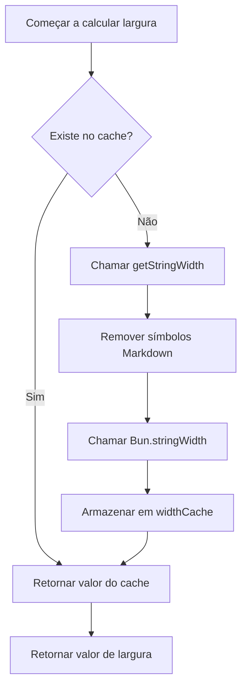

# Detalhes Técnicos: Mecanismo de Cache e Otimização de Desempenho

## O que você será capaz de fazer após esta aula

- Entender como o mecanismo de cache do plugin melhora o desempenho
- Dominar a estrutura de dados e o uso do widthCache
- Entender as condições de acionamento para limpeza automática de cache
- Saber como analisar o efeito da otimização de desempenho

## Seu dilema atual

Você pode estar se perguntando:

> Como o plugin calcula rapidamente a largura das tabelas? Por que ainda é fluido ao processar tabelas grandes? Como o mecanismo de cache foi projetado?

Esta aula analisa profundamente a implementação interna do plugin, levando você a entender as ideias de design e estratégias de otimização de desempenho do mecanismo de cache.

## Ideia central

### Por que usar cache?

Ao formatar tabelas Markdown, o plugin precisa calcular a **largura de exibição** (display width) de cada célula. Este cálculo envolve:

1. **Remover símbolos Markdown**: como `**粗体**`, `*斜体*`, `~~删除线~~`
2. **Proteger código em linha**: Símbolos Markdown dentro de `` `代码` `` permanecem inalterados
3. **Chamar `Bun.stringWidth()`**: Calcular a largura de exibição de caracteres Unicode (incluindo Emoji, caracteres chineses)

**O problema é**: O mesmo conteúdo de célula pode aparecer várias vezes (como nomes de colunas de cabeçalho), e recalcular essa lógica toda vez seria muito lento.

**Solução**: Usar cache (Map) para armazenar o mapeamento "conteúdo de texto → largura de exibição", evitando cálculos repetidos.

## Estrutura de dados do cache

O plugin usa duas variáveis globais para gerenciar o cache:

### widthCache

```typescript
const widthCache = new Map<string, number>()
```

**Uso**: Cache os resultados de cálculo de largura de exibição de strings

**Estrutura**:
- **Key**: O conteúdo de texto original da célula (incluindo toda a sintaxe Markdown)
- **Value**: A largura de exibição calculada (número de caracteres)

**Exemplo**:

| Texto original (Key) | Largura de exibição (Value) | Descrição |
| --------------- | ---------------- | ---- |
| `**姓名**` | 4 | Largura de 4 após remover `**` |
| `*年龄*` | 4 | Largura de 4 após remover `*` |
| `` `status` `` | 8 | Símbolos de bloco de código também são contados na largura |
| `张三` | 4 | Largura de caracteres chineses é 1 |

### cacheOperationCount

```typescript
let cacheOperationCount = 0
```

**Uso**: Registra o número de operações de cache, usado para acionar limpeza automática

**Limiar de limpeza**:
- Número de operações > 100 ou
- Entradas de cache > 1000

## Fluxo de busca de cache

### Função calculateDisplayWidth

Ao calcular a largura de uma célula, o plugin chama a função `calculateDisplayWidth()`, executando o seguinte fluxo:

<details>
<summary><strong>📖 Ver código completo</strong></summary>

```typescript
function calculateDisplayWidth(text: string): number {
  if (widthCache.has(text)) {
    return widthCache.get(text)!  // Cache hit, retorna diretamente
  }

  const width = getStringWidth(text)  // Calcula a largura real
  widthCache.set(text, width)          // Armazena no cache
  return width
}
```

</details>

**Diagrama de fluxo**:



**Análise de etapas**:

| Etapa | Operação | Complexidade de tempo |
| ---- | ---- | ---------- |
| 1 | Verificar `widthCache.has(text)` | O(1) |
| 2 | Cache hit → Retornar diretamente | O(1) |
| 3 | Cache miss → Calcular largura | O(n) |
| 4 | Armazenar no cache | O(1) |

**Pontos chave**:
- **Quando há cache hit**: Retorna diretamente, sem nenhum cálculo (O(1))
- **Quando há cache miss**: Executa a lógica completa de cálculo de largura (O(n))
- **Armazena texto original**: A Key é o texto Markdown completo, garantindo correspondência precisa

## Mecanismo de limpeza de cache

### Por que limpar o cache?

Embora o cache melhore o desempenho, ele ocupa memória. Se não for limpo:
- **Ocupação de memória cresce continuamente**: Cada novo conteúdo de célula será armazenado em cache
- **Pode conter dados inúteis**: Conteúdos de tabelas antigas podem não ser mais necessários

### Condições de acionamento para limpeza automática

Após cada formatação ser concluída, o plugin chama `incrementOperationCount()` para atualizar a contagem de operações:

<details>
<summary><strong>📖 Ver código de limpeza</strong></summary>

```typescript
function incrementOperationCount() {
  cacheOperationCount++

  if (cacheOperationCount > 100 || widthCache.size > 1000) {
    cleanupCache()
  }
}

function cleanupCache() {
  widthCache.clear()
  cacheOperationCount = 0
}
```

</details>

**Condições de acionamento** (qualquer uma delas aciona):

| Condição | Limiar | Descrição |
| ---- | ---- | ---- |
| Número de operações | > 100 operações de formatação | Evita acionar limpeza com muita frequência |
| Entradas de cache | > 1000 células | Evita ocupação excessiva de memória |

**Estratégia de limpeza**:
- **Limpeza completa**: `widthCache.clear()` exclui todo o cache
- **Reiniciar contagem**: `cacheOperationCount = 0`

::: info Momento da limpeza

A limpeza do cache ocorre **após cada formatação ser concluída**, não durante o processo de formatação. Isso não interrompe operações de formatação em andamento.

:::

## Efeito de otimização de desempenho

### Análise de taxa de cache hit

Suponha uma tabela de 5 colunas × 10 linhas, onde:

- **Conteúdo repetido**: Nomes de colunas de cabeçalho aparecem repetidamente 11 vezes na linha separadora e nas linhas de dados
- **Conteúdo único**: O conteúdo de cada célula é diferente

**Efeito do cache**:

| Cenário | Sem cache | Com cache | Melhoria de desempenho |
| ---- | ---------- | -------- | -------- |
| 5 colunas × 10 linhas (sem repetição) | 50 cálculos | 50 cálculos | Nenhuma |
| 5 colunas × 10 linhas (cabeçalho repetido) | 50 cálculos | 10 cálculos + 40 cache hits | ~80% |

### Impacto real

**Vantagens trazidas pelo cache**:

1. **Reduzir sobrecarga de cálculo**: Evita remover repetidamente símbolos Markdown e chamar `Bun.stringWidth()`
2. **Reduzir uso de CPU**: `getStringWidth()` envolve substituição de regex e cálculo Unicode, com sobrecarga relativamente grande
3. **Melhorar velocidade de resposta**: Para tabelas com muitas células repetidas, o efeito é mais óbvio

**Cenários de exemplo**:

| Cenário | Efeito do cache |
| ---- | -------- |
| IA gera tabelas de comparação | ✅ Efeito significativo (múltiplas colunas com conteúdo repetido) |
| Tabelas simples de linha única | ⚪ Efeito médio (conteúdo único) |
| Tabelas com Markdown aninhado | ✅ Efeito significativo (sobrecarga de remoção de símbolos grande) |

## Sugestões de otimização de desempenho

::: tip Sugestões para desenvolvedores

Se você precisa otimizar ainda mais o desempenho, considere:

1. **Ajustar limiar de cache**: Ajuste os limiares de `100` operações e `1000` entradas de acordo com o tamanho real das tabelas
2. **Cache LRU**: Use o algoritmo menos usado recentemente (LRU) em vez da estratégia de limpeza completa
3. **Monitoramento de desempenho**: Adicione logs para estatísticas de taxa de cache hit, analisando o efeito real

:::

## Resumo da aula

O plugin usa o mecanismo de cache `widthCache` para otimizar o desempenho:

- **Estrutura de armazenamento**: `Map<string, number>` mapeia texto original para largura de exibição
- **Fluxo de busca**: Primeiro verifica o cache → Se não hit, calcula e armazena
- **Mecanismo de limpeza**: Limpa automaticamente quando operações > 100 ou entradas > 1000
- **Melhoria de desempenho**: Reduz cálculos repetidos, diminui uso de CPU

Este mecanismo permite que o plugin permaneça fluido ao processar tabelas complexas, sendo a implementação central da otimização de desempenho.

## Próxima aula

> Na próxima aula, aprenderemos **[Log de Atualizações: Histórico de Versões e Registro de Alterações](../../changelog/release-notes/)**.
>
> Você aprenderá:
> - Histórico de evolução de versões do plugin
> - Registro de novos recursos e correções
> - Como acompanhar as atualizações do plugin

---

## Apêndice: Referência do código-fonte

<details>
<summary><strong>Clique para expandir e ver a localização do código-fonte</strong></summary>

> Atualizado em: 2026-01-26

| Função | Caminho do arquivo | Número da linha |
| --- | --- | --- |
| Definição de widthCache | [`source/franlol/opencode-md-table-formatter/index.ts`](https://github.com/franlol/opencode-md-table-formatter/blob/main/index.ts#L6) | 6 |
| Definição de cacheOperationCount | [`source/franlol/opencode-md-table-formatter/index.ts`](https://github.com/franlol/opencode-md-table-formatter/blob/main/index.ts#L7) | 7 |
| Função calculateDisplayWidth | [`source/franlol/opencode-md-table-formatter/index.ts`](https://github.com/franlol/opencode-md-table-formatter/blob/main/index.ts#L151-L159) | 151-159 |
| Função incrementOperationCount | [`source/franlol/opencode-md-table-formatter/index.ts`](https://github.com/franlol/opencode-md-table-formatter/blob/main/index.ts#L219-L225) | 219-225 |
| Função cleanupCache | [`source/franlol/opencode-md-table-formatter/index.ts`](https://github.com/franlol/opencode-md-table-formatter/blob/main/index.ts#L227-L230) | 227-230 |

**Constantes principais**:
- `widthCache = new Map<string, number>()`: Estrutura Map para cache de largura de exibição de strings
- `cacheOperationCount = 0`: Contador de operações de cache

**Funções principais**:
- `calculateDisplayWidth(text: string): number`: Calcula largura de exibição (com cache), primeiro verifica o cache depois calcula
- `incrementOperationCount(): void`: Incrementa contagem de operações, aciona limpeza condicional
- `cleanupCache(): void`: Limpa widthCache e reinicia contador

</details>
