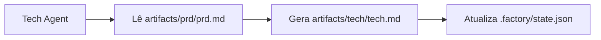

# Otimização de Contexto: Execução em Sessões Separadas

## O Que Você Poderá Fazer Após Este Tutorial

- Usar o comando `factory continue` para continuar o pipeline em uma nova sessão
- Entender as vantagens de cada fase ter um contexto limpo exclusivo
- Dominar métodos para reduzir significativamente o consumo de Tokens
- Suportar recuperação de interrupções, permitindo pausar e continuar a qualquer momento

## Seu Dilema Atual

Quando você executa o pipeline completo de 7 fases em um assistente de IA (como Claude Code), pode encontrar estes problemas:

- **Tokens aumentando cada vez mais**: À medida que a conversa se acumula, o contexto fica cada vez mais longo, e cada fase precisa carregar o conteúdo de todas as fases anteriores
- **Custos cada vez mais altos**: Conversas longas significam mais Tokens de entrada, e os custos disparam
- **Respostas mais lentas**: Contextos muito longos podem aumentar o tempo de resposta
- **Difícil recuperar**: Se uma fase falhar, reiniciar requer recarregar uma grande quantidade de contexto

::: tip Problema Central
O acúmulo de contexto em conversas longas é uma característica inerente dos assistentes de IA, mas podemos contornar este problema através da "execução em sessões separadas".
:::

## Quando Usar Esta Técnica

| Cenário | Usar Sessões Separadas? | Motivo |
| --- | --- | --- |
| Executar pipeline completo de 7 fases | ✅ Altamente Recomendado | Cada Token é precioso |
| Executar apenas 1-2 fases | ⚠️ Opcional | Contexto curto, não necessariamente necessário |
| Depurar uma fase específica | ⚠️ Opcional | Tentativas frequentes podem aumentar o custo de troca de sessão |
| Recuperar após interrupção prolongada | ✅ Deve Usar | Evitar carregar contexto desatualizado |

## Ideia Central

O Agent App Factory suporta **execução em sessões separadas**, e sua ideia central é:

**Após cada fase terminar, use uma nova sessão para executar a próxima fase.**

Os benefícios desta abordagem:

1. **Contexto Limpo**: Cada fase carrega apenas os arquivos de entrada necessários, sem depender do histórico de conversa
2. **Economia de Tokens**: Evita repetidamente passar o conteúdo de todas as fases anteriores para a IA
3. **Recuperabilidade**: Pode interromper a qualquer momento e continuar depois com uma nova sessão sem perder o progresso
4. **Compatibilidade Multiplataforma**: Aplicável a todos os assistentes de IA (Claude Code, OpenCode, Cursor, etc.)

### Estratégia de Isolamento de Contexto

Para implementar a execução em sessões separadas, o Agent App Factory adota uma **estratégia de isolamento de contexto**:

::: info O Que É Isolamento de Contexto?
Isolamento de contexto significa que cada Agent depende apenas de arquivos de entrada, não do histórico de conversa. Independentemente do que aconteceu antes, o Agent lê informações apenas dos arquivos de entrada especificados.
:::

Quando cada Agent executa:

- ✅ **Lê apenas** os arquivos `inputs` definidos em `pipeline.yaml`
- ❌ **Não usa** qualquer "memória" do histórico de conversa
- ❌ **Não assume** que sabe o que aconteceu nas fases anteriores

Por exemplo, quando o Tech Agent executa:



O Tech Agent se preocupa apenas com `artifacts/prd/prd.md`, não pensa "o usuário disse antes que queria fazer qual aplicativo", todas as informações vêm dos arquivos de entrada.

### Mecanismo de Recuperação de Estado

Quando você executa `factory continue`, o sistema irá:

1. Ler `.factory/state.json` para obter o progresso atual
2. Ler `.factory/pipeline.yaml` para determinar a próxima fase
3. **Carregar apenas os arquivos de entrada necessários para aquela fase**
4. Iniciar uma nova janela do assistente de IA para continuar a execução

O arquivo de estado (`.factory/state.json`) é o "centro de memória" de todo o sistema:

```json
{
  "version": 1,
  "status": "waiting_for_confirmation",
  "current_stage": "tech",
  "completed_stages": ["bootstrap", "prd"],
  "last_updated": "2026-01-29T12:00:00Z"
}
```

Após cada fase ser concluída, o estado é atualizado neste arquivo. Quando uma nova sessão é iniciada, basta ler este arquivo para saber onde estamos.

## 🎒 Preparação Antes de Começar

::: warning Verificação Prévia
Antes de iniciar este tutorial, certifique-se de:

- [ ] Ter completado o [Início Rápido](../../start/getting-started/) e inicializado um projeto Factory
- [ ] Ter entendido a [Visão Geral do Pipeline de 7 Fases](../../start/pipeline-overview/)
- [ ] Ter instalado o Claude Code (ou outro assistente de IA)

Se ainda não completou, por favor finalize estes cursos prévios primeiro.
:::

## Siga Comigo

Vamos aprender como usar o comando `factory continue` através de um cenário prático.

### Definição do Cenário

Suponha que você está executando um pipeline de 7 fases, já completou as fases `bootstrap` e `prd`, e está na fase `ui` aguardando confirmação.

### Passo 1: Selecionar "Continuar em Nova Sessão" no Checkpoint

Quando uma fase é concluída, o scheduler Sisyphus exibe uma tabela de opções:

```
✓ ui concluído!

Produtos gerados:
- artifacts/ui/ui.schema.yaml
- artifacts/ui/preview.web/index.html
- artifacts/ui/preview.web/styles.css
- artifacts/ui/preview.web/app.js

┌─────────────────────────────────────────────────────────────┐
│  📋 Por favor, selecione a próxima ação                     │
│  Digite o número da opção (1-5) e pressione Enter para confirmar │
└─────────────────────────────────────────────────────────────┘

┌──────┬──────────────────────────────────────────────────────┐
│ Opção │ Descrição                                           │
├──────┼──────────────────────────────────────────────────────┤
│  1   │ Continuar para a próxima fase (mesma sessão)        │
│      │ Continuarei a executar a fase tech                  │
├──────┼──────────────────────────────────────────────────────┤
│  2   │ Continuar em nova sessão ⭐ Opção recomendada, economiza Tokens │
│      │ Execute em uma nova janela de terminal: factory continue │
│      │ (Iniciará automaticamente uma nova janela do Claude Code e continuará o pipeline) │
├──────┼──────────────────────────────────────────────────────┤
│  3   │ Reexecutar esta fase                                │
│      │ Reexecutar a fase ui                                │
├──────┼──────────────────────────────────────────────────────┤
│  4   │ Modificar produtos e reexecutar                     │
│      │ Modificar artifacts/prd/prd.md e reexecutar         │
├──────┼──────────────────────────────────────────────────────┤
│  5   │ Pausar o pipeline                                   │
│      │ Salvar o progresso atual e continuar depois         │
└──────┴──────────────────────────────────────────────────────┘

💡 Dica: Digite um número entre 1-5 e pressione Enter para confirmar sua escolha
```

**Você deve ver**:
- A opção 2 marcada como "⭐ Opção recomendada, economiza Tokens"

Na sessão atual, podemos selecionar a opção 5 (pausar o pipeline) e depois executar `factory continue` em uma nova janela de terminal.

**Por Quê**
- A opção 1 é "Continuar para a próxima fase (mesma sessão)", que continua na sessão atual e o contexto se acumula
- A opção 2 é "Continuar em nova sessão", que usa um novo contexto limpo para executar a próxima fase, **economizando Tokens**
- A opção 5 é "Pausar o pipeline", que salva o progresso atual e pode ser retomado depois com `factory continue`

### Passo 2: Executar `factory continue` em Nova Janela de Terminal

Abra uma nova janela de terminal (ou aba), entre no diretório do seu projeto e execute:

```bash
factory continue
```

**Você deve ver**:

```
Agent Factory - Continue in New Session

Pipeline Status:
────────────────────────────────────────
Project: my-awesome-app
Status: Waiting
Current Stage: tech
Completed: bootstrap, prd

Starting new Claude Code session...
✓ Nova janela do Claude Code iniciada
  (Please wait for the window to open)
```

**O Que Aconteceu**:

1. O comando `factory continue` leu `.factory/state.json` e conheceu o estado atual
2. Exibiu as informações de status do projeto atual
3. Iniciou automaticamente uma nova janela do Claude Code e passou a instrução "por favor, continue executando o pipeline"
4. A nova janela continuará automaticamente a execução a partir da fase `tech`

### Passo 3: Continuar a Execução na Nova Janela

Após a nova janela do Claude Code ser iniciada, você verá uma nova conversa, mas o estado é restaurado a partir do checkpoint salvo anteriormente.

Na nova sessão, o Agent irá:

1. Ler `.factory/state.json` para obter a fase atual
2. Ler `.factory/pipeline.yaml` para determinar as entradas e saídas daquela fase
3. **Carregar apenas os arquivos de entrada necessários para aquela fase** (por exemplo, `artifacts/prd/prd.md`)
4. Executar as tarefas daquela fase

**Pontos-Chave**:
- A nova sessão não tem o histórico de conversa das fases anteriores
- O Agent lê informações apenas dos arquivos de entrada, não depende de "memória"
- Isto é a manifestação do **isolamento de contexto**

### Passo 4: Verificar o Isolamento de Contexto

Para verificar se o isolamento de contexto está funcionando, você pode tentar perguntar ao Agent na nova sessão:

"Você sabe o que a fase bootstrap fez?"

Se o isolamento de contexto estiver funcionando, o Agent dirá algo como:

"Preciso verificar os arquivos relevantes para entender o trabalho anterior. Deixe-me ler..."

Então ele tentará ler `input/idea.md` ou outros arquivos para obter informações, em vez de "lembrar" diretamente do histórico de conversa.

**Checkpoint ✅**
- Nova sessão iniciada com sucesso
- Exibiu o estado correto do projeto
- O Agent depende apenas dos arquivos de entrada, não do histórico de conversa

### Passo 5: Continuar a Executar as Fases Restantes

Após cada fase ser concluída, você pode escolher:

- Continuar na sessão atual (opção 1) - Aplicável a fluxos curtos
- **Continuar em nova sessão (opção 2)** - **Recomendado, economiza Tokens**
- Pausar o pipeline (opção 5) - Execute `factory continue` depois

Para um pipeline completo de 7 fases, recomenda-se usar "Continuar em nova sessão" em cada fase, assim:

```
bootstrap (sessão 1) → prd (sessão 2) → ui (sessão 3) → tech (sessão 4)
→ code (sessão 5) → validation (sessão 6) → preview (sessão 7)
```

Cada sessão é limpa e não precisa carregar o conteúdo de todas as fases anteriores.

## Alertas de Armadilhas

### Armadilha 1: Esquecer de Executar `factory continue`

**Prática Incorreta**:
- Começar a próxima fase diretamente na sessão antiga
- Ou abrir o Claude Code em uma nova janela sem executar `factory continue`

**Prática Correta**:
- Sempre use o comando `factory continue` para iniciar uma nova sessão
- Este comando lê automaticamente o estado e passa as instruções corretas

### Armadilha 2: Recarregar Arquivos Históricos na Nova Sessão

**Prática Incorreta**:
- Manualmente pedir à IA para ler os produtos das fases anteriores na nova sessão
- Achar que a IA deveria "saber" o que aconteceu antes

**Prática Correta**:
- Confie no mecanismo de isolamento de contexto, o Agent lerá automaticamente informações dos arquivos de entrada
- Forneça apenas os arquivos de entrada necessários para aquela fase

### Armadilha 3: Usar `factory continue` Entre Projetos

**Prática Incorreta**:
- Executar `factory continue` no projeto A, mas o diretório atual é o projeto B

**Prática Correta**:
- `factory continue` verifica se o diretório atual é um projeto Factory
- Se não for, solicitará que você execute `factory init` primeiro

### Armadilha 4: Não Usar `factory continue` Após Modificar Produtos

**Cenário**:
- Após uma fase ser concluída, você modificou manualmente os produtos (como modificou o PRD)
- Quer continuar executando a próxima fase

**Prática Correta**:
- Execute `factory run` (reiniciará a partir da fase especificada)
- Ou execute `factory continue` (continuará a partir do checkpoint atual)
- Não continue diretamente na sessão antiga, pois o contexto pode estar inconsistente

## Resumo da Aula

Nesta aula, aprendemos como usar o comando `factory continue` para execução em sessões separadas:

### Pontos-Chave

1. **Execução em Sessões Separadas**: Após cada fase ser concluída, use uma nova sessão para executar a próxima fase
2. **Isolamento de Contexto**: O Agent depende apenas dos arquivos de entrada, não do histórico de conversa
3. **Recuperação de Estado**: `.factory/state.json` registra o progresso atual, novas sessões podem recuperar
4. **Economia de Tokens**: Evita carregar contextos muito longos, reduzindo significativamente os custos

### Referência Rápida de Comandos

| Comando | Função | Cenário de Uso |
| --- | --- | --- |
| `factory continue` | Continuar execução do pipeline em nova sessão | Após cada fase ser concluída |
| `factory run` | Executar pipeline na sessão atual | Primeira execução ou depuração |
| `factory status` | Verificar estado atual do projeto | Entender o progresso |

### Melhores Práticas

- ✅ Ao executar o pipeline completo de 7 fases, use `factory continue` em cada fase
- ✅ No checkpoint, selecione "Continuar em nova sessão" (opção 2)
- ✅ Confie no mecanismo de isolamento de contexto, não carregue arquivos históricos manualmente
- ✅ Use `factory status` para verificar o progresso do projeto

## Prévia da Próxima Aula

> Na próxima aula, aprenderemos sobre **[Mecanismos de Permissão e Segurança](../security-permissions/)**.
>
> Você aprenderá:
> - Como a matriz de limites de capacidade previne que o Agent exceda suas permissões
> - Mecanismos de tratamento de excesso de permissão e isolamento de produtos não confiáveis
> - Checkpoints de segurança e processos de verificação de permissões
> - Como configurar os arquivos de permissão do Claude Code

Esta aula ajudará você a entender os mecanismos de segurança do Agent App Factory, garantindo que cada Agent leia e escreva arquivos apenas nos diretórios autorizados.

---

## Apêndice: Referência de Código-Fonte

<details>
<summary><strong>Clique para expandir e ver a localização do código-fonte</strong></summary>

> Última atualização: 2026-01-29

| Função | Caminho do Arquivo | Linhas |
| --- | --- | --- |
| Comando factory continue | [`cli/commands/continue.js`](https://github.com/hyz1992/agent-app-factory/blob/main/cli/commands/continue.js) | 1-144 |
| Otimização de contexto do scheduler | [`agents/orchestrator.checkpoint.md`](https://github.com/hyz1992/agent-app-factory/blob/main/agents/orchestrator.checkpoint.md) | 113-154 |
| Estratégia de isolamento de contexto | [`policies/context-isolation.md`](https://github.com/hyz1992/agent-app-factory/blob/main/policies/context-isolation.md) | 1-64 |

**Funções-Chave**:
- `launchClaudeCode(projectDir, nextStage, completedStages)`: Inicia uma nova janela do Claude Code
- `commandExists(cmd)`: Verifica se o comando está disponível
- `module.exports(projectDir)`: Função principal do comando `factory continue`

**Constantes-Chave**:
- `state.json`: Caminho do arquivo de estado (`.factory/state.json`)
- `pipeline.yaml`: Caminho do arquivo de definição do pipeline (`.factory/pipeline.yaml`)
- `config.yaml`: Caminho do arquivo de configuração do projeto (`.factory/config.yaml`)

**Regras de Negócio-Chave**:
- BR-6-1: Cada fase tem um contexto limpo exclusivo
- BR-6-2: Use o comando `factory continue` para continuar
- BR-6-3: Carregar apenas os arquivos necessários para a fase atual

</details>
