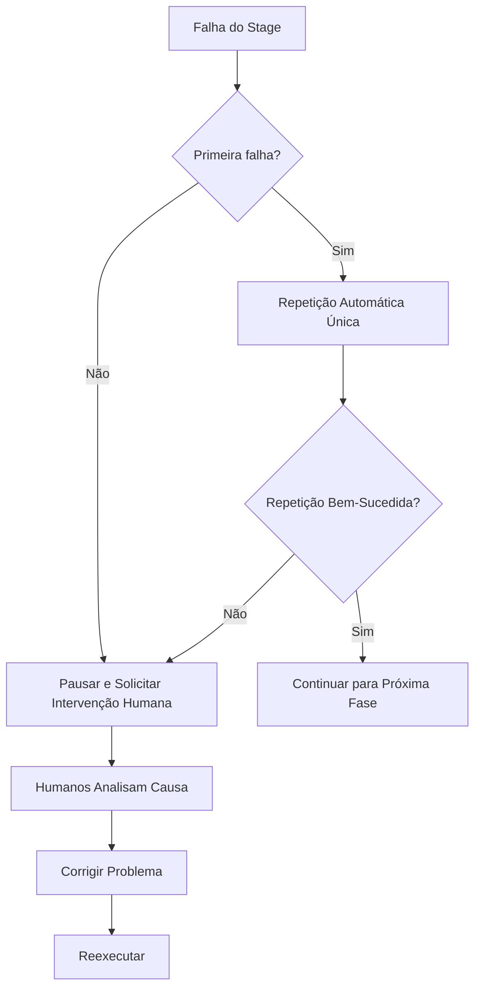
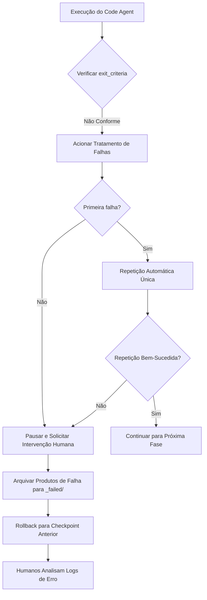
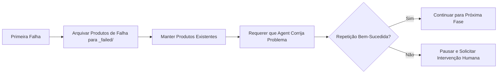
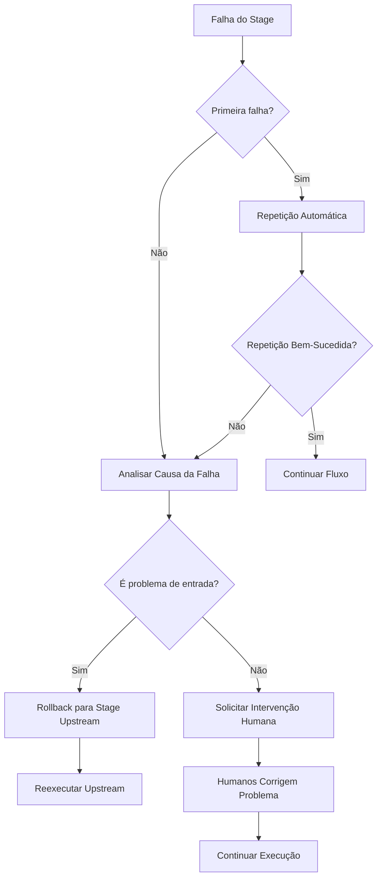

# Tratamento de Falhas e Rollback: Tolerância a Falhas Inteligente e Recuperação de Erros

## O Que Você Vai Aprender

- **Identificar Tipos de Falha**: Julgar rapidamente as causas de falhas como saída ausente, conteúdo incompatível ou gravação não autorizada
- **Entender Mecanismo de Repetição**: Dominar a estratégia de repetição automática única e regras de arquivamento de falhas
- **Executar Operação de Rollback**: Aprender a fazer rollback para o checkpoint de sucesso mais recente e restaurar um estado estável
- **Tratamento de Intervenção Humana**: Saber quando a intervenção humana é necessária, como analisar causas de falha e corrigir
- **Interpretar Logs de Erro**: Compreender relatórios de erro do `pipeline/error.log` e localizar problemas rapidamente

## Sua Situação Atual

Quando o pipeline é executado, suas maiores preocupações são:

- **O que fazer se falhar**: Se uma fase reportar erro, devemos tentar novamente ou começar do início?
- **Dados contaminados**: Os produtos de falha afetarão fases subsequentes? Eles serão limpos?
- **Como fazer rollback**: Quero voltar ao estado de sucesso anterior, como fazer?
- **Intervenção humana**: Falhas consecutivas, o que preciso fazer? Como ver os logs?

O mecanismo de tratamento de falhas existe para resolver esses problemas—ele define o processo completo de identificação de falhas, repetição automática, arquivamento de produtos de falha, rollback para checkpoints e intervenção humana.

## Quando Usar Esta Técnica

Quando o pipeline apresentar as seguintes situações:

- **Falha de fase**: Execução do Agent falhou, arquivos de saída ausentes ou não conformes
- **Operação não autorizada**: Agent gravou em diretório não autorizado, acionando verificação de segurança
- **Falhas consecutivas**: Mesma fase falhou duas vezes, necessitando análise de intervenção humana
- **Necessidade de rollback**: Quer voltar ao estado de sucesso anterior para recomeçar
- **Análise de logs**: Precisa ver relatórios de erro detalhados e informações de stack

## Ideia Central

A estratégia de tratamento de falhas é executada unificadamente pelo orquestrador Sisyphus, que atua como um **engenheiro de tolerância a falhas**, processando automaticamente ou solicitando intervenção humana quando o pipeline encontra erros.

### Definição de Falha

As seguintes situações são consideradas falhas de Stage:

| Tipo de Falha | Sintoma | Localização do Código |
| --- | --- | --- |
| **Saída Ausente** | Arquivos de saída especificados em `pipeline.yaml` não existem ou nomes não correspondem | `failure.policy.md:9` |
| **Não Conforme com exit_criteria** | Conteúdo de saída não atende condições de saída em `pipeline.yaml` | `failure.policy.md:10` |
| **Gravação Não Autorizada** | Agent gravou conteúdo em diretório ou arquivo não autorizado | `failure.policy.md:11` |
| **Outras Exceções** | Erros de script, incapacidade de ler entrada, etc., impedindo conclusão da tarefa | `failure.policy.md:12` |

### Mecanismo de Repetição



**Regras de Repetição** (`failure.policy.md:16-18`):

- Cada Stage permite **repetição automática única** por padrão
- Na repetição, o orquestrador requer que o Agent corrija problemas mantendo produtos existentes, em vez de refazer completamente
- Se a segunda tentativa também falhar, o orquestrador deve pausar o pipeline e entrar no processo de intervenção humana

### Rollback e Arquivamento

**Arquivamento de Falhas** (`failure.policy.md:22-23`):

```bash
# Produtos de falha movidos para diretório _failed/
mv artifacts/<stage>/ artifacts/_failed/<stage-id>/attempt-1/
mv artifacts/<stage>/ artifacts/_failed/<stage-id>/attempt-2/
```

**Estratégia de Rollback** (`failure.policy.md:23`):

- O orquestrador faz rollback para o checkpoint de sucesso mais recente
- Reexecuta a partir deste Stage
- Garante consistência de produtos upstream e downstream, evitando contaminação de dados

### Intervenção Humana

**Momento de Intervenção** (`failure.policy.md:27`):

- Após o mesmo Stage falhar duas vezes consecutivas
- Quando gravação não autorizada é detectada

**Fluxo de Intervenção** (`failure.policy.md:27-29`):

1. O orquestrador pausa a execução e reporta a causa da falha
2. Humanos verificam se há problemas na entrada, configuração ou habilidades
3. Humanos modificam arquivos de entrada, ajustam habilidades ou modificam parâmetros
4. Continua a execução do processo restante

::: warning Restrição do Orquestrador
O orquestrador não deve pular fases com falha ou modificar saídas sem confirmação humana.
:::

## Siga-me

### Passo 1: Entender o Fluxo de Tratamento de Falhas

Quando você executa o pipeline, se uma fase falhar, o orquestrador Sisyphus inicia automaticamente o fluxo de tratamento de falhas.

**Cenário de Exemplo**: Falha na fase Code



### Passo 2: Visualizar Logs de Erro

Quando há falha, o orquestrador registra informações de erro detalhadas em `pipeline/error.log`.

**Formato do Log de Erro** (`failure.policy.md:166-200`):

```bash
cat pipeline/error.log
```

**Você Deve Ver**:

```log
============================================
ERROR REPORT
============================================
Timestamp: 2026-01-29T10:30:00Z
Stage: code
Attempt: 2/2
Status: FAILED

Error Type: TypeScript Compilation Error
Error Message: Cannot find module '@prisma/client'

Stack Trace:
  at Object.<anonymous> (src/lib/prisma.ts:1:1)
  at Module._compile (node:internal/modules/cjs/loader:1198:14)

Exit Criteria Failed:
  - [ ] Backend pode iniciar sem erros críticos (FAILED)
  - [x] Cliente pode renderizar e acessar
  - [x] Não introduziu autenticação adicional ou funcionalidades irrelevantes

Failed Artifacts Moved To:
  artifacts/_failed/code/attempt-2/

Recommended Action:
  1. Verifique se package.json contém @prisma/client
  2. Execute npx prisma generate para gerar o cliente
  3. Tente novamente a fase Code

============================================
```

**Interpretação do Log de Erro**:

| Campo | Descrição | Exemplo |
| --- | --- | --- |
| **Timestamp** | Horário da falha | 2026-01-29T10:30:00Z |
| **Stage** | Fase que falhou | code |
| **Attempt** | Número de tentativas | 2/2 (segunda falha) |
| **Status** | Status atual | FAILED |
| **Error Type** | Tipo de erro | TypeScript Compilation Error |
| **Error Message** | Descrição do erro | Cannot find module '@prisma/client' |
| **Stack Trace** | Informações de stack | src/lib/prisma.ts:1:1 |
| **Exit Criteria Failed** | Critérios de saída não atendidos | Backend pode iniciar sem erros críticos (FAILED) |
| **Failed Artifacts Moved To** | Local de arquivamento de produtos de falha | artifacts/_failed/code/attempt-2/ |
| **Recommended Action** | Etapas de correção recomendadas | 1. Verifique se package.json... |

### Passo 3: Entender Mecanismo de Repetição

Quando a primeira falha ocorre, o Sisyphus aciona automaticamente a repetição.

**Fluxo de Repetição** (`failure.policy.md:16-18`):



**Características Importantes**:

- **Correção Incremental**: Na repetição, o orquestrador requer que o Agent corrija problemas mantendo produtos existentes, em vez de refazer completamente
- **Arquivamento de Falhas**: Produtos de falha de cada tentativa são movidos para `artifacts/_failed/<stage-id>/attempt-N/`, facilitando análise comparativa
- **Máximo Uma Vez**: Por padrão, apenas uma repetição automática é permitida, evitando loops infinitos

### Passo 4: Visualizar Arquivamento de Falhas

Quando uma fase falha, todos os produtos de falha são arquivados no diretório `artifacts/_failed/`.

**Estrutura de Diretórios**:

```bash
artifacts/
├── _failed/
│   ├── code/
│   │   ├── attempt-1/
│   │   │   ├── backend/
│   │   │   └── client/
│   │   └── attempt-2/
│   │       ├── backend/
│   │       └── client/
│   ├── ui/
│   │   └── attempt-1/
│   └── prd/
│       └── attempt-1/
```

**Regras de Nomenclatura de Diretórios de Arquivamento**:

- `artifacts/_failed/<stage-id>/attempt-N/`
  - `<stage-id>`: Nome da fase que falhou (ex: `code`, `ui`, `prd`)
  - `attempt-N`: Número de tentativas (1 indica primeira falha, 2 indica segunda falha)

**Por Que Arquivar**:

- **Evitar Contaminação**: Produtos de falha não afetam fases subsequentes
- **Facilitar Análise**: Podem comparar diferenças entre tentativas, identificando causas raiz
- **Preservar Evidências**: Preservam produtos de falha para depuração subsequente

### Passo 5: Executar Operação de Rollback

Quando precisar voltar a um estado anterior, pode usar a função de rollback.

**Fluxo de Rollback** (`failure.policy.md:23`):

```bash
# Rollback manual para checkpoint anterior
factory run <stage-id>

# Por exemplo: Rollback para fase tech e reexecutar
factory run tech
```

**Regras de Rollback**:

- **Alvo de Rollback**: Faz rollback para o checkpoint de sucesso mais recente
- **Resetar Estado**: Limpa produtos e arquivamentos de falha da fase atual
- **Reexecutar**: Recomeça a execução a partir da fase alvo

**Exemplo de Rollback**:

Suponha que você falhou duas vezes na fase Code e quer voltar à fase Tech para redesenhar a arquitetura:

```bash
# 1. Rollback para fase tech
factory run tech

# 2. O assistente de IA reexecutará o Tech Agent
# 3. Regenerará artifacts/tech/ e artifacts/backend/prisma/
# 4. Depois continuará a executar a fase Code
```

### Passo 6: Tratamento de Intervenção Humana

Quando houver duas falhas consecutivas, o Sisyphus pausará o pipeline e solicitará intervenção humana.

**Árvore de Decisão de Intervenção** (`failure.policy.md:204-236`):



**Lista de Verificação de Intervenção Humana** (`failure.policy.md:240-263`):

#### Verificação de Ambiente

- [ ] Versão Node.js >= 18
- [ ] Versão npm >= 9
- [ ] Espaço em disco suficiente
- [ ] Conexão de rede normal (download npm)

#### Verificação de Estado

- [ ] Estado `.factory/state.json` correto
- [ ] Produtos upstream Stage completos
- [ ] Produtos de falha arquivados em `_failed/`

#### Confirmação de Correção

- [ ] Causa da falha identificada
- [ ] Plano de correção implementado
- [ ] Configurações relacionadas atualizadas

#### Recuperação de Execução

- [ ] Recomeçar do Stage que falhou
- [ ] Monitorar logs de execução
- [ ] Verificar produtos de saída

### Passo 7: Tratamento de Cenários Comuns de Falha

Diferentes fases têm diferentes cenários comuns de falha, abaixo estão as soluções.

#### 7.1 Falha na Fase Bootstrap

**Erros Comuns** (`failure.policy.md:35-48`):

| Tipo de Erro | Sintoma | Causa | Solução |
| --- | --- | --- | --- |
| **Saída Ausente** | `input/idea.md` não existe | Agent não gravou arquivo corretamente | Tentar novamente, verificar caminho de gravação |
| **Conteúdo Incompleto** | idea.md faltando capítulos-chave | Informações de entrada do usuário insuficientes | Pausar, solicitar usuário para complementar informações |
| **Erro de Formato** | Não conforme com estrutura de template | Agent não seguiu template | Tentar novamente, enfatizar requisitos de template |

**Fluxo de Tratamento**:

```bash
# 1. Verificar se diretório input/ existe
ls -la input/

# 2. Se não existir, criar diretório
mkdir -p input/

# 3. Tentar novamente fase Bootstrap
factory run bootstrap
```

#### 7.2 Falha na Fase PRD

**Erros Comuns** (`failure.policy.md:50-65`):

| Tipo de Erro | Sintoma | Causa | Solução |
| --- | --- | --- | --- |
| **Contém Detalhes Técnicos** | PRD apresenta descrição de stack tecnológica | Agent ultrapassou limites | Tentar novamente, enfatizar limites de responsabilidade |
| **Funcionalidades em Excesso** | Must Have > 7 itens | Escopo se expandiu | Tentar novamente, solicitar redução para MVP |
| **Descrição de Usuário Vaga** | "todos", "maioria dos usuários" | Não especificou | Tentar novamente, solicitar persona de usuário específica |
| **Faltando Não-Objetivos** | Non-Goals vazio | Não definiu limites | Tentar novamente, solicitar listar não-objetivos |

**Fluxo de Tratamento**:

```bash
# 1. Verificar se PRD não contém palavras-chave técnicas
grep -E "(React|API|banco de dados)" artifacts/prd/prd.md

# 2. Verificar se quantidade de funcionalidades Must Have ≤ 7
grep -A 100 "Must Have" artifacts/prd/prd.md | wc -l

# 3. Ao tentar novamente, fornecer requisitos de correção específicos
factory run prd
```

#### 7.3 Falha na Fase UI

**Erros Comuns** (`failure.policy.md:67-82`):

| Tipo de Erro | Sintoma | Causa | Solução |
| --- | --- | --- | --- |
| **Páginas em Excesso** | Quantidade de páginas > 8 | Escopo se expandiu | Tentar novamente, solicitar redução de páginas |
| **Preview Não Abre** | Arquivo HTML corrompido | Erro de geração | Tentar novamente, verificar sintaxe HTML |
| **Usa Estilo AI** | Fonte Inter + gradiente roxo | Não seguiu guia de estética | Tentar novamente, solicitar escolha de estética distinta |
| **Schema Inválido** | Falha na análise YAML | Erro de sintaxe | Tentar novamente, validar sintaxe YAML |

**Fluxo de Tratamento**:

```bash
# 1. Contar quantidade de páginas em ui.schema.yaml
grep -c "page:" artifacts/ui/ui.schema.yaml

# 2. Tentar abrir preview no navegador
open artifacts/ui/preview.web/index.html

# 3. Validar sintaxe YAML
npx js-yaml artifacts/ui/ui.schema.yaml

# 4. Verificar se usa elementos de estilo AI proibidos
grep -E "(Inter|roxo|gradiente)" artifacts/ui/ui.schema.yaml
```

#### 7.4 Falha na Fase Tech

**Erros Comuns** (`failure.policy.md:84-99`):

| Tipo de Erro | Sintoma | Causa | Solução |
| --- | --- | --- | --- |
| **Erro de Sintaxe Prisma** | schema.prisma inválido | Problema de sintaxe | Tentar novamente, executar prisma validate |
| **Over-Engineering** | Introduziu microsserviços/cache | Violou princípio MVP | Tentar novamente, solicitar simplificação de arquitetura |
| **Modelos de Dados em Excesso** | Quantidade de tabelas > 10 | Escopo se expandiu | Tentar novamente, simplificar modelos de dados |
| **Faltando Definição de API** | tech.md sem lista de endpoints | Conteúdo incompleto | Tentar novamente, solicitar complemento de API |

**Fluxo de Tratamento**:

```bash
# 1. Executar validação Prisma
cd artifacts/backend
npx prisma validate

# 2. Verificar se tech.md contém capítulos necessários
grep -E "(API|endpoint|rota)" artifacts/tech/tech.md

# 3. Contar quantidade de modelos de dados
grep -c "model " artifacts/backend/prisma/schema.prisma

# 4. Verificar se introduziu tecnologias complexas desnecessárias
grep -E "(microsserviço|cache|fila)" artifacts/tech/tech.md
```

#### 7.5 Falha na Fase Code

**Erros Comuns** (`failure.policy.md:101-131`):

| Tipo de Erro | Sintoma | Causa | Solução |
| --- | --- | --- | --- |
| **Falha na Instalação de Dependências** | npm install reporta erro | Conflito de versões de pacotes | Verificar package.json, atualizar versões |
| **Erro TypeScript** | Falha na compilação tsc | Problema de tipos | Corrigir erros de tipos, tentar novamente |
| **Faltando Arquivos Necessários** | Estrutura de diretórios incompleta | Omissão na geração | Tentar novamente, verificar lista de arquivos |
| **Falha nos Testes** | npm test falha | Erro de lógica de código | Corrigir testes, tentar novamente |
| **API Não Inicia** | Falha na escuta de porta | Problema de configuração | Verificar configuração de variáveis de ambiente |

**Fluxo de Tratamento**:

```bash
# 1. Executar verificação de dependências
cd artifacts/backend
npm install --dry-run

# 2. Executar verificação de tipos
npx tsc --noEmit

# 3. Verificar estrutura de diretórios contra lista de arquivos
ls -la src/

# 4. Executar testes
npm test

# 5. Se todos os acima passarem, tentar iniciar serviço
npm run dev
```

**Correção de Problemas Comuns de Dependências** (`failure.policy.md:120-131`):

```bash
# Conflito de versões
rm -rf node_modules package-lock.json
npm install

# Incompatibilidade de versão Prisma
npm install @prisma/client@latest prisma@latest

# Problemas de dependência React Native
cd artifacts/client
npx expo install --fix
```

#### 7.6 Falha na Fase Validation

**Erros Comuns** (`failure.policy.md:133-147`):

| Tipo de Erro | Sintoma | Causa | Solução |
| --- | --- | --- | --- |
| **Relatório de Validação Incompleto** | Capítulos de report.md faltando | Agent não completou | Tentar novamente |
| **Problemas Graves em Excesso** | Quantidade de erros > 10 | Qualidade da fase Code baixa | Rollback para fase Code |
| **Problemas de Segurança** | Chave codificada detectada | Violação de segurança | Rollback, corrigir problema de segurança |

**Fluxo de Tratamento**:

```bash
# 1. Analisar report.md para confirmar existência de todos os capítulos
grep -E "(## Resumo|## Backend|## Frontend|## Problemas)" artifacts/validation/report.md

# 2. Contar quantidade de problemas graves
grep -c "problema grave" artifacts/validation/report.md

# 3. Se problemas graves > 10, sugerir rollback para fase Code
factory run code

# 4. Verificar resultados de varredura de segurança
grep -E "(chave|senha|token)" artifacts/validation/report.md
```

#### 7.7 Falha na Fase Preview

**Erros Comuns** (`failure.policy.md:149-162`):

| Tipo de Erro | Sintoma | Causa | Solução |
| --- | --- | --- | --- |
| **README Incompleto** | Faltando etapas de instalação | Omissão de conteúdo | Tentar novamente, complementar etapas |
| **Falha na Construção Docker** | Erro no Dockerfile | Problema de configuração | Corrigir Dockerfile |
| **Configuração de Implantação Ausente** | Sem docker-compose | Não gerado | Tentar novamente, solicitar geração de configuração |

**Fluxo de Tratamento**:

```bash
# 1. Verificar se README.md contém todos os capítulos necessários
grep -E "(## Início Rápido|## Instalação|## Execução)" artifacts/preview/README.md

# 2. Tentar docker build para validar Dockerfile
cd artifacts/preview
docker build -t test-app .

# 3. Verificar se arquivos de configuração de implantação existem
ls -la docker-compose.yml .github/workflows/
```

## Checkpoint ✅

Após completar esta lição, você deve:

- [ ] Entender os 4 tipos de tratamento de falha (saída ausente, conteúdo incompatível, não autorizado, exceção)
- [ ] Dominar o mecanismo de repetição automática única
- [ ] Saber que produtos de falha são arquivados em `artifacts/_failed/`
- [ ] Ser capaz de interpretar relatórios de erro do `pipeline/error.log`
- [ ] Entender o fluxo de rollback para checkpoints
- [ ] Saber quando a intervenção humana é necessária
- [ ] Dominar soluções para cenários comuns de falha

## Armadilhas Comuns

### Problema 1: Produtos São Completamente Refeitos na Repetição

**Sintoma**: Na segunda tentativa, todos os produtos são regenerados, em vez de corrigidos com base nos existentes.

**Causa**: O Agent não seguiu a regra de "corrigir com base nos produtos existentes".

**Solução**:

Ao tentar novamente, informe claramente ao Agent:

```markdown
Por favor, corrija o problema com base nos produtos existentes, não refaça completamente.
Mantenha as partes corretas já existentes, modifique apenas as partes que não estão de acordo com exit_criteria.
```

### Problema 2: Produtos de Falha Contaminam Fases Subsequentes

**Sintoma**: Os produtos de falha não foram arquivados, afetando a execução de fases subsequentes.

**Causa**: A etapa de arquivamento de produtos de falha não foi executada.

**Solução**:

Arquive manualmente os produtos de falha:

```bash
# Mover produtos de falha para diretório _failed/
mv artifacts/<stage-id> artifacts/_failed/<stage-id>/attempt-1/

# Depois reexecutar esta fase
factory run <stage-id>
```

### Problema 3: Inconsistência de Produtos Após Rollback

**Sintoma**: Após rollback para fase upstream, os produtos são inconsistentes com os anteriores.

**Causa**: No rollback, apenas a fase atual foi resetada, sem limpar produtos downstream dependentes.

**Solução**:

Fluxo de rollback completo:

```bash
# 1. Rollback para fase alvo
factory run <target-stage>

# 2. Limpar produtos de todas as fases downstream
rm -rf artifacts/<downstream-stage-1>/
rm -rf artifacts/<downstream-stage-2>/

# 3. Reexecutar
factory run
```

### Problema 4: Falha Após Intervenção Humana

**Sintoma**: Após corrigir o problema e continuar a execução, ainda falha.

**Causa**: O plano de correção está incompleto ou as modificações não foram salvas.

**Solução**:

Lista de verificação de intervenção humana:

```bash
# 1. Confirmar que causa da falha foi identificada
cat pipeline/error.log

# 2. Confirmar que plano de correção foi implementado
# Verificar arquivos modificados

# 3. Confirmar que configurações relacionadas foram atualizadas
cat .factory/state.json

# 4. Reexecutar
factory run <failed-stage>
```

### Problema 5: Log de Erro Incompleto

**Sintoma**: `pipeline/error.log` está faltando informações-chave.

**Causa**: O orquestrador não registrou corretamente o log de erro.

**Solução**:

Verificar se arquivo de log existe:

```bash
# Se não existir, criar manualmente
mkdir -p pipeline
cat > pipeline/error.log << 'EOF'
ERROR REPORT
============================================
Timestamp: $(date -u +"%Y-%m-%dT%H:%M:%SZ")
Stage: <stage-id>
Attempt: 1/1
Status: FAILED

Error Type: Manual Debug
Error Message: Debug information needed

Stack Trace:
  (add stack trace if available)

Exit Criteria Failed:
  - [ ] exit-criteria-1
  - [ ] exit-criteria-2

Failed Artifacts Moved To:
  artifacts/_failed/<stage-id>/attempt-1/

Recommended Action:
  1. Describe the issue
  2. Provide fix steps
  3. Retry the stage

============================================
EOF
```

## Melhores Práticas

### 1. Falha Precoce

**Princípio**: Descubra problemas o mais cedo possível, evitando desperdiçar tempo em fases subsequentes.

**Prática**:

- Na fase Bootstrap, verifique se a entrada do usuário está completa
- Na fase PRD, verifique se há detalhes técnicos (violação de limites de responsabilidade)
- Na fase UI, verifique se a quantidade de páginas é razoável

### 2. Logs Detalhados

**Princípio**: Registre informações de contexto suficientes para facilitar a investigação de problemas.

**Prática**:

- Logs de erro contêm timestamp, fase, tentativas, tipo de erro, informações de stack
- Etapas de correção recomendadas especificam nome de arquivo e número de linha
- Arquivar produtos de falha facilita análise comparativa

### 3. Operações Atômicas

**Princípio**: A saída de cada fase deve ser atômica, facilitando rollback.

**Prática**:

- Gerar todos os arquivos de produto de uma vez, em vez de gravar gradualmente
- Se falhar no meio do caminho, não reter produtos incompletos
- Arquivar produtos de toda a fase, em vez de arquivos parciais

### 4. Preservar Evidências

**Princípio**: Arquivar produtos de falha antes de tentar novamente, facilitando análise comparativa.

**Prática**:

- Cada falha é arquivada no subdiretório `attempt-N/`
- Preservar produtos de múltiplas tentativas, facilitando comparação de diferenças
- Usar `git diff` para comparar diferenças entre tentativas

### 5. Repetição Gradual

**Princípio**: Forneça orientações mais específicas na repetição, em vez de simplesmente repetir.

**Prática**:

```markdown
# Primeira falha
Por favor, gere documento PRD.

# Segunda tentativa (fornecer orientação específica)
Por favor, corrija os seguintes problemas com base no PRD existente:
1. Excluir todos os detalhes técnicos (como React, API, etc.)
2. Reduzir quantidade de funcionalidades Must Have de 10 para 7
3. Adicionar persona específica para usuário-alvo
4. Complementar capítulo Non-Goals e definir limites claros
```

## Resumo da Aula

O mecanismo de tratamento de falhas é a garantia de tolerância a falhas do AI App Factory, garantindo que o pipeline possa se recuperar automaticamente ou solicitar intervenção humana quando ocorrer erros.

**Pontos-Chave**:

1. **Definição de Falha**: Saída ausente, conteúdo incompatível, gravação não autorizada, outras exceções
2. **Mecanismo de Repetição**: Cada fase permite uma repetição automática, após segunda falha solicita intervenção humana
3. **Arquivamento de Falhas**: Produtos de falha movidos para `artifacts/_failed/<stage-id>/attempt-N/`
4. **Estratégia de Rollback**: Rollback para checkpoint de sucesso mais recente, garantindo consistência de produtos upstream e downstream
5. **Intervenção Humana**: Após duas falhas consecutivas, analisar causas, corrigir problemas, reexecutar
6. **Logs de Erro**: Relatórios de erro detalhados contêm timestamp, fase, tipo de erro, informações de stack, etapas de correção recomendadas
7. **Cenários Comuns**: Cada fase tem erros comuns específicos e soluções

## Próxima Aula

> Na próxima aula vamos aprender **[Problemas Comuns e Solução de Problemas](../../faq/troubleshooting/)**.
>
> Você vai aprender:
> - Problemas comuns na fase de inicialização
> - Solução de problemas durante execução
> - Tratamento de problemas relacionados à implantação

---

## Apêndice: Referência de Código-Fonte

<details>
<summary><strong>Clique para expandir e ver localização do código-fonte</strong></summary>

> Última atualização: 2026-01-29

| Funcionalidade | Caminho do Arquivo | Número da Linha |
| --- | --- | --- |
| Definição de Política de Falhas | [`source/hyz1992/agent-app-factory/policies/failure.policy.md`](https://github.com/hyz1992/agent-app-factory/blob/main/policies/failure.policy.md) | 1-276 |
| Tratamento de Falhas do Orquestrador | [`source/hyz1992/agent-app-factory/agents/orchestrator.checkpoint.md`](https://github.com/hyz1992/agent-app-factory/blob/main/agents/orchestrator.checkpoint.md) | 38-46 |
| Matriz de Limites de Capacidade | [`source/hyz1992/agent-app-factory/policies/capability.matrix.md`](https://github.com/hyz1992/agent-app-factory/blob/main/policies/capability.matrix.md) | 1-40 |

**Definição de Falha** (`failure.policy.md:5-13`):
- Saída ausente: Arquivos de saída especificados em `pipeline.yaml` não existem ou nomes não correspondem
- Não conforme com exit_criteria: Conteúdo de saída não atende condições de saída do Stage em `pipeline.yaml`
- Gravação não autorizada: Agent gravou conteúdo em diretório ou arquivo não autorizado
- Outras exceções: Erros de script, incapacidade de ler entrada, etc., impedindo conclusão da tarefa

**Mecanismo de Repetição** (`failure.policy.md:16-18`):
- Cada Stage permite uma repetição automática por padrão
- O orquestrador deve requerer que o Agent corrija problemas mantendo produtos existentes, em vez de refazer completamente
- Se a segunda tentativa também falhar, o orquestrador deve pausar o pipeline e entrar no fluxo de intervenção humana

**Rollback e Arquivamento** (`failure.policy.md:22-23`):
- Produtos de falha movidos para diretório `artifacts/_failed/<stage-id>/`
- Rollback para checkpoint de sucesso mais recente, reexecutando a partir deste Stage

**Intervenção Humana** (`failure.policy.md:27-29`):
- Quando o mesmo Stage falha duas vezes consecutivamente, o orquestrador deve pausar a execução e reportar a causa da falha
- Após intervenção humana, pode modificar arquivos de entrada, ajustar habilidades ou modificar parâmetros, depois continuar a execução do processo restante
- O orquestrador não deve pular fases com falha ou modificar saídas sem confirmação humana

**Formato do Log de Erro** (`failure.policy.md:166-200`):
- Timestamp, Stage, Attempt, Status
- Error Type, Error Message, Stack Trace
- Exit Criteria Failed
- Failed Artifacts Moved To
- Recommended Action

**Cenários Comuns de Falha** (`failure.policy.md:33-162`):
- Fase Bootstrap: Saída ausente, conteúdo incompleto, erro de formato
- Fase PRD: Contém detalhes técnicos, funcionalidades em excesso, descrição de usuário vaga, faltando não-objetivos
- Fase UI: Páginas em excesso, preview não abre, usa estilo AI, schema inválido
- Fase Tech: Erro de sintaxe Prisma, over-engineering, modelos de dados em excesso, faltando definição de API
- Fase Code: Falha na instalação de dependências, erro TypeScript, faltando arquivos necessários, falha nos testes, API não inicia
- Fase Validation: Relatório de validação incompleto, problemas graves em excesso, problemas de segurança
- Fase Preview: README incompleto, falha na construção Docker, configuração de implantação ausente

**Fluxo de Tratamento de Falhas do Orquestrador** (`orchestrator.checkpoint.md:38-46`):
- Ler `policies/failure.policy.md`, executar conforme estratégia
- Requerer que o Agent corrija problemas mantendo produtos existentes e tente novamente
- Mover produtos de falha para diretório `artifacts/_failed/<stage-id>/`
- Após duas falhas consecutivas, pausar o pipeline, reportar causa da falha e aguardar intervenção humana

**Tratamento de Não Autorização** (`orchestrator.checkpoint.md:48-52`):
- Verificar se o caminho de saída está limitado apenas a diretórios autorizados
- Se gravação não autorizada for detectada, mover este produto para `artifacts/_untrusted/<stage-id>/`
- Pausar a execução e reportar

**Árvore de Decisão de Intervenção Humana** (`failure.policy.md:204-236`):
- Primeira falha → Repetição automática → Repetição bem-sucedida? → Continuar / Segunda falha
- Segunda falha → Analisar causa da falha → É problema de entrada? → Rollback para Stage upstream / Solicitar intervenção humana

**Lista de Verificação de Recuperação de Falhas** (`failure.policy.md:240-263`):
- Verificação de ambiente: Versão Node.js, versão npm, espaço em disco, conexão de rede
- Verificação de estado: `.factory/state.json`, produtos upstream Stage, arquivamento de produtos de falha
- Confirmação de correção: Causa da falha, plano de correção, configurações relacionadas
- Recuperação de execução: Recomeçar do Stage que falhou, monitorar logs, verificar produtos

**Melhores Práticas** (`failure.policy.md:267-274`):
- Falha precoce: Descubra problemas o mais cedo possível, evitando desperdiçar tempo em fases subsequentes
- Logs detalhados: Registre informações de contexto suficientes, facilitando investigação de problemas
- Operações atômicas: A saída de cada fase deve ser atômica, facilitando rollback
- Preservar evidências: Arquivar produtos de falha antes de tentar novamente, facilitando análise comparativa
- Repetição gradual: Forneça orientações mais específicas na repetição, em vez de simplesmente repetir

</details>
