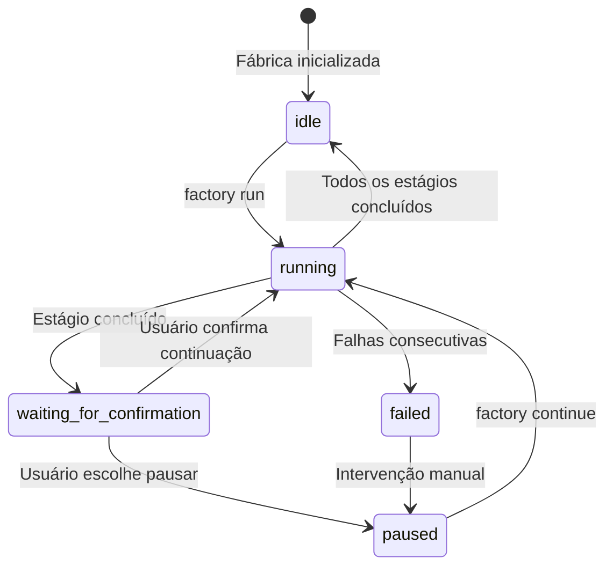

# Explicação do Agendador Sisyphus: Coordenação de Pipeline e Gerenciamento de Estado

## O Que Você Vai Aprender

- Entender como o agendador coordena a execução de pipelines de 7 estágios
- Compreender o funcionamento de máquinas de estado e regras de transição de estado
- Dominar o mecanismo de verificação de permissões da matriz de capacidades
- Aprender a lidar com cenários de falha (retry, rollback, intervenção manual)
- Usar o comando `factory continue` para otimizar o consumo de tokens

## O Seu Desafio Atual

Você já executou alguns pipelines, mas pode ter dúvidas sobre:

- O que exatamente o Sisyphus faz? Como ele se diferencia de outros Agentes?
- Por que os Agentes só podem ler/gravar em certos diretórios? O que acontece ao ultrapassar os limites?
- Como o agendador lida com falhas? Por que às vezes há retry automático e outras vezes é necessária intervenção manual?
- Por que o comando `factory continue` economiza tokens? Qual é o mecanismo por trás disso?

Se você está curioso sobre essas questões, este capítulo vai ajudá-lo a entender completamente.

## Quando Usar

Quando você precisar:

- **Depurar problemas de pipeline**: Entender o que o agendador fez em um determinado estágio e por que falhou
- **Otimizar o consumo de tokens**: Usar `factory continue` para iniciar uma nova sessão em cada estágio
- **Estender o pipeline**: Adicionar novos Agentes ou modificar lógica existente
- **Lidar com cenários de falha**: Entender por que um estágio falhou e como se recuperar
- **Verificar problemas de permissão**: Confirmar por que um Agente não consegue acessar certos arquivos

## Ideia Central

O agendador Sisyphus é o "comandante" de todo o AI App Factory.

**Lembre-se desta analogia**:

- Outros Agentes (bootstrap, prd, ui, tech, code, validation, preview) são como trabalhadores executando tarefas
- O Sisyphus é o supervisor responsável por coordenar os trabalhadores, verificar a qualidade do trabalho e lidar com exceções

**O que torna o Sisyphus único**:

| Recurso | Sisyphus | Outros Agentes |
| --- | --- | --- |
| **Responsabilidade** | Coordenação, verificação, gerenciamento de estado | Geração de artefatos específicos |
| **Saída** | Atualiza state.json | Gera PRD, código, documentação, etc. |
| **Permissões** | Ler/gravar state.json | Ler/gravar subdiretórios específicos de artifacts/ |
| **Conteúdo Gerado** | Não gera conteúdo de negócios | Gera artefatos de negócios específicos |

**Princípios Chave**:

1. **Ordem estrita**: Deve seguir a definição em pipeline.yaml, não pode pular ou executar em paralelo
2. **Execução de estágio único**: Apenas um Agente pode estar ativo por vez
3. **Separação de responsabilidades**: O Sisyphus não modifica artefatos de negócios, apenas coordena e verifica
4. **Portaria de qualidade**: Cada estágio deve ser verificado para garantir que os artefatos atendam aos exit_criteria

## Modelo de Máquina de Estado

O Sisyphus executa todo o fluxo como uma máquina de estado. Compreender a máquina de estado é a chave para dominar o agendador.

### 5 Estados



### Explicação dos Estados

| Estado | Descrição | Condição de Gatilho |
| --- | --- | --- |
| **idle** | Aguardando inicialização | Inicialização do projeto concluída ou pipeline totalmente concluído |
| **running** | Executando um Stage | Após factory run ou factory continue |
| **waiting_for_confirmation** | Aguardando confirmação manual | Após conclusão do Stage atual, aguardando usuário escolher próxima ação |
| **paused** | Pausado manualmente | Usuário escolhe pausar ou após falhas consecutivas |
| **failed** | Falha não tratada detectada | Agente falha duas vezes consecutivas ou gravação não autorizada |

::: info Arquivo de Estado
Todos os estados são salvos no arquivo `.factory/state.json`, e o Sisyphus tem permissão exclusiva de atualização.
:::

### Exemplos de Transição de Estado

**Cenário 1: Execução Normal**

```
idle → running (factory run)
   ↓
waiting_for_confirmation (bootstrap concluído)
   ↓
running (usuário escolhe continuar)
   ↓
waiting_for_confirmation (prd concluído)
   ↓
... (repetir até todos os estágios serem concluídos)
   ↓
idle
```

**Cenário 2: Recuperação de Falha**

```
running → failed (estágio code falha duas vezes consecutivas)
   ↓
paused (intervenção manual para corrigir código)
   ↓
running (factory continue retry code)
   ↓
waiting_for_confirmation
```

## Matriz de Capacidades

### Por que precisamos de controle de permissões?

Imagine:

- Se o Agente PRD modificasse arquivos gerados pelo Agente UI, que problemas isso causaria?
- Se o Agente Tech lesse código gerado pelo Agente Code, quais seriam as consequências?

**Resposta**: Responsabilidades confusas, artefatos não rastreáveis, qualidade não garantida.

A matriz de capacidades garante a separação de responsabilidades restringindo as permissões de leitura/escrita de cada Agente.

### Matriz de Permissões

| Agente | Diretórios Legíveis | Diretórios Graváveis | Descrição |
| --- | --- | --- | --- |
| **bootstrap** | Nenhum | `input/` | Apenas cria ou modifica `idea.md` no diretório `input/` |
| **prd** | `input/` | `artifacts/prd/` | Lê arquivo de ideia, gera PRD |
| **ui** | `artifacts/prd/` | `artifacts/ui/` | Lê PRD, gera Schema UI e preview |
| **tech** | `artifacts/prd/` | `artifacts/tech/`, `artifacts/backend/prisma/` | Lê PRD, gera design técnico e modelo de dados |
| **code** | `artifacts/ui/`, `artifacts/tech/`, `artifacts/backend/prisma/` | `artifacts/backend/`, `artifacts/client/` | Gera código com base no UI e design técnico |
| **validation** | `artifacts/backend/`, `artifacts/client/` | `artifacts/validation/` | Valida qualidade do código, gera relatório de validação |
| **preview** | `artifacts/backend/`, `artifacts/client/` | `artifacts/preview/` | Lê código gerado, cria instruções de demonstração |

### Fluxo de Verificação de Permissões

**Antes da execução**:

1. Sisyphus lê capability.matrix.md
2. Informa ao Agente os diretórios permitidos para leitura e escrita
3. O Agente deve operar dentro dos limites de permissão

**Após a execução**:

1. Sisyphus verifica arquivos recém-criados ou modificados
2. Verifica se estão dentro do escopo de diretórios autorizados
3. Se detectar ultrapassagem de limites, lida imediatamente

### Mecanismo de Tratamento de Ultrapassagem de Limites

Se o Agente gravar em diretório não autorizado:

1. **Isolar artefatos**: Move arquivos não autorizados para `artifacts/_untrusted/<stage-id>/`
2. **Registrar falha**: Marca o evento como falha
3. **Pausar pipeline**: Aguarda intervenção manual
4. **Fornecer sugestão de correção**: Informa ao usuário como lidar com arquivos não confiáveis

**Exemplo**:

```
⚠️  Unauthorized writes detected for stage "prd":
   - artifacts/ui/ui.schema.yaml

Files moved to quarantine: artifacts/_untrusted/prd

Please review these files before proceeding.
```

## Mecanismo de Checkpoint

Após cada estágio, o Sisyphus pausa e aguarda confirmação manual. Este é o mecanismo de checkpoint.

### Valor dos Checkpoints

- **Controle de qualidade**: Verificação manual dos artefatos de cada estágio
- **Controle flexível**: Pode pausar, retry, pular a qualquer momento
- **Fácil depuração**: Problemas podem ser detectados precocemente, evitando acúmulo em estágios posteriores

### Modelo de Saída de Checkpoint

Após cada estágio, o Sisyphus apresenta opções no seguinte formato:

```
✓ prd concluído!

Artefatos gerados:
- artifacts/prd/prd.md

┌─────────────────────────────────────────────────────────────┐
│  📋 Escolha a próxima ação                                   │
│  Digite o número da opção (1-5) e pressione Enter para confirmar│
└─────────────────────────────────────────────────────────────┘

┌──────┬──────────────────────────────────────────────────────┐
│ Opção │ Descrição                                            │
├──────┼──────────────────────────────────────────────────────┤
│  1   │ Continuar para o próximo estágio (mesma sessão)       │
│      │ Vou executar o estágio ui                              │
├──────┼──────────────────────────────────────────────────────┤
│  2   │ Continuar em nova sessão ⭐ Opção recomendada, economiza tokens │
│      │ Execute em nova janela de terminal: factory continue   │
│      │ (será aberto automaticamente uma nova janela do Claude Code e o pipeline continuará)│
├──────┼──────────────────────────────────────────────────────┤
│  3   │ Repetir o estágio atual                               │
│      │ Executar novamente o estágio prd                      │
├──────┼──────────────────────────────────────────────────────┤
│  4   │ Modificar artefatos e executar novamente              │
│      │ Modificar input/idea.md e executar novamente           │
├──────┼──────────────────────────────────────────────────────┤
│  5   │ Pausar pipeline                                       │
│      │ Salvar progresso atual, continuar mais tarde          │
└──────┴──────────────────────────────────────────────────────┘

💡 Dica: Digite um número entre 1 e 5, depois pressione Enter para confirmar sua escolha
```

::: tip Prática Recomendada
**A opção 2 (Continuar em nova sessão) é a melhor prática**, veja a próxima seção "Otimização de Contexto".
:::

## Estratégia de Tratamento de Falhas

Quando um estágio falha, o Sisyphus lida de acordo com estratégias predefinidas.

### Definição de Falha

**Casos que o Sisyphus considera falha**:

- Arquivo de saída ausente (arquivo solicitado não existe)
- Conteúdo de saída não atende aos exit_criteria (por exemplo, PRD sem histórias de usuário)
- Agente grava em local não autorizado
- Erros consecutivos na execução do Agente (erros de script, incapacidade de ler entrada)

### Fluxo de Tratamento de Falhas

```mermaid
flowchart TD
    A[Estágio falhou] --> B{É primeira falha?}
    B -->|Sim| C[Retry automático]
    B -->|Não| D[Pausar pipeline]
    C --> E{Retry bem-sucedido?}
    E -->|Sim| F[Avançar para próximo estágio]
    E -->|Não| D
    D --> Mover artefatos falhos para _failed/
    G --> H[Aguardar intervenção manual]
    H --> I[Usuário corrige e continua]
    I --> F
```

### Mecanismo de Retry Automático

- **Regra padrão**: Cada estágio permite um retry automático
- **Estratégia de retry**: Corrigir problemas com base nos artefatos existentes
- **Arquivamento de falha**: Após falha no retry, artefatos são movidos para `artifacts/_failed/<stage-id>/attempt-2/`

### Cenários de Intervenção Manual

**Casos que exigem intervenção manual**:

1. **Duas falhas consecutivas**: Falha após retry automático
2. **Gravação não autorizada**: Agente gravou em diretório não autorizado
3. **Erro de script**: Exceção lançada durante execução do Agente

**Fluxo de intervenção manual**:

1. Sisyphus pausa o pipeline
2. Exibe causa da falha e mensagem de erro
3. Fornece sugestões de correção:
   - Modificar arquivos de entrada
   - Ajustar definições do Agente
   - Atualizar arquivos de Skill
4. Após correção do usuário, executa `factory continue` para continuar

## Otimização de Contexto (Economizando Tokens)

### Descrição do Problema

Se você executar 7 estágios consecutivamente na mesma sessão, enfrentará os seguintes problemas:

- **Acúmulo de contexto**: A IA precisa lembrar todo o histórico de conversas
- **Desperdício de tokens**: Leitura repetida de artefatos históricos
- **Aumento de custos**: Sessões longas consomem mais tokens

### Solução: Execução em Múltiplas Sessões

**Ideia central**: Cada estágio é executado em uma nova sessão.

```
Sessão 1: bootstrap
  ├─ Gera input/idea.md
  ├─ Atualiza state.json
  └─ Encerra sessão

Sessão 2: prd
  ├─ Lê state.json (apenas carrega estado atual)
  ├─ Lê input/idea.md (apenas lê arquivo de entrada)
  ├─ Gera artifacts/prd/prd.md
  ├─ Atualiza state.json
  └─ Encerra sessão

Sessão 3: ui
  ├─ Lê state.json
  ├─ Lê artifacts/prd/prd.md
  ├─ Gera artifacts/ui/ui.schema.yaml
  ├─ Atualiza state.json
  └─ Encerra sessão
```

### Como Usar

**Passo 1**: Após concluir um estágio na sessão atual, escolha "Continuar em nova sessão"

```
┌──────┬──────────────────────────────────────────────────────┐
│ Opção │ Descrição                                            │
├──────┼──────────────────────────────────────────────────────┤
│  2   │ Continuar em nova sessão ⭐ Opção recomendada, economiza tokens │
│      │ Execute em nova janela de terminal: factory continue   │
│      │ (será aberto automaticamente uma nova janela do Claude Code e o pipeline continuará)│
└──────┴──────────────────────────────────────────────────────┘
```

**Passo 2**: Abra nova janela de terminal, execute:

```bash
factory continue
```

Este comando automaticamente:
1. Lê `.factory/state.json` para obter progresso atual
2. Abre nova janela do Claude Code
3. Continua a partir do próximo estágio pendente

### Benefícios do Isolamento de Contexto

| Benefício | Descrição |
| --- | --- |
| **Economiza tokens** | Não precisa carregar histórico de conversas e artefatos |
| **Aumenta estabilidade** | Evita explosão de contexto fazendo a IA se desviar do alvo |
| **Fácil depuração** | Cada estágio independente facilita localização de problemas |
| **Recuperação de interrupção** | Pode interromper e retomar em qualquer checkpoint |

## Validação de Uso Obrigatório de Habilidades

Alguns estágios exigem o uso de habilidades específicas para garantir a qualidade da saída. O Sisyphus valida o uso dessas habilidades.

### Estágio bootstrap

**Requisito obrigatório**: Deve usar habilidade `superpowers:brainstorm`

**Método de validação**:

1. Verifica se a mensagem de saída do Agente menciona explicitamente o uso desta habilidade
2. Se não mencionar, rejeita o artefato
3. Solicita nova execução, enfatizando que deve usar esta habilidade

**Mensagem de falha**:

```
❌ Habilidade superpowers:brainstorm não usada detectada
Por favor use esta habilidade para explorar profundamente a ideia do usuário antes de gerar idea.md
```

### Estágio ui

**Requisito obrigatório**: Deve usar habilidade `ui-ux-pro-max`

**Método de validação**:

1. Verifica se a mensagem de saída do Agente menciona explicitamente o uso desta habilidade
2. Verifica configuração do sistema de design em `ui.schema.yaml`
3. Se a configuração do sistema de design não for profissionalmente recomendada, rejeita o artefato

**Mensagem de falha**:

```
❌ Habilidade ui-ux-pro-max não usada detectada
Por favor use esta habilidade para gerar sistema de design profissional e protótipos UI
```

### Tratamento de Falhas Consecutivas

Se um estágio falhar consecutivamente duas vezes devido a falha na validação de habilidade:

1. Pausa o pipeline
2. Solicita intervenção manual
3. Verifica definições do Agente e configuração de Skill

## Exemplo Prático: Depurando um Estágio com Falha

Suponha que o estágio code falhou, vamos ver como depurar.

### Passo 1: Verificar state.json

```bash
cat .factory/state.json
```

**Exemplo de saída**:

```json
{
  "version": "1.0",
  "status": "failed",
  "currentStage": "code",
  "completedStages": ["bootstrap", "prd", "ui", "tech"],
  "failedStages": ["code"],
  "stageHistory": [
    {
      "stageId": "code",
      "status": "failed",
      "startTime": "2026-01-29T10:00:00Z",
      "endTime": "2026-01-29T10:15:00Z",
      "attempts": 2,
      "error": "Exit criteria not met: Missing package.json"
    }
  ],
  "lastCheckpoint": "tech",
  "createdAt": "2026-01-29T09:00:00Z",
  "updatedAt": "2026-01-29T10:15:00Z"
}
```

**Informações chave**:

- `status: failed` - Pipeline falhou
- `currentStage: code` - Estágio atual com falha
- `completedStages` - 4 estágios concluídos
- `error: "Exit criteria not met: Missing package.json"` - Causa da falha

### Passo 2: Verificar Artefatos com Falha

```bash
ls -la artifacts/_failed/code/attempt-2/
```

**Exemplo de saída**:

```
drwxr-xr-x  5 user  staff  160 Jan 29 10:15 .
drwxr-xr-x  3 user  staff   96 Jan 29 10:15 ..
-rw-r--r--  1 user  staff 2.1K Jan 29 10:15 server.ts
-rw-r--r--  1 user  staff 1.5K Jan 29 10:15 client.ts
```

**Problema identificado**: Falta arquivo `package.json`!

### Passo 3: Verificar exit_criteria

```bash
cat .factory/pipeline.yaml | grep -A 10 'code:'
```

**Exemplo de saída**:

```yaml
code:
  agent: agents/code.agent.md
  inputs:
    - artifacts/ui/ui.schema.yaml
    - artifacts/tech/tech.md
    - artifacts/backend/prisma/schema.prisma
  outputs:
    - artifacts/backend/package.json
    - artifacts/backend/server.ts
    - artifacts/client/package.json
    - artifacts/client/app.ts
  exit_criteria:
    - package.json existe
    - Contém dependências corretas
    - Código passa verificação de tipos
```

**Confirmação do problema**: O Agente Code não gerou `package.json`, violando os exit_criteria.

### Passo 4: Corrigir o Problema

**Solução 1**: Modificar definição do Agente Code

```bash
nano .factory/agents/code.agent.md
```

Na definição do Agente, exigir explicitamente a geração de `package.json`:

```markdown
## Arquivos que Devem Ser Gerados

Você deve gerar os seguintes arquivos:
- artifacts/backend/package.json (contém dependências corretas)
- artifacts/backend/server.ts
- artifacts/client/package.json
- artifacts/client/app.ts
```

**Solução 2**: Modificar arquivos de entrada

Se o problema está no estágio Tech, pode modificar o design técnico:

```bash
nano artifacts/tech/tech.md
```

Suplementar instruções claras sobre dependências.

### Passo 5: Continuar o Pipeline

Após corrigir o problema, execute novamente:

```bash
factory continue
```

O Sisyphus vai:
1. Ler state.json (estado é failed)
2. Continuar a partir de lastCheckpoint (tech)
3. Reexecutar estágio code
4. Verificar se os artefatos atendem aos exit_criteria

## Resumo

O agendador Sisyphus é o "comandante" do AI App Factory, responsável por:

- **Coordenação de pipeline**: Executar 7 estágios em sequência
- **Gerenciamento de estado**: Manter state.json, acompanhar progresso
- **Verificação de permissões**: Garantir que Agentes só leiam/gravem em diretórios autorizados
- **Tratamento de falhas**: Retry automático, arquivar artefatos com falha, aguardar intervenção manual
- **Portaria de qualidade**: Verificar se artefatos de cada estágio atendem aos exit_criteria

**Princípios-chave**:

1. Executar estritamente em sequência, não pular ou paralelizar
2. Apenas um Agente ativo por vez
3. Todos os artefatos devem ser gravados em diretórios artifacts/
4. Cada estágio requer confirmação manual após conclusão
5. Recomendado usar `factory continue` para economizar tokens

**Lembre-se deste fluxograma**:

```
factory run → ler pipeline.yaml → executar estágio → verificar artefatos → confirmação de checkpoint
     ↑                                                                      │
     └──────────────────── factory continue (nova sessão)←────────────────────┘
```

## Próximo Capítulo

> No próximo capítulo vamos aprender **[Otimização de Contexto: Execução em Múltiplas Sessões](../context-optimization/)**.
>
> Você aprenderá:
> - Como usar o comando `factory continue`
> - Por que a execução em múltiplas sessões economiza tokens
> - Como testar o agendador em ambiente de desenvolvimento
> - Técnicas comuns de depuração e análise de logs

## Apêndice: Referência de Código Fonte

<details>
<summary><strong>Clique para expandir e ver localização do código fonte</strong></summary>

> Atualização: 2026-01-29

| Funcionalidade | Caminho do Arquivo | Linhas |
| --- | --- | --- |
| Definição central do agendador | [`source/hyz1992/agent-app-factory/agents/orchestrator.checkpoint.md`](https://github.com/hyz1992/agent-app-factory/blob/main/agents/orchestrator.checkpoint.md) | Todo o arquivo |
| Guia de implementação do agendador | [`source/hyz1992/agent-app-factory/agents/orchestrator-implementation.md`](https://github.com/hyz1992/agent-app-factory/blob/main/agents/orchestrator-implementation.md) | Todo o arquivo |
| Matriz de capacidades | [`source/hyz1992/agent-app-factory/policies/capability.matrix.md`](https://github.com/hyz1992/agent-app-factory/blob/main/policies/capability.matrix.md) | Todo o arquivo |
| Estratégia de tratamento de falhas | [`source/hyz1992/agent-app-factory/policies/failure.policy.md`](https://github.com/hyz1992/agent-app-factory/blob/main/policies/failure.policy.md) | Todo o arquivo |
| Definição do pipeline | [`source/hyz1992/agent-app-factory/pipeline.yaml`](https://github.com/hyz1992/agent-app-factory/blob/main/pipeline.yaml) | Todo o arquivo |

**Funções chave**:

- `executeStage()` - Executa estágio individual (linhas 117-189)
- `waitForCheckpointConfirmation()` - Aguarda confirmação de checkpoint (linhas 195-236)
- `handleStageFailure()` - Trata falha de estágio (linhas 242-289)
- `checkUnauthorizedWrites()` - Verifica gravações não autorizadas (linhas 295-315)
- `getPermissions()` - Obtém matriz de permissões (linhas 429-467)

**Constantes chave**:

- Enumeração de estados: `idle`, `running`, `waiting_for_confirmation`, `paused`, `failed`
- Número máximo de retries: 2 vezes (linha 269)
- Prioridade de resolução de caminho: `.factory/` → diretório raiz (linhas 31-33)

</details>
