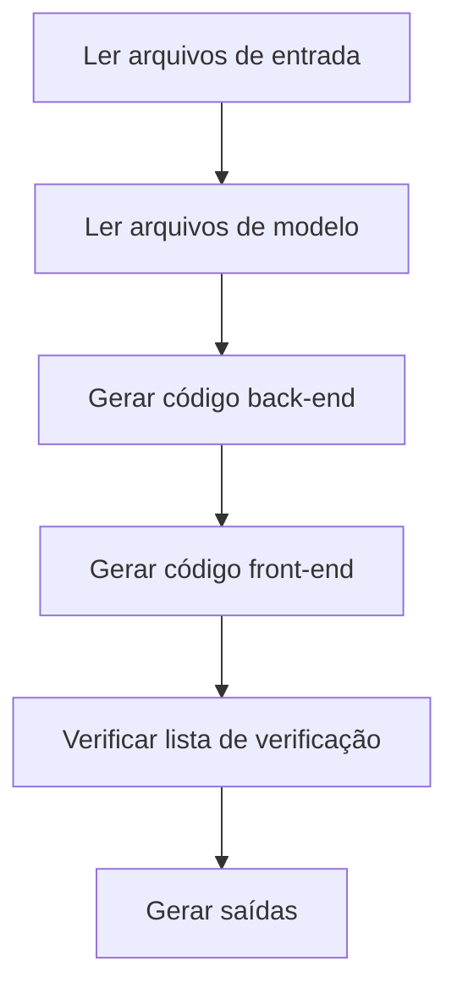

# Etapa 5: Code - Gerar Código Executável

## O Que Você Poderá Fazer Após Concluir

- **Gerar código full-stack com um clique**: Gerar automaticamente aplicativos front-end e back-end executáveis a partir do UI Schema e design Tech
- **Entender o fluxo de geração de código**: Compreender como o Code Agent converte documentos de design em código pronto para produção
- **Validar a qualidade do código**: Aprender a verificar a integridade, cobertura de testes e padrões de segurança do código gerado
- **Depurar problemas comuns**: Resolver problemas de instalação de dependências, verificação de tipos e conexões de API

## Seu Problema Atual

Você já estruturou a ideia do produto, gerou o PRD, criou o design de UI e projetou a arquitetura técnica. Agora, o maior desafio é:

- **Como transformar o design em código**: O UI Schema e design Tech estão nos documentos, mas como implementá-los?
- **Desenvolvimento full-stack é muito complexo**: Back-end precisa de Express + Prisma, front-end precisa de React Native, por onde começar?
- **Difícil garantir a qualidade do código**: Como assegurar que o código gerado tenha testes, documentação e siga padrões de segurança?
- **Tempo insuficiente**: Criar um MVP leva dias, existe uma maneira mais rápida?

A etapa Code foi criada para resolver esses problemas — ela gera automaticamente código full-stack pronto para produção com base nos designs das etapas anteriores.

## Quando Usar Esta Abordagem

Quando você precisar:

- **Validar ideias rapidamente**: Validar se a ideia do produto é viável usando código, em vez de investir diretamente no desenvolvimento
- **Criar esqueleto da aplicação**: Fornecer uma base executável para o desenvolvimento subsequente, em vez de começar do zero
- **Unificar a stack tecnológica**: Garantir que o código front-end e back-end sigam a mesma arquitetura e padrões
- **Economizar tempo de desenvolvimento**: Do design ao código, completar a estrutura do MVP em minutos

## Ideia Central

O Code Agent é um **engenheiro full-stack**; sua tarefa é converter documentos de design das etapas anteriores em código executável. Suas principais características:

### Entradas e Saídas

| Tipo | Conteúdo |
|------|----------|
| **Entrada** | UI Schema (estrutura de interface), design Tech (solução técnica), Prisma Schema (modelo de dados) |
| **Saída** | `artifacts/backend/` (código back-end), `artifacts/client/` (código front-end) |

### Stack Tecnológica

| Parte | Stack Tecnológica |
|------|-------------------|
| **Back-end** | Express + Prisma + TypeScript |
| **Front-end** | React Native Web + Expo + TypeScript |
| **Banco de Dados** | SQLite (desenvolvimento) / PostgreSQL (produção) |

### Restrições de Execução

::: warning Escopo Estrito
O Code Agent **implementa apenas** funcionalidades confirmadas no PRD e UI Schema, **não adiciona**:
- Sistemas de autenticação e autorização
- Gerenciamento complexo de estado (como Redux)
- Funcionalidades não essenciais
:::

## Siga-me

### Passo 1: Entrar na Etapa Code

Supondo que você já completou a etapa Tech, agora é hora de começar a gerar código.

```bash
# Se estiver no pipeline, entre diretamente na próxima etapa
factory run code

# Ou recomece de uma etapa específica
factory run code
```

**O que você deve ver**: O CLI exibirá informações da etapa Code, incluindo arquivos de entrada e saídas esperadas.

### Passo 2: Assistente de IA Executa o Code Agent

O assistente de IA carregará `agents/code.agent.md` e `skills/code/skill.md`, e começará a execução.

Fluxo de execução do Code Agent:



**O que o assistente de IA fará**:

1. **Ler arquivos de modelo** (`skills/code/references/backend-template.md` e `frontend-template.md`)
   - Entender a estrutura do projeto e organização do código
   - Aprender como organizar diretórios e arquivos de configuração

2. **Analisar arquivos de entrada**
   - Entender estrutura de página e componentes de `ui.schema.yaml`
   - Entender arquitetura técnica e design de API de `tech.md`
   - Entender modelo de dados de `schema.prisma`

3. **Gerar código back-end**
   - Criar estrutura de projeto Express + Prisma
   - Gerar rotas de API e controladores
   - Implementar validação de dados e tratamento de erros
   - Adicionar testes e documentação

4. **Gerar código front-end**
   - Criar estrutura de projeto React Native + Expo
   - Gerar componentes de página e componentes de UI
   - Implementar gerenciamento de estado de dados e chamadas de API
   - Adicionar testes e configuração de navegação

5. **Verificar lista de verificação**
   - Comparar com a lista de verificação no Code Skill
   - Garantir que todos os itens obrigatórios foram concluídos

6. **Gerar saídas**
   - Gerar diretórios `artifacts/backend/` e `artifacts/client/`

### Passo 3: Validar o Código Gerado

Após concluir, o Code Agent gerará a estrutura completa de diretórios de código.

**Estrutura de diretórios do back-end**:

```
backend/
├── package.json          # Dependências e scripts
├── tsconfig.json         # Configuração TypeScript
├── .env.example          # Modelo de variáveis de ambiente
├── .gitignore            # Arquivos ignorados pelo Git
├── README.md             # Descrição do projeto
├── GETTING_STARTED.md    # Guia de início rápido
├── prisma/
│   ├── schema.prisma     # Modelo de dados (copiado da etapa Tech)
│   └── seed.ts           # Dados de seed
└── src/
    ├── index.ts          # Ponto de entrada da aplicação
    ├── app.ts            # Configuração do aplicativo Express
    ├── config/           # Configuração de variáveis de ambiente
    ├── lib/              # Cliente Prisma
    ├── middleware/       # Tratamento de erros, logs
    ├── routes/           # Rotas de API
    ├── controllers/      # Controladores
    ├── services/         # Lógica de negócios
    ├── validators/       # Validação de entrada (Zod)
    └── __tests__/        # Arquivos de teste
```

**Estrutura de diretórios do front-end**:

```
client/
├── package.json          # Dependências e scripts
├── tsconfig.json         # Configuração TypeScript
├── app.json              # Configuração Expo
├── babel.config.js       # Configuração Babel
├── .env.example          # Modelo de variáveis de ambiente
├── .gitignore            # Arquivos ignorados pelo Git
├── README.md             # Descrição do projeto
├── GETTING_STARTED.md    # Guia de início rápido
├── App.tsx               # Ponto de entrada da aplicação
└── src/
    ├── config/           # Configuração de variáveis de ambiente
    ├── api/              # Cliente de API
    ├── components/       # Componentes de UI
    ├── hooks/            # Hooks personalizados
    ├── navigation/       # Configuração de navegação
    ├── screens/          # Componentes de tela
    ├── styles/           # Tema e estilos
    └── types/            # Definições de tipos
```

**Ponto de verificação ✅**: Confirme se os seguintes arquivos existem:

| Arquivo | Back-end | Front-end |
|---------|----------|-----------|
| `package.json` | ✅ | ✅ |
| `tsconfig.json` | ✅ | ✅ |
| `.env.example` | ✅ | ✅ |
| `README.md` | ✅ | ✅ |
| `GETTING_STARTED.md` | ✅ | ✅ |
| Arquivos de teste | ✅ | ✅ |
| Prisma Schema | ✅ | - |

### Passo 4: Iniciar Serviço Back-end

Siga as instruções em `backend/GETTING_STARTED.md` para iniciar o serviço.

```bash
# Entrar no diretório back-end
cd artifacts/backend

# Instalar dependências
npm install

# Configurar variáveis de ambiente
cp .env.example .env

# Inicializar banco de dados
npx prisma generate
npx prisma migrate dev
npm run db:seed

# Iniciar servidor de desenvolvimento
npm run dev
```

**O que você deve ver**:

```
Server running on http://localhost:3000
Environment: development
Database connected
```

**Ponto de verificação ✅**: Acesse o endpoint de verificação de saúde para confirmar que o serviço está funcionando.

```bash
curl http://localhost:3000/health
```

Deve retornar:

```json
{
  "status": "ok",
  "timestamp": "2024-01-29T12:00:00.000Z"
}
```

### Passo 5: Iniciar Aplicativo Front-end

Siga as instruções em `client/GETTING_STARTED.md` para iniciar o aplicativo.

```bash
# Abra um novo terminal e entre no diretório front-end
cd artifacts/client

# Instalar dependências
npm install

# Configurar variáveis de ambiente
cp .env.example .env

# Iniciar servidor de desenvolvimento
npm start
```

**O que você deve ver**: O Metro Bundler iniciará e exibirá opções de execução.

```
› Metro waiting on exp://192.168.x.x:19000
› Scan the QR code above with Expo Go (Android) or the Camera app (iOS)
› Press a │ open Android
› Press i │ open iOS simulator
› Press w │ open web

Logs for your project will appear below.
```

Escolha a plataforma de execução:
- Pressione `w` - Abrir no navegador (mais conveniente para testes)

**Ponto de verificação ✅**: O aplicativo abre no navegador e exibe a interface front-end.

### Passo 6: Testar Integração Front-end e Back-end

1. **Acessar documentação da API**: http://localhost:3000/api-docs
   - Visualize a documentação Swagger UI
   - Confirme que todos os endpoints estão definidos

2. **Testar funcionalidades front-end**:
   - Criar novos dados
   - Editar dados
   - Excluir dados
   - Atualizar lista

3. **Verificar logs do console**:
   - Se há erros de chamadas de API no front-end
   - Se há logs de solicitações no back-end
   - Se há exceções não tratadas

### Passo 7: Confirmar Pontos de Verificação

Quando o assistente de IA confirmar que a etapa Code foi concluída, você verá:

```
✅ Etapa Code concluída

Arquivos gerados:
- Back-end: artifacts/backend/ (Express + Prisma + TypeScript)
- Front-end: artifacts/client/ (React Native + Expo + TypeScript)

Opções de pontos de verificação:
[1] Continuar - Ir para a etapa Validation
[2] Tentar novamente - Regenerar código
[3] Pausar - Salvar estado atual
```

Escolha **Continuar** para ir para a próxima etapa.

## Pontos de Verificação ✅

Após concluir a etapa Code, você deve:

- [ ] Código back-end pode ser iniciado normalmente (`npm run dev`)
- [ ] Aplicativo front-end pode abrir no navegador
- [ ] Endpoint de verificação de saúde retorna normal
- [ ] Documentação de API acessível (`/api-docs`)
- [ ] Front-end pode chamar APIs do back-end
- [ ] Front-end trata estados de Loading e Error
- [ ] Arquivos de teste existem e podem ser executados (`npm test`)

## Cuidados com Erros Comuns

### Problema 1: Falha na instalação de dependências

**Sintoma**: `npm install` reporta erro

**Solução**:

```bash
# Limpar cache e tentar novamente
rm -rf node_modules package-lock.json
npm cache clean --force
npm install
```

### Problema 2: Falha na migração do Prisma

**Sintoma**: `npx prisma migrate dev` reporta erro

**Solução**:

```bash
# Redefinir banco de dados
npx prisma migrate reset

# Ou excluir manualmente o arquivo de banco de dados
rm prisma/dev.db
npx prisma migrate dev
```

### Problema 3: Front-end não consegue conectar ao back-end

**Sintoma**: Front-end reporta `Network Error` ou `ECONNREFUSED`

**Lista de verificação**:

1. Confirme que o back-end foi iniciado: `curl http://localhost:3000/health`
2. Verifique a configuração `.env` do front-end: `EXPO_PUBLIC_API_URL=http://localhost:3000/api`
3. Se estiver usando um dispositivo real para testar, altere para IP da rede local (como `http://192.168.1.100:3000/api`)

### Problema 4: Falha nos testes

**Sintoma**: `npm test` reporta erro

**Solução**:

- Confirme que os arquivos de teste existem: `src/__tests__/`
- Verifique se as dependências de teste foram instaladas: `npm install --save-dev vitest @testing-library/react-native`
- Visualize as mensagens de erro e corrija problemas no código

## Requisitos Especiais do Code Agent

O Code Agent possui algumas restrições e requisitos especiais que requerem atenção especial:

### 1. Deve Ler Arquivos de Modelo

Antes de gerar código, o Code Agent **deve ler completamente**:
- `skills/code/references/backend-template.md`
- `skills/code/references/frontend-template.md`

Esses dois arquivos de modelo demonstram a estrutura do projeto pronto para produção e exemplos de código.

### 2. Proibição de Adicionar Autenticação e Autorização

::: warning Restrição de Escopo
O Code Agent **está estritamente proibido** de adicionar:
- Funcionalidades de login/registro
- Autenticação por token
- Controle de permissões
- Gerenciamento complexo de estado (como Redux)
:::

Essas funcionalidades serão adicionadas em iterações subsequentes; a fase MVP foca apenas na lógica de negócios essencial.

### 3. Requisitos de Qualidade de Código

O código gerado deve atender:

| Requisito | Descrição |
|-----------|-----------|
| **TypeScript** | Modo estrito, sem tipo `any` |
| **Testes** | Verificação de saúde, endpoints CRUD, testes de validação de entrada |
| **Documentação de API** | Especificação Swagger/OpenAPI (`/api-docs`) |
| **Tratamento de Erros** | Middleware de tratamento de erros unificado |
| **Logs** | Logs estruturados (winston/pino) |
| **Segurança** | Validação Zod, helmet, lista branca CORS |
| **Documentação** | README e guia de início rápido |

## Lista de Verificação de Geração de Código

O Code Agent gerará código comparando com a seguinte lista de verificação.

### Itens Obrigatórios do Back-end

- [ ] Suporte a variáveis de ambiente (dotenv)
- [ ] Bloqueio de versão de dependências (Prisma 5.x)
- [ ] Definições de tipos (tratamento de campos JSON)
- [ ] Dependências principais: Express + Prisma + Zod + Helmet
- [ ] Endpoints de API: verificação de saúde + CRUD
- [ ] Formato de resposta unificado
- [ ] Validação de entrada (Schema Zod)
- [ ] Middleware de tratamento de erros
- [ ] Arquivos de teste (verificação de saúde + CRUD + validação)
- [ ] Documentação de API Swagger
- [ ] Dados de seed (`prisma/seed.ts`)

### Itens Obrigatórios do Front-end

- [ ] Dependências principais: React Native Web + Expo + React Navigation
- [ ] Armazenamento persistente (AsyncStorage)
- [ ] Configuração de navegação (React Navigation 6+)
- [ ] Área segura (SafeAreaView)
- [ ] Cliente de API (Axios + interceptores)
- [ ] Hooks personalizados (gerenciamento de dados)
- [ ] Componentes de UI básicos (Button, Input, Card, Loading)
- [ ] Componentes de tela (pelo menos tela principal e de detalhes)
- [ ] Tratamento de estados Loading e Error
- [ ] Atualização por puxar para baixo (RefreshControl)
- [ ] Arquivos de teste (renderização de tela + componentes + Hooks)

## Testes e Garantia de Qualidade

Mesmo na fase MVP, o Code Agent gerará código de teste básico.

### Exemplo de Teste Back-end

```typescript
// src/__tests__/items.test.ts
import { describe, it, expect } from 'vitest';
import request from 'supertest';
import app from '../app';

describe('Items API', () => {
  it('should return health check', async () => {
    const res = await request(app).get('/health');
    expect(res.status).toBe(200);
  });

  it('should create a new item', async () => {
    const res = await request(app)
      .post('/api/items')
      .send({ title: 'Test Item', amount: 100 });

    expect(res.status).toBe(201);
    expect(res.body.data).toHaveProperty('id');
  });

  it('should reject invalid item', async () => {
    const res = await request(app)
      .post('/api/items')
      .send({ title: '' }); // Campo obrigatório faltando

    expect(res.status).toBe(400);
  });
});
```

### Exemplo de Teste Front-end

```typescript
// src/screens/__tests__/HomeScreen.test.tsx
import React from 'react';
import { render, screen } from '@testing-library/react-native';
import HomeScreen from '../HomeScreen';

describe('HomeScreen', () => {
  it('should render without crashing', () => {
    render(<HomeScreen />);
    expect(screen.getByText(/home/i)).toBeTruthy();
  });

  it('should show loading state initially', () => {
    render(<HomeScreen />);
    expect(screen.getByTestId('loading-indicator')).toBeTruthy();
  });
});
```

## Guia de Início Rápido

Cada projeto gerado incluirá `GETTING_STARTED.md`, ajudando você a executar o projeto em 5 minutos.

### Início Rápido Back-end

```bash
# 1. Clone o projeto
cd artifacts/backend

# 2. Instale dependências
npm install

# 3. Configure variáveis de ambiente
cp .env.example .env

# 4. Inicialize o banco de dados
npx prisma generate
npx prisma migrate dev
npm run db:seed

# 5. Inicie o serviço
npm run dev
```

### Início Rápido Front-end

```bash
# 1. Clone o projeto
cd artifacts/client

# 2. Instale dependências
npm install

# 3. Configure variáveis de ambiente
cp .env.example .env

# 4. Inicie o aplicativo
npm start
```

**Nota**: Certifique-se de que o back-end foi iniciado, caso contrário o front-end não poderá conectar à API.

## Resumo da Lição

A etapa Code é um dos componentes centrais do pipeline, convertendo o design das etapas anteriores em código executável.

**Principais pontos**:

1. **Entradas e saídas**: O Code Agent gera código front-end e back-end com base em UI Schema, design Tech e Prisma Schema
2. **Stack tecnológica**: Back-end usa Express + Prisma, front-end usa React Native Web + Expo
3. **Controle de escopo**: Implementa apenas funcionalidades do PRD e UI Schema, não adiciona autenticação e autorização
4. **Garantia de qualidade**: Gera testes, documentação de API e guias de início rápido
5. **Padrões de validação**: Back-end inicializável, front-end renderizável, API chamável

## Próxima Lição

> Na próxima lição, aprenderemos a **[Etapa Validation](../stage-validation/)**.
>
> Você aprenderá:
> - Como validar a qualidade do código gerado
> - Instalação de dependências e verificação de tipos
> - Validação do Prisma Schema
> - Geração de relatório de validação

---

## Apêndice: Referência do Código Fonte

<details>
<summary><strong>Clique para expandir e ver localizações do código fonte</strong></summary>

> Atualizado em: 2026-01-29

| Funcionalidade | Caminho do Arquivo | Linha |
|---------------|-------------------|-------|
| Definição do Code Agent | [`agents/code.agent.md`](https://github.com/hyz1992/agent-app-factory/blob/main/agents/code.agent.md) | 1-82 |
| Code Skill | [`skills/code/skill.md`](https://github.com/hyz1992/agent-app-factory/blob/main/skills/code/skill.md) | 1-1488 |
| Modelo Back-end | [`skills/code/references/backend-template.md`](https://github.com/hyz1992/agent-app-factory/blob/main/skills/code/references/backend-template.md) | 1-670 |
| Modelo Front-end | [`skills/code/references/frontend-template.md`](https://github.com/hyz1992/agent-app-factory/blob/main/skills/code/references/frontend-template.md) | 1-1231 |
| Definição do pipeline | [`pipeline.yaml`](https://github.com/hyz1992/agent-app-factory/blob/main/pipeline.yaml) | 63-77 |

**Restrições chave**:
- Implementar apenas funcionalidades do PRD e UI Schema (`code.agent.md:25`)
- Proibido adicionar autenticação, autorização ou gerenciamento complexo de estado (`code.agent.md:28`)
- Deve ler completamente arquivos de modelo (`code/skill.md:1476`)
- Todas as operações de banco de dados através da camada Service (`backend-template.md:665`)
- Todas as entradas devem ser validadas via Zod (`backend-template.md:666`)

**Listas de verificação chave**:
- Itens obrigatórios do back-end: variáveis de ambiente, bloqueio de dependências, definições de tipos (`code.agent.md:37-47`)
- Itens obrigatórios do front-end: dependências principais, caminhos de importação, arquivos de configuração (`code.agent.md:50-64`)
- Prevenção de erros comuns (`code.agent.md:65-74`)

</details>
