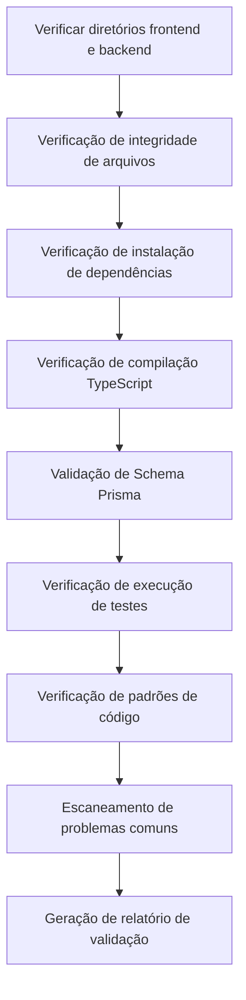

# Fase 6: Validation - Validação da Qualidade do Código

## O Que Você Vai Aprender

- **Validação Automática de Código**: Verifique a instalação de dependências, verificação de tipos e testes básicos do código frontend e backend com um clique
- **Interpretação de Relatórios de Validação**: Compreenda os relatórios detalhados e a classificação de problemas gerados pelo Validation Agent
- **Localização Rápida de Problemas**: Corrija erros de código com base nas localizações específicas e sugestões do relatório
- **Garantia de Qualidade de Código**: Verifique se o código gerado atende aos padrões de produção

## Seu Dilema Atual

Você completou a fase de Code, gerou o código frontend e backend, mas o mais preocupante é:

- **O código funciona?**: As dependências estão instaladas corretamente? A verificação de tipos passa?
- **O Prisma está correto?**: A sintaxe do schema está correta? O cliente pode ser gerado?
- **Os testes são confiáveis?**: Existem testes? Eles passam?
- **Há armadilhas?**: As variáveis de ambiente estão configuradas corretamente? Os caminhos de importação estão corretos?

Verificar manualmente cada um desses problemas leva muito tempo e é fácil deixar algo passar. A fase de Validation existe para resolver esses problemas — ela valida automaticamente a qualidade do código e gera relatórios detalhados.

## Quando Usar Esta Técnica

Quando você precisar:

- **Validar código rapidamente**: Confirmar que o código gerado atende aos padrões básicos de qualidade
- **Descobrir problemas potenciais**: Identificar problemas de dependências, tipos e testes antes do deploy
- **Garantir qualidade de código**: Assegurar que o código frontend e backend passe nas verificações básicas
- **Evitar falhas de deploy**: Descobrir problemas antecipadamente, reduzindo custos de retrabalho

## Conceito Central

O Validation Agent é um **inspetor de qualidade**, cuja tarefa é verificar se o código gerado pelo Code Agent atende aos padrões de qualidade. Suas características principais:

### Entradas e Saídas

| Tipo | Conteúdo |
|------|----------|
| **Entrada** | `artifacts/backend/` (código backend), `artifacts/client/` (código frontend) |
| **Saída** | `artifacts/validation/report.md` (relatório de validação) |

### Itens de Verificação

O Validation Agent executa 8 categorias de verificações:

| Item de Verificação | Descrição |
|---------------------|-----------|
| **Integridade de Arquivos** | Confirmar que todos os arquivos obrigatórios existem |
| **Instalação de Dependências** | Verificar se as dependências do `package.json` podem ser resolvidas normalmente |
| **Compilação TypeScript** | Verificar se o código passa na verificação de tipos |
| **Schema Prisma** | Validar se a sintaxe do modelo de dados está correta |
| **Execução de Testes** | Confirmar que os testes existem e passam |
| **Padrões de Código** | Verificar a configuração de scripts lint |
| **Padrões Críticos** | Escanear padrões críticos no código (tratamento de erros, health checks, etc.) |
| **Problemas Comuns** | Identificar padrões de erro conhecidos |

### Restrições de Execução

::: warning Modo Somente Leitura
O Validation Agent **só valida, não modifica**:
- Proibido modificar qualquer arquivo de código
- Proibido instalar dependências realmente (usando `--dry-run`)
- Proibido executar comandos com efeitos colaterais
:::

## Siga Comigo

### Passo 1: Entrar na Fase de Validation

Supondo que você tenha completado a fase de Code, agora é hora de começar a validar a qualidade do código.

```bash
# Se estiver no pipeline, entre diretamente na próxima fase
factory run validation

# Ou reinicie a partir de uma fase específica
factory run validation
```

**Você deve ver**: A CLI exibirá informações da fase de Validation, incluindo arquivos de entrada e saída esperada.

### Passo 2: O Assistente de IA Executa o Validation Agent

O assistente de IA carregará `agents/validation.agent.md` e começará a executar.

Fluxo de execução do Validation Agent:



**O que o assistente de IA fará**:

1. **Verificar diretório backend**
   - Confirmar que `artifacts/backend/` existe
   - Verificar arquivos obrigatórios: `package.json`, `tsconfig.json`, `.env.example`, `prisma/schema.prisma`

2. **Verificar diretório frontend**
   - Confirmar que `artifacts/client/` existe
   - Verificar arquivos obrigatórios: `package.json`, `tsconfig.json`, `app.json`, `App.tsx`

3. **Verificação de instalação de dependências**
   - Backend: `cd artifacts/backend && npm install --dry-run`
   - Frontend: `cd artifacts/client && npm install --dry-run`
   - Validar se as dependências podem ser resolvidas normalmente

4. **Verificação de compilação TypeScript**
   - Backend: `cd artifacts/backend && npx tsc --noEmit`
   - Frontend: `cd artifacts/client && npx tsc --noEmit`
   - Verificar se o código passa na verificação de tipos

5. **Validação de Schema Prisma**
   - `cd artifacts/backend && npx prisma validate`
   - Validar se a sintaxe do modelo de dados está correta

6. **Verificação de execução de testes**
   - Backend: `cd artifacts/backend && npm test`
   - Frontend: `cd artifacts/client && npm test`
   - Confirmar que os testes existem e passam

7. **Verificação de padrões de código**
   - Escanear padrões críticos: tratamento de erros, health checks, SafeAreaView, etc.
   - Verificar configuração de dependências: dotenv, React Native Web, etc.

8. **Escaneamento de problemas comuns**
   - SQLite usando definição `type`
   - Valores de variáveis de ambiente entre aspas
   - Caminhos de importação incorretos
   - Importações necessárias faltando

9. **Geração de relatório de validação**
   - Resumir todos os resultados de verificação
   - Listar problemas encontrados
   - Fornecer sugestões de correção
   - Salvar em `artifacts/validation/report.md`

### Passo 3: Visualizar o Relatório de Validação

Após a conclusão do Validation Agent, um relatório de validação detalhado será gerado.

Abra `artifacts/validation/report.md`:

```bash
cat artifacts/validation/report.md
```

**Você deve ver**:

```markdown
# Relatório de Validação de Código

**Hora de Geração**: 2026-01-29 12:00:00
**Resultado da Validação**: ✅ Aprovado

## Resumo

- Validação Backend: ✅
- Validação Frontend: ✅
- Avaliação Geral: Qualidade do código atende aos padrões MVP, pode prosseguir para a fase Preview

---

## Detalhes da Validação Backend

### Integridade de Arquivos
| Arquivo | Status |
|---------|--------|
| package.json | ✅ |
| tsconfig.json | ✅ |
| .env.example | ✅ |
| prisma/schema.prisma | ✅ |
| src/index.ts | ✅ |
| src/app.ts | ✅ |

### Instalação de Dependências
- Status: ✅
- Detalhes: Todas as dependências podem ser resolvidas normalmente

### Compilação TypeScript
- Status: ✅
- Quantidade de Erros: 0

### Validação Prisma
- Status: ✅
- Detalhes: Sintaxe do schema Prisma está correta

### Execução de Testes
- Status: ✅
- Quantidade de Testes: 12
- Quantidade Aprovada: 12
- Quantidade Reprovada: 0

### Verificação de Padrões de Código
| Item de Verificação | Status |
|---------------------|--------|
| Middleware de Tratamento de Erros | ✅ |
| Endpoint de Health Check | ✅ |
| Uso de Variáveis de Ambiente | ✅ |
| Importação do Prisma Client | ✅ |
| Arquivos de Teste Existentes | ✅ |
| Importação dotenv na Primeira Linha | ✅ |

---

## Detalhes da Validação Frontend

### Integridade de Arquivos
| Arquivo | Status |
|---------|--------|
| package.json | ✅ |
| tsconfig.json | ✅ |
| app.json | ✅ |
| App.tsx | ✅ |
| src/navigation/index.tsx | ✅ |

### Instalação de Dependências
- Status: ✅
- Detalhes: Todas as dependências podem ser resolvidas normalmente

### Compilação TypeScript
- Status: ✅
- Quantidade de Erros: 0

### Execução de Testes
- Status: ✅
- Quantidade de Testes: 8
- Quantidade Aprovada: 8
- Quantidade Reprovada: 0

### Verificação de Padrões de Código
| Item de Verificação | Status |
|---------------------|--------|
| Uso de SafeAreaView | ✅ |
| Componente Loading | ✅ |
| Tratamento de Erros | ✅ |
| Encapsulamento de Chamadas API | ✅ |
| Dependência React Native Web | ✅ |
| Dependência async-storage | ✅ |

---

## Problemas Encontrados

Nenhum problema grave ou aviso

---

## Sugestões de Correção

Nenhuma correção necessária

---

## Conclusão

Qualidade do código atende aos padrões MVP, recomenda-se prosseguir para a fase Preview.
```

### Passo 4: Lidar com Falhas de Validação

Se a validação falhar, o relatório listará problemas específicos e sugestões de correção.

**Exemplo: Relatório de Validação Parcialmente Aprovado**

```markdown
**Resultado da Validação**: ⚠️ Parcialmente Aprovado

## Problemas Encontrados

### Problemas Graves (Devem ser Corrigidos)

1. Erro de Compilação TypeScript
   - Localização: src/controllers/items.ts:15
   - Erro: Property 'title' does not exist on type 'any'
   - Sugestão: Adicionar definição de tipo `const item: Item = req.body;`

2. Falha na Validação do Schema Prisma
   - Localização: prisma/schema.prisma:10
   - Erro: Invalid datasource provider 'sqlite'
   - Sugestão: Alterar `provider = "sqlite"` para `provider = "postgresql"` (ambiente de produção)

### Avisos (Recomenda-se Correção)

1. Arquivos de Teste Faltando
   - Localização: src/controllers/
   - Sugestão: Adicionar arquivos de teste para cada controller

2. Configuração de Variáveis de Ambiente Incompleta
   - Localização: .env.example
   - Sugestão: Adicionar exemplo de `DATABASE_URL`

## Sugestões de Correção

1. Corrigir erros TypeScript: Adicionar definição de tipo em `src/controllers/items.ts`
2. Atualizar schema Prisma: Modificar provider da fonte de dados
3. Adicionar arquivos de teste: Escrever testes para os controllers
4. Completar variáveis de ambiente: Preencher `.env.example`
```

**Passos de Correção**:

1. **Localizar arquivo problemático**
```bash
# Abrir arquivo problemático
vim artifacts/backend/src/controllers/items.ts
```

2. **Corrigir código**
```typescript
// Adicionar definição de tipo
const item: Item = req.body;
```

3. **Atualizar schema Prisma**
```prisma
datasource db {
  provider = "postgresql" // Modificar para postgresql
  url      = env("DATABASE_URL")
}
```

4. **Revalidar**
```bash
# Reexecutar fase de Validation
factory run validation
```

### Passo 5: Confirmar Checkpoint

Quando o assistente de IA confirmar a conclusão da fase de Validation, você verá:

```
✅ Fase de Validation Concluída

Arquivos Gerados:
- Relatório de Validação: artifacts/validation/report.md

Resultado da Validação: ✅ Aprovado / ⚠️ Parcialmente Aprovado / ❌ Reprovado

Opções de Checkpoint:
[1] Continuar - Entrar na fase Preview
[2] Tentar Novamente - Revalidar código
[3] Pausar - Salvar estado atual
```

- Se a validação passar, selecione **Continuar** para prosseguir para a próxima fase
- Se houver problemas, corrija e selecione **Tentar Novamente** para revalidar
- Se precisar de tempo para corrigir, selecione **Pausar** para salvar o estado atual

## Checkpoint ✅

Após completar a fase de Validation, você deve:

- [ ] Todos os arquivos obrigatórios do backend e frontend existem
- [ ] As dependências podem ser resolvidas normalmente (`npm install --dry-run`)
- [ ] Compilação TypeScript sem erros (`npx tsc --noEmit`)
- [ ] Validação do schema Prisma aprovada (`npx prisma validate`)
- [ ] Arquivos de teste existem e passam (`npm test`)
- [ ] Todas as verificações de padrões críticos aprovadas
- [ ] Relatório de validação gerado (`artifacts/validation/report.md`)

## Alertas de Problemas

### Problema 1: Falha na Instalação de Dependências

**Sintoma**: `npm install --dry-run` retorna erro

**Solução**:

```bash
# Verificar sintaxe do package.json
cat artifacts/backend/package.json

# Problemas comuns:
# - Aspas faltando
# - Nome de dependência incorreto
# - Formato de versão incorreto

# Revalidar após correção
factory run validation
```

### Problema 2: Erro de Compilação TypeScript

**Sintoma**: `npx tsc --noEmit` retorna erro

**Tipos de Erros Comuns**:

| Erro | Causa | Solução |
|------|-------|---------|
| `Property does not exist` | Tipo não definido | Adicionar definição de tipo |
| `Module not found` | Caminho de importação incorreto | Verificar caminho de importação |
| `Implicit any` | Tipo any implícito | Habilitar modo estrito e adicionar tipos |

### Problema 3: Falha na Validação do Schema Prisma

**Sintoma**: `npx prisma validate` retorna erro

**Erros Comuns**:

| Erro | Causa | Solução |
|------|-------|---------|
| `Invalid datasource provider` | provider incorreto | Usar `postgresql` ou `sqlite` |
| `Error parsing` | Erro de sintaxe | Verificar definição do model |
| `Relation error` | Erro na definição de relação | Verificar campo `@relation` |

### Problema 4: Falha nos Testes

**Sintoma**: `npm test` retorna erro

**Solução**:

```bash
# Verificar se arquivos de teste existem
find artifacts/backend -name "*.test.ts"

# Verificar se dependências de teste estão instaladas
cat artifacts/backend/package.json | grep -A 5 "devDependencies"

# Se faltarem dependências de teste, instalar manualmente
cd artifacts/backend
npm install --save-dev vitest @testing-library/react-native
```

### Problema 5: Falha na Verificação de Padrões Críticos

**Sintoma**: Relatório mostra padrões críticos faltando

**Padrões Comuns Faltando**:

| Padrão | Localização | Método de Correção |
|--------|-------------|-------------------|
| Middleware de Tratamento de Erros | `src/middleware/error.ts` | Adicionar middleware de tratamento de erros |
| Endpoint de Health Check | `src/routes/health.ts` | Adicionar rota `/health` |
| Importação dotenv na Primeira Linha | `src/index.ts:1` | Adicionar `import 'dotenv/config';` |
| SafeAreaView | `src/screens/Home.tsx` | Envolver conteúdo com SafeAreaView |

## Requisitos Especiais do Validation Agent

O Validation Agent tem algumas restrições e requisitos especiais que precisam de atenção especial:

### 1. Modo Somente Leitura

::: warning Proibido Modificar Código
O Validation Agent **absolutamente proibido** de modificar qualquer arquivo de código, apenas executa validação e geração de relatórios.
:::

### 2. Instalação Dry-run

A verificação de instalação de dependências usa o parâmetro `--dry-run`, não instala dependências realmente:

```bash
npm install --dry-run # Apenas verifica se as dependências podem ser resolvidas
```

### 3. Relatório Completo

O Validation Agent **deve** gerar um relatório de validação completo, incluindo:

| Seção | Conteúdo |
|-------|----------|
| **Resumo** | Status de validação backend/frontend e avaliação geral |
| **Detalhes Backend** | Integridade de arquivos, dependências, compilação, Prisma, testes, verificação de padrões |
| **Detalhes Frontend** | Integridade de arquivos, dependências, compilação, testes, verificação de padrões |
| **Problemas Encontrados** | Lista de problemas graves e avisos |
| **Sugestões de Correção** | Passos específicos de correção para os problemas |
| **Conclusão** | Avaliação geral e sugestões para próximos passos |

### 4. Classificação de Problemas

O Validation Agent classifica problemas em três níveis:

| Nível | Critério | Método de Tratamento |
|-------|----------|---------------------|
| **Problema Grave** | Deve ser corrigido para passar | Marcado como "deve ser corrigido" no relatório |
| **Aviso** | Recomenda-se correção mas não é fatal | Marcado como "recomenda-se correção" no relatório |
| **Informação** | Apenas para referência | Não afeta resultado da validação |

## Determinação do Resultado de Validação

O Validation Agent determina o status de validação com base nos resultados da verificação.

### Condições de Aprovação (✅ Aprovado)

- Todos os arquivos obrigatórios existem
- Instalação de dependências sem erros
- Compilação TypeScript sem erros
- Validação do schema Prisma aprovada
- Testes básicos existem e todos passam
- Todas as verificações de padrões críticos aprovadas

### Condições de Aprovação Parcial (⚠️ Parcialmente Aprovado)

- Arquivos obrigatórios existem
- Instalação de dependências sem erros
- Compilação TypeScript tem avisos mas sem erros
- Testes existem mas alguns falham (< 30% taxa de falha)
- Existem problemas não críticos

### Condições de Reprovação (❌ Reprovado)

- Arquivos obrigatórios faltando
- Falha na instalação de dependências
- Compilação TypeScript com erros
- Falha na validação do schema Prisma
- Testes faltando ou falhando em grande quantidade (≥ 30% taxa de falha)

## Lista de Verificação de Qualidade de Código

O Validation Agent verifica de acordo com a seguinte lista de verificação.

### Itens Obrigatórios do Backend

- [ ] `package.json` existe
- [ ] `tsconfig.json` existe
- [ ] `.env.example` existe
- [ ] `prisma/schema.prisma` existe
- [ ] `src/index.ts` existe
- [ ] `src/app.ts` existe
- [ ] `src/index.ts` importa dotenv na primeira linha
- [ ] dotenv está em dependencies
- [ ] Existe middleware de tratamento de erros
- [ ] Existe endpoint de health check (`/health`)
- [ ] Variáveis de ambiente usam `process.env`
- [ ] Importação do Prisma Client está correta
- [ ] Existe pelo menos um arquivo de teste
- [ ] package.json contém script `test`

### Itens Obrigatórios do Frontend

- [ ] `package.json` existe
- [ ] `tsconfig.json` existe
- [ ] `app.json` existe
- [ ] `App.tsx` existe
- [ ] `src/navigation/index.tsx` existe
- [ ] Existe uso de SafeAreaView
- [ ] Existe componente Loading
- [ ] Existe tratamento de erros
- [ ] Chamadas API passam por camada de encapsulamento
- [ ] Contém dependência React Native Web
- [ ] Contém dependência async-storage
- [ ] `app.json` não referencia arquivos de imagem inexistentes

## Escaneamento de Problemas Comuns

O Validation Agent escaneia os seguintes padrões de problemas conhecidos:

| Item de Verificação | Método de Detecção | Sugestão de Correção |
|---------------------|-------------------|---------------------|
| SQLite usando definição `type` | Verificar se schema.prisma contém `type Xxx` | Remover definição `type` |
| Valores de variáveis de ambiente entre aspas | Verificar se .env contém `="xxx"` ou `='xxx'` | Remover aspas |
| Versão do Prisma é 7.x | Verificar se versão do prisma em package.json é ^7 | Usar Prisma 5.x |
| Caminhos de importação incorretos | Verificar se screens contém `from './ui/'` | Alterar para `from '../components/ui/'` |
| Importação View faltando | Verificar se componente usa View mas não importa | Adicionar `import { View } from 'react-native'` |
| String não terminada | Verificar se arquivo .tsx tem aspas contínuas | Adicionar aspas faltantes |

## Exemplos de Relatório de Validação

### Relatório de Validação Aprovado

```markdown
# Relatório de Validação de Código

**Hora de Geração**: 2026-01-29 12:00:00
**Resultado da Validação**: ✅ Aprovado

## Resumo

- Validação Backend: ✅
- Validação Frontend: ✅
- Avaliação Geral: Qualidade do código atende aos padrões MVP, pode prosseguir para a fase Preview

---

## Detalhes da Validação Backend

### Integridade de Arquivos
| Arquivo | Status |
|---------|--------|
| package.json | ✅ |
| tsconfig.json | ✅ |
| .env.example | ✅ |
| prisma/schema.prisma | ✅ |
| src/index.ts | ✅ |
| src/app.ts | ✅ |

### Instalação de Dependências
- Status: ✅
- Detalhes: Todas as dependências podem ser resolvidas normalmente

### Compilação TypeScript
- Status: ✅
- Quantidade de Erros: 0

### Validação Prisma
- Status: ✅
- Detalhes: Sintaxe do schema Prisma está correta

### Execução de Testes
- Status: ✅
- Quantidade de Testes: 12
- Quantidade Aprovada: 12
- Quantidade Reprovada: 0

### Verificação de Padrões de Código
| Item de Verificação | Status |
|---------------------|--------|
| Middleware de Tratamento de Erros | ✅ |
| Endpoint de Health Check | ✅ |
| Uso de Variáveis de Ambiente | ✅ |
| Importação do Prisma Client | ✅ |
| Arquivos de Teste Existentes | ✅ |
| Importação dotenv na Primeira Linha | ✅ |

---

## Detalhes da Validação Frontend

### Integridade de Arquivos
| Arquivo | Status |
|---------|--------|
| package.json | ✅ |
| tsconfig.json | ✅ |
| app.json | ✅ |
| App.tsx | ✅ |
| src/navigation/index.tsx | ✅ |

### Instalação de Dependências
- Status: ✅
- Detalhes: Todas as dependências podem ser resolvidas normalmente

### Compilação TypeScript
- Status: ✅
- Quantidade de Erros: 0

### Execução de Testes
- Status: ✅
- Quantidade de Testes: 8
- Quantidade Aprovada: 8
- Quantidade Reprovada: 0

### Verificação de Padrões de Código
| Item de Verificação | Status |
|---------------------|--------|
| Uso de SafeAreaView | ✅ |
| Componente Loading | ✅ |
| Tratamento de Erros | ✅ |
| Encapsulamento de Chamadas API | ✅ |
| Dependência React Native Web | ✅ |
| Dependência async-storage | ✅ |

---

## Problemas Encontrados

Nenhum problema grave ou aviso

---

## Sugestões de Correção

Nenhuma correção necessária

---

## Conclusão

Qualidade do código atende aos padrões MVP, recomenda-se prosseguir para a fase Preview.
```

### Relatório de Validação Reprovado

```markdown
# Relatório de Validação de Código

**Hora de Geração**: 2026-01-29 12:00:00
**Resultado da Validação**: ❌ Reprovado

## Resumo

- Validação Backend: ❌
- Validação Frontend: ⚠️
- Avaliação Geral: Backend tem problemas graves, deve ser corrigido antes de continuar

---

## Problemas Encontrados

### Problemas Graves (Devem ser Corrigidos)

1. Erro de Compilação TypeScript
   - Localização: src/controllers/items.ts:15
   - Erro: Property 'title' does not exist on type 'any'
   - Sugestão: Adicionar definição de tipo `const item: Item = req.body;`

2. Falha na Validação do Schema Prisma
   - Localização: prisma/schema.prisma:10
   - Erro: Invalid datasource provider 'sqlite'
   - Sugestão: Alterar `provider = "sqlite"` para `provider = "postgresql"`

3. Arquivo Obrigatório Faltando
   - Localização: src/
   - Arquivo: src/middleware/error.ts
   - Sugestão: Criar middleware de tratamento de erros

### Avisos (Recomenda-se Correção)

1. Falha nos Testes do Frontend
   - Localização: src/screens/__tests__/HomeScreen.test.tsx
   - Falha: 2/8 testes reprovados
   - Sugestão: Corrigir casos de teste

2. Componente Loading Faltando
   - Localização: src/components/
   - Sugestão: Criar componente Loading e usá-lo corretamente

---

## Sugestões de Correção

1. Corrigir erros TypeScript: Adicionar definição de tipo em `src/controllers/items.ts`
2. Atualizar schema Prisma: Modificar provider da fonte de dados para postgresql
3. Criar middleware de tratamento de erros: Adicionar `src/middleware/error.ts`
4. Corrigir testes do frontend: Verificar e corrigir casos de teste reprovados
5. Criar componente Loading: Adicionar `src/components/Loading.tsx`

---

## Conclusão

Backend tem problemas graves, deve ser corrigido antes de continuar. Recomendações:
1. Corrigir erros de compilação TypeScript
2. Atualizar schema Prisma
3. Adicionar arquivos faltantes
4. Reexecutar fase de Validation
```

## Resumo da Aula

A fase de Validation é o elo de garantia de qualidade do pipeline, garantindo que o código gerado atenda aos padrões básicos de qualidade.

**Pontos-Chave**:

1. **Fluxo de Validação**: O Validation Agent verifica automaticamente integridade de arquivos, dependências, compilação, testes, etc.
2. **Modo Somente Leitura**: Apenas valida, não modifica, usando `--dry-run` para evitar efeitos colaterais
3. **Classificação de Problemas**: Divide problemas em três níveis: grave, aviso e informação
4. **Relatório Detalhado**: Gera relatório de validação com localizações específicas e sugestões de correção
5. **Determinação de Resultado**: Determina aprovado/parcialmente aprovado/reprovado com base nos resultados da verificação

## Prévia da Próxima Aula

> Na próxima aula aprenderemos sobre a **[Fase Preview](../stage-preview/)**.
>
> Você vai aprender:
> - Como gerar documentação de instruções de execução
> - Guia de inicialização rápida
> - Configuração de deploy (Docker, CI/CD)

---

## Apêndice: Referência de Código-Fonte

<details>
<summary><strong>Clique para expandir e ver localização do código-fonte</strong></summary>

> Última Atualização: 2026-01-29

| Funcionalidade | Caminho do Arquivo | Linhas |
|----------------|-------------------|--------|
| Definição do Validation Agent | [`agents/validation.agent.md`](https://github.com/hyz1992/agent-app-factory/blob/main/agents/validation.agent.md) | 1-320 |
| Definição do Pipeline | [`pipeline.yaml`](https://github.com/hyz1992/agent-app-factory/blob/main/pipeline.yaml) | 79-96 |

**Restrições-Chave**:
- Proibido modificar qualquer arquivo de código (`validation.agent.md:293`)
- Proibido instalar dependências realmente, usar `--dry-run` (`validation.agent.md:294`)
- Deve gerar relatório de validação completo (`validation.agent.md:296`)
- Deve fornecer sugestões de correção específicas (`validation.agent.md:298`)

**Itens de Verificação de Validação**:
- Verificação de integridade de arquivos (`validation.agent.md:24-42`)
- Verificação de instalação de dependências (`validation.agent.md:43-53`)
- Verificação de compilação TypeScript (`validation.agent.md:55-65`)
- Validação de Schema Prisma (`validation.agent.md:67-73`)
- Verificação de execução de testes (`validation.agent.md:75-85`)
- Verificação de padrões de código (`validation.agent.md:87-97`)
- Verificação de padrões críticos (`validation.agent.md:99-122`)
- Escaneamento de problemas comuns (`validation.agent.md:124-136`)

**Determinação de Resultado de Validação**:
- Condições de aprovação (`validation.agent.md:268-274`)
- Condições de aprovação parcial (`validation.agent.md:276-281`)
- Condições de reprovação (`validation.agent.md:283-288`)

**Fluxo de Execução**:
- Passos operacionais (`validation.agent.md:303-313`)
- Formato de saída (`validation.agent.md:139-262`)

</details>
