# Visão Geral do Pipeline de 7 Fases

## O Que Você Vai Aprender

- Entender o fluxo completo do pipeline de 7 fases e as responsabilidades de cada fase
- Conhecer as entradas, saídas e condições de saída de cada fase
- Entender como o mecanismo de pontos de verificação garante a qualidade
- Compreender como o agendador Sisyphus coordena a execução dos Agentes
- Dominar como a matriz de permissões evita que Agentes ultrapassem seus limites
- Aprender a usar "Continuar em Nova Sessão" para economizar Tokens

## Ideia Central

**O que é um pipeline?**

O pipeline do AI App Factory é uma linha de produção automatizada que transforma sua ideia de produto passo a passo em um aplicativo executável. Como uma linha de produção de fábrica, a matéria-prima (ideia do produto) passa por 7 processos (fases), produzindo finalmente o produto final (aplicativo completo).

Cada processo é responsável por um Agente especializado, cada um com suas próprias funções, sem interferir entre si:

| Fase | Agente | Responsabilidade | Saída |
| ----- | ------ | --------------- | ----- |
| Bootstrap | Bootstrap Agent | Explorar profundamente a ideia do produto | `input/idea.md` |
| PRD | PRD Agent | Gerar documento de requisitos do produto | `artifacts/prd/prd.md` |
| UI | UI Agent | Projetar interface e protótipos | `artifacts/ui/ui.schema.yaml` + página de pré-visualização |
| Tech | Tech Agent | Projetar arquitetura técnica | `artifacts/tech/tech.md` + Prisma Schema |
| Code | Code Agent | Gerar código executável | `artifacts/backend/` + `artifacts/client/` |
| Validation | Validation Agent | Validar qualidade do código | `artifacts/validation/report.md` |
| Preview | Preview Agent | Gerar guia de implantação | `artifacts/preview/README.md` |

**Recursos Principais**

1. **Mecanismo de Pontos de Verificação**: Pausa após cada fase, aguardando sua confirmação antes de continuar
2. **Isolamento de Permissões**: Cada Agente só pode ler e escrever diretórios autorizados, evitando contaminação
3. **Rolback em Falha**: Em caso de falha, o sistema faz nova tentativa automaticamente; em falhas consecutivas, faz rollback para o último ponto de verificação bem-sucedido
4. **Otimização de Contexto**: Suporta continuar a execução em uma nova sessão, economizando Tokens

## Visão Geral do Pipeline

```mermaid
graph LR
    A[Bootstrap<br/>Estruturar ideia do produto] -->|idea.md| B[PRD<br/>Gerar documento de requisitos]
    B -->|prd.md| C[UI<br/>Projetar interface e protótipo]
    C -->|ui.schema.yaml| D[Tech<br/>Projetar arquitetura técnica]
    D -->|tech.md + schema.prisma| E[Code<br/>Gerar código executável]
    E -->|backend + client| F[Validation<br/>Validar qualidade do código]
    F -->|Relatório de validação| G[Preview<br/>Gerar guia de implantação]
    
    style A fill:#e0f2fe
    style B fill:#f0fdf4
    style C fill:#fef3c7
    style D fill:#ede9fe
    style E fill:#fce7f3
    style F fill:#dbeafe
    style G fill:#d1fae5
```



**Regras de Execução do Pipeline**

::: tip Regras de Execução

1. **Sequência Estrita**: Deve começar a partir do Bootstrap e executar sequencialmente até o Preview, sem pular ou paralelizar
2. **Ativação de Um Único Agente**: Apenas um Agente pode estar trabalhando no mesmo momento
3. **Sem Retorno**: Artefatos confirmados não podem ser modificados, apenas reexecutar a fase

Nota: Estas são as regras de execução do pipeline, não iguais ao número de opções de pontos de verificação. Após cada fase ser concluída, o Sisyphus fornecerá 5 opções de pontos de verificação (veja a seção "Mecanismo de Pontos de Verificação" abaixo).

:::

## Detalhes de Cada Fase

### Fase 1: Bootstrap - Estruturar Ideia do Produto

**O que fazer?**

Transformar sua descrição de produto em linguagem natural em um documento estruturado, explorando profundamente problemas, usuários, valor e hipóteses.

**Por que é importante?**

Uma definição clara do produto é a base de todo o pipeline. Se esta etapa não for bem feita, todas as fases subsequentes se desviarão da direção correta.

**Entrada e Saída**

| Tipo | Caminho | Descrição |
| ---- | ------- | --------- |
| Entrada | Descrição em linguagem natural do usuário | Por exemplo: "Quero fazer um aplicativo de contabilidade" |
| Saída | `input/idea.md` | Documento estruturado da ideia do produto |

**Condições de Saída**

- [ ] `idea.md` existe
- [ ] Descreve uma ideia de produto coerente
- [ ] O Agente usou a habilidade `superpowers:brainstorm` para explorar profundamente

**Uso Obrigatório de Habilidade**

::: warning Deve usar superpowers:brainstorm

A fase Bootstrap deve usar a habilidade `superpowers:brainstorm` para exploração profunda. Se o Agente não mencionar o uso desta habilidade, o artefato será rejeitado e exigirá nova execução.

:::

### Fase 2: PRD - Gerar Documento de Requisitos do Produto

**O que fazer?**

Transformar a ideia do produto estruturada em um documento de requisitos de produto nível MVP, definindo claramente o escopo funcional, não-objetivos e histórias de usuários.

**Por que é importante?**

O PRD é o "contrato" de design e desenvolvimento, esclarecendo "o que fazer" e "o que não fazer", evitando expansão de escopo.

**Entrada e Saída**

| Tipo | Caminho | Descrição |
| ---- | ------- | --------- |
| Entrada | `input/idea.md` | Ideia estruturada da fase Bootstrap |
| Saída | `artifacts/prd/prd.md` | Documento de requisitos do produto nível MVP |

**Condições de Saída**

- [ ] O PRD inclui usuários-alvo
- [ ] O PRD define o escopo MVP
- [ ] O PRD lista os não-objetivos
- [ ] O PRD não contém detalhes de implementação técnica

**Nota: PRD não contém detalhes técnicos**

O PRD deve descrever "o que o usuário precisa", não "como implementar". Os detalhes de implementação técnica são responsabilidade das fases Tech e Code.

### Fase 3: UI - Projetar Interface e Protótipos

**O que fazer?**

Com base no PRD, projetar a estrutura da UI, esquema de cores e gerar protótipos HTML que podem ser pré-visualizados no navegador.

**Por que é importante?**

O design visual permite que a equipe e usuários iniciais entendam intuitivamente a forma do produto, reduzindo retrabalho de desenvolvimento.

**Entrada e Saída**

| Tipo | Caminho | Descrição |
| ---- | ------- | --------- |
| Entrada | `artifacts/prd/prd.md` | Documento PRD |
| Saída | `artifacts/ui/ui.schema.yaml` | Definição da estrutura da UI |
| Saída | `artifacts/ui/preview.web/index.html` | Protótipo HTML pré-visualizável |

**Condições de Saída**

- [ ] `ui.schema.yaml` existe
- [ ] O número de páginas não excede 3
- [ ] A página de pré-visualização pode ser aberta no navegador
- [ ] O Agente usou a habilidade `ui-ux-pro-max`

**Uso Obrigatório de Habilidade**

::: warning Deve usar ui-ux-pro-max

A fase UI deve usar a habilidade `ui-ux-pro-max` para gerar um sistema de design profissional. Esta habilidade inclui 67 estilos, 96 paletas de cores e 100 regras da indústria.

:::

### Fase 4: Tech - Projetar Arquitetura Técnica

**O que fazer?**

Projetar a arquitetura técnica mínima viável e modelo de dados, selecionar a stack tecnológica, definir endpoints de API.

**Por que é importante?**

A arquitetura técnica determina a manutenibilidade, escalabilidade e desempenho do código. Superdesign causa dificuldades de desenvolvimento; design insuficiente não pode suportar os requisitos.

**Entrada e Saída**

| Tipo | Caminho | Descrição |
| ---- | ------- | --------- |
| Entrada | `artifacts/prd/prd.md` | Documento PRD |
| Saída | `artifacts/tech/tech.md` | Documento de arquitetura técnica |
| Saída | `artifacts/backend/prisma/schema.prisma` | Modelo de dados Prisma |

**Condições de Saída**

- [ ] A stack tecnológica é claramente declarada
- [ ] O modelo de dados é consistente com o PRD
- [ ] Não houve otimização prematura ou superdesign

**Seleção Padrão da Stack Tecnológica**

- Backend: Node.js + Express + Prisma
- Banco de Dados: SQLite (desenvolvimento) / PostgreSQL (produção)
- Frontend: React Native + Expo

### Fase 5: Code - Gerar Código Executável

**O que fazer?**

Gerar código completo de frontend e backend, testes, configurações e documentação com base no UI Schema, Tech Design e Prisma Schema.

**Por que é importante?**

Este é o passo-chave de "ideia para aplicativo", o código gerado é executável e pronto para produção.

**Entrada e Saída**

| Tipo | Caminho | Descrição |
| ---- | ------- | --------- |
| Entrada | `artifacts/ui/ui.schema.yaml` | Definição da estrutura da UI |
| Entrada | `artifacts/tech/tech.md` | Documento de arquitetura técnica |
| Entrada | `artifacts/backend/prisma/schema.prisma` | Modelo de dados |
| Saída | `artifacts/backend/` | Código backend (Express + Prisma) |
| Saída | `artifacts/client/` | Código frontend (React Native) |

**Condições de Saída**

- [ ] O backend pode iniciar sem erros críticos
- [ ] O cliente pode renderizar e ser acessado
- [ ] Não introduziu autenticação adicional ou funcionalidades irrelevantes

**Conteúdo Gerado**

O Code Agent gerará o seguinte:

**Backend**:
- Servidor Express + rotas
- Prisma ORM + modelo de dados
- Testes unitários e de integração (Vitest)
- Documentação da API (Swagger/OpenAPI)
- Dados de seed (`prisma/seed.ts`)
- Configuração Docker
- Logs e monitoramento

**Frontend**:
- Páginas e componentes React Native
- Rotas React Navigation
- Testes unitários (Jest + React Testing Library)
- Configuração de ambiente

::: info Por que não gerar funcionalidade de autenticação?

O AI App Factory foca em MVP e, por padrão, não gera funcionalidades complexas como autenticação e autorização. Essas funcionalidades podem ser adicionadas em iterações posteriores.

:::

### Fase 6: Validation - Validar Qualidade do Código

**O que fazer?**

Validar se o código gerado pode instalar dependências, passar em verificação de tipos e seguir padrões de código.

**Por que é importante?**

Descobrir problemas antes de executar o código evita encontrar erros apenas após a implantação, economizando tempo de depuração.

**Entrada e Saída**

| Tipo | Caminho | Descrição |
| ---- | ------- | --------- |
| Entrada | `artifacts/backend/` | Código backend |
| Entrada | `artifacts/client/` | Código frontend |
| Saída | `artifacts/validation/report.md` | Relatório de validação |

**Condições de Saída**

- [ ] O relatório de validação foi gerado
- [ ] As dependências do backend podem ser resolvidas normalmente
- [ ] As dependências do frontend podem ser resolvidas normalmente
- [ ] A compilação TypeScript não tem erros graves
- [ ] A validação do Prisma schema passou

**Conteúdo da Validação**

O Validation Agent verificará:

1. **Resolução de Dependências**: `npm install` foi bem-sucedido
2. **Verificação de Tipos**: `tsc --noEmit` passou
3. **Padrões de Código**: Segue `policies/code-standards.md`
4. **Prisma Schema**: `prisma validate` passou
5. **Taxa de Sucesso dos Testes**: Se os testes existem e podem ser executados

**Tratamento de Falha**

Se a validação falhar, o Validation Agent gerará um relatório de erros detalhado, apontando problemas específicos e sugestões de correção.

### Fase 7: Preview - Gerar Guia de Implantação

**O que fazer?**

Compilar todos os artefatos, gerar instruções completas de execução, configurações de implantação e documentação de fluxo de demonstração.

**Por que é importante?**

Este é o último elo do pipeline, permitindo que você execute e implante rapidamente o aplicativo gerado.

**Entrada e Saída**

| Tipo | Caminho | Descrição |
| ---- | ------- | --------- |
| Entrada | `artifacts/backend/` | Código backend |
| Entrada | `artifacts/client/` | Código frontend |
| Saída | `artifacts/preview/README.md` | Instruções completas de execução |
| Saída | `artifacts/preview/GETTING_STARTED.md` | Guia de início rápido |

**Condições de Saída**

- [ ] O README inclui passos de instalação
- [ ] O README inclui comandos de execução
- [ ] O README lista endereços de acesso e fluxo de demonstração

**Conteúdo Gerado**

O Preview Agent gerará:

- Instruções de execução local (Web, iOS, Android)
- Configuração de implantação Docker (`docker-compose.yml`)
- Referência de configuração CI/CD (GitHub Actions)
- Referência de configuração Git Hooks (Husky)
- Guia de migração de banco de dados (SQLite → PostgreSQL)

## Mecanismo de Pontos de Verificação

**O que são Pontos de Verificação?**

Após cada fase ser concluída, o pipeline pausa, exibe a lista de artefatos gerados e permite que você confirme se atendem às expectativas. Se não atenderem, você pode escolher "Repetir" ou "Modificar e Reexecutar".

**Por que precisamos de Pontos de Verificação?**

- **Evitar Acúmulo de Erros**: Se problemas iniciais não forem resolvidos na fase atual, as fases subsequentes amplificarão os erros
- **Garantir Qualidade**: Cada fase garante que a saída atenda às expectativas, evitando gerar código inutilizável
- **Controle Flexível**: Você pode pausar, repetir ou modificar entradas em qualquer ponto de verificação

**Opções de Pontos de Verificação**

Após cada fase ser concluída, o agendador Sisyphus exibirá as seguintes opções:

```
┌──────┬──────────────────────────────────────────────────────┐
│ Opção │ Descrição                                             │
├──────┼──────────────────────────────────────────────────────┤
│  1   │ Continuar para a próxima fase (mesma sessão)          │
│      │ Eu continuarei executando a fase [Nome da Próxima Fase] │
├──────┼──────────────────────────────────────────────────────┤
│  2   │ Continuar em nova sessão ⭐ Opção recomendada, economiza Tokens │
│      │ Em uma nova janela de terminal, execute: factory continue │
│      │ (Automaticamente iniciará uma nova janela Claude Code e continuará o pipeline) │
├──────┼──────────────────────────────────────────────────────┤
│  3   │ Repetir a fase atual                                  │
│      │ Reexecutar a fase [Nome da Fase Atual]                 │
├──────┼──────────────────────────────────────────────────────┤
│  4   │ Modificar artefato e reexecutar                        │
│      │ Após modificar [algum arquivo de entrada], reexecutar   │
├──────┼──────────────────────────────────────────────────────┤
│  5   │ Pausar pipeline                                        │
│      │ Salvar o progresso atual e continuar mais tarde         │
└──────┴──────────────────────────────────────────────────────┘
```

**Recomendações**

::: tip Escolha "Continuar em Nova Sessão" para economizar Tokens

Após cada fase ser concluída, recomendamos escolher "Continuar em Nova Sessão" (opção 2):

1. Em uma nova janela de terminal, execute `factory continue`
2. O comando iniciará automaticamente uma nova janela Claude Code
3. Cada fase desfruta de um contexto limpo, evitando acúmulo de Tokens

:::

## Matriz de Permissões

**Por que precisamos de Isolamento de Permissões?**

Se o Agente pudesse ler e escrever diretórios arbitrariamente, isso poderia levar a:

- O Bootstrap Agent acidentalmente modificar um PRD já concluído
- O Code Agent acidentalmente deletar o design da UI
- O Validation Agent modificar incorretamente o código do backend

**Matriz de Limites de Capacidade**

O agendador Sisyphus verificará as permissões do Agente antes e depois de cada fase ser executada:

| Agente | Pode Ler | Pode Escrever |
| ------ | -------- | ------------- |
| bootstrap | Nenhum | `input/` |
| prd | `input/` | `artifacts/prd/` |
| ui | `artifacts/prd/` | `artifacts/ui/` |
| tech | `artifacts/prd/` | `artifacts/tech/`, `artifacts/backend/prisma/` |
| code | `artifacts/ui/`, `artifacts/tech/`, `artifacts/backend/prisma/` | `artifacts/backend/`, `artifacts/client/` |
| validation | `artifacts/backend/`, `artifacts/client/` | `artifacts/validation/` |
| preview | `artifacts/backend/`, `artifacts/client/` | `artifacts/preview/` |

**Tratamento de Ultrapassagem de Permissões**

Se o Agente escrever em um diretório não autorizado, o agendador Sisyphus moverá o arquivo para `artifacts/_untrusted/<stage-id>/`, pausará o pipeline e relatará.

::: warning Exemplo de Ultrapassagem de Permissões

Suponha que o PRD Agent tenha escrito em `artifacts/ui/ui.schema.yaml` (isto não está dentro de seu escopo de permissão), o agendador fará:

1. Mover o arquivo para `artifacts/_untrusted/prd/ui.schema.yaml`
2. Pausar o pipeline
3. Relatar: Ultrapassagem de permissões detectada, intervenção manual necessária

:::

## Tratamento de Falhas

**O que é considerado uma falha?**

- Arquivo de saída ausente
- Conteúdo do artefato não atende aos `exit_criteria`
- Agente escreveu em diretório não autorizado
- Erro de script ou impossibilidade de ler entrada

**Estratégia Padrão de Tratamento**

1. **Repetição Automática**: Cada fase permite repetição automática uma vez
2. **Arquivamento de Falha**: Artefatos com falha são movidos para `artifacts/_failed/<stage-id>/`
3. **Pausa do Pipeline**: Após duas falhas consecutivas, aguarda intervenção manual
4. **Mecanismo de Rollback**: Rollback para o último ponto de verificação bem-sucedido e reexecutar

::: tip Tratamento após Intervenção Manual

Após duas falhas consecutivas, você pode:

1. Modificar arquivo de entrada (como `input/idea.md`)
2. Ajustar o prompt do Agente
3. Corrigir problema de permissões
4. Executar `factory run [stage]` para reiniciar a partir desta fase

:::

## Gerenciamento de Estado

**Arquivo de Estado**

Todos os estados do pipeline são salvos em `.factory/state.json`, incluindo:

```json
{
  "version": 1,
  "status": "waiting_for_confirmation",
  "current_stage": "prd",
  "completed_stages": ["bootstrap"],
  "started_at": "2026-01-29T10:00:00Z",
  "last_updated": "2026-01-29T10:30:00Z"
}
```

**Máquina de Estado**

| Estado | Significado | Condição de Gatilho |
| ------ | ----------- | ------------------- |
| idle | Não iniciado | Aguardando `factory run` |
| running | Em execução | Iniciar execução de algum Stage |
| waiting_for_confirmation | Aguardando confirmação | Fase concluída |
| paused | Pausado | Usuário escolhe pausar |
| failed | Falha requer intervenção | Falhas consecutivas ou operação ultrapassando permissões |

Apenas o agendador Sisyphus tem permissão para atualizar o estado.

## Dicas e Cuidados

### Erro Comum 1: Fase Bootstrap não usou a habilidade brainstorm

**Sintoma**: Sisyphus rejeita aceitar `input/idea.md`, solicitando "detectado que a habilidade superpowers:brainstorm não foi usada".

**Causa**: O Bootstrap Agent não usou a habilidade `superpowers:brainstorm` para explorar profundamente a ideia do produto.

**Solução**: Ao confirmar o artefato, escolha "Repetir a fase atual", solicitando explicitamente que o Agente use a habilidade `superpowers:brainstorm`.

### Erro Comum 2: Design da Fase UI é Medíocre

**Sintoma**: O design da UI gerado é genérico, sempre gradientes roxos e fontes Inter.

**Causa**: O UI Agent não usou a habilidade `ui-ux-pro-max`.

**Solução**: Ao confirmar o artefato, escolha "Repetir a fase atual", solicitando explicitamente que o Agente use a habilidade `ui-ux-pro-max` e especifique uma direção estética distinta (como "Cyberpunk", "Minimalismo").

### Erro Comum 3: Fase Code gerou funcionalidade de autenticação

**Sintoma**: O código backend gerado inclui funcionalidades complexas como autenticação JWT, login de usuários, etc.

**Causa**: O Code Agent ultrapassou o escopo MVP.

**Solução**: Modifique o PRD, listando explicitamente "Não-objetivos" (como "sem suporte para login de usuário", "sem suporte para colaboração múltipla"), depois reexecute a fase Code.

### Erro Comum 4: Consumo Excessivo de Tokens

**Sintoma**: Nas fases finais do pipeline, o consumo de Tokens aumenta drasticamente e a resposta do assistente AI fica lenta.

**Causa**: Executar múltiplas fases na mesma sessão, o contexto acumula continuamente.

**Solução**: **Sempre escolha "Continuar em Nova Sessão"** (opção 2), permitindo que cada fase desfrute de um contexto limpo.

## Resumo da Lição

- O pipeline contém 7 fases: Bootstrap → PRD → UI → Tech → Code → Validation → Preview
- Após cada fase, pause para confirmar e garantir que a saída atenda às expectativas
- O agendador Sisyphus coordena a execução dos Agentes, gerencia estado e permissões
- A matriz de limites de capacidade evita que Agentes ultrapassem seus limites, garantindo separação de responsabilidades
- Escolher "Continuar em Nova Sessão" pode economizar significativamente Tokens

## Próxima Lição

> Na próxima lição, aprenderemos **[Guia de Integração Claude Code](../../platforms/claude-code/)**.
>
> Você aprenderá:
> - Como configurar permissões do Claude Code
> - Como executar o pipeline
> - Melhores práticas do Claude Code

---

## Apêndice: Referência de Código-fonte

<details>
<summary><strong>Clique para expandir e ver localização do código-fonte</strong></summary>

> Última atualização: 2026-01-29

| Funcionalidade | Caminho do Arquivo | Número da Linha |
| -------------- | ------------------ | --------------- |
| Definição do pipeline | [`pipeline.yaml`](https://github.com/hyz1992/agent-app-factory/blob/main/pipeline.yaml) | 1-111 |
| Núcleo do agendador | [`agents/orchestrator.checkpoint.md`](https://github.com/hyz1992/agent-app-factory/blob/main/agents/orchestrator.checkpoint.md) | 1-302 |
| README do projeto | [`README.md`](https://github.com/hyz1992/agent-app-factory/blob/main/README.md) | 1-253 |

**Constantes Principais**:
- Modo do pipeline: `checkpoint` (modo de pontos de verificação, pausar e confirmar após cada fase)

**Definições Principais de Agentes**:
- **Bootstrap Agent**: Usa a habilidade `superpowers:brainstorm`, gera `input/idea.md`
- **PRD Agent**: Lê `input/idea.md`, gera `artifacts/prd/prd.md`
- **UI Agent**: Usa a habilidade `ui-ux-pro-max`, gera `artifacts/ui/ui.schema.yaml` e página de pré-visualização
- **Tech Agent**: Gera `artifacts/tech/tech.md` e `artifacts/backend/prisma/schema.prisma`
- **Code Agent**: Com base em UI, Tech, Schema, gera `artifacts/backend/` e `artifacts/client/`
- **Validation Agent**: Valida qualidade do código, gera `artifacts/validation/report.md`
- **Preview Agent**: Gera `artifacts/preview/README.md`

</details>
