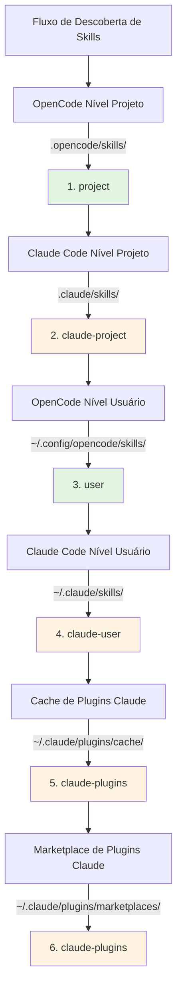

# Compatibilidade com Skills do Claude Code

## O Que Você Vai Aprender

- Entender como o plugin é automaticamente compatível com o formato de skills do Claude Code
- Dominar o mecanismo de mapeamento de ferramentas para que skills do Claude funcionem corretamente no OpenCode
- Conhecer as regras completas de prioridade na descoberta de skills
- Reutilizar skills existentes do marketplace de plugins do Claude sem precisar reescrevê-las

## Seu Desafio Atual

Você já tem algumas skills do Claude Code, ou quer usar skills do marketplace de plugins do Claude, mas essas skills foram escritas para o Claude Code. Usá-las diretamente no OpenCode causa problemas:

- Chamadas de ferramentas nas skills do Claude (como `TodoWrite`, `Task`) não existem no OpenCode
- Não está claro como fazer o OpenCode encontrar skills de plugins do Claude já instalados
- Preocupação com incompatibilidade de formato, exigindo reescrever todo o conteúdo

## Conceito Central

O plugin OpenCode Agent Skills usa um **mecanismo de compatibilidade em três camadas** que permite usar skills do Claude Code sem modificações:

1. **Descoberta Automática** - Escaneia skills dos diretórios padrão do Claude Code (`.claude/skills/`, `~/.claude/plugins/`)
2. **Mapeamento de Ferramentas** - Injeta automaticamente um guia de mapeamento ao carregar skills, convertendo nomes de ferramentas do Claude para nomes do OpenCode
3. **Suporte a Formatos** - Suporta tanto o formato v1 quanto v2 de instalação de plugins do Claude

::: info Conceito-Chave
**Formato de Skills do Claude Code** - Especificação de skills definida pela Anthropic, usando arquivos `SKILL.md` para descrever skills, contendo YAML frontmatter (metadados) e conteúdo Markdown (instruções).
:::

### Como Funciona o Mapeamento de Ferramentas

Quando o plugin detecta que uma skill carregada foi escrita para o Claude Code, ele injeta automaticamente um guia de mapeamento de ferramentas:

| Ferramenta Claude Code | Ferramenta OpenCode | Regra de Mapeamento |
| --- | --- | --- |
| `TodoWrite/TodoRead` | `todowrite/todoread` | Minúsculas |
| `Task` (sub-agente) | `task` (com parâmetro subagent_type) | Usar parâmetro |
| `Skill` | `use_skill` | Substituir nome |
| `Read/Write/Edit/Bash/Glob/Grep/WebFetch` | `read/write/edit/bash/glob/grep/webfetch` | Minúsculas |

**Método de Mapeamento**: O plugin injeta o guia de mapeamento como XML no contexto da sessão ao carregar a skill, e a IA automaticamente chama a ferramenta correta seguindo o mapeamento.

::: tip Por Que o Mapeamento é Necessário?
Claude Code e OpenCode têm estilos de nomenclatura de ferramentas diferentes. Claude usa PascalCase (como `TodoWrite`), OpenCode usa minúsculas (como `todowrite`). O mapeamento de ferramentas informa à IA como converter as chamadas.
:::

### Prioridade de Descoberta de Skills

O plugin descobre skills na seguinte ordem, **a primeira skill correspondente tem efeito** (skills com mesmo nome não são duplicadas):



**Regras de Prioridade**:
- Skills de nível projeto sobrescrevem skills de nível usuário (conveniente para personalização de projeto)
- Skills do OpenCode têm prioridade sobre skills do Claude (evita confusão)
- Skills com mesmo nome mantêm apenas a primeira versão descoberta

::: details Exemplo: Sobrescrita de Skills com Mesmo Nome
Suponha que você tenha uma skill chamada `git-helper` em dois locais:
- `.claude/skills/git-helper/SKILL.md` (versão Claude)
- `.opencode/skills/git-helper/SKILL.md` (versão OpenCode)

**Resultado**: A versão OpenCode tem efeito (prioridade mais alta)
:::

## 🎒 Antes de Começar

- OpenCode Agent Skills plugin instalado e configurado
- Familiaridade com conceitos básicos de skills (recomendado ler primeiro [O Que é OpenCode Agent Skills?](../../start/what-is-opencode-agent-skills/))
- (Opcional) Ter plugins ou skills do Claude Code já instalados

## Mãos à Obra

### Passo 1: Verificar se as Skills do Claude Foram Descobertas

**Por quê**
Confirmar que o plugin consegue escanear corretamente seus diretórios de skills do Claude Code.

No OpenCode, chame a ferramenta:

```
get_available_skills()
```

**Você deve ver**: A lista de skills retornada inclui skills de `.claude/skills/`, `~/.claude/skills/`, `~/.claude/plugins/`, com o campo `source` de cada skill mostrando a origem (como `claude-project`, `claude-user`, `claude-plugins`).

**Checkpoint ✅**: Confirme que a lista inclui as skills do Claude esperadas.

### Passo 2: Carregar uma Skill do Claude

**Por quê**
Verificar se o mecanismo de mapeamento de ferramentas está funcionando corretamente.

Chame a ferramenta para carregar uma skill do Claude:

```
use_skill(skill="nome-da-sua-skill")
```

**Você deve ver**: Mensagem de sucesso retornada, como `Skill "xxx" loaded.`.

**Checkpoint ✅**: A IA agora pode usar as instruções dessa skill.

### Passo 3: Verificar se o Mapeamento de Ferramentas Está Funcionando

**Por quê**
Confirmar que a IA consegue chamar corretamente as ferramentas do OpenCode em vez das ferramentas do Claude.

Peça à IA uma tarefa que requer as ferramentas da skill, por exemplo:

```
Por favor, use a funcionalidade de todo da skill para criar uma lista de tarefas para mim.
```

**Você deve ver**: A IA chama corretamente a ferramenta `todowrite` do OpenCode, não a ferramenta `TodoWrite` do Claude.

::: tip Como Verificar se o Mapeamento Está Funcionando?
Verifique o log de chamadas de ferramentas da IA (se o modo de depuração estiver habilitado), você verá que ela está chamando `todowrite` em vez de `TodoWrite`.
:::

**Checkpoint ✅**: Chamada de ferramenta bem-sucedida, tarefa concluída.

## Armadilhas Comuns

### 1. Incompatibilidade de Formato de Plugin

**Problema**: Plugins antigos do Claude usam formato v1, novos usam formato v2, fazendo com que algumas skills não sejam descobertas.

**Causa**: As estruturas de `installed_plugins.json` v1 e v2 são diferentes.

**Solução**: O plugin suporta ambos os formatos, não é necessária conversão manual. Se as skills ainda não forem descobertas, verifique se `~/.claude/plugins/installed_plugins.json` existe e está formatado corretamente.

### 2. Mapeamento de Ferramentas Não Funcionando

**Problema**: A IA ainda chama nomes de ferramentas do Claude, causando erros.

**Causa**: O conteúdo da skill pode estar contornando o guia de mapeamento de ferramentas, ou usando chamadas de ferramentas hardcoded.

**Solução**:
- Confirme que a skill é usada após ser carregada, não chamando ferramentas diretamente
- Se a skill tiver exemplos de código, altere manualmente os nomes das ferramentas para o formato OpenCode

### 3. Conflito de Nomes de Skills

**Problema**: Skills com mesmo nome em locais diferentes, versão errada sendo carregada.

**Causa**: Sobrescrita devido à prioridade de descoberta de skills.

**Solução**:
- Verifique o campo `source` da skill para confirmar a origem
- Use o formato de namespace para especificar explicitamente a origem: `use_skill(skill="user:nome-da-skill")` ou `use_skill(skill="claude-plugins:nome-da-skill")`

::: details Sintaxe de Namespace
O plugin suporta o formato `namespace:nome-da-skill`:
- `project:nome-da-skill` - Skill OpenCode nível projeto
- `claude-project:nome-da-skill` - Skill Claude nível projeto
- `user:nome-da-skill` - Skill OpenCode nível usuário
- `claude-user:nome-da-skill` - Skill Claude nível usuário
- `claude-plugins:nome-da-skill` - Skill do marketplace de plugins Claude
:::

## Resumo da Lição

O plugin OpenCode Agent Skills usa um mecanismo de compatibilidade em três camadas para reutilizar skills do Claude Code sem problemas:

- **Descoberta Automática** - Escaneia skills de 6 locais, cobrindo nível projeto, nível usuário e nível plugin
- **Mapeamento de Ferramentas** - Converte automaticamente nomes de ferramentas do Claude para nomes de ferramentas do OpenCode
- **Suporte a Formatos** - Suporta tanto o formato v1 quanto v2 de plugins do Claude

Não é necessário reescrever skills, basta instalar e usar, o plugin lida automaticamente com problemas de compatibilidade.

## Prévia da Próxima Lição

> Na próxima lição, aprenderemos sobre **[Integração com Workflow Superpowers](../superpowers-integration/)**.
>
> Você aprenderá:
> - Como habilitar o modo Superpowers
> - Detecção e carregamento automático de skills Superpowers
> - Como workflows rigorosos melhoram a eficiência do desenvolvimento

---

## Apêndice: Referência do Código-Fonte

<details>
<summary><strong>Clique para expandir e ver a localização do código-fonte</strong></summary>

> Atualizado em: 2026-01-24

| Funcionalidade | Caminho do Arquivo | Linhas |
| --- | --- | --- |
| Definição de mapeamento de ferramentas | [`src/claude.ts`](https://github.com/joshuadavidthomas/opencode-agent-skills/blob/main/src/claude.ts#L19-L25) | 19-25 |
| Definição de tipos de formato v1/v2 | [`src/claude.ts`](https://github.com/joshuadavidthomas/opencode-agent-skills/blob/main/src/claude.ts#L35-L61) | 35-61 |
| Extração de caminho de instalação de plugin | [`src/claude.ts`](https://github.com/joshuadavidthomas/opencode-agent-skills/blob/main/src/claude.ts#L68-L77) | 68-77 |
| Descoberta de skills de plugin | [`src/claude.ts`](https://github.com/joshuadavidthomas/opencode-agent-skills/blob/main/src/claude.ts#L82-L105) | 82-105 |
| Descoberta de skills do marketplace | [`src/claude.ts`](https://github.com/joshuadavidthomas/opencode-agent-skills/blob/main/src/claude.ts#L115-L180) | 115-180 |
| Descoberta de skills em cache | [`src/claude.ts`](https://github.com/joshuadavidthomas/opencode-agent-skills/blob/main/src/claude.ts#L193-L253) | 193-253 |
| Lista de prioridade de descoberta de skills | [`src/skills.ts`](https://github.com/joshuadavidthomas/opencode-agent-skills/blob/main/src/skills.ts#L241-L254) | 241-254 |
| Lógica de deduplicação de skills com mesmo nome | [`src/skills.ts`](https://github.com/joshuadavidthomas/opencode-agent-skills/blob/main/src/skills.ts#L256-L260) | 256-260 |
| Import de toolTranslation | [`src/tools.ts`](https://github.com/joshuadavidthomas/opencode-agent-skills/blob/main/src/tools.ts#L15) | 15 |
| Injeção de mapeamento de ferramentas | [`src/tools.ts`](https://github.com/joshuadavidthomas/opencode-agent-skills/blob/main/src/tools.ts#L238-L249) | 238-249 |

**Constantes-Chave**:
- `toolTranslation`: String XML do guia de mapeamento de ferramentas, injetada no contexto da sessão ao carregar skills. Definida em `src/claude.ts:19-25`, importada em `src/tools.ts:15`

**Funções-Chave**:
- `getPluginInstallPaths()`: Extrai caminhos de instalação de plugins dos formatos v1/v2
- `discoverSkillsFromPluginDir()`: Escaneia o subdiretório skills/ do diretório de plugins
- `discoverMarketplaceSkills()`: Descobre skills de `~/.claude/plugins/marketplaces/` (prioritário)
- `discoverPluginCacheSkills()`: Descobre skills de `~/.claude/plugins/cache/` (como fallback)
- `findFile()`: Busca recursivamente por nome de arquivo especificado (função utilitária)

**Fluxo Importante**:
1. Na inicialização do plugin, chama `discoverAllSkills()` → percorre 6 caminhos de descoberta
2. Ao descobrir skills de plugins do Claude, chama `discoverMarketplaceSkills()` ou `discoverPluginCacheSkills()`
3. Ao carregar skill, a ferramenta `use_skill` insere `toolTranslation` no conteúdo XML (linha 244)

</details>
