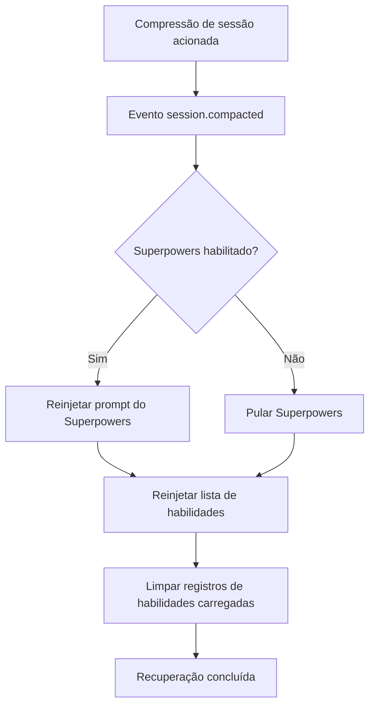

# Mecanismo de Recuperação após Compressão de Contexto

## O que você será capaz de fazer

- Entender como o plugin mantém as habilidades disponíveis após a compressão da sessão
- Saber quando a recuperação após compressão é acionada e o fluxo de execução
- Ser capaz de verificar se a recuperação após compressão está funcionando corretamente
- Entender o papel das mensagens sintéticas no mecanismo de recuperação

## Seu dilema atual

Em sessões longas, o OpenCode executa **Compressão de Contexto** (Context Compaction) para economizar Tokens. Após a compressão, a sessão retém apenas as mensagens mais recentes, e o histórico inicial (incluindo o conteúdo das habilidades injetadas anteriormente) é removido.

Isso cria um problema: se o conteúdo das habilidades for removido pela compressão, a AI não saberá mais quais habilidades estão disponíveis e não poderá usar as habilidades carregadas.

## Quando usar este recurso

O mecanismo de recuperação após compressão é **executado automaticamente**, não exigindo intervenção manual. No entanto, ao entender seu funcionamento, você pode solucionar problemas nos seguintes cenários:

- A AI "esquece" subitamente as habilidades em sessões longas
- É necessário depurar a disponibilidade das habilidades após a compressão
- Você quer entender a estratégia de gerenciamento de sessão do plugin

## Ideia Central

### O que é compressão de contexto?

As sessões do OpenCode ficam cada vez mais longas conforme as mensagens aumentam. Quando o uso de Tokens se aproxima do limite, o sistema executa automaticamente a **Compressão de Contexto**:

```
[Sessão inicial] → [Mensagem 1] → [Mensagem 2] → ... → [Mensagem 50]
                          ↑ Ponto de compressão: retém apenas as 10 mensagens mais recentes
```

Após a compressão, as mensagens iniciais (incluindo o conteúdo de injeção de habilidades) são removidas, e a AI só pode ver o histórico de mensagens mais recente.

### Como funciona o mecanismo de recuperação após compressão

O plugin monitora o evento `session.compacted` e, ao detectar a ocorrência de compressão, executa imediatamente as seguintes operações de recuperação:



**Pontos principais**:
- A recuperação é **automática**, não precisa ser acionada manualmente
- A lista de habilidades recuperada contém **todas as habilidades descobertas** (não apenas as carregadas anteriormente)
- Os registros de habilidades carregadas são limpos, permitindo que a AI reavalie quais habilidades são necessárias

### O papel das mensagens sintéticas

O plugin usa o mecanismo de **Injeção de Mensagem Sintética** (Synthetic Message Injection) para injetar conteúdo:

| Propriedade | Valor | Significado |
|--- | --- | ---|
| `noReply` | `true` | A AI não responde ao conteúdo injetado em si |
| `synthetic` | `true` | Marcado como conteúdo gerado pelo sistema, não conta como entrada do usuário, não é exibido na UI |

Isso significa que o conteúdo injetado pela recuperação após compressão:
- É completamente transparente para o usuário (não visível)
- Não consome a cota de mensagens do usuário
- Mas é lido e compreendido pela AI

## 🎒 Preparação antes de começar

Este tutorial requer:
- Plugin OpenCode Agent Skills instalado
- Entendimento básico de carregamento de habilidades
- Uma sessão longa para testar o efeito de compressão

::: tip
Não há preparação adicional necessária; o mecanismo de recuperação após compressão é uma funcionalidade integrada do plugin.
:::

## Siga comigo: verifique o efeito da recuperação após compressão

### Passo 1: inicie uma nova sessão

**Por que**
Verifique se a lista de habilidades é injetada corretamente na inicialização da sessão

Inicie uma nova sessão, digite qualquer mensagem:

```
Olá
```

**Você deve ver**: A AI responde normalmente e, em segundo plano, injeta automaticamente a lista de habilidades (invisível para o usuário)

### Passo 2: carregue uma habilidade

**Por que**
Garanta que o conteúdo da habilidade seja injetado no contexto

Chame a ferramenta `use_skill`:

```
Use get_available_skills para ver as habilidades disponíveis, depois use use_skill para carregar uma das habilidades
```

**Você deve ver**: A AI lista as habilidades disponíveis e depois carrega a habilidade que você escolheu

### Passo 3: acione a compressão de contexto

**Por que**
Simule um cenário de sessão longa, acionando o mecanismo de compressão do OpenCode

Continue enviando mensagens para simular uma conversa longa:

```
Mensagem 1: conteúdo de teste
Mensagem 2: continuando o teste
...
(Repita enviando 20-30 mensagens)
```

**Você deve ver**:
- Conforme as mensagens aumentam, o histórico da sessão fica mais longo
- Após atingir um certo comprimento, o OpenCode executa automaticamente a compressão
- Após a compressão, as mensagens iniciais (incluindo a injeção de habilidades) são removidas

### Passo 4: verifique o efeito da recuperação

**Por que**
Verifique se a lista de habilidades foi reinjetada após a compressão

Após a compressão, peça à AI para usar uma habilidade novamente:

```
Ajude-me a usar a habilidade git-helper para criar uma nova ramificação (assumindo que você já instalou a habilidade git-helper)
```

**Você deve ver**:
- A AI ainda sabe quais habilidades estão disponíveis (prova de que a lista de habilidades foi restaurada)
- A AI pode carregar e usar habilidades normalmente (prova de que a funcionalidade das habilidades não foi afetada pela compressão)

### Passo 5: verifique a injeção de mensagens sintéticas

**Por que**
Confirme que o mecanismo de recuperação usa mensagens sintéticas, não interferindo na conversa

Se o plugin suportar, você pode verificar o histórico de mensagens da sessão (dependendo da funcionalidade do OpenCode):

```
Use ferramentas de depuração para ver o histórico de mensagens da sessão
```

**Você deve ver**:
- A mensagem de lista de habilidades recuperada é marcada como `synthetic: true`
- Estas mensagens não são exibidas na interface de conversa normal

## Ponto de verificação ✅

Após concluir as etapas acima, você deve ser capaz de confirmar:

- [ ] A AI ainda pode acessar a lista de habilidades em sessões longas
- [ ] A funcionalidade de carregamento de habilidades funciona normalmente após a compressão
- [ ] O processo de recuperação é completamente transparente para o usuário

## Avisos sobre armadilhas

### Problema 1: após a compressão, a AI diz "habilidade não encontrada"

**Possíveis causas**:
- O plugin não está monitorando corretamente o evento `session.compacted`
- O caminho do diretório de habilidades mudou

**Solução**:

1. **Verifique se o evento de compressão foi acionado**
   - Através dos passos 3 e 4 de "Siga comigo", confirme que após a compressão a AI ainda pode acessar a lista de habilidades
   - Se a AI pode usar habilidades normalmente, o mecanismo de recuperação após compressão está funcionando

2. **Verifique se o plugin foi carregado corretamente**
   - Reinicie o OpenCode
   - Após iniciar uma nova sessão, peça à AI para listar as habilidades disponíveis (`get_available_skills`)
   - Se você pode ver a lista de habilidades, o plugin foi carregado corretamente

### Problema 2: a lista de habilidades recuperada está vazia

**Possíveis causas**:
- Não há habilidades no caminho de descoberta
- Formato de arquivo de habilidade incorreto

**Solução**:
```bash
# Consultar manualmente as habilidades disponíveis
Use get_available_skills para ver a lista de habilidades
```

Se retornar uma lista vazia, verifique o diretório de habilidades e o formato do arquivo.

### Problema 3: após a compressão, o estado das habilidades carregadas é perdido

**Este é um comportamento esperado**, não um Bug. O mecanismo de recuperação limpa o registro `loadedSkillsPerSession`, permitindo que a AI reavalie quais habilidades são necessárias.

**Solução**: A AI decidirá automaticamente se deve recarregar habilidades com base no contexto, sem necessidade de intervenção manual.

## Resumo desta lição

O mecanismo de recuperação após compressão garante a disponibilidade de habilidades em sessões longas através das seguintes maneiras:

1. **Monitorar eventos de compressão**: detecta automaticamente o evento `session.compacted`
2. **Reinjetar lista de habilidades**: usa a tag `<available-skills>` para injetar todas as habilidades
3. **Recuperação opcional do Superpowers**: se habilitado, restaura simultaneamente o prompt do Superpowers
4. **Usar mensagens sintéticas**: o processo de recuperação é transparente para o usuário, não afeta a conversa
5. **Redefinir registros carregados**: limpa o conjunto de habilidades carregadas, permitindo reavaliação

Este mecanismo garante que:
- Habilidades sempre estejam disponíveis em sessões longas
- O processo de recuperação seja automatizado e imperceptível
- A AI possa decidir quais habilidades usar com base no contexto mais recente

## Próximo preview da próxima lição

> Na próxima lição, aprenderemos **[Solução de problemas](../../faq/troubleshooting/)**.
>
> Você aprenderá:
> - Como lidar com erros comuns e exceções
> - Técnicas de solução de problemas relacionadas à recuperação após compressão
> - Soluções para outros problemas de uso

---

## Apêndice: Referência do código fonte

<details>
<summary><strong>Clique para expandir e ver a localização do código fonte</strong></summary>

> Última atualização: 2026-01-24

| Funcionalidade        | Caminho do arquivo                                                                                    | Número de linha    |
|--- | --- | ---|
| Monitoramento de evento de compressão | [`src/plugin.ts`](https://github.com/joshuadavidthomas/opencode-agent-skills/blob/main/src/plugin.ts#L144-L157) | 144-157 |
| Inicialização da primeira mensagem | [`src/plugin.ts`](https://github.com/joshuadavidthomas/opencode-agent-skills/blob/main/src/plugin.ts#L70-L105) | 70-105 |
| Injeção de lista de habilidades | [`src/skills.ts`](https://github.com/joshuadavidthomas/opencode-agent-skills/blob/main/src/skills.ts#L345-L370) | 345-370 |
| Injeção de mensagem sintética | [`src/utils.ts`](https://github.com/joshuadavidthomas/opencode-agent-skills/blob/main/src/utils.ts#L147-L162) | 147-162 |
| Gerenciamento de estado da sessão | [`src/plugin.ts`](https://github.com/joshuadavidthomas/opencode-agent-skills/blob/main/src/plugin.ts#L25-L35) | 25-35 |

**Variáveis principais**:
- `setupCompleteSessions: Set<string>`: registra IDs de sessão que completaram a inicialização
- `loadedSkillsPerSession: Map<string, Set<string>>`: registra nomes de habilidades carregadas em cada sessão

**Funções principais**:
- `injectSkillsList()`: injeta lista de habilidades disponíveis na sessão
- `injectSyntheticContent()`: injeta conteúdo usando mensagens sintéticas
- `getSessionContext()`: obtém informações de model e agent da sessão

</details>
