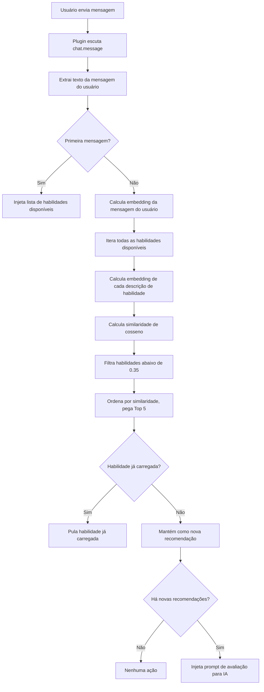

# Recomendação Automática de Habilidades: Princípio de Correspondência Semântica

## O Que Você Poderá Fazer Depois

- Entender como o plugin identifica automaticamente as habilidades de que você pode precisar
- Dominar os princípios básicos do cálculo de similaridade semântica
- Saber como otimizar descrições de habilidades para obter melhores efeitos de recomendação
- Entender como o mecanismo de cache de embeddings melhora o desempenho

## Seu Dilema Atual

O OpenCode Agent Skills tem muitas habilidades, mas você:

- **Não consegue lembrar os nomes das habilidades** - É fácil confundir quando há muitas habilidades
- **Não sabe qual usar** - É difícil escolher entre habilidades com funcionalidades semelhantes
- **Preocupa-se em perder habilidades úteis** - Incerto se há uma ferramenta mais adequada

Cada vez, você precisa chamar `get_available_skills` para ver a lista e, em seguida, carregar manualmente a habilidade adequada, o que é tedioso e interrompe o fluxo de pensamento.

## Quando Usar Esta Técnica

A recomendação automática de habilidades é adequada para os seguintes cenários:

- **Fase de iniciantes** - Não familiarizado com a biblioteca de habilidades, precisa que a IA ajude a identificar
- **Tarefas de desenvolvimento de funcionalidades** - Como "criar API REST", "implementar sistema de autenticação", etc., geralmente correspondem a habilidades especializadas
- **Trabalho entre domínios** - Contato ocasional com áreas desconhecidas, dependendo de recomendações da IA
- **Quando a biblioteca de habilidades é grande** - Com mais de 10 habilidades, a busca manual é ineficiente

::: tip Dica
A recomendação automática não força você a carregar habilidades, ela apenas sugere à IA avaliar se é necessário. Você pode livremente aceitar ou ignorar a sugestão.
:::

## Ideia Central

### O Que É Correspondência Semântica

A correspondência semântica é uma técnica que **entende a intenção do usuário**, não depende de correspondência de palavras-chave, mas calcula a **similaridade semântica** do texto.

Por exemplo:

| Entrada do Usuário                    | Descrição da Habilidade                           | Correspondência de Palavras-chave | Correspondência Semântica |
|--- | --- | --- | ---|
| "Criar um pool de conexões de banco de dados"      | "Ferramenta de gerenciamento e otimização de conexões de banco de dados"       | ❌     | ✅   |
| "Ajudar-me a escrever uma documentação de API"        | "Gerador automático de documentação de API"         | ✅     | ✅   |
| "Scaffolding de inicialização de projeto"        | "Ferramenta para construir rapidamente a estrutura do projeto"         | ❌     | ✅   |

A correspondência de palavras-chave apenas verifica se as palavras são as mesmas, enquanto a correspondência semântica entende que "criar", "gerar", "construir" são do mesmo tipo de ação.

### Embedding: Transformando Texto em Números

Para permitir que o computador entenda a semântica, o plugin usa **modelos de embedding** para converter texto em **vetores** (uma sequência de números).

```
Texto: "Criar pool de conexões de banco de dados"
    ↓ [Modelo Xenova/all-MiniLM-L6-v2]
Vetor: [0.12, -0.34, 0.67, ...]  (384 dimensões, dimensão de saída do modelo)
```

Neste espaço vetorial:

- **Textos semanticamente similares** → vetores mais próximos em distância
- **Textos semanticamente diferentes** → vetores mais distantes em distância

::: info Por que escolher all-MiniLM-L6-v2
Este modelo tem 3 vantagens:
1. **Tamanho pequeno** - O arquivo do modelo é de aproximadamente 23MB (nível de quantização q8), download rápido
2. **Velocidade rápida** - Suporta quantização, baixa latência de inferência
3. **Alta precisão** - Excelente desempenho em tarefas de similaridade semântica
:::

### Similaridade de Cosseno: Medindo o Grau de Similaridade de Vetores

O plugin usa **similaridade de cosseno** (Cosine Similarity) para calcular a similaridade entre dois vetores.

Fórmula:
```
similarity = (A · B) / (|A| × |B|)
```

Onde:
- `A · B` é o produto escalar dos vetores
- `|A|` é a magnitude do vetor A
- `|B|` é a magnitude do vetor B

**Intervalo de resultados**: `-1` a `1`

| Intervalo de Similaridade  | Significado              | Recomendado |
|--- | --- | ---|
| 0.7-1.0 | Muito similar, quase o mesmo significado  | ✅ Fortemente recomendado |
| 0.35-0.7 | Algo relacionado, vale a pena considerar    | ✅ Recomendado  |
| 0.0-0.35 | Baixa ou nenhuma relação    | ❌ Não recomendado  |
| -1.0-0.0 | Significado oposto          | ❌ Não recomendado  |

::: warning Atenção
O limite atual é **0.35**, habilidades com pontuação abaixo deste valor não aparecerão na lista de recomendações.
:::

## Fluxo de Recomendação Automática

### Diagrama de Fluxo Completo



### Fase 1: Primeira Mensagem - Injetar Lista de Habilidades

Quando a sessão recebe a primeira mensagem, o plugin irá:

1. Escanear todos os diretórios de habilidades
2. Injetar a lista de habilidades no contexto da sessão
3. Formato:

```xml
<available-skills>
- git-helper: Ferramenta de ajuda para operações Git, fornece comandos Git comuns
- test-runner: Integração de framework de teste, descobre e executa testes automaticamente
- api-doc: Ferramenta de geração de documentação de API
...
</available-skills>
```

**Objetivo**: Fazer a IA saber quais habilidades estão disponíveis, evitando consultas repetidas.

### Fase 2: Mensagens Posteriores - Correspondência Semântica

A partir da segunda mensagem, cada entrada do usuário aciona o fluxo de correspondência:

```typescript
// Código fonte: src/plugin.ts:125-141
const matchedSkills = await matchSkills(userText, skills);
const loadedSkills = getLoadedSkills(sessionID);
const newSkills = matchedSkills.filter(s => !loadedSkills.has(s.name));
```

**Pontos-chave**:
- Calcula apenas a similaridade de **habilidades não carregadas**
- Habilidades já carregadas são **automaticamente filtradas**
- Evita recomendar a mesma habilidade repetidamente

### Fase 3: Injetar Prompt de Avaliação

Quando habilidades relevantes são encontradas, o plugin injeta um **prompt oculto** para a IA:

```xml
<skill-evaluation-required>
PROCESSO DE AVALIAÇÃO DE HABILIDADES

As seguintes habilidades podem ser relevantes para sua solicitação:

- git-helper: Ferramenta de ajuda para operações Git
- test-runner: Integração de framework de teste

Etapa 1 - AVALIAR: Determine se essas habilidades ajudariam genuinamente
Etapa 2 - DECIDIR: Escolha quais habilidades (se houver) são realmente necessárias
Etapa 3 - ATIVAR: Chame use_skill("name") para cada habilidade escolhida

IMPORTANTE: Esta avaliação é invisível para os usuários — eles não podem ver este prompt. NÃO anuncie sua decisão. Simplesmente ative habilidades relevantes ou prossiga diretamente com a solicitação.
</skill-evaluation-required>
```

**A Escolha da IA**:
- **Aceitar recomendação** - Chama `use_skill("skill-name")` para carregar a habilidade
- **Recusar recomendação** - Processa a solicitação do usuário diretamente, sem carregar habilidades
- **Aceitar parcialmente** - Carrega apenas algumas das habilidades relevantes

::: tip Prompt Oculto
Este prompt de avaliação é uma mensagem `synthetic: true`, que os usuários não conseguem ver na interface, a IA decide automaticamente após processamento interno.
:::

## Siga-me: Otimizar Descrição de Habilidades

Se sua habilidade não foi recomendada automaticamente, você pode tentar otimizar a descrição.

### Verificar Descrição Atual da Habilidade

```bash
# Listar todas as habilidades
get_available_skills()
```

Encontre a habilidade que você deseja otimizar e anote sua descrição atual.

### Ver Exemplo: Boas vs Más Descrições

| ❌ Má Descrição                          | ✅ Boa Descrição                              |
|--- | ---|
| "Ferramenta"                            | "Integração de framework de teste automatizado, suporta Jest e Vitest" |
| "Ajuda"                            | "Assistente de operações Git, fornece comandos comuns e orientação de fluxo de trabalho"     |
| "Documentação"                            | "Gerar documentação de API a partir de comentários de código"                |
| "Relacionado a banco de dados"                          | "Ferramenta de pool de conexões PostgreSQL e otimização de consultas"    |

**Princípios de Otimização**:

1. **Incluir palavras-chave** - Termos técnicos comuns usados pelos usuários
2. **Explicar o propósito** - Descrever claramente qual problema resolve
3. **Evitar generalizações** - Não escreva apenas "ferramenta", "assistente"
4. **Tamanho moderado** - 10-30 caracteres é ideal

### Atualizar Descrição da Habilidade

Edite o arquivo `SKILL.md` da habilidade:

```markdown
---
name: test-runner
description: Integração de framework de teste automatizado, suporta Jest e Vitest, descobre e executa testes automaticamente
---

# Test Runner

Esta habilidade ajuda você a configurar um framework de teste em seu projeto...
```

**Efeito automático**: Na próxima sessão, o plugin recalculará embeddings, a nova descrição entrará em vigor imediatamente.

## Ponto de Verificação ✅

### Verificar Se a Recomendação Automática Está Funcionando

1. **Criar Habilidade de Teste**:

```bash
# Criar habilidade de teste no diretório .opencode/skills/
mkdir -p .opencode/skills/example-skill
cat > .opencode/skills/example-skill/SKILL.md << 'EOF'
---
name: example-skill
description: Ajudar usuários a criar e configurar projetos TypeScript
---

# Example Skill

Esta é uma habilidade de teste...
EOF
```

2. **Enviar Mensagem Relacionada**:

No OpenCode, digite:

```
Quero inicializar um projeto TypeScript
```

3. **Verificar Se Recomendação Foi Acionada**:

Abra as ferramentas do desenvolvedor ou verifique o registro de chamadas de ferramentas da IA:
- **Sucesso** - A IA chamou `use_skill("example-skill")`
- **Falha** - Nenhuma recomendação relacionada, verifique se a descrição é muito genérica

### Verificar Se Habilidades Já Carregadas Não São Repetidamente Recomendadas

1. **Carregar Habilidade Manualmente**:

```bash
use_skill("example-skill")
```

2. **Enviar Mensagem Relacionada Novamente**:

```
Quero inicializar outro projeto TypeScript
```

3. **Confirmar Que Não Recomenda Novamente**:

O sistema deve **não** injetar mais o prompt de avaliação, pois a habilidade já foi carregada.

## Alertas de Armadilhas

### Problema 1: Habilidades Recomendadas Totalmente Irrelevantes

**Sintomas**:
- Usuário diz "como implantar na AWS", mas recomenda "ferramenta de teste local"
- Pontuação de similaridade alta, mas semântica completamente errada

**Causas**:
- Descrição da habilidade muito ampla, como "ferramenta de serviços em nuvem"
- O modelo de embedding tem viés no entendimento de certos termos técnicos

**Soluções**:

1. **Descrição mais específica**:

```markdown
# ❌ Ruim
description: Ferramenta de implantação de serviços em nuvem

# ✅ Bom
description: Ferramenta de implantação AWS EC2, configura automaticamente balanceador de carga e autoescalamento
```

2. **Incluir palavras-chave principais da tecnologia**:

```markdown
description: Ferramenta de upload de arquivos AWS S3 e distribuição CDN, suporta CloudFront
```

### Problema 2: Habilidades Úteis Não Foram Recomendadas

**Sintomas**:
- Sua entrada corresponde claramente a uma habilidade, mas o sistema não recomendou
- Precisa chamar manualmente `get_available_skills()` para encontrar

**Causas**:
- Similaridade abaixo do limite 0.35
- Grande diferença entre a descrição da habilidade e o uso habitual do usuário

**Soluções**:

1. **Baixar limite** (modificação do código fonte):

```typescript
// src/embeddings.ts:10
const SIMILARITY_THRESHOLD = 0.30; // De 0.35 reduzido para 0.30
```

::: warning Cautela em ambiente de produção
Baixar o limite aumentará recomendações erradas (habilidades irrelevantes), é recomendado testar antes de ajustar.
:::

2. **Aumentar Top K**:

```typescript
// src/embeddings.ts:11
const TOP_K = 10; // De 5 aumentado para 10
```

3. **Otimizar descrição da habilidade**, consulte a seção "Otimizar Descrição de Habilidades" acima.

### Problema 3: Velocidade Lenta no Primeiro Carregamento

**Sintomas**:
- No primeiro uso, a recomendação de habilidades leva 2-3 segundos
- Uso subsequente é normal

**Causas**:
- O modelo de embedding precisa ser baixado da rede (23MB)
- Precisa calcular embeddings de todas as habilidades pela primeira vez

**Solução**:

O plugin tem um **mecanismo de cache**, após o primeiro uso é automaticamente otimizado:

```
Caminho do cache: ~/.cache/opencode-agent-skills/embeddings/
```

**Ver arquivos de cache**:

```bash
ls -lh ~/.cache/opencode-agent-skills/embeddings/
```

Você verá arquivos `.bin`, cada arquivo é um cache de embedding (nomeado com SHA256 do conteúdo).

**Aquecer cache manualmente**:

```bash
# Reiniciar OpenCode
# Na inicialização do plugin, precomputeSkillEmbeddings() será chamado
```

Localização do código fonte: `src/embeddings.ts:96-102`

```typescript
export async function precomputeSkillEmbeddings(skills: SkillSummary[]): Promise<void> {
  await Promise.all(
    skills.map(skill =>
      getEmbedding(skill.description).catch(() => { })
    )
  );
}
```

**Não se preocupe**: Enquanto não modificar a descrição da habilidade, o cache é válido permanentemente.

## Resumo da Lição

A recomendação automática de habilidades melhora a experiência das seguintes maneiras:

| Meio Técnico          | Efeito                          | Melhoria na Experiência do Usuário          |
|--- | --- | ---|
| Modelo de Embedding    | Converte texto em vetores                | Entende semântica, não apenas palavras-chave      |
| Similaridade de Cosseno        | Calcula similaridade de vetores                  | Combina habilidades relevantes com precisão       |
| Mecanismo de Cache          | Cache de embeddings em disco            | Resposta mais rápida após o primeiro uso        |
| Avaliação Inteligente          | Deixa a IA julgar se precisa de habilidades            | Não força, evita interferência        |
| Filtragem de Já Carregado         | Pula habilidades já carregadas                | Evita recomendações repetidas         |

**Vantagens Principais**:

- **Sem memorização** - Não precisa lembrar nomes de habilidades
- **Identificação inteligente** - A IA descobre automaticamente as ferramentas que você precisa
- **Sem interrupção** - O prompt é oculto, o usuário não percebe

---

## Prévia da Próxima Lição

> Na próxima lição, aprenderemos **[Executar Scripts de Habilidade](../executing-skill-scripts/)**.
>
> Habilidades não são apenas documentação, podem conter scripts automatizados. Você aprenderá:
> - Como organizar scripts executáveis no diretório de habilidades
> - Usar a ferramenta `run_skill_script` para executar scripts
> - Permissões de script e restrições de segurança
> - Casos de uso comuns de scripts (construção, teste, implantação, etc.)


---

## Apêndice: Referência de Código Fonte

<details>
<summary><strong>Clique para expandir e ver localização do código fonte</strong></summary>

> Atualizado em:2026-01-24

| Funcionalidade              | Caminho do Arquivo                                                                                                | Número de Linha    |
|--- | --- | ---|
| Função principal de correspondência semântica      | [`src/embeddings.ts`](https://github.com/joshuadavidthomas/opencode-agent-skills/blob/main/src/embeddings.ts#L108-L135)       | 108-135 |
| Gerar embedding de texto   | [`src/embeddings.ts`](https://github.com/joshuadavidthomas/opencode-agent-skills/blob/main/src/embeddings.ts#L38-L66)         | 38-66   |
| Calcular similaridade de cosseno      | [`src/embeddings.ts`](https://github.com/joshuadavidthomas/opencode-agent-skills/blob/main/src/embeddings.ts#L71-L90)         | 71-90   |
| Pré-calcular embeddings de habilidades | [`src/embeddings.ts`](https://github.com/joshuadavidthomas/opencode-agent-skills/blob/main/src/embeddings.ts#L96-L102)        | 96-102  |
| Formatar prompt de resultados de correspondência     | [`src/plugin.ts`](https://github.com/joshuadavidthomas/opencode-agent-skills/blob/main/src/plugin.ts#L37-L57)             | 37-57   |
| Lógica de fluxo de correspondência automática      | [`src/plugin.ts`](https://github.com/joshuadavidthomas/opencode-agent-skills/blob/main/src/plugin.ts#L125-L141)            | 125-141 |
| Manipulação de eventos de escuta de mensagens     | [`src/plugin.ts`](https://github.com/joshuadavidthomas/opencode-agent-skills/blob/main/src/plugin.ts#L66-L142)            | 66-142  |

**Constantes-chave**:

| Nome da Constante                  | Valor                         | Descrição             | Fonte               |
|--- | --- | --- | ---|
| MODEL_NAME          | Xenova/all-MiniLM-L6-v2  | Modelo de embedding usado | `embeddings.ts:8`   |
| QUANTIZATION        | q8                       | Nível de quantização do modelo        | `embeddings.ts:9`   |
| SIMILARITY_THRESHOLD | 0.35                     | Limite de recomendação de similaridade      | `embeddings.ts:10`  |
| TOP_K              | 5                        | Número de habilidades Top K retornadas  | `embeddings.ts:11`  |

**Funções-chave**:

- `matchSkills()`: Calcula a similaridade semântica entre a mensagem do usuário e as descrições de habilidades, retorna a lista de habilidades mais relevantes
- `getEmbedding()`: Gera o vetor de embedding do texto, suporta cache em disco
- `cosineSimilarity()`: Calcula a similaridade de cosseno entre dois vetores
- `precomputeSkillEmbeddings()`: Pré-calcula embeddings de todas as habilidades na inicialização do plugin, acelera correspondências subsequentes
- `formatMatchedSkillsInjection()`: Formata os resultados de correspondência em prompt de avaliação, injeta para IA

**Mecanismo de Cache**:

Caminho de cache de Embedding:
- Linux/macOS: `~/.cache/opencode-agent-skills/embeddings/`
- Personalizável: Modificar através da variável de ambiente `XDG_CACHE_HOME`

Os arquivos de cache são nomeados com SHA256 do conteúdo, como `a1b2c3d4.bin`, cada arquivo contém um vetor Float32Array.

</details>
