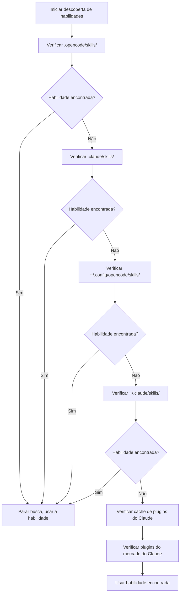

# Explicação Detalhada do Mecanismo de Descoberta de Habilidades

## O Que Você Será Capaz de Fazer

- Entender de quais locais o plugin descobre habilidades automaticamente
- Dominar as regras de prioridade na descoberta de habilidades
- Saber como fazer habilidades de nível de projeto substituírem habilidades de nível de usuário
- Entender o mecanismo de compatibilidade com o Claude Code

## Seu Problema Atual

Você criou habilidades, mas a IA continua dizendo "habilidade não encontrada". Você não sabe em quais locais o plugin procura por habilidades, nem o que acontece com habilidades de mesmo nome. O resultado é que as habilidades estão posicionadas no local errado ou foram substituídas por habilidades de outros locais.

## Quando Usar Este Método

- Quando precisar que uma habilidade específica funcione no projeto
- Quando quiser substituir habilidades de nível de usuário ou habilidades padrão do plugin
- Ao reutilizar habilidades do Claude Code

## 🎒 Preparação Antes de Começar

::: warning Conhecimento Prévio
Primeiro, complete a [Instalação do OpenCode Agent Skills](../../start/installation/).
:::

## Ideia Central

O OpenCode Agent Skills descobre habilidades automaticamente de múltiplos locais, seguindo uma ordem de prioridade. **A primeira habilidade encontrada entra em vigor, habilidades subsequentes com o mesmo nome são ignoradas**. Isso permite que você substitua habilidades de nível de usuário no projeto, alcançando personalização.

### Visão Geral dos Caminhos de Descoberta



::: info Unicidade do Nome da Habilidade
Habilidades com o mesmo nome manterão apenas a primeira descoberta, as subsequentes serão ignoradas. Isso significa que o `git-helper` de nível de projeto substituirá o `git-helper` de nível de usuário.
:::

## Siga comigo

### Passo 1: Verificar a Lógica de Descoberta de Habilidades

**Por que**
Entender como o plugin escaneia os diretórios de habilidades pode ajudá-lo a localizar problemas.

Verifique a definição dos caminhos de descoberta no código-fonte:

```typescript
// src/skills.ts:241-246
const discoveryPaths: DiscoveryPath[] = [
  { path: path.join(directory, '.opencode', 'skills'), label: 'project', maxDepth: 3 },
  { path: path.join(directory, '.claude', 'skills'), label: 'claude-project', maxDepth: 1 },
  { path: path.join(homedir(), '.config', 'opencode', 'skills'), label: 'user', maxDepth: 3 },
  { path: path.join(homedir(), '.claude', 'skills'), label: 'claude-user', maxDepth: 1 }
];
```

**Você deve ver**:
- 4 caminhos de descoberta locais, cada um com `label` (identificação da origem) e `maxDepth` (profundidade máxima de recursão)
- Além disso, 2 caminhos de plugins do Claude (cache e plugins do mercado), descobertos através de `discoverPluginCacheSkills()` e `discoverMarketplaceSkills()`
- `directory` é o diretório raiz do projeto, `homedir()` é o diretório inicial do usuário

### Passo 2: Entender o Mecanismo de Busca Recursiva

**Por que**
Entender o limite de profundidade de recursão pode ajudá-lo a evitar colocar habilidades muito profundamente, resultando em não serem encontradas.

A função de busca recursiva percorre a árvore de diretórios procurando arquivos `SKILL.md`:

```typescript
// src/skills.ts:182-207
async function recurse(dir: string, depth: number, relPath: string) {
  if (depth > maxDepth) return;  // Excedeu o limite de profundidade, parar busca

  const entries = await fs.readdir(dir, { withFileTypes: true });
  for (const entry of entries) {
    const fullPath = path.join(dir, entry.name);
    const stats = await fs.stat(fullPath);

    if (!stats.isDirectory()) continue;  // Pular arquivos

    const newRelPath = relPath ? `${relPath}/${entry.name}` : entry.name;
    const found = await findFile(fullPath, newRelPath, 'SKILL.md');

    if (found) {
      results.push({ ...found, label });  // Habilidade encontrada, adicionar resultado
    } else {
      await recurse(fullPath, depth + 1, newRelPath);  // Busca recursiva em subdiretórios
    }
  }
}
```

**Você deve ver**:
- A profundidade de cada diretório começa em 0, excedendo `maxDepth` interrompe
- Ao encontrar `SKILL.md`, retorna; caso contrário, continua buscando subdiretórios

**Profundidade de recursão em diferentes locais**:

| Local                | Label           | Profundidade Máxima | Descrição                       |
|--- | --- | --- | ---|
| `.opencode/skills/` | project         | 3        | Suporta estrutura de diretórios aninhados           |
| `.claude/skills/`   | claude-project  | 1        | Apenas escaneia a primeira camada               |
| `~/.config/opencode/skills/` | user   | 3        | Suporta estrutura de diretórios aninhados           |
| `~/.claude/skills/` | claude-user     | 1        | Apenas escaneia a primeira camada               |

### Passo 3: Entender as Regras de Deduplicação

**Por que**
Habilidades com o mesmo nome manterão apenas uma, saber essa regra pode evitar que habilidades sejam substituídas.

A lógica de deduplicação está na função `discoverAllSkills`:

```typescript
// src/skills.ts:255-262
const skillsByName = new Map<string, Skill>();
for (const { filePath, relativePath, label } of allResults) {
  const skill = await parseSkillFile(filePath, relativePath, label);
  if (!skill || skillsByName.has(skill.name)) continue;  // Pular habilidades de mesmo nome já existentes
  skillsByName.set(skill.name, skill);
}
```

**Você deve ver**:
- Usa `Map` armazenado por `skill.name`, garantindo unicidade
- `skillsByName.has(skill.name)` verifica se já existe uma habilidade com o mesmo nome
- Habilidades subsequentes com o mesmo nome são ignoradas (`continue`)

**Exemplo de cenário**:

```
Estrutura do projeto:
.opencode/skills/git-helper/SKILL.md  ← Primeira descoberta, entra em vigor
~/.config/opencode/skills/git-helper/SKILL.md  ← Mesmo nome, ignorado
```

### Passo 4: Analisar o Arquivo SKILL.md

**Por que**
Entender as regras de análise do SKILL.md pode ajudá-lo a evitar erros de formato.

O plugin analisa o frontmatter YAML do SKILL.md:

```typescript
// src/skills.ts:132-152
const frontmatterMatch = content.match(/^---\n([\s\S]*?)\n---\n([\s\S]*)$/);
if (!frontmatterMatch?.[1] || !frontmatterMatch?.[2]) {
  return null;  // Erro de formato, pular
}

const frontmatterText = frontmatterMatch[1];
const skillContent = frontmatterMatch[2].trim();

let frontmatterObj: unknown;
try {
  frontmatterObj = parseYamlFrontmatter(frontmatterText);
} catch {
  return null;  // Falha na análise do YAML, pular
}

let frontmatter: SkillFrontmatter;
try {
  frontmatter = SkillFrontmatterSchema.parse(frontmatterObj);
} catch (error) {
  return null;  // Falha na validação, pular
}
```

**Você deve ver**:
- O Frontmatter deve estar cercado por `---`
- O conteúdo YAML deve atender à validação do Zod Schema
- Habilidades que falharem na análise serão ignoradas (não gerarão erro, continuarão descobrindo outras habilidades)

**Regras de Validação do Frontmatter**:

```typescript
// src/skills.ts:106-114
const SkillFrontmatterSchema = z.object({
  name: z.string()
    .regex(/^[\p{Ll}\p{N}-]+$/u, { message: "Name must be lowercase alphanumeric with hyphens" })
    .min(1, { message: "Name cannot be empty" }),
  description: z.string()
    .min(1, { message: "Description cannot be empty" }),
  license: z.string().optional(),
  "allowed-tools": z.array(z.string()).optional(),
  metadata: z.record(z.string(), z.string()).optional()
});
```

**Regras de nomenclatura**:
- Apenas são permitidos letras minúsculas, números e hífens (`-`)
- Não são permitidos espaços, letras maiúsculas ou sublinhados

| ❌ Nome de Habilidade Incorreto  | ✅ Nome de Habilidade Correto |
|--- | ---|
| `MySkill`        | `my-skill`       |
| `git_helper`     | `git-helper`     |
| `Git Helper`     | `git-helper`     |

### Passo 5: Descobrir Scripts Executáveis

**Por que**
Habilidades podem conter scripts de automação, entender o mecanismo de descoberta de scripts pode ajudá-lo a configurá-los corretamente.

O plugin escaneia recursivamente o diretório de habilidades procurando arquivos executáveis:

```typescript
// src/skills.ts:61-93
const scripts: Script[] = [];
const skipDirs = new Set(['node_modules', '__pycache__', '.git', '.venv', 'venv', '.tox', '.nox']);

async function recurse(dir: string, depth: number, relPath: string) {
  if (depth > maxDepth) return;

  const entries = await fs.readdir(dir, { withFileTypes: true });
  for (const entry of entries) {
    if (entry.name.startsWith('.')) continue;  // Pular diretórios ocultos
    if (skipDirs.has(entry.name)) continue;    // Pular diretórios de dependências

    const fullPath = path.join(dir, entry.name);
    const stats = await fs.stat(fullPath);

    if (stats.isDirectory()) {
      await recurse(fullPath, depth + 1, newRelPath);
    } else if (stats.isFile()) {
      if (stats.mode & 0o111) {  // Verificar bit executável
        scripts.push({
          relativePath: newRelPath,
          absolutePath: fullPath
        });
      }
    }
  }
}
```

**Você deve ver**:
- Apenas escaneia arquivos com bit executável (`0o111`)
- Pula automaticamente diretórios ocultos e diretórios comuns de dependências
- Profundidade máxima de recursão de 10 camadas

**Regras de Descoberta de Scripts**:

| Regra              | Descrição                                    |
|--- | ---|
| Verificação de bit executável      | O arquivo deve ter permissão de execução (`chmod +x`)       |
| Pular diretórios ocultos      | Não escaneia diretórios como `.git`, `.venv`           |
| Pular diretórios de dependências      | Não escaneia `node_modules`, `__pycache__`, etc. |
| Profundidade máxima de 10 camadas    | Aninhamento superior a 10 camadas não será escaneado              |

### Passo 6: Compatibilidade com o Plugin do Claude Code

**Por que**
Entender o mecanismo de compatibilidade com o plugin do Claude Code pode ajudá-lo a reutilizar habilidades existentes.

O plugin escaneia o cache do plugin do Claude Code e o diretório de instalação do mercado:

```typescript
// src/claude.ts:115-145
async function discoverMarketplaceSkills(): Promise<LabeledDiscoveryResult[]> {
  const claudeDir = path.join(homedir(), ".claude", "plugins");
  const installedPath = path.join(claudeDir, "installed_plugins.json");

  let installed: InstalledPlugins;
  try {
    const content = await fs.readFile(installedPath, "utf-8");
    installed = JSON.parse(content);
  } catch {
    return [];
  }

  const isV2 = installed.version === 2;

  for (const pluginKey of Object.keys(installed.plugins || {})) {
    const pluginData = installed.plugins[pluginKey];
    if (!pluginData) continue;

    if (isV2 || Array.isArray(pluginData)) {
      // formato v2: usa installPath diretamente de cada entrada de instalação
      const installPaths = getPluginInstallPaths(pluginData);
      for (const installPath of installPaths) {
        const skills = await discoverSkillsFromPluginDir(installPath);
        results.push(...skills);
      }
    } else {
      // formato v1: usa o manifesto do mercado para encontrar habilidades
      // ...
    }
  }
}
```

**Você deve ver**:
- Lê o arquivo `installed_plugins.json` do Claude Code
- Suporta dois formatos de plugins: v1 e v2
- Escaneia arquivos `SKILL.md` do caminho de instalação do plugin

**Estrutura do Plugin do Claude Code**:

Estrutura do diretório de cache (cache do plugin):

```
~/.claude/plugins/
├── cache/                    # Cache de plugins
│   ├── plugin-name/         # estrutura v1
│   │   └── skills/
│   │       └── skill-name/SKILL.md
│   └── marketplace-name/    # estrutura v2
│       └── plugin-name/
│           └── version/
│               └── skills/
│                   └── skill-name/SKILL.md
└── installed_plugins.json   # Manifesto de plugins instalados
```

**Plugins do mercado (v2)**:
- O caminho real do plugin é lido do campo `installPath` do arquivo `installed_plugins.json`
- O caminho não é fixo, pode estar em qualquer local com escopo `managed`, `user`, `project` ou `local`
- Cada diretório de plugin tem um subdiretório `skills/` contendo as diversas habilidades

## Ponto de Verificação ✅

Verifique se você dominou o mecanismo de descoberta de habilidades:

- [ ] Sabe a ordem de prioridade dos 6 caminhos de descoberta de habilidades
- [ ] Entende que habilidades com o mesmo nome manterão apenas a primeira descoberta
- [ ] Sabe os limites de profundidade de recursão em diferentes locais
- [ ] Entende as regras de validação do SKILL.md
- [ ] Sabe como fazer habilidades de nível de projeto substituírem habilidades de nível de usuário

## Avisos Sobre Erros Comuns

### ❌ Habilidade posicionada no local errado

**Problema**: A habilidade está em `~/.config/opencode/skills/`, mas há uma habilidade com o mesmo nome no projeto, resultando em substituição.

**Solução**: Coloque habilidades específicas do projeto em `.opencode/skills/`, garantindo a prioridade mais alta.

### ❌ Nome da habilidade não segue as regras

**Problema**: O campo `name` no SKILL.md contém letras maiúsculas ou espaços, resultando em falha na análise.

**Solução**: Garanta que o nome da habilidade siga a regra `lowercase-alphanumeric-with-hyphens`, como `git-helper`.

### ❌ Script sem permissão de execução

**Problema**: Scripts de habilidade não podem ser executados pela ferramenta `run_skill_script`.

**Solução**: Adicione permissão de execução ao script:
```bash
chmod +x tools/build.sh
```

### ❌ Habilidade posicionada muito profundamente, resultando em não ser encontrada

**Problema**: A habilidade está em `~/.config/opencode/skills/category/subcategory/skill/`, excedendo o limite de profundidade de recursão.

**Solução**: Garanta que a profundidade do diretório da habilidade não exceda o limite `maxDepth` do local correspondente.

## Resumo da Lição

O OpenCode Agent Skills descobre habilidades automaticamente de múltiplos locais, seguindo uma ordem de prioridade:

1. **Ordem de prioridade** (do mais alto para o mais baixo): `.opencode/skills/` → `.claude/skills/` → `~/.config/opencode/skills/` → `~/.claude/skills/` → Cache de plugins do Claude (`~/.claude/plugins/cache/`) → Plugins do mercado do Claude (lê o caminho de instalação de `installed_plugins.json`)

2. **Regra de deduplicação**: Habilidades com o mesmo nome mantêm apenas a primeira descoberta, habilidades de nível de projeto substituem habilidades de nível de usuário.

3. **Profundidade de recursão**: Diferentes locais têm profundidades de recursão diferentes, habilidades posicionadas muito profundamente podem não ser encontradas.

4. **Validação de formato**: O frontmatter do SKILL.md deve atender à validação do Zod Schema, caso contrário será ignorado.

5. **Descoberta de scripts**: Apenas arquivos com bit executável serão reconhecidos como scripts.

## Próxima Lição

> Na próxima lição, aprenderemos a **[Consultar e Listar Habilidades Disponíveis](../listing-available-skills/)**.
>
> Você aprenderá:
> - Usar a ferramenta `get_available_skills` para ver todas as habilidades disponíveis
> - Entender o uso de namespaces de habilidades
> - Como usar correspondência difusa para encontrar habilidades

---

## Apêndice: Referências de Código-fonte

<details>
<summary><strong>Clique para expandir e ver locais do código-fonte</strong></summary>

> Atualizado em: 2026-01-24

| Funcionalidade           | Caminho do Arquivo                                                                                      | Linhas    |
|--- | --- | ---|
| Definição de caminhos de descoberta   | [`src/skills.ts`](https://github.com/joshuadavidthomas/opencode-agent-skills/blob/main/src/skills.ts#L241-L246)     | 241-246 |
| Descobrir todas as habilidades   | [`src/skills.ts`](https://github.com/joshuadavidthomas/opencode-agent-skills/blob/main/src/skills.ts#L240-L263)     | 240-263 |
| Busca recursiva de habilidades   | [`src/skills.ts`](https://github.com/joshuadavidthomas/opencode-agent-skills/blob/main/src/skills.ts#L176-L218)     | 176-218 |
| Enumeração SkillLabel | [`src/skills.ts`](https://github.com/joshuadavidthomas/opencode-agent-skills/blob/main/src/skills.ts#L30)              | 30      |
| Lógica de deduplicação       | [`src/skills.ts`](https://github.com/joshuadavidthomas/opencode-agent-skills/blob/main/src/skills.ts#L255-L262)     | 255-262 |
| Análise de Frontmatter | [`src/skills.ts`](https://github.com/joshuadavidthomas/opencode-agent-skills/blob/main/src/skills.ts#L122-L167)      | 122-167 |
| Validação de Schema    | [`src/skills.ts`](https://github.com/joshuadavidthomas/opencode-agent-skills/blob/main/src/skills.ts#L105-L114)     | 105-114 |
| Descoberta de scripts       | [`src/skills.ts`](https://github.com/joshuadavidthomas/opencode-agent-skills/blob/main/src/skills.ts#L59-L99)       | 59-99   |
| Descoberta de plugins do mercado do Claude | [`src/claude.ts`](https://github.com/joshuadavidthomas/opencode-agent-skills/blob/main/src/claude.ts#L115-L180)     | 115-180 |
| Descoberta de plugins de cache do Claude | [`src/claude.ts`](https://github.com/joshuadavidthomas/opencode-agent-skills/blob/main/src/claude.ts#L193-L253)     | 193-253 |

**Constantes-chave**:
- `maxDepth` (valores diferentes em diferentes locais): limite de profundidade de recursão

**Funções-chave**:
- `discoverAllSkills()`: Descobre habilidades de todos os caminhos
- `findSkillsRecursive()`: Busca recursiva de diretórios de habilidades
- `parseSkillFile()`: Analisa o arquivo SKILL.md
- `discoverMarketplaceSkills()`: Descobre plugins do mercado do Claude
- `discoverPluginCacheSkills()`: Descobre plugins de cache do Claude

</details>
