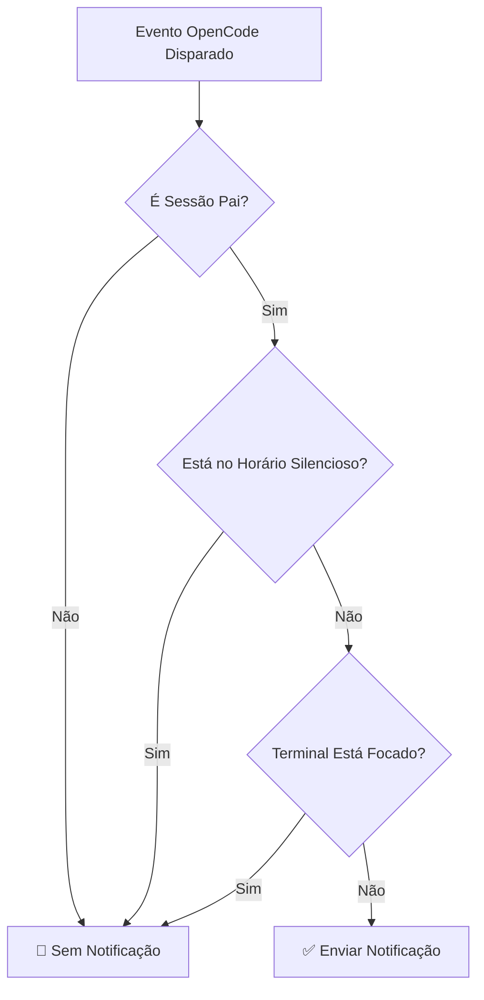

# Detalhes do Horário Silencioso: Evite Interrupções em Períodos Específicos

## O Que Você Vai Aprender

- Como habilitar o horário silencioso no arquivo de configuração para evitar interrupções durante o descanso
- Como funciona o horário silencioso e a lógica de cálculo de tempo
- Como configurar períodos que atravessam a meia-noite (como 22:00 - 08:00)
- Como o horário silencioso se relaciona com outros mecanismos de filtragem inteligente

## Sua Situação Atual

Você já passou por isso: delegou uma tarefa para a IA às 22:00 e foi descansar. Às 2:00 da manhã, a IA completou a tarefa com um som "ding" que te acordou. Ou você deixou a IA processar alguns arquivos durante o almoço, e às 12:05 a notificação tocou, interrompendo seu descanso.

::: info O Que é Horário Silencioso
O horário silencioso é uma configuração de período durante o qual o opencode-notify para de enviar todas as notificações, evitando que você receba alertas em momentos em que não deseja ser incomodado.
:::

## Quando Usar Esta Funcionalidade

- **Descanso Noturno**: Configure 22:00 - 08:00 para evitar ser acordado enquanto dorme
- **Hora do Almoço**: Configure 12:00 - 13:00 para evitar ser interrompido durante o descanso do meio-dia
- **Horário de Trabalho Focado**: Configure 09:00 - 12:00 para evitar ser interrompido por notificações durante reuniões
- **Fim de Semana de Descanso**: Configure o fim de semana inteiro como horário silencioso

O horário silencioso é mais adequado para proteger seu tempo de descanso ou trabalho focado, permitindo que a IA execute tarefas silenciosamente em segundo plano até que você esteja pronto para verificar os resultados.

## Conceito Central

O princípio de funcionamento do horário silencioso é simples:

1. **Verificação de Tempo**: Antes de cada envio de notificação, o plugin verifica se a hora atual está dentro do período de horário silencioso configurado
2. **Suporte a Períodos**: Suporta qualquer período, incluindo períodos que atravessam a meia-noite (como 22:00 - 08:00)
3. **Prioridade Média**: A verificação de horário silencioso tem prioridade inferior à verificação de sessão pai, mas superior à detecção de foco do terminal. Se a sessão atual for filha e `notifyChildSessions` for false, a verificação de horário silencioso será ignorada.

::: tip Horário Silencioso vs. Desativação Temporária
O horário silencioso é uma configuração de tempo **regularmente repetida**, como das 22:00 às 8:00 todos os dias. Se você quiser **desativar temporariamente** as notificações (por exemplo, não quer receber notificações na próxima hora), pode definir `"enabled": false` no arquivo de configuração, ou excluir o arquivo de configuração para retornar aos valores padrão.
:::

## Passo a Passo

### Etapa 1: Abra o Arquivo de Configuração

O arquivo de configuração está localizado em: `~/.config/opencode/kdco-notify.json`

Se o arquivo não existir, você pode criá-lo primeiro:

::: code-group

```bash [macOS/Linux]
vim ~/.config/opencode/kdco-notify.json
```

```powershell [Windows]
notepad $env:USERPROFILE\.config\opencode\kdco-notify.json
```

:::

Você deve ver o conteúdo do arquivo de configuração (se existir), ou um arquivo em branco.

### Etapa 2: Adicione a Configuração de Horário Silencioso

Adicione ou modifique a seção `quietHours` no arquivo de configuração:

```json
{
  "quietHours": {
    "enabled": true,
    "start": "22:00",
    "end": "08:00"
  }
}
```

**Descrição das Opções de Configuração**:

| Opção | Tipo | Valor Padrão | Descrição |
| --- | --- | --- | ---|
| `enabled` | boolean | `false` | Se o horário silencioso está habilitado |
| `start` | string | `"22:00"` | Hora de início do silêncio, formato `"HH:MM"` |
| `end` | string | `"08:00"` | Hora de término do silêncio, formato `"HH:MM"` |

### Etapa 3: Salve o Arquivo de Configuração

Salve o arquivo e saia do editor.

**Ponto de Verificação ✅**: Execute o comando a seguir para verificar se o formato do arquivo de configuração está correto:

```bash
cat ~/.config/opencode/kdco-notify.json | jq .
```

Você deve ver o conteúdo JSON formatado, sem mensagens de erro.

::: tip Não tem jq instalado?
Se o comando `jq` não estiver disponível no seu sistema, você pode pular esta verificação, ou copiar o conteúdo JSON para um [validador JSON](https://jsonlint.com/) para verificar.
:::

### Etapa 4: Reinicie o OpenCode

Após modificar o arquivo de configuração, você precisa reiniciar o OpenCode para que as alterações tenham efeito.

**Ponto de Verificação ✅**: Após a reinicialização, o OpenCode recarregará automaticamente a configuração.

### Etapa 5: Teste o Horário Silencioso

Para verificar se o horário silencioso está funcionando, você pode:

1. Definir `start` e `end` para valores próximos ao horário atual (por exemplo, agora é 14:00, defina como 13:55 - 14:05)
2. Delegar uma tarefa simples para a IA
3. Aguardar a conclusão da tarefa

Você deve ver: **durante o período de horário silencioso, nenhuma notificação será recebida**.

**Nota**: Se a hora atual não estiver dentro do período de horário silencioso, ou se `enabled` for `false`, você receberá notificações normalmente.

### Etapa 6: Restaure a Configuração Comum

Após o teste, altere a configuração de volta para o período de tempo comumente usado (por exemplo, 22:00 - 08:00):

```json
{
  "quietHours": {
    "enabled": true,
    "start": "22:00",
    "end": "08:00"
  }
}
```

Salve o arquivo de configuração e reinicie o OpenCode.

## Avisos de Erros Comuns

### Erro Comum 1: Esquecer de Habilitar o Horário Silencioso

**Problema**: Configurou `start` e `end`, mas ainda recebe notificações.

**Causa**: O campo `enabled` está `false` ou não está definido.

**Solução**: Certifique-se de que `enabled` esteja definido como `true`:

```json
{
  "quietHours": {
    "enabled": true,
    "start": "22:00",
    "end": "08:00"
  }
}
```

### Erro Comum 2: Formato de Hora Incorreto

**Problema**: A configuração não funciona ou apresenta erro ao iniciar.

**Causa**: O formato da hora não está em `"HH:MM"`, ou está usando o formato 12 horas (AM/PM).

**Exemplo Incorreto**:
```json
{
  "start": "10 PM",  // ❌ Erro: AM/PM não suportado
  "end": "8:00"      // ⚠️ Funciona, mas recomenda-se "08:00" para consistência
}
```

**Exemplo Correto**:
```json
{
  "start": "22:00",  // ✅ Correto: formato 24 horas, recomenda-se zero à esquerda
  "end": "08:00"     // ✅ Correto: formato 24 horas, recomenda-se zero à esquerda
}
```

### Erro Comum 3: Entendimento Incorreto de Horários Atravessando a Meia-noite

**Problema**: Configurou 22:00 - 08:00, mas descobriu que alguns períodos durante o dia também estão em silêncio.

**Causa**: Presumiu que `start` deve ser menor que `end`, causando erro no cálculo do período.

**Entendimento Correto**:
- 22:00 - 08:00 significa: **das 22:00 às 08:00 do dia seguinte**
- Este é um período que atravessa a meia-noite, o plugin reconhece automaticamente
- Não é 08:00 - 22:00 (se configurado assim, o dia inteiro ficaria em silêncio)

::: tip Validação de Períodos Atravessando a Meia-noite
Se você quiser validar se um período atravessando a meia-noite está configurado corretamente, pode definir no arquivo de configuração um período de teste curto (por exemplo, 10 minutos) e observar se não recebe notificações no período esperado.
:::

### Erro Comum 4: Não Reiniciar o OpenCode

**Problema**: Após modificar o arquivo de configuração, o horário silencioso ainda funciona de acordo com a configuração antiga.

**Causa**: O arquivo de configuração é carregado uma vez na inicialização do plugin, sem escuta de alterações em tempo real.

**Solução**: Após cada modificação no arquivo de configuração, você deve reiniciar o OpenCode para que as alterações tenham efeito.

## Relação Entre Horário Silencioso e Outros Mecanismos de Filtragem

A posição do horário silencioso no mecanismo de filtragem inteligente:



**Pontos Chave**:

1. **Prioridade Média do Horário Silencioso**: A verificação de sessão pai tem a maior prioridade, seguida pelo horário silencioso. Se a sessão atual for filha e `notifyChildSessions` for false, a verificação de horário silencioso será ignorada. Mas após passar na verificação de sessão pai, não será enviada notificação se estiver no horário silencioso, independentemente do foco do terminal.
2. **Independente da Detecção de Foco do Terminal**: Mesmo se o terminal não estiver focado, nenhuma notificação será enviada durante o horário silencioso
3. **Ordem de Execução**: A verificação de sessão pai é executada antes do horário silencioso. Se a verificação de sessão pai passar (ou seja, sessão atual é pai ou `notifyChildSessions` é true), então continuará para verificar o horário silencioso.

::: warning Caso Especial: Solicitações de Permissão e Perguntas
Solicitações de permissão (`permission.updated`) e perguntas (`tool.execute.before`) no código-fonte **também são afetadas pelo horário silencioso**. Isso significa que durante o horário silencioso, mesmo que a IA esteja bloqueada esperando sua autorização ou resposta, nenhuma notificação será enviada.
:::

## Exemplos de Configuração Comuns

### Exemplo 1: Descanso Noturno

Configure o período das 22:00 às 08:00 como horário silencioso:

```json
{
  "quietHours": {
    "enabled": true,
    "start": "22:00",
    "end": "08:00"
  }
}
```

### Exemplo 2: Hora do Almoço

Configure o período das 12:00 às 13:00 como horário silencioso:

```json
{
  "quietHours": {
    "enabled": true,
    "start": "12:00",
    "end": "13:00"
  }
}
```

### Exemplo 3: Horário de Trabalho Focado

Configure o período das 09:00 às 12:00 como horário silencioso (por exemplo, para não ser interrompido por notificações durante reuniões):

```json
{
  "quietHours": {
    "enabled": true,
    "start": "09:00",
    "end": "12:00"
  }
}
```

### Exemplo 4: Configuração Completa

Use o horário silencioso junto com outras configurações:

```json
{
  "enabled": true,
  "notifyChildSessions": false,
  "suppressWhenFocused": true,
  "sounds": {
    "idle": "Glass",
    "error": "Basso",
    "permission": "Submarine"
  },
  "quietHours": {
    "enabled": true,
    "start": "22:00",
    "end": "08:00"
  },
  "terminal": "ghostty"
}
```

## Resumo da Aula

O horário silencioso é uma funcionalidade importante do opencode-notify, usada para evitar ser interrompido em períodos específicos:

1. **Método de Configuração**: Configure a seção `quietHours` em `~/.config/opencode/kdco-notify.json`
2. **Formato de Hora**: Use o formato `"HH:MM"` de 24 horas, como `"22:00"` e `"08:00"`
3. **Suporte a Períodos Atravessando a Meia-noite**: Suporta períodos que atravessam a meia-noite, como `"22:00" - "08:00"` representa das 22:00 da noite até às 08:00 da manhã seguinte
4. **Ordem de Execução**: Verificação de sessão pai → Horário silencioso → Detecção de foco do terminal. O horário silencioso só entra em vigor após passar na verificação de sessão pai
5. **Necessidade de Reinicialização**: Modificações no arquivo de configuração só têm efeito após reiniciar o OpenCode

Através da configuração adequada do horário silencioso, você pode permitir que a IA execute tarefas silenciosamente durante períodos de descanso ou trabalho focado, verificando os resultados quando estiver pronto.

## Prévia da Próxima Aula

> Na próxima aula, aprenderemos sobre **[Detecção de Terminal](../terminal-detection/)**.
>
> Você vai aprender:
> - Como o opencode-notify detecta automaticamente seu terminal
> - Lista de 37+ emuladores de terminal suportados
> - Métodos para especificar manualmente o tipo de terminal
> - Princípios de implementação da detecção de foco no macOS

---

## Apêndice: Referência do Código Fonte

<details>
<summary><strong>Clique para expandir e ver a localização do código fonte</strong></summary>

> Última atualização: 2026-01-27

| Funcionalidade | Caminho do Arquivo | Número da Linha |
|--- | --- | ---|
| Verificação de horário silencioso | [`src/notify.ts`](https://github.com/kdcokenny/opencode-notify/blob/main/src/notify.ts#L181-L199) | 181-199 |
| Definição da interface de configuração | [`src/notify.ts`](https://github.com/kdcokenny/opencode-notify/blob/main/src/notify.ts#L30-L48) | 30-48 |
| Configuração padrão | [`src/notify.ts`](https://github.com/kdcokenny/opencode-notify/blob/main/src/notify.ts#L56-L68) | 56-68 |
| Verificação de silêncio no processamento de conclusão de tarefa | [`src/notify.ts`](https://github.com/kdcokenny/opencode-notify/blob/main/src/notify.ts#L262) | 262 |
| Verificação de silêncio no processamento de notificação de erro | [`src/notify.ts`](https://github.com/kdcokenny/opencode-notify/blob/main/src/notify.ts#L300) | 300 |
| Verificação de silêncio no processamento de solicitação de permissão | [`src/notify.ts`](https://github.com/kdcokenny/opencode-notify/blob/main/src/notify.ts#L323) | 323 |
| Verificação de silêncio no processamento de pergunta | [`src/notify.ts`](https://github.com/kdcokenny/opencode-notify/blob/main/src/notify.ts#L341) | 341 |

**Constantes Importantes**:

- `DEFAULT_CONFIG.quietHours`: Configuração padrão do horário silencioso (linhas 63-67)
  - `enabled: false`: Horário silencioso desabilitado por padrão
  - `start: "22:00"`: Hora de início padrão do silêncio
  - `end: "08:00"`: Hora de término padrão do silêncio

**Funções Chave**:

- `isQuietHours(config: NotifyConfig): boolean`: Verifica se a hora atual está dentro do período de horário silencioso (linhas 181-199)
  - Primeiro verifica se `config.quietHours.enabled` é `true`
  - Converte a hora atual para minutos
  - Converte as horas de início e término para minutos
  - Processa períodos que atravessam a meia-noite (`startMinutes > endMinutes`)
  - Retorna `true` se estiver no horário silencioso, `false` caso contrário

**Regras de Negócio**:

- BR-1-3: Não enviar notificações durante o horário silencioso (`notify.ts:262`)
- BR-3-2: Horário silencioso suporta períodos que atravessam a meia-noite (como 22:00-08:00) (`notify.ts:193-196`)
- BR-4-1: Não enviar notificações quando a hora atual estiver dentro do horário silencioso (`notify.ts:182-198`)
- BR-4-2: Suporta períodos que atravessam a meia-noite (como 22:00-08:00) (`notify.ts:194-196`)

</details>
