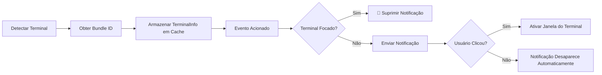
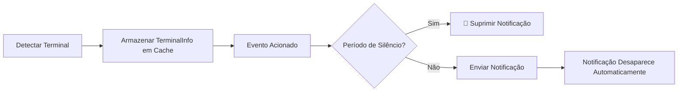

# Princípios de Detecção de Terminal: Mecanismo de Identificação Automática e Detecção de Foco Detalhada

## O Que Você Poderá Fazer Após Este Tutorial

- Entender profundamente o mecanismo de funcionamento e os princípios de implementação da detecção automática de terminal
- Dominar os detalhes técnicos da detecção de foco no macOS e da obtenção dinâmica de Bundle ID
- Aprender a substituir manualmente o tipo de terminal para resolver problemas de falha de detecção
- Compreender as diferenças de detecção entre diferentes plataformas (macOS/Windows/Linux)
- Entender as implementações de código-fonte relacionadas à detecção de terminal

## Seu Cenário Atual

Você já sabe que o opencode-notify suporta 37+ terminais e também sabe que pode especificar manualmente o tipo de terminal. Mas você quer entender mais profundamente:

- Como a detecção de terminal é implementada na camada inferior?
- Qual mecanismo é usado para a detecção de foco no macOS?
- Por que o macOS precisa obter o Bundle ID, enquanto Windows/Linux não precisam?
- Como o plugin lida quando a detecção automática falha?
- Como multiplexadores de terminal como o tmux são identificados?

Esta lição o levará a analisar o código-fonte detalhadamente, respondendo a esses detalhes técnicos.

## Ideia Central

A implementação da detecção de terminal é dividida em três camadas:

```
1. Camada de Detecção Automática: biblioteca detect-terminal identifica o tipo de terminal
    ↓
2. Camada de Adaptação de Plataforma: processamento específico para macOS/Windows/Linux
    ↓
3. Camada de Aprimoramento de Funcionalidade: detecção de foco, clique para focar, obtenção de Bundle ID
```

**Princípios-chave de Design**:

- **Detectar uma vez na inicialização**: O plugin detecta o terminal ao iniciar, armazenando o resultado em cache para todas as notificações subsequentes (otimização de desempenho)
- **Prioridade à configuração de sobrescrita**: A configuração `terminal` especificada manualmente tem prioridade sobre a detecção automática
- **Tratamento de fallback em caso de falha**: Quando a detecção falha, não impede o envio de notificações, apenas desativa a função de filtragem inteligente
- **Adaptação às diferenças de plataforma**: macOS suporta funcionalidade completa, Windows/Linux suportam notificações básicas

::: info Por que detectar apenas na inicialização?
A detecção de terminal envolve escaneamento de processos, chamadas osascript, etc. Se detectada antes de cada notificação, traria uma sobrecarga significativa de desempenho. Por isso, o plugin detecta uma vez na inicialização, armazenando em cache o objeto `TerminalInfo`, reutilizando-o em notificações subsequentes.
:::

## Fluxo Completo de Detecção de Terminal

### Análise do Código-Fonte: detectTerminalInfo()

Vamos analisar linha por linha a função de detecção principal:

```typescript
// src/notify.ts:145-164
async function detectTerminalInfo(config: NotifyConfig): Promise<TerminalInfo> {
    // Usa substituição de configuração se fornecida
    const terminalName = config.terminal || detectTerminal() || null

    if (!terminalName) {
        return { name: null, bundleId: null, processName: null }
    }

    // Obtém nome do processo para detecção de foco
    const processName = TERMINAL_PROCESS_NAMES[terminalName.toLowerCase()] || terminalName

    // Obtém Bundle ID dinamicamente do macOS (sem hardcoding!)
    const bundleId = await getBundleId(processName)

    return {
        name: terminalName,
        bundleId,
        processName,
    }
}
```

**Decomposição dos Passos**:

| Passo | Código | Descrição |
| --- | --- | --- |
| 1 | `config.terminal \|\| detectTerminal()` | Prioriza substituição de configuração, caso contrário detecta automaticamente |
| 2 | `!terminalName ? return {...}` | Retorna objeto vazio quando a detecção falha |
| 3 | `TERMINAL_PROCESS_NAMES[...]` | Consulta tabela de mapeamento para obter nome do processo macOS |
| 4 | `await getBundleId()` | macOS obtém Bundle ID dinamicamente |
| 5 | `return { name, bundleId, processName }` | Retorna informações completas do terminal |

**Estrutura de `TerminalInfo` Retornado**:

```typescript
interface TerminalInfo {
    name: string | null       // Nome do terminal, ex: "ghostty"
    bundleId: string | null   // Bundle ID macOS, ex: "com.mitchellh.ghostty"
    processName: string | null // Nome do processo macOS, ex: "Ghostty"
}
```

::: details Por que o macOS precisa de três campos?
- **name**: Nome genérico do terminal (da biblioteca detect-terminal)
- **processName**: Nome do processo no gerenciador de processos macOS (usado para detecção de foco)
- **bundleId**: Identificador único do aplicativo macOS (usado para clicar e focar)

Por exemplo:
- `name = "ghostty"` (retornado por detect-terminal)
- `processName = "Ghostty"` (encontrado na tabela de mapeamento)
- `bundleId = "com.mitchellh.ghostty"` (consulta dinâmica via osascript)
:::

## Funcionamento da Biblioteca detect-terminal

### O que é detect-terminal?

`detect-terminal` é uma biblioteca Node.js especializada em identificar emuladores de terminal, escaneando processos do sistema para identificar o terminal atualmente em execução.

**Métodos de Detecção**:

1. **Escaneamento de Processos**: Verifica a cadeia de processos pai do processo atual
2. **Detecção de Variáveis de Ambiente**: Verifica variáveis de ambiente como `TERM`, `TERM_PROGRAM`
3. **Correspondência de Nomes de Processo Conhecidos**: Compara com nomes de processo de 37+ terminais conhecidos

**Métodos de Detecção Suportados**:

```typescript
// Lógica interna do detect-terminal (simplificada)
function detect() {
    // 1. Verifica variáveis de ambiente
    if (process.env.TERM_PROGRAM) {
        return process.env.TERM_PROGRAM
    }

    // 2. Escaneia cadeia de processos pai
    const parentProcess = getParentProcess()
    if (isKnownTerminal(parentProcess.name)) {
        return parentProcess.name
    }

    // 3. Verifica variáveis de ambiente específicas
    if (process.env.TMUX) return 'tmux'
    if (process.env.VSCODE_PID) return 'vscode'

    return null
}
```

**Quantidade de Terminais Suportados**: 37+ (veja a [lista completa](https://github.com/jonschlinkert/detect-terminal#supported-terminals))

## Processamento Especial do macOS

### 1. Tabela de Mapeamento de Nomes de Processo

O código-fonte define o mapeamento de nomes de terminal para nomes de processo macOS:

```typescript
// src/notify.ts:71-84
const TERMINAL_PROCESS_NAMES: Record<string, string> = {
    ghostty: "Ghostty",
    kitty: "kitty",
    iterm: "iTerm2",
    iterm2: "iTerm2",
    wezterm: "WezTerm",
    alacritty: "Alacritty",
    terminal: "Terminal",
    apple_terminal: "Terminal",
    hyper: "Hyper",
    warp: "Warp",
    vscode: "Code",
    "vscode-insiders": "Code - Insiders",
}
```

**Por que é necessária uma tabela de mapeamento?**

- O nome do terminal retornado por detect-terminal pode estar em minúsculas ou ser uma abreviação (como `"ghostty"`)
- O nome do processo no gerenciador de processos macOS pode ter diferenças de capitalização (como `"Ghostty"`)
- Alguns terminais têm múltiplas formas de escrita (como `"iterm"` e `"iterm2"` ambos correspondem a `"iTerm2"`)

**Lógica de Mapeamento**:

```typescript
const processName = TERMINAL_PROCESS_NAMES[terminalName.toLowerCase()] || terminalName
```

- Primeiro converte o nome do terminal para minúsculas e consulta a tabela de mapeamento
- Se encontrado, usa o nome do processo mapeado
- Se não encontrado, usa o nome do terminal original

### 2. Obtenção Dinâmica de Bundle ID

**Implementação no Código-Fonte**:

```typescript
// src/notify.ts:135-137
async function getBundleId(appName: string): Promise<string | null> {
    return runOsascript(`id of application "${appName}"`)
}
```

**Comando osascript**:

```applescript
id of application "Ghostty"
-- Retorna: com.mitchellh.ghostty
```

**Por que não hardcodar o Bundle ID?**

Desvantagens do hardcoding:
- ❌ O Bundle ID pode mudar quando o terminal é atualizado
- ❌ É necessário manter manualmente uma lista de Bundle IDs para 37+ terminais
- ❌ Novos terminais precisam de atualizações de código quando são lançados

Vantagens da obtenção dinâmica:
- ✅ Adaptação automática a mudanças de versão de terminais
- ✅ Redução do custo de manutenção
- ✅ Suporte teórico a qualquer terminal macOS

### 3. Implementação de Detecção de Foco

**Implementação no Código-Fonte**:

```typescript
// src/notify.ts:139-143
async function getFrontmostApp(): Promise<string | null> {
    return runOsascript(
        'tell application "System Events" to get name of first application process whose frontmost is true',
    )
}

// src/notify.ts:166-175
async function isTerminalFocused(terminalInfo: TerminalInfo): Promise<boolean> {
    if (!terminalInfo.processName) return false
    if (process.platform !== "darwin") return false

    const frontmost = await getFrontmostApp()
    if (!frontmost) return false

    // Comparação sem distinção entre maiúsculas e minúsculas
    return frontmost.toLowerCase() === terminalInfo.processName.toLowerCase()
}
```

**Comando osascript**:

```applescript
tell application "System Events" to get name of first application process whose frontmost is true
-- Retorna: Ghostty
```

**Fluxo de Detecção**:

```
1. Verifica plataforma: retorna false imediatamente se não for macOS
    ↓
2. Verifica processName: retorna false se não houver nome de processo
    ↓
3. Obtém aplicativo em primeiro plano: consulta via osascript
    ↓
4. Compara nomes de processo: sem distinção entre maiúsculas e minúsculas
    ↓
5. Retorna resultado: true se iguais (focado), false se diferentes
```

**Uso no Fluxo de Envio de Notificações**:

```typescript
// src/notify.ts:264-265
// Verifica se o terminal está focado (suprime notificação se o usuário já estiver olhando)
if (await isTerminalFocused(terminalInfo)) return
```

Quando o terminal está em primeiro plano, o plugin suprime o envio de notificação para evitar lembretes duplicados.

## Mecanismo de Substituição de Configuração

### Quando é Necessário Substituir Manualmente?

**Cenários Aplicáveis**:

1. **Falha na detecção automática**: detect-terminal não consegue reconhecer seu terminal
2. **Cenário de terminal aninhado**: Usando Alacritty dentro do tmux, desejando identificar como tmux
3. **Resultado de detecção impreciso**: Identificado incorretamente como outro terminal

### Método de Configuração

**Arquivo de Configuração**: `~/.config/opencode/kdco-notify.json`

```json
{
  "terminal": "ghostty"
}
```

**Lógica de Prioridade** (linha 147 do código-fonte):

```typescript
const terminalName = config.terminal || detectTerminal() || null
```

**Ordem de Prioridade**:

1. **Substituição de configuração** (`config.terminal`): Prioridade mais alta
2. **Detecção automática** (`detectTerminal()`): Prioridade secundária
3. **Tratamento de fallback** (`null`): Usa null quando a detecção falha

::: tip Cenários aplicáveis para substituição de configuração
Se seu terminal puder ser reconhecido corretamente, **não é recomendado substituir manualmente**. A substituição de configuração é principalmente usada para resolver problemas de falha de detecção ou cenários especiais.
:::

## Comparação de Diferenças Entre Plataformas

### macOS

| Funcionalidade | Situação de Suporte | Método de Implementação |
| --- | --- | --- |
| Notificação nativa | ✅ | node-notifier (NSUserNotificationCenter) |
| Detecção de terminal | ✅ | Biblioteca detect-terminal |
| Detecção de foco | ✅ | Consulta de aplicativo em primeiro plano via osascript |
| Clique para focar | ✅ | Parâmetro activate do node-notifier |
| Obtenção de Bundle ID | ✅ | Consulta dinâmica via osascript |
| Som personalizado | ✅ | Parâmetro sound do node-notifier |

**Fluxo de Suporte Completo**:



### Windows

| Funcionalidade | Situação de Suporte | Método de Implementação |
| --- | --- | --- |
| Notificação nativa | ✅ | node-notifier (SnoreToast) |
| Detecção de terminal | ✅ | Biblioteca detect-terminal |
| Detecção de foco | ❌ | Limitação do sistema |
| Clique para focar | ❌ | Limitação do sistema |
| Obtenção de Bundle ID | ❌ | Windows não tem este conceito |
| Som personalizado | ❌ | Usa som padrão do sistema |

**Fluxo Simplificado**:



### Linux

| Funcionalidade | Situação de Suporte | Método de Implementação |
| --- | --- | --- |
| Notificação nativa | ✅ | node-notifier (notify-send) |
| Detecção de terminal | ✅ | Biblioteca detect-terminal |
| Detecção de foco | ❌ | Limitação do sistema |
| Clique para focar | ❌ | Limitação do sistema |
| Obtenção de Bundle ID | ❌ | Linux não tem este conceito |
| Som personalizado | ❌ | Usa som padrão do ambiente desktop |

**Fluxo idêntico ao Windows**, apenas o backend de notificação usa `notify-send`.

## Tratamento de Falha de Detecção

### Lógica do Código-Fonte

Quando a detecção falha, `detectTerminalInfo()` retorna um objeto vazio:

```typescript
if (!terminalName) {
    return { name: null, bundleId: null, processName: null }
}
```

### Impacto nas Funcionalidades de Notificação

| Funcionalidade | Comportamento Após Falha de Detecção |
| --- | --- |
| Notificação nativa | ✅ **Funciona normalmente** (não depende da detecção de terminal) |
| Detecção de foco | ❌ **Desativada** (`isTerminalFocused()` retorna false diretamente) |
| Clique para focar | ❌ **Desativado** (`bundleId` é null, parâmetro activate não é definido) |
| Período de silêncio | ✅ **Funciona normalmente** (independente da detecção de terminal) |
| Verificação de sessão pai | ✅ **Funciona normalmente** (independente da detecção de terminal) |

**Código de Exemplo**:

```typescript
// src/notify.ts:166-175
async function isTerminalFocused(terminalInfo: TerminalInfo): Promise<boolean> {
    if (!terminalInfo.processName) return false  // ← Retorna false diretamente quando a detecção falha
    if (process.platform !== "darwin") return false
    // ...
}

// src/notify.ts:238-240
if (process.platform === "darwin" && terminalInfo.bundleId) {
    notifyOptions.activate = terminalInfo.bundleId  // ← Não define quando bundleId é null
}
```

### Como Verificar o Estado de Detecção?

**Método de Depuração Temporário** (requer modificação do código-fonte):

```typescript
// Adicione na exportação do plugin em notify.ts
export const NotifyPlugin: Plugin = async (ctx) => {
    const { client } = ctx
    const config = await loadConfig()
    const terminalInfo = await detectTerminalInfo(config)

    // 👇 Adicione log de depuração
    console.log("Informações do Terminal:", JSON.stringify(terminalInfo, null, 2))

    return {
        // ...
    }
}
```

**Exemplo de Saída Normal**:

```json
{
  "name": "ghostty",
  "bundleId": "com.mitchellh.ghostty",
  "processName": "Ghostty"
}
```

**Exemplo de Falha de Detecção**:

```json
{
  "name": null,
  "bundleId": null,
  "processName": null
}
```

## Cenário Especial: Terminal tmux

### Particularidades do tmux

tmux é um multiplexador de terminal (terminal multiplexer), permitindo criar múltiplas sessões e painéis em uma janela de terminal.

**Método de Detecção**:

```typescript
// Biblioteca detect-terminal detecta tmux através de variáveis de ambiente
if (process.env.TMUX) return 'tmux'
```

**Impacto do Fluxo de Trabalho do tmux**:

Como mencionado em `terminals/index.md`, a detecção de foco não é realizada no fluxo de trabalho do tmux. Isso ocorre porque:

1. **Cenário de múltiplas janelas**: O tmux pode estar rodando em várias janelas de terminal
2. **Semântica de foco ambígua**: Não é possível determinar em qual painel do tmux o usuário está focado
3. **Consideração de experiência do usuário**: Evita suprimir notificações importantes

**Evidência do Código-Fonte** (função `handleQuestionAsked`):

```typescript
// src/notify.ts:340-341
// Proteção: apenas período de silêncio (sem verificação de foco para perguntas - fluxo de trabalho tmux)
if (isQuietHours(config)) return
```

Nota: Para eventos do tipo `question`, o código-fonte comenta explicitamente "no focus check for questions - tmux workflow".

## Melhores Práticas para Configuração Manual do Tipo de Terminal

### Escolhendo o Nome de Terminal Apropriado

**Princípio**: Use o nome padrão reconhecido pela biblioteca detect-terminal.

**Tabela de Referência Comum**:

| Seu Terminal | Valor de Configuração | Resultado de Detecção (detect-terminal) |
| --- | --- | --- |
| Ghostty | `"ghostty"` | ✅ |
| iTerm2 | `"iterm2"` ou `"iterm"` | ✅ |
| Kitty | `"kitty"` | ✅ |
| WezTerm | `"wezterm"` | ✅ |
| Alacritty | `"alacritty"` | ✅ |
| macOS Terminal.app | `"terminal"` ou `"apple_terminal"` | ✅ |
| Hyper | `"hyper"` | ✅ |
| Warp | `"warp"` | ✅ |
| VS Code Stable | `"vscode"` | ✅ |
| VS Code Insiders | `"vscode-insiders"` | ✅ |
| Windows Terminal | `"windows-terminal"` ou `"Windows Terminal"` | ⚠️ Pode precisar tentar ambos |

### Verificando se a Configuração Está Ativa

**Método 1: Verificar Logs**

Se os logs de depuração estiverem habilitados (veja acima), você deve ver:

```json
{
  "name": "ghostty",  // ← Deve ser o nome do terminal configurado
  "bundleId": "com.mitchellh.ghostty",
  "processName": "Ghostty"
}
```

**Método 2: Teste Funcional**

1. Após configurar o tipo de terminal, reinicie o OpenCode
2. Inicie uma tarefa de IA
3. Mude para outra janela (fazendo o terminal perder o foco)
4. Aguarde a conclusão da tarefa

Você deve ver: receber uma notificação e, ao clicar na notificação (macOS), a janela do terminal será focada.

## Dicas de Solução de Problemas

### Problema Comum 1: A Detecção Continua Falhando Após a Configuração

**Sintoma**: Definiu `"terminal": "ghostty"`, mas a funcionalidade de notificação está anormal.

**Etapas de Diagnóstico**:

1. **Verifique o formato JSON**:

```bash
cat ~/.config/opencode/kdco-notify.json | jq .
```

2. **Verifique a ortografia do nome do terminal**:

- Certifique-se de usar minúsculas (ex: `"ghostty"` em vez de `"Ghostty"`)
- Certifique-se de ser um nome suportado pelo detect-terminal

3. **Verifique se reiniciou o OpenCode**:

Após modificar o arquivo de configuração, o OpenCode deve ser reiniciado para que as alterações tenham efeito.

### Problema Comum 2: Detecção de Foco Imprecisa no macOS

**Sintoma**: A notificação ainda aparece quando o terminal está em primeiro plano, ou não aparece quando o terminal está em segundo plano.

**Possíveis Causas**:

1. **Nome do processo não corresponde**:

Verifique se há o nome do processo do seu terminal na tabela de mapeamento:

```typescript
const TERMINAL_PROCESS_NAMES: Record<string, string> = {
    // ... verifique se seu terminal está na lista
}
```

2. **Falha na execução do osascript**:

Teste manualmente no terminal:

```bash
osascript -e 'tell application "System Events" to get name of first application process whose frontmost is true'
```

Deve retornar o nome do aplicativo atualmente em primeiro plano (ex: `Ghostty`).

3. **Sensibilidade a maiúsculas/minúsculas**:

O código-fonte usa comparação sem distinção entre maiúsculas e minúsculas:

```typescript
return frontmost.toLowerCase() === terminalInfo.processName.toLowerCase()
```

Certifique-se de que o nome do processo na tabela de mapeamento corresponda ao nome real do processo em termos de capitalização.

### Problema Comum 3: Configuração Manual Inválida no Windows/Linux

**Sintoma**: Configurou `"terminal": "xxx"` no Windows/Linux, mas a detecção ainda falha.

**Explicação**:

A detecção de terminal do Windows/Linux depende da biblioteca detect-terminal, e a funcionalidade de substituição de configuração é implementada de forma cross-platform no código-fonte. Se a configuração for inválida, as possíveis causas são:

1. **Nome do terminal incorreto**: Certifique-se de usar um nome suportado pelo detect-terminal
2. **Terminal não na lista de suporte**: Veja a [lista completa do detect-terminal](https://github.com/jonschlinkert/detect-terminal#supported-terminals)

**Nota**: Windows/Linux não suportam detecção de foco e clique para focar, mesmo com configuração correta, afeta apenas a detecção de terminal, não habilitando essas funcionalidades.

### Problema Comum 4: Detecção Incorreta em Cenário de Terminal Aninhado

**Cenário**: Usando Alacritty dentro do tmux, desejando identificar como tmux.

**Sintoma**: A detecção automática identifica como `"alacritty"`, mas você deseja identificar como `"tmux"`.

**Solução**:

Configure manualmente `"terminal": "tmux"`:

```json
{
  "terminal": "tmux"
}
```

**Nota**: Após essa configuração, o plugin assumirá que você está usando o tmux e não realizará detecção de foco (conforme o fluxo de trabalho do tmux).

## Resumo da Lição

A detecção de terminal é a base da funcionalidade de filtragem inteligente do opencode-notify:

1. **Fluxo de Detecção**: Detecta automaticamente o terminal através da biblioteca detect-terminal ao iniciar, armazenando o resultado em cache
2. **Processamento Especial do macOS**:
   - Tabela de mapeamento de nomes de processo (`TERMINAL_PROCESS_NAMES`)
   - Obtenção dinâmica de Bundle ID (via osascript)
   - Detecção de foco (consulta de processo de aplicativo em primeiro plano)
3. **Substituição de Configuração**: Especificação manual do tipo de terminal tem prioridade sobre a detecção automática
4. **Diferenças de Plataforma**:
   - macOS: Funcionalidade completa (notificação + detecção de foco + clique para focar)
   - Windows/Linux: Funcionalidade básica de notificação
5. **Tratamento de Falha**: Quando a detecção falha, não impede o envio de notificações, apenas desativa a filtragem inteligente
6. **Cenários Especiais**: O fluxo de trabalho do tmux não suporta detecção de foco, evitando suprimir notificações importantes

**Localizações-chave do Código-Fonte**:

- `detectTerminalInfo()`: Função principal de detecção de terminal (linhas 145-164)
- `TERMINAL_PROCESS_NAMES`: Tabela de mapeamento de nomes de processo macOS (linhas 71-84)
- `getBundleId()`: Obtenção dinâmica de Bundle ID (linhas 135-137)
- `isTerminalFocused()`: Implementação de detecção de foco (linhas 166-175)

## Prévia da Próxima Lição

> Na próxima lição, aprenderemos sobre **[Uso Avançado](../advanced-usage/)**.
>
> Você aprenderá:
> - Dicas de configuração e melhores práticas
> - Configuração de ambientes multi-terminal
> - Recomendações de otimização de desempenho
> - Uso em conjunto com outros plugins OpenCode

---

## Apêndice: Referência de Código-Fonte

<details>
<summary><strong>Clique para expandir e ver a localização do código-fonte</strong></summary>

> Última atualização: 27/01/2026

| Funcionalidade | Caminho do Arquivo | Número da Linha |
| --- | --- | --- |
| Função principal de detecção de terminal | [`src/notify.ts`](https://github.com/kdcokenny/opencode-notify/blob/main/src/notify.ts#L145-L164) | 145-164 |
| Tabela de mapeamento de nomes de processo macOS | [`src/notify.ts`](https://github.com/kdcokenny/opencode-notify/blob/main/src/notify.ts#L71-L84) | 71-84 |
| Obtenção de Bundle ID macOS | [`src/notify.ts`](https://github.com/kdcokenny/opencode-notify/blob/main/src/notify.ts#L135-L137) | 135-137 |
| Detecção de aplicativo em primeiro plano macOS | [`src/notify.ts`](https://github.com/kdcokenny/opencode-notify/blob/main/src/notify.ts#L139-L143) | 139-143 |
| Detecção de foco macOS | [`src/notify.ts`](https://github.com/kdcokenny/opencode-notify/blob/main/src/notify.ts#L166-L175) | 166-175 |
| Encapsulamento de execução osascript | [`src/notify.ts`](https://github.com/kdcokenny/opencode-notify/blob/main/src/notify.ts#L120-L133) | 120-133 |
| Definição de interface de configuração | [`src/notify.ts`](https://github.com/kdcokenny/opencode-notify/blob/main/src/notify.ts#L30-L54) | 30-54 |
| Detecção de foco no tratamento de conclusão de tarefa | [`src/notify.ts`](https://github.com/kdcokenny/opencode-notify/blob/main/src/notify.ts#L265) | 265 |
| Detecção de foco no tratamento de notificação de erro | [`src/notify.ts`](https://github.com/kdcokenny/opencode-notify/blob/main/src/notify.ts#L303) | 303 |
| Detecção de foco no tratamento de solicitação de permissão | [`src/notify.ts`](https://github.com/kdcokenny/opencode-notify/blob/main/src/notify.ts#L326) | 326 |
| Configuração de foco ao clicar no macOS | [`src/notify.ts`](https://github.com/kdcokenny/opencode-notify/blob/main/src/notify.ts#L238-L240) | 238-240 |
| Detecção de terminal ao iniciar o plugin | [`src/notify.ts`](https://github.com/kdcokenny/opencode-notify/blob/main/src/notify.ts#L364) | 364 |

**Constantes-chave**:

- `TERMINAL_PROCESS_NAMES`: Tabela de mapeamento de nome de terminal para nome de processo macOS (linhas 71-84)
  - `ghostty: "Ghostty"`
  - `kitty: "kitty"`
  - `iterm: "iTerm2"` / `iterm2: "iTerm2"`
  - `wezterm: "WezTerm"`
  - `alacritty: "Alacritty"`
  - `terminal: "Terminal"` / `apple_terminal: "Terminal"`
  - `hyper: "Hyper"`
  - `warp: "Warp"`
  - `vscode: "Code"` / `"vscode-insiders": "Code - Insiders"`

**Funções-chave**:

- `detectTerminalInfo(config: NotifyConfig): Promise<TerminalInfo>`: Função principal de detecção de terminal (linhas 145-164)
  - Prioriza substituição de configuração (`config.terminal`)
  - Chama biblioteca detect-terminal para detecção automática
  - Consulta tabela de mapeamento de nomes de processo
  - Obtém Bundle ID dinamicamente (macOS)
  - Retorna objeto completo de informações do terminal

- `isTerminalFocused(terminalInfo: TerminalInfo): Promise<boolean>`: Detecta se o terminal está focado (linhas 166-175)
  - Verifica plataforma (apenas macOS)
  - Verifica se processName existe
  - Obtém aplicativo em primeiro plano (osascript)
  - Compara nomes de processo sem distinção de maiúsculas/minúsculas
  - Retorna true indicando terminal em primeiro plano

- `getBundleId(appName: string): Promise<string | null>`: Obtém dinamicamente o Bundle ID do aplicativo macOS (linhas 135-137)
  - Usa osascript para consultar identificador do aplicativo
  - Retorna formato como `"com.mitchellh.ghostty"`

- `getFrontmostApp(): Promise<string | null>`: Obtém o nome do aplicativo em primeiro plano do macOS (linhas 139-143)
  - Usa osascript para consultar System Events
  - Retorna nome do processo do aplicativo em primeiro plano

- `runOsascript(script: string): Promise<string | null>`: Executa comandos AppleScript (linhas 120-133)
  - Verificação de plataforma (apenas macOS)
  - Usa Bun.spawn para executar osascript
  - Captura e retorna saída
  - Tratamento de exceções retorna null

**Regras de Negócio**:

- BR-2-1: Usar biblioteca detect-terminal para identificar 37+ terminais (`notify.ts:147`)
- BR-2-2: Tabela de mapeamento de nome de terminal para nome de processo macOS (`notify.ts:71-84`)
- BR-2-3: Obtenção dinâmica de Bundle ID, sem hardcoding (`notify.ts:135-137`)
- BR-2-4: Detecção de sessão tmux através de variável de ambiente TMUX (implementação da biblioteca de detecção)
- BR-1-2: Suprimir notificação quando terminal estiver focado (`notify.ts:265`)
- BR-1-6: macOS suporta clicar na notificação para focar o terminal (`notify.ts:238-240`)

**Dependências Externas**:

- [detect-terminal](https://github.com/jonschlinkert/detect-terminal): Biblioteca de detecção de terminal, suporta 37+ emuladores de terminal
- [node-notifier](https://github.com/mikaelbr/node-notifier): Biblioteca de notificações nativas cross-platform
- macOS osascript: Ferramenta de linha de comando do sistema, usada para executar AppleScript

</details>
