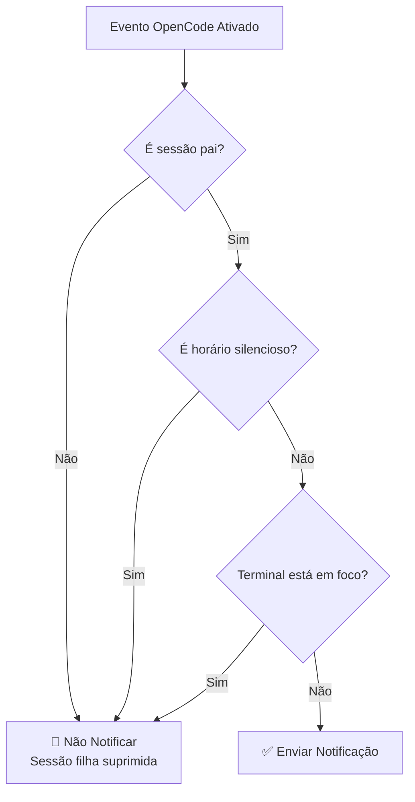
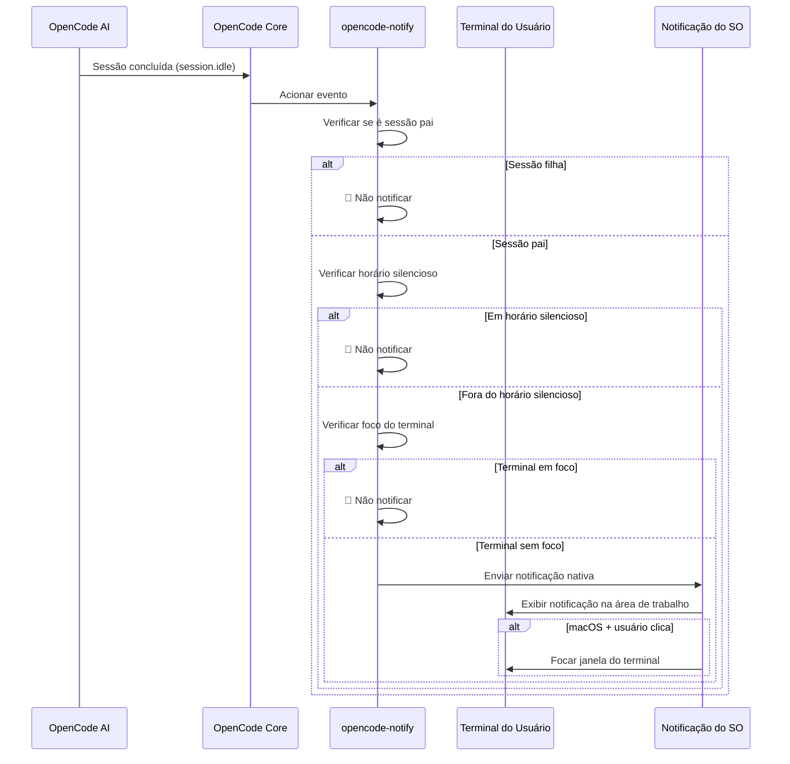

# Como Funciona: Notificações, Filtragem e Mecanismo de Ativação

## O Que Você Aprenderá

- Compreender os quatro tipos de notificações do opencode-notify e seus momentos de ativação
- Dominar o funcionamento do mecanismo de filtragem inteligente (por que não receberá muitas notificações)
- Entender o fluxo completo desde a ativação até a exibição das notificações
- Saber como ajustar o comportamento das notificações através da configuração

## Conceito Central

::: tip Filosofia de Design
O opencode-notify segue um princípio central: **"Notificar o usuário apenas quando necessário, não para cada pequeno evento"**.
:::

O funcionamento deste plugin pode ser dividido em três etapas-chave:

1. **Monitoramento** - Aguardar eventos importantes do OpenCode
2. **Filtragem** - Decidir se o evento requer notificação
3. **Envio** - Alertá-lo através de notificações nativas do sistema operacional

Compreendendo este fluxo, você entenderá por que o plugin consegue alertar no momento certo sem incomodar frequentemente como spam.

## Quatro Tipos de Notificações

O opencode-notify monitora quatro tipos de eventos do OpenCode, cada um com cenários de ativação bem definidos:

### 1. Notificação de Conclusão de Tarefa (session.idle)

**Momento de Ativação**: Quando a sessão de IA entra em estado ocioso (tarefa concluída)

| Item | Descrição |
| --- | --- |
| Título da Notificação | Ready for review |
| Conteúdo da Notificação | Título da sessão (máximo 50 caracteres) |
| Som Padrão | Glass (macOS) |

**Por Que É Importante**: Esta é a notificação mais utilizada, informando que a IA concluiu a tarefa e você pode verificar os resultados.

### 2. Notificação de Erro (session.error)

**Momento de Ativação**: Quando ocorre um erro na execução da sessão de IA

| Item | Descrição |
| --- | --- |
| Título da Notificação | Something went wrong |
| Conteúdo da Notificação | Resumo do erro (máximo 100 caracteres) |
| Som Padrão | Basso (macOS) |

**Por Que É Importante**: Erros precisam ser tratados imediatamente, caso contrário operações subsequentes podem não funcionar corretamente.

### 3. Notificação de Solicitação de Permissão (permission.updated)

**Momento de Ativação**: Quando a IA precisa de autorização do usuário para executar uma operação (como ler arquivos, acessar rede)

| Item | Descrição |
| --- | --- |
| Título da Notificação | Waiting for you |
| Conteúdo da Notificação | OpenCode needs your input |
| Som Padrão | Submarine (macOS) |

**Por Que É Importante**: A IA está bloqueada e precisa de sua autorização manual para continuar; não tratar isso fará a tarefa travar.

### 4. Notificação de Pergunta (tool.execute.before)

**Momento de Ativação**: Quando a IA usa a ferramenta `question` para fazer uma pergunta

| Item | Descrição |
| --- | --- |
| Título da Notificação | Question for you |
| Conteúdo da Notificação | OpenCode needs your input |
| Som Padrão | Submarine (macOS) |

**Por Que É Importante**: A IA precisa de mais informações para continuar, como confirmar uma decisão ou esclarecer requisitos.

::: info Prioridade dos Quatro Tipos de Notificações
Solicitações de permissão e perguntas têm a prioridade mais alta, pois a IA está completamente bloqueada nesses eventos; notificações de erro vêm em seguida, pois a tarefa já falhou; notificações de conclusão de tarefa têm prioridade relativamente baixa, pois você pode verificar quando for conveniente.
:::

## Mecanismo de Filtragem Inteligente

Este é o maior destaque do opencode-notify — através de múltiplas camadas de filtragem, garante que você receba apenas notificações que realmente precisam de atenção.

### Visão Geral das Camadas de Filtragem



### Camada 1: Verificação de Sessão Pai

**Regra**: Por padrão, notifica apenas a sessão pai (sessão raiz), não notifica sessões filhas.

**Princípio**: As tarefas do OpenCode podem ser aninhadas. Por exemplo, se você pedir à IA para "otimizar a base de código", ela pode dividir em múltiplas subtarefas:
- Sessão pai: "Otimizar toda a base de código"
- Sessão filha 1: "Otimizar diretório src/components"
- Sessão filha 2: "Otimizar diretório src/utils"

Se todas as sessões filhas notificarem, você receberá muitas notificações. O opencode-notify notifica apenas uma vez quando a sessão pai é concluída.

::: tip Quando Precisa de Notificações de Sessões Filhas?
Se você está monitorando múltiplas tarefas concorrentes de uma única IA, pode definir `notifyChildSessions: true` na configuração para habilitar notificações de sessões filhas.
:::

**Exceções Especiais**:
- **Notificação de Solicitação de Permissão**: Sempre notifica, não verifica sessão pai (porque problemas de permissão devem ser tratados)
- **Notificação de Pergunta**: Sempre notifica, não verifica sessão pai

### Camada 2: Verificação de Horário Silencioso

**Regra**: Durante o período de silêncio configurado, não envia nenhuma notificação.

**Princípio**: Evita ser incomodado durante a noite ou períodos de descanso. Exemplo de configuração:

```json
{
  "quietHours": {
    "enabled": true,
    "start": "22:00",
    "end": "08:00"
  }
}
```

**Suporte para Meia-Noite**: O horário silencioso pode atravessar a meia-noite, por exemplo, `22:00 - 08:00` será corretamente reconhecido como das 22h até as 8h do dia seguinte.

::: info Prioridade da Verificação de Horário Silencioso
A prioridade do horário silencioso é maior que todas as outras verificações. Mesmo durante o horário silencioso, condições como terminal sem foco ou sessão pai não contornarão o horário silencioso.
:::

### Camada 3: Detecção de Foco do Terminal

**Regra**: Quando a janela do terminal é a janela ativa atual, não envia notificação.

**Princípio**: Quando você está olhando para o terminal, a conclusão da tarefa pela IA será exibida diretamente na tela, não precisa de notificação adicional.

**Suporte de Plataforma**:
- ✅ **macOS**: Suporte completo, detecta aplicativo em primeiro plano através de `osascript`
- ❌ **Windows**: Não suportado
- ❌ **Linux**: Não suportado

**Mecanismo de Detecção** (macOS):
1. Usa a biblioteca `detect-terminal` para identificar seu terminal (suporta mais de 37 emuladores de terminal)
2. Consulta o macOS para obter o aplicativo em primeiro plano atual
3. Compara se corresponde ao nome do processo do seu terminal
4. Se corresponder, suprime a notificação

**Exceção Especial**:
- **Notificação de Pergunta**: Não faz verificação de foco (suporta fluxo de trabalho tmux)

::: tip Suporte para Fluxo de Trabalho tmux
Se você usa múltiplos painéis no tmux, notificações de perguntas não serão suprimidas pela detecção de foco, garantindo que você receba alertas enquanto trabalha em outros painéis.
:::

### Funcionalidade Especial do macOS: Clicar na Notificação Foca o Terminal

No macOS, as notificações têm uma funcionalidade adicional: **Ao clicar na notificação, a janela do terminal é automaticamente trazida para frente**.

**Princípio**:
1. O plugin obtém o Bundle ID do seu terminal através de `osascript` (como `com.ghostty.Ghostty`)
2. Ao enviar a notificação, define a opção `activate` para esse Bundle ID
3. Ao clicar na notificação, o sistema automaticamente foca no aplicativo correspondente

**Terminais Suportados**: Ghostty, Kitty, iTerm2, WezTerm, Alacritty, macOS Terminal, Hyper, Warp, terminal integrado do VS Code, etc.

::: info Detecção Automática de Terminal
O plugin detecta automaticamente o terminal que você está usando, sem necessidade de configuração manual. Se a detecção automática falhar, você pode especificar manualmente o campo `terminal` no arquivo de configuração.
:::

## Fluxo de Ativação de Notificações

### Diagrama de Fluxo Completo



### Prioridade de Tratamento de Eventos

Quando múltiplos eventos são acionados simultaneamente, o plugin os processa de acordo com a seguinte prioridade:

1. **Prioridade Máxima**: Solicitação de permissão (`permission.updated`) - IA bloqueada, deve ser tratada
2. **Prioridade Alta**: Notificação de erro (`session.error`) - Tarefa falhou, precisa de atenção
3. **Prioridade Baixa**: Conclusão de tarefa (`session.idle`) - Pode verificar depois
4. **Especial**: Pergunta (`tool.execute.before`) - Prioridade determinada pela necessidade real

::: tip Processamento de Notificações em Lote
Se múltiplas tarefas são concluídas simultaneamente, o plugin não enviará múltiplas notificações separadamente, mas apenas uma notificação (baseada na verificação de sessão pai). Isso evita bombardeio de notificações.
:::

## Impacto da Configuração

Através do arquivo de configuração, você pode ajustar cada camada do mecanismo de filtragem:

| Item de Configuração | Camada Afetada | Valor Padrão | Descrição |
| --- | --- | --- | --- |
| `notifyChildSessions` | Verificação de sessão pai | `false` | Definir como `true` habilita notificações de sessões filhas |
| `quietHours.enabled` | Verificação de horário silencioso | `false` | Definir como `true` habilita horário silencioso |
| `quietHours.start` | Verificação de horário silencioso | `"22:00"` | Hora de início do silêncio |
| `quietHours.end` | Verificação de horário silencioso | `"08:00"` | Hora de término do silêncio |
| `terminal` | Detecção de terminal | Não definido | Especificar manualmente o tipo de terminal (sobrescreve detecção automática) |

::: details Exemplo de Configuração

```json
{
  "enabled": true,
  "notifyChildSessions": false,
  "sounds": {
    "idle": "Glass",
    "error": "Basso",
    "permission": "Submarine"
  },
  "quietHours": {
    "enabled": true,
    "start": "22:00",
    "end": "08:00"
  },
  "terminal": "ghostty"
}
```

:::

## Resumo da Lição

O funcionamento do opencode-notify pode ser resumido em:

1. **Quatro tipos de notificações**: Conclusão de tarefa, erro, solicitação de permissão, pergunta
2. **Três camadas de filtragem inteligente**: Verificação de sessão pai → Verificação de horário silencioso → Verificação de foco do terminal
3. **Diferenças de plataforma**: macOS suporta detecção de foco e foco ao clicar, Windows/Linux suportam apenas notificações básicas
4. **Configuração flexível**: Ajustar camadas de filtragem e comportamento através do arquivo de configuração JSON

Este design garante a pontualidade e baixa interferência das notificações — alertando apenas quando você realmente precisa, sem se tornar mais um centro de notificações que precisa ser verificado frequentemente.

## Prévia da Próxima Lição

> Na próxima lição aprenderemos sobre **[Recursos da Plataforma macOS](../../platforms/macos/)**.
>
> Você aprenderá:
> - Mecanismo de detecção de foco exclusivo do macOS
> - Como configurar a funcionalidade de foco ao clicar na notificação
> - Lista completa de sons personalizados
> - Detalhes de integração com o sistema nativo do macOS

---

## Apêndice: Referência do Código-Fonte

<details>
<summary><strong>Clique para expandir e ver a localização do código-fonte</strong></summary>

> Data de atualização: 2026-01-27

| Funcionalidade | Caminho do Arquivo | Linhas |
| --- | --- | --- |
| Ponto de entrada do plugin | [`src/notify.ts`](https://github.com/kdcokenny/opencode-notify/blob/main/src/notify.ts#L357-L406) | 357-406 |
| Carregamento de configuração | [`src/notify.ts`](https://github.com/kdcokenny/opencode-notify/blob/main/src/notify.ts#L90-L114) | 90-114 |
| Configuração padrão | [`src/notify.ts`](https://github.com/kdcokenny/opencode-notify/blob/main/src/notify.ts#L56-L68) | 56-68 |
| Detecção de terminal | [`src/notify.ts`](https://github.com/kdcokenny/opencode-notify/blob/main/src/notify.ts#L145-L164) | 145-164 |
| Detecção de foco do terminal | [`src/notify.ts`](https://github.com/kdcokenny/opencode-notify/blob/main/src/notify.ts#L166-L175) | 166-175 |
| Verificação de horário silencioso | [`src/notify.ts`](https://github.com/kdcokenny/opencode-notify/blob/main/src/notify.ts#L181-L199) | 181-199 |
| Detecção de sessão pai | [`src/notify.ts`](https://github.com/kdcokenny/opencode-notify/blob/main/src/notify.ts#L205-L214) | 205-214 |
| Tratamento de conclusão de tarefa | [`src/notify.ts`](https://github.com/kdcokenny/opencode-notify/blob/main/src/notify.ts#L249-L284) | 249-284 |
| Tratamento de notificação de erro | [`src/notify.ts`](https://github.com/kdcokenny/opencode-notify/blob/main/src/notify.ts#L286-L313) | 286-313 |
| Tratamento de solicitação de permissão | [`src/notify.ts`](https://github.com/kdcokenny/opencode-notify/blob/main/src/notify.ts#L315-L334) | 315-334 |
| Tratamento de pergunta | [`src/notify.ts`](https://github.com/kdcokenny/opencode-notify/blob/main/src/notify.ts#L336-L351) | 336-351 |
| Envio de notificação | [`src/notify.ts`](https://github.com/kdcokenny/opencode-notify/blob/main/src/notify.ts#L227-L243) | 227-243 |
| Detecção de aplicativo em primeiro plano no macOS | [`src/notify.ts`](https://github.com/kdcokenny/opencode-notify/blob/main/src/notify.ts#L139-L143) | 139-143 |
| Obtenção de Bundle ID | [`src/notify.ts`](https://github.com/kdcokenny/opencode-notify/blob/main/src/notify.ts#L135-L137) | 135-137 |
| Mapeamento de nomes de processos de terminal | [`src/notify.ts`](https://github.com/kdcokenny/opencode-notify/blob/main/src/notify.ts#L71-L84) | 71-84 |

**Constantes-Chave**:

- `DEFAULT_CONFIG`: Configuração padrão (linhas 56-68)
  - `notifyChildSessions: false`: Por padrão não notifica sessões filhas
  - `sounds.idle: "Glass"`: Som de conclusão de tarefa
  - `sounds.error: "Basso"`: Som de erro
  - `sounds.permission: "Submarine"`: Som de solicitação de permissão
  - `quietHours.start: "22:00"`, `quietHours.end: "08:00"`: Horário silencioso padrão

- `TERMINAL_PROCESS_NAMES`: Mapeamento de nomes de terminal para nomes de processos do macOS (linhas 71-84)

**Funções-Chave**:

- `loadConfig()`: Carrega e mescla arquivo de configuração com configuração padrão
- `detectTerminalInfo()`: Detecta informações do terminal (nome, Bundle ID, nome do processo)
- `isTerminalFocused()`: Verifica se o terminal é o aplicativo em primeiro plano atual (macOS)
- `isQuietHours()`: Verifica se o horário atual está no período silencioso
- `isParentSession()`: Verifica se a sessão é uma sessão pai
- `sendNotification()`: Envia notificação nativa, suporta foco ao clicar no macOS
- `handleSessionIdle()`: Trata evento de conclusão de tarefa
- `handleSessionError()`: Trata evento de erro
- `handlePermissionUpdated()`: Trata evento de solicitação de permissão
- `handleQuestionAsked()`: Trata evento de pergunta

**Regras de Negócio**:

- BR-1-1: Por padrão notifica apenas sessão pai, não notifica sessões filhas (`notify.ts:256-259`)
- BR-1-2: Suprime notificação quando terminal está em foco (`notify.ts:265`)
- BR-1-3: Não envia notificação durante horário silencioso (`notify.ts:262`)
- BR-1-4: Solicitação de permissão sempre notifica, sem verificação de sessão pai (`notify.ts:319`)
- BR-1-5: Pergunta não faz verificação de foco, suporta fluxo de trabalho tmux (`notify.ts:340`)
- BR-1-6: macOS suporta foco do terminal ao clicar na notificação (`notify.ts:238-240`)

</details>
