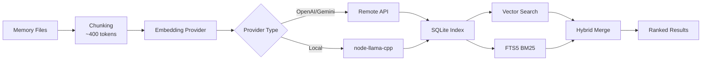

# Guia Completo do Sistema de Memória e Busca Vetorial

## O que você poderá fazer

Após concluir esta lição, você será capaz de:

- Compreender a estrutura de arquivos e o mecanismo de indexação do sistema de memória do Clawdbot
- Configurar provedores de busca vetorial (OpenAI, Gemini, local)
- Utilizar busca híbrida (BM25 + vetorial) para melhorar a precisão de recuperação
- Gerenciar índices de memória e buscas via CLI
- Ajustar o cache de Embedding e o desempenho de indexação

## Seu dilema atual

Você pode estar enfrentando estas situações:

- A IA "esquece" o conteúdo de conversas anteriores em novas sessões
- Você quer que a IA se lembre de conhecimentos persistentes e preferências
- Não sabe como fazer a IA "aprender" e lembrar informações importantes
- Não consegue encontrar o contexto relevante ao pesquisar conversas históricas

## Quando usar esta técnica

O **sistema de memória** é adequado para estes cenários:

| Cenário | Exemplo | Local de armazenamento |
|--- | --- | ---|
| Conhecimento persistente | "Sou vegetariano, lembre-se disso" | MEMORY.md |
| Notas diárias | "Progresso do trabalho de hoje e tarefas pendentes" | memory/YYYY-MM-DD.md |
| Recuperação de sessões | "Qual foi o endpoint de API discutido da última vez?" | Índice vetorial |
| Informações de configuração | "Gateway está rodando na porta 18789" | MEMORY.md |

---

## Conceitos Centrais

### Estrutura de duas camadas do sistema de memória

Clawdbot utiliza **duas camadas de dados** para gerenciar a memória de longo prazo:

| Camada | Caminho do arquivo | Propósito | Momento de carregamento |
|--- | --- | --- | ---|
| **Memória de longo prazo** | `MEMORY.md` | Conhecimentos selecionados, preferências, fatos importantes | Carregado ao iniciar a sessão principal |
| **Registro diário** | `memory/YYYY-MM-DD.md` | Notas diárias, contexto de execução | Carrega o de hoje + o de ontem |

::: info Por que duas camadas?
`MEMORY.md` é semelhante a uma "base de conhecimentos" e só é carregado na sessão principal, garantindo que informações sensíveis não vazem para conversas em grupo. `memory/*.md` é um "diário" que registra o fluxo diário para facilitar a retrospectiva.
:::

### Fluxo de trabalho da indexação vetorial



### Busca híbrida: BM25 + Vetorial

A busca vetorial é boa em "correspondência semântica", mas fraca em "correspondência exata":

| Tipo de consulta | Busca vetorial | BM25 texto completo | Busca híbrida |
|--- | --- | --- | ---|
| "Endereço IP do servidor" | ❌ Fraca | ✅ Forte | ✅ Ótima |
| "Como implantar o Gateway" | ✅ Forte | ⚠️ Média | ✅ Ótima |
| "Endpoint de API a828e60" | ❌ Fraca | ✅ Forte | ✅ Ótima |

**Fórmula de fusão**:
```javascript
finalScore = vectorWeight × vectorScore + textWeight × textScore
```

- `vectorWeight + textWeight` é automaticamente normalizado para 1.0
- Padrão: 70% vetorial + 30% palavras-chave
- Ajustável via `agents.defaults.memorySearch.query.hybrid.*`

---

## 🎒 Preparativos Antes de Começar

Antes de começar, certifique-se de:

::: warning Verificação prévia
- [ ] O Gateway está em execução ( [Iniciar Gateway](../../start/gateway-startup/) )
- [ ] O modelo de IA está configurado ( [Configuração do modelo de IA](../models-auth/) )
- [ ] Você sabe editar arquivos Markdown básicos
:::

::: tip Configuração recomendada
- Use preferencialmente embeddings OpenAI ou Gemini (rápidos e de alta qualidade)
- Embeddings locais exigem `pnpm rebuild node-llama-cpp`
- A primeira indexação pode levar alguns minutos, mas as atualizações incrementais são rápidas depois
:::

---

## Siga os Passos

### Passo 1: Criar arquivos de memória

**Por que**: A IA só indexa arquivos existentes, crie primeiro o conteúdo da memória

Crie arquivos no diretório de trabalho do agente (padrão `~/clawd`):

```bash
# Criar arquivo de memória de longo prazo
cat > ~/clawd/MEMORY.md << 'EOF'
# Preferências pessoais

- Preferências alimentares: vegetariano, não como comida picante
- Horário de trabalho: 9h às 18h
- Comandos frequentes: `clawdbot gateway status`

# Configuração importante

- Porta do Gateway: 18789
- Banco de dados: PostgreSQL 15
EOF

# Criar registro de hoje
cat > ~/clawd/memory/$(date +%Y-%m-%d).md << 'EOF'
# Progresso do trabalho de hoje

- Configuração do Gateway concluída
- Aprendido o sistema de memória
- Tarefas: ler documentação de autenticação de modelos
EOF
```

**O que você deveria ver**:

```bash
# Ver estrutura de arquivos
tree ~/clawd/
# ou
ls -la ~/clawd/
ls -la ~/clawd/memory/

# Exemplo de saída
~/clawd/
├── MEMORY.md
└── memory/
    └── 2026-01-27.md
```

### Passo 2: Verificar o status do sistema de memória

**Por que**: Confirmar o provedor de Embedding e o status do índice

```bash
# Verificação básica de status
clawdbot memory status

# Verificação profunda (detectar disponibilidade do provedor)
clawdbot memory status --deep

# Verificação profunda + reindexação forçada
clawdbot memory status --deep --index
```

**O que você deveria ver**:

```bash
✓ Memory Search enabled
  Store: ~/.clawdbot/memory/main.sqlite
  Provider: openai
  Model: text-embedding-3-small
  Fallback: openai
  Hybrid: enabled (vectorWeight: 0.7, textWeight: 0.3)
  Cache: enabled (maxEntries: 50000)
  Sources: memory
  Indexed: 2 files, 5 chunks
```

::: tip Verificação profunda
- `--deep` detecta se os embeddings OpenAI/Gemini/Local estão disponíveis
- `--index` reindexa automaticamente quando detecta um índice "sujo"
- Na primeira execução, a indexação pode levar alguns minutos
:::

### Passo 3: Acionar a indexação manualmente

**Por que**: Garantir que os arquivos de memória recém-criados sejam indexados

```bash
# Acionar indexação manualmente
clawdbot memory index

# Com log detalhado
clawdbot memory index --verbose

# Apenas para um agente específico
clawdbot memory index --agent main
```

**O que você deveria ver**:

```bash
Indexing memory for agent: main
  Provider: openai (text-embedding-3-small)
  Sources: memory
  - MEMORY.md (2 chunks)
  - memory/2026-01-27.md (3 chunks)
✓ Indexed 2 files, 5 chunks
```

### Passo 4: Testar a busca semântica

**Por que**: Verificar se a busca vetorial e a busca híbrida funcionam corretamente

```bash
# Busca básica
clawdbot memory search "vegetariano"

# Busca de correspondência exata (testar BM25)
clawdbot memory search "porta do Gateway"

# Busca semântica difusa (testar vetorial)
clawdbot memory search "o que eu gosto de comer"

# Ver resultados detalhados
clawdbot memory search "Gateway" --verbose
```

**O que você deveria ver**:

```bash
Searching memory for: "vegetariano"

Results (2):

[1] MEMORY.md:3-5 (score: 0.842)
  - Preferências alimentares: vegetariano, não como comida picante

[2] memory/2026-01-27.md:1-3 (score: 0.615)
  - Configuração do Gateway concluída
  - Aprendido o sistema de memória
```

### Passo 5: Configurar o provedor de Embedding

**Por que**: Escolher o provedor mais adequado de acordo com as necessidades (remoto vs local)

#### Opção A: OpenAI embeddings (recomendado)

Edite o arquivo de configuração `~/.clawdbot/clawdbot.json`:

```json
{
  "agents": {
    "defaults": {
      "memorySearch": {
        "enabled": true,
        "provider": "openai",
        "model": "text-embedding-3-small",
        "fallback": "openai",
        "remote": {
          "apiKey": "YOUR_OPENAI_API_KEY",
          "batch": {
            "enabled": true,
            "concurrency": 2
          }
        }
      }
    }
  }
}
```

**Vantagens**:
- Rápido e de alta qualidade
- Suporta indexação em lote (econômico)
- Adequado para preenchimento em massa

#### Opção B: Gemini embeddings

```json
{
  "agents": {
    "defaults": {
      "memorySearch": {
        "provider": "gemini",
        "model": "gemini-embedding-001",
        "remote": {
          "apiKey": "YOUR_GEMINI_API_KEY"
        },
        "fallback": "openai"
      }
    }
  }
}
```

#### Opção C: Embeddings locais (prioridade de privacidade)

```json
{
  "agents": {
    "defaults": {
      "memorySearch": {
        "provider": "local",
        "local": {
          "modelPath": "hf:ggml-org/embeddinggemma-300M-GGUF/embeddinggemma-300M-Q8_0.gguf",
          "modelCacheDir": "~/.cache/embeddings"
        },
        "fallback": "none"
      }
    }
  }
}
```

**Precauções**:

```bash
# Primeiro uso de embeddings locais requer compilação
pnpm approve-builds
# Selecionar node-llama-cpp
pnpm rebuild node-llama-cpp
```

**O que você deveria ver**:

```bash
✓ node-llama-cpp installed
✓ Local embedding model ready
```

::: warning Embeddings locais
- Na primeira vez, o modelo será baixado automaticamente (~600MB)
- Requer compilar node-llama-cpp (depende do ambiente do sistema)
- Mais lento que o remoto, mas totalmente offline e prioridade de privacidade
:::

### Passo 6: Configurar pesos de busca híbrida

**Por que**: Ajustar a proporção de pesos semânticos e de palavras-chave conforme o caso de uso

Edite a configuração:

```json
{
  "agents": {
    "defaults": {
      "memorySearch": {
        "query": {
          "hybrid": {
            "enabled": true,
            "vectorWeight": 0.7,
            "textWeight": 0.3,
            "candidateMultiplier": 4
          }
        }
      }
    }
  }
}
```

**Descrição dos parâmetros**:

| Parâmetro | Valor padrão | Descrição | Sugestão de ajuste |
|--- | --- | --- | ---|
| `vectorWeight` | 0,7 | Peso de busca semântica | Aumentar para 0,8 para consultas de "linguagem natural" |
| `textWeight` | 0,3 | Peso de busca de palavras-chave | Aumentar para 0,5 para consultas de "código/ID" |
| `candidateMultiplier` | 4 | Multiplicador de candidatos | Aumentar para 6 para melhorar o recall |

**Comparação de efeitos**:

```bash
# Testar consulta semântica
clawdbot memory search "método para implantar o Gateway"
# vectorWeight: 0,7 → encontra resultados semanticamente relevantes
# textWeight: 0,5 → encontra palavras-chave "implantar", "Gateway"

# Testar consulta exata
clawdbot memory search "endpoint de API a828e60"
# vectorWeight: 0,3 → ignora semântica, prioriza correspondência
# textWeight: 0,7 → correspondência exata de "a828e60"
```

### Passo 7: Habilitar aceleração SQLite-vec

**Por que**: Fazer pushdown de consultas vetoriais para o SQLite, evitando carregar todos os embeddings

Edite a configuração:

```json
{
  "agents": {
    "defaults": {
      "memorySearch": {
        "store": {
          "vector": {
            "enabled": true,
            "extensionPath": "/path/to/sqlite-vec"
          }
        }
      }
    }
  }
}
```

**Verificar se o sqlite-vec está disponível**:

```bash
# Ver status do índice
clawdbot memory status --deep

# Se disponível, você verá
✓ SQLite-vec extension loaded
  Vector table: chunks_vec
```

::: info SQLite-vec
- Por padrão, tenta carregar automaticamente
- Se o carregamento falhar, volta automaticamente para o cálculo JS (não afeta a funcionalidade)
- O caminho personalizado só é usado para compilações especiais ou instalações não padrão
:::

---

## Ponto de Verificação ✅

Após completar as etapas acima, verifique o seguinte:

| Item de verificação | Método de verificação | Resultado esperado |
|--- | --- | ---|
| Arquivos de memória existem | `ls ~/clawd/` | MEMORY.md e o diretório memory/ existem |
| Índice criado | `clawdbot memory status` | Mostra Indexed > 0 chunks |
| Busca funciona | `clawdbot memory search "..."` | Retorna resultados relevantes |
| Provider funciona | `clawdbot memory status --deep` | Mostra o tipo de Provider |

---

## Problemas Comuns

### Problema 1: Falha do provedor de Embedding

**Sintoma**:

```bash
✗ Memory Search disabled
  Error: No API key found for provider
```

**Solução**:

```bash
# Verificar configuração
cat ~/.clawdbot/clawdbot.json | grep -A 5 "memorySearch"

# Confirmar que apiKey existe
# Ou definir variáveis de ambiente
export OPENAI_API_KEY="sk-..."
export GEMINI_API_KEY="..."
```

### Problema 2: Não é possível carregar embeddings locais

**Sintoma**:

```bash
✗ Local embedding provider failed
  Error: Cannot find module 'node-llama-cpp'
```

**Solução**:

```bash
# Aprovar compilação
pnpm approve-builds

# Recompilar
pnpm rebuild node-llama-cpp
```

### Problema 3: O índice não atualiza

**Sintoma**:

```bash
# MEMORY.md foi modificado
# Mas os resultados de busca ainda são antigos
```

**Solução**:

```bash
# Método 1: Acionar indexação manualmente
clawdbot memory index

# Método 2: Reiniciar o Gateway (ativa indexação onSessionStart)
clawdbot gateway restart

# Método 3: Verificar monitoramento de arquivos
clawdbot memory status --verbose
# Verificar "Watch: true"
```

### Problema 4: Resultados de busca irrelevantes

**Sintoma**: Pesquisar "Gateway" mas retorna "progresso do trabalho"

**Possíveis causas**:

1. **Pesos híbridos inadequados**:
   - Consulta semântica ("como implantar") → aumentar `vectorWeight`
   - Consulta de palavras-chave ("endpoint de API") → aumentar `textWeight`

2. **Índice não totalmente atualizado**:
   ```bash
   # Reindexação forçada
   rm ~/.clawdbot/memory/main.sqlite
   clawdbot memory index
   ```

3. **Problema de granularidade de chunk**:
   - Padrão 400 tokens, pode cortar o contexto
   - Ajustar `agents.defaults.memorySearch.chunking.tokens`

---

## Resumo da Lição

Nesta lição, aprendemos:

1. **Arquitetura do sistema de memória**
   - Estrutura de dados de duas camadas (MEMORY.md + memory/*.md)
   - Índice vetorial + busca de texto completo FTS5
   - Recuperação híbrida (BM25 + vetorial)

2. **Configuração do provedor de Embedding**
   - Três opções: OpenAI/Gemini/local
   - Aceleração de indexação em lote
   - Mecanismo de fallback

3. **Uso de ferramentas CLI**
   - `clawdbot memory status` verificar status
   - `clawdbot memory index` acionar indexação
   - `clawdbot memory search` testar busca

4. **Otimização de desempenho**
   - Aceleração vetorial SQLite-vec
   - Cache de Embedding
   - Ajuste de pesos híbridos

---

## Próxima Lição

> Na próxima lição, aprenderemos sobre **[Segurança e Isolamento de Sandbox](../security-sandbox/)**.
>
> Você aprenderá:
> - Controle de permissões de ferramentas e allowlist
> - Isolamento de sessões de Sandbox
> - Mecanismo de aprovação Exec
> - Implantação Dockerizada
> - Autenticação Tailscale

---

## Apêndice: Referência do Código Fonte

<details>
<summary><strong>Clique para expandir e ver a localização do código fonte</strong></summary>

> Atualizado: 2026-01-27

| Funcionalidade | Caminho do arquivo | Número da linha |
|--- | --- | ---|
| Gerenciador de memória | [`src/memory/manager.ts`](https://github.com/moltbot/moltbot/blob/main/src/memory/manager.ts) | 1-200 |
| Busca híbrida | [`src/memory/hybrid.ts`](https://github.com/moltbot/moltbot/blob/main/src/memory/hybrid.ts) | 1-112 |
| Provedor de Embedding | [`src/memory/embeddings.ts`](https://github.com/moltbot/moltbot/blob/main/src/memory/embeddings.ts) | 1-80 |
| OpenAI embeddings | [`src/memory/embeddings-openai.ts`](https://github.com/moltbot/moltbot/blob/main/src/memory/embeddings-openai.ts) | Arquivo completo |
| Gemini embeddings | [`src/memory/embeddings-gemini.ts`](https://github.com/moltbot/moltbot/blob/main/src/memory/embeddings-gemini.ts) | Arquivo completo |
| Embeddings locais | [`src/memory/node-llama.ts`](https://github.com/moltbot/moltbot/blob/main/src/memory/node-llama.ts) | Arquivo completo |
| SQLite-vec | [`src/memory/sqlite-vec.ts`](https://github.com/moltbot/moltbot/blob/main/src/memory/sqlite-vec.ts) | Arquivo completo |
| Indexação em lote (OpenAI) | [`src/memory/batch-openai.ts`](https://github.com/moltbot/moltbot/blob/main/src/memory/batch-openai.ts) | Arquivo completo |
| Indexação em lote (Gemini) | [`src/memory/batch-gemini.ts`](https://github.com/moltbot/moltbot/blob/main/src/memory/batch-gemini.ts) | Arquivo completo |
| Gerenciador de busca | [`src/memory/manager-search.ts`](https://github.com/moltbot/moltbot/blob/main/src/memory/manager-search.ts) | Arquivo completo |
| Memory Schema | [`src/memory/memory-schema.ts`](https://github.com/moltbot/moltbot/blob/main/src/memory/memory-schema.ts) | Arquivo completo |

**Configurações principais**:
- `agents.defaults.memorySearch.enabled`: habilitar/desabilitar busca de memória
- `agents.defaults.memorySearch.provider`: provedor de Embedding ("openai", "gemini", "local")
- `agents.defaults.memorySearch.query.hybrid.vectorWeight`: peso de busca vetorial (padrão 0,7)
- `agents.defaults.memorySearch.query.hybrid.textWeight`: peso de busca BM25 (padrão 0,3)
- `agents.defaults.memorySearch.cache.enabled`: cache de Embedding (padrão true)
- `agents.defaults.memorySearch.store.vector.enabled`: aceleração SQLite-vec (padrão true)

**Funções principais**:
- `mergeHybridResults()`: fundir resultados vetoriais + BM25 (`src/memory/hybrid.ts:39-111`)
- `bm25RankToScore()`: converter classificação BM25 em pontuação (`src/memory/hybrid.ts:34-37`)
- `createEmbeddingProvider()`: criar provedor de Embedding (`src/memory/embeddings.ts`)
- `getMemorySearchManager()`: obter gerenciador de busca de memória (`src/memory/search-manager.ts`)

**Comandos CLI**:
- `clawdbot memory status`: verificar status (`src/cli/commands/memory-cli.ts`)
- `clawdbot memory index`: acionar indexação (`src/cli/commands/memory-cli.ts`)
- `clawdbot memory search`: buscar memória (`src/cli/commands/memory-cli.ts`)

</details>
