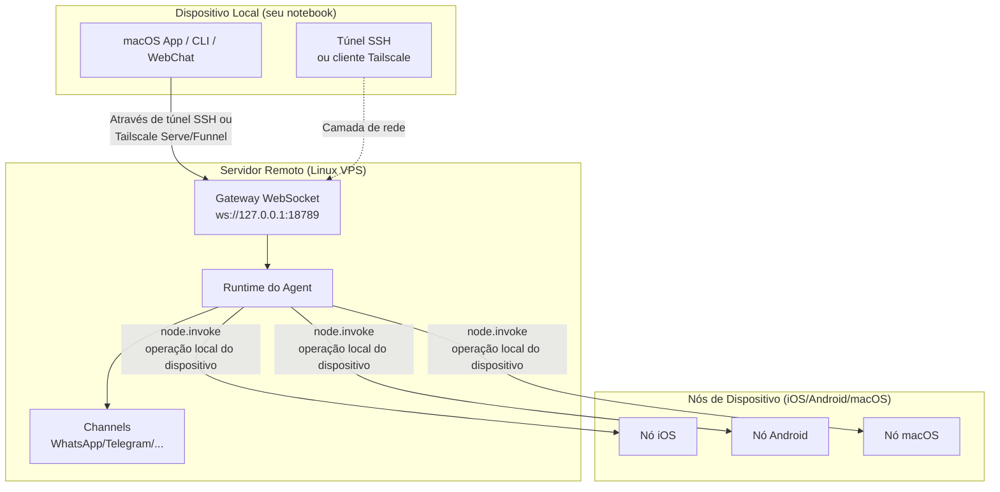

# Gateway Remoto: Acessando Clawdbot via Tailscale e Túnel SSH | Tutoriais Clawdbot

## O Que Você Vai Aprender

**Gateway Remoto** permite que você se liberte das limitações do dispositivo, implantando o assistente de IA em um servidor Linux Always-on. Ao final desta lição, você será capaz de:

- ✅ Executar o Clawdbot Gateway em servidor Linux ou VPS
- ✅ Expor com segurança o Gateway para a rede através de Tailscale Serve/Funnel
- ✅ Conectar-se ao Gateway remoto do cliente usando túnel SSH
- ✅ Entender as diferenças de arquitetura entre Gateway e Node (onde o exec é executado, onde operações de dispositivo são realizadas)
- ✅ Configurar políticas de acesso remoto seguro

## Seu Problema Atual

Você pode ter estes problemas:

- 🤔 "Meu notebook hiberna frequentemente, mas quero que o assistente de IA fique sempre online"
- 🤔 "Quero executar o Gateway em um VPS barato, mas não sei como acessá-lo com segurança"
- 🤔 "Qual é a diferença entre Tailscale Serve e Funnel? Qual devo usar?"
- 🤔 "Túnel SSH é muito chato, existe uma solução mais automatizada?"

## Quando Usar Esta Técnica

**Gateway Remoto** é adequado para os seguintes cenários:

| Cenário | Solução Recomendada | Razão |
|--- | --- | ---|
| Notebook hiberna frequentemente, precisa de IA sempre ativa | **Tailscale Serve + Linux VPS** | VPS não hiberna, acesso seguro via tailnet |
| Gateway em desktop doméstico, controle remoto de notebook | **Túnel SSH** ou **Tailscale Serve** | Sessões e configurações unificadas do Gateway |
| Precisa acessar da internet pública (teste temporário) | **Tailscale Funnel + Senha** | Exposição rápida, mas precisa de proteção por senha |
| Múltiplos dispositivos compartilham um assistente de IA | **Gateway Always-on** | Gerenciamento centralizado de todas as sessões, configurações e histórico |

::: warning Cenários Não Recomendados
Se você tem apenas um dispositivo e o carrega sempre consigo, **não precisa** de Gateway Remoto. Execute o Gateway diretamente no seu dispositivo local.
:::

## 🎒 Preparação Antes de Começar

Antes de começar, confirme:

- [ ] Completou a lição **[Iniciando o Gateway](/pt/moltbot/moltbot/start/gateway-startup/)**
- [ ] Entende comandos básicos de SSH (opcional, se usar túnel SSH)
- [ ] (se usar Tailscale) Instalou o CLI do Tailscale e fez login
- [ ] Preparou servidor Linux remoto ou VPS (Ubuntu/Debian recomendado)

---

## Ideia Central

### Arquitetura do Gateway Remoto

A ideia central do Gateway Remoto é: **Gateway é o centro de controle, o cliente é o terminal**.



### Três Conceitos Chave

| Conceito | Explicação | Exemplo |
|--- | --- | ---|
| **Host do Gateway** | Máquina que executa o serviço Gateway, possui sessões, autenticação, canais e estado | VPS Linux, desktop doméstico |
| **Cliente** | Ferramenta que se conecta ao Gateway (macOS App, CLI, WebChat) | Seu notebook, celular |
| **Nó de Dispositivo** | Periférico conectado via Gateway WebSocket, executa operações locais do dispositivo | Dispositivo iOS, dispositivo Android, modo nó macOS |

### Onde os Comandos São Executados?

Este é o ponto mais comum de confusão:

| Tipo de Operação | Onde É Executado | Razão |
|--- | --- | ---|
| Ferramenta `exec` | **Host do Gateway** | Comandos Shell são executados na máquina Gateway |
| Ferramenta `browser` | **Host do Gateway** (ou servidor de controle de navegador separado) | O navegador é iniciado na máquina Gateway |
| Operações de nó (`camera.snap`, `system.run`) | **Nó de Dispositivo** | Precisa acessar recursos locais do dispositivo |

**Resumo em uma frase**:
- Host do Gateway → Executa comandos gerais e executa IA
- Nó de Dispositivo → Executa operações locais específicas do dispositivo

---

## Siga os Passos

### Passo 1: Instalar Clawdbot no Servidor Remoto

**Por que**
Servidores Linux são mais adequados para executar serviços Gateway de longa duração.

Execute no servidor remoto:

```bash
# 1. Instalar Node.js (≥22)
curl -fsSL https://deb.nodesource.com/setup_22.x | sudo -E bash -
sudo apt-get install -y nodejs

# 2. Instalar Clawdbot
npm install -g @clawdbot/cli

# 3. Verificar instalação
clawdbot --version
```

**Você deve ver**:
```
clawdbot CLI v<version>
```

### Passo 2: Executar o wizard de onboarding

**Por que**
Configurar rapidamente as configurações básicas através do wizard interativo.

```bash
clawdbot onboard
```

Complete seguindo o wizard:
- Selecionar canais (ex: Telegram)
- Configurar modelo de IA (ex: OpenAI, Anthropic)
- Configurar autenticação do Gateway (Token ou Senha)

::: tip Recomendado
Configure `gateway.auth.mode: "password"` para facilitar a autenticação por senha ao conectar remotamente:
```bash
export CLAWDBOT_GATEWAY_PASSWORD="your-secure-password"
```
:::

**Você deve ver**:
```
✅ Gateway configured successfully
✅ Channels configured: telegram
✅ AI model configured: openai:gpt-4o-mini
```

### Passo 3: Iniciar o daemon do Gateway

**Por que**
O Gateway precisa executar continuamente em segundo plano.

```bash
# Iniciar o Gateway (bind padrão loopback: 127.0.0.1:18789)
clawdbot gateway start
```

**Você deve ver**:
```
🚀 Gateway starting...
📡 WebSocket: ws://127.0.0.1:18789
🔒 Auth mode: password
```

::: tip Usar systemd para iniciar automaticamente (Linux)
Crie arquivo de serviço `/etc/systemd/system/clawdbot.service`:

```ini
[Unit]
Description=Clawdbot Gateway
After=network.target

[Service]
Type=simple
User=your-user
ExecStart=/usr/bin/clawdbot gateway start
Restart=on-failure
RestartSec=5s
Environment="CLAWDBOT_GATEWAY_PASSWORD=your-secure-password"

[Install]
WantedBy=multi-user.target
```

Iniciar o serviço:
```bash
sudo systemctl enable clawdbot
sudo systemctl start clawdbot
sudo systemctl status clawdbot
```
:::

---

### Opção A: Usar Tailscale Serve (Recomendado)

#### Passo 4: Instalar e fazer login no Tailscale

**Por que**
Tailscale Serve fornece acesso HTTPS seguro, sem precisar de IP público.

```bash
# Instalar CLI do Tailscale
curl -fsSL https://tailscale.com/install.sh | sh

# Fazer login no Tailscale
sudo tailscale up
```

**Você deve ver**:
```
To authenticate, visit:

    https://login.tailscale.com/a/xxxxx

----------------------------------------------------
Copy the URL and open it in your browser.
```

#### Passo 5: Configurar Tailscale Serve

**Por que**
Expor o Gateway ao tailnet através de Tailscale Serve, mantendo o Gateway loopback-only (mais seguro).

Modifique o arquivo de configuração `~/.clawdbot/clawdbot.json`:

```json5
{
  "gateway": {
    "bind": "loopback",
    "tailscale": {
      "mode": "serve",
      "resetOnExit": true
    },
    "auth": {
      "mode": "password"
    }
  }
}
```

**Explicação da configuração**:
- `bind: "loopback"`: O Gateway escuta apenas no loopback local (mais seguro)
- `tailscale.mode: "serve"`: Expor ao tailnet através de Tailscale Serve
- `resetOnExit: true`: Revogar configuração Serve ao sair

#### Passo 6: Reiniciar o Gateway

**Por que**
Aplicar a nova configuração do Tailscale.

```bash
# Se estiver usando systemd
sudo systemctl restart clawdbot

# Ou reiniciar diretamente (se estiver executando em primeiro plano)
clawdbot gateway restart
```

**Você deve ver**:
```
🚀 Gateway starting...
📡 WebSocket: ws://127.0.0.1:18789
🌐 Tailscale Serve: https://your-tailnet-name.tailnet-name.ts.net/
🔒 Auth mode: password
```

#### Passo 7: Conectar do cliente

**Por que**
Verificar se o Gateway remoto está acessível.

Na máquina cliente:

1. **Garantir que você ingressou no mesmo tailnet do Tailscale**
2. **Acessar a UI de Controle**:
   ```
   https://<magicdns>/  # ou https://<tailnet-ip>:18789/
   ```
3. **Conectar WebSocket**:
   ```bash
   # Verificar conexão
   clawdbot health --url ws://<tailnet-ip>:18789 --password your-secure-password
   ```

**Você deve ver**:
```
✅ Gateway is healthy
✅ Authenticated successfully
✅ Channels: telegram (connected)
```

---

### Opção B: Usar Túnel SSH (Fallback Genérico)

#### Passo 4: Configurar autenticação por chave SSH

**Por que**
Autenticação por chave SSH é mais segura do que senha e pode automatizar conexões.

Gere par de chaves na máquina cliente:

```bash
# Gerar par de chaves (se ainda não tiver)
ssh-keygen -t rsa -b 4096 -f ~/.ssh/clawdbot_gateway
```

**Você deve ver**:
```
Generating public/private rsa key pair.
Enter passphrase (empty for no passphrase): [pressione Enter]
Enter same passphrase again: [pressione Enter]
Your identification has been saved in ~/.ssh/clawdbot_gateway
Your public key has been saved in ~/.ssh/clawdbot_gateway.pub
```

#### Passo 5: Copiar chave pública para o servidor remoto

**Por que**
Fazer o servidor remoto confiar na chave do cliente.

```bash
# Copiar chave pública para o servidor remoto
ssh-copy-id -i ~/.ssh/clawdbot_gateway.pub your-user@remote-server-ip
```

**Você deve ver**:
```
Number of key(s) added: 1
Now try logging into the machine with:   "ssh 'your-user@remote-server-ip'"
```

#### Passo 6: Criar configuração SSH

**Por que**
Simplificar o comando de conexão SSH, facilitando o uso subsequente.

Edite `~/.ssh/config` na máquina cliente:

```txt
Host clawdbot-remote
    HostName <remote-server-ip>
    User your-user
    IdentityFile ~/.ssh/clawdbot_gateway
    LocalForward 18789 127.0.0.1:18789
    ServerAliveInterval 60
    ServerAliveCountMax 3
```

**Explicação da configuração**:
- `LocalForward 18789 127.0.0.1:18789`: Encaminhar porta local 18789 para 18789 remoto
- `ServerAliveInterval 60`: Enviar heartbeat a cada 60 segundos, mantendo a conexão ativa

#### Passo 7: Estabelecer túnel SSH

**Por que**
Criar canal seguro do local para o Gateway remoto.

```bash
# Iniciar túnel SSH (executar em segundo plano)
ssh -N -f clawdbot-remote
```

**Você deve ver**:
(Sem saída, comando executando em segundo plano)

#### Passo 8: Verificar conexão

**Por que**
Confirmar que o túnel SSH e o Gateway estão funcionando corretamente.

```bash
# Verificar se a porta local foi encaminhada com sucesso
lsof -i :18789

# Testar conexão do Gateway
clawdbot health --url ws://127.0.0.1:18789 --password your-secure-password
```

**Você deve ver**:
```
COMMAND   PID   USER   FD   TYPE DEVICE SIZE/OFF NODE NAME
ssh      12345  user   4u  IPv4  0x1234      0t0  TCP *:18789 (LISTEN)

✅ Gateway is healthy
✅ Authenticated successfully
```

#### Passo 9: Iniciar automaticamente túnel SSH (macOS)

**Por que**
Iniciar automaticamente ao ligar, sem necessidade de operação manual.

Crie `~/Library/LaunchAgents/com.clawdbot.ssh-tunnel.plist`:

```xml
<?xml version="1.0" encoding="UTF-8"?>
<!DOCTYPE plist PUBLIC "-//Apple//DTD PLIST 1.0//EN" "http://www.apple.com/DTDs/PropertyList-1.0.dtd">
<plist version="1.0">
<dict>
    <key>Label</key>
    <string>com.clawdbot.ssh-tunnel</string>
    <key>ProgramArguments</key>
    <array>
        <string>/usr/bin/ssh</string>
        <string>-N</string>
        <string>-f</string>
        <string>clawdbot-remote</string>
    </array>
    <key>KeepAlive</key>
    <true/>
    <key>RunAtLoad</key>
    <true/>
</dict>
</plist>
```

Carregar Launch Agent:

```bash
launchctl bootstrap gui/$UID ~/Library/LaunchAgents/com.clawdbot.ssh-tunnel.plist
```

**Você deve ver**:
(Sem saída, túnel executando automaticamente em segundo plano)

::: tip Iniciar automaticamente no Linux (serviço systemd de usuário)
Crie `~/.config/systemd/user/clawdbot-ssh-tunnel.service`:

```ini
[Unit]
Description=Clawdbot SSH Tunnel
After=network.target

[Service]
Type=simple
ExecStart=/usr/bin/ssh -N clawdbot-remote
Restart=on-failure
RestartSec=5s

[Install]
WantedBy=default.target
```

Iniciar o serviço:
```bash
systemctl --user enable clawdbot-ssh-tunnel
systemctl --user start clawdbot-ssh-tunnel
```
:::

---

### Opção C: Usar Tailscale Funnel (Acesso Público, Requer Senha)

::: danger Aviso de Segurança
Tailscale Funnel exporá o Gateway para a internet pública!
- **Deve** usar autenticação por senha (`gateway.auth.mode: "password"`)
- **Apenas recomendado** para testes temporários, não adequado para ambiente de produção
:::

#### Passo 4: Configurar Funnel

**Por que**
Fornecer acesso HTTPS público através de Tailscale Funnel.

Modifique o arquivo de configuração `~/.clawdbot/clawdbot.json`:

```json5
{
  "gateway": {
    "bind": "loopback",
    "tailscale": {
      "mode": "funnel",
      "resetOnExit": true
    },
    "auth": {
      "mode": "password",
      "password": "${CLAWDBOT_GATEWAY_PASSWORD}"
    }
  }
}
```

**Importante**:
- `tailscale.mode: "funnel"`: Usar Tailscale Funnel (acesso público)
- `auth.mode: "password"`: Funnel exige obrigatoriamente senha (caso contrário recusa iniciar)

#### Passo 5: Reiniciar o Gateway

```bash
sudo systemctl restart clawdbot
```

**Você deve ver**:
```
🚀 Gateway starting...
🌐 Tailscale Funnel: https://your-funnel-url.ts.net/
🔒 Auth mode: password
```

#### Passo 6: Conectar da internet pública

```bash
clawdbot health --url wss://your-funnel-url.ts.net --password your-secure-password
```

---

## Ponto de Verificação ✅

Após completar qualquer uma das opções acima, verifique os seguintes pontos:

| Item de Verificação | Comando | Resultado Esperado |
|--- | --- | ---|
| Gateway está rodando | `clawdbot gateway status` | ✅ Running |
| WebSocket está acessível | `clawdbot health --url <url>` | ✅ Healthy |
| Canais estão conectados | `clawdbot channels status` | ✅ connected |
| Nós podem ser pareados | `clawdbot nodes list` | Lista de nós exibida |

---

## Alertas de Armadilhas

### Armadilha 1: Gateway vinculado a não-loopback

**Problema**:
```json5
{
  "gateway": {
    "bind": "lan"  // ❌ Perigoso!
  }
}
```

**Consequências**:
- Gateway escuta no IP público da LAN, qualquer pessoa pode conectar
- Se não estiver configurada autenticação, **risco de segurança grave**

**Abordagem correta**:
```json5
{
  "gateway": {
    "bind": "loopback",  // ✅ Mais seguro
    "tailscale": {
      "mode": "serve"  // ✅ Expor através de Tailscale Serve
    }
  }
}
```

### Armadilha 2: Tailscale Funnel sem senha configurada

**Problema**:
```json5
{
  "gateway": {
    "auth": {
      "mode": "token"  // ❌ Funnel não permite!
    },
    "tailscale": {
      "mode": "funnel"
    }
  }
}
```

**Consequências**:
- Gateway recusa iniciar (Funnel exige senha obrigatoriamente)

**Abordagem correta**:
```json5
{
  "gateway": {
    "auth": {
      "mode": "password",  // ✅ Funnel deve usar senha
      "password": "${CLAWDBOT_GATEWAY_PASSWORD}"
    },
    "tailscale": {
      "mode": "funnel"
    }
  }
}
```

### Armadilha 3: Conflito de porta no túnel SSH

**Problema**:
```
channel_setup_fwd: listen 127.0.0.1:18789: cannot listen to port: Address already in use
```

**Razão**: A porta local 18789 já está ocupada

**Solução**:
```bash
# Encontrar processo que está usando a porta
lsof -i :18789

# Terminar processo em conflito
kill -9 <PID>

# Ou usar outra porta para encaminhamento (necessário modificar URL do cliente simultaneamente)
ssh -N -L 18790:127.0.0.1:18789 clawdbot-remote
```

### Armadilha 4: macOS App Remote over SSH não funciona

**Problema**: macOS App mostra "Unable to connect to Gateway"

**Verificações**:
1. Túnel SSH está em execução:
   ```bash
   ps aux | grep "ssh -N clawdbot-remote" | grep -v grep
   ```
2. Gateway Token está configurado:
   ```bash
   launchctl getenv CLAWDBOT_GATEWAY_TOKEN
   ```
3. Configurações do App estão corretas:
   - Settings → General → "Clawdbot runs" → "On a remote machine over SSH"

**Solução**:
- Reiniciar túnel SSH
- Sair e reiniciar macOS App

---

## Resumo da Lição

### Pontos Chave

- ✅ **Gateway Remoto** mantém o assistente de IA sempre online, o cliente pode conectar a qualquer momento
- ✅ **Tailscale Serve** é a solução mais segura (tailnet-only + HTTPS + loopback)
- ✅ **Túnel SSH** é o fallback genérico (não precisa de Tailscale)
- ✅ **Tailscale Funnel** adequado para acesso público temporário (deve usar senha)
- ✅ **Host do Gateway** executa `exec` e comandos gerais, **Nó de Dispositivo** executa operações locais do dispositivo

### Comparação de Configuração

| Opção | Segurança | Escopo de Acesso | Complexidade de Configuração | Cenário Recomendado |
|--- | --- | --- | --- | ---|
| Tailscale Serve | ⭐⭐⭐⭐⭐ | Tailnet | Médio | **Recomendado**: Gateway Always-on |
| Túnel SSH | ⭐⭐⭐⭐ | Acesso via conexão SSH | Baixo | Fallback genérico, controle remoto de desktop doméstico |
| Tailscale Funnel | ⭐⭐ | Internet pública | Baixo | Teste temporário, Demo |

### Checklist de Segurança

- [ ] Gateway vinculado a `loopback`
- [ ] Tailscale Funnel usa autenticação por senha
- [ ] Chave SSH configurada (se usar túnel SSH)
- [ ] Senha definida através de variável de ambiente (não escrever no arquivo de configuração)
- [ ] Executar regularmente `clawdbot security audit`

---

## Próxima Lição

> Na próxima lição aprenderemos **[Plataforma de Skills e ClawdHub](../skills-platform/)**.
>
> Você aprenderá:
> - Conceitos do sistema de skills (Bundled/Managed/Workspace)
> - Como instalar skills de terceiros do ClawdHub
> - Como criar e gerenciar skills personalizados
> - Mecanismos de permissão e isolamento de skills

---

## Apêndice: Referência de Código Fonte

<details>
<summary><strong>Clique para expandir e ver localização do código fonte</strong></summary>

> Última atualização: 2026-01-27

| Funcionalidade | Caminho do Arquivo | Linhas |
|--- | --- | ---|
| Schema de Configuração Remota do Gateway | [`src/config/types.gateway.ts`](https://github.com/moltbot/moltbot/blob/main/src/config/types.gateway.ts) | 200-220 |
| Schema de Configuração Tailscale do Gateway | [`src/config/types.gateway.ts`](https://github.com/moltbot/moltbot/blob/main/src/config/types.gateway.ts) | 150-180 |
| Integração Tailscale | [`src/infra/tailscale.ts`](https://github.com/moltbot/moltbot/blob/main/src/infra/tailscale.ts) | 1-100 |
| Documentação de Gateway Remoto | [`docs/gateway/remote.md`](https://github.com/moltbot/moltbot/blob/main/docs/gateway/remote.md) | 1-123 |
| Documentação Tailscale | [`docs/gateway/tailscale.md`](https://github.com/moltbot/moltbot/blob/main/docs/gateway/tailscale.md) | 1-147 |
| Documentação de Acesso Remoto do macOS App | [`docs/gateway/remote-gateway-readme.md`](https://github.com/moltbot/moltbot/blob/main/docs/gateway/remote-gateway-readme.md) | 1-154 |
| Documentação de Segurança | [`docs/gateway/security.md`](https://github.com/moltbot/moltbot/blob/main/docs/gateway/security.md) | 1-100 |

**Campos de Configuração Chave**:

- `gateway.bind`: Endereço de bind do Gateway (`loopback`/`lan`/`tailnet`/`auto`)
- `gateway.tailscale.mode`: Modo Tailscale (`off`/`serve`/`funnel`)
- `gateway.auth.mode`: Modo de autenticação (`token`/`password`)
- `gateway.auth.allowTailscale`: Se permite headers de identidade Tailscale (`true`/`false`)
- `gateway.remote.url`: URL do Gateway Remoto (padrão CLI)
- `gateway.remote.token`: Token do Gateway Remoto (autenticação CLI)
- `gateway.tailscale.resetOnExit`: Revogar configuração Serve/Funnel ao sair (`true`/`false`)

**Regras de Negócios Chave**:

- Gateway vincula por padrão ao loopback (`127.0.0.1`)【fato】
- Tailscale Serve fornece acesso HTTPS tailnet-only【fato】
- Tailscale Funnel exige obrigatoriamente autenticação por senha (`gateway.auth.mode: "password"`)【fato】
- `gateway.remote.token` usado apenas para chamadas de CLI remotas, não habilita autenticação local【fato】
- `gateway.bind: "tailnet"` vincula diretamente ao IP Tailnet (sem necessidade de Serve/Funnel)【fato】

**Regras de Segurança**:

- Loopback + SSH/Tailscale Serve é a configuração padrão mais segura【fato】
- Configurações não-loopback (`lan`/`tailnet`/`custom`) devem usar token de autenticação ou senha【fato】
- Tailscale Serve pode autenticar através de identity headers (`gateway.auth.allowTailscale: true`)【fato】
- Funnel não injeta identity headers Tailscale【fato】

</details>
