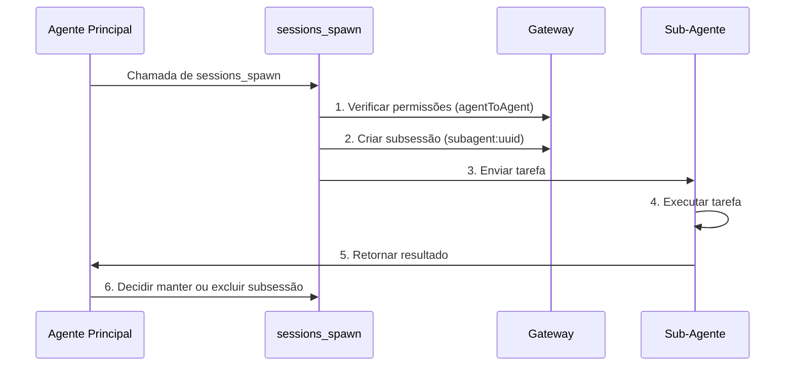

# Gerenciamento de Sessões e Múltiplos Agentes: Isolamento de Sessões, Colaboração de Sub-Agentes e Compressão de Contexto

## O Que Você Poderá Fazer

- Entender o modelo de sessões e a estrutura de chaves de sessão do Clawdbot
- Configurar o isolamento de sessões entre diferentes agentes
- Usar sub-agentes para completar tarefas isoladas
- Gerenciar a janela de contexto para evitar exceder os limites do modelo
- Dominar as melhores práticas de redefinição e compressão de sessões

## Sua Situação Atual

Quando seu assistente de IA serve simultaneamente múltiplos usuários e múltiplos canais, você pode encontrar estes problemas:

- **Interferência de sessões**: Mensagens de diferentes usuários se misturam e a IA não consegue lembrar seus respectivos históricos
- **Explosão de contexto**: Após conversas longas, o modelo começa a "perder a memória" ou as respostas ficam mais lentas
- **Confusão de subtarefas**: Quando o agente principal chama subtarefas, não há limites claros de isolamento
- **Desperdício de recursos**: Todos os agentes compartilham o mesmo conjunto de sessões, tornando os recursos de armazenamento e computação ineficientes

O **sistema de gerenciamento de sessões do Clawdbot** foi projetado para resolver estes problemas.

## Conceito Central

Uma **sessão** é a unidade abstrata central do Clawdbot. Cada sessão representa um histórico de conversação independente, com seu próprio registro de mensagens, metadados e ciclo de vida.

O Clawdbot utiliza **chaves de sessão (session key)** para identificar e isolar diferentes sessões. As chaves de sessão não apenas distinguem diferentes interlocutores de conversação (usuários, grupos, canais), mas também diferentes instâncias de agentes.

::: info O Que é uma Chave de Sessão?

Uma chave de sessão é um identificador de string que identifica exclusivamente uma sessão. Exemplos de formato:
- `agent:main:main` (sessão principal do agente principal)
- `agent:work:main` (sessão principal do agente de trabalho)
- `agent:main:whatsapp:group:123` (sessão de grupo WhatsApp)
- `cron:job-id` (sessão de tarefa agendada)

O Clawdbot roteia mensagens para o agente correto com base na chave de sessão e mantém históricos de conversação independentes.
:::

## Modelo de Sessão

### Composição da Chave de Sessão

O Clawdbot usa chaves de sessão estruturadas para identificar diferentes tipos de sessões:

| Tipo de Sessão | Formato da Chave | Exemplo | Descrição |
|--- | --- | --- | ---|
| **Sessão Principal** | `agent:<agentId>:<mainKey>` | `agent:main:main` | Sessão principal padrão de cada agente |
| **Mensagem Direta** | `agent:<agentId>:dm:<peerId>` | `agent:main:dm:+15551234567` | Isolado de acordo com a configuração `dmScope` |
| **Grupo/Canal** | `agent:<agentId>:<channel>:group:<id>` | `agent:main:whatsapp:group:123` | Grupos e canais isolados automaticamente |
| **Sub-Agente** | `agent:<agentId>:subagent:<uuid>` | `agent:main:subagent:a1b2c3d4` | Sessão isolada do sub-agente |
| **Tarefa Agendada** | `cron:<jobId>` | `cron:daily-report` | Sessão dedicada para tarefas Cron |
| **Webhook** | `hook:<uuid>` | `hook:xyz789` | Sessão acionada por Webhook |

### Armazenamento de Sessões

Os dados da sessão são armazenados em dois locais:

```bash
# Índice de sessões (metadados)
~/.clawdbot/agents/<agentId>/sessions/sessions.json

# Histórico de mensagens (um arquivo por sessão)
~/.clawdbot/agents/<agentId>/sessions/<sessionId>.jsonl
```

**sessions.json** é uma tabela de mapeamento que registra:
- Chave de sessão → Metadados da sessão (sessionId, updatedAt, model, tokens, etc.)
- Excluir estas entradas é seguro; elas serão reconstruídas automaticamente se necessário

**Arquivos JSONL** armazenam o histórico completo da conversação, com um registro de mensagem por linha.

::: tip Gateway é a Única Fonte de Verdade

Todos os estados de sessão são de propriedade do Gateway. Clientes de UI (aplicativo macOS, WebChat) devem consultar a lista de sessões e a contagem de tokens do Gateway, em vez de ler diretamente arquivos locais.

Em modo remoto, as sessões que te interessam são armazenadas no host remoto do Gateway, e não no seu Mac.
:::

## Mecanismo de Isolamento de Sessões

### Modo de Agente Único (Padrão)

Se nenhuma configuração for feita, o Clawdbot executa um único agente:
- `agentId` padrão é `main`
- Todas as sessões DM compartilham a chave de sessão principal (`agent:main:main`)
- Isso significa que **mensagens do mesmo usuário de diferentes canais entrarão na mesma sessão**

### Modo de Múltiplos Agentes

**Múltiplos Agentes = Múltiplos Cérebros Isolados**

Cada agente possui seu próprio conjunto independente de:
- **Workspace** (arquivos do espaço de trabalho, AGENTS.md, SOUL.md)
- **State directory** (configuração de autenticação, registro de modelos)
- **Session store** (histórico de chat e estado de roteamento)

#### Por Que Múltiplos Agentes?

| Cenário | Solução |
|--- | ---|
| **Múltiplos usuários compartilhando servidor** | Cada usuário tem um agente independente, sessões completamente isoladas |
| **Diferentes personalidades em diferentes canais** | WhatsApp usa agente de cotidiano, Telegram usa agente de trabalho profundo |
| **Separação de permissões** | Agente familiar com ferramentas limitadas, agente pessoal com acesso completo |
| **Diferentes ambientes** | Agente de desenvolvimento, agente de produção completamente isolados |

#### Configuração de Múltiplos Agentes

**Passo 1: Adicionar Novo Agente**

```bash
clawdbot agents add work
```

Isso criará um novo diretório de agente em `~/.clawdbot/agents/work/`.

**Passo 2: Configurar Regras de Roteamento**

Adicione `bindings` em `~/.clawdbot/clawdbot.json`:

```json5
{
  agents: {
    list: [
      { id: "home", workspace: "~/clawd-home", name: "Home" },
      { id: "work", workspace: "~/clawd-work", name: "Work" }
    ]
  },
  bindings: [
    { agentId: "home", match: { channel: "whatsapp", accountId: "personal" } },
    { agentId: "work", match: { channel: "whatsapp", accountId: "biz" } }
  ]
}
```

**Passo 3: Verificar Configuração**

```bash
clawdbot agents list --bindings
```

#### Regras de Roteamento (Correspondência Determinística)

Quando uma mensagem chega, o Clawdbot corresponde as regras na ordem **mais específico primeiro**:

1. Correspondência **peer** (id exato de DM/group/channel)
2. **guildId** (Discord)
3. **teamId** (Slack)
4. Correspondência **accountId**
5. Correspondência de nível de canal (`accountId: "*"`)
6. Fallback para o agente padrão

::: warning Atenção à Ordem dos Bindings

A ordem na lista de bindings é importante! Regras mais específicas devem vir primeiro.

Por exemplo, se você quiser rotear um DM específico para o agente `work` e outros DMs de WhatsApp para o agente `home`, você deve escrever a regra de peer primeiro:
```json5
{
  bindings: [
    { agentId: "work", match: { channel: "whatsapp", peer: { kind: "dm", id: "+15551234567" } } },
    { agentId: "home", match: { channel: "whatsapp" } }
  ]
}
```
:::

### Controle de Escopo DM

Use `session.dmScope` para controlar como as mensagens diretas são agrupadas:

| Opção | Comportamento | Cenário de Uso |
|--- | --- | ---|
| `main` (padrão) | Todos os DMs compartilham a sessão principal | Usuário único, múltiplos canais |
| `per-peer` | Isolado por ID do remetente | Ambiente de múltiplos usuários |
| `per-channel-peer` | Isolado por canal + remetente | Caixa de entrada compartilhada |

Exemplo de configuração:

```json5
{
  session: {
    dmScope: "per-channel-peer"  // Cada usuário em cada canal tem sessão independente
  }
}
```

### Links de Identidade (Identity Links)

Se o mesmo usuário usar múltiplas plataformas (como WhatsApp e Telegram), você pode fazer com que compartilhem sessões usando `session.identityLinks`:

```json5
{
  session: {
    identityLinks: {
      alice: ["telegram:123456789", "discord:987654321012345678"]
    }
  }
}
```

Assim, todas as mensagens que Alice enviar do Telegram ou Discord entrarão na sessão `agent:<agentId>:dm:alice`.

## Colaboração de Sub-Agentes

### O Que é um Sub-Agente?

Um **sub-agente** é uma instância de agente que executa em uma sessão isolada, usada para executar tarefas específicas sem afetar o contexto da sessão principal.

Cenários de uso típicos:
- **Revisão de código**: O sub-agente analisa o código e retorna um resumo
- **Extração de dados**: O sub-agente extrai informações de documentos longos
- **Tarefas paralelas**: Enquanto o agente principal espera, o sub-agente executa em segundo plano
- **Isolamento de sandbox**: Executar tarefas não confiáveis em um ambiente restrito

### Ferramenta sessions_spawn

Use a ferramenta `sessions_spawn` para criar um sub-agente:

```json
{
  "task": "Analise este documento e extraia os pontos principais",
  "label": "Análise de Documento",
  "model": "anthropic/claude-opus-4-5",
  "thinking": "detailed",
  "runTimeoutSeconds": 300,
  "cleanup": "keep"
}
```

Descrição dos parâmetros:

| Parâmetro | Tipo | Obrigatório | Descrição |
|--- | --- | --- | ---|
| `task` | string | ✅ | Descrição da tarefa do sub-agente |
| `label` | string | ❌ | Etiqueta legível da tarefa (para rastreamento) |
| `agentId` | string | ❌ | ID do agente de destino (padrão é o agente atual) |
| `model` | string | ❌ | Override do modelo |
| `thinking` | string | ❌ | Nível de pensamento (`minimal`/`standard`/`detailed`) |
| `runTimeoutSeconds` | number | ❌ | Tempo limite (segundos) |
| `cleanup` | string | ❌ | Estratégia de limpeza após concluir a tarefa (`keep`/`delete`) |

### Ciclo de Vida do Sub-Agente



**Etapas do Ciclo de Vida**:

1. **Verificação de permissões**: Se chamada entre agentes, verifica a configuração `tools.agentToAgent.allow`
2. **Criação de subsessão**: Gera uma chave única `agent:<agentId>:subagent:<uuid>`
3. **Execução da tarefa**: O sub-agente completa a tarefa na sessão isolada
4. **Retorno do resultado**: O resultado é retornado por streaming para o agente principal
5. **Estratégia de limpeza**:
   - `cleanup: "keep"`: Mantém a subsessão para inspeções posteriores
   - `cleanup: "delete"`: Exclui automaticamente a subsessão

### Configuração da Comunicação Entre Agentes

Por padrão, a comunicação entre agentes está desabilitada. Deve ser explicitamente habilitada:

```json5
{
  tools: {
    agentToAgent: {
      enabled: true,
      allow: ["home", "work", "family"]
    }
  }
}
```

Descrição de permissões:
- `enabled: false`: Desabilita completamente a comunicação entre agentes
- `allow: ["*"]`: Permite qualquer agente
- `allow: ["home", "work"]`: Permite apenas agentes específicos

::: danger Lembrete de Segurança

Os sub-agentes herdam parte do contexto do agente pai, mas **não** obtêm o histórico completo da sessão pai. Isso é tanto um recurso (economia de tokens) quanto uma limitação (sub-agentes não conhecem o contexto completo).

Para operações sensíveis, considere concluí-las na sessão principal em vez de através de sub-agentes.
:::

## Compressão de Contexto

### O Que é a Janela de Contexto?

Cada modelo de IA tem uma **janela de contexto (context window)**: o número máximo de tokens que pode ver em uma única inferência.

Conversas longas acumulam mensagens e resultados de ferramentas. Uma vez perto do limite do modelo, o Clawdbot **compactará** o histórico para liberar espaço.

### Compressão Automática

Quando uma sessão se aproxima ou excede a janela de contexto, o Clawdbot aciona automaticamente a compressão:

- **Antes da compressão**: Primeiro executa uma **atualização silenciosa de memória**, solicitando ao modelo que escreva notas persistentes no disco (se o espaço de trabalho for gravável)
- **Processo de compressão**: Resume conversas antigas em um resumo compactado, mantendo as mensagens recentes
- **Persistência**: O resultado da compressão é escrito no arquivo de histórico JSONL
- **Nova tentativa**: Repete a solicitação original usando o contexto compactado

Você verá:
- `🧹 Auto-compaction complete` (em modo detalhado)
- `/status` exibe `🧹 Compactions: <count>`

### Compressão Manual

Use o comando `/compact` para acionar manualmente a compressão:

```
/compact
```

Você pode adicionar instruções de compressão:

```
/compact Focus on decisions and open questions
```

Isso guiará a IA a se concentrar em conteúdo específico ao resumir.

### Compressão vs Poda

| Operação | Propósito | Persistência | Local |
|--- | --- | --- | ---|
| **Compressão** | Resumir conversas antigas | ✅ | Escrever em JSONL |
| **Poda** | Remover resultados de ferramentas antigas | ❌ | Apenas na memória |

::: tip Recomendações de Estratégia de Compressão

- **Compressão**: Salva resumos de informações, adequado para revisar histórico
- **Poda**: Limpeza temporária, adequado para reduzir o uso de tokens em uma única solicitação
- **/new**: Limpa completamente a sessão, para iniciar um novo tópico

Escolha a estratégia adequada de acordo com seus hábitos de uso.
:::

### Configuração de Compressão

Configure o comportamento de compressão em `~/.clawdbot/clawdbot.json`:

```json5
{
  agents: {
    defaults: {
      compaction: {
        enabled: true,
        threshold: 0.9,  // Acionar quando o uso de contexto for de 90%
        trigger: "auto"  // auto/manual
      }
    }
  }
}
```

## Siga-me: Configuração do Gerenciamento de Sessões

Vamos configurar o gerenciamento de sessões através de um cenário real.

### Cenário

Você tem um número WhatsApp e deseja:
1. Contatos pessoais usarem o agente `home` (conversa cotidiana)
2. Grupos de trabalho usarem o agente `work` (resposta profissional)
3. Ativar sub-agentes para tarefas isoladas

### Passo 1: Adicionar Dois Agentes

```bash
# Adicionar agente de casa
clawdbot agents add home

# Adicionar agente de trabalho
clawdbot agents add work
```

**Você deve ver**: Você será solicitado a inserir o caminho do espaço de trabalho e outras informações.

### Passo 2: Editar Arquivo de Configuração

Abra `~/.clawdbot/clawdbot.json` e adicione a lista de agentes e regras de binding:

```json5
{
  agents: {
    list: [
      {
        id: "home",
        name: "Home",
        workspace: "~/clawd-home",
        model: "anthropic/claude-sonnet-4-5"
      },
      {
        id: "work",
        name: "Work",
        workspace: "~/clawd-work",
        model: "anthropic/claude-opus-4-5"
      }
    ]
  },
  bindings: [
    // Mensagens pessoais roteadas para o agente home
    { agentId: "home", match: { channel: "whatsapp", peer: { kind: "dm", id: "+15551230001" } } },
    // Grupos de trabalho roteados para o agente work
    { agentId: "work", match: { channel: "whatsapp", peer: { kind: "group", id: "120363999999999999@g.us" } } },
    // Outras mensagens WhatsApp roteadas para o agente home (padrão)
    { agentId: "home", match: { channel: "whatsapp" } }
  ],
  tools: {
    agentToAgent: {
      enabled: true,
      allow: ["home", "work"]
    }
  }
}
```

### Passo 3: Reiniciar o Gateway

```bash
clawdbot gateway restart
```

**Você deve ver**: Log de inicialização do Gateway, exibindo os agentes e regras de binding carregados.

### Passo 4: Testar Chamada de Sub-Agente

Envie na sessão do agente `home`:

```
Por favor, use um sub-agente para analisar este documento PDF e extrair informações principais: /path/to/file.pdf
```

O agente deve chamar automaticamente a ferramenta `sessions_spawn` e você verá:
- Notificação de criação de sub-agente
- Processo de execução da tarefa
- Retorno do resultado

### Passo 5: Verificar Estado da Sessão

Envie no chat:

```
/status
```

**Você deve ver**:
- Uso de tokens da sessão atual
- Número de compactações
- Informações do modelo

## Ponto de Controle ✅

Após concluir a configuração, verifique os seguintes pontos:

- [ ] `clawdbot agents list --bindings` exibe as regras de binding corretas
- [ ] DMs pessoais são roteados para o agente `home`
- [ ] Grupos de trabalho são roteados para o agente `work`
- [ ] Chamadas de sub-agentes funcionam corretamente
- [ ] `/status` exibe as informações corretas da sessão

## Avisos de Problemas

### Erros Comuns

| Erro | Causa | Solução |
|--- | --- | ---|
| **Chamada entre agentes proibida** | `tools.agentToAgent.enabled` não está habilitado ou a lista `allow` não inclui o agente de destino | Verifique a configuração, certifique-se de que está habilitada e a lista permitida adicionada |
| **Falha na criação de sub-agente** | Em chamadas entre agentes, o agente de destino não está na lista permitida | Verifique a configuração `tools.agentToAgent.allow` |
| **Conflito de chave de sessão** | Ordem incorreta das regras de binding, regras mais específicas sobrescritas | Coloque as regras de peer antes das regras de canal |
| **Falha na compressão** | Contexto muito pequeno ou o modelo não suporta compressão | Verifique a janela de contexto do modelo e a configuração de compressão |

### Recomendações de Configuração

- **Comece simples**: Primeiro teste com um único agente, confirme que as funções funcionam normalmente antes de adicionar múltiplos agentes
- **Use etiquetas**: Adicione `label` claros às tarefas de sub-agentes para facilitar o rastreamento
- **Monitore o uso de tokens**: Verifique regularmente `/status` para entender o uso do contexto
- **Backup da configuração**: Faça um backup antes de modificar `clawdbot.json`

## Resumo da Lição

Esta lição apresentou o sistema de gerenciamento de sessões do Clawdbot:

- **Modelo de sessão**: Chaves de sessão, locais de armazenamento, ciclo de vida
- **Isolamento de sessão**: Modo de múltiplos agentes, controle de escopo DM, links de identidade
- **Colaboração de sub-agentes**: Ferramenta `sessions_spawn`, controle de permissões, estratégia de limpeza
- **Compressão de contexto**: Compressão automática/manual, compressão vs poda

Com uma configuração adequada de gerenciamento de sessões, você pode fazer o Clawdbot servir simultaneamente múltiplos usuários e cenários, cada um com seu próprio contexto e histórico isolados.

## Próxima Lição

> Na próxima lição, aprenderemos **[Ferramentas de Automação do Navegador](../tools-browser/)**.
>
> Você aprenderá:
> - Como configurar e usar as ferramentas do navegador
> - As limitações de segurança da automação do navegador
> - Capturas de tela e operações de formulário

---

## Apêndice: Referência do Código Fonte

<details>
<summary><strong>Clique para expandir e ver os locais do código fonte</strong></summary>

> Última atualização: 2026-01-27

| Funcionalidade | Caminho do Arquivo | Número da Linha |
|--- | --- | ---|
| Análise de chave de sessão | [`src/routing/session-key.ts`](https://github.com/moltbot/moltbot/blob/main/src/routing/session-key.ts) | 1-100 |
| Esquema de configuração de sessão | [`src/config/zod-schema.session.ts`](https://github.com/moltbot/moltbot/blob/main/src/config/zod-schema.session.ts) | 11-83 |
|--- | --- | ---|
| Funções auxiliares de ferramentas de sessão | [`src/agents/tools/sessions-helpers.ts`](https://github.com/moltbot/moltbot/blob/main/src/agents/tools/sessions-helpers.ts) | 1-328 |
| Documentação de gerenciamento de sessões | [`docs/concepts/session.md`](https://github.com/moltbot/moltbot/blob/main/docs/concepts/session.md) | 1-151 |
|--- | --- | ---|
| Documentação de compressão de contexto | [`docs/concepts/compaction.md`](https://github.com/moltbot/moltbot/blob/main/docs/concepts/compaction.md) | 1-50 |

**Constantes Chave**:
- `SESSION_ID_RE = /^[0-9a-f]{8}-[0-9a-f]{4}-[0-9a-f]{4}-[0-9a-f]{4}-[0-9a-f]{12}$/i`: Regex do ID da sessão (`sessions-helpers.ts:96`)

**Tipos Chave**:
- `SessionKind = "main" | "group" | "cron" | "hook" | "node" | "other"`: Enumeração de tipos de sessão (`sessions-helpers.ts:11`)
- `SessionListRow`: Estrutura de linha de lista de sessão (`sessions-helpers.ts:19-41`)

**Funções Chave**:
- `createSessionsSpawnTool()`: Criar ferramenta de geração de sub-agentes (`sessions-spawn-tool.ts:60-269`)
- `resolveSessionReference()`: Resolver referência de sessão (`sessions-helpers.ts:215-253`)
- `classifySessionKind()`: Classificar tipo de sessão (`sessions-helpers.ts:255-271`)
- `createAgentToAgentPolicy()`: Criar política de comunicação entre agentes (`sessions-helpers.ts:72-94`)

</details>
