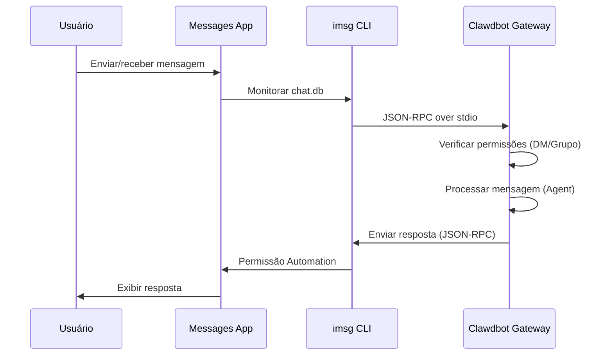

# Configuração do Canal iMessage

## O Que Você Poderá Fazer Após Concluir

- Conversar 1:1 com um assistente AI via iMessage no macOS
- Usar o assistente AI em grupos iMessage (suporta @menções)
- Configurar um usuário Mac dedicado para isolar a identidade do bot
- Acessar remotamente o iMessage em outro Mac via SSH/Tailscale
- Dominar o mecanismo de proteção de pareamento DM e lista branca de grupos

## O Seu Problema Atual

Você deseja usar o iMessage no macOS para interagir com um assistente AI, mas não sabe como:

- Instalar e configurar a ferramenta CLI `imsg`
- Conceder permissões de Full Disk Access e Automation ao Clawdbot
- Configurar um Mac local ou remoto como gateway iMessage
- Configurar múltiplas contas iMessage
- Controlar quem pode enviar mensagens ao bot

## Quando Usar Esta Técnica

**Cenários adequados para usar o canal iMessage**:

- Você usa principalmente o iMessage no macOS
- Deseja usar o iMessage local (sem depender de servidores de terceiros)
- Precisa interagir com o assistente AI via iMessage com texto e mídia
- Deseja manter a mesma experiência de conversa de outros canais (WhatsApp, Telegram)

**Cenários inadequados**:

- Sistemas não macOS (o canal iMessage só suporta macOS)
- Precisa de sincronização entre plataformas (considere usar WebChat, Telegram)
- Precisa de recursos de @menção em grupo (o iMessage não possui mecanismo nativo de menção, requer configuração manual)

## Ideia Central

Fluxo de trabalho do canal iMessage:



**Conceitos-chave**:

| Conceito | Descrição |
|--- | ---|
| **imsg CLI** | Ferramenta de terceiros que interage com o Messages via JSON-RPC over stdio |
| **Full Disk Access** | Permissão do macOS que permite ao Clawdbot ler o chat.db do Messages |
| **Permissão Automation** | Permissão do macOS que permite ao imsg enviar mensagens via API Automation |
| **chat_id** | Identificador de chat estável, usado para roteamento e isolamento de sessão |
| **pareamento** | Mecanismo de proteção DM padrão, remetentes desconhecidos precisam de aprovação |

::: tip
O canal iMessage é implementado através do CLI `imsg`, não chamando diretamente a API do Messages. O `imsg` se comunica com o Clawdbot via JSON-RPC over stdio, o que significa que ele pode rodar em um Mac remoto (via SSH).
:::

## 🎒 Preparativos Antes de Começar

Certifique-se de que você já:

- ✅ Completou o [Início Rápido](../../start/getting-started/) e instalou o Clawdbot
- ✅ O Gateway está rodando (`clawdbot gateway --port 18789`)
- ✅ Você está logado no Messages no macOS (iMessage habilitado)
- ✅ Tem acesso ao Homebrew (para instalar `imsg`)

::: warning
O canal iMessage só suporta macOS. Certifique-se de que seu Gateway está rodando no macOS ou conectado a um Mac remoto via SSH/Tailscale.
:::

## Siga-me

### Etapa 1: Instalar o CLI imsg

**Por quê**
`imsg` é a dependência central do canal iMessage, interagindo com o aplicativo Messages via JSON-RPC over stdio.

1. Instale usando Homebrew:
    ```bash
    brew install steipete/tap/imsg
    ```

**Você deve ver**:
- Após a instalação, o comando `imsg` está disponível
- Rodando `imsg --version` exibe informações da versão

**Verificar instalação**:

```bash
# Teste se o imsg está disponível
imsg chats --limit 1
```

**Você deve ver**:
- Saída de pelo menos um registro de chat (se houver)
- Ou prompt para conceder permissão de Full Disk Access

### Etapa 2: Conceder Permissão de Full Disk Access

**Por quê**
O Clawdbot precisa ler o banco de dados `chat.db` do Messages para ouvir novas mensagens.

1. Abra **Configurações do Sistema** > **Privacidade e Segurança**
2. Clique em **Acesso Total ao Disco**
3. Clique em **+** para adicionar os seguintes aplicativos:
    - `/Applications/Clawdbot.app` (se estiver usando o aplicativo macOS)
    - `/usr/local/bin/imsg` ou o caminho real do `imsg`
4. Reinicie o Gateway

::: warning
Você deve reiniciar o Gateway para que as alterações de permissão entrem em vigor!
:::

**Você deve ver**:
- Sem erros de permissão nos logs de inicialização do Gateway
- `imsg chats --limit 1` produz a lista de chats normalmente

### Etapa 3: Conceder Permissão Automation

**Por quê**
`imsg` envia mensagens através da API Automation do Apple Events e requer autorização do usuário.

1. Ao enviar uma mensagem pela primeira vez, o macOS mostrará um prompt de permissão
2. Clique em **Permitir** ou **OK**
3. Se estiver usando um usuário Mac dedicado, execute um teste uma vez na sessão desse usuário

**Testar permissão Automation**:

```bash
# Enviar mensagem de teste (substitua pelo destinatário real)
imsg send --to "+15555550123" "Test message"
```

**Você deve ver**:
- Prompt de permissão do macOS (primeira vez)
- Mensagem enviada com sucesso após conceder permissão
- Mensagem de teste exibida no aplicativo Messages

### Etapa 4: Configurar o Clawdbot

**Por quê**
Informar ao Clawdbot qual caminho `imsg` usar e onde está localizado o banco de dados do Messages.

**Método A: Configuração Simples (Mac local)**

Edite `~/.clawdbot/clawdbot.json`:

```json5
{
  channels: {
    imessage: {
      enabled: true,
      cliPath: "/usr/local/bin/imsg",
      dbPath: "/Users/<your-username>/Library/Messages/chat.db",
      dmPolicy: "pairing",
      groupPolicy: "allowlist"
    }
  }
}
```

::: info
Substitua `<your-username>` pelo seu nome de usuário real do macOS.
:::

**Método B: Configuração de Múltiplas Contas**

```json5
{
  channels: {
    imessage: {
      enabled: true,
      accounts: {
        main: {
          name: "Main Account",
          enabled: true,
          cliPath: "/usr/local/bin/imsg",
          dbPath: "/Users/alice/Library/Messages/chat.db"
        },
        bot: {
          name: "Bot Account",
          enabled: true,
          cliPath: "/path/to/imsg-bot-wrapper",  // veja Etapa 5
          dbPath: "/Users/botuser/Library/Messages/chat.db"
        }
      }
    }
  }
}
```

**Reiniciar Gateway**:

```bash
clawdbot gateway restart
```

**Você deve ver**:
- Gateway inicializa e mostra "iMessage default: enabled, configured, ..."
- Sem logs de erro de permissão ou caminho

### Etapa 5: Enviar Mensagem de Teste

**Por quê**
Verificar se a configuração está correta e se as mensagens estão sendo transmitidas normalmente.

1. Use o CLI para enviar uma mensagem de teste:
    ```bash
    clawdbot message --to imessage:+15555550123 "Hello from Clawdbot!"
    ```

**Você deve ver**:
- Mensagem recebida no aplicativo Messages
- Logs do Gateway mostram que a mensagem foi enviada
- Se um modelo AI estiver configurado, resposta da AI recebida

::: info
O formato `imessage:+15555550123` indica enviar através do canal iMessage para o número de telefone `+15555550123`. Você também pode usar endereço de email `imessage:user@example.com`.
:::

## Ponto de Verificação ✅

Verifique se a configuração foi bem-sucedida:

```bash
# Verificar status do canal
clawdbot channels status

# Deve mostrar:
# iMessage default: enabled, configured, rpc listening
```

::: info
Se você vir erros, execute `clawdbot channels status --probe` para ver informações detalhadas de diagnóstico.
:::

## Configuração Avançada

### Configurar Usuário Mac Dedicado (Opcional)

Se você deseja usar uma identidade iMessage separada (sem poluir seus Messages pessoais), pode criar um usuário Mac dedicado.

**Etapas**:

1. **Criar Apple ID dedicado**:
    - Visite [appleid.apple.com](https://appleid.apple.com)
    - Crie um novo Apple ID (por exemplo, `my-cool-bot@icloud.com`)

2. **Criar usuário macOS**:
    - Abra **Configurações do Sistema** > **Usuários e Grupos**
    - Clique em **+** para criar um novo usuário (por exemplo, `botuser`)
    - Configure login automático ou lembre a senha

3. **Fazer login na conta iMessage dedicada**:
    - Mude para o usuário `botuser`
    - Abra o aplicativo Messages
    - Faça login no iMessage com o Apple ID dedicado

4. **Habilitar Login Remoto**:
    - Abra **Configurações do Sistema** > **Geral** > **Compartilhamento**
    - Habilite **Login Remoto**

5. **Configurar login SSH sem senha**:
    ```bash
    # Teste SSH a partir do usuário principal
    ssh botuser@localhost true

    # Se precisar de senha, configure chaves SSH:
    ssh-keygen -t ed25519
    ssh-copy-id botuser@localhost
    ```

6. **Criar script wrapper SSH**:

    Crie `~/.clawdbot/scripts/imsg-bot` (use `chmod +x`):

    ```bash
    #!/usr/bin/env bash
    set -euo pipefail

    # Execute SSH interativo uma vez para aceitar chaves do host:
    #   ssh botuser@localhost true
    exec /usr/bin/ssh -o BatchMode=yes -o ConnectTimeout=5 -T botuser@localhost \
      "/usr/local/bin/imsg" "$@"
    ```

7. **Configurar o Clawdbot**:

    ```json5
    {
      channels: {
        imessage: {
          enabled: true,
          accounts: {
            bot: {
              name: "Bot",
              enabled: true,
              cliPath: "/Users/<your-username>/.clawdbot/scripts/imsg-bot",
              dbPath: "/Users/botuser/Library/Messages/chat.db"
            }
          }
        }
      }
    }
    ```

::: tip
Ao configurar pela primeira vez, execute `imsg chats --limit 1` ou `imsg send ...` uma vez na sessão `botuser` para conceder permissão Automation.
:::

### Configuração de Mac Remoto (Opcional)

Se o Gateway está rodando em Linux/VM mas o iMessage deve estar no Mac, você pode se conectar remotamente via SSH.

**Arquitetura**:

```
┌──────────────────────────────┐          SSH (imsg rpc)          ┌──────────────────────────┐
│ Gateway host (Linux/VM)      │──────────────────────────────────▶│ Mac with Messages + imsg │
│ - clawdbot gateway           │          SCP (attachments)        │ - Messages signed in     │
│ - channels.imessage.cliPath  │◀──────────────────────────────────│ - Remote Login enabled   │
└──────────────────────────────┘                                   └──────────────────────────┘
              ▲
              │ Tailscale tailnet (hostname or 100.x.y.z)
              ▼
        user@remote-mac
```

**Etapas de Configuração**:

1. **Criar wrapper SSH** (`~/.clawdbot/scripts/imsg-ssh`):

    ```bash
    #!/usr/bin/env bash
    exec ssh -T bot@remote-mac imsg "$@"
    ```

2. **Configurar o Clawdbot**:

    ```json5
    {
      channels: {
        imessage: {
          enabled: true,
          cliPath: "/Users/<your-username>/.clawdbot/scripts/imsg-ssh",
          remoteHost: "bot@remote-mac",
          includeAttachments: true,
          dbPath: "/Users/bot/Library/Messages/chat.db"
        }
      }
    }
    ```

::: info
`remoteHost` é usado para transferência de anexos via SCP. Se não definido, o Clawdbot tentará detectar automaticamente a partir do comando SSH. Configuração explícita é mais confiável.
:::

**Exemplo de configuração Tailscale**:

```bash
# SSH wrapper
#!/usr/bin/env bash
exec ssh -T bot@mac-mini.tailnet-1234.ts.net imsg "$@"
```

```json5
{
  channels: {
    imessage: {
      enabled: true,
      cliPath: "~/.clawdbot/scripts/imsg-ssh",
      remoteHost: "bot@mac-mini.tailnet-1234.ts.net",
      includeAttachments: true,
      dbPath: "/Users/bot/Library/Messages/chat.db"
    }
  }
}
```

## Detalhes da Configuração

### Configuração Básica

| Configuração | Tipo | Padrão | Descrição |
|--- | --- | --- | ---|
| `enabled` | boolean | false | Se o canal iMessage está habilitado |
| `cliPath` | string | "imsg" | Caminho do CLI imsg (pode ser um wrapper SSH) |
| `dbPath` | string | - | Caminho do chat.db do Messages |
| `remoteHost` | string | - | Host SSH (usado para transferência de anexos via SCP) |

### Política DM

| Configuração | Tipo | Padrão | Descrição |
|--- | --- | --- | ---|
| `dmPolicy` | "pairing"|"allowlist"|"open"|"disabled" | "pairing" | Política de acesso DM |
| `allowFrom` | array | [] | Lista de remetentes permitidos (handles, emails, E.164, `chat_id:*`) |

**Parear novos remetentes**:

```bash
# Listar códigos de pareamento pendentes
clawdbot pairing list imessage

# Aprovar pareamento
clawdbot pairing approve imessage <CODE>
```

::: tip
O iMessage não tem conceito de nome de usuário, usa handles (números de telefone ou endereços de email) ou chat targets (`chat_id`, `chat_guid`, `chat_identifier`).
:::

### Política de Grupo

| Configuração | Tipo | Padrão | Descrição |
|--- | --- | --- | ---|
| `groupPolicy` | "allowlist"|"open"|"disabled" | "allowlist" | Política de acesso ao grupo |
| `groupAllowFrom` | array | [] | Remetentes permitidos para acionar a IA em grupos |
| `groups` | object | {} | Configuração de grupos por chat_id |

**Exemplo de configuração de grupo**:

```json5
{
  channels: {
    imessage: {
      groupPolicy: "allowlist",
      groupAllowFrom: ["+15555550123", "alice@example.com"],
      groups: {
        "42": {
          requireMention: false,
          allowFrom: ["bob@example.com"]
        }
      }
    }
  }
}
```

### Limites de Mídia e Texto

| Configuração | Tipo | Padrão | Descrição |
|--- | --- | --- | ---|
| `includeAttachments` | boolean | false | Se os anexos devem ser incluídos no contexto |
| `mediaMaxMb` | number | 16 | Tamanho máximo do arquivo de mídia (MB) |
| `textChunkLimit` | number | 4000 | Tamanho do chunk de texto de saída (caracteres) |
| `chunkMode` | "length"|"newline" | "length" | Modo de chunk: por comprimento ou por linha vazia |

### Histórico

| Configuração | Tipo | Padrão | Descrição |
|--- | --- | --- | ---|
| `historyLimit` | number | - | Número máximo de mensagens históricas para grupos (0 desabilita) |
| `dmHistoryLimit` | number | - | Limite de histórico DM (turnos de usuário) |
| `dms["<handle>"].historyLimit` | number | - | Substituir limite de histórico DM por handle |

## Armadilhas Comuns

### Comando imsg rpc não disponível

**Sintoma**: Logs do Gateway mostram "imsg CLI does not support 'rpc' subcommand"

**Causa**: Versão do `imsg` muito antiga, não suporta subcomando `rpc`

**Solução**:

1. Atualize o `imsg`:
    ```bash
    brew upgrade steipete/tap/imsg
    ```

2. Verifique a versão:
    ```bash
    imsg rpc --help
    ```

### Problemas de Permissão Full Disk Access

**Sintoma**: `imsg chats --limit 1` não mostra saída ou erro "Permission denied"

**Solução**:

1. Certifique-se de que adicionou o Clawdbot e `imsg` ao Acesso Total ao Disco
2. Reinicie o Gateway
3. Se o problema persistir, tente reiniciar o Mac

### Problemas de Permissão Automation

**Sintoma**: Envio de mensagem sem resposta, logs do Gateway mostram timeout

**Causa**: macOS não concedeu permissão Automation

**Solução**:

1. Envie manualmente uma mensagem no aplicativo Messages
2. O macOS deve mostrar um prompt de permissão
3. Clique em **Permitir**
4. Se estiver usando um usuário Mac dedicado, mude para esse usuário e repita os passos

### Falha de Conexão com Mac Remoto

**Sintoma**: Wrapper SSH atinge timeout ou conexão recusada

**Solução**:

1. Teste a conexão SSH:
    ```bash
    ssh -T bot@remote-mac imsg --version
    ```

2. Certifique-se de que o Login Remoto está habilitado (Mac remoto)

3. Verifique as configurações de firewall e porta

4. Use Tailscale para simplificar a penetração de rede interna

## Resumo desta Lição

- Instalou a ferramenta CLI `imsg`
- Configurou permissões de Full Disk Access e Automation
- Aprendeu métodos de configuração de Mac local e remoto
- Dominou o mecanismo de pareamento DM e lista branca de grupos
- Entendeu as diferenças entre chat_id, chat_guid, chat_identifier
- Testou mensagens 1:1 e de grupo

## Próxima Lição

> Na próxima lição aprenderemos **[Canal LINE](../line/)**.
>
> Você aprenderá:
> - Como obter credenciais da API LINE Messaging
> - Configurar o endpoint Webhook do LINE Bot
> - Formatos e limites de mensagens do canal LINE
> - Diferenças de configuração com o canal iMessage

---

## Apêndice: Referência do Código-fonte

<details>
<summary><strong>Clique para expandir e ver localização do código-fonte</strong></summary>

> Data de atualização: 2026-01-27

| Funcionalidade | Caminho do Arquivo | Linhas |
|--- | --- | ---|
| Definição de tipos de configuração iMessage | [`src/config/types.imessage.ts`](https://github.com/moltbot/moltbot/blob/main/src/config/types.imessage.ts) | 1-80 |
| Resolução de contas iMessage | [`src/imessage/accounts.ts`](https://github.com/moltbot/moltbot/blob/main/src/imessage/accounts.ts) | 1-83 |
| Sondagem iMessage | [`src/imessage/probe.ts`](https://github.com/moltbot/moltbot/blob/main/src/imessage/probe.ts) | 1-92 |
| Envio iMessage | [`src/imessage/send.ts`](https://github.com/moltbot/moltbot/blob/main/src/imessage/send.ts) | 1-135 |
| Provedor de monitoramento iMessage | [`src/imessage/monitor/monitor-provider.ts`](https://github.com/moltbot/moltbot/blob/main/src/imessage/monitor/monitor-provider.ts) | 1-600+ |
| Resolução de alvo | [`src/imessage/targets.ts`](https://github.com/moltbot/moltbot/blob/main/src/imessage/targets.ts) | 1-200+ |
| Adaptador Onboarding | [`src/channels/plugins/onboarding/imessage.ts`](https://github.com/moltbot/moltbot/blob/main/src/channels/plugins/onboarding/imessage.ts) | 1-262 |
| Documentação iMessage | [`docs/channels/imessage.md`](https://github.com/moltbot/moltbot/blob/main/docs/channels/imessage.md) | 1-262 |

**Tipos-chave**:
- `IMessageConfig`: Interface completa de configuração iMessage
- `IMessageAccountConfig`: Configuração de conta única
- `IMessageService`: "imessage" | "sms" | "auto"
- `IMessageTargetKind`: "chat_id" | "chat_guid" | "chat_identifier" | "handle"

**Campos de configuração-chave**:
- `cliPath`: Caminho do CLI imsg, pode ser um caminho local ou script wrapper SSH
- `dbPath`: Caminho do banco de dados chat.db do Messages
- `remoteHost`: Host SSH (usado para transferência de anexos via SCP), detectado automaticamente ou configurado explicitamente
- `dmPolicy`: Padrão "pairing", controla acesso DM desconhecido
- `groupPolicy`: Política de acesso ao grupo, "allowlist" ou "open"
- `groups`: Configuração de grupos por `chat_id`, suporta isolamento de sessão e políticas personalizadas

**Funções-chave**:
- `probeIMessage()`: Sonda se o CLI imsg está disponível e suporta subcomando rpc (`probe.ts`)
- `sendMessageIMessage()`: Envia mensagem iMessage, suporta texto e mídia (`send.ts`)
- `monitorIMessageProvider()`: Monitora fluxo de eventos iMessage (`monitor-provider.ts`)
- `parseIMessageTarget()`: Resolve endereço de destino (chat_id, handle, email, etc.) (`targets.ts`)

**Mecanismo de comunicação**:
- Comunicação JSON-RPC over stdio através do subcomando `imsg rpc`
- Cada conta tem uma instância independente de cliente RPC (`createIMessageRpcClient`)
- Eventos de mensagem são transmitidos ao Gateway via stream `monitor-provider.ts`
- Ao enviar mensagens, suporta `chat_id` (recomendado), `chat_guid`, `chat_identifier` ou handle direto

**Suporte a múltiplas contas**:
- Use o map `channels.imessage.accounts` para configurar múltiplas contas
- Cada conta tem configuração independente de `cliPath`, `dbPath` e política
- ID de conta padrão é "default", pode ser especificado pelo campo `accountId`

</details>
