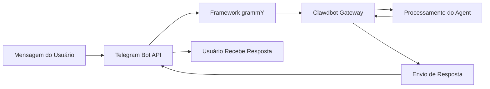

# Configuração e Uso do Canal Telegram

## O Que Você Vai Aprender

- 🤖 Criar um Bot no Telegram e obter o Bot Token
- ⚙️ Configurar o canal Telegram para conectar ao Clawdbot
- 🔒 Controlar permissões de acesso para DM e grupos (mecanismo de pareamento e lista de permissões)
- 📡 Definir regras de menção e estratégias de resposta em grupos
- 🔌 Configurar o modo Webhook (opcional)
- 🎯 Usar recursos do Telegram Bot API (botões inline, tópicos, respostas)

## Seu Problema Atual

Você já está usando o Clawdbot no Telegram, mas encontrou esses problemas:

- ❌ Não sabe como configurar corretamente o Bot Token
- ❌ Estranhos enviam mensagens ao Bot, mas ele não responde
- ❌ Em grupos, o Bot não responde a mensagens não mencionadas
- ❌ Quer controlar precisamente quem pode acessar o Bot, mas não sabe como configurar
- ❌ Ouviu falar sobre as diferenças entre Webhook e Long-polling, mas não sabe qual escolher

Este tutorial vai ajudá-lo a resolver esses problemas passo a passo.

## Quando Usar Esta Solução

Cenários adequados para usar o canal Telegram:

- ✅ Você já usa o Telegram e deseja conversar com o assistente de IA nesta plataforma
- ✅ Você precisa que o Bot responda a usuários ou comandos específicos em grupos
- ✅ Você deseja usar recursos especiais do Telegram Bot API (botões inline, tópicos Forum)
- ✅ O ambiente de rede do seu servidor é adequado para Long-polling ou Webhook

**Se você usa principalmente WhatsApp ou outros canais**: pode pular esta aula e focar no canal que você usa.

## 🎒 Preparativos Antes de Começar

Antes de começar, certifique-se de que você já:

- [ ] Concluiu o tutorial [Início Rápido](../../start/getting-started/), Clawdbot está instalado e pode ser iniciado
- [ ] Tem uma conta do Telegram (não precisa ser usuário Premium)
- [ ] Entende os conceitos básicos do Telegram Bot (Bot, Token, modo de privacidade)

::: info Localização do Arquivo de Configuração
Por padrão, o arquivo de configuração do Clawdbot está localizado em:
- **Linux/macOS**: `~/.clawdbot/clawdbot.json`
- **Windows**: `%USERPROFILE%\.clawdbot\clawdbot.json`
:::

## Ideia Central

### Bot API Telegram vs Outros Canais

Ao contrário de outras plataformas de mensagens instantâneas, o Telegram usa a arquitetura **Bot API**:

| Recurso | Telegram | WhatsApp | Slack |
|--- | --- | --- | ---|
| Método de Conexão | Bot API (HTTP) | Web Client | Bot API + WebSocket |
| Modo de Mensagem | Push (Bot envia ativamente) | Pull (escuta Web Client) | Pull (escuta WebSocket) |
| Modo de Privacidade | **Suportado** (Bot pode escolher) | N/A | N/A |
| Suporte a Grupos | SuperGroup + Forum | Groups | Channels + Workspace |
| Recursos Especiais | Tópicos Forum, botões inline | - | - |

### Método de Integração do Clawdbot

O Clawdbot usa o framework de Bot API [grammY](https://grammy.dev/) para integrar o Telegram:



**Pontos Chave**:
- **Long-polling**: Modo padrão, Clawdbot busca ativamente as atualizações do Telegram
- **Webhook**: Modo opcional, Telegram envia atualizações para seu servidor
- **Pareamento DM**: Habilitado por padrão, estranhos precisam aprovar primeiro antes de enviar mensagens
- **Menção em Grupo**: Habilitado por padrão, Bot só responde a `@botname` ou padrões de menção configurados

### Mecanismo de Controle de Acesso

O Clawdbot fornece três camadas de controle de acesso:

1. **Nível DM** (`dmPolicy`)
   - `pairing`: Usuários estranhos recebem código de pareamento, devem ser aprovados primeiro
   - `allowlist`: Permite apenas usuários na lista de permissões
   - `open`: Permite todos os DMs (requer `allowFrom: ["*"]`)

2. **Nível de Grupo** (`groups` + `groupPolicy`)
   - Lista quais grupos podem acessar o Bot
   - Define a regra `requireMention` para cada grupo

3. **Nível de Remetente** (`allowFrom` + `groupAllowFrom`)
   - Em DMs/grupos já permitidos, limita ainda mais quem pode enviar mensagens

::: warning Padrão Seguro
A política DM padrão é `pairing`, que é o valor padrão mais seguro. Mensagens de estranhos são ignoradas até que você aprove o código de pareamento.
:::

## Siga os Passos

### Passo 1: Criar o Telegram Bot e Obter o Token

**Por Que**
O Telegram Bot precisa de um Bot Token para acessar e enviar mensagens através do Bot API. Este Token é equivalente à "credencial de identidade" do Bot.

**Ação**

1. No Telegram, pesquise e abra **@BotFather**
2. Envie o comando `/newbot`
3. Siga as instruções:
   - Digite o nome do Bot (por exemplo: `My Clawdbot Assistant`)
   - Digite o nome de usuário do Bot (deve terminar com `bot`, por exemplo: `my_clawdbot_bot`)
4. O BotFather retornará o Bot Token, formato como: `123456:ABC-DEF123456`

**Você Deve Ver**:
```
Done! Congratulations on your new bot.

You can find it at t.me/my_clawdbot_bot. You can now add a description,
about section and profile picture for it, see /help for a list of commands.

Use this token to access the HTTP API:
123456:ABC-DEF1234567890

Keep your token secure and store it safely, it can be used by anyone
to control your bot.
```

::: tip Recomendação de Segurança
- 🔐 Copie e salve o Token imediatamente em um lugar seguro (como um gerenciador de senhas)
- ⚠️ **Nunca** compartilhe o Token em repositórios públicos, mídias sociais ou com outras pessoas
- 🔄 Se o Token for vazado, use imediatamente o comando `/revoke` no @BotFather para revogá-lo
:::

**Configurações Opcionais do BotFather** (recomendado)

1. Configurar permissões de grupo:
   - `/setjoingroups` → Escolha se permite que o Bot seja adicionado a grupos
   - `/setprivacy` → Controla se vê todas as mensagens do grupo

2. Configurar informações do Bot:
   - `/setdescription` → Adicionar descrição
   - `/setabouttext` → Adicionar texto sobre
   - `/setuserpic` → Fazer upload da foto de perfil

### Passo 2: Configurar o Canal Telegram

**Por Que**
O arquivo de configuração informa ao Clawdbot como conectar ao Telegram Bot API e como processar mensagens e permissões.

**Ação**

Crie ou edite `~/.clawdbot/clawdbot.json`:

```json5
{
  "channels": {
    "telegram": {
      "enabled": true,
      "botToken": "123456:ABC-DEF1234567890",
      "dmPolicy": "pairing"
    }
  }
}
```

**Explicação dos Campos de Configuração**:

| Campo | Tipo | Padrão | Descrição |
|--- | --- | --- | ---|
| `enabled` | boolean | `true` | Se o canal Telegram está habilitado |
| `botToken` | string | - | Bot Token (obrigatório) |
| `dmPolicy` | string | `"pairing"` | Política de acesso DM |
| `allowFrom` | array | `[]` | Lista de permissões DM (ID do usuário ou @username) |
| `groupPolicy` | string | `"allowlist"` | Política de acesso de grupo |
| `groupAllowFrom` | array | `[]` | Lista de permissões de remetentes de grupo |
| `groups` | object | `{}` | Configuração detalhada de grupos |

**Método de Variável de Ambiente** (opcional)

Você também pode usar variáveis de ambiente (aplicável à conta padrão):

```bash
export TELEGRAM_BOT_TOKEN="123456:ABC-DEF1234567890"
```

::: tip Prioridade de Variável de Ambiente
Se você configurar variáveis de ambiente e arquivo de configuração ao mesmo tempo:
- **Arquivo de configuração tem prioridade** (`channels.telegram.botToken`)
- Variáveis de ambiente servem como **fallback para conta padrão**
:::

### Passo 3: Iniciar o Gateway e Verificar a Conexão

**Por Que**
Iniciar o Gateway permite que ele se conecte ao Telegram Bot API de acordo com a configuração e comece a ouvir mensagens.

**Ação**

1. Inicie o Gateway no terminal:

```bash
# Método 1: Iniciar diretamente
clawdbot gateway --verbose

# Método 2: Usar processo daemon
clawdbot gateway --port 18789 --verbose
```

2. Observe os logs de inicialização do Gateway, procurando informações relacionadas ao Telegram

**Você Deve Ver**:
```
[INFO] Starting Gateway...
[INFO] Loading config from ~/.clawdbot/clawdbot.json
[INFO] Starting channels...
[INFO] Starting Telegram channel...
[INFO] Telegram bot connected: @my_clawdbot_bot
[INFO] Listening for updates (long-polling)...
```

::: tip Ver Logs Detalhados
Use a flag `--verbose` para ver logs mais detalhados, incluindo:
- Cada mensagem recebida
- Decisões de roteamento de sessão
- Resultados de verificação de permissões
:::

**Ponto de Verificação ✅**

- [ ] Gateway iniciado com sucesso sem erros
- [ ] Logs mostram "Telegram bot connected"
- [ ] Nenhum erro "Authentication failed" ou "Invalid token" aparece

### Passo 4: Testar o Bot no Telegram

**Por Que**
Enviar a primeira mensagem para verificar que o Bot está conectado corretamente, a configuração está em vigor, e pode receber e responder mensagens.

**Ação**

1. No Telegram, pesquise o nome de usuário do seu Bot (como `@my_clawdbot_bot`)
2. Clique no botão "Start" ou envie o comando `/start`
3. Se for o primeiro contato DM, você deve receber um código de pareamento

**Você Deve Ver**:
```
👋 Hi! I'm your Clawdbot assistant.

To get started, please approve this pairing code:
CLAW-ABC123

Run this command in your terminal:
clawdbot pairing approve telegram CLAW-ABC123
```

**Se o Bot Não Responder**:

| Problema | Possível Causa | Solução |
|--- | --- | ---|
| Bot sem resposta | Token de Bot incorreto | Verifique o valor `botToken` em `clawdbot.json` |
| Bot sem resposta | Gateway não iniciado | Execute `clawdbot gateway --verbose` para ver erros |
| Bot sem resposta | Problema de rede | Verifique se o servidor pode acessar `api.telegram.org` |
| Bot sem resposta | Bot foi banido | Verifique o status do Bot em @BotFather |

### Passo 5: Aprovar Pareamento DM (se aplicável)

**Por Que**
A política DM padrão é `pairing`, estranhos precisam de sua aprovação antes de poderem enviar mensagens ao Bot. Isso garante segurança.

**Ação**

1. Execute o comando de pareamento no terminal:

```bash
# Verificar pareamentos pendentes
clawdbot pairing list telegram

# Aprovar código de pareamento
clawdbot pairing approve telegram CLAW-ABC123
```

2. Após o pareamento bem-sucedido, o usuário pode enviar mensagens normalmente ao Bot

**Você Deve Ver**:
```
✅ Pairing approved: telegram:user:123456789

User @username can now send messages to the bot.
```

::: tip Expiração do Código de Pareamento
Os códigos de pareamento expiram após 1 hora. O usuário precisa enviar novamente o comando `/start` para obter um novo código.
:::

## Configuração de Grupos

### Obter o Chat ID do Grupo

Para configurar o controle de acesso do grupo, primeiro você precisa saber o Chat ID do grupo.

**Método 1: Usar Bot de Terceiros** (rápido mas não recomendado)

1. Adicione seu Bot ao grupo
2. Encaminhe qualquer mensagem do grupo para `@userinfobot`
3. O Bot retornará informações do grupo, incluindo o Chat ID

**Método 2: Usar Logs do Gateway** (recomendado)

1. Envie qualquer mensagem ao Bot no grupo
2. Execute:

```bash
clawdbot logs --follow
```

3. Nos logs, procure o campo `chat.id`, o ID do grupo geralmente é um número negativo (como `-1001234567890`)

**Você Deve Ver**:
```
[INFO] Received message from chat: -1001234567890
```

### Configurar Acesso ao Grupo

**Método 1: Permitir Todos os Grupos**

```json5
{
  "channels": {
    "telegram": {
      "groups": {
        "*": {
          "requireMention": true
        }
      }
    }
  }
}
```

**Método 2: Permitir Apenas Grupos Específicos**

```json5
{
  "channels": {
    "telegram": {
      "groups": {
        "-1001234567890": {
          "requireMention": false
        },
        "-1009876543210": {
          "requireMention": true
        }
      }
    }
  }
}
```

**Método 3: Responder Sempre em Grupo** (sem exigir menção)

```json5
{
  "channels": {
    "telegram": {
      "groups": {
        "-1001234567890": {
          "requireMention": false
        }
      }
    }
  }
}
```

### Configuração do Modo de Privacidade do Telegram

Se o Bot no grupo **não responde a mensagens não mencionadas**, pode ser uma limitação do modo de privacidade.

**Passos de Verificação**:

1. Execute `/setprivacy` no @BotFather
2. Escolha **Disable** (desativar modo de privacidade)
3. **Importante**: O Telegram exige que você remova e readicione o Bot do grupo para que a configuração tenha efeito
4. Readicione o Bot ao grupo

::: warning Impacto do Modo de Privacidade
- ✅ **Modo de Privacidade OFF**: Bot pode ver todas as mensagens do grupo (precisa de `requireMention: false` para responder a todas as mensagens)
- ⚠️ **Modo de Privacidade ON**: Bot só vê mensagens com @menção ou quando o Bot é respondido (padrão)
- 🛡️ **Bot é Administrador**: Bots administradores podem ver todas as mensagens, independentemente do modo de privacidade
:::

### Ativação de Grupo na Sessão

Você também pode usar comandos para alternar dinamicamente o comportamento de resposta do grupo (nível de sessão, perdido após reiniciar):

- `/activation always` — Responder a todas as mensagens no grupo
- `/activation mention` — Responder apenas a menções (padrão)

::: tip Recomendação de Uso de Configuração
Para persistir o comportamento, recomenda-se configurar `groups.requireMention` em `clawdbot.json` em vez de depender de comandos.
:::

## Configurações Avançadas

### Modo Webhook (Opcional)

Por padrão, usa-se **Long-polling** (busca ativa de atualizações). Se você tem um servidor público, pode usar o modo Webhook.

**Configurar Webhook**:

```json5
{
  "channels": {
    "telegram": {
      "webhookUrl": "https://your-domain.com/telegram-webhook",
      "webhookSecret": "your-secret-token"
    }
  }
}
```

**Webhook vs Long-polling**:

| Recurso | Long-polling | Webhook |
|--- | --- | ---|
| Requisito de Rede | Precisa acessar `api.telegram.org` ativamente | Precisa de endpoint HTTPS público |
| Latência | ~1-3 segundos de intervalo de polling | Push quase em tempo real |
| Recursos do Servidor | Mais alto (polling contínuo) | Menor (recebe passivamente) |
| Cenário Adequado | Servidor doméstico, sem IP público | VPS, com domínio |

::: tip Teste Local de Webhook
Se você quer testar Webhook localmente:
- Use `ngrok` ou `localtunnel` para criar túnel temporário
- Configure a URL do túnel como `webhookUrl`
- O Gateway ouvirá `/telegram-webhook` em `0.0.0.0:8787`
:::

### Limite de Tamanho de Mídia

Controlar o tamanho de arquivos de mídia enviados e recebidos no Telegram:

```json5
{
  "channels": {
    "telegram": {
      "mediaMaxMb": 10
    }
  }
}
```

- Padrão: 5MB
- Mídia acima do limite será rejeitada

### Configuração de Divisão de Mensagens

O Telegram tem um limite no comprimento de texto de uma única mensagem (cerca de 4096 caracteres). O Clawdbot divide automaticamente mensagens longas.

```json5
{
  "channels": {
    "telegram": {
      "textChunkLimit": 4000,
      "chunkMode": "length"
    }
  }
}
```

**Modos de Divisão**:

- `"length"`: Divide por número de caracteres (padrão)
- `"newline"`: Primeiro divide por linhas em branco (preserva parágrafos), depois divide por comprimento

### Suporte a Tópicos Forum

Supergrupos Forum do Telegram suportam tópicos. O Clawdbot cria sessões independentes para cada tópico.

```json5
{
  "channels": {
    "telegram": {
      "groups": {
        "-1001234567890": {
          "topics": {
            "12345": {
              "requireMention": false,
              "systemPrompt": "You are a specialist in this topic."
            }
          }
        }
      }
    }
  }
}
```

**Formato da Chave de Sessão de Tópico**:
```
agent:main:telegram:group:-1001234567890:topic:12345
```

### Botões Inline

O Telegram suporta botões interativos (Inline Buttons).

**Habilitar Botões**:

```json5
{
  "channels": {
    "telegram": {
      "capabilities": {
        "inlineButtons": "allowlist"
      }
    }
  }
}
```

**Escopo dos Botões**:

- `"off"`: Desabilita botões
- `"dm"`: Permite apenas em DM
- `"group"`: Permite apenas em grupos
- `"all"`: DM + grupos
- `"allowlist"`: DM + grupos, mas apenas permite remetentes em `allowFrom`

**Enviar Botões Através do Agent**:

Use a ação `sendMessage` da ferramenta `telegram`:

```json5
{
  "action": "send",
  "channel": "telegram",
  "to": "123456789",
  "message": "Choose an option:",
  "buttons": [
    [
      {"text": "Yes", "callback_data": "yes"},
      {"text": "No", "callback_data": "no"}
    ],
    [
      {"text": "Cancel", "callback_data": "cancel"}
    ]
  ]
}
```

**Tratamento de Callback de Botões**:

Quando o usuário clica em um botão, o Agent recebe uma mensagem no formato `callback_data: value`.

### Notificações de Reação

Controlar se o Agent recebe reações dos usuários às mensagens (emoji).

```json5
{
  "channels": {
    "telegram": {
      "reactionNotifications": "all",
      "reactionLevel": "minimal"
    }
  }
}
```

**Modos de Notificação de Reação**:

- `"off"`: Ignora todas as reações
- `"own"`: Notifica apenas reações dos usuários às mensagens do Bot (padrão)
- `"all"`: Notifica todas as reações

**Níveis de Reação do Agent**:

- `"off"`: Agent não pode enviar reações
- `"ack"`: Envia reação de confirmação ao processar 👀
- `"minimal"`: Usa reações com cautela (uma vez a cada 5-10 trocas, padrão)
- `"extensive"`: Usa reações livremente

## Alertas de Problemas Comuns

### Erros de Configuração Comuns

| Erro | Sintoma | Causa | Solução |
|--- | --- | --- | ---|
| Formato de Token Incorreto | Erro "Invalid token" | Copiou Token incompleto | Verifique se o Token está completo (inclui dois pontos) |
| Conflito de Variável de Ambiente | Bot usa Token diferente | Variável de ambiente substitui arquivo de configuração | Dê prioridade ao `channels.telegram.botToken` |
| Grupo Sem Resposta | Bot não processa mensagens de grupo | Modo de privacidade não desativado | Execute `/setprivacy` em @BotFather |
| Falha de Webhook | "Webhook setup failed" | URL não acessível ou HTTPS incorreto | Verifique servidor e certificado |

### Problemas de Rede

**Problema de Roteamento IPv6**:

Alguns servidores priorizam o uso de IPv6 para resolver `api.telegram.org`, se a rede IPv6 tiver problemas, isso causará falha nas solicitações.

**Sintomas**:
- Bot inicia mas para de responder rapidamente
- Logs mostram "HttpError: Network request failed"

**Solução**:

1. Verifique a resolução DNS:

```bash
dig +short api.telegram.org A    # IPv4
dig +short api.telegram.org AAAA # IPv6
```

2. Forçar uso de IPv4 (adicione ao `/etc/hosts` ou modifique a configuração DNS)

```bash
# Exemplo /etc/hosts
123.45.67.89 api.telegram.org
```

3. Reinicie o Gateway

### Armadilha do Modo de Privacidade

**Problema**:
- Após desativar o modo de privacidade, o Bot ainda não vê mensagens de grupo

**Causa**:
- O Telegram exige que você **remova e readicione** o Bot do grupo

**Solução**:
1. Remova o Bot do grupo
2. Readicione o Bot ao grupo
3. Aguarde 30 segundos e teste

## Resumo da Aula

Nesta aula você aprendeu:

- ✅ Criar um Bot no Telegram e obter o Token
- ✅ Configurar o Clawdbot para conectar ao Telegram Bot API
- ✅ Entender e usar o mecanismo de pareamento DM
- ✅ Configurar controle de acesso de grupo (lista de permissões + regras de menção)
- ✅ Entender as diferenças entre Webhook vs Long-polling
- ✅ Configurar recursos avançados (limites de mídia, divisão, tópicos Forum, botões inline)
- ✅ Tratar problemas comuns de rede e configuração

**Revisão dos Campos de Configuração Principais**:

| Campo | Valor Recomendado | Descrição |
|--- | --- | ---|
| `dmPolicy` | `"pairing"` | Política DM mais segura padrão |
| `groups.*.requireMention` | `true` | Padrão de grupo exige menção |
| `reactionNotifications` | `"own"` | Responder apenas a reações de mensagens do Bot |
| `streamMode` | `"partial"` | Habilitar streaming parcial de atualizações |

## Próxima Aula

> Na próxima aula, aprenderemos o **[Canal Slack](../../platforms/slack/)**.
>
> Você aprenderá:
> - Como criar um Slack App e obter o Bot Token
> - Configurar o Slack Bot Token e App Token
> - Entender os conceitos de Workspace e Channel do Slack
> - Configurar recursos exclusivos do Slack (threads, atalhos, App Home)

---

## Apêndice: Referência de Código Fonte

<details>
<summary><strong>Clique para expandir e ver localização do código fonte</strong></summary>

> Última atualização: 2026-01-27

| Recurso | Caminho do Arquivo | Linhas |
|--- | --- | ---|
| Criação do Telegram Bot | [`src/telegram/bot.ts`](https://github.com/moltbot/moltbot/blob/main/src/telegram/bot.ts) | 106-452 |
| Definição de Tipos de Configuração | [`src/config/types.telegram.ts`](https://github.com/moltbot/moltbot/blob/main/src/config/types.telegram.ts) | 14-157 |
| Documentação do Telegram | [`docs/channels/telegram.md`](https://github.com/moltbot/moltbot/blob/main/docs/channels/telegram.md) | 1-547 |
| Processador de Mensagens do Bot | [`src/telegram/bot-message.ts`](https://github.com/moltbot/moltbot/blob/main/src/telegram/bot-message.ts) | Arquivo inteiro |
| Processador de Comandos do Bot | [`src/telegram/bot-handlers.ts`](https://github.com/moltbot/moltbot/blob/main/src/telegram/bot-handlers.ts) | Arquivo inteiro |
| Registro de Comandos Nativos | [`src/telegram/bot-native-commands.ts`](https://github.com/moltbot/moltbot/blob/main/src/telegram/bot-native-commands.ts) | Arquivo inteiro |

**Campos de Configuração Principais**:

- `dmPolicy`: Política de acesso DM (`"pairing"` | `"allowlist"` | `"open"` | `"disabled"`)
- `groupPolicy`: Política de grupo (`"open"` | `"allowlist"` | `"disabled"`)
- `requireMention`: Se o grupo exige menção (`boolean`)
- `reactionNotifications`: Modo de notificação de reação (`"off"` | `"own"` | `"all"`)
- `reactionLevel`: Nível de reação do Agent (`"off"` | `"ack"` | `"minimal"` | `"extensive"`)

**Funções Principais**:

- `createTelegramBot()`: Cria instância do Telegram Bot e configura o framework grammY
- `createTelegramWebhookCallback()`: Cria manipulador de callback do Webhook
- `getTelegramSequentialKey()`: Gera chave de sessão, suporta tópicos Forum e grupos normais

**Bibliotecas Dependentes**:

- [grammY](https://grammy.dev/): Framework do Telegram Bot API
- @grammyjs/runner: Processamento sequencial de atualizações
- @grammyjs/transformer-throttler: Limite de throttling da API

</details>
