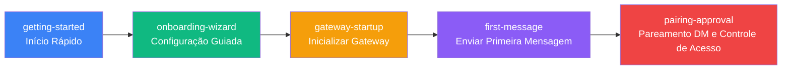

# Início Rápido: Da Instalação à Primeira Mensagem

Bem-vindo ao Clawdbot! Este capítulo guiará você através do fluxo completo de uso do Clawdbot do zero. Seja você querendo experimentar rapidamente um assistente de IA ou aprofundar-se nas opções de configuração, há tutoriais correspondentes aqui.

---

## Visão Geral do Capítulo

Este capítulo contém 5 tutoriais que cobrem o fluxo completo de iniciação ao Clawdbot: desde a instalação do software, configuração de modelos de IA e canais de comunicação, até a inicialização do daemon Gateway, envio da primeira mensagem e, finalmente, compreensão do mecanismo de proteção de segurança padrão. Ao completar este capítulo, você terá um assistente de IA pessoal totalmente funcional.

---

## Recomendação de Caminho de Aprendizado

Recomendamos seguir estes tutoriais na seguinte ordem:

**Explicação da Ordem de Aprendizado**:

1. **Início Rápido** (Obrigatório): Complete a instalação básica e configuração, pré-requisito para todo aprendizado subsequente
2. **Configuração Guiada** (Recomendado): Aprofunde-se nas várias opções do assistente, ideal para usuários que desejam configuração detalhada
3. **Inicializar Gateway** (Obrigatório): Aprenda como iniciar e gerenciar o daemon Gateway
4. **Enviar Primeira Mensagem** (Obrigatório): Verifique se a configuração está correta e comece a usar o assistente de IA
5. **Pareamento DM e Controle de Acesso** (Recomendado): Compreenda o mecanismo de segurança padrão para proteger seu assistente de IA

::: tip Canal Rápido
Se você apenas quer experimentar rapidamente, pode estudar apenas os tutoriais "Início Rápido" e "Inicializar Gateway", e depois enviar mensagens diretamente. Outros tutoriais podem ser estudados conforme necessário posteriormente.
:::

---

## Pré-requisitos

Antes de estudar este capítulo, certifique-se de:

- **Node.js**: ≥ 22.12.0 (verifique com `node -v`)
- **Sistema Operacional**: macOS / Linux / Windows (WSL2)
- **Gerenciador de Pacotes**: npm / pnpm / bun
- **Conta de Modelo de IA** (Recomendado):
  - Conta Anthropic Claude (assinatura Pro/Max), suporta fluxo OAuth
  - Ou prepare uma API Key de provedores como OpenAI / DeepSeek / OpenRouter

::: warning Atenção Usuários Windows
No Windows, é altamente recomendado usar **WSL2**, porque:
- Muitos canais dependem de binários locais
- Daemons (launchd/systemd) não estão disponíveis no Windows
:::

---

## Navegação de Subpáginas

### [1. Início Rápido](./getting-started/) ⭐ Tutorial Essencial

**O que você poderá fazer após aprender**:
- ✅ Instalar o Clawdbot em seu dispositivo
- ✅ Configurar autenticação de modelo de IA (Anthropic / OpenAI / outros provedores)
- ✅ Iniciar o daemon Gateway
- ✅ Enviar a primeira mensagem via WebChat ou canais configurados

**Público-alvo**: Todos os usuários, tutorial obrigatório

**Tempo estimado**: 15-20 minutos

**Conteúdo principal**:
- Instalar Clawdbot usando npm/pnpm/bun
- Executar o assistente de onboarding para completar a configuração básica
- Iniciar o Gateway e verificar o status
- Enviar mensagens de teste via CLI ou canais

**Pré-requisitos**: Nenhum

---

### [2. Configuração Guiada](./onboarding-wizard/)

**O que você poderá fazer após aprender**:
- ✅ Usar o assistente interativo para completar a configuração completa
- ✅ Entender a diferença entre os modos QuickStart e Manual
- ✅ Configurar rede, autenticação e Tailscale do Gateway
- ✅ Configurar provedores de modelo de IA (setup-token e API Key)
- ✅ Habilitar canais de comunicação (WhatsApp, Telegram, etc.)
- ✅ Instalar e gerenciar pacotes de habilidades

**Público-alvo**: Usuários que desejam configuração detalhada, entender opções avançadas

**Tempo estimado**: 20-30 minutos

**Conteúdo principal**:
- Escolha entre modos QuickStart vs Manual
- Configuração de rede do Gateway (portas, binding, autenticação)
- Métodos de autenticação de modelo de IA (setup-token recomendado)
- Fluxo de configuração de canais de comunicação
- Introdução ao sistema de habilidades

**Pré-requisitos**: [Início Rápido](./getting-started/)

---

### [3. Inicializar Gateway](./gateway-startup/) ⭐ Tutorial Essencial

**O que você poderá fazer após aprender**:
- ✅ Iniciar processo foreground do Gateway usando linha de comando
- ✅ Configurar Gateway como daemon em segundo plano (macOS LaunchAgent / Linux systemd / Windows Scheduled Task)
- ✅ Entender diferentes modos de binding (loopback / LAN / Tailnet) e métodos de autenticação
- ✅ Alternar entre modo de desenvolvimento e modo de produção
- ✅ Usar `--force` para liberar forçadamente portas ocupadas

**Público-alvo**: Todos os usuários, tutorial obrigatório

**Tempo estimado**: 15-20 minutos

**Conteúdo principal**:
- Modo foreground vs modo daemon
- Seleção de modo de binding (loopback / LAN / Tailnet / Auto)
- Configuração de método de autenticação (Token / Password / Tailscale Identity)
- Modo de desenvolvimento (`--dev`) e modo de produção
- Comandos de gerenciamento de serviço (install / start / stop / restart)
- Tratamento de conflitos de porta (`--force`)

**Pré-requisitos**: [Configuração Guiada](./onboarding-wizard/)

---

### [4. Enviar Primeira Mensagem](./first-message/) ⭐ Tutorial Essencial

**O que você poderá fazer após aprender**:
- ✅ Enviar mensagens através da interface WebChat
- ✅ Conversar com o assistente de IA através de canais configurados (WhatsApp / Telegram / Slack, etc.)
- ✅ Entender o roteamento de mensagens e fluxo de resposta
- ✅ Usar o assistente de IA para executar tarefas básicas (consultas, resumos, geração de código, etc.)

**Público-alvo**: Todos os usuários, tutorial obrigatório

**Tempo estimado**: 10-15 minutos

**Conteúdo principal**:
- Uso da interface WebChat
- Métodos de envio de mensagens em cada canal
- Formato de mensagens e mecanismo de resposta
- Exemplos de tarefas comuns (consultar informações, gerar código, resumir texto)
- Depuração e solução de problemas

**Pré-requisitos**: [Inicializar Gateway](./gateway-startup/)

---

### [5. Pareamento DM e Controle de Acesso](./pairing-approval/)

**O que você poderá fazer após aprender**:
- ✅ Compreender o mecanismo de proteção de pareamento DM padrão
- ✅ Aprovar ou rejeitar solicitações de pareamento de remetentes desconhecidos
- ✅ Configurar listas de permissão e listas de bloqueio
- ✅ Definir políticas de controle de acesso
- ✅ Compreender modos de pareamento e melhores práticas de segurança

**Público-alvo**: Usuários preocupados com segurança, recomendado estudar

**Tempo estimado**: 10-15 minutos

**Conteúdo principal**:
- Princípio do mecanismo de pareamento DM
- Fluxo de pareamento e experiência do usuário
- Configuração de listas de permissão e listas de bloqueio
- Definição de políticas de controle de acesso
- Melhores práticas de segurança

**Pré-requisitos**: [Enviar Primeira Mensagem](./first-message/)

---

## Perguntas Frequentes

### P: Eu deveria estudar todos os tutoriais?

**R**: Não necessariamente. Se você quer apenas começar rapidamente, basta estudar os tutoriais essenciais "Início Rápido" e "Inicializar Gateway", e depois pode começar a usar o Clawdbot. Outros tutoriais podem ser estudados conforme necessário.

### P: Há algum impacto em pular alguns tutoriais?

**R**: Não. Cada tutorial é independente, mas "Início Rápido" é a base, contendo instalação e configuração básica, recomendado estudar primeiro. Outros tutoriais podem ser selecionados conforme suas necessidades.

### P: Já estou familiarizado com assistentes de IA, posso pular os tutoriais básicos?

**R**: Pode. Se você já está familiarizado com ferramentas de assistente de IA similares, pode pular "Início Rápido" e estudar diretamente "Configuração Guiada" e "Inicializar Gateway" para entender as configurações específicas e métodos de inicialização do Clawdbot.

### P: O que posso fazer após completar este capítulo?

**R**: Ao completar este capítulo, você terá um sistema Clawdbot totalmente funcional, capaz de:
- Conversar com o assistente de IA através de WebChat ou múltiplos canais
- Fazer a IA executar tarefas básicas (consultar informações, gerar código, resumir texto, etc.)
- Usar o mecanismo de pareamento DM para proteger a segurança
- Continuar aprendendo funcionalidades avançadas (configuração multicanal, sistema de ferramentas, plataforma de habilidades, etc.)

---

## Próximos Passos

Após completar este capítulo, você pode continuar aprendendo:

- **[Visão Geral do Sistema Multicanal](../../platforms/channels-overview/)**: Conheça todos os canais de comunicação suportados pelo Clawdbot e suas características
- **[Canal WhatsApp](../../platforms/whatsapp/)**: Aprofunde-se na configuração e uso do canal WhatsApp
- **[Canal Telegram](../../platforms/telegram/)**: Aprofunde-se na configuração e uso do canal Telegram
- **[Interface WebChat](../../platforms/webchat/)**: Conheça as funcionalidades da interface WebChat integrada

::: tip Dica
De acordo com suas necessidades de uso, escolha o canal correspondente para estudo aprofundado. Se você usa principalmente um canal específico (como WhatsApp ou Telegram), pode priorizar o tutorial dedicado a esse canal.
:::
