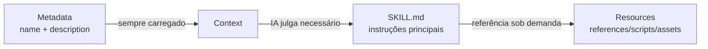

# Detalhamento da Estrutura de Skills

## O Que Você Aprenderá

- Entender com precisão todos os requisitos de campos e especificações de formato do SKILL.md
- Dominar os princípios de design e cenários de uso de references/, scripts/, assets/
- Otimizar o uso de tokens e o desempenho de carregamento de skills
- Evitar erros comuns de formato e problemas de resolução de caminhos
- Usar carregamento progressivo para melhorar a eficiência do contexto da IA

## Seu Desafio Atual

Você já aprendeu a criar skills básicos, mas ainda não tem uma compreensão completa das especificações do SKILL.md. Seus skills podem enfrentar os seguintes problemas:

- SKILL.md muito longo, resultando em consumo excessivo de tokens
- Incerteza sobre qual conteúdo deve ser colocado em references/ em vez de SKILL.md
- Agentes de IA não conseguem carregar corretamente recursos de scripts/ ou assets/
- Erros de formato de frontmatter YAML causando falha na instalação

## Quando Usar Esta Técnica

- **Revisão de skills**: Verificar se os skills existentes estão em conformidade com as especificações da Anthropic
- **Otimização de desempenho**: Resolver problemas de carregamento lento de skills ou limite excessivo de tokens
- **Refatoração de recursos**: Dividir skills grandes em SKILL.md + recursos agrupados
- **Desenvolvimento de skills complexos**: Criar skills completos incluindo documentação de API e scripts executáveis

## 🎒 Preparação Inicial

::: warning Verificação Prévia

Antes de começar, certifique-se de:

- ✅ Ter lido [Criar Skills Personalizados](../create-skills/)
- ✅ Ter instalado pelo menos um skill (entender o fluxo básico)
- ✅ Estar familiarizado com sintaxe básica de YAML e Markdown

:::

## Conceito Central

### Filosofia de Design do SKILL.md

O **SKILL.md** é o núcleo do sistema de skills da Anthropic, adotando o design de **carregamento progressivo**:



**Vantagens dos Três Níveis de Carregamento**:

1. **Camada Metadata**: O `name` e `description` de todos os skills estão sempre no contexto, permitindo que a IA entenda rapidamente os skills disponíveis
2. **Camada SKILL.md**: Carregado apenas quando relevante, contendo instruções principais (< 5000 palavras)
3. **Camada Resources**: Documentação detalhada e arquivos executáveis carregados sob demanda, evitando desperdício de tokens

### Classificação de Bundled Resources

| Diretório    | Carregado no Contexto | Cenários de Uso             | Tipos de Exemplo          |
|-------------|----------------------|---------------------------|--------------------------|
| `references/` | ✅ carregado sob demanda | Documentação detalhada, especificações de API | Documentação de API, schema de banco de dados |
| `scripts/`  | ❌ não carregado        | Código executável          | Scripts Python/Bash      |
| `assets/`   | ❌ não carregado        | Modelos, arquivos de saída, imagens | Modelos JSON, código boilerplate |

## Vamos Praticar

### Passo 1: Entender a Especificação Completa do YAML Frontmatter

**Por que**: O frontmatter YAML são os metadados do skill e devem estar em conformidade com especificações estritas

O SKILL.md deve começar e terminar com `---`:

```yaml
---
name: my-skill
description: Use this skill when you need to demonstrate proper format.
---
```

**Campos Obrigatórios**:

| Campo      | Tipo     | Requisitos de Formato                      | Exemplo                      |
|------------|----------|-------------------------------------------|------------------------------|
| `name`     | string   | Formato kebab-case, sem espaços           | `pdf-editor`, `api-client`  |
| `description` | string | 1-2 frases, terceira pessoa               | `Use this skill to edit PDF files` |

::: danger Erros Comuns

| Exemplo de Erro | Problema | Método de Correção |
|----------------|----------|-------------------|
| `name: My Skill` | Contém espaços | Alterar para `name: my-skill` |
| `name: my_skill` | Formato com sublinhado | Alterar para `name: my-skill` |
| `description: You should use this when...` | Segunda pessoa | Alterar para `description: Use this skill when...` |
| `description:` muito longo | Excede 100 palavras | Simplificar para resumo de 1-2 frases |
| Falta o final `---` | YAML não fechado corretamente | Adicionar delimitador de fechamento |

:::

**Verificação no Código-fonte**: OpenSkills usa regex não-greedy para validar o formato

```typescript
// src/utils/yaml.ts
export function hasValidFrontmatter(content: string): boolean {
  return content.trim().startsWith('---');
}

export function extractYamlField(content: string, field: string): string {
  const match = content.match(new RegExp(`^${field}:\\s*(.+?)$`, 'm'));
  return match ? match[1].trim() : '';
}
```

---

### Passo 2: Escrever o Corpo do SKILL.md (Forma Imperativa)

**Por que**: Agentes de IA esperam instruções imperativas, não descrições conversacionais

**Posicionamento Correto**:

```markdown
## Instructions

To execute this task:

1. Read the input file
2. Process data using the algorithm
3. Generate output in specified format
```

**Posicionamento Incorreto** (evitar):

```markdown
## Instructions

You should execute this task by:

1. Reading the input file
2. Processing data using the algorithm
3. Generating output in specified format
```

**Tabela Comparativa**:

| ✅ Correto (Imperativo/Infinitivo) | ❌ Incorreto (Segunda Pessoa) |
|-----------------------------------|------------------------------|
| "Load this skill when X"          | "If you need Y"              |
| "To accomplish Z, execute A"      | "You should do Z"            |
| "See references/guide.md"        | "When you want to Z"         |

**Fórmula de Escrita**:

1. **Começar com verbo**: `Create` → `Use` → `Return`
2. **Omitir "You"**: Não dizer "You should"
3. **Caminhos claros**: Ao referenciar recursos, use prefixos `references/`, `scripts/`, `assets/`

---

### Passo 3: Usar references/ para Gerenciar Documentação Detalhada

**Por que**: Manter o SKILL.md conciso, documentação detalhada carregada sob demanda

**Cenários de Uso**:

- Documentação de API (descrições de endpoint com mais de 500 palavras)
- Schema de banco de dados (estrutura de tabelas, definições de campos)
- Guias detalhados (descrições de configuração, problemas comuns)
- Exemplos de código (grandes trechos de código)

**Estrutura de Diretórios**:

```
my-skill/
├── SKILL.md              (~2,000 palavras, instruções principais)
└── references/
    ├── api-docs.md       (documentação de API detalhada)
    ├── database-schema.md (estrutura do banco de dados)
    └── troubleshooting.md (guia de solução de problemas)
```

**Forma de Referência no SKILL.md**:

```markdown
## Instructions

To interact with the API:

1. Read the request parameters
2. Call the API endpoint
3. For detailed response format, see `references/api-docs.md`
4. Parse the response
5. Handle errors (see `references/troubleshooting.md`)
```

**Exemplo de references/api-docs.md**:

```markdown
# API Documentation

## Overview

This API provides endpoints for data processing.

## Endpoints

### POST /api/process

**Request:**
```json
{
  "input": "data to process",
  "options": {
    "format": "json"
  }
}
```

**Response:**
```json
{
  "status": "success",
  "result": {
    "output": "processed data"
  }
}
```

**Error Codes:**
- `400`: Invalid input format
- `500`: Server error
```

::: tip Melhores Práticas

**Recomendações de Tamanho de Arquivo para references/**:
- Arquivo único: recomenda-se < 10.000 palavras
- Tamanho total: recomenda-se < 50.000 palavras (dividir em múltiplos arquivos)
- Nomenclatura: usar formato kebab-case (`api-docs.md` em vez de `API_Docs.md`)

:::

---

### Passo 4: Usar scripts/ para Executar Tarefas Determinísticas

**Por que**: Scripts executáveis não precisam ser carregados no contexto, adequados para tarefas repetitivas

**Cenários de Uso**:

- Transformação de dados (JSON → CSV, conversão de formato)
- Processamento de arquivos (compressão, descompressão, renomeação)
- Geração de código (gerar código a partir de modelos)
- Execução de testes (testes unitários, testes de integração)

**Estrutura de Diretórios**:

```
my-skill/
├── SKILL.md
└── scripts/
    ├── process.py       (script Python)
    ├── transform.sh     (script Bash)
    └── validate.js     (script Node.js)
```

**Forma de Referência no SKILL.md**:

```markdown
## Instructions

To process the input data:

1. Validate the input file format
2. Execute the processing script:
   ```bash
   python scripts/process.py --input data.json --output result.json
   ```
3. Verify the output file
4. If validation fails, see `scripts/validate.py` for error messages
```

**Exemplo de scripts/process.py**:

```python
#!/usr/bin/env python3
import json
import sys

def main():
    input_file = sys.argv[1]
    output_file = sys.argv[2]

    with open(input_file, 'r') as f:
        data = json.load(f)

    # Processing logic
    result = transform_data(data)

    with open(output_file, 'w') as f:
        json.dump(result, f, indent=2)

    print(f"✅ Processed {input_file} → {output_file}")

if __name__ == "__main__":
    main()
```

::: info Vantagens de scripts/

Comparado ao código inline no SKILL.md:

| Característica | Código Inline | scripts/          |
|---------------|--------------|-------------------|
| Consumo de Token | ✅ Alto      | ❌ Baixo          |
| Reutilização | ❌ Ruim       | ✅ Bom            |
| Testabilidade | ❌ Difícil    | ✅ Fácil          |
| Limite de Complexidade | ❌ Limitado por tokens | ✅ Sem limite |

:::

---

### Passo 5: Usar assets/ para Armazenar Modelos e Arquivos de Saída

**Por que**: Modelos e arquivos de saída não precisam ser carregados no contexto, economizando tokens

**Cenários de Uso**:

- Modelos de saída (JSON, XML, Markdown templates)
- Código boilerplate (scaffolds de projeto, arquivos de configuração)
- Imagens e diagramas (fluxogramas, diagramas de arquitetura)
- Dados de teste (entradas de amostra, saídas esperadas)

**Estrutura de Diretórios**:

```
my-skill/
├── SKILL.md
└── assets/
    ├── template.json    (modelo JSON)
    ├── boilerplate.js   (código boilerplate)
    └── diagram.png     (fluxograma)
```

**Forma de Referência no SKILL.md**:

```markdown
## Instructions

To generate the output file:

1. Load the template: `assets/template.json`
2. Replace placeholders with actual data
3. Write to output file
4. For boilerplate code, see `assets/boilerplate.js`
```

**Exemplo de assets/template.json**:

```json
{
  "title": "{{ title }}",
  "description": "{{ description }}",
  "version": "{{ version }}",
  "author": "{{ author }}",
  "created_at": "{{ timestamp }}"
}
```

**Usando Modelos em Scripts**:

```python
import json
from string import Template

def generate_output(data, template_path):
    with open(template_path, 'r') as f:
        template_str = f.read()

    template = Template(template_str)
    output = template.safe_substitute(data)

    return output
```

::: warning Cuidados com assets/

- **Não carregado no contexto**: Agentes de IA não podem ler diretamente o conteúdo, devem carregar via scripts
- **Resolução de caminho**: Use caminhos relativos, como `assets/template.json`
- **Tamanho de arquivo**: Recomenda-se arquivo único < 10MB (evitar atrasos de transmissão)

:::

---

### Passo 6: Otimizar Tamanho de Arquivo e Desempenho

**Por que**: O tamanho do arquivo afeta diretamente o consumo de tokens e a velocidade de carregamento do contexto da IA

**Guia de Tamanho de Arquivo** (recomendação oficial):

| Diretório  | Limite de Tamanho  | Comportamento de Carregamento  |
|-----------|-------------------|--------------------------------|
| SKILL.md  | < 5.000 palavras  | Sempre carregado (quando necessário) |
| references/ | Sem limite estrito | Carregado sob demanda          |
| scripts/  | Não conta no token | Não carregado, apenas executado |
| assets/   | Não carregado no contexto | Não carregado, apenas copiado |

**Técnicas de Otimização de Desempenho**:

1. **Dividir references/**:
   ```bash
   # ❌ Arquivo único grande (20.000 palavras)
   references/all-docs.md

   # ✅ Dividir em múltiplos arquivos pequenos (< 5.000 palavras cada)
   references/
   ├── api-docs.md
   ├── database-schema.md
   └── troubleshooting.md
   ```

2. **Usar scripts/ para processar dados**:
   ```markdown
   # ❌ Inline grandes blocos de código no SKILL.md (consome tokens)
   ## Instructions
   Execute this code:
   ```python
   # 500 lines of code...
   ```

   # ✅ Referenciar scripts/ (não consome tokens)
   ## Instructions
   Execute: `python scripts/processor.py`
   ```

3. **Simplificar SKILL.md**:
   - Manter apenas instruções principais e passos
   - Mover explicações detalhadas para `references/`
   - Usar linguagem imperativa concisa

**Verificar Tamanho de Arquivo**:

```bash
# Contar palavras do SKILL.md
wc -w my-skill/SKILL.md

# Contar total de palavras em references/
find my-skill/references -name "*.md" -exec wc -w {} + | tail -1

# Verificar tamanho de arquivos scripts/
du -sh my-skill/scripts/
```

---

### Passo 7: Entender o Mecanismo de Resolução de Recursos

**Por que**: Entender as regras de resolução de caminho para evitar erros de referência

**Conceito de Diretório Base**:

Quando um agente de IA carrega um skill, `openskills read` retorna o diretório base:

```
Reading: my-skill
Base directory: /path/to/project/.claude/skills/my-skill
```

**Regras de Resolução de Caminhos Relativos**:

| Caminho de Referência      | Resultado da Resolução                                           |
|---------------------------|-----------------------------------------------------------------|
| `references/api.md`       | `/base/directory/references/api.md`                             |
| `scripts/process.py`      | `/base/directory/scripts/process.py`                            |
| `assets/template.json`    | `/base/directory/assets/template.json`                          |

**Verificação no Código-fonte**:

```typescript
// src/commands/read.ts
export function readSkill(skillNames: string[] | string): void {
  const skill = findSkill(name);
  const content = readFileSync(skill.path, 'utf-8');

  // Output base directory para IA resolver caminhos relativos
  console.log(`Base directory: ${skill.baseDir}`);
  console.log(content);
}
```

::: danger Exemplos de Erros de Caminho

| ❌ Escrita Incorreta          | Problema                     | ✅ Escrita Correta     |
|----------------------------|------------------------------|----------------------|
| `/absolute/path/to/api.md`  | Usa caminho absoluto         | `references/api.md`   |
| `../other-skill/references/api.md` | Referência cruz entre skills | `references/api.md`   |
| `~/references/api.md`       | Usa expansão de til         | `references/api.md`   |

:::

---

### Passo 8: Validar Formato do Skill

**Por que**: Validar o formato antes da instalação para evitar erros em tempo de execução

**Usar openskills para validar**:

```bash
npx openskills install ./my-skill
```

**O Que Você Deve Ver**:

```
✔ Found skill: my-skill
  Description: Use this skill when you need to demonstrate proper format.
  Size: 2.1 KB

? Select skills to install: (Use arrow keys)
❯ ☑ my-skill
```

**Lista de Verificação**:

- [ ] SKILL.md começa com `---`
- [ ] Contém campo `name` (formato kebab-case)
- [ ] Contém campo `description` (1-2 frases)
- [ ] YAML termina com `---`
- [ ] Corpo usa forma imperative/infinitive
- [ ] Todas as referências `references/`, `scripts/`, `assets/` usam caminhos relativos
- [ ] SKILL.md tem < 5.000 palavras
- [ ] Nomes de arquivos em references/ usam formato kebab-case

**Validação Manual do YAML Frontmatter**:

```bash
# Verificar se começa com ---
head -1 my-skill/SKILL.md

# Validar campos YAML (usar yq ou outras ferramentas)
yq eval '.name' my-skill/SKILL.md
```

---

### Passo 9: Testar Carregamento do Skill

**Por que**: Garantir que o skill seja carregado corretamente no contexto da IA

**Usar openskills read para testar**:

```bash
npx openskills read my-skill
```

**O Que Você Deve Ver**:

```
Reading: my-skill
Base directory: /path/to/project/.claude/skills/my-skill

---
name: my-skill
description: Use this skill when you need to demonstrate proper format.
---

# My Skill

## Instructions

To execute this task...

## Bundled Resources

For detailed information: see `references/skill-format.md`

Skill read: my-skill
```

**Pontos de Verificação**:

- ✅ A saída contém `Base directory` (usado para resolução de caminho)
- ✅ Conteúdo do SKILL.md completo (incluindo YAML e corpo)
- ✅ Sem erros "Invalid SKILL.md"
- ✅ Todos os caminhos de referência são exibidos corretamente

## Pontos de Verificação ✅

Após concluir as etapas acima, você deve:

- ✅ Entender as especificações completas de campos do SKILL.md
- ✅ Dominar os cenários de uso de references/, scripts/, assets/
- ✅ Ser capaz de otimizar o tamanho de arquivo e o desempenho de carregamento de skills
- ✅ Saber como validar o formato de skills e testar o carregamento
- ✅ Entender o mecanismo de resolução de recursos e o diretório base

## Cuidados e Problemas Comuns

### Problema 1: SKILL.md Excede 5000 Palavras Causando Limite de Tokens

**Causa**: SKILL.md contém documentação detalhada excessiva

**Solução**:
1. Mover conteúdo detalhado para o diretório `references/`
2. Referenciar no SKILL.md: `See references/guide.md for details`
3. Verificar contagem de palavras com `wc -w SKILL.md`

---

### Problema 2: Scripts em scripts/ Não Executam

**Causa**:
- Scripts não têm permissões de execução
- Usando caminhos absolutos em vez de caminhos relativos

**Solução**:
```bash
# Adicionar permissões de execução
chmod +x my-skill/scripts/*.sh

# Usar caminhos relativos no SKILL.md
## Instructions
Execute: `python scripts/process.py`  # ✅ Correto
Execute: `/path/to/my-skill/scripts/process.py`  # ❌ Incorreto
```

---

### Problema 3: Arquivos de references/ Carregados Sob Demanda Mas IA Não Consegue Ler

**Causa**: Agentes de IA não resolvem corretamente o caminho `references/`

**Solução**:
1. Confirmar que `openskills read` retornou `Base directory`
2. Ao referenciar, esclarecer: `See references/api-docs.md in base directory`
3. Evitar usar caminhos absolutos ou referências cruzadas entre skills

---

### Problema 4: Arquivos de assets/ Muito Grandes Causando Atrasos de Transmissão

**Causa**: assets/ contém arquivos binários grandes (> 10MB)

**Solução**:
- Comprimir imagens: use PNG em vez de BMP, otimize qualidade JPEG
- Dividir dados: divida grandes conjuntos de dados em múltiplos arquivos pequenos
- Usar armazenamento externo: para arquivos muito grandes, forneça links de download em vez de incluir diretamente

---

### Problema 5: Erro de Formato de YAML Frontmatter

**Causa**:
- Falta o final `---`
- Valores de campo contêm caracteres especiais (dois pontos, hash) sem aspas

**Solução**:
```yaml
# ❌ Incorreto: falta o final ---
---
name: my-skill
description: Use this skill: for testing
# falta ---

# ✅ Correto: fechamento completo
---
name: my-skill
description: "Use this skill: for testing"
---
```

---

### Problema 6: Instruções Usam Segunda Pessoa

**Causa**: Hábito de usar "You should", "When you want"

**Solução**:
- Usar linguagem imperativa começando com verbos
- Usar "To do X, execute Y" em vez de "You should do Y"
- Usar "Load this skill when Z" em vez de "If you need Z"

**Tabela Comparativa**:

| Segunda Pessoa (❌ Evitar) | Imperativo (✅ Recomendado)  |
|---------------------------|----------------------------|
| "You should execute..." | "To execute X, run..."     |
| "When you want to..."  | "Load this skill when..."   |
| "If you need..."       | "Use X to accomplish Y"     |

## Resumo da Lição

Pontos-chave da estrutura de skills:

1. **YAML frontmatter**: Campos obrigatórios `name` (formato kebab-case) e `description` (1-2 frases)
2. **Formato do corpo**: Usar forma imperative/infinitive, evitar segunda pessoa
3. **references/**: Armazenar documentação detalhada, carregada sob demanda no contexto (< 10.000 palavras/arquivo)
4. **scripts/**: Armazenar scripts executáveis, não carregados no contexto, adequados para tarefas determinísticas
5. **assets/**: Armazenar modelos e arquivos de saída, não carregados no contexto
6. **Tamanho de arquivo**: SKILL.md < 5.000 palavras, references/ pode ser dividido, scripts/ sem limite
7. **Resolução de caminho**: Usar caminhos relativos (`references/`, `scripts/`, `assets/`), resolvido com base no diretório base
8. **Métodos de validação**: Usar `openskills install` para validar formato, `openskills read` para testar carregamento

## Próxima Lição

> Na próxima lição, aprenderemos **[Integração CI/CD](../ci-integration/)**.
>
> Você aprenderá:
> - Como usar o flag `-y/--yes` em ambientes CI/CD
> - Processos automatizados de instalação e sincronização de skills
> - Integrar OpenSkills no GitHub Actions, GitLab CI

---

## Apêndice: Referência de Código-fonte

<details>
<summary><strong>Clique para expandir e ver locais do código-fonte</strong></summary>

> Última atualização: 2026-01-24

| Função           | Caminho do Arquivo                                                              | Linha  |
|------------------|-------------------------------------------------------------------------------|--------|
| Validação de YAML frontmatter | [`src/utils/yaml.ts`](https://github.com/numman-ali/openskills/blob/main/src/utils/yaml.ts) | 12-14   |
| Extração de campos YAML  | [`src/utils/yaml.ts`](https://github.com/numman-ali/openskills/blob/main/src/utils/yaml.ts) | 4-7     |
| Comando de leitura de skills  | [`src/commands/read.ts`](https://github.com/numman-ali/openskills/blob/main/src/commands/read.ts) | 1-49    |
| Saída de Base directory | [`src/commands/read.ts`](https://github.com/numman-ali/openskills/blob/main/src/commands/read.ts) | 42      |
| Validação de formato na instalação  | [`src/commands/install.ts`](https://github.com/numman-ali/openskills/blob/main/src/commands/install.ts) | 242, 291, 340 |

**Arquivos de Skills de Exemplo**:
- [`examples/my-first-skill/SKILL.md`](https://github.com/numman-ali/openskills/blob/main/examples/my-first-skill/SKILL.md) - Exemplo de estrutura completa
- [`examples/my-first-skill/references/skill-format.md`](https://github.com/numman-ali/openskills/blob/main/examples/my-first-skill/references/skill-format.md) - Referência de especificação de formato

**Funções-chave**:
- `hasValidFrontmatter(content: string): boolean` - Valida se o SKILL.md começa com `---`
- `extractYamlField(content: string, field: string): string` - Extrai valores de campos YAML (correspondência não-greedy)
- `readSkill(skillNames: string[] | string): void` - Lê o skill para saída padrão (para uso da IA)

</details>
