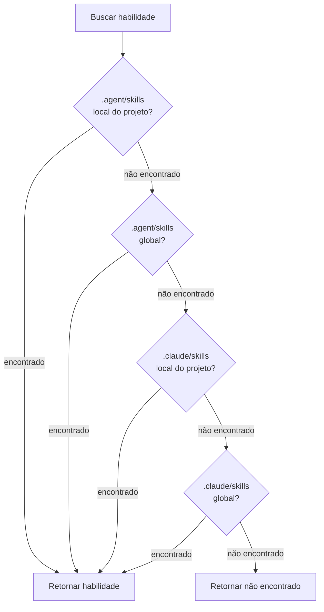

# Modo Universal: Ambiente Multi-Agente

## O que você será capaz de fazer

- Entender o valor central e o propósito de design do modo Universal
- Dominar o uso da sinalização `--universal`
- Compreender a diferença entre `.agent/skills` e `.claude/skills`
- Entender as regras de prioridade de busca de 4 níveis
- Gerenciar habilidades uniformemente em ambientes multi-agente, evitando conflitos
- Compartilhar o mesmo conjunto de habilidades entre vários agentes como Claude Code, Cursor, Windsurf, Aider, etc.

::: info Conhecimento Prévio

Este tutorial assume que você já entende [instalação global vs. instalação local do projeto](../../platforms/global-vs-project/) e [sincronização de habilidades para AGENTS.md](../../start/sync-to-agents/), e compreende os locais básicos de instalação e o fluxo de sincronização.

:::

---

## Seu dilema atual

Você já pode ter aprendido como instalar e sincronizar habilidades, mas:

- **Como vários agentes compartilham habilidades?**: Usando simultaneamente Claude Code e Cursor, mas instalando habilidades separadamente, gerando desorganização
- **Conflitos do Marketplace Claude Code**: Após instalar habilidades, ocorre conflito com o marketplace nativo de plugins do Claude Code
- **Localização não unificada do AGENTS.md**: Diferentes agentes precisam de diferentes caminhos para AGENTS.md, dificultando a manutenção
- **Instalação repetida de habilidades**: Cada agente precisa instalar um conjunto de habilidades, desperdiçando espaço em disco

Na verdade, o OpenSkills oferece o modo Universal, projetado especificamente para resolver problemas de gerenciamento de habilidades em ambientes multi-agente.

---

## Quando usar este recurso

**Cenários aplicáveis do modo Universal**:

| Cenário | Necessita do modo Universal | Exemplo |
|--- | --- | ---|
| **Agente único** (apenas Claude Code) | ❌ Não | Apenas usando Claude Code, use o padrão `.claude/skills` |
| **Multi-agente** (Claude Code + outros) | ✅ Sim | Usando simultaneamente Claude Code e Cursor/Windsurf/Aider |
| **Evitar conflitos do Marketplace** | ✅ Sim | Não quer conflitar com o marketplace nativo de plugins do Claude Code |
| **Gerenciamento unificado do AGENTS.md** | ✅ Sim | Vários agentes compartilham o mesmo arquivo AGENTS.md |

::: tip Prática Recomendada

- **Agente único usa modo padrão**: Ao usar apenas Claude Code, instale com o padrão `.claude/skills`
- **Multi-agente usa modo Universal**: Ao usar vários agentes simultaneamente, instale em `.agent/skills` com `--universal`
- **Colaboração em equipe com padrões unificados**: Defina claramente qual modo usar na equipe para evitar desorganização

:::

---

## Ideia central: Diretório unificado, compartilhamento multi-agente

O OpenSkills oferece dois modos de diretório de habilidades:

**Modo padrão (`.claude/skills`)**:
- Projetado especificamente para Claude Code
- Compatível com o Marketplace Claude Code
- Local de instalação: `./.claude/skills/` ou `~/.claude/skills/`

**Modo Universal (`.agent/skills`)**:
- Projetado especificamente para ambientes multi-agente
- Evita conflitos com o Marketplace Claude Code
- Local de instalação: `./.agent/skills/` ou `~/.agent/skills/`

::: info Conceito Importante

**Modo Universal**: Use a sinalização `--universal` para instalar habilidades no diretório `.agent/skills/`, permitindo que vários agentes de codificação AI (Claude Code, Cursor, Windsurf, Aider, etc.) compartilhem o mesmo conjunto de habilidades, gerenciados uniformemente através do AGENTS.md.

:::

**Prioridade de busca de 4 níveis** (código-fonte `dirs.ts:18-24`):

```typescript
export function getSearchDirs(): string[] {
  return [
    join(process.cwd(), '.agent/skills'),   // 1. Project universal (prioridade mais alta)
    join(homedir(), '.agent/skills'),        // 2. Global universal
    join(process.cwd(), '.claude/skills'),  // 3. Project claude
    join(homedir(), '.claude/skills'),       // 4. Global claude
  ];
}
```

**Explicação da prioridade**:
1. **Project Universal** (mais alta): `.agent/skills/` tem prioridade sobre `.claude/skills/`
2. **Global Universal**: Em seguida, busca o `.agent/skills/` global
3. **Project Claude**: Depois, busca o `.claude/skills/` local do projeto
4. **Global Claude** (mais baixa): Por fim, busca o `.claude/skills/` global

---

## Siga comigo

### Passo 1: Instalar habilidades usando o modo Universal

**Por que**
Primeiro aprenda como usar a sinalização `--universal` para instalar habilidades.

Abra o terminal e execute em qualquer projeto:

```bash
# Instalar habilidades usando o modo Universal
npx openskills install anthropics/skills --universal -y

# Listar habilidades
npx openskills list
```

**Você deve ver**: Cada habilidade na lista possui uma etiqueta `(project)`

```
  codebase-reviewer         (project)
    Review code changes for issues...

Summary: 3 project, 0 global (3 total)
```

**Explicação**:
- Após usar a sinalização `--universal`, as habilidades são instaladas no diretório `./.agent/skills/`
- O comando `list` ainda exibe etiquetas `(project)` ou `(global)`
- `.agent/skills/` não conflita com o `.claude/skills/` padrão

---

### Passo 2: Verificar o local de instalação das habilidades

**Por que**
Confirmar o local real de armazenamento dos arquivos de habilidades e entender a estrutura de diretórios do modo Universal.

Execute no diretório raiz do projeto:

```bash
# Verificar o diretório de habilidades do modo Universal
ls -la .agent/skills/

# Verificar o conteúdo do diretório de habilidades
ls -la .agent/skills/codebase-reviewer/
```

**Você deve ver**:

```
.agent/skills/
├── codebase-reviewer/
│   ├── SKILL.md
│   └── .openskills.json    # Metadados de instalação
├── file-writer/
│   ├── SKILL.md
│   └── .openskills.json
└── ...
```

**Explicação**:
- As habilidades do modo Universal são instaladas no diretório `.agent/skills/`
- Cada habilidade possui seu próprio diretório e metadados
- Isso é idêntico à estrutura padrão do `.claude/skills/`

---

### Passo 3: Comparar as estruturas de diretório dos dois modos

**Por que**
Através da comparação real, entender a diferença entre `.claude/skills` e `.agent/skills`.

Execute os seguintes comandos:

```bash
# Verificar os diretórios de habilidades dos dois modos
echo "=== .claude/skills (modo padrão) ==="
ls -la .claude/skills/ 2>/dev/null || echo "Diretório não existe"

echo "=== .agent/skills (modo Universal) ==="
ls -la .agent/skills/

# Verificar os diretórios de instalação global
echo "=== ~/.claude/skills (global padrão) ==="
ls -la ~/.claude/skills/ 2>/dev/null || echo "Diretório não existe"

echo "=== ~/.agent/skills (global Universal) ==="
ls -la ~/.agent/skills/ 2>/dev/null || echo "Diretório não existe"
```

**Você deve ver**:

```
=== .claude/skills (modo padrão) ===
Diretório não existe

=== .agent/skills (modo Universal) ===
codebase-reviewer
file-writer

=== ~/.claude/skills (global padrão) ===
git-helper
test-generator

=== ~/.agent/skills (global Universal) ===
Diretório não existe
```

**Explicação**:
- `.claude/skills/` e `.agent/skills/` são dois diretórios independentes
- Podem coexistir sem interferir
- Suportam instalação local e global do projeto

---

### Passo 4: Instalação Universal global

**Por que**
Entender como instalar habilidades Universal globalmente para servir a todos os projetos.

Execute:

```bash
# Instalar habilidades Universal globalmente
npx openskills install anthropics/skills --universal --global -y

# Listar habilidades
npx openskills list
```

**Você deve ver**:

```
  codebase-reviewer         (project)
    Review code changes for issues...
  file-writer              (global)
    Write files with format...

Summary: 1 project, 2 global (3 total)
```

**Explicação**:
- `--universal` e `--global` podem ser combinados
- Instala no diretório `~/.agent/skills/`
- Todos os projetos podem usar essas habilidades

---

### Passo 5: Verificar a prioridade de busca de 4 níveis

**Por que**
Entender como o OpenSkills busca habilidades em 4 diretórios.

Execute:

```bash
# Instalar habilidades com o mesmo nome nos 4 locais (versões diferentes)
# 1. Project Universal
npx openskills install anthropics/skills --universal -y
# 2. Global Universal
npx openskills install anthropics/skills --universal --global -y
# 3. Project Claude
npx openskills install anthropics/skills -y
# 4. Global Claude
npx openskills install anthropics/skills --global -y

# Ler habilidade (usará prioritariamente a versão Project Universal)
npx openskills read codebase-reviewer | head -5
```

**Você deve ver**: A saída é o conteúdo da habilidade da versão `.agent/skills/` (Project Universal).

**Visualização da prioridade de busca**:



**Explicação**:
- A prioridade de `.agent/skills/` é maior que `.claude/skills/`
- A prioridade local do projeto é maior que a global
- Quando habilidades com o mesmo nome coexistem, a versão Project Universal é usada prioritariamente
- Isso permite a configuração flexível de "Universal prioritário"

---

### Passo 6: Evitar conflitos com o Marketplace Claude Code

**Por que**
Entender como o modo Universal resolve conflitos com o Marketplace Claude Code.

Execute:

```bash
# Instalar habilidades usando o modo Universal
npx openskills install anthropics/skills --universal -y

# Sincronizar para AGENTS.md
npx openskills sync

# Verificar AGENTS.md
cat AGENTS.md
```

**Você deve ver**: O AGENTS.md contém a lista de habilidades, sem conflitar com o Marketplace Claude Code.

**Explicação**:
- O modo Universal usa `.agent/skills/`, separando do `.claude/skills/` do Claude Code
- Evita conflitos entre habilidades instaladas pelo OpenSkills e plugins do Marketplace Claude Code
- Vários agentes podem compartilhar o mesmo AGENTS.md, com gerenciamento unificado

---

## Ponto de verificação ✅

Complete as seguintes verificações para confirmar que você domina o conteúdo desta aula:

- [ ] É capaz de distinguir os dois modos `.claude/skills` e `.agent/skills`
- [ ] Conhece o propósito da sinalização `--universal`
- [ ] Entende as regras de prioridade de busca de 4 níveis
- [ ] É capaz de escolher o modo de instalação apropriado de acordo com o cenário
- [ ] Sabe como gerenciar habilidades uniformemente em ambientes multi-agente
- [ ] Entende como o modo Universal evita conflitos do Marketplace

---

## Avisos sobre armadilhas

### Erro comum 1: Uso indevido do modo Universal em agente único

**Cenário de erro**: Apenas usando Claude Code, mas usando o modo Universal

```bash
# ❌ Errado: Agente único não precisa do modo Universal
npx openskills install anthropics/skills --universal
```

**Problema**:
- Aumenta complexidade desnecessária
- Não pode funcionar em conjunto com plugins do Marketplace Claude Code
- O local do AGENTS.md pode não corresponder às expectativas do Claude Code

**Abordagem correta**:

```bash
# ✅ Correto: Agente único usa o modo padrão
npx openskills install anthropics/skills
```

---

### Erro comum 2: Multi-agente não usando o modo Universal

**Cenário de erro**: Usando vários agentes simultaneamente, mas não usando o modo Universal

```bash
# ❌ Errado: Cada agente instala habilidades independentemente, gerando desorganização
npx openskills install anthropics/skills  # Para Claude Code
npx openskills install anthropics/skills --global  # Para Cursor
```

**Problema**:
- Instalação repetida de habilidades, desperdiçando espaço em disco
- Versões de habilidades usadas por diferentes agentes podem ser inconsistentes
- AGENTS.md precisa ser mantido separadamente

**Abordagem correta**:

```bash
# ✅ Correto: Multi-agente usa o modo Universal para gerenciamento unificado
npx openskills install anthropics/skills --universal
# Todos os agentes compartilham o mesmo conjunto de habilidades e AGENTS.md
```

---

### Erro comum 3: Esquecer a prioridade de busca do modo Universal

**Cenário de erro**: Habilidades com o mesmo nome instaladas em `.claude/skills` e `.agent/skills`, mas esperando usar a versão `.claude/skills`

```bash
# .agent/skills e .claude/skills ambos têm codebase-reviewer
# Mas quer usar a versão .claude/skills
npx openskills install anthropics/skills --universal  # Instalar nova versão em .agent/skills
npx openskills install anthropics/skills  # Instalar versão antiga em .claude/skills
npx openskills read codebase-reviewer  # ❌ Ainda lê a versão .agent/skills
```

**Problema**:
- A prioridade de `.agent/skills` é maior que `.claude/skills`
- Mesmo que `.claude/skills` tenha uma nova versão instalada, ainda lê a versão `.agent/skills`

**Abordagem correta**:

```bash
# Solução 1: Excluir a versão .agent/skills
npx openskills remove codebase-reviewer  # Excluir versão .agent/skills
npx openskills read codebase-reviewer  # ✅ Agora lê a versão .claude/skills

# Solução 2: Atualizar a versão .agent/skills
npx openskills update codebase-reviewer  # Atualizar versão .agent/skills
```

---

### Erro comum 4: Erro de configuração do caminho AGENTS.md

**Cenário de erro**: Vários agentes precisam de diferentes caminhos para AGENTS.md

```bash
# Claude Code espera AGENTS.md no diretório raiz
# Cursor espera AGENTS.md no diretório .cursor/
# Windsurf espera AGENTS.md no diretório .windsurf/
npx openskills sync  # Gera apenas um AGENTS.md
```

**Problema**:
- Diferentes agentes não conseguem encontrar AGENTS.md
- Falha no carregamento de habilidades

**Abordagem correta**:

```bash
# Gerar AGENTS.md em diferentes locais para diferentes agentes
npx openskills sync -o AGENTS.md           # Claude Code
npx openskills sync -o .cursor/AGENTS.md    # Cursor
npx openskills sync -o .windsurf/AGENTS.md  # Windsurf
```

---

## Resumo da aula

**Pontos principais**:

1. **Modo Universal para ambientes multi-agente**: Use `--universal` para instalar em `.agent/skills/`
2. **Prioridade de busca de 4 níveis**: Project Universal > Global Universal > Project Claude > Global Claude
3. **Evitar conflitos do Marketplace**: `.agent/skills/` separado do `.claude/skills/` do Claude Code
4. **Gerenciamento unificado do AGENTS.md**: Vários agentes compartilham o mesmo arquivo AGENTS.md
5. **Princípios recomendados**: Agente único usa modo padrão, multi-agente usa modo Universal

**Fluxo de decisão**:

```
[Precisa instalar habilidades] → [Usa múltiplos agentes?]
                      ↓ Sim
              [Usar modo Universal (--universal)]
                      ↓ Não
              [Usa apenas Claude Code?]
                      ↓ Sim
              [Usar modo padrão (.claude/skills)]
                      ↓ Não
              [Verificar documentação do agente específico, escolher modo apropriado]
```

**Mneumônico**:

- **Agente único**: Modo padrão é mais simples, Claude Code usa `.claude`
- **Multi-agente**: Modo Universal gerencia unificado, `.agent/skills` evita conflitos

---

## Próximo anúncio de aula

> Na próxima aula aprenderemos **[Caminho de saída personalizado](../custom-output-path/)**.
>
> Você aprenderá:
> - Como usar a sinalização `--output/-o` para personalizar o caminho de saída do AGENTS.md
> - Como gerar AGENTS.md em diferentes locais para diferentes agentes
> - Como usar caminhos de saída personalizados em ambientes CI/CD
> - Como integrar a sistemas de documentação existentes

---

## Apêndice: Referência do código-fonte

<details>
<summary><strong>Clique para expandir e ver o local do código-fonte</strong></summary>

> Atualizado em: 2026-01-24

| Função | Caminho do arquivo | Linha |
|--- | --- | ---|
| Utilitários de caminho de diretório | [`src/utils/dirs.ts`](https://github.com/numman-ali/openskills/blob/main/src/utils/dirs.ts#L7-L25) | 7-25 |
| Julgamento do local de instalação | [`src/commands/install.ts`](https://github.com/numman-ali/openskills/blob/main/src/commands/install.ts#L84-L92) | 84-92 |
| Definição de argumentos de linha de comando | [`src/cli.ts`](https://github.com/numman-ali/openskills/blob/main/src/cli.ts#L48) | 48 |

**Constantes principais**:
- `.claude/skills`: Diretório de habilidades padrão (compatível com Claude Code)
- `.agent/skills`: Diretório de habilidades universal (ambiente multi-agente)

**Funções principais**:
- `getSkillsDir(projectLocal, universal)`: Retorna o caminho do diretório de habilidades com base na sinalização
- `getSearchDirs()`: Retorna a lista de diretórios de busca de habilidades (prioridade de 4 níveis)

**Regras de negócio**:
- O modo Universal usa o diretório `.agent/skills/`
- Prioridade de busca de 4 níveis: Project Universal > Global Universal > Project Claude > Global Claude
- `--universal` e `--global` podem ser combinados

</details>
