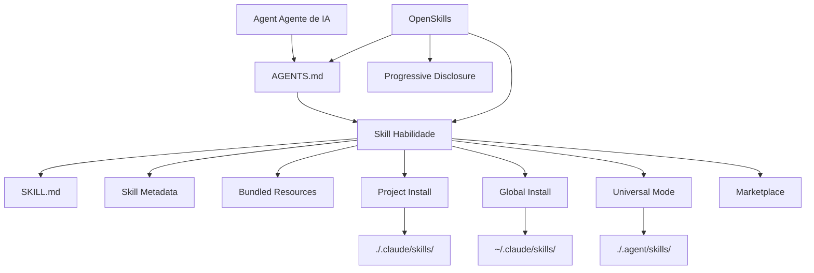

# Glossário

Este glossário explica os conceitos-chave do OpenSkills e do sistema de habilidades de IA, ajudando você a entender rapidamente a terminologia técnica.

::: info Dica
Este glossário está organizado em ordem alfabética, e as relações entre os termos são indicadas nas definições.
:::

---

## A

### Agent (Agente de IA)

**Definição**: Agente de IA refere-se a ferramentas de IA capazes de executar tarefas de codificação, como Claude Code, Cursor, Windsurf, Aider, etc.

**Características**:
- Capaz de ler arquivos de configuração `AGENTS.md`
- Suporta carregamento de habilidades no formato SKILL.md
- Pode invocar ferramentas externas via linha de comando (como `npx openskills read`)

**Papel no OpenSkills**: O OpenSkills permite que qualquer agente que suporte a leitura de AGENTS.md use o formato de habilidades da Anthropic.

**Termos Relacionados**: [Skill](#skill), [AGENTS.md](#agentsmd)

---

## B

### Base Directory (Diretório Base)

**Definição**: O caminho completo do diretório da habilidade, usado para resolver referências de caminho relativo na habilidade.

**Função**:
- Fornece o caminho absoluto do diretório da habilidade
- Usado para resolver caminhos relativos de recursos empacotados como `references/`, `scripts/`, `assets/`

**Exemplo**:
```
Base directory: /path/to/my-first-skill
```

Quando a habilidade referencia `references/skill-format.md`, é resolvido como:
```
/path/to/my-first-skill/references/skill-format.md
```

**Termos Relacionados**: [Skill](#skill), [Bundled Resources](#bundled-resources)

---

### Bundled Resources (Recursos Empacotados)

**Definição**: Arquivos de recursos incluídos no diretório da habilidade, fornecendo informações detalhadas ou ferramentas necessárias para a execução da habilidade.

**Tipos**:
- **`references/`** - Documentação de referência, documentação de API, etc.
- **`scripts/`** - Arquivos de script executáveis
- **`assets/`** - Modelos, arquivos de exemplo, etc.

**Usos**:
- Mover documentação detalhada para `references/`, mantendo o SKILL.md conciso
- Colocar código executável em `scripts/`, facilitando a invocação
- Colocar modelos e exemplos em `assets/`, para referência dos usuários

**Exemplo**:
```
my-skill/
├── SKILL.md
├── references/
│   └── api-docs.md
├── scripts/
│   └── helper.py
└── assets/
    └── template.json
```

**Termos Relacionados**: [Skill](#skill), [SKILL.md](#skillmd)

---

## G

### Global Install (Instalação Global)

**Definição**: Instalar a habilidade no diretório `.claude/skills` no diretório home do usuário, tornando-a acessível em todos os projetos.

**Exemplo de Comando**:
```bash
npx openskills install anthropics/skills --global
```

**Caminho de Destino**:
- macOS/Linux: `~/.claude/skills/`
- Windows: `%USERPROFILE%\.claude\skills\`

**Cenários de Uso**:
- Deseja usar a mesma habilidade em múltiplos projetos
- Não deseja versionar a habilidade com o repositório do projeto

**Prioridade**: Ao procurar habilidades, a instalação global tem prioridade menor que a instalação local do projeto (veja [Prioridade de Busca de Skill](#skill-查找优先级)).

**Termos Relacionados**: [Project Install](#project-install), [Prioridade de Busca de Skill](#skill-查找优先级)

---

## M

### Marketplace (Mercado)

**Definição**: Repositório GitHub onde as habilidades são armazenadas, usado para publicar e descobrir habilidades.

**Anthropic Marketplace**:
- Repositório oficial de habilidades: `anthropics/skills`
- Fornece habilidades mantidas oficialmente (como pdf, git-workflow, skill-creator, etc.)

**Mercados de Terceiros**:
- Qualquer repositório GitHub pode ser uma fonte de habilidades
- Suporta repositórios privados

**Instalação do Mercado**:
```bash
# Instalar do mercado oficial da Anthropic
npx openskills install anthropics/skills

# Instalar de repositório de terceiros
npx openskills install your-org/your-skills

# Instalar de repositório privado
npx openskills install git@github.com:your-org/private-skills.git
```

**Termos Relacionados**: [Skill](#skill), [Global Install](#global-install)

---

## O

### OpenSkills

**Definição**: O OpenSkills é um carregador universal do sistema de habilidades da Anthropic, permitindo que qualquer agente de codificação de IA use habilidades no formato padrão SKILL.md.

**Valor Principal**:
- **Padrão Unificado** - Todos os agentes usam o mesmo formato de habilidades e descrição AGENTS.md
- **Carregamento Progressivo** - Carrega habilidades sob demanda, mantendo o contexto enxuto
- **Suporte Multi-Agente** - Um conjunto de habilidades serve múltiplos agentes
- **Amigável ao Código Aberto** - Suporta caminhos locais e repositórios git privados
- **Alta Compatibilidade** - Totalmente compatível com o formato Claude Code

**Comandos Principais**:
- `install` - Instalar habilidade
- `list` - Listar habilidades instaladas
- `read` - Ler conteúdo da habilidade (usado por agentes de IA)
- `sync` - Sincronizar habilidades com AGENTS.md
- `update` - Atualizar habilidades instaladas
- `manage` / `remove` - Remover habilidades

**Repositório Oficial**: https://github.com/numman-ali/openskills

**Termos Relacionados**: [Skill](#skill), [SKILL.md](#skillmd), [AGENTS.md](#agentsmd)

---

## P

### Progressive Disclosure (Divulgação Progressiva)

**Definição**: Carregar habilidades apenas quando realmente necessário, evitando o inchaço do contexto causado pelo carregamento de todas as habilidades de uma vez.

**Como Funciona**:
1. As informações da habilidade são armazenadas como descrições curtas no AGENTS.md
2. Quando o usuário solicita uma tarefa, o agente de IA verifica se há uma habilidade correspondente
3. Se houver, carrega o conteúdo completo da habilidade via `npx openskills read <skill-name>`
4. O conteúdo da habilidade é válido apenas no contexto da tarefa atual

**Vantagens**:
- Mantém o contexto do agente de IA enxuto
- Reduz o uso de tokens
- Melhora a velocidade de resposta

**Exemplo**:
```xml
<!-- AGENTS.md contém apenas descrições curtas -->
<available_skills>
<skill>
<name>pdf</name>
<description>Comprehensive PDF manipulation toolkit...</description>
</skill>
</available_skills>

<!-- Conteúdo completo é carregado apenas quando o usuário solicita processamento de PDF -->
npx openskills read pdf
```

**Termos Relacionados**: [AGENTS.md](#agentsmd), [Skill](#skill)

---

### Project Install (Instalação Local do Projeto)

**Definição**: Instalar a habilidade no diretório `.claude/skills` ou `.agent/skills` do projeto, permitindo que a habilidade seja versionada com o repositório do projeto.

**Exemplo de Comando**:
```bash
# Instalação local do projeto (padrão)
npx openskills install anthropics/skills

# Instalação local do projeto em .agent/skills (modo universal)
npx openskills install anthropics/skills --universal
```

**Caminho de Destino**:
- Padrão: `./.claude/skills/`
- Modo Universal: `./.agent/skills/`

**Cenários de Uso**:
- O projeto precisa de habilidades específicas
- Deseja versionar a habilidade com o repositório do projeto
- Unificar versões de habilidades durante colaboração em equipe

**Prioridade**: Ao procurar habilidades, a instalação local do projeto tem prioridade maior que a instalação global (veja [Prioridade de Busca de Skill](#skill-查找优先级)).

**Termos Relacionados**: [Global Install](#global-install), [Universal Mode](#universal-mode), [Prioridade de Busca de Skill](#skill-查找优先级)

---

## S

### Skill (Habilidade)

**Definição**: Documento que fornece orientações específicas para execução de tarefas ao agente de IA, contendo instruções detalhadas, passos e recursos empacotados.

**Características Principais**:
- **Instruções Estáticas** - Contém apenas texto e recursos, sem lógica dinâmica
- **Componível** - Múltiplas habilidades podem ser combinadas
- **Versionável** - Gerenciada junto com o repositório do projeto

**Composição da Habilidade**:
```
skill-name/
├── SKILL.md          # Arquivo principal da habilidade
├── .openskills.json  # Metadados de instalação (gerado automaticamente)
├── references/       # Documentação de referência (opcional)
├── scripts/          # Scripts executáveis (opcional)
└── assets/           # Modelos e exemplos (opcional)
```

**Cenários de Uso**:
- Quando o usuário solicita uma tarefa, o agente de IA verifica se há uma habilidade correspondente
- Se houver, carrega a habilidade via `npx openskills read <name>`
- O agente de IA completa a tarefa de acordo com as instruções da habilidade

**Exemplos de Habilidades**:
- `pdf` - Ferramenta de manipulação de PDF
- `git-workflow` - Fluxo de trabalho Git
- `check-branch-first` - Verificação de branch

**Termos Relacionados**: [SKILL.md](#skillmd), [Bundled Resources](#bundled-resources), [Agent](#agent)

---

### Skill Metadata (Metadados da Habilidade)

**Definição**: Arquivo JSON (`.openskills.json`) que registra informações da fonte de instalação da habilidade, usado para suportar atualizações de habilidades.

**Localização do Arquivo**: `.openskills.json` no diretório da habilidade

**Descrição dos Campos**:
```json
{
  "source": "anthropics/skills",
  "sourceType": "github",
  "repoUrl": "https://github.com/anthropics/skills",
  "subpath": "skills/pdf",
  "installedAt": "2025-01-24T10:30:00.000Z"
}
```

**Função**:
- Registra a fonte da habilidade (GitHub, caminho local, etc.)
- Suporta o comando `openskills update` para atualizar habilidades da fonte
- Identifica habilidades que precisam ser atualizadas mas não têm fonte registrada

**Termos Relacionados**: [Skill](#skill), [Global Install](#global-install), [Project Install](#project-install)

---

### Prioridade de Busca de Skill

**Definição**: Ao procurar habilidades, o OpenSkills segue uma ordem de prioridade fixa para pesquisar em múltiplos diretórios.

**Ordem de Prioridade** (do maior para o menor):

| Prioridade | Diretório | Método de Instalação | Cenário de Uso |
|---|---|---|---|
| 1 | `./.agent/skills/` | `--universal` | Ambiente multi-agente, evita conflito com Claude Code |
| 2 | `~/.agent/skills/` | `--universal --global` | Habilidades globais em ambiente multi-agente |
| 3 | `./.claude/skills/` | Padrão (local do projeto) | Habilidades locais do projeto (escolha padrão) |
| 4 | `~/.claude/skills/` | `--global` | Habilidades globais |

**Regras de Busca**:
- Busca na ordem de prioridade
- Para na primeira habilidade correspondente encontrada
- Habilidades locais do projeto sobrescrevem habilidades globais de mesmo nome

**Exemplo**:
```bash
# Procurar habilidade chamada "pdf"
# 1. Primeiro verifica ./.agent/skills/pdf
# 2. Depois verifica ~/.agent/skills/pdf
# 3. Depois verifica ./.claude/skills/pdf
# 4. Por fim verifica ~/.claude/skills/pdf
```

**Termos Relacionados**: [Project Install](#project-install), [Global Install](#global-install), [Universal Mode](#universal-mode)

---

### SKILL.md

**Definição**: Arquivo no formato padrão de habilidades, usando YAML frontmatter e conteúdo Markdown para definir metadados e instruções da habilidade.

**Formato do Arquivo**:
```markdown
---
name: my-skill
description: When to use this skill
---

# Skill Instructions

Detailed instructions for the AI agent...

## Bundled Resources

See `references/skill-format.md` for details.
```

**Campos Obrigatórios**:
- `name` - Nome da habilidade (identificador único)
- `description` - Descrição da habilidade (exibida no AGENTS.md)

**Campos Opcionais**:
- `context` - Dica de contexto (orienta o agente de IA sobre como usar a habilidade)

**Melhores Práticas**:
- Use frases imperativas/infinitivo: `"To do X, execute Y"`
- Evite segunda pessoa: não escreva `"You should..."`
- Mantenha abaixo de 5.000 palavras
- Mova conteúdo detalhado para o diretório `references/`

**Termos Relacionados**: [Skill](#skill), [AGENTS.md](#agentsmd), [Bundled Resources](#bundled-resources)

---

## U

### Universal Mode (Modo Universal)

**Definição**: Modo de instalação para ambientes multi-agente, instalando habilidades no diretório `.agent/skills/`, evitando conflitos com o Marketplace do Claude Code.

**Exemplo de Comando**:
```bash
npx openskills install anthropics/skills --universal
```

**Caminho de Destino**: `./.agent/skills/` ou `~/.agent/skills/` (com `--global`)

**Cenários de Uso**:
- Usando Claude Code e outros agentes de IA simultaneamente (como Cursor, Windsurf)
- Deseja que todos os agentes compartilhem o mesmo conjunto de habilidades
- Evitar conflitos de instalação de habilidades

**Prioridade de Busca**: Habilidades instaladas no modo Universal têm a maior prioridade (veja [Prioridade de Busca de Skill](#skill-查找优先级)).

**Termos Relacionados**: [Project Install](#project-install), [Prioridade de Busca de Skill](#skill-查找优先级)

---

## A

### AGENTS.md

**Definição**: Arquivo de configuração lido pelo agente de IA, contendo a lista de habilidades disponíveis e instruções de uso, usando formato XML.

**Localização do Arquivo**: Diretório raiz do projeto ou caminho personalizado do usuário (padrão é o diretório raiz do projeto)

**Formato do Arquivo**:
```xml
<skills_system priority="1">

## Available Skills

<!-- SKILLS_TABLE_START -->
<usage>
When users ask you to perform tasks, check if any of the available skills below can help complete the task more effectively.

How to use skills:
- Invoke: `npx openskills read <skill-name>` (run in your shell)
- The skill content will load with detailed instructions
- Base directory provided in output for resolving bundled resources
</usage>

<available_skills>

<skill>
<name>pdf</name>
<description>Comprehensive PDF manipulation toolkit...</description>
<location>project</location>
</skill>

</available_skills>
<!-- SKILLS_TABLE_END -->

</skills_system>
```

**Função**:
- Declara a lista de habilidades disponíveis
- Fornece instruções de uso das habilidades
- Suporta preservação de conteúdo personalizado durante atualizações de habilidades

**Como Gerar**:
```bash
npx openskills sync
```

**Como Atualizar**:
```bash
# Regenerar AGENTS.md (sobrescreverá o conteúdo existente)
npx openskills sync -y

# Saída para arquivo personalizado
npx openskills sync -o custom-agents.md
```

**Termos Relacionados**: [OpenSkills](#openskills), [Skill](#skill), [Progressive Disclosure](#progressive-disclosure)

---

## Diagrama de Relações entre Termos

A seguir estão as relações entre os termos principais:



---

## Próxima Lição

> O glossário termina aqui. Você já entendeu os conceitos principais do OpenSkills.
>
> Em seguida, você pode:
> - Voltar para [Início Rápido](../../start/quick-start/) para praticar instalação e uso
> - Consultar [Referência da API CLI](../cli-api/) para conhecer todos os comandos
> - Ler [Solução de Problemas](../../faq/troubleshooting/) para resolver problemas comuns

---

## Apêndice: Referência do Código Fonte

<details>
<summary><strong>Clique para expandir e ver a localização do código fonte</strong></summary>

> Última atualização: 2026-01-24

| Termo/Funcionalidade | Caminho do Arquivo | Linha |
|---|---|---|
| Definição do tipo Skill | [`src/types.ts`](https://github.com/numman-ali/openskills/blob/main/src/types.ts#L1-L6) | 1-6 |
| Tipo SkillLocation | [`src/types.ts`](https://github.com/numman-ali/openskills/blob/main/src/types.ts#L8-L12) | 8-12 |
| Tipo InstallOptions | [`src/types.ts`](https://github.com/numman-ali/openskills/blob/main/src/types.ts#L14-L18) | 14-18 |
| Tipo SkillMetadata | [`src/types.ts`](https://github.com/numman-ali/openskills/blob/main/src/types.ts#L20-L24) | 20-24 |
| Lógica de busca de habilidades | [`src/utils/skills.ts`](https://github.com/numman-ali/openskills/blob/main/src/utils/skills.ts) | Completo |
| Cálculo de caminhos de diretório | [`src/utils/dirs.ts`](https://github.com/numman-ali/openskills/blob/main/src/utils/dirs.ts) | Completo |
| Geração de AGENTS.md | [`src/utils/agents-md.ts`](https://github.com/numman-ali/openskills/blob/main/src/utils/agents-md.ts) | Completo |
| Leitura/escrita de Skill Metadata | [`src/utils/skill-metadata.ts`](https://github.com/numman-ali/openskills/blob/main/src/utils/skill-metadata.ts) | Completo |

**Constantes Principais**:
- Nenhuma (lógica baseada em parâmetros e cálculo de diretórios)

**Funções Principais**:
- `findAllSkills()` - Encontrar todas as habilidades instaladas
- `findSkill(name)` - Encontrar habilidade específica (por prioridade)
- `getSkillsDir(options)` - Calcular diretório de instalação de habilidades
- `generateSkillsXml(skills)` - Gerar conteúdo XML do AGENTS.md

</details>
