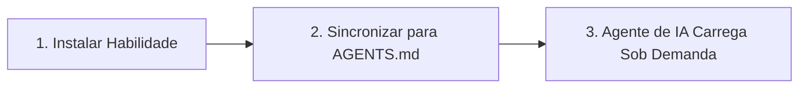

# Início Rápido com OpenSkills: Domine o Sistema de Habilidades de IA em 5 Minutos

## O Que Você Poderá Fazer Após Este Tutorial

Após completar esta lição, você será capaz de:

- Completar a instalação do OpenSkills e implantar sua primeira habilidade em 5 minutos
- Usar os comandos `openskills install` e `openskills sync` para gerenciar habilidades
- Fazer agentes de IA (Claude Code, Cursor, Windsurf, etc.) reconhecerem e usarem as habilidades instaladas
- Compreender o valor central do OpenSkills: formato de habilidade unificado, carregamento progressivo, suporte a múltiplos agentes

## O Desafio Que Você Enfrenta

Você pode ter encontrado estes problemas:

- **Habilidades incompatíveis entre agentes**: Habilidades do Claude Code não podem ser reutilizadas no Cursor ou Windsurf
- **Explosão de contexto**: Carregar muitas habilidades faz com que o consumo de tokens do agente de IA aumente rapidamente
- **Formato de habilidades caótico**: Diferentes agentes usam diferentes formas de definir habilidades, aumentando o custo de aprendizado
- **Habilidades privadas difíceis de compartilhar**: Habilidades internas da empresa não podem ser facilmente distribuídas para membros da equipe

O OpenSkills resolve todos esses problemas.

## Quando Usar Esta Solução

Use quando você precisar:

- Instalar habilidades especializadas para agentes de codificação de IA (como processamento de PDF, fluxo de trabalho Git, revisão de código, etc.)
- Gerenciar habilidades de forma unificada entre múltiplos agentes de IA
- Usar repositórios de habilidades privadas ou personalizadas
- Fazer a IA carregar habilidades sob demanda, mantendo o contexto enxuto

## 🎒 Antes de Começar

::: warning Verificação Prévia

Antes de começar, por favor confirme:

1. **Node.js 20.6 ou superior**
   ```bash
   node --version
   ```
   A saída deve mostrar `v20.6.0` ou superior

2. **Git instalado** (usado para clonar habilidades de repositórios GitHub)
   ```bash
   git --version
   ```

:::

## A Ideia Central

O funcionamento do OpenSkills pode ser resumido em três passos:



### Passo 1: Instalar Habilidades

Use `openskills install` para instalar habilidades do GitHub, caminho local ou repositório privado. As habilidades são copiadas para o diretório `.claude/skills/` do projeto.

### Passo 2: Sincronizar para AGENTS.md

Use `openskills sync` para gerar o arquivo AGENTS.md, que contém marcações XML da lista de habilidades. Os agentes de IA leem este arquivo para conhecer as habilidades disponíveis.

### Passo 3: Agente de IA Carrega Sob Demanda

Quando o usuário solicita uma tarefa específica, o agente de IA carrega dinamicamente o conteúdo da habilidade correspondente via `npx openskills read <skill-name>`, em vez de carregar todas as habilidades de uma vez.

::: info Por Que "Carregamento Progressivo"?

Método tradicional: Todas as habilidades pré-carregadas no contexto → alto consumo de tokens, resposta lenta
OpenSkills: Carregamento sob demanda → apenas habilidades necessárias são carregadas → contexto enxuto, resposta rápida

:::

---

## Faça Comigo

Agora vamos completar o processo de instalação e uso passo a passo.

### Passo 1: Entre no Diretório do Seu Projeto

Primeiro, entre no diretório do projeto em que está trabalhando:

```bash
cd /path/to/your/project
```

**Por Quê**

O OpenSkills instala habilidades por padrão no diretório `.claude/skills/` do projeto, assim as habilidades podem ser versionadas com o projeto e compartilhadas entre membros da equipe.

**O Que Você Deverá Ver**:

Seu diretório de projeto deve conter um dos seguintes:

- `.git/` (repositório Git)
- `package.json` (projeto Node.js)
- outros arquivos de projeto

::: tip Prática Recomendada

Mesmo que seja um projeto novo, recomenda-se inicializar um repositório Git para melhor gerenciamento dos arquivos de habilidades.

:::

---

### Passo 2: Instale Sua Primeira Habilidade

Use o comando a seguir para instalar habilidades do repositório oficial da Anthropic:

```bash
npx openskills install anthropics/skills
```

**Por Quê**

`anthropics/skills` é o repositório de habilidades mantido oficialmente pela Anthropic, contendo exemplos de habilidades de alta qualidade, ideal para a primeira experiência.

**O Que Você Deverá Ver**:

O comando iniciará uma interface de seleção interativa:

```
? Select skills to install: (Press <space> to select, <a> to toggle all, <i> to invert selection, and <enter> to proceed)
❯ ◉ pdf                 Comprehensive PDF manipulation toolkit for extracting text and tables...
  ◯ check-branch-first  Git workflow: Always check current branch before making changes...
  ◯ git-workflow        Git workflow: Best practices for commits, branches, and PRs...
  ◯ skill-creator       Guide for creating effective skills...
```

Use a barra de espaço para selecionar as habilidades que deseja instalar, depois pressione Enter para confirmar.

::: tip Dica

Para a primeira vez, recomenda-se selecionar apenas 1-2 habilidades (como `pdf` e `git-workflow`), familiarize-se com o processo antes de instalar mais.

:::

**O Que Você Deverá Ver** (após instalação bem-sucedida):

```
✓ Installed: pdf
✓ Installed: git-workflow

Skills installed to: /path/to/your/project/.claude/skills/

Next steps:
  Run: npx openskills sync
  This will update AGENTS.md with your installed skills
```

---

### Passo 3: Sincronize Habilidades para AGENTS.md

Agora execute o comando de sincronização:

```bash
npx openskills sync
```

**Por Quê**

O comando `sync` gera o arquivo AGENTS.md, que contém marcações XML da lista de habilidades. Os agentes de IA leem este arquivo para conhecer as habilidades disponíveis.

**O Que Você Deverá Ver**:

```
? Select skills to sync: (Press <space> to select, <a> to toggle all, <i> to invert selection, and <enter> to proceed)
❯ ◉ pdf                 [project]
  ◯ git-workflow        [project]
```

Da mesma forma, use a barra de espaço para selecionar as habilidades a serem sincronizadas, depois pressione Enter para confirmar.

**O Que Você Deverá Ver** (após sincronização bem-sucedida):

```
✓ Synced: pdf
✓ Synced: git-workflow

Updated: AGENTS.md
```

---

### Passo 4: Verifique o Arquivo AGENTS.md

Visualize o arquivo AGENTS.md gerado:

```bash
cat AGENTS.md
```

**O Que Você Deverá Ver**:

```xml
<skills_system priority="1">

## Available Skills

<!-- SKILLS_TABLE_START -->
<usage>
When users ask you to perform tasks, check if any of available skills below can help complete task more effectively.

How to use skills:
- Invoke: `npx openskills read <skill-name>` (run in your shell)
- The skill content will load with detailed instructions
- Base directory provided in output for resolving bundled resources

Usage notes:
- Only use skills listed in <available_skills> below
- Do not invoke a skill that is already loaded in your context
</usage>

<available_skills>

<skill>
<name>pdf</name>
<description>Comprehensive PDF manipulation toolkit for extracting text and tables...</description>
<location>project</location>
</skill>

<skill>
<name>git-workflow</name>
<description>Git workflow: Best practices for commits, branches, and PRs...</description>
<location>project</location>
</skill>

</available_skills>
<!-- SKILLS_TABLE_END -->

</skills_system>
```

---

### Passo 5: Visualize as Habilidades Instaladas

Use o comando `list` para visualizar as habilidades instaladas:

```bash
npx openskills list
```

**O Que Você Deverá Ver**:

```
Installed Skills:

pdf              [project]
  Comprehensive PDF manipulation toolkit for extracting text and tables...

git-workflow     [project]
  Git workflow: Best practices for commits, branches, and PRs...

Total: 2 skills (project: 2, global: 0)
```

**O Que Você Deverá Ver** (explicação):

- Nomes de habilidades à esquerda
- Etiqueta `[project]` indica que esta é uma habilidade instalada localmente no projeto
- Descrição da habilidade exibida abaixo

---

## Pontos de Verificação ✅

Após completar os passos acima, você deve confirmar:

- [ ] O diretório `.claude/skills/` foi criado, contendo as habilidades que você instalou
- [ ] O arquivo `AGENTS.md` foi gerado, contendo marcações XML da lista de habilidades
- [ ] Executar `openskills list` mostra as habilidades instaladas

Se todas as verificações passarem, parabéns! Você instalou e configurou o OpenSkills com sucesso.

---

## Armadilhas Comuns

### Problema 1: Comando `npx` não encontrado

**Mensagem de erro**:

```
command not found: npx
```

**Causa**: Node.js não está instalado ou não está configurado no PATH

**Solução**:

1. Reinstale o Node.js (recomenda-se usar [nvm](https://github.com/nvm-sh/nvm) para gerenciar versões do Node.js)
2. Confirme a instalação e reinicie o terminal

---

### Problema 2: Timeout de rede durante a instalação

**Mensagem de erro**:

```
Error: git clone failed
```

**Causa**: Acesso ao GitHub restrito ou rede instável

**Solução**:

1. Verifique a conexão de rede
2. Configure proxy (se necessário):
   ```bash
   git config --global http.proxy http://proxy.example.com:8080
   ```
3. Use mirrors (se disponíveis)

---

### Problema 3: Erro de permissão

**Mensagem de erro**:

```
Error: EACCES: permission denied
```

**Causa**: Diretório de destino não tem permissão de escrita

**Solução**:

1. Verifique as permissões do diretório:
   ```bash
   ls -la .claude/
   ```
2. Se o diretório não existir, crie primeiro:
   ```bash
   mkdir -p .claude/skills
   ```
3. Se as permissões forem insuficientes, modifique as permissões (use com cautela):
   ```bash
   chmod -R 755 .claude/
   ```

---

## Resumo da Lição

Nesta lição aprendemos:

1. **Valor central do OpenSkills**: formato de habilidade unificado, carregamento progressivo, suporte a múltiplos agentes
2. **Fluxo de trabalho em três passos**: instalar habilidades → sincronizar para AGENTS.md → agente de IA carrega sob demanda
3. **Comandos básicos**:
   - `npx openskills install <source>` - instalar habilidades
   - `npx openskills sync` - sincronizar habilidades para AGENTS.md
   - `npx openskills list` - visualizar habilidades instaladas
4. **Resolução de problemas comuns**: problemas de rede, problemas de permissão, etc.

Agora você pode fazer os agentes de IA usarem essas habilidades. Quando o agente de IA precisar executar processamento de PDF ou operações Git, ele automaticamente chamará `npx openskills read <skill-name>` para carregar o conteúdo da habilidade correspondente.

---

## Próxima Lição

> Na próxima lição aprenderemos **[O Que é OpenSkills?](../what-is-openskills/)**
>
> Você aprenderá:
> - A relação entre OpenSkills e Claude Code
> - Conceitos centrais do sistema de habilidades
> - Por que escolher CLI em vez de MCP

---

## Apêndice: Referência de Código Fonte

<details>
<summary><strong>Clique para expandir e ver a localização do código fonte</strong></summary>

> Atualizado em: 2026-01-24

### Funcionalidades Principais

| Funcionalidade | Caminho do Arquivo | Linha |
| --- | --- | --- |
| Instalar habilidade | [`src/commands/install.ts`](https://github.com/numman-ali/openskills/blob/main/src/commands/install.ts) | 83-424 |
| Sincronizar para AGENTS.md | [`src/commands/sync.ts`](https://github.com/numman-ali/openskills/blob/main/src/commands/sync.ts) | 18-109 |
| Listar habilidades | [`src/commands/list.ts`](https://github.com/numman-ali/openskills/blob/main/src/commands/list.ts) | 7-43 |
| Encontrar todas as habilidades | [`src/utils/skills.ts`](https://github.com/numman-ali/openskills/blob/main/src/utils/skills.ts) | 30-64 |
| Gerar XML | [`src/utils/agents-md.ts`](https://github.com/numman-ali/openskills/blob/main/src/utils/agents-md.ts) | 23-93 |
| Ferramentas de caminho de diretório | [`src/utils/dirs.ts`](https://github.com/numman-ali/openskills/blob/main/src/utils/dirs.ts) | 18-25 |

### Funções Principais

**install.ts**
- `installSkill(source, options)` - Função principal de instalação, suporta GitHub, caminho local e repositórios privados
- `isLocalPath(source)` - Verifica se é um caminho local
- `isGitUrl(source)` - Verifica se é uma URL Git
- `getRepoName(repoUrl)` - Extrai nome do repositório da URL Git
- `isPathInside(targetPath, targetDir)` - Verificação de segurança de travessia de caminho

**sync.ts**
- `syncAgentsMd(options)` - Sincroniza habilidades para AGENTS.md, suporta seleção interativa
- Suporta caminho de saída personalizado (flag `--output`)
- Pré-seleciona habilidades já habilitadas no arquivo atual

**agents-md.ts**
- `parseCurrentSkills(content)` - Analisa habilidades atuais em AGENTS.md
- `generateSkillsXml(skills)` - Gera XML no formato Claude Code
- `replaceSkillsSection(content, xml)` - Substitui a seção de habilidades no arquivo

**skills.ts**
- `findAllSkills()` - Encontra todas as habilidades instaladas, deduplica por prioridade
- `findSkill(skillName)` - Encontra habilidade específica
- Suporta detecção de links simbólicos e deduplicação

**dirs.ts**
- `getSkillsDir(projectLocal, universal)` - Obtém caminho do diretório de habilidades
- `getSearchDirs()` - Retorna lista de diretórios de pesquisa (prioridade: .agent projeto → .agent global → .claude projeto → .claude global)

### Constantes Importantes

- `.claude/skills/` - Caminho padrão de instalação local do projeto
- `.agent/skills/` - Caminho de instalação no modo Universal
- `~/.claude/skills/` - Caminho de instalação global
- `AGENTS.md` - Arquivo padrão de saída de sincronização

</details>
