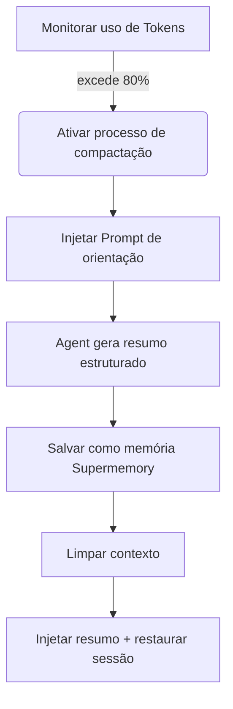

# Princípio de Compactação Preemptiva: Prevenir Esquecimento de Contexto

## O Que Você Vai Aprender

Após completar esta lição, você será capaz de:
1. **Entender** por que o Agent fica "menos inteligente" em sessões longas e como o Supermemory resolve esse problema.
2. **Dominar** as condições de acionamento e fluxo de trabalho da compactação preemptiva (Preemptive Compaction).
3. **Configurar** o limite de compactação adequado para o seu projeto, equilibrando custo e qualidade da memória.
4. **Verificar** se a compactação está funcionando normalmente e visualizar os resumos de sessão gerados.

## Seu Problema Atual

Ao programar em pares com IA, você pode ter encontrado essas situações:
* **Esquece no meio da conversa**: Em uma tarefa de refatoração longa, o Agent repentinamente esquece as regras de nomenclatura de variáveis acordadas no início.
* **Forçado a reiniciar a sessão**: A janela de contexto (Context Window) está cheia, o IDE avisa que deve limpar o histórico, fazendo você perder todo o contexto do trabalho já concluído.
* **Qualidade ruim do resumo**: A compactação automática comum apenas trunca ou resume vagamente, perdendo informações críticas como "o que fazer a seguir".

## Quando Usar Esta Abordagem

* Quando você está realizando **refatoração em grande escala** ou **desenvolvimento de funcionalidades complexas**, esperando que a sessão dure muito tempo.
* Quando o modelo que você usa tem uma janela de contexto pequena (como 32k/128k), fácil de atingir o limite.
* Quando você deseja que o Agent, mesmo após limpar o contexto, ainda consiga lembrar com precisão "a que ponto chegamos".

---

## Ideia Central: Preemptivo vs Reativo

O gerenciamento de contexto tradicional geralmente é **reativo**: espera até que o contexto esteja completamente cheio (100%), então é forçado a descartar mensagens antigas. Isso é como esperar até que o disco esteja cheio para começar a excluir arquivos, muitas vezes tarde demais para organizar.

O Supermemory adota **compactação preemptiva (Preemptive Compaction)**:

1. **Intervenção antecipada**: Acionada por padrão quando o uso de Tokens atinge **80%**, reservando espaço suficiente para pensar e resumir.
2. **Orientação estruturada**: Em vez de deixar o Agent escrever um resumo arbitrário, injeta um Prompt específico, forçando-o a resumir no formato "objetivo-progresso-pendências".
3. **Persistência de memória**: O resumo gerado não é usado apenas para restaurar a sessão atual, mas também é salvo como memória do tipo `conversation`, para recuperação futura.

### Fluxograma do Processo



---

## Detalhes do Mecanismo de Acionamento

O Supermemory monitora em tempo real o uso de Tokens de cada sessão. O processo de compactação é ativado pelas três condições rígidas a seguir:

### 1. Limiar de Uso de Token
Por padrão, quando o número total de Tokens (entrada + saída + cache) excede **80%** do limite do modelo, é ativado.

*   **Item de configuração**: `compactionThreshold`
*   **Valor padrão**: `0.80`
*   **Fonte**: [`src/services/compaction.ts`](https://github.com/supermemoryai/opencode-supermemory/blob/main/src/services/compaction.ts#L11)

### 2. Limite Mínimo de Token
Para evitar acionamento incorreto em sessões curtas (por exemplo, o contexto do modelo é muito grande, mas apenas algumas mensagens foram trocadas), o sistema codifica um limite inferior. Somente quando o uso excede **50.000 Tokens**, a compactação será considerada.

*   **Constante**: `MIN_TOKENS_FOR_COMPACTION`
*   **Valor**: `50.000`
*   **Fonte**: [`src/services/compaction.ts`](https://github.com/supermemoryai/opencode-supermemory/blob/main/src/services/compaction.ts#L12)

### 3. Tempo de Resfriamento
Para evitar acionamento contínuo levando a loop infinito, pelo menos **30 segundos** entre duas compactações.

*   **Constante**: `COMPACTION_COOLDOWN_MS`
*   **Valor**: `30.000` (ms)
*   **Fonte**: [`src/services/compaction.ts`](https://github.com/supermemoryai/opencode-supermemory/blob/main/src/services/compaction.ts#L13)

---

## Modelo de Resumo Estruturado

Quando a compactação é ativada, o Supermemory injeta um System Prompt especial (`[COMPACTION CONTEXT INJECTION]`) no Agent, exigindo que o resumo inclua obrigatoriamente as seguintes 5 partes:

| Seção | Descrição do Conteúdo | Objetivo |
| :--- | :--- | :--- |
| **1. User Requests** | Requisições originais do usuário (mantidas como estão) | Prevenir derivação de requisitos |
| **2. Final Goal** | Objetivo final a ser alcançado | Esclarecer estado final |
| **3. Work Completed** | Trabalho concluído, arquivos modificados | Evitar trabalho duplicado |
| **4. Remaining Tasks** | Tarefas pendentes restantes | Esclarecer próximos passos |
| **5. MUST NOT Do** | Itens proibidos explícitos, tentativas falhas | Evitar repetir erros |

::: details Clique para ver o código-fonte do Prompt injetado
```typescript
// src/services/compaction.ts

return `[COMPACTION CONTEXT INJECTION]

When summarizing this session, you MUST include the following sections in your summary:

## 1. User Requests (As-Is)
- List all original user requests exactly as they were stated
...

## 2. Final Goal
...

## 3. Work Completed
...

## 4. Remaining Tasks
...

## 5. MUST NOT Do (Critical Constraints)
...
This context is critical for maintaining continuity after compaction.
`;
```
:::

---

## Siga-me: Configuração e Verificação

### Passo 1: Ajustar o Limiar de Compactação (Opcional)

Se você acha que 80% é muito cedo ou muito tarde, pode ajustar em `~/.config/opencode/supermemory.jsonc`.

```jsonc
// ~/.config/opencode/supermemory.jsonc
{
  // ... outras configurações
  "compactionThreshold": 0.90
}
```

::: warning Aviso de Conflito
Se você instalou `oh-my-opencode` ou outro plugin de gerenciamento de contexto, **deve desabilitar** suas funções de compactação (como `context-window-limit-recovery`), caso contrário isso causará compactação dupla ou conflito lógico.
:::

### Passo 2: Observar Ativação de Compactação

Quando você atinge o limite em uma sessão longa, observe o alerta Toast no canto inferior direito do IDE.

**Você deve ver**:

1.  **Aviso prévio**:
    > "Preemptive Compaction: Context at 81% - compacting with Supermemory context..."
    
    Neste momento, o sistema está gerando o resumo.

2.  **Aviso de conclusão**:
    > "Compaction Complete: Session compacted with Supermemory context. Resuming..."
    
    Neste momento, o contexto foi limpo e o novo resumo injetado.

### Passo 3: Verificar Salva de Memória

Após a compactação ser concluída, o resumo gerado é salvo automaticamente no Supermemory. Você pode verificar por CLI.

**Operação**:
Execute o seguinte comando no terminal para ver as memórias mais recentes:

```bash
opencode run supermemory list --scope project --limit 1
```

**Você deve ver**:
Uma memória do tipo `conversation`, cujo conteúdo é exatamente o resumo estruturado que acabamos de ver.

```json
{
  "id": "mem_123abc",
  "content": "[Session Summary]\n## 1. User Requests\n...",
  "type": "conversation",
  "scope": "opencode_project_..."
}
```

---

## Perguntas Frequentes (FAQ)

### P: Por que minha sessão está longa mas a compactação ainda não foi ativada?
**R**: Verifique os seguintes pontos:
1.  **Total de Tokens**: Excedeu 50.000 Tokens? (sessões curtas não ativam mesmo com proporção alta).
2.  **Limite do modelo**: O OpenCode identificou corretamente o limite de contexto do modelo atual? Se a identificação falhar, ele voltará ao padrão de 200k, fazendo a proporção ser calculada baixa.
3.  **Tempo de resfriamento**: Menos de 30 segundos desde a última compactação?

### P: Quantos Tokens o resumo após compactação ocupa?
**R**: Isso depende do detalhamento do resumo, geralmente entre 500-2000 Tokens. Comparado ao contexto original de 100k+, é uma economia enorme.

### P: Posso ativar compactação manualmente?
**R**: A versão atual (v1.0) não suporta ativação manual, totalmente gerenciado automaticamente pelo algoritmo.

---

## Resumo da Lição

A compactação preemptiva é o "segredo de longa distância" do Supermemory. Através de **intervenção antecipada** e **resumo estruturado**, ela transforma o fluxo de conversação linear em instantâneos de memória refinados. Isso não apenas resolve o problema de estouro de contexto, mas mais importante, permite que o Agent, mesmo após "esquecer" (limpar contexto), possa continuar perfeitamente o trabalho anterior lendo o instantâneo.

## Próxima Lição

> Próxima lição: **[Configuração em Profundidade](../configuration/index.md)**.
>
> Você aprenderá:
> - Como personalizar o caminho de armazenamento de memória
> - Configurar limite de quantidade de resultados de busca
> - Ajustar regras de filtragem de privacidade

---

## Apêndice: Referência de Código-fonte

<details>
<summary><strong>Clique para expandir e ver a localização do código-fonte</strong></summary>

> Última atualização: 2026-01-23

| Funcionalidade | Caminho do Arquivo | Linha |
| :--- | :--- | :--- |
| Definição de constantes de limiar | [`src/services/compaction.ts`](https://github.com/supermemoryai/opencode-supermemory/blob/main/src/services/compaction.ts#L11-L14) | 11-14 |
| Geração de Prompt de orientação | [`src/services/compaction.ts`](https://github.com/supermemoryai/opencode-supermemory/blob/main/src/services/compaction.ts#L58-L98) | 58-98 |
| Lógica de detecção de ativação | [`src/services/compaction.ts`](https://github.com/supermemoryai/opencode-supermemory/blob/main/src/services/compaction.ts#L317-L358) | 317-358 |
| Lógica de salvamento de resumo | [`src/services/compaction.ts`](https://github.com/supermemoryai/opencode-supermemory/blob/main/src/services/compaction.ts#L294-L315) | 294-315 |
| Definição de itens de configuração | [`src/config.ts`](https://github.com/supermemoryai/opencode-supermemory/blob/main/src/config.ts#L22) | 22 |

**Constantes-chave**:
- `DEFAULT_THRESHOLD = 0.80`: Limiar de ativação padrão
- `MIN_TOKENS_FOR_COMPACTION = 50_000`: Número mínimo de Tokens para ativação
- `COMPACTION_COOLDOWN_MS = 30_000`: Tempo de resfriamento (milissegundos)

</details>
