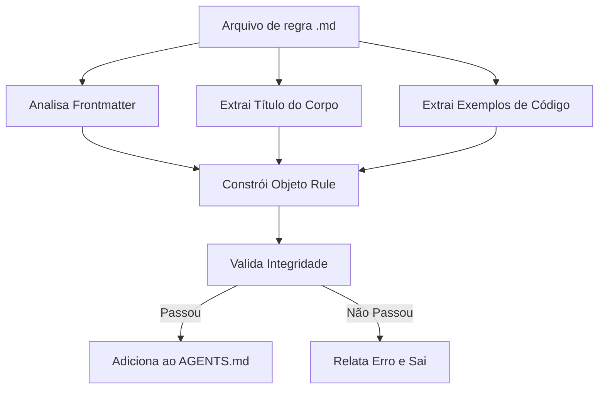

# Escrevendo Regras de Melhores Práticas do React

## O Que Você Poderá Fazer Após Este Curso

- Escrever do zero regras de otimização de desempenho do React conformes com as especificações do Agent Skills
- Usar o modelo `_template.md` para criar rapidamente arquivos de regras
- Escolher corretamente níveis de impacto (CRITICAL/HIGH/MEDIUM) para classificar regras
- Escrever exemplos de código claramente compreensíveis de Incorreto/Correto
- Validar a integridade das regras através de `pnpm validate`

## Seu Desafio Atual

Você já auditou código usando a biblioteca de regras de otimização de desempenho do React do Agent Skills, e descobriu que alguns padrões de otimização não estão cobertos. Você quer contribuir suas próprias regras, mas:

- Não sabe qual formato os arquivos de regras devem usar
- Não tem certeza de como escolher o nível de impacto
- Exemplos de código que escreveu não estão conformes, levando à falha de validação
- Preocupa-se que suas regras sejam rejeitadas ou não possam ser analisadas corretamente

## Quando Usar Esta Abordagem

Cenários apropriados para escrever regras:

- Você descobriu problemas de desempenho em seu projeto e deseja solidificá-los como regras reutilizáveis
- Sua equipe tem padrões específicos de otimização do React que deseja que o Agent aplique
- Você aprendeu novas técnicas da documentação oficial do React ou da equipe de engenharia da Vercel e deseja compartilhar com a comunidade

Cenários inapropriados:

- Problemas simples de estilo de código (use regras ESLint)
- Sugestões funcionais não relacionadas ao desempenho (use documentação ou comentários)

## Ideia Central

Arquivos de regras estão em formato Markdown e seguem uma **estrutura de três partes**:

1. **Frontmatter**: Metadados da regra (title, impact, tags)
2. **Título do corpo**: Nome de exibição da regra e descrição de impacto
3. **Exemplos de código**: Comparação `**Incorrect:**` e `**Correct:**`



**Conceitos Chave**:

::: info Nível de Impacto
O Impacto determina a posição de ordenação da regra na documentação. Níveis do maior ao menor:
- **CRITICAL**: Gargalos críticos (eliminar cachoeiras, otimização de empacotamento)
- **HIGH**: Melhorias importantes (desempenho no servidor)
- **MEDIUM-HIGH**: Prioridade média-alta (busca de dados no cliente)
- **MEDIUM**: Melhorias médias (otimização de re-render)
- **LOW-MEDIUM**: Prioridade baixa-média (micro-otimizações JavaScript)
- **LOW**: Melhorias incrementais (padrões avançados)
:::

::: info Nomenclatura kebab-case
Os nomes dos arquivos devem usar letras minúsculas separadas por hífens, como `async-parallel.md`. O prefixo do nome do arquivo (parte antes do primeiro `-`) determina o capítulo ao qual a regra pertence:
- `async-*` → Capítulo 1 (Eliminando Cachoeiras)
- `bundle-*` → Capítulo 2 (Otimização de Empacotamento)
- `rerender-*` → Capítulo 5 (Otimização de Re-render)
:::

## 🎒 Preparação Antes de Começar

::: warning Verificação de Pré-requisitos
- Já completou [Introdução ao Agent Skills](../../start/getting-started/)
- Conhece conceitos básicos de desempenho do React (re-render, waterfall, bundle, etc.)
- Já clonou o repositório: `cd source/vercel-labs/agent-skills`
- Já instalou dependências: `pnpm install`
:::

## Siga-me

### Passo 1: Copiar o Modelo de Arquivo

**Por Quê**
Usar um modelo garante o formato correto e evita esquecer campos obrigatórios.

**Operação**:

```bash
cd skills/react-best-practices/rules
cp _template.md my-new-rule.md
```

**Você Deve Ver**: Arquivo `my-new-rule.md` criado, conteúdo idêntico ao modelo.

### Passo 2: Escrever Metadados Frontmatter

**Por Quê**
O Frontmatter define o título, nível de impacto e tags de classificação da regra, sendo o primeiro ponto de verificação do analisador.

**Edite a seção frontmatter do `my-new-rule.md`**:

```yaml
---
title: Use React.lazy for Code Splitting
impact: CRITICAL
impactDescription: 50-70% reduction in initial bundle
tags: bundle, code-splitting, lazy-loading, performance
---
```

**Descrição dos Campos**:

| Campo                | Obrigatório | Descrição                                              | Exemplo de Valor                                              |
| ------------------- | ---------- | ------------------------------------------------------- | ------------------------------------------------------------ |
| `title`             | ✅         | Título breve da regra                                    | `Promise.all() for Independent Operations`                       |
| `impact`            | ✅         | Nível de impacto (6 valores enumerados)                    | `CRITICAL` / `HIGH` / `MEDIUM` etc.                          |
| `impactDescription` | ⭕         | Descrição da magnitude do impacto                         | `2-10× improvement`                                         |
| `tags`              | ⭕         | Tags separadas por vírgulas                              | `async, parallelization, promises`                             |

**Você Deve Ver**: Frontmatter atualizado para o conteúdo que você escreveu.

### Passo 3: Preencher Título e Descrição do Corpo

**Por Quê**
O título do corpo será exibido na documentação final, e a seção de descrição ajuda os usuários a entender o significado da regra.

**Adicione o corpo após o frontmatter**

```markdown
## Use React.lazy for Code Splitting

**Impact: CRITICAL (50-70% reduction in initial bundle)**

Code split large components using `React.lazy()` to reduce the initial bundle size. Components are loaded on-demand when needed.
```

**Pontos de Escrita**:

- Título H2 usa `title` do frontmatter
- Linha `**Impact:**` usa formato `**Impact: LEVEL (description)**`
- Descrição sucinta do objetivo e benefícios de desempenho da regra

### Passo 4: Escrever Exemplos Incorrect e Correct

**Por Quê**
Os exemplos comparativos são o núcleo da regra, exibindo diretamente "código problemático" e "maneira correta".

**Adicione exemplos de código após o corpo**

````markdown
**Incorrect (loads entire bundle on initial page):**

```typescript
import HeavyChart from './HeavyChart'

function Dashboard() {
  return <HeavyChart />
}
```

**Correct (loads on-demand when needed):**

```typescript
import { lazy, Suspense } from 'react'

const HeavyChart = lazy(() => import('./HeavyChart'))

function Dashboard() {
  return (
    <Suspense fallback={<LoadingSpinner />}>
      <HeavyChart />
    </Suspense>
  )
}
```
````

**Padrões de Escrita de Exemplos**:

| Requisito            | Descrição                                                                                     |
| -------------------- | ---------------------------------------------------------------------------------------------- |
| **Formato de label**  | `**Incorrect:**` ou `**Incorrect (description):**` (parênteses opcionais)          |
| **Conteúdo dos parênteses** | Opcional, breve descrição por que está errado/certo                                  |
| **Blocos de código** | Use `\`\`\`typescript` ou `\`\`\`tsx`                                                    |
| **Quantidade de exemplos** | Deve incluir pelo menos um exemplo de tipo bad ou good                            |

**Você Deve Ver**: Blocos de código renderizados corretamente com destaque de sintaxe.

### Passo 5: Adicionar Referências (Opcional)

**Por Quê**
Referências fornecem fontes autoritativas para a regra, aumentando a credibilidade.

**Adicione ao final do arquivo**

```markdown
Reference: [React.lazy and Suspense](https://react.dev/reference/react/lazy)
```

**Formatos Suportados**:

```markdown
Reference: [Texto do Link](URL)

### Múltiplas Referências
References:
- [Documentação do React.lazy](https://react.dev/reference/react/lazy)
- [Padrões de Code Splitting](https://web.dev/code-splitting-suspense/)
```

### Passo 6: Validar Arquivo de Regra

**Por Quê**
`pnpm validate` verificará a integridade da regra, garantindo que possa ser analisada corretamente.

**Execute o comando de validação**

```bash
cd packages/react-best-practices-build
pnpm validate
```

**Você Deve Ver**:

```bash
Validating rule files...
✓ All 58 rule files are valid
```

Se a validação falhar, você verá mensagens de erro detalhadas:

```bash
✗ Validation failed:

  my-new-rule.md: Missing or empty title
```

**Erros Comuns de Validação**:

| Mensagem de Erro                                                | Causa                                          | Método de Correção                                           |
| --------------------------------------------------------------- | ----------------------------------------------- | ----------------------------------------------------------- |
| `Missing or empty title`                                        | Frontmatter sem campo `title`                    | Adicione `title: Seu Título`                                |
| `Missing examples (need at least one bad and one good example)`   | Array examples vazio                             | Adicione pelo menos um exemplo (com bloco de código)         |
| `Missing code examples`                                         | Tem labels de exemplo mas sem código real         | Adicione bloco de código após as labels (`\`\`\`typescript`) |
| `Missing bad/incorrect or good/correct examples`                | Labels sem palavras-chave bad/good/incorrect/correct | Use labels legítimos: `**Incorrect:**`, `**Correct:**`, `**Example:**` |
| `Invalid impact level: &lt;value&gt;...`                        | `impact` não está na enumeração                   | Use maiúsculas: `CRITICAL`/`HIGH`/`MEDIUM-HIGH`/`MEDIUM`/`LOW-MEDIUM`/`LOW` |
| `Failed to parse`                                               | Erro de formato Markdown                         | Verifique se frontmatter está cercado por `---`              |

### Passo 7: Construir e Ver Resultados

**Por Quê**
`pnpm build` compila todas as regras em `AGENTS.md`, e você pode ver como a regra aparece na documentação.

**Execute o comando de build**

```bash
pnpm build
```

**Você Deve Ver**:

```bash
Building rules...
Validating rule files...
✓ All 58 rule files are valid
✓ Built 8 sections with 58 rules
✓ Generated test-cases.json with 172 test cases
```

**Ver Documentação Gerada**

```bash
cat skills/react-best-practices/AGENTS.md
```

**Você Deve Ver**: Sua nova regra aparece no capítulo correspondente, formato:

```markdown
### 2.1 Use React.lazy for Code Splitting

**Impact: CRITICAL (50-70% reduction in initial bundle)**

Code split large components using `React.lazy()` to reduce...
```

## Ponto de Verificação ✅

Confirme se você completou as seguintes operações:

- [ ] Copiou `_template.md` e nomeou como `my-new-rule.md`
- [ ] Frontmatter contém `title`, `impact`, `impactDescription`, `tags`
- [ ] Título do corpo é idêntico ao `title` no frontmatter
- [ ] Inclui pelo menos um exemplo de código Incorrect ou Correct
- [ ] `pnpm validate` passa
- [ ] `pnpm build` gera AGENTS.md com sucesso

## Armadilhas

### Erro Comum 1: Erro de Ortografia no Nível de Impacto

```yaml
# ❌ Incorreto: letras minúsculas causam falha de validação
# impact: critical

# ✅ Correto: use totalmente em maiúsculas (obrigatório)
impact: CRITICAL
```

**Causa**: A definição de tipo `ImpactLevel` só aceita valores enumerados totalmente em maiúsculas (`types.ts:5`).

### Erro Comum 2: Prefixo de Nome de Arquivo Incorreto

```bash
# ❌ Incorreto: prefixo não no sectionMap causa falha de inferência
# use-react-lazy.md  # Prefixo é "use", não consegue inferir capítulo

# ✅ Correto: use os 8 prefixos padrão
bundle-lazy-loading.md  # Prefixo é "bundle", pertence ao Capítulo 2
```

**Causa**: O analisador infere o capítulo a partir do prefixo do nome do arquivo (`parser.ts:201-210`). Se o prefixo não corresponder ao `sectionMap`, a regra será classificada no Capítulo 0.

### Erro Comum 3: Frontmatter Não Fechado

```markdown
---
title: My Rule
impact: MEDIUM
# ❌ Falta o `---` de fechamento

## My Rule
```

**Causa**: Frontmatter deve ser cercado por `---` (`parser.ts:42`).

### Erro Comum 4: Formato Incorreto de Label de Exemplo

````markdown
# ❌ Incorreto: faltando dois pontos
# **Incorrect**

```typescript
const bad = code
```

# ✅ Correto: dois pontos obrigatórios
# **Incorrect:**

```typescript
const bad = code
```

# ✅ Com descrição entre parênteses (recomendado)
# **Incorrect (motivo por que está errado):**

```typescript
const bad = code
```
````

**Causa**: O analisador combina labels com regex `^\*\*([^:]+?):\*?\*?$` (`parser.ts:125`), dois pontos são obrigatórios, mas descrição entre parênteses é opcional.

## Resumo da Lição

A escrita de arquivos de regras segue uma abordagem **orientada a modelos**, com núcleo em:

1. **Frontmatter** define metadados (title, impact, tags)
2. **Corpo** contém título, descrição de impacto e exemplos de código
3. **Exemplos** usam labels `**Incorrect:**` e `**Correct:**`
4. **Validação** assegura formato correto através de `pnpm validate`

Lembre-se destes 5 pontos:
- ✅ Use `_template.md` como ponto de partida
- ✅ Nível de impacto totalmente em maiúsculas (CRITICAL/HIGH/MEDIUM)
- ✅ Prefixo do nome do arquivo determina o capítulo (async-/bundle-/rerender- etc.)
- ✅ Formato de label de exemplo: `**Incorrect (description):**`
- ✅ Execute `pnpm validate` antes de submeter

## Próxima Lição

> Na próxima lição, aprenderemos **[Usando a Cadeia de Ferramentas de Build](../build-toolchain/)**.
>
> Você aprenderá:
> - Como `pnpm build` compila a documentação de regras
> - Como `pnpm extract-tests` extrai casos de teste
> - Como configurar GitHub Actions para validação automática
> - Como funciona a avaliação automática por LLM

---

## Apêndice: Referência de Código Fonte

<details>
<summary><strong>Clique para expandir localizações do código fonte</strong></summary>

> Atualizado em: 2026-01-25

| Funcionalidade            | Caminho do Arquivo                                                                                                                                                           | Número de Linha    |
| ----------------------- | ------------------------------------------------------------------------------------------------------------------------------------------------------------------ | ----------------- |
| Arquivo de Modelo de Regra | [`skills/react-best-practices/rules/_template.md`](https://github.com/vercel-labs/agent-skills/blob/main/skills/react-best-practices/rules/_template.md)           | 1-29              |
| Definição de Tipos de Regra | [`packages/react-best-practices-build/src/types.ts`](https://github.com/vercel-labs/agent-skills/blob/main/packages/react-best-practices-build/src/types.ts)       | 5-26              |
| Lógica de Validação de Regras | [`packages/react-best-practices-build/src/validate.ts`](https://github.com/vercel-labs/agent-skills/blob/main/packages/react-best-practices-build/src/validate.ts) | 21-66             |
| Análise de Frontmatter | [`packages/react-best-practices-build/src/parser.ts`](https://github.com/vercel-labs/agent-skills/blob/main/packages/react-best-practices-build/src/parser.ts)     | 42-63             |
| Mapeamento de Capítulos (infer section) | [`packages/react-best-practices-build/src/parser.ts`](https://github.com/vercel-labs/agent-skills/blob/main/packages/react-best-practices-build/src/parser.ts)     | 201-210           |
| Extração de Exemplo de Código | [`packages/react-best-practices-build/src/parser.ts`](https://github.com/vercel-labs/agent-skills/blob/main/packages/react-best-practices-build/src/parser.ts)     | 130-194           |
| Arquivo de Definição de Capítulos | [`skills/react-best-practices/rules/_sections.md`](https://github.com/vercel-labs/agent-skills/blob/main/skills/react-best-practices/rules/_sections.md)           | 1-47              |

**Definições de Tipos Chave**:

```typescript
export type ImpactLevel = 'CRITICAL' | 'HIGH' | 'MEDIUM-HIGH' | 'MEDIUM' | 'LOW-MEDIUM' | 'LOW'

export interface Rule {
  id: string
  title: string
  section: number // 1-8
  impact: ImpactLevel
  explanation: string
  examples: CodeExample[]
  references?: string[]
  tags?: string[]
}
```

**Regras de Validação Chave**:

- title não vazio (`validate.ts:26-28`)
- quantidade de examples ≥ 1 (`validate.ts:34-58`)
- impacto deve ser valor enumerado válido (`validate.ts:60-63`)

**Mapeamento de Capítulos** (prefixo de nome de arquivo → ID de capítulo):

```typescript
const sectionMap: Record<string, number> = {
  async: 1,      // Eliminando Cachoeiras
  bundle: 2,     // Otimização de Empacotamento
  server: 3,     // Desempenho no Servidor
  client: 4,     // Busca de Dados no Cliente
  rerender: 5,   // Otimização de Re-render
  rendering: 6,  // Desempenho de Renderização
  js: 7,         // Desempenho JavaScript
  advanced: 8,   // Modos Avançados
}
```

</details>
