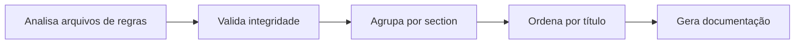

# Arquitetura e Detalhes de Implementação

## O Que Você Poderá Fazer Após Este Curso

- Entender como funciona a cadeia de ferramentas de build do Agent Skills
- Dominar a lógica central de análise de arquivos de regras
- Conhecer o sistema de tipos e design de fluxo de dados
- Aprender detalhes de implementação de algoritmos de detecção de frameworks

## Visão Geral da Arquitetura Principal

Agent Skills consiste em três partes principais:

**1. Cadeia de Ferramentas de Build** (`packages/react-best-practices-build/`)
- Analisa arquivos de regras
- Gera AGENTS.md
- Extrai casos de teste

**2. Arquivos de Regras** (`skills/react-best-practices/rules/`)
- 57 regras de otimização de desempenho do React
- Formato Markdown, seguindo especificações de modelo

**3. Scripts de Deploy** (`skills/claude.ai/vercel-deploy-claimable/`)
- Deploy com um clique no Vercel
- Detecção automática de framework

::: info Por que é Importante Entender a Arquitetura?

Se você apenas usa o Agent Skills, pode não precisar entender profundamente esses detalhes. Mas se você:
- Desenvolver habilidades personalizadas
- Escrever novas regras de otimização de desempenho
- Depurar problemas de build ou deploy

Entender a arquitetura será muito útil.
:::

## Detalhamento do Fluxo de Build

O fluxo de build compila arquivos de regras dispersos em documento AGENTS.md legível por IA. O processo é dividido em cinco etapas:



### Etapa 1: Analisar Arquivos de Regras (parse)

Cada arquivo de regra (`.md`) é analisado em um objeto `Rule` pela função `parseRuleFile()`.

**Ordem de Análise** (localização no código fonte: `parser.ts:18-238`):

1. **Extrai Frontmatter** (se existir)
   - Analisa metadados em formato YAML
   - Campos suportados: `title`, `impact`, `tags`, `section`, `explanation`, `references`

2. **Extrai Título**
   - Busca primeiro título `##` ou `###`
   - Se Frontmatter não tem title, usa este conteúdo

3. **Extrai Impact**
   - Combina linha `**Impact:**`
   - Formato: `**Impact:** CRITICAL (2-10× improvement)`
   - Extrai nível e descrição

4. **Extrai Exemplos de Código**
   - Busca marcações `**Label:**` (como `**Incorrect:**`, `**Correct:**`)
   - Coleta blocos de código subsequentes
   - Captura notas adicionais após bloco de código

5. **Extrai Referências**
   - Busca linhas `Reference:` ou `References:`
   - Analisa links Markdown `[text](url)`

6. **Infere Section**
   - Extrai do prefixo do nome do arquivo (localização no código fonte: `parser.ts:201-210`)
   - Mapa:
     - `async-*` → Section 1 (Eliminando Cachoeiras)
     - `bundle-*` → Section 2 (Otimização de Empacotamento)
     - `server-*` → Section 3 (Desempenho no Servidor)
     - `client-*` → Section 4 (Busca de Dados no Cliente)
     - `rerender-*` → Section 5 (Otimização de Re-render)
     - `rendering-*` → Section 6 (Desempenho de Renderização)
     - `js-*` → Section 7 (Desempenho JavaScript)
     - `advanced-*` → Section 8 (Modos Avançados)

### Etapa 2: Validar Integridade (validate)

A lógica de validação está implementada em `validate.ts`, assegurando que arquivos de regras seguem especificações.

**Itens de Validação**:

| Item Verificado                | Descrição                                                | Saída na Falha                |
| ----------------------------- | ------------------------------------------------------- | ------------------------------- |
| Título Não Vazio              | Deve ter título (Frontmatter ou título `##`)              | `Missing or empty title`       |
| Pelo Menos Um Exemplo         | Array `examples` não vazio                                | `At least one code example required` |
| Impacto Válido                | Deve ser valor `ImpactLevel` válido                         | `Invalid impact level`           |
| Código Não Vazio              | Cada exemplo deve ter conteúdo de código                     | `Empty code block`             |

### Etapa 3: Agrupar por Section (group)

Agrupa todas as regras por section, cada section contém:

- `number`: número do section (1-8)
- `title`: título do section (lido de `_sections.md`)
- `impact`: nível de impacto geral
- `introduction`: introdução do section (opcional)
- `rules[]`: array de regras incluídas

(localização no código fonte: `build.ts:156-169`)

### Etapa 4: Ordenar por Título (sort)

As regras em cada section são ordenadas alfabeticamente por título.

**Regras de Ordenação** (localização no código fonte: `build.ts:172-175`):
```typescript
section.rules.sort((a, b) =>
  a.title.localeCompare(b.title, 'en-US', { sensitivity: 'base' })
)
```

Usa locale `en-US` para garantir ordenação consistente entre ambientes.

**Atribuir ID** (localização no código fonte: `build.ts:178-180`):
```typescript
section.rules.forEach((rule, index) => {
  rule.id = `${section.number}.${index + 1}`
  rule.subsection = index + 1
})
```

Após ordenação, atribui IDs como `1.1`, `1.2`...

### Etapa 5: Gerar Documentação (generate)

Função `generateMarkdown()` converte array `Section[]` em documento Markdown.

**Estrutura de Saída** (localização no código fonte: `build.ts:29-126`):

```markdown
# React Best Practices
**Version 1.0**
Vercel Engineering
January 25, 2026

## Abstract
...

## Table of Contents
1. Eliminando Cachoeiras - CRITICAL
   - 1.1 [Paraleliza Requisições](#11-paraleliza-requisições)
   - 1.2 [Defer Await](#12-defer-await)
...

## 1. Eliminando Cachoeiras
**Impact: CRITICAL**

### 1.1 Paraleliza Requisições
**Impact: CRITICAL**

**Incorrect:**
```typescript
// código
```
```

## Detalhes do Analisador de Regras

### Análise de Frontmatter

Frontmatter é bloco YAML no topo de arquivo Markdown:

```markdown
---
title: Paraleliza Requisições
impact: CRITICAL
impactDescription: 2-10× improvement
tags: async, waterfall
---
```

**Lógica de Análise** (localização no código fonte: `parser.ts:28-41`):
- Detecta início `---` e fim segundo `---`
- Divide pares chave-valor por `:`
- Remove aspas de envolvimento
- Armazena em objeto `frontmatter`

### Análise de Exemplo de Código

Cada regra contém múltiplos exemplos de código, marcados com `**Label:**`.

**Máquina de Estados de Análise** (localização no código fonte: `parser.ts:66-188`):

```
Estado Inicial → Lê `**Label:`` → currentExample.label = "label"
               → Lê `\`\`\`` → inCodeBlock = true, coleta código
               → Lê `\`\`\`` → inCodeBlock = false, currentExample.code = código coletado
               → Lê texto → se afterCodeBlock, armazena em additionalText
               → Lê `**Reference:**` → empurra currentExample para examples[]
```

**Tipos de Label Suportados**:
- `Incorrect`: exemplo incorreto
- `Correct`: exemplo correto
- `Example`: exemplo genérico
- `Usage`: exemplo de uso
- `Implementation`: exemplo de implementação

**Captura de Notas Adicionais** (localização no código fonte: `parser.ts:182-186`):
```typescript
// Texto após bloco de código, ou texto em seção sem bloco de código
// (ex: "When NOT to use this pattern:" com bullets ao invés de código)
else if (currentExample && (afterCodeBlock || !hasCodeBlockForCurrentExample)) {
  additionalText.push(line)
}
```

Isso suporta adicionar notas após blocos de código, ou exemplos puramente textuais (como listas).

### Análise de Referências

Referências estão no final do arquivo, formato:

```markdown
Reference: [Documentação React](https://react.dev), [Guia Next.js](https://nextjs.org/docs)
```

**Lógica de Análise** (localização no código fonte: `parser.ts:154-174`):
- Combina padrão `[text](url)` com regex
- Extrai todas as URLs para array `references[]`

## Sistema de Tipos

Definições de tipos estão em `types.ts` (localização no código fonte: `types.ts:1-54`).

### Enumeração ImpactLevel

```typescript
export type ImpactLevel =
  | 'CRITICAL'
  | 'HIGH'
  | 'MEDIUM-HIGH'
  | 'MEDIUM'
  | 'LOW-MEDIUM'
  | 'LOW'
```

**Descrição de Níveis**:

| Nível         | Impacto                     | Exemplo de Regra              |
| -------------- | ---------------------------- | ----------------------------- |
| CRITICAL      | Gargalo crítico, deve corrigir | async-parallel               |
| HIGH          | Melhoria importante, priorize  | server-cache-react            |
| MEDIUM-HIGH   | Prioridade média-alta        | client-data-fetch             |
| MEDIUM        | Melhoria média               | rerender-memo                |
| LOW-MEDIUM    | Prioridade baixa-média      | js-use-memo                  |
| LOW           | Melhoria incremental, opcional| advanced-suspense-boundaries  |

### Interface Rule

```typescript
export interface Rule {
  id: string                    // Gerado automaticamente, como "1.1"
  title: string                 // Título da regra
  section: number              // Section pertencente (1-8)
  subsection?: number          // Número de sub-section
  impact: ImpactLevel          // Nível de impacto
  impactDescription?: string  // Descrição de impacto, como "2-10× improvement"
  explanation: string          // Explicação da regra
  examples: CodeExample[]      // Array de exemplos de código
  references?: string[]        // Links de referência
  tags?: string[]              // Tags
}
```

### Interface CodeExample

```typescript
export interface CodeExample {
  label: string              // "Incorrect", "Correct", "Example"
  description?: string       // Descrição de label (opcional)
  code: string              // Conteúdo do código
  language?: string         // Linguagem do código, padrão typescript
  additionalText?: string   // Notas adicionais após código
}
```

### Interface Section

```typescript
export interface Section {
  number: number              // Número de section (1-8)
  title: string              // Título do section
  impact: ImpactLevel        // Nível de impacto geral
  impactDescription?: string // Descrição de impacto
  introduction?: string      // Introdução do section
  rules: Rule[]             // Regras incluídas
}
```

### Interface GuidelinesDocument

```typescript
export interface GuidelinesDocument {
  version: string          // Número de versão, como "1.0"
  organization: string     // Nome da organização
  date: string            // Data
  abstract: string        // Resumo
  sections: Section[]     // Sections
  references?: string[]   // Referências globais
}
```

### Interface TestCase

Casos de teste usados para avaliação automática por LLM.

```typescript
export interface TestCase {
  ruleId: string          // ID da regra, como "1.1"
  ruleTitle: string       // Título da regra
  type: 'bad' | 'good'   // Tipo de exemplo
  code: string           // Conteúdo do código
  language: string       // Linguagem do código
  description?: string   // Descrição
}
```

## Mecanismo de Extração de Casos de Teste

Funcionalidade de extração de casos de teste converte exemplos de código em regras em casos de teste avaliáveis, usados para avaliação automática por LLM de conformidade com regras.

### Lógica de Extração (localização no código fonte: `extract-tests.ts:15-38`)

```typescript
function extractTestCases(rule: Rule): TestCase[] {
  const testCases: TestCase[] = []

  rule.examples.forEach((example, index) => {
    const isBad = example.label.toLowerCase().includes('incorrect') ||
                  example.label.toLowerCase().includes('wrong') ||
                  example.label.toLowerCase().includes('bad')
    const isGood = example.label.toLowerCase().includes('correct') ||
                   example.label.toLowerCase().includes('good')

    if (isBad || isGood) {
      testCases.push({
        ruleId: rule.id,
        ruleTitle: rule.title,
        type: isBad ? 'bad' : 'good',
        code: example.code,
        language: example.language || 'typescript',
        description: example.description || `${example.label} example for ${rule.title}`
      })
    }
  })

  return testCases
}
```

**Tipos de Exemplos Suportados**:
- `Incorrect` / `Wrong` / `Bad` → type = 'bad'
- `Correct` / `Good` → type = 'good'

**Arquivo de Saída**: `test-cases.json`

**Estrutura de Dados**:
```json
[
  {
    "ruleId": "1.1",
    "ruleTitle": "Paraleliza Requisições",
    "type": "bad",
    "code": "const data = await fetch(url);\nconst result = await process(data);",
    "language": "typescript",
    "description": "Incorrect example for Paraleliza Requisições"
  },
  {
    "ruleId": "1.1",
    "ruleTitle": "Paraleliza Requisições",
    "type": "good",
    "code": "const [data, processed] = await Promise.all([\n  fetch(url),\n  process(data)\n]);",
    "language": "typescript",
    "description": "Correct example for Paraleliza Requisições"
  }
]
```

**Estatísticas** (localização no código fonte: `extract-tests.ts:68-70`):
```bash
✓ Extracted 120 test cases to test-cases.json
  - Bad examples: 60
  - Good examples: 60
```

## Detecção de Framework no Script de Deploy

Script de deploy Vercel suporta detecção automática de mais de 40 frameworks.

### Lógica de Detecção (localização no código fonte: `deploy.sh:12-156`)

```bash
detect_framework() {
    local pkg_json="$1"
    local content=$(cat "$pkg_json")

    has_dep() {
        echo "$content" | grep -q "\"$1\""
    }

    # Verifica dependências, em ordem de prioridade
    if has_dep "blitz"; then echo "blitzjs"; return; fi
    if has_dep "next"; then echo "nextjs"; return; fi
    if has_dep "gatsby"; then echo "gatsby"; return; fi
    # ... mais verificações de framework
}
```

**Ordem de Detecção**:
- Do específico ao genérico
- Verifica `dependencies` e `devDependencies`
- Usa `grep -q` para combinação rápida

### Frameworks Suportados

| Categoria          | Lista de Frameworks                                                                     | Palavras-chave de Detecção              |
| ----------------- | ---------------------------------------------------------------------------------------- | ---------------------------------------- |
| React             | Next.js, Gatsby, Create React App, Remix, React Router, Blitz                 | `next`, `gatsby`, `remix-run`          |
| Vue               | Nuxt, Vitepress, Vuepress, Gridsome                                                   | `nuxt`, `vitepress`                    |
| Svelte            | SvelteKit, Svelte, Sapper                                                                 | `@sveltejs/kit`, `svelte`            |
| Angular           | Angular, Ionic Angular                                                                     | `@angular/core`                        |
| Backend Node.js    | Express, Hono, Fastify, NestJS, Elysia, h3, Nitro                                   | `express`, `hono`, `nestjs`            |
| Ferramentas de Build | Vite, Parcel                                                                               | `vite`, `parcel`                       |
| HTML Estático     | Sem package.json                                                                          | Retorna `null`                           |

### Tratamento de Projetos HTML Estáticos (localização no código fonte: `deploy.sh:192-206`)

Projetos HTML estáticos (sem `package.json`) requerem tratamento especial:

```bash
if [ ! -f "$PROJECT_PATH/package.json" ]; then
  # Busca arquivos HTML no diretório raiz
  HTML_FILES=$(find "$PROJECT_PATH" -maxdepth 1 -name "*.html" -type f)
  HTML_COUNT=$(echo "$HTML_FILES" | grep -c . || echo 0)

  # Se houver apenas um arquivo HTML e não for index.html, renomeia para index.html
  if [ "$HTML_COUNT" -eq 1 ]; then
    HTML_FILE=$(echo "$HTML_FILES" | head-1)
    BASENAME=$(basename "$HTML_FILE")
    if [ "$BASENAME" != "index.html" ]; then
      echo "Renaming $BASENAME to index.html..." >&2
      mv "$HTML_FILE" "$PROJECT_PATH/index.html"
    fi
  fi
fi
```

**Por que precisar renomear?**
O Vercel busca por padrão `index.html` como arquivo de entrada para sites estáticos.

### Fluxo de Deploy (localização no código fonte: `deploy.sh:158-249`)

```bash
# 1. Analisa parâmetros
INPUT_PATH="${1:-.}"

# 2. Cria diretório temporário
TEMP_DIR=$(mktemp -d)

# 3. Detecta framework
FRAMEWORK=$(detect_framework "$PROJECT_PATH/package.json")

# 4. Cria tarball (exclui node_modules e .git）
tar -czf "$TARBALL" -C "$PROJECT_PATH" --exclude='node_modules' --exclude='.git' .

# 5. Faz upload na API
RESPONSE=$(curl -s -X POST "$DEPLOY_ENDPOINT" -F "file=@$TARBALL" -F "framework=$FRAMEWORK")

# 6. Analisa resposta
PREVIEW_URL=$(echo "$RESPONSE" | grep -o '"previewUrl":"[^"]*"' | cut -d'"' -f4)
CLAIM_URL=$(echo "$RESPONSE" | grep -o '"claimUrl":"[^"]*"' | cut -d'"' -f4)

# 7. Exibe resultado
echo "Preview URL: $PREVIEW_URL"
echo "Claim URL:   $CLAIM_URL"
echo "$RESPONSE"  # Formato JSON para uso programático
```

**Tratamento de Erros** (localização no código fonte: `deploy.sh:224-239`):
```bash
if echo "$RESPONSE" | grep -q '"error"'; then
  ERROR_MSG=$(echo "$RESPONSE" | grep -o '"error":"[^"]*"' | cut -d'"' -f4)
  echo "Error: $ERROR_MSG" >&2
  exit 1
fi

if [ -z "$PREVIEW_URL" ]; then
  echo "Error: Could not extract preview URL from response" >&2
  exit 1
fi
```

## Próximos Passos

Após entender a arquitetura, você pode:

- [Desenvolver habilidades personalizadas](../../advanced/skill-development/)
- [Escrever regras de melhores práticas do React](../../advanced/rule-authoring/)
- [Ver referência de API e comandos](../reference/)

## Apêndice: Referência de Código Fonte

<details>
<summary><strong>Clique para expandir localizações do código fonte</strong></summary>

> Atualizado em: 2026-01-25

| Funcionalidade                  | Caminho do Arquivo                                                                 | Número de Linha        |
| ----------------------------- | -------------------------------------------------------------------------------- | --------------------- |
| Sistema de tipos              | [`packages/react-best-practices-build/src/types.ts`](https://github.com/vercel-labs/agent-skills/blob/main/packages/react-best-practices-build/src/types.ts) | 1-54                  |
| Configuração de caminho       | [`packages/react-best-practices-build/src/config.ts`](https://github.com/vercel-labs/agent-skills/blob/main/packages/react-best-practices-build/src/config.ts) | 1-18                  |
| Analisador de regras        | [`packages/react-best-practices-build/src/parser.ts`](https://github.com/vercel-labs/agent-skills/blob/main/packages/react-best-practices-build/src/parser.ts) | 18-238                |
| Script de build              | [`packages/react-best-practices-build/src/build.ts`](https://github.com/vercel-labs/agent-skills/blob/main/packages/react-best-practices-build/src/build.ts) | 131-287               |
| Extração de casos de teste  | [`packages/react-best-practices-build/src/extract-tests.ts`](https://github.com/vercel-labs/agent-skills/blob/main/packages/react-best-practices-build/src/extract-tests.ts) | 15-38                 |
| Detecção de framework do script de deploy | [`skills/claude.ai/vercel-deploy-claimable/scripts/deploy.sh`](https://github.com/vercel-labs/agent-skills/blob/main/skills/claude.ai/vercel-deploy-claimable/scripts/deploy.sh) | 12-156                |

**Constantes Chave**:
- `ImpactLevel` valores de enumeração: CRITICAL, HIGH, MEDIUM-HIGH, MEDIUM, LOW-MEDIUM, LOW (`types.ts:5`)
- `SKILL_DIR`: caminho do diretório de habilidades (`config.ts:11`)
- `RULES_DIR`: diretório de arquivos de regras (`config.ts:13`)
- `DEPLOY_ENDPOINT`: `https://claude-skills-deploy.vercel.com/api/deploy` (`deploy.sh:9`)

**Funções Chave**:
- `parseRuleFile()`: Analisa arquivo de regra Markdown em objeto Rule (`parser.ts:18`)
- `extractTestCases()`: Extrai casos de teste de exemplos de regra (`extract-tests.ts:15`)
- `generateMarkdown()`: Gera documento Markdown de array Section (`build.ts:29`)
- `detect_framework()`: Detecta tipo de framework do projeto (`deploy.sh:12`)

</details>
