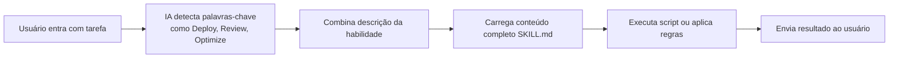

# Introdução ao Agent Skills

## O Que Você Poderá Fazer Após Este Curso

- Entender o que é o Agent Skills, e como ele expande a capacidade de agentes de codificação por IA
- Conhecer as três funcionalidades principais dos pacotes de habilidades e seus cenários de uso
- Saber quando é apropriado usar o Agent Skills para melhorar a eficiência de desenvolvimento

## Seu Desafio Atual

Ao usar Claude, Cursor ou outros agentes de codificação por IA no seu dia-a-dia, você pode encontrar estes problemas:
- Quer seguir as melhores práticas, mas não sabe quais regras lembrar
- Frequentemente repete operações de deploy semelhantes, deseja automatizá-las
- O código gerado pela IA tem qualidade inconsistente, faltando padrões unificados

## Ideia Central

**Agent Skills é um sistema de pacotes de habilidades** — fornecendo "plugins" extensíveis para agentes de codificação por IA. Cada habilidade contém:

- **SKILL.md**: Arquivo de definição da habilidade, informa ao agente de IA quando ativar essa habilidade
- **scripts/**: Scripts auxiliares (como scripts de deploy), executando tarefas específicas
- **references/**: Documentação auxiliar (opcional), fornecendo materiais de referência detalhados

::: tip Filosofia de Design
As habilidades usam um **mecanismo de carregamento sob demanda**: apenas o nome e a descrição das habilidades são carregados ao iniciar; o conteúdo completo é lido apenas quando a IA considera necessário. Isso reduz o uso do contexto e melhora a eficiência.
:::

## Pacotes de Habilidades Disponíveis

O projeto fornece três pacotes de habilidades principais, cada direcionado para um cenário específico:

### react-best-practices

Guia de otimização de desempenho do React e Next.js, dos padrões de Engenharia da Vercel. Inclui mais de 50 regras, classificadas por nível de impacto.

**Cenários de Uso**:
- Escrevendo novos componentes React ou páginas Next.js
- Auditando problemas de desempenho de código
- Otimizando tamanho de empacotamento ou tempo de carregamento

**Categorias Cobertas**:
- Eliminando Cachoeiras (Critical)
- Otimização de Tamanho de Empacotamento (Critical)
- Desempenho no Servidor (High)
- Busca de Dados no Cliente (Medium-High)
- Otimização de Re-render (Medium)
- Desempenho de Renderização (Medium)
- Micro-otimizações JavaScript (Low-Medium)
- Modos Avançados (Low)

### web-design-guidelines

Auditoria de diretrizes de design de interface web, verificando se o código atende quase 100 melhores práticas.

**Cenários de Uso**:
- Prompt: "Review my UI"
- Verificando acessibilidade (Accessibility)
- Auditando consistência de design
- Verificando desempenho e UX

**Categorias Cobertas**:
- Acessibilidade (aria-labels, HTML semântico, tratamento de teclado)
- Estados de Foco (foco visível, modo focus-visible)
- Formulários (autocompletar, validação, tratamento de erros)
- Animação (prefers-reduced-motion, transformações amigáveis à composição)
- Imagens (dimensões, lazy loading, texto alt)
- Tipografia, desempenho, navegação, etc.

### vercel-deploy-claimable

Deploy com um clique de aplicativos e sites no Vercel, retornando links de preview e de transferência de propriedade.

**Cenários de Uso**:
- Prompt: "Deploy my app"
- Compartilhar rapidamente o preview do projeto
- Deploy sem configuração, sem autenticação

**Funcionalidades Principais**:
- Detecta automaticamente mais de 40 frameworks (Next.js, Vite, Astro, etc.)
- Retorna URL de preview (site ao vivo) e URL de claim (transferência de propriedade)
- Trata automaticamente projetos HTML estáticos
- Exclui `node_modules` e `.git` durante o upload

## Como as Habilidades Funcionam

Quando você usa Claude ou outro agente de IA, o fluxo de ativação de habilidades é o seguinte:



**Exemplo de Fluxo**:

1. **Entrada do Usuário**: "Deploy my app"
2. **Detecção da IA**: Identifica a palavra-chave "Deploy", combina com habilidade `vercel-deploy`
3. **Carregamento da Habilidade**: Lê o conteúdo completo do `SKILL.md`
4. **Execução do Deploy**:
   - Executa script `deploy.sh`
   - Detecta framework (lê package.json)
   - Empacota projeto em tarball
   - Faz upload para API Vercel
5. **Retorno de Resultado**:
   ```json
   {
     "previewUrl": "https://skill-deploy-abc123.vercel.app",
     "claimUrl": "https://vercel.com/claim-deployment?code=..."
   }
   ```

## Quando Usar Esta Abordagem

Melhores momentos para usar o Agent Skills:

| Cenário                             | Habilidade Usada              | Exemplo de Prompt de Acionamento                      |
| ------------------------------------ | ---------------------------- | ---------------------------------------------------- |
| Escrevendo componentes React          | react-best-practices          | "Review this React component for performance issues"     |
| Otimizando páginas Next.js            | react-best-practices          | "Help me optimize this Next.js page"                  |
| Verificando qualidade da UI           | web-design-guidelines         | "Check accessibility of my site"                        |
| Fazendo deploy de projetos            | vercel-deploy-claimable     | "Deploy my app to production"                          |

## Modelo de Segurança

::: info Notas de Segurança
- **Execução local**: Todas as habilidades são executadas localmente, sem upload de dados a serviços terceiros (exceto API de deploy Vercel)
- **Ativação sob demanda**: As habilidades carregam conteúdo detalhado apenas quando a IA considera relevante, reduzindo risco de vazamento de privacidade
- **Código aberto e transparente**: Todas as habilidades e scripts são open source e auditáveis
:::

## Armadilhas

### Habilidade Não Ativada

Se a habilidade não foi ativada, verifique:
- O prompt contém palavras-chave suficientes (como "Deploy", "Review")
- A habilidade foi corretamente instalada no diretório `~/.claude/skills/`
- Se estiver usando claude.ai, confirme se a habilidade foi adicionada ao knowledge do projeto

### Permissões de Rede

Algumas habilidades precisam de acesso à rede:
- `vercel-deploy-claimable` precisa acessar API de deploy Vercel
- `web-design-guidelines` precisa buscar as regras mais recentes do GitHub

**Solução**: Adicione os domínios necessários em claude.ai/settings/capabilities.

## Resumo da Lição

Agent Skills é um sistema de pacotes de habilidades projetado para agentes de codificação por IA, fornecendo:
- **react-best-practices**: Mais de 50 regras de otimização de desempenho do React/Next.js
- **web-design-guidelines**: Quase 100 melhores práticas de design web
- **vercel-deploy-claimable**: Deploy com um clique no Vercel

As habilidades usam um mecanismo de carregamento sob demanda para reduzir o uso do contexto. Após a instalação, os agentes de IA ativarão automaticamente as habilidades correspondentes em tarefas relevantes.

## Próxima Lição

> Na próxima lição, aprenderemos **[Instalando o Agent Skills](../installation/)**.
>
> Você aprenderá:
> - Dois métodos de instalação: Claude Code e claude.ai
> - Configurando permissões de rede
> - Verificando se as habilidades foram corretamente instaladas

---

## Apêndice: Referência de Código Fonte

<details>
<summary><strong>Clique para expandir localizações do código fonte</strong></summary>

> Atualizado em: 2026-01-25

| Funcionalidade        | Caminho do Arquivo                                                              | Número de Linha    |
| ------------------- | ----------------------------------------------------------------------------- | ------------------ |
| Lista de pacotes de habilidades   | [`README.md`](https://github.com/vercel-labs/agent-skills/blob/main/README.md#L7-L80) | 7-80               |
| Descrição de estrutura de habilidades | [`README.md`](https://github.com/vercel-labs/agent-skills/blob/main/README.md#L103-L110) | 103-110            |
| Especificação AGENTS.md | [`AGENTS.md`](https://github.com/vercel-labs/agent-skills/blob/main/AGENTS.md) | Total              |
| Estrutura de diretório de habilidades | [`AGENTS.md`](https://github.com/vercel-labs/agent-skills/blob/main/AGENTS.md#L11-L20) | 11-20              |
| Formato SKILL.md    | [`AGENTS.md`](https://github.com/vercel-labs/agent-skills/blob/main/AGENTS.md#L29-L68) | 29-68              |
| Comando de empacotamento de habilidades | [`AGENTS.md`](https://github.com/vercel-labs/agent-skills/blob/main/AGENTS.md#L93-L96) | 93-96              |
| Método de instalação do usuário | [`AGENTS.md`](https://github.com/vercel-labs/agent-skills/blob/main/AGENTS.md#L98-L110) | 98-110             |
| Mecanismo de carregamento sob demanda | [`AGENTS.md`](https://github.com/vercel-labs/agent-skills/blob/main/AGENTS.md#L72-L78) | 72-78              |
| Scripts de cadeia de ferramentas de build | [`packages/react-best-practices-build/package.json`](https://github.com/vercel-labs/agent-skills/blob/main/packages/react-best-practices-build/package.json) | Total              |

**Constantes Chave**:
- Sem constantes embutidas em código

**Funções Chave**:
- `build.ts`: Constrói AGENTS.md e casos de teste
- `validate.ts`: Valida integridade de arquivos de regras
- `extract-tests.ts`: Extrai casos de teste de regras

</details>
