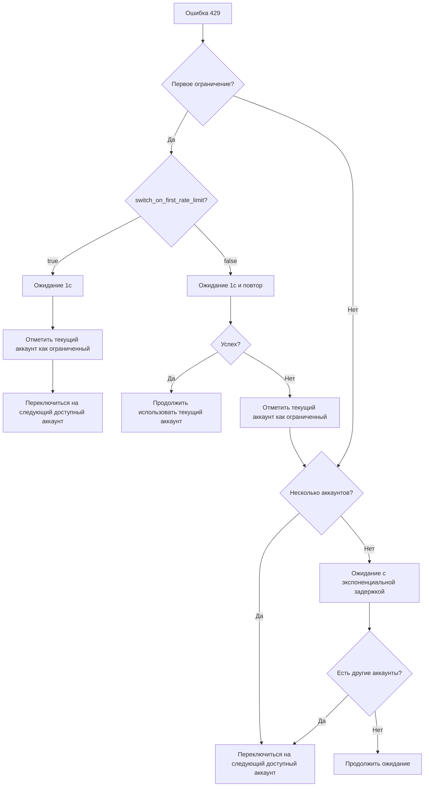

# Обработка ограничения скорости: автоматический повтор и механизм переключения аккаунтов

## Что вы сможете делать после изучения

Понимание и освоение интеллектуального механизма обработки ограничения скорости в Antigravity Auth включает детальное изучение различных аспектов работы с ошибками 429. Вы научитесь различать пять ключевых типов ошибок ограничения скорости, которые могут возникнуть при работе с API. Каждый тип имеет свои особенности и требует специфического подхода к обработке, что критически важно для обеспечения стабильной работы ваших приложений.

Особое внимание будет уделено алгоритмам экспоненциальной задержки, которые позволяют оптимально распределять повторные попытки запросов во времени. Это помогает избежать повторных блокировок и эффективно использовать доступные ресурсы API. Вы также освоите логику автоматического переключения между аккаунтами в сценариях с несколькими учетными записями, что существенно повышает отказоустойчивость вашей системы.

Дополнительно мы рассмотрим конфигурирование стратегий переключения при первом ограничении скорости, включая возможность немедленного переключения или двух попыток повтора перед сменой аккаунта. Наконец, вы узнаете, как использовать механизм fallback с двойным пулом квот Gemini для максимизации доступности и производительности ваших запросов.

Теперь вы сможете эффективно справляться с ситуациями, когда все аккаунты заблокированы по ограничению скорости, но фактические квоты еще не исчерпаны. Это позволит оптимизировать использование ресурсов и минимизировать простои в работе ваших приложений.

## Ваша текущая проблема

При работе с несколькими Google-аккаунтами вы, вероятно, сталкиваетесь с рядом характерных сложностей. Во-первых, регулярные ошибки 429 создают неопределенность в принятии решений о дальнейших действиях: стоит ли повторить запрос или немедленно переключиться на другой аккаунт. Эта дилемма существенно замедляет рабочие процессы и требует постоянного внимания разработчика.

Во-вторых, различные типы ошибок 429 требуют совершенно разного времени ожидания перед повторной попыткой. Без глубокого понимания специфики каждого типа невозможно выбрать оптимальную стратегию поведения, что приводит либо к преждевременным повторным попыткам (и новым блокировкам), либо к избыточному ожиданию (и потере производительности).

В-третьих, ситуация, когда все аккаунты заблокированы по ограничению скорости, но фактические квоты не исчерпаны, представляет особую проблему. Это происходит из-за неточностей в определении ограничений и может приводить к неоправданному простою рабочих процессов.

Наконец, непрозрачность механизма переключения между двойными пулами квот Gemini создает дополнительные сложности в оптимизации использования доступных ресурсов. Непонимание точного момента переключения между пулами приводит к нерациональному расходованию квот.

## Когда применять этот подход

Данный подход становится актуальным в нескольких ключевых сценариях. Если вы настроили несколько аккаунтов и регулярно сталкиваетесь с ошибками 429, это первый сигнал о необходимости внедрения интеллектуальной системы обработки ограничений скорости. Оптимизация успешности запросов в многокаккаунтной среде требует автоматизированного подхода к управлению ограничениями.

Когда возникает потребность в точной настройке стратегии повторных попыток, например, при необходимости немедленного переключения при первом ограничении скорости, данный механизм предоставляет гибкие возможности конфигурирования. Вы можете адаптировать поведение системы под конкретные требования вашего рабочего процесса.

Наконец, при использовании моделей Gemini и желании максимально эффективно задействовать двойной пул квот, понимание механизмов fallback становится критически важным для оптимизации производительности и доступности ваших запросов.

## Ключевая концепция

### Что такое обработка ограничения скорости

При возникновении ошибки 429 плагин Antigravity Auth автоматически выполняет комплексную последовательность действий для минимизации влияния ограничений на рабочие процессы. Первым делом система осуществляет детальную диагностику типа ограничения, анализируя поля `reason` и `message` в ответе API для точной классификации проблемы.

После идентификации типа ограничения алгоритм переходит к расчету оптимального времени ожидания. Этот расчет учитывает не только тип ограничения, но и количество предыдущих неудачных попыток, что позволяет динамически адаптировать стратегию поведения. Далее система применяет выбранную стратегию: в многокаккаунтной среде приоритет отдается переключению на доступный аккаунт, тогда как при работе с единственным аккаунтом применяется механизм экспоненциальной задержки с повторными попытками.

Завершающим этапом является обновление статуса ограничения для затронутого аккаунта, что обеспечивает корректную работу последующих запросов и предотвращает повторное использование временно недоступных ресурсов.

::: info Почему необходима интеллектуальная обработка
Google применяет ограничения скорости к каждому аккаунту индивидуально. Примитивный подход "429 = переключить" может привести к чрезмерно частым переключениям и пропуску быстро восстанавливающихся аккаунтов. С другой стороны, простой "ожидание и повтор" может привести к нерациональному использованию квот доступных аккаунтов. Интеллектуальная обработка находит оптимальный баланс между "переключением" и "ожиданием".
:::

### Пять типов ограничений скорости

Antigravity Auth классифицирует ограничения скорости по пяти основным типам на основе анализа полей `reason` и `message` в ответе API. Каждый тип имеет специфическую стратегию обработки и характерное время восстановления.

| Тип | Причина | Стратегия задержки | Типичный сценарий |
| --- | --- | --- | --- |
| `QUOTA_EXHAUSTED` | Исчерпание квоты (дневной или месячной) | Инкрементная задержка: 1мин → 5мин → 30мин → 120мин | Исчерпание дневной квоты |
| `RATE_LIMIT_EXCEEDED` | Слишком быстрые запросы (лимит в минуту) | Фиксированные 30 секунд | Многочисленные запросы за короткий период |
| `MODEL_CAPACITY_EXHAUSTED` | Недостаточная емкость сервера модели | Фиксированные 15 секунд | Пиковые часы нагрузки |
| `SERVER_ERROR` | Внутренняя ошибка сервера (5xx) | Фиксированные 20 секунд | Нестабильная работа сервиса |
| `UNKNOWN` | Неизвестная причина | Фиксированные 60 секунд | Нераспознанная ошибка |

**Формула расчета времени задержки** (accounts.ts:51-75):

```typescript
// QUOTA_EXHAUSTED: инкрементная задержка (на основе количества последовательных неудач)
// Неудача 1: 1мин (60_000мс)
// Неудача 2: 5мин (300_000мс)
// Неудача 3: 30мин (1_800_000мс)
// Неудача 4+: 120мин (7_200_000мс)

// Другие типы: фиксированная задержка
// RATE_LIMIT_EXCEEDED: 30с
// MODEL_CAPACITY_EXHAUSTED: 15с
// SERVER_ERROR: 20с
// UNKNOWN: 60с
```

### Алгоритм экспоненциальной задержки

Antigravity Auth применяет алгоритм **экспоненциальной задержки с дедупликацией**, который оптимизирует повторные попытки и предотвращает избыточное накопление задержек при параллельных запросах.

**Основная логика** (plugin.ts:509-567):

```typescript
// 1. Окно дедупликации: параллельные запросы 429 в течение 2 секунд считаются одним событием
const RATE_LIMIT_DEDUP_WINDOW_MS = 2000;

// 2. Сброс состояния: сброс счетчика через 2 минуты без ошибок 429
const RATE_LIMIT_STATE_RESET_MS = 120_000;

// 3. Экспоненциальная задержка: baseDelay * 2^(attempt-1), максимум 60с
const expBackoff = Math.min(baseDelay * Math.pow(2, attempt - 1), 60000);
```

**Зачем нужно окно дедупликации**

Рассмотрим ситуацию с тремя параллельными запросами, одновременно получившими ошибку 429. Без механизма дедупликации каждый запрос увеличил бы свой счетчик, что привело бы к attempt=3 и задержке 4с (2^2 × 1с). С применением дедупликации все три запроса обрабатываются как единое событие с attempt=1 и задержкой 1с. Этот механизм предотвращает чрезмерное увеличение времени ожидания при параллельных запросах.

### Логика переключения между аккаунтами

В многокаккаунтной среде Antigravity Auth реализует стратегию **"приоритет переключения, повтор как запасной вариант"**.

**Алгоритм принятия решений**:



**Ключевые параметры конфигурации** (config/schema.ts:256-259):

| Параметр | Значение по умолчанию | Описание |
| --- | --- | --- |
| `switch_on_first_rate_limit` | `true` | Переключаться ли на другой аккаунт при первом ограничении (с ожиданием 1с) |
| `max_rate_limit_wait_seconds` | `300` | Максимальное время ожидания при ограничении всех аккаунтов (5 минут) |

**Рекомендуемые конфигурации**:

Для многокаккаунтной среды (2+) рекомендуется использовать `switch_on_first_rate_limit: true` для немедленного переключения и оптимизации использования квот. В однокаккаунтном режиме данный параметр неактуален, система автоматически применяет экспоненциальную задержку с повторными попытками.

### Fallback на двойной пул квот Gemini

Модели Gemini поддерживают два независимых пула квот: приоритетный пул Antigravity с меньшей емкостью и резервный пул Gemini CLI с большей емкостью.

**Логика fallback** (plugin.ts:1318-1345):

```
1. Выполнить запрос с использованием пула квот Antigravity
2. При получении ошибки 429 проверить доступность Antigravity-квот других аккаунтов
   - Если доступны: переключить аккаунт, продолжить использование Antigravity
   - Если недоступны: при quota_fallback=true переключиться на пул Gemini CLI
```

**Параметр конфигурации** (config/schema.ts:179):

```json
{
  "quota_fallback": true  // По умолчанию false
}
```

**Пример**:

При наличии двух аккаунтов, оба получивших ошибку 429, поведение системы различается в зависимости от настройки quota_fallback. При значении false оба аккаунта остаются ограниченными, и система ожидает 5 минут перед повторной попыткой. При значении true после исчерпания Antigravity-квот обоих аккаунтов система автоматически переключается на пул Gemini CLI без ожидания.

::: tip Преимущества двойного пула квот
Пул квот Gemini CLI обычно имеет больший объем, и fallback существенно повышает успешность запросов. Однако следует учитывать, что явное использование суффикса `:antigravity` для модели отключает fallback, а переключение происходит только после исчерпания Antigravity-квот всех аккаунтов.
:::

### Логика повторных попыток для одного аккаунта

При работе с единственным аккаунтом Antigravity Auth применяет **экспоненциальную задержку с повторными попытками**.

**Формула повтора** (plugin.ts:1373-1375):

```typescript
// Первая попытка: 1с
// Вторая попытка: 2с (1с × 2^1)
// Третья попытка: 4с (1с × 2^2)
// Четвертая попытка: 8с (1с × 2^3)
// ...
// Максимум: 60с
const expBackoffMs = Math.min(1000 * Math.pow(2, attempt - 1), 60000);
```

**Процесс повторных попыток**:

```
Первая попытка: ошибка 429
  ↓ Ожидание 1с и повтор (быстрый повтор)
Вторая попытка: снова 429
  ↓ Ожидание 2с и повтор
Третья попытка: снова 429
  ↓ Ожидание 4с и повтор
...
```

**Отличие от многокаккаунтного режима**:

| Сценарий | Стратегия | Время ожидания |
| --- | --- | --- |
| Один аккаунт | Экспоненциальная задержка | 1с → 2с → 4с → 8с → ... → 60с |
| Несколько аккаунтов | Переключение аккаунта | 1с (первая) или 5с (вторая) |

## 🎒 Подготовка перед началом

::: warning Предварительная проверка
Убедитесь, что вы выполнили:
- [x] Настройку нескольких аккаунтов (минимум 2 Google-аккаунта)
- [x] Понимание [стратегий выбора аккаунта](/ru/NoeFabris/opencode-antigravity-auth/advanced/account-selection-strategies/)
- [x] Понимание [двойной системы квот](/ru/NoeFabris/opencode-antigravity-auth/platforms/dual-quota-system/)
:::

## Следуйте инструкциям

### Шаг 1: Включите отладочные логи для наблюдения за ограничениями скорости

**Зачем**
Отладочные логи предоставляют детальную информацию об ограничениях скорости и помогают понять принципы работы плагина.

**Действие**

Включите отладочные логи:

```bash
export OPENCODE_ANTIGRAVITY_DEBUG=1
```

Выполните запросы для触发 ограничения скорости:

```bash
# Выполните несколько параллельных запросов (для触发 ошибки 429)
for i in {1..10}; do
  opencode run "Test $i" --model=google/antigravity-gemini-3-pro &
done
wait
```

**Ожидаемый результат**:

```
[RateLimit] 429 on Account 0 family=claude retryAfterMs=60000
  message: You have exceeded the quota for this request.
  quotaResetTime: 2026-01-23T12:00:00Z
  retryDelayMs: 60000
  reason: QUOTA_EXHAUSTED

Rate limited. Quick retry in 1s... (уведомление toast)
```

**Интерпретация логов**:

- `429 on Account 0 family=claude`: ограничение скорости для аккаунта 0 в семействе Claude
- `retryAfterMs=60000`: сервер рекомендует ожидание 60 секунд
- `reason: QUOTA_EXHAUSTED`: исчерпание квоты (инкрементная задержка)

### Шаг 2: Настройте немедленное переключение при первом ограничении

**Зачем**
При наличии нескольких аккаунтов немедленное переключение при первом ограничении максимизирует использование квот и исключает ненужное ожидание.

**Действие**

Измените конфигурационный файл:

```bash
cat > ~/.config/opencode/antigravity.json << 'EOF'
{
  "$schema": "https://raw.githubusercontent.com/NoeFabris/opencode-antigravity-auth/main/assets/antigravity.schema.json",
  "switch_on_first_rate_limit": true
}
EOF
```

**Ожидаемый результат**: конфигурационный файл обновлен.

**Проверка активации конфигурации**:

Выполните несколько запросов и наблюдайте за поведением при первом ограничении:

```bash
export OPENCODE_ANTIGRAVITY_DEBUG=1
for i in {1..5}; do
  opencode run "Test $i" --model=google/antigravity-gemini-3-pro &
done
wait
```

**Ожидаемый результат**:

```
[RateLimit] 429 on Account 0 family=gemini retryAfterMs=30000
Server at capacity. Switching account in 1s... (уведомление toast)
[AccountContext] Selected account: user2@gmail.com (index: 1)
```

**Ключевые моменты**:
- После первой ошибки 429 ожидание 1с
- Автоматическое переключение на следующий доступный аккаунт (index: 1)
- Повторные попытки на текущем аккаунте не выполняются

### Шаг 3: Отключите немедленное переключение при первом ограничении

**Зачем**
Если требуется сначала выполнить повторные попытки на текущем аккаунте (во избежание частых переключений), можно отключить данную опцию.

**Действие**

Измените конфигурационный файл:

```bash
cat > ~/.config/opencode/antigravity.json << 'EOF'
{
  "$schema": "https://raw.githubusercontent.com/NoeFabris/opencode-antigravity-auth/main/assets/antigravity.schema.json",
  "switch_on_first_rate_limit": false
}
EOF
```

**Ожидаемый результат**: конфигурационный файл обновлен.

**Проверка активации конфигурации**:

Повторно выполните несколько запросов:

```bash
export OPENCODE_ANTIGRAVITY_DEBUG=1
for i in {1..5}; do
  opencode run "Test $i" --model=google/antigravity-gemini-3-pro &
done
wait
```

**Ожидаемый результат**:

```
[RateLimit] 429 on Account 0 family=gemini retryAfterMs=30000
Rate limited. Quick retry in 1s... (уведомление toast)
[RateLimit] 429 on Account 0 family=gemini retryAfterMs=30000
Rate limited again. Switching account in 5s... (уведомление toast)
[AccountContext] Selected account: user2@gmail.com (index: 1)
```

**Ключевые моменты**:
- Первая ошибка 429: ожидание 1с и **повторная попытка на текущем аккаунте**
- Вторая ошибка 429: ожидание 5с и **переключение аккаунта**
- При успешном повторе использование текущего аккаунта продолжается

### Шаг 4: Включите Fallback на двойной пул квот Gemini

**Зачем**
Модели Gemini поддерживают двойной пул квот, и включение fallback существенно повышает успешность запросов.

**Действие**

Измените конфигурационный файл:

```bash
cat > ~/.config/opencode/antigravity.json << 'EOF'
{
  "$schema": "https://raw.githubusercontent.com/NoeFabris/opencode-antigravity-auth/main/assets/antigravity.schema.json",
  "quota_fallback": true
}
EOF
```

**Ожидаемый результат**: конфигурационный файл обновлен.

**Проверка активации конфигурации**:

Выполните запросы Gemini (убедитесь в触发 ограничения пула квот Antigravity):

```bash
export OPENCODE_ANTIGRAVITY_DEBUG=1
for i in {1..5}; do
  opencode run "Test $i" --model=google/antigravity-gemini-3-pro &
done
wait
```

**Ожидаемый результат**:

```
[RateLimit] 429 on Account 0 family=gemini retryAfterMs=30000
Antigravity quota exhausted for gemini-3-pro. Switching to Gemini CLI quota... (уведомление toast)
[DEBUG] quota fallback: gemini-cli
```

**Ключевые моменты**:
- После исчерпания квот Antigravity всех аккаунтов
- Автоматическое переключение на пул квот Gemini CLI
- Повторная попытка без ожидания

**Принудительное использование квоты Antigravity** (без fallback):

```bash
# Используйте явный суффикс :antigravity
opencode run "Test" --model=google/antigravity-gemini-3-pro:antigravity
```

### Шаг 5: Настройте максимальное время ожидания

**Зачем**
При ограничении всех аккаунтов плагин ожидает минимальное время сброса. Можно настроить максимальное время ожидания для предотвращения избыточных задержек.

**Действие**

Измените конфигурационный файл:

```bash
cat > ~/.config/opencode/antigravity.json << 'EOF'
{
  "$schema": "https://raw.githubusercontent.com/NoeFabris/opencode-antigravity-auth/main/assets/antigravity.schema.json",
  "max_rate_limit_wait_seconds": 60
}
EOF
```

**Ожидаемый результат**: конфигурационный файл обновлен.

**Проверка активации конфигурации**:

Создайте условия для ограничения всех аккаунтов:

```bash
export OPENCODE_ANTIGRAVITY_DEBUG=1
for i in {1..20}; do
  opencode run "Test $i" --model=google/antigravity-claude-opus-4.5 &
done
wait
```

**Ожидаемый результат**:

```
[RateLimit] 429 on Account 0 family=claude retryAfterMs=60000
[RateLimit] 429 on Account 1 family=claude retryAfterMs=60000
[DEBUG] All accounts rate limited. Min wait time: 60s, max wait: 60s
Rate limited. Retrying in 60s... (уведомление toast)
```

**Ключевые моменты**:
- При ограничении всех аккаунтов ожидается минимальное время сброса
- Если минимальное время сброса превышает `max_rate_limit_wait_seconds`, используется максимальное значение
- По умолчанию максимальное ожидание составляет 300 секунд (5 минут)

## Контрольные точки ✅

::: tip Как проверить активацию конфигурации
1. Проверьте конфигурационный файл на корректность параметров
2. Включите отладочные логи: `OPENCODE_ANTIGRAVITY_DEBUG=1`
3. Наблюдайте за событиями `[RateLimit]` в логах
4. Отслеживайте поведение переключения аккаунтов (логи `[AccountContext]`)
5. Проверьте соответствие уведомлений toast ожидаемому поведению
:::

##提醒 о распространенных ошибках

### ❌ Игнорирование окна дедупликации и неправильная интерпретация времени задержки

**Неправильное поведение**:
- Выполнение 10 параллельных запросов, все получивших ошибку 429
- Ожидание времени задержки 2^10 × 1с = 1024с
- Фактическое время задержки: 1с (благодаря окну дедупликации)

**Правильный подход**: понимайте принцип 2-секундного окна дедупликации, параллельные запросы не будут повторно учитываться.

### ❌ Неправильное использование `switch_on_first_rate_limit` с одним аккаунтом

**Неправильное поведение**:
- Наличие только одного аккаунта с конфигурацией `switch_on_first_rate_limit: true`
- Ожидание переключения аккаунта при отсутствии других аккаунтов

**Правильный подход**: в однокаккаунтном режиме данная конфигурация неактивна, автоматически применяется экспоненциальная задержка с повторными попытками.

### ❌ Явный суффикс Gemini блокирует fallback

**Неправильное поведение**:
- Использование `google/antigravity-gemini-3-pro:antigravity`
- Конфигурация `quota_fallback: true`
- Отсутствие fallback на Gemini CLI при ошибке 429

**Правильный подход**: явный суффикс принудительно использует указанный пул квот, для fallback не используйте суффикс.

### ❌ Слишком длительное ожидание после ограничения всех аккаунтов

**Неправильное поведение**:
- Конфигурация `max_rate_limit_wait_seconds: 600` (10 минут)
- Все аккаунты ограничены на 60с, но ожидание составило 10 минут

**Правильный подход**: `max_rate_limit_wait_seconds` является **максимальным** значением, фактическое время ожидания равно минимальному времени сброса и не превышает максимальное значение.

## Резюме урока

| Механизм | Ключевые особенности | Применимые сценарии |
| --- | --- | --- |
| **Обнаружение ограничения скорости** | Различение 5 типов (QUOTA_EXHAUSTED, RATE_LIMIT_EXCEEDED и др.) | Все сценарии |
| **Экспоненциальная задержка** | Увеличение времени ожидания с количеством неудач (1с → 2с → 4с → ... → 60с) | Один аккаунт |
| **Переключение аккаунтов** | Приоритет переключения в многокаккаунтном режиме, экспоненциальная задержка для одного аккаунта | Несколько аккаунтов |
| **Окно дедупликации** | Параллельные ошибки 429 в течение 2 секунд считаются одним событием | Параллельные запросы |
| **Fallback двойного пула квот** | При ограничении Antigravity попытка Gemini CLI | Модели Gemini |

**Ключевые конфигурации**:

| Параметр | По умолчанию | Рекомендуемое | Описание |
| --- | --- | --- | --- |
| `switch_on_first_rate_limit` | `true` | `true` (несколько аккаунтов) | Немедленное переключение при первом ограничении |
| `quota_fallback` | `false` | `true` (Gemini) | Включить fallback на двойной пул квот |
| `max_rate_limit_wait_seconds` | `300` | `300` | Максимальное время ожидания (секунды) |

**Методы отладки**:

- Включите отладочные логи: `OPENCODE_ANTIGRAVITY_DEBUG=1`
- Отслеживайте события `[RateLimit]`: узнавайте тип ограничения и время задержки
- Наблюдайте за логами `[AccountContext]`: отслеживайте поведение переключения аккаунтов

## Анонс следующего урока

> В следующем уроке мы изучим **[восстановление сессии](/ru/NoeFabris/opencode-antigravity-auth/advanced/session-recovery/)**.
>
> Вы узнаете:
> - Как автоматически восстанавливать прерванные вызовы инструментов
> - Механизм восстановления сессии для моделей Thinking
> - Принцип внедрения Synthetic tool_result

---

## Приложение: справочник по исходному коду

<details>
<summary><strong>Нажмите для просмотра расположения исходного кода</strong></summary>

> Время обновления: 2026-01-23

| Функция | Путь к файлу | Номера строк |
| --- | --- | --- |
| Определение типов ограничения скорости | [`src/plugin/accounts.ts`](https://github.com/NoeFabris/opencode-antigravity-auth/blob/main/src/plugin/accounts.ts#L10-L20) | 10-20 |
| Парсинг причины ограничения | [`src/plugin/accounts.ts`](https://github.com/NoeFabris/opencode-antigravity-auth/blob/main/src/plugin/accounts.ts#L29-L49) | 29-49 |
| Расчет времени задержки | [`src/plugin/accounts.ts`](https://github.com/NoeFabris/opencode-antigravity-auth/blob/main/src/plugin/accounts.ts#L51-L75) | 51-75 |
| Алгоритм экспоненциальной задержки | [`src/plugin.ts`](https://github.com/NoeFabris/opencode-antigravity-auth/blob/main/src/plugin.ts#L532-L567) | 532-567 |
| Отметка аккаунта как ограниченного | [`src/plugin/accounts.ts`](https://github.com/NoeFabris/opencode-antigravity-auth/blob/main/src/plugin/accounts.ts#L434-L461) | 434-461 |
| Проверка ограничения аккаунта | [`src/plugin/accounts.ts`](https://github.com/NoeFabris/opencode-antigravity-auth/blob/main/src/plugin/accounts.ts#L134-L152) | 134-152 |
| Обработка ошибок 429 | [`src/plugin.ts`](https://github.com/NoeFabris/opencode-antigravity-auth/blob/main/src/plugin.ts#L1260-L1396) | 1260-1396 |
| Fallback двойного пула квот Gemini | [`src/plugin.ts`](https://github.com/NoeFabris/opencode-antigravity-auth/blob/main/src/plugin.ts#L1318-L1345) | 1318-1345 |
| Логи ограничения скорости | [`src/plugin/debug.ts`](https://github.com/NoeFabris/opencode-antigravity-auth/blob/main/src/plugin/debug.ts#L354-L396) | 354-396 |
| Конфигурация Schema | [`src/plugin/config/schema.ts`](https://github.com/NoeFabris/opencode-antigravity-auth/blob/main/src/plugin/config/schema.ts#L256-L221) | 256-221 |

**Ключевые константы**:

- `QUOTA_EXHAUSTED_BACKOFFS = [60_000, 300_000, 1_800_000, 7_200_000]`: инкрементная задержка при исчерпании квоты (accounts.ts:22)
- `RATE_LIMIT_EXCEEDED_BACKOFF = 30_000`: фиксированная задержка 30 секунд при превышении лимита (accounts.ts:23)
- `MODEL_CAPACITY_EXHAUSTED_BACKOFF = 15_000`: фиксированная задержка 15 секунд при исчерпании емкости (accounts.ts:24)
- `SERVER_ERROR_BACKOFF = 20_000`: фиксированная задержка 20 секунд при ошибке сервера (accounts.ts:25)
- `RATE_LIMIT_DEDUP_WINDOW_MS = 2000`: окно дедупликации 2 секунды (plugin.ts:509)
- `RATE_LIMIT_STATE_RESET_MS = 120_000`: сброс состояния через 2 минуты (plugin.ts:510)
- `FIRST_RETRY_DELAY_MS = 1000`: первая быстрая повторная попытка 1 секунда (plugin.ts:1304)

**Ключевые функции**:

- `parseRateLimitReason(reason?, message?)`: парсинг причины ограничения (accounts.ts:29)
- `calculateBackoffMs(reason, consecutiveFailures, retryAfterMs?)`: расчет времени задержки (accounts.ts:51)
- `markRateLimitedWithReason(account, family, headerStyle, model, reason, retryAfterMs?)`: отметка аккаунта как ограниченного (accounts.ts:445)
- `isRateLimitedForHeaderStyle(account, family, headerStyle, model?)`: проверка ограничения аккаунта (accounts.ts:536)
- `getRateLimitBackoff(accountIndex, quotaKey, serverRetryAfterMs)`: получение времени задержки с дедупликацией (plugin.ts:532)
- `resetRateLimitState(accountIndex, quotaKey)`: сброс состояния ограничения (plugin.ts:573)

</details>
