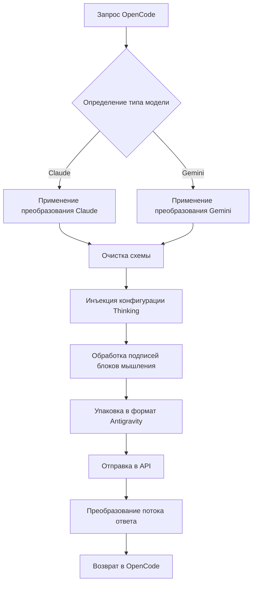

# Механизм преобразования запросов: совместимость с множественными протоколами моделей

## Чему вы научитесь

- Понимать, как плагин преобразует форматы запросов между OpenCode и Antigravity API
- Освоить различия протоколов моделей Claude и Gemini и правила преобразования
- Устранять ошибки 400, вызванные несовместимостью схем
- Оптимизировать конфигурацию Thinking для достижения наилучшей производительности

## Ваша текущая ситуация

Возможно, вы столкнулись со следующими проблемами:

- ❌ MCP-сервер возвращает ошибку `400 Unknown name 'parameters'`
- ❌ При использовании модели Gemini появляется сообщение `400 Unknown name 'const'`
- ❌ Блоки мышления моделей Thinking отображаются в неправильном формате
- ❌ Вызовы инструментов завершаются с ошибкой проверки подписи
- ❌ Непонятно, почему плагин может одновременно поддерживать Claude и Gemini

## Когда использовать этот подход

Когда вам нужно:

| Сценарий | Зачем понимать механизм преобразования |
|---|---|
| Разработка пользовательского MCP-сервера | Обеспечение совместимости схем инструментов с Antigravity API |
| Устранение ошибок 400/500 | Определение, является ли проблема схемы или логики преобразования |
| Оптимизация производительности Thinking | Понимание подписей блоков мышления и механизма кэширования |
| Отладка сбоев вызова инструментов | Проверка распределения ID инструментов и подписей параметров |

::: warning Предварительные проверки
Перед началом этого урока убедитесь, что вы:
- ✅ Установили плагин opencode-antigravity-auth
- ✅ Знаете о доступных моделях и их вариантах
- ✅ Понимаете базовые концепции моделей Thinking

[Урок списка моделей](../../platforms/available-models/) | [Урок моделей Thinking](../../platforms/thinking-models/)
:::

## Основная концепция

Преобразование запросов — это ключевой механизм плагина, который выполняет три задачи:

1. **Перехват запросов OpenCode** — перехват вызовов `fetch(generativeLanguage.googleapis.com)`
2. **Применение преобразований модели** — преобразование формата в зависимости от типа модели (Claude/Gemini)
3. **Упаковка и отправка** — упаковка в формат Antigravity и вызов API
4. **Преобразование ответа** — преобразование ответа в формат, распознаваемый OpenCode

**Диаграмма процесса преобразования**:



**Ключевые точки преобразования**:

| Тип преобразования | Назначение | Расположение в исходном коде |
|---|---|---|
| Очистка схемы | Удаление полей, не поддерживаемых Antigravity API | `src/plugin/request-helpers.ts` |
| Конфигурация Thinking | Инъекция правильной конфигурации мышления в зависимости от семейства модели | `src/plugin/transform/claude.ts`, `src/plugin/transform/gemini.ts` |
| Обработка блоков мышления | Удаление исторических блоков мышления и инъекция подписей | `src/plugin/request.ts` |
| Преобразование потока ответа | Преобразование событий SSE в формат OpenCode | `src/plugin/core/streaming.ts` |

## Практическое руководство

### Шаг 1: Понимание правил преобразования Claude

**Почему**
Модели Claude используют другой формат протокола (snake_case, режим VALIDATED), требующий специальной обработки.

**Ключевые правила преобразования**

| Исходный формат | Преобразованный формат | Пояснение |
|---|---|---|
| `toolConfig.functionCallingConfig.mode` | `"VALIDATED"` | Принудительное включение проверки вызова инструментов |
| `thinkingConfig.includeThoughts` | `include_thoughts` | Формат snake_case |
| `thinkingConfig.thinkingBudget` | `thinking_budget` | Формат snake_case |
| `maxOutputTokens` | Автоматическая корректировка до 64 000 | Модели Thinking требуют больше пространства вывода |

**Расположение в исходном коде**: [`src/plugin/transform/claude.ts:43-56`](https://github.com/NoeFabris/opencode-antigravity-auth/blob/main/src/plugin/transform/claude.ts#L43-L56)

**Пример**

```typescript
// До преобразования (формат OpenCode)
{
  "toolConfig": {
    "functionCallingConfig": {
      "mode": "AUTO"
    }
  },
  "thinkingConfig": {
    "includeThoughts": true,
    "thinkingBudget": 32000
  }
}

// После преобразования (формат Antigravity)
{
  "toolConfig": {
    "functionCallingConfig": {
      "mode": "VALIDATED"  // Принудительно VALIDATED
    }
  },
  "thinkingConfig": {
    "include_thoughts": true,  // snake_case
    "thinking_budget": 32000   // snake_case
  },
  "generationConfig": {
    "maxOutputTokens": 64000   // Автоматическая корректировка для моделей Thinking
  }
}
```

**Что вы должны увидеть**:
- Все преобразования моделей Claude следуют соглашению об именовании snake_case
- `maxOutputTokens` автоматически корректируется до достаточно большого значения (`CLAUDE_THINKING_MAX_OUTPUT_TOKENS = 64 000`)

### Шаг 2: Понимание правил преобразования Gemini

**Почему**
Модели Gemini используют формат camelCase и имеют строгие требования к JSON Schema (тип с заглавной буквы).

**Ключевые правила преобразования**

| Исходный формат | Преобразованный формат | Пояснение |
|---|---|---|
| JSON Schema `type: "object"` | `type: "OBJECT"` | Тип должен быть заглавными буквами |
| `additionalProperties: false` | Удалено | Gemini API не поддерживает |
| `$ref: "#/$defs/Foo"` | Преобразовано в `description: "See: Foo"` | Ссылки преобразованы в описания |
| `const: "foo"` | `enum: ["foo"]` | const преобразован в enum |
| `enum: ["a", "b"` | Добавлено описание-подсказка `(Allowed: a, b)` | Автоматическое добавление подсказок для перечислений с 2-10 элементами |

**Расположение в исходном коде**: [`src/plugin/transform/gemini.ts:52-124`](https://github.com/NoeFabris/opencode-antigravity-auth/blob/main/src/plugin/transform/gemini.ts#L52-L124)

**Пример**

```json
// До преобразования (формат OpenCode)
{
  "parameters": {
    "type": "object",
    "properties": {
      "status": {
        "type": "string",
        "const": "active",
        "enum": ["active", "inactive"]
      }
    }
  }
}

// После преобразования (формат Gemini)
{
  "parameters": {
    "type": "OBJECT",  // Заглавные буквы
    "properties": {
      "status": {
        "type": "STRING",  // Заглавные буквы
        "enum": ["active", "inactive"],  // const удален
        "description": "(Allowed: active, inactive)"  // Автоматическое добавление подсказки
      }
    }
  }
}
```

**Что вы должны увидеть**:
- Все типы схемы Gemini преобразованы в заглавные буквы (`STRING`, `OBJECT`, `ARRAY`)
- Поля `const` удалены и преобразованы в `enum`
- Неподдерживаемые поля (`$ref`, `additionalProperties`) удалены

### Шаг 3: Понимание процесса очистки схемы

**Почему**
Antigravity API использует строгую валидацию на основе protobuf и не поддерживает все поля стандартного JSON Schema.

**Четырехэтапный процесс очистки**

1. **Этап 1a: Преобразование $ref в описание**
   - `$ref: "#/$defs/Foo"` → `{ description: "See: Foo" }`

2. **Этап 1b: Преобразование const в enum**
   - `const: "foo"` → `enum: ["foo"]`

3. **Этап 1c: Добавление подсказок перечисления**
   - `enum: ["a", "b"]` → добавление `(Allowed: a, b)` в описание

4. **Этап 1d: Удаление неподдерживаемых полей**
   - Удаление: `$schema`, `$defs`, `additionalProperties`, `pattern`, `minLength`, `maxLength` и т.д.

**Расположение в исходном коде**: [`src/plugin/request-helpers.ts:20-280`](https://github.com/NoeFabris/opencode-antigravity-auth/blob/main/src/plugin/request-helpers.ts#L20-L280)

**Список неподдерживаемых полей**:

| Поле | Почему не поддерживается | Альтернатива |
|---|---|---|
| `$ref` | Ссылки не разрешены | Преобразование в подсказку описания |
| `const` | Константы не разрешены | Использование `enum` |
| `additionalProperties` | Дополнительные свойства не проверяются | Указание в описании |
| `$schema`, `$defs` | Черновик JSON не используется | Удаление |
| `pattern`, `minLength`, `maxLength` | Ограничения строк обрабатываются сервером | Удаление |
| `minItems`, `maxItems` | Ограничения массивов обрабатываются сервером | Удаление |

**Что вы должны увидеть**:
- Схемы MCP-серверов очищены до формата, совместимого с Antigravity
- Ошибки 400 сокращены, сообщения об ошибках стали более понятными

### Шаг 4: Понимание механизма обработки блоков мышления

**Почему**
Модели Claude и Gemini 3 требуют стабильных подписей блоков мышления, иначе возникают ошибки проверки подписи.

**Трехэтапный процесс обработки**

1. **Удаление исторических блоков мышления**
   - Рекурсивное удаление всех исторических блоков `thinking` (во избежание конфликтов подписей)
   - Использование кэша для проверки валидности подписей

2. **Инъекция новой подписи мышления**
   - Генерация стабильной подписи для новых блоков мышления
   - Кэширование подписей для многорундовых диалогов

3. **Обеспечение порядка блоков мышления**
   - Claude: thinking должен быть перед tool_use
   - Gemini: thinking может появляться в любом месте

**Расположение в исходном коде**:
- [`src/plugin/request.ts:711-724`](https://github.com/NoeFabris/opencode-antigravity-auth/blob/main/src/plugin/request.ts#L711-L724)

**Пример подписи блока мышления**:

```typescript
// Формат блока мышления Claude
{
  "type": "thinking",
  "text": "Необходимо проанализировать потребности пользователя...",
  "signature": "sig-abc123",  // Подпись, внедренная плагином
  "cache_control": { "type": "ephemeral" }  // Управление кэшированием
}

// Исторический блок мышления (удален)
{
  "type": "thinking",
  "text": "Старый анализ...",  // Удален
  "signature": "sig-old456"  // Подпись недействительна
}
```

**Что вы должны увидеть**:
- Исторические блоки мышления не отображаются повторно в многорундовых диалогах
- Новые блоки мышления имеют правильные подписи
- Перед вызовом инструментов есть полный процесс мышления

### Шаг 5: Понимание потокового преобразования ответов

**Почему**
Antigravity API возвращает поток SSE (Server-Sent Events), который необходимо преобразовать в формат, распознаваемый OpenCode.

**Ключевые правила преобразования**

| Исходный формат | Преобразованный формат | Пояснение |
|---|---|---|
| `thought: true` | `type: "reasoning"` | Преобразование формата блока мышления |
| `text` | Без изменений | Текстовое содержимое |
| `tool_use` | Без изменений | Вызов инструмента |
| `tool_result` | Без изменений | Результат инструмента |

**Расположение в исходном коде**: [`src/plugin/core/streaming.ts`](https://github.com/NoeFabris/opencode-antigravity-auth/blob/main/src/plugin/core/streaming.ts)

**Пример события SSE**:

```
// Возвращаемое значение Antigravity API
data: {"type": "thinking", "text": "Анализ...", "thought": true}

// После преобразования
data: {"type": "reasoning", "text": "Анализ..."}

// Событие текста
data: {"type": "text", "text": "Привет"}

// Событие вызова инструмента
data: {"type": "tool_use", "id": "tool-123", "name": "my_function"}
```

**Что вы должны увидеть**:
- Блоки мышления правильно отображаются как тип `reasoning` в интерфейсе
- Потоковый ответ без задержек, построчное преобразование
- События вызова инструментов в правильном формате

## Контрольная точка ✅

После завершения вышеуказанных шагов вы должны быть в состоянии ответить на следующие вопросы:

- [ ] В какое значение будет установлен `toolConfig.mode` для моделей Claude?
- [ ] Во что будет преобразован `type: "string"` в схеме Gemini?
- [ ] Почему необходимо удалять исторические блоки мышления?
- [ ] В какой формат будет преобразовано поле `const`?
- [ ] Какова роль подписи блока мышления?

## Предупреждения о подводных камнях

### Подводный камень 1: Схема MCP содержит $ref, вызывая ошибку 400

**Сообщение об ошибке**: `400 Unknown name 'parameters'`

**Причина**: MCP-сервер использует ссылки `$ref` JSON Schema, которые не поддерживаются Antigravity API.

**Решение**:
- Проверьте определение схемы MCP-сервера
- Удалите `$ref`, разверните структуру объекта напрямую
- Или измените код MCP-сервера

**Пример**:

```json
// ❌ Ошибка: использование $ref
{
  "properties": {
    "data": { "$ref": "#/$defs/DataModel" }
  },
  "$defs": {
    "DataModel": { "type": "string" }
  }
}

// ✅ Правильно: прямое развёртывание
{
  "properties": {
    "data": { "type": "string" }
  }
}
```

### Подводный камень 2: Поле const вызывает ошибку 400 в моделях Gemini

**Сообщение об ошибке**: `400 Unknown name 'const'`

**Причина**: Конечная точка Gemini Antigravity API не поддерживает поле `const`.

**Решение**:
- Вручную преобразуйте `const` в `enum`
- Или полагайтесь на автоматическое преобразование плагина (уже реализовано)

**Пример**:

```json
// ❌ Ошибка: использование const
{
  "properties": {
    "status": { "type": "string", "const": "active" }
  }
}

// ✅ Правильно: использование enum
{
  "properties": {
    "status": { "type": "string", "enum": ["active"] }
  }
}
```

### Подводный камень 3: Модели Thinking отображают иероглифы

**Сообщение об ошибке**: Блоки мышления отображаются как `[object Object]` или в неправильном формате

**Причина**: Ошибка в логике преобразования ответа или недействительность кэша подписей.

**Решение**:
1. Проверьте журналы отладки: `opencode --debug`
2. Очистите кэш подписей: удалите поле кэша в `~/.config/opencode/antigravity-accounts.json`
3. Перезапустите OpenCode

### Подводный камень 4: Вызов инструментов завершается с ошибкой подписи

**Сообщение об ошибке**: `tool_result_missing` или ошибка проверки подписи

**Причина**:
- Неправильный порядок блоков мышления (thinking должен быть перед tool_use)
- Несоответствие кэша подписей
- Ошибка распределения ID инструментов

**Решение**:
- Плагин автоматически повторяет попытку (механизм восстановления сессии)
- Включите режим отладки для просмотра подробных ошибок
- Проверьте правильность определения инструментов

## Резюме урока

Ключевые моменты механизма преобразования запросов:

1. **Семейство моделей определяет правила преобразования** — Claude (snake_case, VALIDATED) против Gemini (camelCase, схема с заглавными буквами)
2. **Очистка схемы обязательна** — удаление неподдерживаемых полей, таких как `$ref`, `const`, `additionalProperties`
3. **Подписи блоков мышления критичны** — стабильные подписи обеспечивают согласованность многорундовых диалогов
4. **Потоковое преобразование ответа** — преобразование событий SSE в формат OpenCode в реальном времени

**Ключевые расположения в исходном коде**:
- Главное преобразование запросов: [`src/plugin/request.ts:585`](https://github.com/NoeFabris/opencode-antigravity-auth/blob/main/src/plugin/request.ts#L585)
- Преобразование Claude: [`src/plugin/transform/claude.ts`](https://github.com/NoeFabris/opencode-antigravity-auth/blob/main/src/plugin/transform/claude.ts)
- Преобразование Gemini: [`src/plugin/transform/gemini.ts`](https://github.com/NoeFabris/opencode-antigravity-auth/blob/main/src/plugin/transform/gemini.ts)
- Очистка схемы: [`src/plugin/request-helpers.ts`](https://github.com/NoeFabris/opencode-antigravity-auth/blob/main/src/plugin/request-helpers.ts)
- Потоковое преобразование: [`src/plugin/core/streaming.ts`](https://github.com/NoeFabris/opencode-antigravity-auth/blob/main/src/plugin/core/streaming.ts)

## Предварительный просмотр следующего урока

> В следующем уроке мы изучим **[механизм восстановления сессии](../session-recovery/)**.
>
> Вы узнаете:
> - Принцип работы восстановления сессий
> - Как автоматически обрабатывать сбои вызова инструментов
> - Как исправить поврежденный порядок блоков мышления

---

## Приложение: Справочник по исходному коду

<details>
<summary><strong>Нажмите, чтобы просмотреть расположение исходного кода</strong></summary>

> Дата обновления: 2026-01-23

| Функция | Путь к файлу | Номер строки |
|---|---|---|
| Главная точка входа преобразования запросов | [`src/plugin/request.ts`](https://github.com/NoeFabris/opencode-antigravity-auth/blob/main/src/plugin/request.ts#L585) | 585-1443 |
| Точка входа преобразования ответа | [`src/plugin/request.ts`](https://github.com/NoeFabris/opencode-antigravity-auth/blob/main/src/plugin/request.ts#L1445) | 1445-1663 |
| Определение модели Claude | [`src/plugin/transform/claude.ts`](https://github.com/NoeFabris/opencode-antigravity-auth/blob/main/src/plugin/transform/claude.ts#L27) | 27-29 |
| Конфигурация Thinking Claude | [`src/plugin/transform/claude.ts`](https://github.com/NoeFabris/opencode-antigravity-auth/blob/main/src/plugin/transform/claude.ts#L62) | 62-72 |
| Конфигурация инструментов Claude | [`src/plugin/transform/claude.ts`](https://github.com/NoeFabris/opencode-antigravity-auth/blob/main/src/plugin/transform/claude.ts#L43) | 43-57 |
| Определение модели Gemini | [`src/plugin/transform/gemini.ts`](https://github.com/NoeFabris/opencode-antigravity-auth/blob/main/src/plugin/transform/gemini.ts#L129) | 129-132 |
| Конфигурация Thinking Gemini 3 | [`src/plugin/transform/gemini.ts`](https://github.com/NoeFabris/opencode-antigravity-auth/blob/main/src/plugin/transform/gemini.ts) | Найти `buildGemini3ThinkingConfig` |
| Преобразование схемы Gemini | [`src/plugin/transform/gemini.ts`](https://github.com/NoeFabris/opencode-antigravity-auth/blob/main/src/plugin/transform/gemini.ts#L52) | 52-124 |
|---|---|---|
|---|---|---|
|---|---|---|
| Удаление блоков мышления | [`src/plugin/request-helpers.ts`](https://github.com/NoeFabris/opencode-antigravity-auth/blob/main/src/plugin/request-helpers.ts) | Найти `deepFilterThinkingBlocks` |
| Инъекция подписи блока мышления | [`src/plugin/request.ts`](https://github.com/NoeFabris/opencode-antigravity-auth/blob/main/src/plugin/request.ts#L715) | 715-720 |
| Потоковое преобразование | [`src/plugin/core/streaming.ts`](https://github.com/NoeFabris/opencode-antigravity-auth/blob/main/src/plugin/core/streaming.ts) | Полный текст |

**Ключевые константы**:
- `CLAUDE_THINKING_MAX_OUTPUT_TOKENS = 64_000` ([`src/plugin/transform/claude.ts:18`](https://github.com/NoeFabris/opencode-antigravity-auth/blob/main/src/plugin/transform/claude.ts#L18)): Максимальное ограничение выходных токенов для моделей Claude Thinking
- `UNSUPPORTED_SCHEMA_FIELDS` ([`src/plugin/transform/gemini.ts:27`](https://github.com/NoeFabris/opencode-antigravity-auth/blob/main/src/plugin/transform/gemini.ts#L27)): Набор неподдерживаемых полей схемы Gemini API

**Ключевые функции**:
- `prepareAntigravityRequest()` ([`src/plugin/request.ts:585`](https://github.com/NoeFabris/opencode-antigravity-auth/blob/main/src/plugin/request.ts#L585)): Главная функция подготовки запроса Antigravity API
- `transformAntigravityResponse()` ([`src/plugin/request.ts:1445`](https://github.com/NoeFabris/opencode-antigravity-auth/blob/main/src/plugin/request.ts#L1445)): Главная функция преобразования ответа Antigravity API
- `toGeminiSchema()` ([`src/plugin/transform/gemini.ts:52`](https://github.com/NoeFabris/opencode-antigravity-auth/blob/main/src/plugin/transform/gemini.ts#L52)): Преобразование JSON Schema в формат, совместимый с Gemini
- `cleanJSONSchemaForAntigravity()` ([`src/plugin/request-helpers.ts`](https://github.com/NoeFabris/opencode-antigravity-auth/blob/main/src/plugin/request-helpers.ts)): Четырехэтапная очистка схемы
- `createStreamingTransformer()` ([`src/plugin/core/streaming.ts`](https://github.com/NoeFabris/opencode-antigravity-auth/blob/main/src/plugin/core/streaming.ts)): Создание преобразователя потока SSE

</details>
