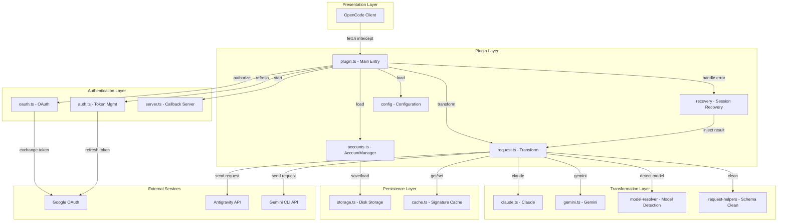
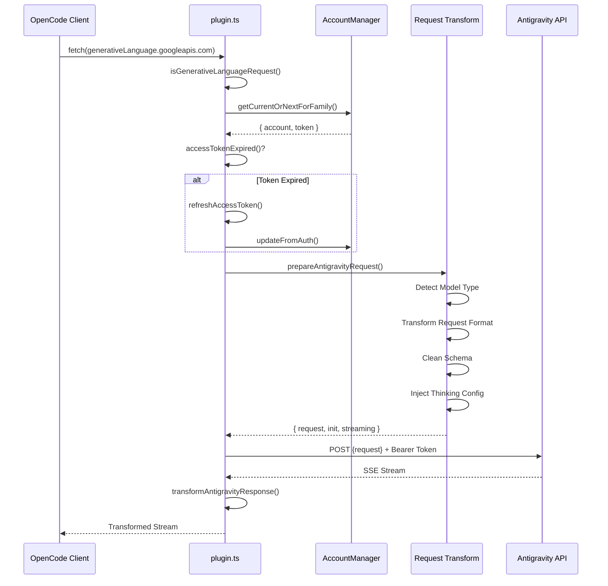
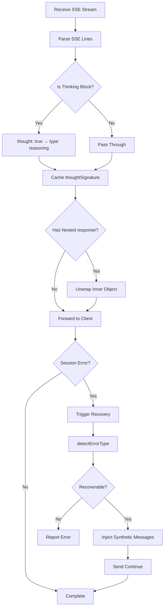

# Обзор архитектуры плагина: Понимание внутреннего дизайна OpenCode Antigravity Auth

## Что вы узнаете

Этот курс проведет вас через архитектурный дизайн и внутренние принципы работы плагина Antigravity Auth. После завершения этого курса вы сможете:

- Понять структуру модулей плагина и обязанности каждого модуля
- Овладеть полным циклом обработки запросов от OpenCode до Antigravity API
- Изучить механизм балансировки нагрузки для управления несколькими аккаунтами
- Понять принципы работы восстановления сессии
- Овладеть техническими деталями преобразования формата запросов

## Основная ценность плагина

Основная роль плагина Antigravity Auth — построить «мост перевода» между OpenCode и Antigravity API:

1. **Преобразование протокола** - Преобразование форматов запросов OpenCode в форматы, требуемые Antigravity API
2. **Управление аутентификацией** - Безопасное получение и обновление токенов доступа через Google OAuth 2.0 PKCE
3. **Балансировка нагрузки** - Объединение нескольких аккаунтов с автоматической ротацией для избежания ограничений скорости
4. **Восстановление ошибок** - Автоматическое обнаружение и устранение проблем с прерыванием сессий

::: info Зачем понимать архитектуру?
Понимание архитектуры плагина поможет вам:
- Быстро определить модуль, в котором возникла проблема
- Понять область действия параметров конфигурации
- Оптимизировать стратегии использования нескольких аккаунтов
- Участвовать в разработке и отладке плагина
:::

## Обзор структуры модулей

Плагин использует слоистую архитектуру с четким разделением обязанностей для каждого модуля:



### Обязанности модулей

| Модуль | Файл | Обязанности |
| --- | --- | --- |
| **Главный вход** | `plugin.ts` | Перехватчик fetch, инициализация плагина, обработка событий |
| **Управление аккаунтами** | `accounts.ts` | Пул нескольких аккаунтов, стратегия балансировки нагрузки, отслеживание ограничений скорости |
| **Преобразование запросов** | `request.ts` | Преобразование формата запросов, потоковая обработка ответов |
| **Преобразование моделей** | `transform/` | Логика преобразования для Claude/Gemini |
| **Аутентификация OAuth** | `antigravity/oauth.ts` | Процесс аутентификации PKCE, обмен токенами |
| **Восстановление сессии** | `recovery/` | Обнаружение ошибок, автоматическое восстановление прерванных сессий |
| **Управление конфигурацией** | `config/` | Загрузка конфигурации, валидация схемы |
| **Уровень хранения** | `storage.ts` | Постоянное хранение аккаунтов (файл JSON) |
| **Уровень кеширования** | `cache.ts` | Кеширование подписей, сокращение избыточных вычислений |
| **Журнал отладки** | `debug.ts` | Структурированное журналирование, устранение неполадок |

## Поток обработки запросов

Когда модельный запрос отправляется из OpenCode, плагин проходит через полную цепочку обработки:



### Подробности шагов

**Шаг 1: Перехват запроса**
- Плагин перехватывает все запросы к `generativelanguage.googleapis.com` через перехватчик `fetch`
- Использует `isGenerativeLanguageRequest()` для определения, является ли это запрос, связанный с Antigravity
- Нецелевые запросы передаются напрямую, чтобы не влиять на другие функции

**Шаг 2: Выбор аккаунта**
- Выбирает доступный аккаунт из пула аккаунтов (на основе настроенной стратегии: sticky/round-robin/hybrid)
- Проверяет, истек ли срок действия токена, и автоматически обновляет при необходимости
- Применяет смещение PID (если включено), чтобы обеспечить равномерное распределение аккаунтов в сценариях с несколькими агентами

**Шаг 3: Преобразование запроса** (`request.ts`)
- **Обнаружение модели**: Определяет, является ли модель Claude или Gemini
- **Обработка Thinking**:
  - Claude: Удаляет все исторические блоки thinking для избежания конфликтов подписей
  - Gemini: Добавляет конфигурацию `thinkingConfig`
- **Преобразование инструментов**: Преобразует инструменты OpenCode в формат `functionDeclarations`
- **Очистка схемы**: Удаляет неподдерживаемые поля JSON Schema (`const`, `$ref`, `$defs` и т.д.)
- **Обертка запроса**: Инкапсулирует в формат `{ project, model, request: {...} }`

**Шаг 4: Отправка запроса**
- Добавляет специальные заголовки Antigravity (User-Agent, Client-Metadata)
- Использует аутентификацию Bearer Token
- Поддерживает резерные конечные точки (daily → autopush → prod)

**Шаг 5: Преобразование ответа**
- Потоковое получение SSE, преобразование построчно
- Преобразует `thought: true` в `type: "reasoning"`
- Кеширует подпись thinking для последующих запросов
- Разворачивает внутренний объект `response` для сохранения согласованности формата
## Поток обработки ответов

Обработка ответов в основном включает потоковое преобразование и восстановление сессии:



### Ключевые механизмы обработки

**1. Преобразование блоков thinking**

Формат блока thinking, возвращаемый Antigravity API:
```json
{ "thought": true, "text": "содержание thinking" }
```

Плагин преобразует его в формат, совместимый с OpenCode:
```json
{ "type": "reasoning", "reasoning": "содержание thinking" }
```

**2. Кеширование подписей**

Модели Claude и Gemini 3 требуют совпадения подписей блоков thinking в многоходовых диалогах:
- Извлекает `thoughtSignature` из ответа
- Сохраняет в память и на диск с помощью `cacheSignature()`
- Получает и внедряет через `getCachedSignature()` в следующем запросе

::: tip Зачем нужно кеширование подписей?
API Claude и Gemini 3 требуют, чтобы блоки thinking перед вызовами инструментов имели правильные подписи. Кеширование подписей позволяет:
- Избежать сбоев запросов, вызванных ошибками подписи
- Сократить избыточную генерацию одинакового содержания thinking
- Улучшить непрерывность многоходовых диалогов
:::

**3. Восстановление сессии**

При обнаружении ошибки сессии:
1. Перехватывает ошибку через событие `session.error`
2. Вызывает `detectErrorType()` для определения возможности восстановления
3. Для ошибки `tool_result_missing`:
   - Извлекает ID неудачных `tool_use`
   - Внедряет синтетические сообщения `tool_result`
   - Автоматически отправляет "continue" (если включено)
4. Для ошибок порядка блоков thinking:
   - Анализирует состояние диалога
   - Закрывает поврежденный ход
   - Запускает новый ход для повторной генерации модели
## Подробное описание ключевых механизмов

### Механизм аутентификации OAuth

Плагин использует OAuth 2.0 с PKCE (Proof Key for Code Exchange):

```mermaid
flowchart LR
    A[User runs opencode auth login] --> B[Generate PKCE Key Pair]
    B --> C[Build Authorization URL]
    C --> D[Start Local Server]
    D --> E[Open Browser Authorization Page]
    E --> F[User Authorizes]
    F --> G[Receive Callback Code]
    G --> H[Exchange Access Token]
    H --> I[Get Project ID]
    I --> J[Store to antigravity-accounts.json]
```



**Безопасность PKCE**:
- Генерирует случайные `code_verifier` и `code_challenge`
- URL авторизации содержит `code_challenge` для предотвращения атак "человек посередине"
- Проверяет `code_verifier` при обмене токенами, чтобы убедиться, что запрос поступает от одного и того же клиента

**Управление токенами**:
- Access Token: Срок действия по умолчанию 1 час, автоматическое обновление за 30 минут до истечения
- Refresh Token: Долгосрочный, используется для получения нового Access Token
- Сохраняется в `~/.config/opencode/antigravity-accounts.json`

### Механизм управления несколькими аккаунтами

Управление несколькими аккаунтами является одной из основных функций плагина и включает следующие ключевые компоненты:

**1. Структура пула аккаунтов**

```typescript
interface AccountPool {
  version: 3;
  accounts: Account[];
  activeIndex: number;
  activeIndexByFamily: {
    claude: number;
    gemini: number;
  };
}
```

**2. Стратегия выбора аккаунтов**

| Стратегия | Описание | Сценарий использования |
| --- | --- | --- |
| **sticky** | Сохраняет текущий аккаунт до достижения ограничения скорости | Одиночная сессия, сохранение кеша промптов |
| **round-robin** | Ротация к следующему аккаунту при каждом запросе | Несколько параллельных сессий, максимизация пропускной способности |
| **hybrid** | Комплексное решение на основе оценки здоровья + Token bucket + LRU | Стратегия по умолчанию, баланс производительности и надежности |

**3. Отслеживание ограничений скорости**

Каждый аккаунт отслеживается независимо по семейству моделей:
- `claude`: Квота моделей Claude
- `gemini-antigravity`: Квота Gemini Antigravity
- `gemini-cli`: Квота Gemini CLI

Состояние ограничения скорости включает:
- `rateLimitResetTimes`: Время сброса для каждой квоты
- `cooldownEndAt`: Время окончания охлаждения аккаунта
- `consecutiveFailures`: Количество последовательных сбоев

**4. Двойной пул квот (специфично для Gemini)**

Модели Gemini поддерживают два независимых пула квот:
- **Квота Antigravity**: Ежедневная песочница
- **Квота Gemini CLI**: Производственная среда

Через конфигурацию `quota_fallback`:
- Приоритет основной квоты (определяется суффиксом модели)
- Попытка использовать резервную квоту при истощении основной
- Переключение на следующий аккаунт при истощении обоих пулов

**5. Оптимизация смещения PID**

При включении `pid_offset_enabled`:
- Агенты из разных процессов (PID) начинают с разных аккаунтов
- Избегает конкуренции всех агентов за один и тот же аккаунт
- Подходит для сценариев с несколькими параллельными агентами
### Механизм преобразования запросов

Преобразование запросов — самая сложная часть плагина, обрабатывающая различия протоколов между разными моделями:

**Ключевые моменты преобразования модели Claude**:

1. **Обработка блоков thinking**
   ```typescript
   // Удаление всех исторических блоков thinking (избежание конфликтов подписей)
   const filteredContents = deepFilterThinkingBlocks(contents);

   // Создание новой thinkingConfig
   const thinkingConfig = {
     budgetTokens: variantThinkingConfig?.budget || DEFAULT_THINKING_BUDGET,
   };
   ```

2. **Очистка схемы инструментов**
   - Белый список: `type`, `properties`, `required`, `description`, `enum`, `items`
   - Удаление полей: `const`, `$ref`, `$defs`, `default`, `examples`, `additionalProperties`, `$schema`, `title`
   - Специальное преобразование: `const: "value"` → `enum: ["value"]`

3. **Внедрение подписи параметров инструмента**
   ```typescript
   injectParameterSignatures(tool, signature) {
     tool.description += `\n\nParameters: ${signature}`;
   }
   ```

**Ключевые моменты преобразования модели Gemini**:

1. **Конфигурация Thinking**
   ```typescript
   // Gemini 3 Pro/Flash
   if (isGemini3Model(model)) {
     request.thinkingConfig = {
       thinkingLevel: "high" | "medium" | "low" | "minimal",
     };
   }

   // Gemini 2.5
   else if (isGemini2Model(model)) {
     request.thinkingConfig = {
       thinkingLevel: "high" | "medium" | "low",
     };
   }
   ```

2. **Grounding Google Search**
   ```typescript
   if (webSearchConfig) {
     request.generationConfig = {
       ...request.generationConfig,
       dynamicRetrievalConfig: {
         mode: webSearchConfig.mode, // "auto" | "off"
         dynamicRetrievalConfig: {
           scoreThreshold: webSearchConfig.threshold, // 0.0 - 1.0
         },
       },
     };
   }
   ```

3. **Конфигурация генерации изображений**
   ```typescript
   if (isImageGenerationModel(model)) {
     request.generationConfig = {
       ...request.generationConfig,
       responseModalities: ["IMAGE", "TEXT"],
     };
   }
   ```

### Механизм восстановления сессии

Механизм восстановления сессии обеспечивает возможность продолжения диалогов после непредвиденных прерываний:

**1. Обнаружение ошибок**

```typescript
function detectErrorType(error: unknown): RecoverableError | null {
  if (errorString.includes("tool_use ids were found without tool_result")) {
    return { type: "tool_result_missing" };
  }
  if (errorString.includes("Expected thinking but found text")) {
    return { type: "thinking_order_error" };
  }
  return null;
}
```

**2. Обнаружение границ хода**

```typescript
// Граница хода = первое сообщение assistant после сообщения пользователя
function analyzeConversationState(messages: Message[]): ConversationState {
  const lastUserMessage = findLastMessageByRole(messages, "user");
  const firstAssistantAfterUser = messages.find(m =>
    m.role === "assistant" && m.timestamp > lastUserMessage.timestamp
  );

  return {
    isTurnStart: true,
    turnAssistantMessage: firstAssistantAfterUser,
  };
}
```

**3. Внедрение синтетических сообщений**

```typescript
// Внедрение синтетического tool_result
function createSyntheticErrorResponse(toolUseIds: string[]): Message[] {
  return toolUseIds.map(id => ({
    type: "tool_result",
    tool_use_id: id,
    content: "Operation cancelled",
    isSynthetic: true,
  }));
}

// Закрытие поврежденного хода
function closeToolLoopForThinking(sessionId: string): Message[] {
  return [
    {
      type: "text",
      text: "[Conversation turn closed due to error]",
      isSynthetic: true,
    },
  ];
}
```

**4. Авто-возобновление**

При включении `auto_resume` процесс восстановления автоматически отправляет инструкцию продолжения:
```typescript
await client.session.prompt({
  path: { id: sessionID },
  body: { parts: [{ type: "text", text: config.resume_text }] },
  query: { directory },
});
```
## Итоги курса

Этот курс предоставил углубленный анализ архитектурного дизайна плагина Antigravity Auth:

**Основная архитектура**:
- Слоистый дизайн модулей с четким разделением обязанностей
- Уровень плагина, уровень аутентификации, уровень преобразования и уровень хранения каждый выполняют свои функции
- Использование `plugin.ts` как единой точки входа для координации всех модулей

**Поток запросов**:
- Перехват → Выбор аккаунта → Обновление токена → Преобразование запроса → Отправка запроса → Преобразование ответа
- Каждый шаг имеет детальную обработку ошибок и механизмы повторных попыток

**Ключевые механизмы**:
- **OAuth 2.0 PKCE**: Безопасный поток аутентификации
- **Управление несколькими аккаунтами**: Балансировка нагрузки, отслеживание ограничений скорости, двойной пул квот
- **Преобразование запросов**: Совместимость протоколов, очистка схемы, обработка Thinking
- **Восстановление сессии**: Автоматическое обнаружение ошибок, внедрение синтетических сообщений, авто-возобновление

Понимание этих механизмов поможет вам лучше использовать и оптимизировать конфигурацию плагина, а также участвовать в разработке и отладке плагина.

## Следующий урок

> В следующем уроке мы изучим **[Внутреннюю спецификацию Antigravity API](../api-spec/)**.
>
> Вы узнаете:
> - Форматы запросов и ответов Antigravity API
> - Функции и параметры каждой конечной точки
> - Значения кодов ошибок и статусов
> - Дополнительные функции и экспериментальные возможности

---

## Приложение: Ссылка на исходный код

<details>
<summary><strong>Нажмите, чтобы раскрыть расположение исходного кода</strong></summary>

> Последнее обновление: 2026-01-23

| Функция | Путь к файлу | Номера строк |
| --- | --- | --- |
| Главный вход плагина, перехватчик fetch | [`src/plugin.ts`](https://github.com/NoeFabris/opencode-antigravity-auth/blob/main/src/plugin.ts) | 654-1334 |
| Менеджер аккаунтов, балансировка нагрузки | [`src/plugin/accounts.ts`](https://github.com/NoeFabris/opencode-antigravity-auth/blob/main/src/plugin/accounts.ts) | 1-715 |
| Преобразование запросов, потоковая передача ответов | [`src/plugin/request.ts`](https://github.com/NoeFabris/opencode-antigravity-auth/blob/main/src/plugin/request.ts) | 1-1664 |
| Преобразование модели Claude | [`src/plugin/transform/claude.ts`](https://github.com/NoeFabris/opencode-antigravity-auth/blob/main/src/plugin/transform/claude.ts) | Полный файл |
| Преобразование модели Gemini | [`src/plugin/transform/gemini.ts`](https://github.com/NoeFabris/opencode-antigravity-auth/blob/main/src/plugin/transform/gemini.ts) | Полный файл |
| Восстановление сессии | [`src/plugin/recovery/index.ts`](https://github.com/NoeFabris/opencode-antigravity-auth/blob/main/src/plugin/recovery/index.ts) | Полный файл |
| Восстановление блока thinking | [`src/plugin/recovery/thinking-recovery.ts`](https://github.com/NoeFabris/opencode-antigravity-auth/blob/main/src/plugin/recovery/thinking-recovery.ts) | Полный файл |
| Аутентификация OAuth | [`src/antigravity/oauth.ts`](https://github.com/NoeFabris/opencode-antigravity-auth/blob/main/src/antigravity/oauth.ts) | 1-271 |
| Управление токенами | [`src/plugin/token.ts`](https://github.com/NoeFabris/opencode-antigravity-auth/blob/main/src/plugin/token.ts) | Полный файл |
| Схема конфигурации | [`src/plugin/config/schema.ts`](https://github.com/NoeFabris/opencode-antigravity-auth/blob/main/src/plugin/config/schema.ts) | 1-373 |
| Хранение аккаунтов | [`src/plugin/storage.ts`](https://github.com/NoeFabris/opencode-antigravity-auth/blob/main/src/plugin/storage.ts) | Полный файл |
| Кеш подписей | [`src/plugin/cache.ts`](https://github.com/NoeFabris/opencode-antigravity-auth/blob/main/src/plugin/cache.ts) | Полный файл |
| Журнал отладки | [`src/plugin/debug.ts`](https://github.com/NoeFabris/opencode-antigravity-auth/blob/main/src/plugin/debug.ts) | Полный файл |

**Ключевые константы**:
- `MAX_OAUTH_ACCOUNTS = 10`: Максимальное количество аккаунтов
- `RATE_LIMIT_DEDUP_WINDOW_MS = 2000`: Окно дедупликации ограничений скорости (2 секунды)
- `RATE_LIMIT_STATE_RESET_MS = 120000`: Время сброса состояния ограничений скорости (2 минуты)
- `FAILURE_COOLDOWN_MS = 30000`: Время охлаждения аккаунта (30 секунд)

**Ключевые функции**:
- `createAntigravityPlugin()`: Главная функция входа плагина
- `prepareAntigravityRequest()`: Главная функция преобразования запросов
- `transformAntigravityResponse()`: Функция преобразования потоковой передачи ответов
- `AccountManager.getCurrentOrNextForFamily()`: Функция выбора аккаунтов
- `handleSessionRecovery()`: Функция обработки восстановления сессии
- `refreshAccessToken()`: Функция обновления токена

</details>
