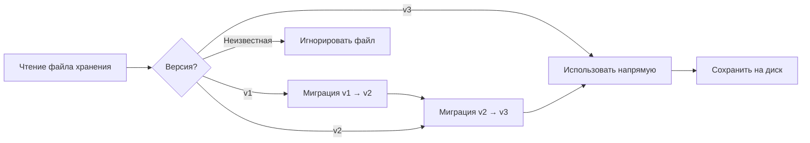

# Формат хранения аккаунтов и управление версиями

## Что вы сможете делать после изучения

- Понимать структуру файла хранения и значение каждого поля
- Редактировать файл хранения вручную (только при необходимости)
- Понимать механизмы миграции версий и совместимости
- Мигрировать конфигурацию аккаунтов между машинами

## Текущие затруднения

Вы можете столкнуться со следующими ситуациями:

- Необходимость резервного копирования или миграции аккаунтов на другую машину
- Ручное изменение `projectId` или удаление неактивных аккаунтов
- Появление предупреждений о версиях или логов миграции, желание понять, что происходит
- Синхронизация состояния аккаунтов между несколькими машинами

## Расположение файла

Файл хранения аккаунтов находится по следующим путям:

| Операционная система | Путь                                                                 |
| --- | --- |
| macOS/Linux          | `~/.config/opencode/antigravity-accounts.json`                      |
| Windows              | `%APPDATA%\opencode\antigravity-accounts.json`                      |

::: warning Предупреждение безопасности
Этот файл содержит **OAuth refresh tokens**, что эквивалентно паролю. Не делитесь им с другими и не добавляйте в Git-репозиторий.
:::

## Версии формата хранения

Формат хранения имеет версионирование, текущая версия — **v3**. Плагин автоматически обрабатывает миграцию версий, ручное вмешательство не требуется.

### Формат v3 (текущая версия)

```json
{
  "version": 3,
  "accounts": [
    {
      "email": "user1@gmail.com",
      "refreshToken": "1//0abc...",
      "projectId": "my-gcp-project",
      "managedProjectId": "managed-project-123",
      "addedAt": 1737600000000,
      "lastUsed": 1737603600000,
      "lastSwitchReason": "initial",
      "rateLimitResetTimes": {
        "claude": 1737607200000,
        "gemini-antigravity": 1737607200000,
        "gemini-cli": 1737607200000
      },
      "coolingDownUntil": 1737600000000,
      "cooldownReason": "auth-failure"
    }
  ],
  "activeIndex": 0,
  "activeIndexByFamily": {
    "claude": 0,
    "gemini": 0
  }
}
```

**Описание полей**:

| Поле | Тип | Обязательное | Описание |
| --- | --- | --- | --- |
| `version` | number | Да | Версия формата хранения (фиксировано 3) |
| `accounts` | array | Да | Список аккаунтов |
| `activeIndex` | number | Да | Индекс текущего активного аккаунта (начиная с 0) |
| `activeIndexByFamily` | object | Нет | Отслеживание активного аккаунта по модельным семействам (`claude`/`gemini`) |

**Поля объекта аккаунта**:

| Поле | Тип | Обязательное | Описание |
| --- | --- | --- | --- |
| `email` | string | Нет | Email аккаунта Google |
| `refreshToken` | string | Да | OAuth refresh token (уникальный идентификатор) |
| `projectId` | string | Нет | ID проекта GCP (требуется для моделей Gemini CLI) |
| `managedProjectId` | string | Нет | ID управляемого проекта |
| `addedAt` | number | Да | Метка времени добавления (Unix в миллисекундах) |
| `lastUsed` | number | Да | Метка времени последнего использования |
| `lastSwitchReason` | string | Нет | Причина переключения: `"rate-limit"` / `"initial"` / `"rotation"` |
| `rateLimitResetTimes` | object | Нет | Время сброса ограничения скорости (отдельное отслеживание по пулам квот) |
| `coolingDownUntil` | number | Нет | Метка времени окончания охлаждения аккаунта |
| `cooldownReason` | string | Нет | Причина охлаждения: `"auth-failure"` / `"network-error"` / `"project-error"` |

### Формат v2 (историческая версия)

Формат v2 похож на v3, но имеет следующие отличия:

- `rateLimitResetTimes` имеет только два поля: `claude` и `gemini`
- Нет `coolingDownUntil` и `cooldownReason`
- Нет `activeIndexByFamily` (все модели используют один активный аккаунт)

При миграции поле `gemini` отображается на `gemini-antigravity`, пул квот `gemini-cli` инициализируется пустым.

### Формат v1 (историческая версия)

Формат v1 использует булевы флаги и единую метку времени:

```json
{
  "version": 1,
  "accounts": [
    {
      "email": "user1@gmail.com",
      "refreshToken": "1//0abc...",
      "isRateLimited": true,
      "rateLimitResetTime": 1737607200000
    }
  ],
  "activeIndex": 0
}
```

При миграции, если `isRateLimited` равен `true` и `rateLimitResetTime` не истёк, устанавливается время сброса и для `claude`, и для `gemini`.

## Механизм миграции версий

При загрузке файла хранения плагин автоматически определяет версию и выполняет миграцию:



**Правила миграции**:

1. **Автоматическая миграция**: После миграции новый формат автоматически сохраняется на диск
2. **Сохранение данных**: Неистёкшие состояния ограничения скорости сохраняются
3. **Понижение при ошибке**: Если сохранение не удалось, данные продолжают использоваться в памяти
4. **Совместимость вперёд**: Новая версия плагина может читать старый формат файла

## Детали механизма хранения

### Блокировка файла

Используется `proper-lockfile` для безопасного доступа из нескольких процессов:

- **Механизм блокировки**: Создание файла блокировки при записи (`.antigravity-accounts.json.lock`)
- **Таймаут**: Файл блокировки истекает через 10 секунд (предотвращение взаимоблокировки)
- **Стратегия повторов**: Максимум 5 попыток, время ожидания увеличивается от 100мс до 1000мс
- **Атомарная запись**: Сначала во временный файл (`.tmp`), затем переименование в целевой

### Слияние аккаунтов

При одновременной записи файла хранения несколькими процессами выполняется стратегия слияния:

```typescript
// Логика слияния
function mergeAccountStorage(existing, incoming) {
  // Слияние аккаунтов по refreshToken
  // Сохранение вручную настроенных projectId/managedProjectId
  // Слияние rateLimitResetTimes
  // Сохранение большего lastUsed
}
```

### Механизм дедупликации

Дедупликация на основе `email`, сохраняется последний аккаунт для каждого email (по `lastUsed`, затем по `addedAt`):

```typescript
// Правила дедупликации
1. Аккаунты без email → сохраняются (невозможно дедуплицировать)
2. Аккаунты с одинаковым email → сохраняется с наибольшим lastUsed
3. Если lastUsed одинаковый → сохраняется с наибольшим addedAt
```

## Руководство по ручному редактированию

::: danger Риск ручного редактирования
При редактировании файла хранения процесс плагина не должен быть запущен, иначе изменения могут быть перезаписаны. Рекомендуется остановить OpenCode перед редактированием.
:::

### Добавление аккаунта

При ручном добавлении аккаунта требуется указать как минимум `refreshToken`:

```json
{
  "accounts": [
    {
      "refreshToken": "Скопируйте с другой машины или получите из процесса OAuth",
      "email": "user@example.com",
      "addedAt": Date.now(),
      "lastUsed": Date.now()
    }
  ]
}
```

### Удаление аккаунта

Удалите соответствующую запись из массива `accounts`, затем скорректируйте `activeIndex`:

```json
{
  "accounts": [
    { "email": "user1@gmail.com", "refreshToken": "..." },  // Сохранить
    // { "email": "user2@gmail.com", "refreshToken": "..." },  // Удалить
    { "email": "user3@gmail.com", "refreshToken": "..." }   // Сохранить
  ],
  "activeIndex": 0  // Убедитесь, что индекс в допустимом диапазоне
}
```

### Изменение projectId

Добавьте или измените `projectId` для аккаунта:

```json
{
  "accounts": [
    {
      "email": "user@gmail.com",
      "refreshToken": "1//0abc...",
      "projectId": "your-gcp-project-id"  // Добавить или изменить
    }
  ]
}
```

### Очистка состояния ограничения скорости

Вручную очистите метки ограничения скорости:

```json
{
  "accounts": [
    {
      "email": "user@gmail.com",
      "refreshToken": "1//0abc...",
      "rateLimitResetTimes": {}  // Очистить или удалить это поле
    }
  ]
}
```

## Миграция между машинами

### Простая миграция

Просто скопируйте файл хранения в директорию конфигурации целевой машины:

```bash
# macOS/Linux
cp ~/.config/opencode/antigravity-accounts.json /path/to/backup/

# Windows
copy %APPDATA%\opencode\antigravity-accounts.json backup\
```

### Слияние аккаунтов

Если на целевой машине уже есть аккаунты, плагин автоматически объединит их (дедупликация на основе `refreshToken`).

**Шаги ручного слияния**:

1. Создайте резервную копию файлов хранения обеих машин
2. Откройте оба файла, скопируйте массивы аккаунтов целевой машины в исходный файл
3. Скорректируйте `activeIndex` и `activeIndexByFamily`
4. Сохраните и перезапустите плагин

## Часто задаваемые вопросы

### Что делать, если миграция не удалась?

Если миграция не удалась, плагин запишет предупреждение в логи:

```
Failed to persist migrated storage: { error: "..." }
```

**Решение**:

1. Проверьте права доступа к файлу
2. Убедитесь, что достаточно свободного места на диске
3. Вручную создайте резервную копию старого файла, удалите его и добавьте аккаунты заново

### Ошибка несовместимости версий

Если вы видите ошибку «Unknown storage version»:

```json
{
  "version": 99  // Неизвестная версия
}
```

**Решение**:

1. Создайте резервную копию текущего файла
2. Вручную измените `version` на `2` или `3`
3. Перезапустите плагин для запуска миграции
4. Если миграция не удалась, удалите файл и добавьте аккаунты заново

### Потеря аккаунтов при дедупликации

Если обнаружено, что дублирующиеся аккаунты были удалены:

**Причина**: Плагин выполняет дедупликацию на основе `email`, сохраняя последний использованный аккаунт.

**Решение**: Если необходимо сохранить два аккаунта с одинаковым email (редкий сценарий), отредактируйте файл вручную, убедившись, что поле `email` пустое или различается.

## Резюме урока

- Расположение файла: `~/.config/opencode/antigravity-accounts.json`
- Текущая версия: v3, поддерживает двойные пулы квот и механизм охлаждения
- Автоматическая миграция: v1/v2 автоматически обновляются до v3
- Блокировка файла: используется `proper-lockfile` для обеспечения безопасности при параллельном доступе
- Ручное редактирование: рекомендуется остановить плагин перед редактированием, чтобы избежать перезаписи

## Анонс следующего урока

> В следующем уроке мы изучим **[все параметры конфигурации](../all-config-options/)**.
>
> Вы узнаете:
> - Полный список параметров конфигурации
> - Значения по умолчанию и области действия каждого параметра
> - Продвинутые техники конфигурации

---

## Приложение: ссылки на исходный код

<details>
<summary><strong>Нажмите, чтобы развернуть расположение исходного кода</strong></summary>

> Обновлено: 2026-01-23

| Функциональность | Путь к файлу                                                                                                      | Строки    |
| --- | --- | --- |
| Определение формата хранения   | [`src/plugin/storage.ts`](https://github.com/NoeFabris/opencode-antigravity-auth/blob/main/src/plugin/storage.ts)      | 128-198 |
| Миграция v1 → v2  | [`src/plugin/storage.ts`](https://github.com/NoeFabris/opencode-antigravity-auth/blob/main/src/plugin/storage.ts)      | 366-395 |
| Миграция v2 → v3  | [`src/plugin/storage.ts`](https://github.com/NoeFabris/opencode-antigravity-auth/blob/main/src/plugin/storage.ts)      | 397-431 |
| Загрузка аккаунтов       | [`src/plugin/storage.ts`](https://github.com/NoeFabris/opencode-antigravity-auth/blob/main/src/plugin/storage.ts)      | 433-518 |
| Сохранение аккаунтов       | [`src/plugin/storage.ts`](https://github.com/NoeFabris/opencode-antigravity-auth/blob/main/src/plugin/storage.ts)      | 520-536 |
| Механизм блокировки файла   | [`src/plugin/storage.ts`](https://github.com/NoeFabris/opencode-antigravity-auth/blob/main/src/plugin/storage.ts)      | 219-257 |
| Слияние аккаунтов       | [`src/plugin/storage.ts`](https://github.com/NoeFabris/opencode-antigravity-auth/blob/main/src/plugin/storage.ts)      | 259-299 |
| Механизм дедупликации       | [`src/plugin/storage.ts`](https://github.com/NoeFabris/opencode-antigravity-auth/blob/main/src/plugin/storage.ts)      | 301-364 |

**Ключевые определения типов**:

- `AccountStorageV1`: формат хранения v1
- `AccountStorageV2`: формат хранения v2
- `AccountStorageV3`: формат хранения v3 (текущий)
- `RateLimitStateV3`: состояние ограничения скорости v3 (поддержка нескольких пулов квот)

**Ключевые функции**:

- `loadAccounts()`: загрузка аккаунтов и выполнение миграции
- `saveAccounts()`: сохранение аккаунтов (с блокировкой файла и слиянием)
- `migrateV1ToV2()`: миграция v1 → v2
- `migrateV2ToV3()`: миграция v2 → v3
- `mergeAccountStorage()`: слияние двух объектов хранения
- `deduplicateAccountsByEmail()`: дедупликация аккаунтов на основе email

</details>
