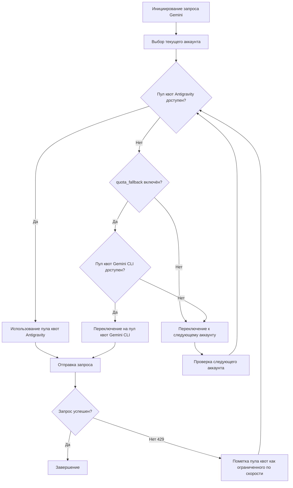

# Двойная система квот: Понимание пулов квот Antigravity и Gemini CLI

## Что вы сможете после изучения

- Понимать, как каждый аккаунт имеет два независимых пула квот Gemini
- Включать автоматический fallback между пулами квот Antigravity и Gemini CLI
- Явно указывать пул квот для конкретной модели
- Максимизировать использование квоты через двойную систему

---

## Ваша текущая проблема

Вы используете плагин Antigravity Auth для вызова моделей Gemini, часто сталкиваетесь с ограничениями квот, но, возможно, не понимаете **двойную систему квот**:

- После ограничения скорости запроса необходимо ждать сброса квоты для продолжения
- Хотя настроены несколько аккаунтов, квоты Gemini каждого аккаунта всё ещё недостаточны
- Непонятно, почему некоторые модели работают, а другие часто возвращают 429

**Ключевая проблема**: Вы думаете, что у каждого аккаунта только один пул квот Gemini, но на самом деле у каждого аккаунта **два независимых** пула квот, и при правильной настройке вы можете удвоить свою квоту Gemini.

---

## Основная концепция

### Что такое двойная система квот?

**Двойная система квот** — это механизм, при котором плагин Antigravity Auth поддерживает два независимых пула квот Gemini для каждого аккаунта. Пулы квот Antigravity и Gemini CLI отслеживают состояние ограничения скорости независимо; когда Antigravity ограничивает скорость, можно переключиться на пул CLI, удваивая квоту.

Плагин Antigravity Auth поддерживает **два независимых пула квот Gemini** для каждого Google-аккаунта:

| Пул квот | Тип | Приоритет | Правило сброса |
| --- | --- | --- | --- |
| **Antigravity** | Основной пул квот | Приоритетное использование | Динамически вычисляется по времени сброса, возвращаемому сервером |
| **Gemini CLI** | Резервный пул квот | Используется для fallback | Динамически вычисляется по времени сброса, возвращаемому сервером |

Состояние ограничения скорости каждого пула квот отслеживается независимо, без взаимного влияния. Это означает:

- Когда пул квот Antigravity ограничивает скорость, если пул Gemini CLI всё ещё доступен, можно автоматически переключиться
- Эквивалентно **удвоению** квоты Gemini каждого аккаунта

### Явное указание vs Автоматический fallback

Существует два способа использования двойной системы квот:

1. **Явное указание**: Добавьте суффикс `:antigravity` или `:gemini-cli` после имени модели, чтобы принудительно использовать определённый пул квот
2. **Автоматический fallback**: Включите конфигурацию `quota_fallback`, позволяя плагину автоматически переключаться между пулами квот

**Поведение по умолчанию**: Автоматический fallback не включён, используется только пул квот Antigravity

---

## Пошаговая инструкция

### Шаг 1: Включение автоматического fallback

Откройте файл конфигурации `~/.config/opencode/antigravity.json`:

```bash
cat ~/.config/opencode/antigravity.json
```

Добавьте или измените конфигурацию `quota_fallback`:

```json
{
  "quota_fallback": true
}
```

**Почему**: По умолчанию `quota_fallback` установлен в `false`, плагин использует только пул квот Antigravity. После включения, когда Antigravity ограничивает скорость, будет автоматически предпринята попытка использовать пул квот Gemini CLI.

Вы должны увидеть, что файл конфигурации был обновлён.

---

### Шаг 2: Наблюдение за поведением автоматического fallback

Отправьте запрос к модели Gemini (например, используя Gemini 3 Flash):

```bash
opencode run "Объясни, что такое квантовые вычисления" --model=google/antigravity-gemini-3-flash
```

Если пул квот Antigravity ограничивает скорость, вы увидите следующее поведение автоматического fallback:

```
[Toast уведомление] Квота Antigravity исчерпана, используется квота Gemini CLI
```

Плагин будет:

1. Обнаруживать ограничение скорости пула квот Antigravity (ответ 429)
2. Пытаться переключиться на пул квот Gemini CLI (если не ограничен)
3. Повторно отправлять запрос, используя новый пул квот
4. Показывать toast-уведомление, информирующее о переключении

**Почему**: Это основная логика автоматического fallback — переключение между двумя пулами квот того же аккаунта, а не немедленный переход к следующему аккаунту.

Вы должны увидеть, что запрос успешно завершился, а не завершился из-за ограничения квоты.

---

### Шаг 3: Явное указание пула квот

Если вы хотите принудительно использовать определённый пул квот, вы можете добавить суффикс после имени модели:

**Использование пула квот Antigravity** (через префикс `antigravity-`):

```bash
opencode run "Объясни, что такое квантовые вычисления" --model=google/antigravity-gemini-3-flash
```

**Использование пула квот Gemini CLI** (без префикса `antigravity-`):

```bash
opencode run "Объясни, что такое квантовые вычисления" --model=google/gemini-3-flash-preview
```

**Почему**: Через префикс `antigravity-` можно явно указать использование пула квот Antigravity; без префикса используется пул квот Gemini CLI. В этом случае плагин игнорирует конфигурацию `quota_fallback`, и если указанный пул квот ограничивает скорость, произойдёт немедленное переключение к следующему аккаунту, а не попытка использовать другой пул квот.

Вы должны увидеть, что запрос был направлен в указанный пул квот.

---

### Шаг 4: Просмотр статуса квоты (режим отладки)

Если вы хотите просмотреть состояние ограничения скорости каждого пула квот, включите режим отладки:

Отредактируйте `~/.config/opencode/antigravity.json`:

```json
{
  "quota_fallback": true,
  "debug": true
}
```

После отправки запроса просмотрите файл журнала:

```bash
tail -f ~/.config/opencode/antigravity-logs/*.log
```

Вы увидите подобные записи:

```
[DEBUG] headerStyle=antigravity explicit=false
[DEBUG] quota fallback: gemini-cli
[INFO] rate-limit triggered for account 0, family gemini, quota: gemini-antigravity
```

**Почему**: Журналы отладки позволяют вам чётко видеть, какой пул квот выбрал плагин и когда был активирован fallback. Это очень полезно для диагностики проблем с квотами.

Вы должны увидеть подробные журналы переключения квот.

---

## Контрольные точки ✅

### Проверка включения автоматического fallback

```bash
cat ~/.config/opencode/antigravity.json | grep quota_fallback
```

Вы должны увидеть:

```json
"quota_fallback": true
```

### Проверка явного указания суффикса

Попробуйте использовать имя модели с суффиксом, чтобы убедиться, что ошибки не возникает:

```bash
opencode run "Тест" --model=google/antigravity-gemini-3-flash:gemini-cli
```

Вы должны увидеть, что запрос успешно завершён.

### Проверка журналов отладки

```bash
ls -la ~/.config/opencode/antigravity-logs/
```

Вы должны увидеть, что файлы журналов существуют и содержат информацию о переключении квот.

---

## Предупреждения о подводных камнях

### Подводный камень 1: Fallback не работает при явном указании суффикса

**Проблема**: Вы добавили суффикс `:antigravity` или `:gemini-cli` после имени модели, но `quota_fallback`似乎 не работает.

**Причина**: При явном указании суффикса плагин игнорирует конфигурацию `quota_fallback` и принудительно использует указанный пул квот. Если этот пул квот ограничивает скорость, произойдёт немедленное переключение к следующему аккаунту, а не попытка использовать другой пул квот.

**Решение**:
- Если вам нужен автоматический fallback, не добавляйте суффикс после имени модели
- Если вам нужно принудительно использовать определённый пул квот, просто добавьте суффикс

### Подводный камень 2: Модели Claude не имеют двойной системы квот

**Проблема**: Вы включили `quota_fallback`, но модели Claude似乎 не проявляют поведения fallback.

**Причина**: Двойная система квот **применяется только к моделям Gemini**. Модели Claude используют только пул квот Antigravity и не имеют пула квот Gemini CLI.

**Решение**:
- Модели Claude не требуют настройки двойной системы квот
- Только ротация нескольких аккаунтов может повысить квоту Claude

### Подводный камень 3: Слишком много журналов отладки влияет на производительность

**Проблема**: Вы включили `debug: true`, но файлы журналов растут слишком быстро.

**Причина**: Режим отладки записывает все детали запросов, включая переключение квот, выбор аккаунтов и т.д.

**Решение**:
- После завершения отладки отключите конфигурацию `debug`
- Или регулярно очищайте файлы журналов: `rm ~/.config/opencode/antigravity-logs/*.log`

---

## Диаграмма рабочего процесса двойной системы квот

Ниже показан рабочий процесс автоматического fallback:



---

## Механизм независимого отслеживания двойных пулов квот

### Определение ключей квот

Плагин использует следующие ключи квот для отслеживания ограничений скорости (исходный код: `accounts.ts:77`):

| Ключ квоты | Значение |
| --- | --- |
| `claude` | Квота моделей Claude |
| `gemini-antigravity` | Пул квот Gemini Antigravity |
| `gemini-cli` | Пул квот Gemini CLI |

Объект `rateLimitResetTimes` каждого аккаунта хранит временные метки сброса для этих ключей квот:

```json
{
  "rateLimitResetTimes": {
    "claude": 1234567890,
    "gemini-antigravity": 1234567890,
    "gemini-cli": 1234567890
  }
}
```

### Проверка доступности пулов квот

При выборе пула квот плагин проверяет в следующем порядке (исходный код: `accounts.ts:545-557`):

1. **Пул квот Antigravity**: Если не ограничен по скорости, используется напрямую
2. **Пул квот Gemini CLI**: Если Antigravity ограничен и этот пул доступен, используется этот пул
3. **Возврат null**: Оба пула ограничены, инициируется переключение аккаунта

---

## Условия срабатывания переключения пулов квот

Автоматический fallback срабатывает при выполнении следующих условий:

| Условие | Описание | Расположение в исходном коде |
| --- | --- | --- |
| `quota_fallback = true` | Конфигурация автоматического fallback включена | `config/schema.ts:234` |
| Пул квот Antigravity текущего аккаунта ограничен | Получен ответ 429 | `plugin.ts:1149` |
| Модель не явно указывает пул квот | Имя модели не содержит суффиксов `:antigravity` или `:gemini-cli` | `plugin.ts:1151` |
| Пул квот Gemini CLI текущего аккаунта доступен | Не ограничен | `accounts.ts:553` |

Если любое из условий не выполнено, плагин напрямую переключается на следующий аккаунт, а не пытается выполнить fallback.

---

## Резюме урока

В этом уроке мы изучили двойную систему квот плагина Antigravity Auth:

- **Два пула квот**: Каждый аккаунт имеет два независимых пула квот Gemini — Antigravity и Gemini CLI
- **Автоматический fallback**: После включения `quota_fallback`, при ограничении скорости Antigravity автоматически предпринимается попытка использования пула квот Gemini CLI
- **Явное указание**: Используйте суффиксы `:antigravity` или `:gemini-cli` для принудительного использования определённого пула квот
- **Независимое отслеживание**: Состояние ограничения скорости каждого пула квот хранится и проверяется независимо
- **Только для Gemini**: Двойная система квот применяется только к моделям Gemini, модели Claude имеют только пул квот Antigravity

Разумное использование двойной системы квот позволяет вам удвоить квоту Gemini каждого аккаунта, сокращая количество отказов в запросах из-за ограничений квоты.

---

## Анонс следующего урока

> В следующем уроке мы изучим **[Настройка мультиаккаунта: Конфигурация балансировки нагрузки для повышения квоты](../../advanced/multi-account-setup/)**.
>
> Вы узнаете:
> - Как добавить несколько Google-аккаунтов
> - Лучшие практики конфигурации различных стратегий выбора аккаунтов
> - Техники использования пулов квот в сценариях с несколькими аккаунтами

---

## Приложение: Ссылки на исходный код

<details>
<summary><strong>Нажмите, чтобы развернуть и посмотреть расположение исходного кода</strong></summary>

> Время последнего обновления: 2026-01-23

| Функция | Путь к файлу | Номер строки |
| --- | --- | --- |
| Определение ключа квоты (BaseQuotaKey) | [`src/plugin/accounts.ts`](https://github.com/NoeFabris/opencode-antigravity-auth/blob/main/src/plugin/accounts.ts#L77-L78) | 77-78 |
| Получение ключа квоты (getQuotaKey) | [`src/plugin/accounts.ts`](https://github.com/NoeFabris/opencode-antigravity-auth/blob/main/src/plugin/accounts.ts#L107-L116) | 107-116 |
| Проверка состояния ограничения скорости пула квот | [`src/plugin/accounts.ts`](https://github.com/NoeFabris/opencode-antigravity-auth/blob/main/src/plugin/accounts.ts#L134-L152) | 134-152 |
| Получение доступного пула квот | [`src/plugin/accounts.ts`](https://github.com/NoeFabris/opencode-antigravity-auth/blob/main/src/plugin/accounts.ts#L545-L557) | 545-557 |
| Определение конфигурации quota_fallback | [`src/plugin/config/schema.ts`](https://github.com/NoeFabris/opencode-antigravity-auth/blob/main/src/plugin/config/schema.ts#L224-L234) | 224-234 |
| Логика автоматического fallback | [`src/plugin/plugin.ts`](https://github.com/NoeFabris/opencode-antigravity-auth/blob/main/src/plugin/plugin.ts#L1151-L1163) | 1151-1163 |
| Документация по двойной системе квот | [`docs/MULTI-ACCOUNT.md`](https://github.com/NoeFabris/opencode-antigravity-auth/blob/main/docs/MULTI-ACCOUNT.md#L21-L31) | 21-31 |

**Ключевые константы**:
- `BaseQuotaKey = "claude" | "gemini-antigravity" | "gemini-cli"`: Определение типа ключа квоты

**Ключевые функции**:
- `getAvailableHeaderStyle()`: Возвращает доступный пул квот в зависимости от состояния пулов квот текущего аккаунта
- `isRateLimitedForHeaderStyle()`: Проверяет, ограничен ли указанный пул квот по скорости
- `getQuotaKey()`: Генерирует ключ квоты на основе семейства моделей и headerStyle

</details>
