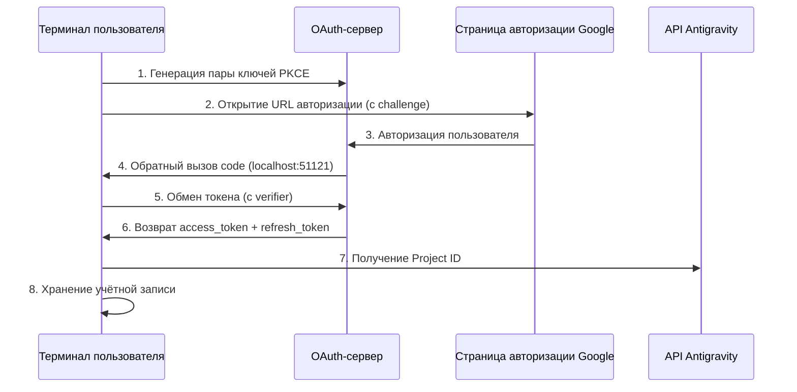

# Аутентификация OAuth 2.0 PKCE: Выполнение первого входа

## Чему вы научитесь

- Понять механизм безопасности процесса аутентификации OAuth 2.0 PKCE
- Выполнить первый вход в плагин, получить доступ к API Antigravity
- Понять автоматический механизм получения и хранения Project ID
- Узнать об автоматической обработке обновления токенов

## Ваша текущая проблема

Вы установили плагин, настроили определения моделей, но ещё не использовали его. Каждый раз при запуске `opencode run` появляется сообщение "требуется аутентификация", но вы не знаете:

- Что такое OAuth? Зачем использовать такой сложный способ аутентификации?
- Что происходит в процессе аутентификации? Это безопасно?
- Что нужно подготовить для первого входа? Какие есть варианты?
- Что делать, когда токен истекает? Нужно ли снова входить?

## Когда использовать этот метод

- **После первой установки плагина**: Аутентификация обязательна перед первым использованием
- **При добавлении новой учётной записи**: При настройке ротации нескольких учётных записей требуется аутентификация каждой из них
- **После истечения токена**: Если учётная запись была отозвана или пароль изменён, требуется повторная аутентификация
- **При переходе на новое устройство**: При миграции учётной записи необходимо снова войти на новом устройстве

## 🎒 Подготовка

::: warning Предварительная проверка

Пожалуйста, подтвердите, что выполнены следующие шаги:

1. **Плагин установлен**: См. [Быстрая установка](/ru/NoeFabris/opencode-antigravity-auth/start/quick-install/)
2. **Модель настроена**: Определения моделей добавлены в `~/.config/opencode/opencode.json`
3. **Доступна учётная запись Google**: Рекомендуется использовать учётную запись с установленным доверием, избегайте использования только что созданных учётных записей

:::

## Основная идея

### Что такое OAuth 2.0 PKCE?

**OAuth 2.0** (Open Authorization 2.0) — это протокол авторизации, который позволяет сторонним приложениям (этому плагину) получать доступ к API Google без прямого получения пароля пользователя.

**PKCE** (Proof Key for Code Exchange) — это расширение безопасности OAuth 2.0, разработанное для публичных клиентов (например, CLI-инструментов). Оно предотвращает атаки перехвата кода авторизации с помощью следующих механизмов:

```
┌─────────────────────────────────────────────────────────────────┐
│  Механизм защиты PKCE                                        │
├─────────────────────────────────────────────────────────────────┤
│  1. Клиент генерирует пару ключей:                            │
│     - code_verifier (случайная строка, секретная)                │
│     - code_challenge (хеш verifier, открытая)                  │
│  2. URL авторизации содержит code_challenge                   │
│  3. Сервер обратного вызова получает code, проверяет verifier │
│  4. Злоумышленник не может обменять перехваченный code        │
│     на токен без verifier                                    │
└─────────────────────────────────────────────────────────────────┘
```

::: info

**PKCE vs традиционный OAuth**

Традиционный OAuth использует `client_secret` для проверки подлинности, но это требует, чтобы клиент мог безопасно хранить секретный ключ. CLI-инструменты не могут обеспечить это, поэтому PKCE использует динамически генерируемый `verifier` вместо статического ключа, что так же безопасно, но не зависит от заранее хранимых секретов.

:::

### Обзор процесса аутентификации



## Пошаговая инструкция

### Шаг 1: Запуск входа OAuth

**Зачем**

Команда `opencode auth login` запускает локальный OAuth-сервер, генерирует URL авторизации и ожидает обратного вызова от Google.

**Выполнение команды**:

```bash
opencode auth login
```

**Что вы должны увидеть**:

```
🔑 Initializing Antigravity OAuth...
📋 Starting local OAuth server on http://127.0.0.1:51121
🌐 Opening browser for authorization...

If the browser doesn't open, visit this URL manually:
https://accounts.google.com/o/oauth2/v2/auth?client_id=...&code_challenge=...
```

::: tip

**Определение среды**

Плагин автоматически определяет среду выполнения:

| Среда | Адрес привязки | Причина |
|--- | --- | ---|
| Локальная macOS/Linux/Windows | `127.0.0.1` | Самый безопасный, принимает только локальные соединения |
| WSL / Docker / SSH удалённый | `0.0.0.0` | Позволяет браузеру с хоста получить доступ |

Вы можете переопределить настройки по умолчанию с помощью переменной окружения `OPENCODE_ANTIGRAVITY_OAUTH_BIND`.

:::

### Шаг 2: Авторизация в браузере

**Зачем**

Страница авторизации Google показывает разрешения (Scope), запрашиваемые плагином, которые требуют вашего явного согласия.

**Что вы увидите**:

Страница авторизации Google OAuth, отображающая:
- Запрашивающая сторона: Antigravity Auth Plugin
- Запрашиваемые разрешения:
  - Просмотр вашего адреса электронной почты
  - Просмотр информации о вашем профиле
  - Доступ к проектам вашей облачной платформы
  - Доступ к журналам и конфигурации экспериментов Google Cloud

**Действия**:

1. Убедитесь, что запрашиваемые разрешения соответствуют ожиданиям (нет чувствительных разрешений, выходящих за рамки)
2. Нажмите кнопку "Разрешить" или "Авторизовать"
3. Дождитесь перенаправления страницы на `http://localhost:51121/oauth-callback`

**Что вы должны увидеть**:

```html
<!DOCTYPE html>
<html>
  <!-- ... -->
  <h1>All set!</h1>
  <p>You've successfully authenticated with Antigravity.</p>
  <!-- ... -->
</html>
```

::: warning

**Проблема закрытия страницы авторизации**

Если после успешной авторизации браузер не закрывается автоматически, просто закройте вкладку вручную. Это ограничение безопасности браузера и не влияет на результат аутентификации.

:::

### Шаг 3: Автоматический обмен токена и получение Project ID

**Зачем**

Код авторизации — это временные учётные данные, которые нужно обменять на долгосрочный `refresh_token`, одновременно получая `Project ID`, необходимый для проекта Antigravity.

**Автоматическое выполнение в фоновом режиме**:

Плагин автоматически выполнит следующие операции (без вашего вмешательства):

1. **Проверка PKCE**: Проверка действительности кода авторизации с помощью `code_verifier`
2. **Обмен токена**: Отправка POST-запроса на `oauth2.googleapis.com/token`

   ```typescript
   // Исходный код: src/antigravity/oauth.ts:209
   POST https://oauth2.googleapis.com/token
   Content-Type: application/x-www-form-urlencoded

   {
     client_id: "...",
     client_secret: "...",
     code: "Код авторизации",
     grant_type: "authorization_code",
     redirect_uri: "http://localhost:51121/oauth-callback",
     code_verifier: "PKCE verifier"
   }
   ```

3. **Получение информации о пользователе**: Проверка адреса электронной почты

   ```typescript
   // Исходный код: src/antigravity/oauth.ts:231
   GET https://www.googleapis.com/oauth2/v1/userinfo?alt=json
   Authorization: Bearer {access_token}
   ```

4. **Автоматическое получение Project ID**: Попытка получить ваш идентификатор проекта из API Antigravity

   ```typescript
   // Исходный код: src/antigravity/oauth.ts:131
   // Попытка нескольких конечных точек в приоритетном порядке
   - https://cloudcode-pa.googleapis.com/v1internal:loadCodeAssist (prod)
   - https://daily-cloudcode-pa.sandbox.googleapis.com/v1internal:loadCodeAssist (daily)
   - https://autopush-cloudcode-pa.sandbox.googleapis.com/v1internal:loadCodeAssist (autopush)
   ```

5. **Хранение учётной записи**: Сохранение в `~/.config/opencode/antigravity-accounts.json`

   ```json
   {
     "version": 3,
     "accounts": [
       {
         "email": "your.email@gmail.com",
         "refreshToken": "1//0g...|rising-fact-p41fc",
         "projectId": "rising-fact-p41fc",
         "addedAt": 1737609600000,
         "lastUsed": 1737609600000
       }
     ]
   }
   ```

::: details

**Назначение Project ID**

Project ID — это уникальный идентификатор проекта Google Cloud, используемый для определения, к какому проекту принадлежит вызов API. Antigravity отслеживает использование квоты на основе Project ID.

- **Успешное автоматическое получение**: Используется ваш настоящий Project ID (рекомендуется)
- **Неудачное автоматическое получение**: Используется Project ID по умолчанию (`rising-fact-p41fc`)

:::

**Что вы должны увидеть**:

```
✅ Authentication successful
📧 Account: your.email@gmail.com
🆔 Project ID: rising-fact-p41fc
💾 Saved to: ~/.config/opencode/antigravity-accounts.json
```

### Контрольная точка ✅

**Проверка правильного хранения учётной записи**:

```bash
cat ~/.config/opencode/antigravity-accounts.json
```

**Ожидаемый вывод**:

```json
{
  "version": 3,
  "accounts": [
    {
      "email": "your.email@gmail.com",
      "refreshToken": "1//0g...|rising-fact-p41fc",
      "projectId": "rising-fact-p41fc",
      "addedAt": 1737609600000,
      "lastUsed": 1737609600000
    }
  ]
}
```

::: tip

**Формат хранения учётной записи**

Формат поля `refreshToken`: `{refresh_token}|{project_id}`, этот дизайн позволяет хранить токен и идентификатор проекта в одном поле, упрощая логику хранения.

:::

## Предупреждения о проблемах

### Проблема 1: Порт занят

**Сообщение об ошибке**:

```
❌ Port 51121 is already in use.
Another process is occupying this port.
```

**Причина**: Другой процесс OpenCode выполняется или другой программа заняла порт.

**Решение**:

1. Проверьте и завершите процесс, занимающий порт:

   ```bash
   # macOS/Linux
   lsof -ti:51121 | xargs kill -9

   # Windows
   netstat -ano | findstr :51121
   taskkill /PID <PID> /F
   ```

2. Снова запустите `opencode auth login`

### Проблема 2: Браузер не открылся автоматически

**Причина**: В среде WSL, Docker или удалённой среде `localhost` не равен адресу хоста.

**Решение**:

Плагин автоматически определит среду и отобразит URL для ручного доступа:

```
🌐 Opening browser for authorization...

If the browser doesn't open, visit this URL manually:
https://accounts.google.com/o/oauth2/v2/auth?...
```

Скопируйте URL и откройте его в браузере хоста.

### Проблема 3: Не удалось получить Project ID

**Предупреждающее сообщение**:

```
⚠️ Failed to resolve Antigravity project via loadCodeAssist
Using default project ID: rising-fact-p41fc
```

**Причина**: Для некоторых корпоративных учётных записей или специальных конфигураций разрешений API `loadCodeAssist` недоступен.

**Решение**:

1. Если вы используете только модели Antigravity (с суффиксом `:antigravity`), можно использовать Project ID по умолчанию
2. Если вам нужно использовать модели Gemini CLI (например, `gemini-2.5-pro`), вручную настройте Project ID:

   ```json
   // Редактирование ~/.config/opencode/antigravity-accounts.json
   {
     "accounts": [
       {
         "email": "your.email@gmail.com",
         "refreshToken": "1//0g...|your-custom-project-id",
         "projectId": "your-custom-project-id"
       }
     ]
   }
   ```

   Шаги для получения Project ID:
   - Перейдите в [Google Cloud Console](https://console.cloud.google.com/)
   - Создайте или выберите проект
   - Включите **Gemini for Google Cloud API**
   - Скопируйте идентификатор проекта (формат: `rising-fact-p41fc`)

### Проблема 4: Ошибка invalid_grant

**Сообщение об ошибке**:

```
❌ Token exchange failed: invalid_grant
```

**Причины**:
- Код авторизации истёк (обычно срок действия 10 минут)
- Пользователь отозвал права доступа приложения после авторизации
- Изменён пароль учётной записи или инициировано событие безопасности

**Решение**: Снова запустите `opencode auth login`

## Механизм обновления токенов

**Автоматическое обновление**: Вам не нужно беспокоиться об истечении токена.

Плагин автоматически обновит токены в следующих случаях:

| Условие запуска | Действие | Расположение в исходном коде |
|--- | --- | ---|
| За 60 секунд до истечения токена | Автоматическое обновление | `src/plugin/auth.ts:33` |
| При получении 401 Unauthorized | Попытка обновления | `src/plugin/auth.ts:33` |
| При неудачном обновлении | Предложение пользователю снова войти | `src/plugin.ts:995` |

**Логика обновления**:

```typescript
// Исходный код: src/plugin/auth.ts:33
export function accessTokenExpired(auth: OAuthAuthDetails): boolean {
  // Обновление за 60 секунд до истечения (учёт расхождения часов)
  return auth.expires <= Date.now() + 60 * 1000;
}
```

## Итоги урока

Ключевые моменты процесса аутентификации OAuth 2.0 PKCE:

1. **Механизм безопасности PKCE**: Динамический `verifier` вместо статического ключа, предотвращает перехват кода авторизации
2. **Локальный сервер обратного вызова**: Прослушивание `localhost:51121`, приём обратного вызова авторизации от Google
3. **Обмен токена**: Обмен кода авторизации на `access_token` и `refresh_token`
4. **Автоматический Project ID**: Попытка получения из API Antigravity, при неудаче используется значение по умолчанию
5. **Автоматическое обновление**: Автоматическое обновление за 60 секунд до истечения токена, без ручного вмешательства
6. **Хранение учётной записи**: Вся информация сохраняется в `~/.config/opencode/antigravity-accounts.json`

Теперь вы можете сделать первый запрос к модели!

## Предварительный обзор следующего урока

> На следующем уроке мы изучим **[Первый запрос к модели](/ru/NoeFabris/opencode-antigravity-auth/start/first-request/)**.
>
> Вы узнаете:
> - Как использовать `opencode run` для отправки запроса
> - Проверка успешности аутентификации
> - Понимание конфигурации вариантов моделей

---

## Приложение: Ссылки на исходный код

<details>
<summary><strong>Нажмите, чтобы развернуть и посмотреть расположение исходного кода</strong></summary>

> Время обновления: 2026-01-23

| Функция | Путь к файлу | Номер строки |
|--- | --- | ---|
| Генерация ключей PKCE | [`src/antigravity/oauth.ts`](https://github.com/NoeFabris/opencode-antigravity-auth/blob/main/src/antigravity/oauth.ts#L91-L113) | 91-113  |
| Построение URL авторизации | [`src/antigravity/oauth.ts`](https://github.com/NoeFabris/opencode-antigravity-auth/blob/main/src/antigravity/oauth.ts#L91-L113) | 91-113  |
| Обмен токена | [`src/antigravity/oauth.ts`](https://github.com/NoeFabris/opencode-antigravity-auth/blob/main/src/antigravity/oauth.ts#L201-L270) | 201-270 |
| Получение информации о пользователе | [`src/antigravity/oauth.ts`](https://github.com/NoeFabris/opencode-antigravity-auth/blob/main/src/antigravity/oauth.ts#L231-L242) | 231-242 |
| Автоматическое получение Project ID | [`src/antigravity/oauth.ts`](https://github.com/NoeFabris/opencode-antigravity-auth/blob/main/src/antigravity/oauth.ts#L131-L196) | 131-196 |
| Определение среды | [`src/plugin/server.ts`](https://github.com/NoeFabris/opencode-antigravity-auth/blob/main/src/plugin/server.ts#L31-L134) | 31-134  |
| Сервер обратного вызова OAuth | [`src/plugin/server.ts`](https://github.com/NoeFabris/opencode-antigravity-auth/blob/main/src/plugin/server.ts#L140-L366) | 140-366 |
| Проверка истечения токена | [`src/plugin/auth.ts`](https://github.com/NoeFabris/opencode-antigravity-auth/blob/main/src/plugin/auth.ts#L33-L38) | 33-38   |
| Вычисление времени истечения токена | [`src/plugin/auth.ts`](https://github.com/NoeFabris/opencode-antigravity-auth/blob/main/src/plugin/auth.ts#L45-L52) | 45-52   |

**Ключевые константы**:
- `ANTIGRAVITY_CLIENT_ID`: Идентификатор клиента OAuth (`constants.ts:4`)
- `ANTIGRAVITY_CLIENT_SECRET`: Секретный ключ клиента OAuth (`constants.ts:9`)
- `ANTIGRAVITY_REDIRECT_URI`: Адрес обратного вызова OAuth `http://localhost:51121/oauth-callback` (`constants.ts:25`)
- `ANTIGRAVITY_SCOPES`: Список запрашиваемых разрешений (`constants.ts:14-20`)
- `ANTIGRAVITY_DEFAULT_PROJECT_ID`: Идентификатор проекта по умолчанию `rising-fact-p41fc` (`constants.ts:71`)

**Ключевые функции**:
- `authorizeAntigravity()`: Генерация пары ключей PKCE и URL авторизации (`oauth.ts:91`)
- `exchangeAntigravity()`: Обмен кода авторизации на токен доступа (`oauth.ts:201`)
- `fetchProjectID()`: Получение идентификатора проекта из API Antigravity (`oauth.ts:131`)
- `startOAuthListener()`: Запуск локального OAuth-сервера (`server.ts:140`)
- `accessTokenExpired()`: Проверка истечения токена (`auth.ts:33`)

**Важные бизнес-правила**:
- PKCE использует алгоритм хеширования S256 (`oauth.ts:100`)
- Автоматическое обновление за 60 секунд до истечения токена (`auth.ts:3`)
- Поддержка офлайн-доступа (`access_type=offline`) (`oauth.ts:105`)
- Порядок отката конечных точек Project ID: prod → daily → autopush (`oauth.ts:141-143`)

</details>
