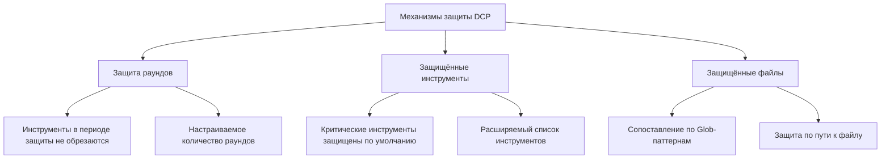

# Механизмы защиты: Предотвращение ошибочной обрезки критического контента

## Что вы освоите

- Настройка защиты раундов, чтобы ИИ успевал использовать недавние результаты инструментов
- Расширение списка защищённых инструментов для предотвращения обрезки критических операций
- Настройка паттернов защищённых файлов для защиты определённых файлов от ошибочной обрезки
- Понимание механизма защиты субагентов и его влияния на поведение суммаризации

## Ваша текущая проблема

DCP автоматически обрезает избыточные вызовы инструментов в истории диалога — это экономит токены, но иногда создаёт проблемы:

- ИИ только что прочитал файл и хочет проанализировать его содержимое, но оно уже обрезано DCP
- Вы использовали инструмент `write` для создания конфигурационного файла, который понадобится позже, но после обрезки путь к файлу потерян
- ИИ говорит «согласно коду выше», но код уже отсутствует в контексте

Все эти ситуации указывают на одно: **некоторый контент необходимо защищать от обрезки**.

## Когда применять эти методы

- Когда ИИ должен ссылаться на ранее прочитанное содержимое файлов
- Когда нужно защитить критические операции (запись конфигурации, планирование задач)
- Когда определённые пути к файлам (секреты, ключи) требуют особой защиты
- При разработке функциональности субагентов (DCP автоматически пропускает их)

## Основная концепция

DCP предоставляет **три уровня защиты**, предотвращающих ошибочную обрезку критического контента с разных сторон:



**Уровни защиты**:
1. **Защита раундов** (временное измерение): Инструменты за последние N раундов автоматически защищены
2. **Защита инструментов** (измерение инструментов): Определённые инструменты никогда не обрезаются
3. **Защита файлов** (измерение путей): Инструменты, работающие с определёнными файлами, не обрезаются

Все три уровня можно комбинировать, создавая многоуровневую сеть защиты.

---

## Защита раундов

### Что такое защита раундов

Защита раундов (Turn Protection) — это **механизм защиты временного окна**, предоставляемый DCP. При включении вызовы инструментов в период защиты не добавляются в кэш обрезки и, следовательно, не обрезаются никакой стратегией.

**Назначение**: Дать ИИ время для использования недавних результатов инструментов, избегая ситуации «только сказал — уже удалено».

### Настройка защиты раундов

Добавьте в конфигурационный файл:

```jsonc
{
  "turnProtection": {
    "enabled": true,
    "turns": 4
  }
}
```

**Описание параметров**:
- `enabled`: Включить защиту раундов (по умолчанию `false`)
- `turns`: Количество защищаемых раундов (по умолчанию `4`), означает, что инструменты за последние 4 раунда не обрезаются

### Принцип работы защиты раундов

DCP при синхронизации кэша инструментов (перед каждым сообщением ИИ) вычисляет количество раундов для каждого инструмента:

```typescript
// Если текущий раунд - раунд создания инструмента < количество защищаемых раундов
// то инструмент не будет обрезан
state.currentTurn - turnCounter < turnProtectionTurns
```

**Пример**:
- Текущий раунд: 10
- Раунд создания инструмента: 8
- Количество защищаемых раундов: 4
- Результат: 10 - 8 = 2 < 4 → **защищён, не обрезается**

**Эффект**:
- В период защиты инструмент не появляется в списке `<prunable-tools>`
- Не подвергается автоматическим стратегиям (дедупликация, перезапись, очистка ошибок)
- ИИ не может обрезать его через инструменты `discard`/`extract`

### Рекомендуемые настройки

| Сценарий | Рекомендуемое количество раундов | Пояснение |
| --- | --- | --- |
| Длинные диалоги (10+ раундов) | 4-6 | Достаточно времени для ссылок на историю |
| Короткие диалоги (< 5 раундов) | 2-3 | Длительный период защиты не нужен |
| Задачи с высокой зависимостью от контекста | 6-8 | Рефакторинг кода, анализ длинных документов |
| По умолчанию (без зависимости от контекста) | 0-2 | Не включать или минимальное значение |

::: tip Обратите внимание
Защита раундов увеличивает размер контекста, так как сохраняется больше результатов инструментов. Если заметите значительный рост потребления токенов, уменьшите количество защищаемых раундов.
:::

---

## Защищённые инструменты

### Инструменты, защищённые по умолчанию

DCP по умолчанию защищает следующие инструменты — они **никогда** не обрезаются:

| Инструмент | Описание |
| --- | --- |
| `task` | Инструмент управления задачами |
| `todowrite` | Запись списка дел |
| `todoread` | Чтение списка дел |
| `discard` | Инструмент отбрасывания DCP (сама операция обрезки) |
| `extract` | Инструмент извлечения DCP (сама операция обрезки) |
| `batch` | Инструмент пакетных операций |
| `write` | Инструмент записи файлов |
| `edit` | Инструмент редактирования файлов |
| `plan_enter` | Маркер входа в планирование |
| `plan_exit` | Маркер выхода из планирования |

**Почему эти инструменты защищены**:
- `task`, `todowrite`, `todoread`: Управление задачами — ядро состояния сессии, удаление приведёт к потере контекста
- `discard`, `extract`: Это собственные инструменты обрезки DCP, они не могут обрезать сами себя
- `batch`, `write`, `edit`: Файловые операции — ядро взаимодействия ИИ с кодом пользователя
- `plan_enter`, `plan_exit`: Маркеры планирования помогают понять структуру сессии

### Расширение списка защищённых инструментов

Если нужно защитить дополнительные инструменты, расширьте список в конфигурации:

```jsonc
{
  "tools": {
    "settings": {
      "protectedTools": [
        "task",
        "todowrite",
        "todoread",
        "discard",
        "extract",
        "batch",
        "write",
        "edit",
        "plan_enter",
        "plan_exit",
        // Добавьте инструменты, которые нужно защитить
        "read",
        "filesearch"
      ]
    }
  }
}
```

**Глобальная защита инструментов**:
- Инструменты в `tools.settings.protectedTools` защищены во всех стратегиях
- Подходит для инструментов, которые не должны обрезаться никакой стратегией

### Защита инструментов на уровне стратегии

Можно также настроить защищённые инструменты для конкретной стратегии:

```jsonc
{
  "strategies": {
    "deduplication": {
      "enabled": true,
      "protectedTools": [
        "read",  // Защитить read при дедупликации
        "filesearch"
      ]
    },
    "purgeErrors": {
      "enabled": true,
      "turns": 4,
      "protectedTools": [
        "write"  // Защитить write при очистке ошибок
      ]
    }
  }
}
```

**Сценарии использования**:
- Защита инструмента только в определённой стратегии, другие стратегии могут его обрезать
- Например: разрешить дедупликации обрезать `read`, но стратегия очистки ошибок не может обрезать `write`

::: info Различие между защитой инструментов и защитой раундов
- **Защита инструментов**: Независимо от раунда создания, если инструмент в списке защиты — он никогда не обрезается
- **Защита раундов**: Все инструменты (кроме защищённых) не обрезаются в период защиты, но после его окончания могут быть обрезаны
:::

---

## Паттерны защищённых файлов

### Что такое паттерны защищённых файлов

Паттерны защищённых файлов позволяют через Glob-паттерны **защитить операции с определёнными путями файлов от обрезки**.

**Сценарии применения**:
- Защита файлов с секретами (`.env`, `secrets.json`)
- Защита конфигурационных файлов (важные настройки не должны теряться)
- Защита ключевых файлов проекта (точки входа, основные библиотеки)
- Защита чувствительных директорий (например, `src/api/`, `tests/fixtures/`)

### Настройка паттернов защищённых файлов

Добавьте в конфигурационный файл:

```jsonc
{
  "protectedFilePatterns": [
    "**/.env*",
    "**/secrets.json",
    "**/config/*.json",
    "src/core/**/*.ts",
    "tests/fixtures/**/*"
  ]
}
```

### Описание Glob-паттернов

DCP поддерживает стандартные Glob-паттерны:

| Паттерн | Описание | Примеры совпадений |
| --- | --- | --- |
| `**` | Соответствует любому уровню вложенности директорий | `src/`, `src/components/`, `a/b/c/` |
| `*` | Соответствует любому файлу в одном уровне директории | `src/*.ts` соответствует `src/index.ts` |
| `?` | Соответствует одному символу | `file?.txt` соответствует `file1.txt`, `file2.txt` |
| `*.json` | Соответствует определённому расширению | `config.json`, `data.json` |
| `**/*.json` | Соответствует JSON-файлам на любом уровне вложенности | `a/b/c.json`, `d.json` |

**Важные замечания**:
- `*` и `?` не соответствуют `/` (разделителю директорий)
- Сопоставление выполняется по полному пути к файлу
- Разделитель путей унифицирован как `/` (даже в Windows)

### Практические примеры

#### Пример 1: Защита файлов переменных окружения

```jsonc
{
  "protectedFilePatterns": [
    "**/.env",
    "**/.env.local",
    "**/.env.production"
  ]
}
```

**Эффект**: Любой инструмент, работающий с файлами `.env`, не будет обрезан.

#### Пример 2: Защита ключевых файлов проекта

```jsonc
{
  "protectedFilePatterns": [
    "src/index.ts",
    "src/core/**/*.ts",
    "src/api/**/*.ts"
  ]
}
```

**Эффект**: Результаты инструментов, работающих с основными модулями и API, сохраняются, обеспечивая ИИ постоянный доступ к структуре проекта.

#### Пример 3: Защита тестовых фикстур

```jsonc
{
  "protectedFilePatterns": [
    "tests/fixtures/**/*",
    "tests/mocks/**/*.json"
  ]
}
```

**Эффект**: Моки и фиксированные входные данные для тестов не обрезаются, предотвращая несогласованность результатов тестирования.

---

## Защита субагентов

### Что такое субагент

Субагент (Subagent) — это механизм OpenCode, позволяющий главному агенту порождать субагенты для выполнения специфических задач (поиск файлов, анализ кода). Субагент возвращает суммаризированные результаты главному агенту.

### Защита субагентов в DCP

DCP автоматически обнаруживает сессии субагентов и **пропускает все операции обрезки**.

**Принцип реализации**:
```typescript
// lib/state/utils.ts
export async function isSubAgentSession(client: any, sessionID: string): Promise<boolean> {
    const result = await client.session.get({ path: { id: sessionID } })
    return !!result.data?.parentID  // Если есть parentID — это субагент
}
```

**Зачем нужна защита**:
- Вывод субагента — это суммаризация для главного агента
- Если обрезать вывод инструментов субагента, главный агент может потерять контекст
- Задача субагента — «эффективное выполнение», а не «экономия токенов»

::: info Для пользователя
Защита субагентов работает автоматически, настройка не требуется. DCP записывает обнаруженные сессии субагентов в журнал.
:::

---

## Практикум: Настройка механизмов защиты

### Шаг 1: Редактирование конфигурационного файла

Откройте глобальный (или проектный) конфигурационный файл:

```bash
# macOS/Linux
code ~/.config/opencode/dcp.jsonc

# Windows
code $env:APPDATA\opencode\dcp.jsonc
```

### Шаг 2: Добавление конфигурации защиты

```jsonc
{
  "$schema": "https://raw.githubusercontent.com/Opencode-DCP/opencode-dynamic-context-pruning/main/dcp.schema.json",
  "enabled": true,
  "debug": false,

  // Защита раундов
  "turnProtection": {
    "enabled": true,
    "turns": 4
  },

  // Паттерны защищённых файлов
  "protectedFilePatterns": [
    "**/.env*",
    "**/secrets.json"
  ],

  // Расширение защищённых инструментов
  "tools": {
    "settings": {
      "nudgeEnabled": true,
      "nudgeFrequency": 10,
      "protectedTools": [
        "task",
        "todowrite",
        "todoread",
        "discard",
        "extract",
        "batch",
        "write",
        "edit",
        "plan_enter",
        "plan_exit",
        "read"
      ]
    },
    "discard": {
      "enabled": true
    },
    "extract": {
      "enabled": true,
      "showDistillation": false
    }
  },

  // Защита на уровне стратегий
  "strategies": {
    "deduplication": {
      "enabled": true,
      "protectedTools": ["filesearch"]
    },
    "supersedeWrites": {
      "enabled": false
    },
    "purgeErrors": {
      "enabled": true,
      "turns": 4,
      "protectedTools": ["write"]
    }
  }
}
```

### Шаг 3: Перезапуск OpenCode

После изменения конфигурации перезапустите OpenCode:

- macOS/Linux: Щёлкните правой кнопкой по иконке OpenCode в Dock → Завершить → Открыть заново
- Windows: Щёлкните правой кнопкой по OpenCode в панели задач → Закрыть окно → Открыть заново

### Шаг 4: Проверка механизмов защиты

Введите `/dcp context` в диалоге OpenCode для просмотра анализа текущего контекста:

```
Session Context Breakdown:
──────────────────────────────────────────────────────────

System         15.2% │████████████████▒▒▒▒▒▒▒▒▒▒▒▒▒▒▒▒▒▒▒▒▒▒▒│  25.1K tokens
User            5.1% │████▒▒▒▒▒▒▒▒▒▒▒▒▒▒▒▒▒▒▒▒▒▒▒▒▒▒▒▒▒▒▒▒▒▒▒▒▒▒│   8.4K tokens
Assistant       35.8% │██████████████████████████████████████▒▒▒▒▒▒▒│  59.2K tokens
Tools (45)      43.9% │████████████████████████████████████████████████│  72.6K tokens

──────────────────────────────────────────────────────────

Summary:
  Pruned:          12 tools (~15.2K tokens)
  Current context: ~165.3K tokens
  Without DCP:     ~180.5K tokens
```

**Что вы должны увидеть**:
- Количество `Pruned` может уменьшиться (защищённые инструменты не обрезаются)
- `Current context` может увеличиться (защита раундов сохраняет больше контента)

---

## Типичные ошибки

### ❌ Ошибка 1: Избыточная защита приводит к перерасходу токенов

**Проблема**: Слишком большой период защиты раундов или слишком много защищённых инструментов — контекст постоянно большой.

**Решение**:
- Защита раундов обычно достаточна на уровне 2-4 раундов
- Защищайте только действительно критические инструменты (`task`, `write`)
- Регулярно проверяйте `/dcp context` для мониторинга размера контекста

### ❌ Ошибка 2: Glob-паттерн не срабатывает

**Проблема**: Настроили `*.json`, но некоторые JSON-файлы всё равно обрезаются.

**Причина**: `*` не соответствует `/`, поэтому `a/b/c.json` не будет сопоставлен.

**Решение**: Используйте `**/*.json` для сопоставления JSON-файлов на любом уровне вложенности.

### ❌ Ошибка 3: Забыли перезапустить OpenCode

**Проблема**: После изменения конфигурации механизмы защиты не работают.

**Причина**: DCP загружает конфигурационный файл только при запуске.

**Решение**: После изменения конфигурации обязательно перезапустите OpenCode.

### ❌ Ошибка 4: Защищённые инструменты появляются в списке обрезки

**Проблема**: Настроили защищённые инструменты, но они всё равно появляются в списке `<prunable-tools>`.

**Причина**: Защищённые инструменты не обрезаются, но если они вне периода защиты, они всё равно отображаются в списке `<prunable-tools>` (для просмотра ИИ), просто при попытке обрезки операция завершится неудачей.

**Решение**: Это нормальное поведение. При попытке ИИ обрезать защищённый инструмент DCP отклонит операцию и вернёт ошибку.

---

## Итоги урока

Механизмы защиты DCP включают три уровня:

1. **Защита раундов**: Инструменты в период защиты не обрезаются, давая ИИ время для использования исторического контента
2. **Защищённые инструменты**: Определённые инструменты (`task`, `write`) никогда не обрезаются, список можно расширять
3. **Паттерны защищённых файлов**: Защита операций с определёнными путями файлов через Glob-паттерны
4. **Защита субагентов**: DCP автоматически обнаруживает и пропускает обрезку сессий субагентов

**Рекомендуемая стратегия настройки**:
- Этап разработки: Включите защиту раундов (2-4 раунда), защитите конфигурационные файлы и основные модули
- Продакшен: Настройте по фактическим потребностям, балансируя экономию токенов и целостность контекста
- Критические задачи: Включите все механизмы защиты, гарантируя сохранность критического контента

---

## Анонс следующего урока

> В следующем уроке мы изучим **[Персистентность состояния](../state-persistence/)**.
>
> Вы узнаете:
> - Как DCP сохраняет состояние обрезки и статистику между сессиями
> - Расположение и формат файлов персистентности
> - Как просмотреть накопленную экономию токенов
> - Методы очистки данных персистентности

---

## Приложение: Ссылки на исходный код

<details>
<summary><strong>Нажмите для просмотра расположения исходного кода</strong></summary>

> Дата обновления: 2026-01-23

| Функция | Путь к файлу | Строки |
| --- | --- | --- |
| Логика защиты раундов | [`lib/state/tool-cache.ts`](https://github.com/Opencode-DCP/opencode-dynamic-context-pruning/blob/main/lib/state/tool-cache.ts#L39-L44) | 39-44 |
| Инструменты, защищённые по умолчанию | [`lib/config.ts`](https://github.com/Opencode-DCP/opencode-dynamic-context-pruning/blob/main/lib/config.ts#L68-L79) | 68-79 |
| Сопоставление защищённых файлов | [`lib/protected-file-patterns.ts`](https://github.com/Opencode-DCP/opencode-dynamic-context-pruning/blob/main/lib/protected-file-patterns.ts#L77-L82) | 77-82 |
| Обнаружение субагентов | [`lib/state/utils.ts`](https://github.com/Opencode-DCP/opencode-dynamic-context-pruning/blob/main/lib/state/utils.ts#L1-L8) | 1-8 |
| Проверка защиты в стратегии дедупликации | [`lib/strategies/deduplication.ts`](https://github.com/Opencode-DCP/opencode-dynamic-context-pruning/blob/main/lib/strategies/deduplication.ts#L49-L57) | 49-57 |
| Проверка защиты в инструменте Discard | [`lib/strategies/tools.ts`](https://github.com/Opencode-DCP/opencode-dynamic-context-pruning/blob/main/lib/strategies/tools.ts#L89-L112) | 89-112 |

**Ключевые константы**:
- `DEFAULT_PROTECTED_TOOLS = ["task", "todowrite", "todoread", "discard", "extract", "batch", "write", "edit", "plan_enter", "plan_exit"]`: Список инструментов, защищённых по умолчанию

**Ключевые функции**:
- `isProtectedFilePath(filePath, patterns)`: Проверка соответствия пути файла паттерну защиты
- `isSubAgentSession(client, sessionID)`: Определение, является ли сессия субагентом

</details>
