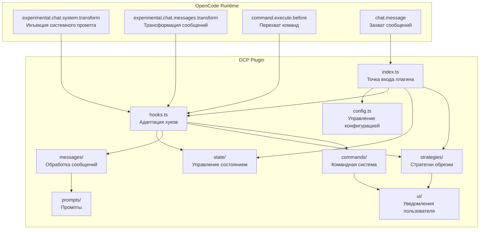
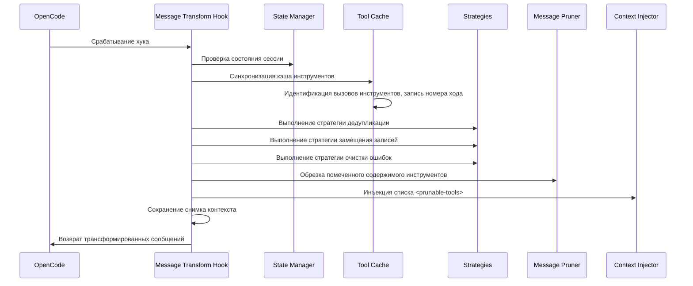
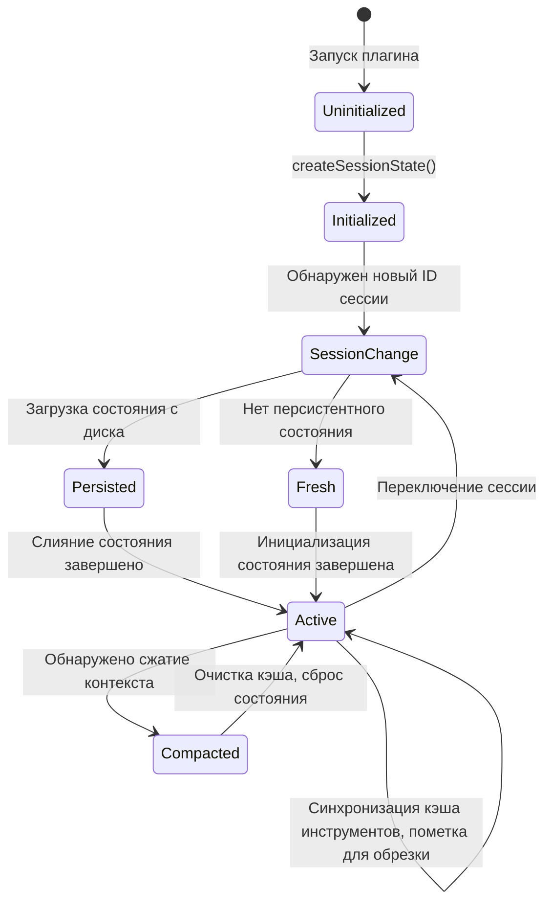
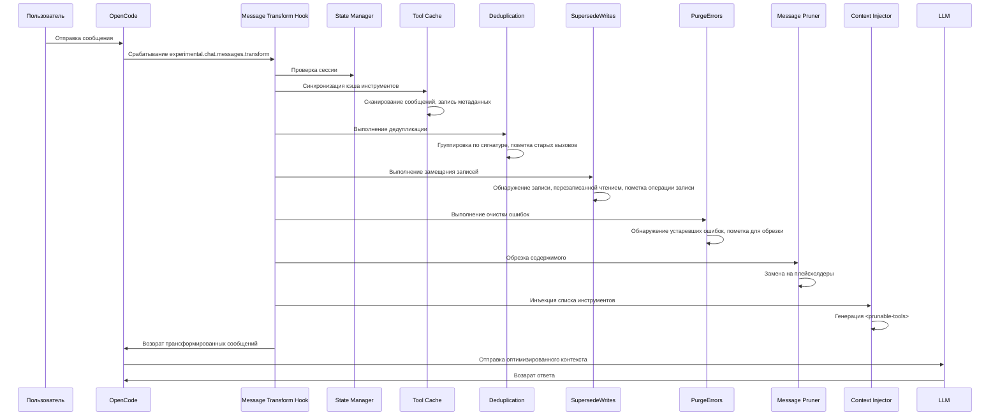
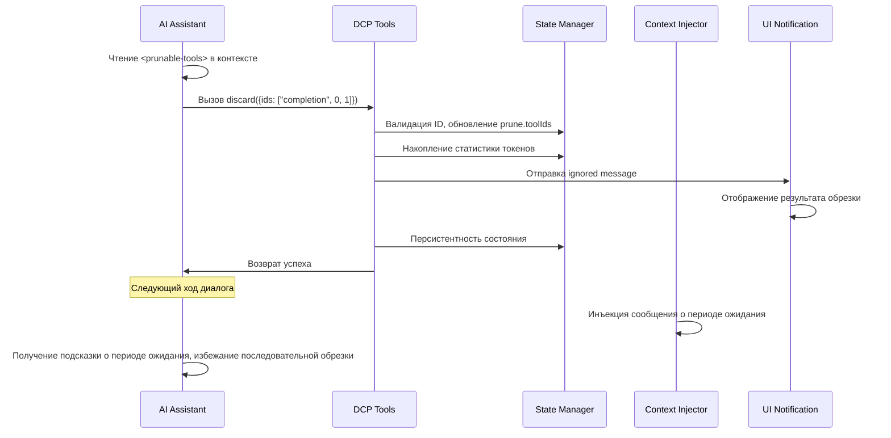

# Обзор архитектуры: Внутреннее устройство DCP

## Что вы узнаете

Этот раздел не содержит практических упражнений, а помогает глубже понять внутреннее устройство DCP. После изучения вы сможете:
- Понять, как DCP интегрируется с потоком диалога через систему хуков OpenCode
- Освоить границы ответственности и способы взаимодействия различных модулей
- Понять полную цепочку вызовов от получения сообщения до завершения обрезки
- Разобраться в принципах проектирования управления состоянием, обработки сообщений и стратегий обрезки

## Основная концепция

DCP — это плагин на базе OpenCode Plugin SDK, расширяющий возможности диалога OpenCode через регистрацию хуков и инструментов. Вся система построена вокруг концепции «трансформации сообщений» (message transform) — перед каждым ответом AI на запрос пользователя DCP сканирует, анализирует и обрезает историю диалога, после чего отправляет оптимизированный контекст в LLM.

::: info Почему «трансформация сообщений»?

OpenCode предоставляет хук `experimental.chat.messages.transform`, позволяющий плагинам модифицировать сообщения перед отправкой в LLM. Это именно та возможность, которая нужна DCP — удалить избыточные вызовы инструментов до того, как LLM увидит контекст.

:::

Система использует модульную архитектуру с чётким разделением ответственности:
- **config**: Управление конфигурацией с поддержкой многоуровневого переопределения
- **state**: Управление состоянием, поддержка runtime-состояния на уровне сессии
- **messages**: Обработка сообщений, выполнение операций обрезки и инъекции
- **strategies**: Стратегии обрезки, определение правил автоматической очистки
- **commands**: Командная система, ручное управление и запросы статистики
- **hooks**: Адаптация хуков, связь между OpenCode и модулями DCP
- **ui**: Уведомления пользователя, отображение результатов обрезки и статистики

## Диаграмма архитектуры модулей



## Точка входа плагина и инициализация

Точка входа плагина определена в `index.ts` и является единственной точкой связи DCP с OpenCode Plugin API.

### Процесс регистрации плагина

```typescript
const plugin: Plugin = (async (ctx) => {
    const config = getConfig(ctx)
    if (!config.enabled) {
        return {}
    }

    const logger = new Logger(config.debug)
    const state = createSessionState()

    return {
        "experimental.chat.system.transform": createSystemPromptHandler(...),
        "experimental.chat.messages.transform": createChatMessageTransformHandler(...),
        "chat.message": async (input, _output) => { /* кэширование variant */ },
        "command.execute.before": createCommandExecuteHandler(...),
        tool: {
            discard: createDiscardTool(...),
            extract: createExtractTool(...),
        },
        config: async (opencodeConfig) => { /* модификация конфигурации OpenCode */ },
    }
}) satisfies Plugin
```

**Этап инициализации**:
1. Загрузка конфигурации (поддержка многоуровневого слияния: значения по умолчанию → глобальные → переменные окружения → проектные)
2. Если плагин отключён, немедленный возврат пустого объекта
3. Создание системы логирования и объекта состояния сессии
4. Регистрация четырёх хуков и двух инструментов

**Этап модификации конфигурации**:
- Через хук `config` добавление инструментов `discard` и `extract` в `experimental.primary_tools`
- Регистрация команды `/dcp`

## Система хуков и трансформация сообщений

`hooks.ts` отвечает за преобразование событий хуков OpenCode во внутренние вызовы модулей DCP. Это центральный диспетчерский слой DCP.

### Хук инъекции системного промпта

```typescript
createSystemPromptHandler(state, logger, config)
```

**Момент вызова**: При каждом построении системного промпта

**Основные обязанности**:
1. Обнаружение сессии субагента (если это субагент, инъекция пропускается)
2. Обнаружение внутреннего агента (например, генератора сводки диалога, инъекция пропускается)
3. Выбор подходящего шаблона промпта в зависимости от конфигурации:
   - Включены и discard, и extract: `system/system-prompt-both`
   - Включён только discard: `system/system-prompt-discard`
   - Включён только extract: `system/system-prompt-extract`
4. Инъекция описания инструментов в системный промпт

**Зачем нужна инъекция системного промпта?**

AI должен знать, что может использовать инструменты `discard` и `extract` для оптимизации контекста. Описывая назначение этих инструментов в системном промпте, мы даём AI возможность самостоятельно решать, когда их вызывать.

### Хук трансформации сообщений

```typescript
createChatMessageTransformHandler(ctx.client, state, logger, config)
```

**Момент вызова**: Каждый раз, когда AI готовится ответить на сообщение (перед отправкой в LLM)

**Процесс обработки**:



**Ключевые шаги**:

1. **Проверка сессии** (`checkSession`)
   - Обнаружение изменения ID сессии
   - Если это новая сессия, загрузка персистентного состояния с диска
   - Обнаружение сжатия контекста (механизм summary в OpenCode), при обнаружении сжатия очистка кэша инструментов

2. **Синхронизация кэша инструментов** (`syncToolCache`)
   - Сканирование всех вызовов инструментов во всех сообщениях
   - Запись `callID`, имени инструмента, параметров, статуса, номера хода для каждого инструмента
   - Пропуск защищённых инструментов и инструментов в периоде защиты хода
   - Поддержка `nudgeCounter` (счётчик необрезанных инструментов)

3. **Выполнение автоматических стратегий**
   - `deduplicate`: Дедупликация, сохранение последнего вызова
   - `supersedeWrites`: Очистка операций записи, перезаписанных чтением
   - `purgeErrors`: Очистка входных данных устаревших ошибочных инструментов

4. **Обрезка содержимого** (`prune`)
   - Замена `output` помеченных инструментов на плейсхолдер
   - Замена `input` ошибочных инструментов на плейсхолдер

5. **Инъекция списка инструментов** (`insertPruneToolContext`)
   - Генерация списка `<prunable-tools>` (с числовыми ID, именами инструментов, сводкой параметров)
   - Инъекция напоминания (nudge) при необходимости
   - Если последняя операция была обрезкой, инъекция сообщения о периоде ожидания

6. **Сохранение снимка контекста**
   - Сохранение трансформированных сообщений в директорию логов для отладки

### Хук перехвата команд

```typescript
createCommandExecuteHandler(ctx.client, state, logger, config, ctx.directory)
```

**Момент вызова**: При выполнении команды пользователем

**Основные обязанности**:
- Перехват команд, начинающихся с `/dcp`
- Распределение по соответствующим обработчикам команд:
  - `/dcp` → Показать справку
  - `/dcp context` → Показать анализ использования токенов
  - `/dcp stats` → Показать накопленную статистику обрезки
  - `/dcp sweep [n]` → Ручная обрезка инструментов
- Блокировка обработки команды по умолчанию в OpenCode через специальную ошибку (`__DCP_*_HANDLED__`)

## Управление состоянием

Модуль `state/` отвечает за поддержку runtime-состояния на уровне сессии и персистентность.

### Основные структуры данных

**SessionState** (состояние в памяти):
```typescript
{
    sessionId: string | null,           // ID текущей сессии
    isSubAgent: boolean,               // Является ли сессия субагентом
    prune: { toolIds: string[] },       // Список ID инструментов, помеченных для обрезки
    stats: {
        pruneTokenCounter: number,      // Количество обрезанных токенов в текущей сессии
        totalPruneTokens: number,       // Накопленное количество обрезанных токенов за всё время
    },
    toolParameters: Map<string, ToolParameterEntry>,  // Кэш вызовов инструментов
    nudgeCounter: number,               // Счётчик необрезанных инструментов (для триггера напоминания)
    lastToolPrune: boolean,             // Была ли последняя операция обрезкой инструмента
    lastCompaction: number,             // Временная метка последнего сжатия контекста
    currentTurn: number,                // Номер текущего хода
    variant: string | undefined,       // Вариант модели (например, claude-3.5-sonnet)
}
```

**ToolParameterEntry** (метаданные инструмента):
```typescript
{
    tool: string,                       // Имя инструмента
    parameters: any,                    // Параметры инструмента
    status: ToolStatus | undefined,     // Статус выполнения
    error: string | undefined,          // Сообщение об ошибке
    turn: number,                       // Номер хода, на котором был создан вызов
}
```

### Жизненный цикл состояния



**Ключевые переходы состояния**:

1. **Инициализация сессии** (`ensureSessionInitialized`)
   - Обнаружение изменения `sessionID`
   - Обнаружение субагента (через `session.parentID`)
   - Загрузка `PersistedSessionState` с диска
   - Инициализация счётчика ходов и временной метки сжатия

2. **Обработка сжатия контекста**
   - Обнаружение сообщения `summary` от OpenCode (`msg.info.summary === true`)
   - Очистка кэша инструментов и списка обрезки
   - Запись временной метки сжатия для предотвращения повторной очистки

3. **Персистентность**
   - Асинхронное сохранение после завершения операции обрезки в `~/.local/share/opencode/storage/plugin/dcp/{sessionId}.json`
   - Содержит имя сессии, список обрезки, статистику, время последнего обновления

## Модуль обработки сообщений

Модуль `messages/` отвечает за фактические операции обрезки и инъекции.

### Операция обрезки (prune.ts)

**Основная функция**: `prune(state, logger, config, messages)`

**Три подфункции**:

1. **`pruneToolOutputs`**
   - Замена `output` помеченных инструментов на плейсхолдер
   - Обработка только инструментов со статусом `completed`
   - Пропуск инструмента `question` (специальная обработка)

2. **`pruneToolInputs`**
   - Обработка только инструмента `question`
   - Замена поля `questions` на плейсхолдер (сохранение ответов пользователя)

3. **`pruneToolErrors`**
   - Очистка входных параметров ошибочных инструментов
   - Сохранение сообщения об ошибке, удаление только строковых входных данных (потенциально больших параметров)

**Дизайн плейсхолдеров**:
```
[Output removed to save context - information superseded or no longer needed]
[input removed due to failed tool call]
[questions removed - see output for user's answers]
```

### Инъекция контекста (inject.ts)

**Основная функция**: `insertPruneToolContext(state, config, logger, messages)`

**Процесс**:

1. **Генерация списка инструментов** (`buildPrunableToolsList`)
   - Обход кэша инструментов с исключением:
     - Уже обрезанных инструментов
     - Защищённых инструментов (`task`, `write`, `edit` и др.)
     - Защищённых путей файлов (соответствующих `protectedFilePatterns`)
   - Генерация описания для каждого инструмента: `{numericId}: {toolName}, {paramKey}`
   - Пример: `3: read, src/config.ts`

2. **Обёртка в тег `<prunable-tools>`**
   ```html
   <prunable-tools>
   The following tools have been invoked and are available for pruning. This list does not mandate immediate action. Consider your current goals and resources you need before discarding valuable tool inputs or outputs. Consolidate your prunes for efficiency; it is rarely worth pruning a single tiny tool output. Keep your context free of noise.
   0: read, src/config.ts
   1: read, src/config.ts
   2: read, src/utils.ts
   </prunable-tools>
   ```

3. **Обработка состояния ожидания**
   - Если последняя операция была `discard` или `extract`, инъекция сообщения о периоде ожидания:
   ```html
   <prunable-tools>
   Context management was just performed. Do not use discard or extract tools again. A fresh list will be available after your next tool use.
   </prunable-tools>
   ```

4. **Инъекция напоминания**
   - Если `nudgeCounter >= nudgeFrequency`, добавление текста напоминания
   - Формат напоминания: `"You have not used context pruning in a while. Consider using discard/extract tools to reduce token usage."`

5. **Выбор позиции вставки сообщения**
   - Если последнее сообщение от пользователя, вставка синтетического сообщения пользователя
   - В противном случае вставка синтетического сообщения ассистента
   - Использование `variant` для обеспечения совместимости формата сообщений с разными моделями

## Модуль стратегий обрезки

Модуль `strategies/` определяет правила автоматической очистки.

### Стратегия дедупликации (deduplication.ts)

**Основная функция**: `deduplicate(state, logger, config, messages)`

**Алгоритм**:
1. Построение хронологического списка всех ID инструментов
2. Вычисление «сигнатуры» для каждого инструмента: `tool::normalizedParameters`
   - Нормализация параметров: удаление `null`/`undefined`
   - Сортировка ключей: обеспечение одинаковой сигнатуры для `{"b":1,"a":2}` и `{"a":2,"b":1}`
3. Группировка по сигнатуре
4. В каждой группе сохранение последнего (самого нового), пометка остальных для обрезки

**Пример**:
```typescript
// Исходные вызовы инструментов
Tool Call 1: read({filePath: "src/config.ts"})
Tool Call 2: read({filePath: "src/config.ts"})
Tool Call 3: read({filePath: "src/utils.ts"})

// Группировка по сигнатуре
Signature 1: "read::{\"filePath\":\"src/config.ts\"}" → [Tool Call 1, Tool Call 2]
Signature 2: "read::{\"filePath\":\"src/utils.ts\"}" → [Tool Call 3]

// Результат обрезки
Помечено для обрезки: [Tool Call 1]  // Сохранён Tool Call 2 (самый новый)
Сохранено: [Tool Call 2, Tool Call 3]
```

### Стратегия замещения записей (supersede-writes.ts)

**Основная функция**: `supersedeWrites(state, logger, config, messages)`

**Алгоритм**:
1. Сканирование всех вызовов инструментов в хронологическом порядке
2. Ведение таблицы отслеживания файлов:
   ```typescript
   {
       "src/config.ts": {
           lastWrite: callId,
           lastWriteTime: timestamp,
           lastRead: callId,
           lastReadTime: timestamp,
       }
   }
   ```
3. Обнаружение паттерна:
   - Если `lastWriteTime < lastReadTime` для файла, операция записи была перезаписана чтением
   - Пометка `input` этой операции записи для обрезки

**Сценарий**:
```typescript
// Временная шкала
Turn 1: write({filePath: "src/config.ts", content: "..."})  // lastWrite = call1
Turn 2: read({filePath: "src/config.ts"})                 // lastRead = call2 (перезаписало операцию записи)
Turn 3: read({filePath: "src/config.ts"})                 // Сохранение последнего чтения

// Результат обрезки
Помечено для обрезки: [вызов write из Turn 1]
```

### Стратегия очистки ошибок (purge-errors.ts)

**Основная функция**: `purgeErrors(state, logger, config, messages)`

**Алгоритм**:
1. Сканирование всех инструментов со статусом `error`
2. Проверка разницы между текущим номером хода и номером хода создания инструмента
3. Если разница > `strategies.purgeErrors.turns` (по умолчанию 4), пометка для обрезки

**Механизм защиты**:
- Сообщение об ошибке сохраняется (`part.state.error`)
- Удаляются только входные параметры (`part.state.input`), так как ошибочные входные данные могут быть большими

**Сценарий**:
```typescript
Turn 1: read({filePath: "nonexistent.txt"}) → error
Turn 2-5: Другие операции
Turn 6: Пользователь продолжает диалог

// Если purgeErrors.turns = 4
// Turn 6 - Turn 1 = 5 > 4
// Пометка входных данных ошибки Turn 1 для обрезки
```

### Инструменты, управляемые LLM (tools.ts)

**Инструмент Discard**:
```typescript
{
    name: "discard",
    description: "Remove completed task or noise tool outputs",
    parameters: {
        ids: ["completion", 0, 1, 2]  // Первый элемент — причина: 'completion' или 'noise'
    }
}
```

**Инструмент Extract**:
```typescript
{
    name: "extract",
    description: "Extract key findings then remove original tool outputs",
    parameters: {
        ids: [0, 1, 2],
        distillation: ["key finding 1", "key finding 2", "key finding 3"]
    }
}
```

**Процесс обработки**:
1. AI вызывает инструмент, предоставляя список числовых ID
2. Преобразование числовых ID в реальные `callID`
3. Проверка, что инструмент не в списке защищённых
4. Обновление `prune.toolIds`
5. Отображение результата обрезки через `ignored message`
6. Персистентность состояния

## Командная система

Модуль `commands/` предоставляет ручное управление и запросы статистики.

### Команда Context

```bash
/dcp context
```

**Вывод**: Анализ использования токенов (гистограмма)
```
╭───────────────────────────────────────────────────────────╮
│                  DCP Context Analysis                     │
╰───────────────────────────────────────────────────────────╯

Session Context Breakdown:
───────────────────────────────────────────────────────────

System         15.2% │████████████████▒▒▒▒▒▒▒▒▒▒▒▒▒▒▒▒▒▒▒▒▒▒▒│  25.1K tokens
User            5.1% │████▒▒▒▒▒▒▒▒▒▒▒▒▒▒▒▒▒▒▒▒▒▒▒▒▒▒▒▒▒▒▒▒▒▒▒▒▒▒│   8.4K tokens
Assistant       35.8% │██████████████████████████████████████▒▒▒▒▒▒▒│  59.2K tokens
Tools (45)      43.9% │████████████████████████████████████████████████│  72.6K tokens

───────────────────────────────────────────────────────────

Summary:
  Pruned:          12 tools (~15.2K tokens)
  Current context: ~165.3K tokens
  Without DCP:     ~180.5K tokens
```

**Логика расчёта**:
- System: `firstAssistant.input + cache.read - tokenizer(firstUserMessage)`
- User: `tokenizer(all user messages)`
- Tools: `tokenizer(toolInputs + toolOutputs) - prunedTokens`
- Assistant: Остаточный расчёт

### Команда Stats

```bash
/dcp stats
```

**Вывод**: Накопленная статистика обрезки
```
╭───────────────────────────────────────────────────────────╮
│                      DCP Statistics                      │
╰───────────────────────────────────────────────────────────╯

Session Pruning:
  Tools pruned: 12
  Tokens saved: ~15.2K
  Last prune:   discard (2 turns ago)

Lifetime Statistics:
  Total tokens saved: ~145.8K
```

### Команда Sweep

```bash
/dcp sweep [n]
```

**Два режима**:
1. По умолчанию: Обрезка всех инструментов после последнего сообщения пользователя
2. С указанием: `/dcp sweep 5`, обрезка последних 5 инструментов

**Процесс обработки**:
1. Поиск позиции последнего сообщения пользователя
2. Извлечение последующих вызовов инструментов
3. Фильтрация защищённых инструментов и защищённых файлов
4. Пометка для обрезки
5. Отображение результата и экономии токенов

## Система конфигурации

`config.ts` отвечает за загрузку и валидацию конфигурации.

### Приоритет конфигурации

```
Значения по умолчанию (1) < Глобальные (2) < Переменные окружения (3) < Проектные (4)
```

**Пути конфигурации**:
- Глобальный: `~/.config/opencode/dcp.jsonc`
- Переменные окружения: `$OPENCODE_CONFIG_DIR/dcp.jsonc`
- Проектный: `<project>/.opencode/dcp.jsonc`

### Процесс слияния конфигурации

```typescript
const defaultConfig = { /* жёстко закодированные значения по умолчанию */ }
const globalConfig = loadConfig(globalPath) || {}
const envConfig = loadConfig(envPath) || {}
const projectConfig = loadConfig(projectPath) || {}

const finalConfig = {
    ...defaultConfig,
    ...globalConfig,
    ...envConfig,
    ...projectConfig,
}
```

### Механизм валидации

- Использование Zod Schema для определения структуры конфигурации
- При невалидной конфигурации предупреждение через Toast и откат к значениям по умолчанию
- Автоматическое создание конфигурации по умолчанию при отсутствии файла конфигурации

## Зависимости между модулями

| Модуль | Ответственность | Зависит от | Используется в |
| --- | --- | --- | --- |
| config | Управление конфигурацией | - | index, hooks, strategies, commands |
| hooks | Адаптация хуков | config, state, logger, messages, strategies, commands | index |
| state | Управление состоянием | logger | index, hooks, strategies |
| messages | Обработка сообщений | state, logger, prompts, ui, protected-file-patterns | hooks |
| strategies | Стратегии обрезки | state, logger, messages, ui, protected-file-patterns | hooks |
| commands | Обработка команд | state, logger, messages, ui, strategies | hooks |
| ui | Уведомления пользователя | state, logger, prompts | strategies, commands |
| prompts | Управление промптами | - | hooks, messages, strategies |
| logger | Система логирования | - | index, config, hooks, strategies, state, ui, commands |

## Полная цепочка вызовов

### Процесс автоматической обрезки



### Процесс обрезки, управляемой LLM



## Соображения производительности

### Ограничения кэша инструментов

- Максимальная ёмкость: 1000 записей (`MAX_TOOL_CACHE_SIZE`)
- Стратегия очистки: FIFO (первым пришёл — первым ушёл)
- Условие срабатывания: Проверка размера после каждой синхронизации

### Система логирования

- Отладочные логи: `~/.config/opencode/logs/dcp/daily/YYYY-MM-DD.log`
- Снимки контекста: `~/.config/opencode/logs/dcp/context/{sessionId}/`
- Уровень логирования: Настраиваемый (`config.debug`)

### Обнаружение субагента

- Метод обнаружения: Проверка наличия `session.parentID`
- Стратегия обработки: Пропуск всех операций обрезки (избежание повторной обрезки)

## Итоги урока

Архитектура DCP построена вокруг концепции «трансформации сообщений» и бесшовно интегрируется с потоком диалога через систему хуков OpenCode. Система использует модульную архитектуру с чётким разделением ответственности:

- **Точка входа плагина** (`index.ts`) отвечает за регистрацию хуков и инструментов
- **Система хуков** (`hooks.ts`) отвечает за диспетчеризацию и планирование событий
- **Управление состоянием** (`state/`) отвечает за состояние на уровне сессии и персистентность
- **Обработка сообщений** (`messages/`) отвечает за фактическую обрезку и инъекцию
- **Стратегии обрезки** (`strategies/`) определяют правила автоматической очистки
- **Командная система** (`commands/`) предоставляет ручное управление
- **Система конфигурации** (`config.ts`) поддерживает многоуровневую конфигурацию

Весь процесс выполняется в хуке `experimental.chat.messages.transform`: синхронизация кэша инструментов → выполнение автоматических стратегий → обрезка содержимого → инъекция списка инструментов. Такой дизайн гарантирует, что DCP завершает оптимизацию до того, как LLM увидит контекст, сохраняя при этом поддерживаемость и расширяемость плагина.

---

## Приложение: Справочник по исходному коду

<details>
<summary><strong>Нажмите, чтобы развернуть расположение исходного кода</strong></summary>

> Дата обновления: 2026-01-23

| Функциональность | Путь к файлу | Строки |
| --- | --- | --- |
| Точка входа плагина и регистрация хуков | [`index.ts`](https://github.com/Opencode-DCP/opencode-dynamic-context-pruning/blob/main/index.ts) | 12-102 |
| Хук инъекции системного промпта | [`lib/hooks.ts`](https://github.com/Opencode-DCP/opencode-dynamic-context-pruning/blob/main/lib/hooks.ts) | 20-53 |
| Хук трансформации сообщений | [`lib/hooks.ts`](https://github.com/Opencode-DCP/opencode-dynamic-context-pruning/blob/main/lib/hooks.ts) | 55-82 |
| Хук перехвата команд | [`lib/hooks.ts`](https://github.com/Opencode-DCP/opencode-dynamic-context-pruning/blob/main/lib/hooks.ts) | 84-156 |
| Управление состоянием сессии | [`lib/state/state.ts`](https://github.com/Opencode-DCP/opencode-dynamic-context-pruning/blob/main/lib/state/state.ts) | 7-143 |
| Синхронизация кэша инструментов | [`lib/state/tool-cache.ts`](https://github.com/Opencode-DCP/opencode-dynamic-context-pruning/blob/main/lib/state/tool-cache.ts) | 11-86 |
| Персистентность состояния | [`lib/state/persistence.ts`](https://github.com/Opencode-DCP/opencode-dynamic-context-pruning/blob/main/lib/state/persistence.ts) | - |
| Обрезка сообщений | [`lib/messages/prune.ts`](https://github.com/Opencode-DCP/opencode-dynamic-context-pruning/blob/main/lib/messages/prune.ts) | 11-106 |
| Инъекция контекста | [`lib/messages/inject.ts`](https://github.com/Opencode-DCP/opencode-dynamic-context-pruning/blob/main/lib/messages/inject.ts) | 102-157 |
| Стратегия дедупликации | [`lib/strategies/deduplication.ts`](https://github.com/Opencode-DCP/opencode-dynamic-context-pruning/blob/main/lib/strategies/deduplication.ts) | 13-83 |
| Стратегия замещения записей | [`lib/strategies/supersede-writes.ts`](https://github.com/Opencode-DCP/opencode-dynamic-context-pruning/blob/main/lib/strategies/supersede-writes.ts) | - |
| Стратегия очистки ошибок | [`lib/strategies/purge-errors.ts`](https://github.com/Opencode-DCP/opencode-dynamic-context-pruning/blob/main/lib/strategies/purge-errors.ts) | - |
| Инструменты, управляемые LLM | [`lib/strategies/tools.ts`](https://github.com/Opencode-DCP/opencode-dynamic-context-pruning/blob/main/lib/strategies/tools.ts) | - |
| Команда Context | [`lib/commands/context.ts`](https://github.com/Opencode-DCP/opencode-dynamic-context-pruning/blob/main/lib/commands/context.ts) | - |
| Команда Stats | [`lib/commands/stats.ts`](https://github.com/Opencode-DCP/opencode-dynamic-context-pruning/blob/main/lib/commands/stats.ts) | - |
| Команда Sweep | [`lib/commands/sweep.ts`](https://github.com/Opencode-DCP/opencode-dynamic-context-pruning/blob/main/lib/commands/sweep.ts) | - |
| Управление конфигурацией | [`lib/config.ts`](https://github.com/Opencode-DCP/opencode-dynamic-context-pruning/blob/main/lib/config.ts) | - |
| Система логирования | [`lib/logger.ts`](https://github.com/Opencode-DCP/opencode-dynamic-context-pruning/blob/main/lib/logger.ts) | - |

**Ключевые константы**:
- `MAX_TOOL_CACHE_SIZE = 1000`: Максимальная ёмкость кэша инструментов, предотвращает неограниченный рост памяти (`lib/state/tool-cache.ts:6`)

**Ключевые функции**:
- `createSystemPromptHandler()`: Создаёт хук инъекции системного промпта, отвечает за описание доступных инструментов обрезки для AI (`lib/hooks.ts:20-53`)
- `createChatMessageTransformHandler()`: Создаёт хук трансформации сообщений, является центральным диспетчером DCP, координирует управление состоянием, выполнение стратегий, обрезку сообщений и инъекцию контекста (`lib/hooks.ts:55-82`)
- `syncToolCache()`: Синхронизирует кэш параметров инструментов, записывает метаданные каждого вызова инструмента (callID, параметры, статус, номер хода) для последующих стратегий обрезки (`lib/state/tool-cache.ts:11-86`)
- `deduplicate()`: Стратегия дедупликации, идентифицирует повторяющиеся вызовы инструментов по сигнатуре, сохраняет самый новый (`lib/strategies/deduplication.ts:13-83`)
- `supersedeWrites()`: Стратегия замещения записей, очищает входные данные операций записи, перезаписанных последующим чтением (`lib/strategies/supersede-writes.ts`)
- `purgeErrors()`: Стратегия очистки ошибок, очищает входные параметры устаревших ошибочных инструментов (`lib/strategies/purge-errors.ts`)
- `prune()`: Главная функция обрезки сообщений, вызывает три подфункции для обрезки выходных данных инструментов, входных данных инструментов и ошибочных входных данных соответственно (`lib/messages/prune.ts:11-20`)
- `insertPruneToolContext()`: Инъектирует список `<prunable-tools>` в контекст, предоставляя AI информацию об инструментах, доступных для обрезки (`lib/messages/inject.ts:102-157`)
- `createDiscardTool()`: Создаёт спецификацию инструмента discard, позволяет AI удалять выходные данные завершённых задач или шумовых инструментов (`lib/strategies/tools.ts`)
- `createExtractTool()`: Создаёт спецификацию инструмента extract, позволяет AI извлекать ключевые находки и затем удалять исходные выходные данные инструментов (`lib/strategies/tools.ts`)
- `createSessionState()`: Создаёт новый объект состояния сессии, инициализирует все поля состояния (`lib/state/state.ts:42-60`)
- `ensureSessionInitialized()`: Обеспечивает инициализацию сессии, обрабатывает переключение сессии, обнаружение субагента, загрузку состояния (`lib/state/state.ts:80-116`)

**Ключевые структуры данных**:
- `SessionState`: Runtime-состояние на уровне сессии, содержит sessionId, список обрезки, статистику, кэш инструментов, счётчик ходов и т.д. (`lib/state/types.ts:27-38`)
- `ToolParameterEntry`: Кэш метаданных отдельного вызова инструмента, содержит имя инструмента, параметры, статус, сообщение об ошибке, номер хода (`lib/state/types.ts:10-16`)
- `Prune`: Состояние обрезки, записывает список ID вызовов инструментов, помеченных для обрезки (`lib/state/types.ts:23-25`)
- `SessionStats`: Статистика сессии, содержит количество обрезанных токенов в текущей сессии и накопленное количество за всё время (`lib/state/types.ts:18-21`)

**Ключевые определения типов**:
- `ToolStatus`: Перечисление статусов выполнения инструмента, включает pending (ожидание выполнения), running (выполняется), completed (завершён), error (ошибка) (`lib/state/types.ts:8`)

</details>

---

## Анонс следующего урока

> В следующем уроке мы изучим **[Принципы расчёта токенов](../token-calculation/)**.
>
> Вы узнаете:
> - Как DCP точно рассчитывает использование токенов
> - Методы расчёта для разных типов сообщений (System, User, Assistant, Tools)
> - Механизм накопления статистики экономии токенов
> - Как отлаживать проблемы с расчётом токенов
